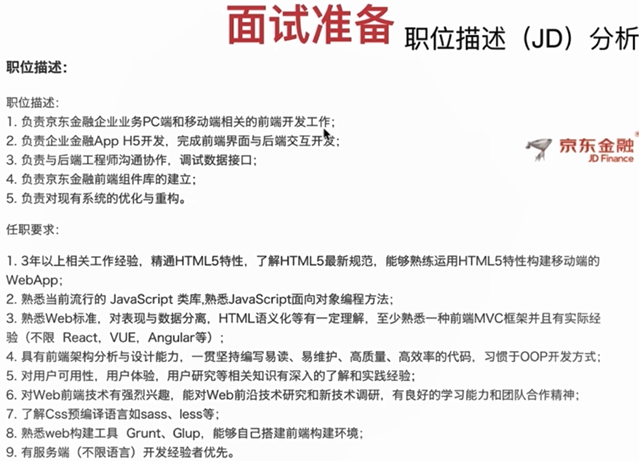
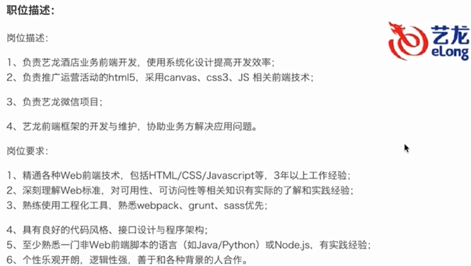

# 第1章 课程介绍

> 讲师：快乐动起来呀
>
> 很多同学对面试不够了解，不知道如何准备，对面试环节的设置以及目的不够了解，因此成功率不高。通常情况下校招生面试的成功率低于1%，而社招的面试成功率也低于5%，所以对于候选人一定要知道设立面试的初衷以及每个环节的意义，有的放矢...

## 1-1 前端面试-课程导学

1. 面试那些事
   1. JD描述怎么看
   2. 简历怎么写
   3. 知识怎么复习
   4. 问题怎么回答
   5. 项目怎么准备
   6. 和负责人怎么沟通
   7. HR印象怎么留
2. **面试准备**
   1. JD描述分析
   2. 业务分析
   3. 技术栈准备
   4. 自我介绍
3. **模拟一面**
   1. 面试技巧、页面布局类
   2. CSS盒模型、DOM事件类
   3. HTTP协议类、原型链类
   4. 面向对象类、通信类
   5. 前端安全类、前端算法类
4. **模拟二面**
   1. 面试技巧
   2. 渲染机制类
   3. JS运行机制
   4. 页面性能
   5. 错误监控
5. **模拟三面**
   1. 面试技巧
   2. 业务能力
   3. 团队协作能力
   4. 带人能力
6. **模拟终面**
   1. 面试技巧
   2. 职业竞争力
   3. 职业规划
7. **课程总结**
   1. 注意事项
   2. 复习指南
8. 授课方式
   1. 明确面试技巧
   2. 模拟题目，由浅入深
   3. 代码实战+学习指南
9. 适用对象
   1. 有前端基础
      - 对 HTML、CSS、 JavaScript知识都掌握至少提到一些概念是了解的
   2. 端正的求职心态
      - 技术过关+面试技巧=面试成功不能只靠技巧而自身不够努力
   3. 不浮躁的求知心境
      - 这门课中涉及到的一些难点需要有耐心的学习吸收心浮气躁者不宜学习
   4. 不求押题的初衷
      - 这门课努力覆盖较全的面试知识点但不是押题我们追求技术原理弄懂弄会

# 第2章 面试准备

> 通过现场分析互联网的JD，让学员掌握分析公司对技术的要求和定位，进而知道自己是否适合该岗位以及应该如何准备。想提高面试成功率一定要了解公司的业务，去分析公司对应业务的站点了解他们使用的技术栈，进而去准备相关的知识，最后一小节关于自我介绍，大多数面试失败都是简历和自我介绍导致的，只是大多数人并不自知。...

## 2-1 面试及环节设置

1. 如何看待面试
   1. 什么是面试？
      - 答：面试是测查和评价人员能力素质的一种考试活动。
      - 具体地说，面试是一种经过组织者**精心设计**，在特定场景下，以考官对考生的面对面交谈与观察为主要手段，由表及里测评考生的**知识、能力经验**等有关素质的一种考试活动。
2. 面试环节设置
   1. 一面：基础
   2. 二三面：技术负责人
   3. 三四面：业务负责人
   4. 终面：hr，沟通能力，职业规划

## 2-2 职位分析（JD）

- **职位描述解析**：做什么
  1. 至少负责两项内容，PC端和移动端
  2. App H5：hybrid app（混合app）、纯H5开发，native app（原生app）
  3. 沟通能力，数据模拟mock
  4. **难度设立**：基本功扎实，前端组件库经验，读其它UI组件库源码
  5. 优化和重构，看重经验
- **任职要求**：会什么
  1. 工作经验：非强制要求。HTML5：对答如流，学习新知识。
  2. JavaScript类库、对象
  3. 最新的Web标准。数据分离：MVVM框架。HTML语义化。MVC框架：vue、react 和实际经验，遇到过的问题。
  4. 前端架构分析设计：高级职位，把做过的项目重新分析架构。易读、易维护、高质量、高效率：易读易维护即可。
  5. 用户可用性、体验、研究：重视用户体验。
  6. 前端技术有强烈兴趣：看一些社区热门项目使用的技术，非重点准备内容。
  7. Sass、less基本使用。
  8. 搭建环境：基本技能，grunt、gulp。了解不同技术区别。
  9. 后端经验：非重点，职位没要求有Node.js需求。
- 总结：着重职位要求准备技能。东西很杂，不用全准备。

**2-3 职位分析（JD）（二）**

- 职位描述：
  1. 系统化设计：模块化设计，前后端分离。
  2. HTML5、canvas、CSS3、JS：动画（DOM动画，svg动画，canvas：2D、3D）
  3. 微信小程序、微信支付。
  4. 前端框架开发与维护：现有框架。
- 岗位要求：
  1. 精通各种技术、工作经验：不用较真。
  2. 理解Web标准：ES6，网站性能。
  3. 前端工程化工具：webpack、grunt、sass。
  4. 代码风格良好。
  5. 后端经验：熟悉Node.js 或 python。
  6. 善于沟通，逻辑清晰。

## 2-4 业务分析或实战模拟

- 分析京东金融Web页面：http://jr.jd.com
  - 导航栏组件、UI组件
  - 左中右布局
  - CSS3动画
- F12 调试工具分析网页
  - Sources
    - webpack：Vue
  - Elements
    - head：双核运行优先webkit renderer。DNS预解析：dns-perfetch。
  - Application
    - Local Storage：数据类型
    - Fonts：自定义字体

**2-5 业务分析或实战模拟（二）**

- 分析艺龙Web页面：http://elong.com
  - 微信小程序
  - 网页端不更新

## 2-6 面试准备-技术栈准备

- JS相关
  1. JQuery
  2. VUE
  3. REACT
  4. Angular
  5. Node.js
- 开发环境
  1. Sass
  2. less
  3. gulp
  4. grunt
  5. npm
  6. browserify
  7. Webpack

## 2-7 面试准备-自我陈述

- 简历
  - 基本信息，姓名-年龄-手机-邮箱-籍贯
  - 学历，博士》硕士》本科》大专
  - 工作经历，时间公司岗位职责技术栈业绩
  - 开源项目， Github和说明
- 自我陈述
  - 把握面试的沟通方向
  - 豁达、自信的适度发挥

**2-8 面试准备-自我陈述（二）**

- 实例
  - 自如谈兴趣、巧妙示实例、适时讨疑问（求知欲）
  - 节奏要适宜、切忌小聪明
- 实战
  - 方向要对，过程要细
  - 胆子要大、心态要和

# 第3章 一面/二面

描述在一面/二面要掌握什么技巧，根据前端的知识点划分并分别出一至两道面试题，根据真实面试的发问方式进行考察，并给出对应知识点的讲解、代码演示以及注意事项。

## 3-1 页面布局

- 面试技巧
  1. 准备要充分
  2. 知识要系统
  3. 沟通要简洁
  4. 内心要诚实
  5. 态度要谦虚
  6. 回答要灵活

3-2 页面布局（二）

## 3-3 页面布局（总结）

## 3-4 CSS盒模型

3-5 CSS盒模型（二）

## 3-6 DOM事件

3-7 DOM事件（二）

## 3-8 类型转换

## 3-9 HTTP协议类

## 3-10 原型链

3-11 原型链（二）

## 3-12 面向对象

3-13 面向对象（二）

## 3-14 通信类

## 3-15 安全类

## 3-16 算法类

# 第4章 二面/三面

二面/三面更侧重于对前端知识的深度和广度来进行考察，这个环节不再局限于基础知识，更多的是考察浏览器、JS引擎、项目实战等方面。本环节通过几大类题目帮大家梳理面试频率较高的重点和难点。
	4-1 渲染机制
	4-2 js运行机制
	4-3 页面性能
	4-4 错误监控
	4-5 mvvm框架（双向绑定）
	4-6 mvvm框架（设计模式）
	4-7 mvvm框架（生命周期）
	4-8 mvvm框架（源码分析）

# 第5章 三面/四面

描述在三面/四面要掌握什么技巧，在这个环节对工作2-3年的人特别重要，这个环节的面试官一般是技术负责人或者业务负责人，他们对候选人的考察不再局限于技术，更侧重综合能力。
	5-1 业务能力
	5-2 团队协作能力与带人能力

# 第6章 课程终面

这个环节同样不可忽视，情商、性格、潜力、薪资匹配度都可能成为候选人失败的“主观因素”。如何掌握面试技巧顺利拿到offer，站好最后一班岗吧
	6-1 终面（1）-职业竞争力
	6-2 终面（2）-职业规划
	6-3 终面（3）
	6-4 终面（4）
	6-5 终面（5）

# 第7章 2017真题解析

2017年各大公司笔试真题典型解析，从题干到答案，从思路到方法，层层递进，逐步揭示答题的技巧，让你在笔试中脱颖而出。
	7-1 九宫格
	7-2 一道函数考察基本功
	7-3 阿里笔试题
	7-4 flat函数设计

# 第8章 课程总结

课程会涉及很多由点到面的知识点，对课程的学习还远远不够，学习、理解、吸收还需要自身的努力才能发挥更佳的效果，大家加油。
	8-1 面试总结