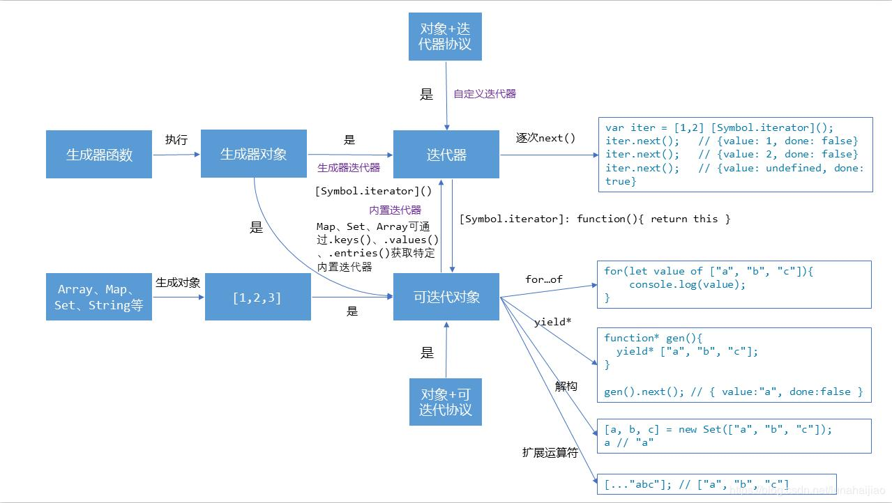

〖课程介绍〗:
  应对更复杂的场景，提升自己的技术实力，优化臃肿的代码，都需要对打牢语法基础。本课涉及JavaScript ES6到10的语法教学，内容全面丰富，熟练掌握语法，很多依赖第三方库才能做到的事用原生JS寥寥几行代码就可迎刃而解。

〖课程目录〗:

#   第1章 课程介绍与环境搭建

  JS作为前端的立身之本，让大家了解学习这门课的必要性。考虑到很多同学刚刚接触前端或者对工程化方法不太了解，为了快速进入到学习状态，我们提供了极其简单的方式帮大家准备好学习环境。

##    1-1 课程导学 试看

### 怎么学？

1. 一天后：体验乐趣
2. 十天后：进入状态
3. 一个月后：养成习惯
4. 三个月后：收获知识
5. 五个月后：形成思维习惯

### 课程内容

1. 快速搭建开发环境
2. 学习语法
3. 推荐阅读材料
4. 练习题
5. Vue 框架内实战
6. 学习开发环境如何构建

### 适用人群

1. 拥有 JavaScript ES3 以上基础
2. 会编程，有编程思维
3. 有耐心
4. 求上进

1-2 电子书位置

##    1-3 环境准备

环境准备

- 原理
  1. ES6-10 ：原生代码
  2. Babel→Webpack ：构建转换
  3. ES5 ：浏览器可以识别的代码

- 开发环境
  - Chrome和Node环境
  - 自动刷新 自动编译
  - 格式化编写代码

##    1-4 Node 安装

- Node 安装：`-v 12.2.0`
  - npm
  - npx

##    1-5 初始化项目

初始化项目

```
npx es10-cli create projectName // 创建模板文件命令
```

启动项目

```
cd projectName
npm install
npm start
touch static/lesson2-1.js // 新建文件命令
```

##    1-6 编辑器配置

VS code 插件 beautify 和 ESLint

1. 课程框架框架运行逻辑：
   1. `app.js`
   2. `routes/user.js`
   3. `index.min.js`
   4. `js/index.js`
   5. `lesson2-1.js`
2. 修改`js/index.js` 内 `import './lesson2-1'` 代码实现更换课程项目代码。


#   第2章 ES6基础知识

  ES6语法相对于ES5有了非常大的改变，让原生 JavaScript 能力再上一个台阶，这个章节会分门别类进行讲述，单纯讲语法既乏味也不利于记忆更不知道如何运用，我们以应用场景开场分别给出ES5和ES6两种不同的解决方案，循序渐进剖析语法...

## Let &amp; Const

###    2-1 作用域（1）

1. var 声明的全局变量相当于 window 的属性，但无法删除，属性可以删除
2. 没有var 定义的变量是作为 window 的属性定义的，是全局属性
3. 在函数内部没有 var 定义的变量是window 的属性，是全局属性

###    2-2 作用域（2）

- 函数作用域 = 局部作用域
- var 定义的变量会变量提升
- let 定义的变量具有块状作用域

**this 与 动态作用域 的关系**

- this 具有动态指向

**四种作用域**

1. 全局作用域
2. 函数作用域
3. 块状作用域 ，配合 let 和 const 使用
4. 动态作用域

###    2-3 什么是作用域

几乎所有编程语言就是在变量中储存值，并且能够读取和修改这些值。事实上在变量中储存和取出值得能力，给程序赋予了状态。

如果没有这样的概念，一个程序虽然可以执行一些任务，但是它们将会受到极大的限制而且不会非常有趣。

但是这些变量该储存在哪？又如何读取？为了完成这个目标需要制定一些规则，规则就是：作用域。

- #### 四种常见作用域类型：

  | 对象     | 类型                     |
  | -------- | ------------------------ |
  | global   | 全局作用域               |
  | function | 函数作用域（局部作用域） |
  | {}       | 块状作用域               |
  | this     | 动态作用域               |

- > 如果一个变量 或者其它表达式不在“当前得作用域”，那么JavaScript机制会继续沿着作用域链上查找直到找到全局作用域，通常是指沿着链式得作用域查找，而不能从父作用域引用子作用域中的变量和引用

###    2-4 let&amp;const

- let 声明的特点
  - 块状作用域
  - 不能用用全局变量的属性访问
  - 不能重复定义
  - 不会变量提升
- const 声明的特点
  - **只能赋值一次**
  - **初始化时一定要赋值**
  - 块状作用域
  - 不能用用全局变量的属性访问
  - 不能重复定义
  - 不会变量提升
- 阅读
  1. 什么是作用域
  2. JavaScript深入之词法作用域和动态作用域
  3. 深入理解JS中声明提升、作用域（链）和 this 关键字

## 数组 - Array

###    2-6 ES5中数组有多少种遍历的方法？

他们有什么优势和缺点？

1. for 循环

2. forEach ：`arr.forEach(funciton (item) {console.log(item)})`

   > 不支持 `break` 和 `continue`
   >
   > return false 相当于 continue
   >
   > 隐式索引

3. every ：`arr.every(funciton (item) {console.log(item)})`

   > 是否继续执行取决于函数返回值 true 、false
   >
   > 如果数组中检测到有一个元素不满足，则整个表达式返回 *false* ，且剩余的元素不会再进行检测。
   >
   > 如果所有元素都满足条件，则返回 true。

4. some：依次执行数组的每个元素：

   > 如果有一个元素满足条件，则表达式返回*true* , 剩余的元素不会再执行检测。
   >
   > 如果没有满足条件的元素，则返回false。

5. for in ：`for ( let index in Object) {console.log(Object[index])}`

   > 为对象设计的，数组的属性和下标作为字符串遍历
   >
   > 支持 continue 和 break

### 2-7 ES6中数组有多少种遍历的方法？

1. for of ：`for (let item of arr) { console.log(item)}`

   > 不仅可以遍历数组和对象
   >
   > 可以遍历自定义数据结构

2.  map()

   > map() 方法返回一个新数组，数组中的元素为原始数组元素调用函数处理后的值。
   >
   > map() 方法按照原始数组元素顺序依次处理元素。
   >
   > 这种方式也是用的比较广泛的，虽然用起来比较优雅，但实际效率还比不上foreach

###    2-8 Array.from（如何将伪数组转换成数组？）

**ES5**

```js
let args = [].slice.call(arguments) // collection
let imgs = [].slice.call(doncument.querySelectorAll('img')) // NodeList
```

**ES6**

- `Array.from(arrayLike, mapFn, thisArg)`

  > ES6 新增方法，专门转换伪数组到数组，也可用于生成数组

```js
Array.prototype.from // ES6 新增方法
Array.from(arrayLike, mapFn, thisArg) // 语法 伪数组，函数返回值，this指向
let args = Array.from(arguments)
```

**什么叫伪数组**

1. 按照索引方式存储数据
2. 具有 length 属性

```js
let array = Array.from({ length: 5}, function () { return 1})
```


###    2-9 Array.of-fill（如何生成新数组？）

ES6 新方法

- Array(5) ：初始化长度为5的数组
- new Array(1,2,3)：初始化数组，同时生成数据

-  Array.of(1,2,3)：初始化数组，同时生成数据
- Array.fill(value,start,end)：填充数据

```js
// Array.prototype.of
let array = Array.of(1,4,5,2,67)

// Array.prototype.fill
let array = Array(10).fill(1)

Array.fill(value,start,end) // 语法 填充值，起始位，截止值。 默认填充所有元素
console.log(array.fill(9, 5, 8))
```


###    2-10 Find&amp;FindIndex（如何查找数组？）

- array.filter(fn)：ES5，返回符合fn 条件的所有值，没有则为空

- Array.find(fn)：ES6，查找数组中符合fn 条件的第一个值，并返回，没有则为 undefined
- Array.findIndex()：ES6，返回位置，未找到则-1

```js
let array = Array.of(1, 4, 5, 2, 67)
let find = array.filter(function (item) {
  return item % 2 === 0
})
// 查找下标
let find = array.findIndex(function (item) {
  return item === 0
})
console.log(find);
```


## Class Update

###    2-12 Class基础语法（怎么声明一个类？）

ES5中怎么声明一个类

- ```JS
  let Animal = function (type) {
    this.type = type
  }
  
  Animal.prototype.eat = function () {
    console.log('you are eatting food hello');
  }
  let dog = new Animal('food')
  let cat = new Animal('fish')
  
  console.log(dog)
  console.log(cat)
  
  // 修改实例对象原型链上的方法
  cat.constructor.prototype.eat = function () {
    console.log('error')
  }
  dog.eat()
  cat.eat()
  ```

  

ES6中声明一个类

- ```JS
  class Animal {
    constructor(type) {
      this.type = type
    }
    eat() {
      console.log('i am food')
    }
  }
  
  let dog = new Animal('food')
  let cat = new Animal('fish')
  
  console.log(dog)
  console.log(cat)
  
  // 修改实例对象原型链上的方法
  cat.constructor.prototype.eat = function () {
    console.log('error')
  }
  dog.eat()
  cat.eat()
  
  console.log(typeof Animal);
  ```

  

###    2-13 Setter&amp;Getter（如何读写属性？）

ES6：set 和 get

- 可以把属性写成函数，调用时先运行函数

```JS
let _age = 4
class Animal {
  constructor(type) {
    this.type = type
  }
  get age() {
    return _age
  }
  set age(val) {
    if (val < 7 && val > 4) {
      _age = val
    } else {
      console.log("err")
    }
  }
  eat() {
    console.log('i am food')
  }
}
let dog = new Animal
dog.age = 52
console.log(dog.age)
```


###    2-14 Static Methods（如何操作方法？）

对象实例的方法和类的静态方法

```JS
// ES5
let Animal2 = function (type) {
  this.type = type
}
Animal2.prototype.eat = function () {
  Animal2.walk()
  console.log('you are eatting food hello');
}
Animal2.walk = function () {
  console.log('i am walking');
}
let dog = new Animal2('dog')
dog.eat()
```


- static 与实例对象隔离，拿不到实例对象

```JS
// ES6 专有语法定义静态方法
class Animal {
  constructor(type) {
    this.type = type
  }
  eat() {
    Animal.walk()
    console.log('i am food')
  }
  static walk() {
    console.log('i am flying');
  }
}
let dog = new Animal('dog')
dog.eat()
```

什么时候用实例对象的方法，什么时候用类的静态方法？

- 方法依赖于实例对象的属性或方法，要引用实例对象的信息时必须使用实例对象的方法
- 方法不会涉及实例对象的属性或方法，可以用类的静态方法

###    2-15 Sub Classes（如何继承一个类？）

ES5继承的一种方法

```JS
let Animal = function (type) {
  this.type = type
}
Animal.prototype.eat = function () {
  Animal.walk()
  console.log('you are eatting food hello');
}
Animal.walk = function () {
  console.log('i am walking');
}

let Dog = function (type) {
  // 初始化父类的构造函数
  Animal.call(this, type)
  this.run = function () {
    console.log('runnig');
  }
}
Dog.prototype = Animal.prototype

let dog = new Dog('dog')
dog.run()
dog.eat()
console.log(dog.type);
```


ES6中如何继承 extends

```JS
class Animal {
  constructor(type) {
    this.type = type
  }
  eat() {
    Animal.walk()
    console.log('i am food')
  }
  static walk() {
    console.log('i am flying');
  }
}
class Dog extends Animal {
  constructor(type) {
    super(type)
    this.age = 2
  }
}
let dog = new Dog('dog')
dog.eat()
```


## Function Update

- 函数参数升级，参数支持表达式、默认参数、不确定参数

###    2-17 Default Parameters（函数参数的默认值）

ES5

```JS
function fn(x, y, z) {
  if (y === undefined) {
    y = 3
  }
  if (z === undefined) {
    z = 4
  }
  return x + y + z
}
console.log(fn(2, 10, 30))
```


ES6

```js
// 没有参数的往前写，否则默认没参数的为字符串类型
function fn(x, y, z = x + y) {
  // ES6中废弃arguments
  // console.log(Array.from(arguments))
  // fn.length 可以获取到定义过的没有默认值的参数个数
  console.log(fn.length)

  return x + y + z
}
console.log(fn(10, 10, 10))
console.log(fn(10, 10, undefined), 4, 12)
```


###    2-18 Rest Parameter（怎么处理不确定参数？）

ES5

```JS
ES5
function sum() {
  let num = 0
  Array.prototype.forEach.call(arguments, function (item) {
    num += item * 1
  })
  return num
}
console.log(sum(1, 2, 3, 4))

```


ES6

```JS
// ES6
function sum(base, ...nums) {
  // "...nums" Rest parameter 用来获取所有参数：函数执行时的参数，是数组，参数可以分别使用
  let num = 0
  nums.forEach(function (item) {
    num += item * 1
  })
  return num + base * 2
}
console.log(sum(1, 2, 3, 4))
```


###    2-19 Spread Operator（rest参数的逆运算）

ES5

```JS
// rest参数的逆运算
// ES5
function sum (x = 1, y = 2, z = 3) {
  return x + y + z
}
let data = [1, 2, 3]
console.log(sum.apply(this, data))
```


ES6

```JS
function sum (x = 1, y = 2, z = 3) {
  return x + y + z
}
let data = [1, 2, 3]
// ES6
// spread
console.log(sum(...data))
```


###    2-20 Arrow Functions（箭头函数）

- ()=>{}

```JS
let hello = (name, city) => {
  console.log(name, 'hello', city)
}
hello('zhangsan', 'imooc')
// 只有一个参数省略括号
let hi = name => {
  console.log(name)
}
hi('zhangsan')
// 后面是表达式，省略花括号
let sum = (x, y, z) => x + y + z
console.log(sum(1, 2, 3))
// 以对象返回数据，小括号相当于表达式，花括号是对象的
let sum2 = (x, y, z) => ({
  x: x,
  y: y,
  z: z
})
console.log(sum2(1, 2, 3))
// webpack eval 让 this 指向了空对象
// ES6 中this 指向写函数时的对象
let test = {
  name: 'test',
  say: () => {
    console.log(this.name)
  }
}
test.say()
```


## Object Update

- Object 的 key 可以用变量或表达式，对象的方法支持异步
- 语法：object[key] = value

###    2-23 Set数据结构

- 元素可以是任意值：new Set([1, '2', 4])
- .add(item)
- .delete(item)
- .clear()
- .size
- for of

```JS
// set存储的数据是唯一的，重复数据会被过滤
let s = new Set([1, '2', 4])
s.add('hellos').add('hellos').add('hellos2')
s.delete('hellos')
// s.clear()
console.log(s.has('hellos2'), s.size)
console.log(s.values())
console.log(s.keys())
console.log(s.entries())
s.forEach(item => {
  console.log(item)
})
for (let item of s) {
  console.log(item)
}
```

- weakSet()
  - 语法相同于set，但只能存储对象

###    2-24 Map数据结构

- 键值对可以是**任意值**：new Map([[1, 2], [2, 3]])
- .set(key,value)
- .delete(key)
- .clear
- .size
- .has(key)
- .get(key)
- .keys() ：键
- .values() ：值
- .entries() ：键值对
- forEach((value,key)) ：value 在前
- for (let [key, value] of map) ：按初始化顺序遍历

```JS
// map
let map = new Map([[1, 2], [2, 3]])
// 添加
map.set(3, 4)
// 修改
map.set(1, 5)
// 删除
map.delete(3)
// console.log(map.size)
// console.log(map.has(3))
// console.log(map.get(2))
// console.log(map.keys(), map.values(), map.entries())
// map.forEach((value, key) => {
//   console.log(value, key)
// })
for (let [key, value] of map) {
  console.log(key, value)
}
let o = function () {
  console.log('o')
}
map.set(o, 9)
console.log(map.get(o))
```

- weakMap()
  - 语法相同于Map，但只能存储对象

###    2-25 Object.assign（对象拷贝）

- 当对象中只有一级属性，没有二级属性的时候，此方法为深拷贝，但是对象中有对象的时候，此方法，在二级属性以后就是浅拷贝。

```JS
// object copy
const target = {
  a: {
    b: {
      c: {
        d: 4
      }
    },
    e: 7
  },
  undefined: null
}
const source = {
  a: {
    b: {
      c: {
        null: null
      }
    }
  },
  f: 2
}
Object.assign(target, source)
console.log(target, 'source')
```


###    2-26 Object Property(存储数据)

- 对象属性简写
  1. 支持变量或表达式
  2. 只能用常规函数
  3. 异步函数名称前加 `*` 

```JS
let x = 1
let y = 2
let z = 8
// ES5
let obj = {
  x: x,
  y: y,
  hello: function () {
    console.log('hello ES5')
  }
}
obj[z] = 3
obj.hello()
console.log(obj)

// ES6 对象属性简写
let obj2 = {
  x,
  y,
  [z + y]: 6, //支持变量或表达式
  hello () {
    // 只能用常规函数
    // 异步函数名称前加 * , Generator
    console.log('hello ES6')
  }
}
obj2.hello()
console.log(obj2)
```


## RegExp Update

###    2-27 Regexp Sticky（y修饰符）

- sticky 粘连：从上次匹配完剩余字符串的第一位开始匹配，可以连续匹配

```JS
const s = 'a_aa_aaa_aa_a'
const r1 = /a+/g
const r2 = /a+/y
console.log(r1.exec(s))
console.log(r2.exec(s))
console.log(r1.exec(s))
console.log(r2.exec(s))
```


###    2-28 Regexp Unicode（u修饰符）

- 处理 Unicode 字符的，**所有中文都加 u**

```JS
// unicode u修饰符 大于 \uffff
let s = '𠮷'
let s2 = '\uD842\uDF87'

console.log(/^\uD842/.test(s2))
console.log(/^\uD842/u.test(s2)) // 无法匹配

console.log(/^.$/.test(s)) // 无法匹配
console.log(/^.$/u.test(s)) // 正确匹配, 使用 "." 大于两个字节要加 u

console.log(/^\u{20BB7}$/u.test(s))
console.log(/^\u{61}$/u.test('a')) // 使用码点时，加 u 才能匹配 \u

console.log(/𠮷{2}/u.test('𠮷𠮷')) // 加 u 才能匹配，所有中文都加 u

console.log(/[a-z]/i.test('\u212A'))
console.log(/[a-z]/iu.test('\u212A'))
```


## Template 字符串模板

###    2-30 String（字符串拼接问题）

- ES中字符串换行、包含变量或表达式、包含逻辑运算怎么办？
  - ES6更优雅的便捷的方式
- ${变量/表达式}：字符串模板
- 函数处理字符串模板

```JS
let s1 = `我是第一行
我是第二行`
console.log(s1)
```

```JS
function Price (strings, type) {
  let s1 = strings[0]
  const retailPrice = 20
  const wholeSalePrice = 16
  let showTxt = ''
  if (type === 'retail') {
    showTxt = '单价是：' + retailPrice
  } else {
    showTxt = '批发价是：' + wholeSalePrice
  }
  return `${s1}${showTxt}`
}
let showTxt = Price`您此次的${'retail'}`
console.log(showTxt)
```


## Desctructuring 解构赋值

- ES5 从一个复杂的数据结构中提取数据是如何做的？
- ES6 的方式

###    2-32 Array Destructure（解构赋值）

1. 可以跳过赋值元素
2. 赋值元素可以是任意可遍历对象
3. 左边的变量还可以是对象的属性，不局限于变量
4. 解构赋值在循环体中配合 entries 使用，map 对象也可以用
5. rest 参数防止回收

```JS
let arr = ['hello', 'world', 'three']
let [firstName, , surName] = arr
console.log(firstName, surName)

let [firstName,, thirdName] = new Set([1, 2, 3, 4])
console.log(firstName, thirdName)

// 修改内容
let user = {
  name: 's',
  surname: 't'
};
[user.name, user.surname] = [1, 2]
console.log(user)
for (let [k, v] of Object.entries(user)) {
  // 隐式赋值，显式索引
  console.log(k, v)
}

// ...last 防止回收
let arr = [1, 2, 3, 3, 4, 5, 6, 7]
let [firstName, curName, ...last] = arr
console.log(firstName, curName, last)

// 无数据就是 未定义
let arr = []
// 解构赋值取决于里面有没有值
let [firstName, curName, ...last] = arr
console.log(firstName, curName, last)

```


###    2-34 Object Destructrue（解构赋值）

- 变量用花括号，数据结构层层对应

```JS
// Object 的解构赋值
let options = {
  title: 'menu',
  width: 100,
  height: 200
}
let { title: title2, width = 130, height } = options
let { title, ...last } = options
console.log(title, last)

// 多层结构的解构赋值
let options = {
  size: {
    width: 100,
    height: 200
  },
  items: ['Cake', 'Donut'],
  extra: true
}
let { size: { width, height }, items: [, item2], extra } = options
console.log(width, height, item2, extra)
```


## Promise 异步操作

### 2-36 Callback（异步操作）

- 回调地狱

```JS
function loadScript (src, callback) {
  let script = document.createElement('script')
  script.src = src
  script.onload = () => {
    callback(src)
  }
  document.head.append(script)
}

function test (name) {
  console.log(name)
}
loadScript('./1.js', function (script) {
  loadScript('./2.js', function (script) {
    loadScript('./3.js', function (script) {
      test('log')
    })
  })
})

```


###    2-37 Promise（异步操作）

```JS
function loadScript (src) {
  return new Promise((resolve, reject) => {
    let script = document.createElement('script')
    script.src = src
    script.onload = () => resolve(src) // 状态：fullfilled, 结果： result
    script.onerror = (err) => reject(err) // 状态：rejected,结果： error
    document.head.appendChild(script)
  })
}

loadScript('./1.js')
  .then(loadScript('./2.js'))
  .then(loadScript('./3.js'))
```

###    2-38 Then（异步操作）

- `promise,then(onFullfilled,onRejected) // onFullfilled 必选`
  1. .then 是promise 对象原型上的**实例方法**，必须是promise 对象才能调用
  2. then 支持两个函数类型参数，
     1. fullfilled 对应resolve 必选
     2. rejected 对应reject，可选
  3. 如果传入**空对象**，会返回一个空的 promise 对象 
  4. 参数函数里 return 一个 promise 对象，才能不返回空对象

```JS
function loadScript (src) {
  // penging, undefined
  return new Promise((resolve, reject) => {
    let script = document.createElement('script')
    script.src = src
    script.onload = () => resolve(src) // 状态：fullfilled, 结果： result
    script.onerror = (err) => reject(err) // 状态：rejected,结果： error
    document.head.appendChild(script)
  })
}

loadScript('./1.js')
  .then(() => {
    return loadScript('./4.js')
  }, (err) => {
    console.log(err)
  })
  .then(() => {
    return loadScript('./3.js')
  }, (err) => {
    console.log(err)
  })

// promise,then(onFullfilled,onRejected) // onFullfilled 必选
```


###    2-39 Resolve &amp; Reject（异步操作）

- Promise的**静态方法**，使用时必须 Promise.resolve 或 Promise.reject

```js
function test (bool) {
  if (bool) {
    return new Promise(resolve => {
      resolve(20)
    })
  } else {
    return Promise.reject(new Error('myError'))
  }
}
test(0).then((value) => {
  console.log(value)
}, (err) => {
  console.log(err)
})

```


###    2-40 Catch（异步操作）

- 捕获链式异步操作中的异常
- .catch 是promise 对象的**实例方法**，必须是promise 对象才能调用
- promise 状态改变时捕获，只能用reject 报错，不能用 throw new Error触发错误

```JS
function loadScript (src) {
  // penging, undefined
  return new Promise((resolve, reject) => {
    let script = document.createElement('script')
    script.src = src
    script.onload = () => resolve(src) // 状态：fullfilled, 结果： result
    script.onerror = (err) => reject(err) // 状态：rejected,结果： error
    document.head.appendChild(script)
  })
}

loadScript('./1.js')
  .then(() => {
    return loadScript('./2.js')
  })
  .then(() => {
    return loadScript('./30.js')
  })
  .catch(err => {
    console.log(err)
  })

```


###    2-41 All（异步操作）

- **静态方法**
- 并行异步操作，合并多个异步数据成一个 promise

```JS
// All 操作
function loadScript (src) {
  // penging, undefined
  return new Promise((resolve, reject) => {
    let script = document.createElement('script')
    script.src = src
    script.onload = () => resolve(src) // 状态：fullfilled, 结果： result
    script.onerror = (err) => reject(err) // 状态：rejected,结果： error
    document.head.appendChild(script)
  })
}

const p1 = loadScript('./2.js')
const p2 = loadScript('./1.js')
const p3 = loadScript('./3.js')
Promise.all([p2, p1, p3]).then((value) => {
  console.log(value, 'log')
})
```


###    2-42 Race（异步操作）

- **静态方法**
- 只保留先返回的值

```JS
// race
const p1 = () => {
  return new Promise((resolve, reject) => {
    setTimeout(function () {
      resolve(1)
    }, 3000)
  })
}
const p2 = () => {
  return new Promise((resolve, reject) => {
    setTimeout(function () {
      resolve(2)
    }, 2000)
  })
}
Promise.race([p1(), p2()]).then((value) => {
  console.log(value)
})

```


## Reflect 反射制

### 2-44 Reflect.apply（反射机制）

  Java 的反射机制是在编译阶段不知道是哪个类被加载 ，而是在运行的时候加载、执行

```js
console.log(Math.floor.apply(null, [3.111]))

console.log(Reflect.apply(Math.floor, null, [2.33]))

let price = 90.12
console.log(Reflect.apply(price > 100 ? Math.floor : Math.ceil, null, [price]))
```


###    2-45 Reflect.construct（反射机制）

- 动态实例化一个类

```js
let d = Reflect.construct(Date, [])
console.log(d.getTime(), d instanceof Date)
```

- `Reflect.defineProperty` 新增对象属性
  - 与 Object 区别在于返回值不同，Reflect 返回true/false，Object 返回对象
  - 所有具备反射机制的功能性函数都会放到Reflect 上面去
  - 将来Object 中可能会移除这些方法
- `Reflect.get` 读取数据操作

```JS
const student = {}
const r2 = Object.defineProperty(student, 'name', { value: 'Mike' })
// console.log(student)
const r = Reflect.defineProperty(student, 'name', { value: 'Mike2' })
console.log(student, r, r2)

const obj = { x: 1, y: 2 }
// Reflect.deleteProperty(obj, 'x')
console.log(obj)
console.log(Reflect.get(obj, 'y'))
console.log(Reflect.get([3, 4], 1))
```


###    2-46 Reflect.getOwnPropertyDescriptor（反射机制）

- 获取属性描述符
- `Reflect.getPrototypeOf(obj)` ：**获取实例对象的原型对象**
- `Reflect.has(obj, 'property')`：验证对象下面有没有这个属性，Object 没有这个方法
- `Reflect.isExtensible(obj)`：是否可扩展，是否被冻结了
  - `Object.freeze(obj)`：冻结对象，不可扩展
- `Reflect.ownKeys()`：返回对象的键
- `Reflect.preventExtensions(obj) `：效果和 freeze 相同
- `Reflect.set(obj,'z','1')` ：设置数据
- `Reflect.setPrototypeOf(obj,'type')` ：**设置实例对象的原型对象**

```js
const obj = { x: 1, y: 2 }
// console.log(Reflect.getOwnPropertyDescriptor(obj, 'x'))
// console.log(Object.getOwnPropertyDescriptor(obj, 'y'))

// let d = new Date()
// console.log(Reflect.getPrototypeOf(d))
// console.log(Object.getPrototypeOf(obj))

// console.log(Reflect.has(obj, 'y'))
// Object.freeze(obj)
// obj.z = 3

// console.log(Reflect.isExtensible(obj), obj)
// console.log(Reflect.ownKeys(obj))
// console.log(Reflect.ownKeys([1, 2, 3]))
// Symbol

// Reflect.preventExtensions(obj) // 效果和 freeze 相同
// console.log(Reflect.isExtensible(obj))

Reflect.set(obj, 'z', 1)
console.log(obj)
const arr = ['a', 'w', 's']
Reflect.set(arr, 3, 'oioo')
console.log(arr)

console.log(Reflect.getPrototypeOf(arr))
Reflect.setPrototypeOf(arr, String.prototype)
console.log(Reflect.getPrototypeOf(arr))

```


## Proxy 代理

###    2-48 proxy basic syntax（该怎样使用代理功能）

- new Proxy(obj, data)

```JS
// let o = {
//   name: 'xiaoming',
//   price: 190
// }
// let d = new Proxy(o, {
//   get (target, key) {
//     if (key === 'price') {
//       return target[key] + 20
//     } else {
//       return target[key]
//     }
//   }
// })
// console.log(d.price, d.name)

let o = {
  name: 'xiaoming',
  price: 190
}
let d = new Proxy(o, {
  get (target, key) {
    return target[key]
  },
  set (target, key, value) {
    return false
  }
})
d.price = 700
console.log(d.price, d.name)

// ES5 中完全禁止修改元素属性
for (let [key] of Object.entries(o)) {
  Object.defineProperty(o, key, {
    writable: false
  })
}
o.price = 300
console.log(o.name, o.price)
```


###    2-49 Schema Validation（1模式验证）

```js
// 拦截 校验
let o = {
  name: 'xiaoming',
  price: 190
}
// 按功能模块化
let validator = (target, key, value) => {
  if (Reflect.has(target, key)) {
    if (key === 'price') {
      if (value > 300) {
        return false
      } else {
        target[key] = value
      }
    } else {
      target[key] = value
    }
  } else {
    return false
  }
}
let d = new Proxy(o, {
  get (target, key) {
    return target[key] || ''
  },
  set: validator
})
d.price = 320
d.name = 'lisi'
d.age = 123
console.log(d.price, d.name, d.age)
```


###    2-50 Schema Validation（2模式验证）

```js
// 拦截 校验
let o = {
  name: 'xiaoming',
  price: 190
}
// 监听错误
window.addEventListener('error', (e) => {
  console.log(e.message)
  // report('./')
}, true)
// 按功能模块化
let validator = (target, key, value) => {
  if (Reflect.has(target, key)) {
    if (key === 'price') {
      if (value > 300) {
        // 不满足条件触发错误
        throw new TypeError('price exceed 300')
      } else {
        target[key] = value
      }
    } else {
      target[key] = value
    }
  } else {
    return false
  }
}
let d = new Proxy(o, {
  get (target, key) {
    return target[key] || ''
  },
  set: validator
})
d.price = 320
d.name = 'lisi'
d.age = 123
console.log(d.price, d.name, d.age)
```


### 2-51 Schema Validation（3模式验证）

```js
// 代理生成ID, 随机\唯一\只读
class Component {
  constructor () {
    this.proxy = new Proxy({
      id: Math.random().toString(36).slice(-8)
    }, {})
  }
  get id () {
    return this.proxy.id
  }
}
let com = new Component()
let com2 = new Component()
for (let i = 0; i < 10; i++) {
  console.log(com.id, com2.id)
}
com.id = 'abc'
console.log(com.id, com2.id)
```


###    2-52 Revocable Proxy (可撤销代理)

```JS
// 可撤销代理
let o = {
  name: 'xiaoming',
  price: 190
}
let d = Proxy.revocable(o, {
  get (target, key) {
    if (key === 'price') {
      return target[key] + 20
    } else {
      return target[key]
    }
  }
})
console.log(d)
console.log(d.proxy.price)
console.log(d.revoke)
setTimeout(function () {
  d.revoke()
  setTimeout(function () {
    console.log(d.proxy.price)
  }, 100)
}, 1000)
```

- 练习
  1. 组件初始化的时候都赋值一个可读而且随机的 ID, 该怎么做?
  2. 临时代理有哪些应用场景呢?
  3. 如何把接口的数据用代理进行包装?

## Generator 生成器

###    2-54 Generator（如何让遍历“停”下来）

- ES6如何让遍历停下来?

```JS
// ES5
// function loop () {
//   for (let i = 0; i < 5; i++) {
//     console.log(i)
//   }
// }
// loop()

// ES6
function * loop () {
  for (let i = 0; i < 5; i++) {
    yield console.log(i)
  }
}
const l = loop()
l.next()
l.next()
l.next()
l.next()
l.next()
l.next()
```


###    2-55 Syntax（1语法）

- `function * loop(){ yield console.log()}`
- 执行一步 : `const l=loop(); l.next()`
- `next()` 恢复执行
  - 返回当前执行的数据(value)和状态(done), value 当前是执行的结果, done 循环是否结束
  - yeild 前不加 `*`, next 返回当前遍历的值和循环是否结束
  - 加 `*` 后面是可迭代(遍历)对象, 也可以**嵌套 Generator 对象**, 会遍历后面内容
- `yeild` 本身没有返回值

```js
// 语法 yeild 本身没有返回值
// function * gen () {
//   let val
//   val = yield 1
//   console.log(val)
// }
// const l = gen()
// l.next()
// l.next()

// next() 的返回值
function * gen () {
  let val
  val = yield * 'as23'
  console.log(val)
}
const l = gen()
console.log(l.next())
console.log(l.next())
```


###    2-56 Syntax（2语法）

- `next()` 传参
  - 参数**改变** `yield` 后面表达式的返回值
  - 不传值 `yield` 后面表达式的返回值是 `undefined`
- `return()` 终止
  - 传值则改变 `yiled` 后面的表达式 `value = 参数`
  - 不传值是 `undefined`

```js
// next() 的返回值
function * gen () {
  let val
  val = (yield [3, 2, 1]) + 9
  console.log(val)
}
const l = gen()
console.log(l.next(10))
console.log(l.return())
console.log(l.next(20))
```

- 使用错误终止 `.throw(new Error('ss'))`

```js
// 使用 new Error() 终止循环
function * gen () {
  while (true) {
    try {
      yield 1
    } catch (e) {
      console.log(e.message)
    }
  }
}
const g = gen()
console.log(g.next())
console.log(g.next())
console.log(g.next())
console.log(g.next())
g.throw(new Error('ss'))
console.log(g.next())
```


###    2-57 Scene Pratice(现场练习)

- 练习-抽奖函数

```js
// // 练习-抽奖函数-ES5
// function draw (first = 1, second = 3, third = 5) {
//   let firstPrice = ['1A', '1B', '1C', '1D', '1E']
//   let secondPrice = ['3A', '2B', '2C', '2D', '2E', '2F', '2G', '2H', '2I', '2J', '2K']
//   let thirdPrice = ['3A', '3B', '3C', '3D', '3E', '3F', '3G', '3H', '3I', '3J', '3K', '3L', '3M', '3N']
//   let random
//   let result = []

//   // 抽一等奖
//   for (let i = 0; i < first; i++) {
//     random = Math.floor(Math.random() * firstPrice.length)
//     result = result.concat(firstPrice.splice(random, 1))
//   }
//   // 抽二等奖
//   for (let i = 0; i < second; i++) {
//     random = Math.floor(Math.random() * secondPrice.length)
//     result = result.concat(secondPrice.splice(random, 1))
//   }
//   // 抽三等奖
//   for (let i = 0; i < third; i++) {
//     random = Math.floor(Math.random() * thirdPrice.length)
//     result = result.concat(thirdPrice.splice(random, 1))
//   }
//   return result
// }

// let t = draw()
// for (let value of t) {
//   console.log(value)
// }

// 练习-抽奖函数-ES6
function * draw (first = 1, second = 3, third = 5) {
  let firstPrice = ['1A', '1B', '1C', '1D', '1E']
  let secondPrice = ['3A', '2B', '2C', '2D', '2E', '2F', '2G', '2H', '2I', '2J', '2K']
  let thirdPrice = ['3A', '3B', '3C', '3D', '3E', '3F', '3G', '3H', '3I', '3J', '3K', '3L', '3M', '3N']
  let count = 0
  let random

  while (true) {
    if (count < first) {
      random = Math.floor(Math.random() * firstPrice.length)
      yield firstPrice[random]
      count++
      firstPrice.splice(random, 1)
    } else if (count < first + second) {
      random = Math.floor(Math.random() * secondPrice.length)
      yield secondPrice[random]
      count++
      secondPrice.splice(random, 1)
    } else if (count < first + second + third) {
      random = Math.floor(Math.random() * thirdPrice.length)
      yield thirdPrice[random]
      count++
      thirdPrice.splice(random, 1)
    } else {
      return false
    }
  }
}
const d = draw()
console.log(d.next().value)
console.log(d.next().value)
console.log(d.next().value)
console.log(d.next().value)
console.log(d.next().value)
console.log(d.next().value)
console.log(d.next().value)
console.log(d.next().value)
console.log(d.next().value)
console.log(d.next().value)
```


- 练习-数到三的人喝酒

```JS
// 练习-数到三的人喝酒
function * count (x = 1) {
  while (true) {
    if (x % 3 === 0) {
      yield x
    }
    x++
  }
}
let num = count()
console.log(num.next().value)
console.log(num.next().value)
console.log(num.next().value)
```


- 练习

  1. 用 Generator 实现一个斐波那契数列

     > 什么是斐波那契数列，1,1,2,3,5,8,13...这样一个数列就是斐波那契数列，求第n项的值。
     >
     > **一、经典求法**
     >
     > 观察数列可得，除了第一项和第二项，所有的数列的值都是前一项和前一项的前一项的加和，转换成函数也就是f(n) = f(n-1) + f(n-2)
     >
     > 显然，递归n次，时间复杂度O(2^n)，太恐怖，所以，必须优化。
     >
     > **二、顺序求法**
     >
     > 因为斐波那契数列可以从左到右顺序的求出每一项的值，因此只需要顺序计算到n项即可，时间复杂度为O(n)的，我们可以把它看成在单链表的最后插入一个右最后一个和倒数第二个指针指向的值来决定的。

  2. 用 Generator 给自定义数据结构写一个遍历器

     

```js
// 用 Generator 实现一个斐波那契数列 1,1,2,3,5,8,13...
function * draw () {
  let n1 = 1
  let n2 = 1
  let n3 = 0
  while (true) {
    yield n3 = n1 + n2
    n1 = n2
    n2 = n3
  }
}
let d = draw()
console.log(d.next().value)
console.log(d.next().value)
console.log(d.next().value)
console.log(d.next().value)
console.log(d.next().value)
console.log(d.next().value)
```

### 附: Generator 是什么

> http://www.pianshen.com/article/3896191627/

**生成器（Generator）**对象是ES6中新增的语法，和Promise一样，都可以用来异步编程。但与Promise不同的是，它不是使用JS现有能力按照一定标准制定出来的，而是一种新型底层操作，async/await就是在它的基础上实现的。

generator对象是由generator function返回的，符合**可迭代协议**和**迭代器协议**。

generator function 可以在JS单线程的背景下，使JS的执行权与数据自由的游走在多个执行栈之间，实现协同开发编程，当项目调用generator function时，会在内部开辟一个单独的执行栈，在执行一个generator function 中，可以暂停执行，或去执行另一个generator function，而当前generator function并不会销毁，而是处于一种被暂停的状态，当执行权回来的时候，再继续执行。



**可迭代协议**和**迭代器协议**都是ES6的补充

#### 迭代器（Iterator）

顾名思义，所谓迭代器对象就是满足迭代器协议的对象。

> 迭代器协议

迭代器协议定义了一种标准的方式来产生一个有限或无限序列的值。使的迭代器对象拥有一个`next()`对象，并有以下含义：

- next： 返回一个对象的无参函数，返回对象有两个属性：
  - done（boolean)
    - 如果迭代器已经经过了被迭代序列时为 true。这时value可能描述了该迭代器的返回值。
    - 如果迭代器可以产生序列中的下一个值，则为false。这等于说done属性不指定。
  - value
    - 迭代器返回的任何 JavaScript 值。done为true时可省略。

#### 可迭代（Iterable）

满足可迭代协议的对象就是可迭代对象。

**可迭代协议**：允许JS对象去定义或定制它们的迭代行为。

**可迭代对象**：该对象必须实现@@iterator方法，即这个对象或它原型链（prototype chain）上的某个对象必须有一个名字是Symbol.iterator的属性。

> Symbol.iterator：返回一个对象的无参函数，被返回对象符合迭代器协议

在ES6中，所有的集合对象（Array、Set与Map）以及String、TypedArray、arguments都是可迭代对象，它们都有默认的迭代器。

**当一个对象被迭代的时候，它的@@iterator方法被调用并且无参数，并返回一个值迭代器**

- 扩展运算符

  ```js
  [...'abc']	// ["a", "b", "c"]
  ...['a', 'b', 'c']	// ["a", "b", "c"]
  12
  ```

- yield*

  ```js
  function* generator() {
      yield* ['a', 'b', 'c']
  }
  generator().next()	// { value: "a", done: false }
  1234
  ```

- 解构赋值

  ```js
  let [a, b, c] = new Set(['a', 'b', 'c'])
  a	// 'a'
  12
  ```

#### 可迭代对象

这里以`for ...of`为例子，加深对可迭代对象的理解

`for...of`接受一个可迭代对象（Iterable），或者能强制转换/包装成一个可迭代对象的值（如’abc’）。遍历时，`for...of`会获取可迭代对象的`[Symbol.iterator]()`，对该迭代器逐次调用next()，直到迭代器返回对象的done属性为true时，遍历结束，不对该value处理。

#### 使迭代器可迭代

在**迭代器**部分我们定义了一个简单的迭代器函数`createIterator`，但是该函数生成的迭代器部分并没有实现可迭代协议，所以不能在`for...of`等语法中使用。需要为该对象实现可迭代协议，

在`[Symbol.iterator]`函数中返回该迭代器自身。

```js
function createIterator(items) {
    var i = 0
    return {
        next: function () {
            var done = (i >= items.length)
            var value = !done ? items[i++] : undefined
            return {
                done: done,
                value: value
            }
        }
        [Symbol.iterator]: function () {
        	return this
    	}
    }
}
var iterator = createIterator([1, 2, 3])
...iterator		// 1, 2, 3
```


## Iterator 迭代器

###    2-59 Iterator（如何让不支持遍历的数据结构“可遍历”）

- iterator 代码规范
  1. 可迭代协议 : `authors[Symbol.iterator] = function () {}`
  2. 迭代器协议 : `函数内部规范`

###    2-60 Iterator

```js
let authors = {
  allAuthors: {
    fiction: ['Agla', 'Skks', 'Lp'],
    scienceFiction: ['Neal', 'Arthru', 'Ribert'],
    fantasy: ['J.R.Tole', 'J.M.R', 'Terry P.K']
  },
  Addres: []
}

// // ES5
// let r = []
// for (let [k, v] of Object.entries(authors.allAuthors)) {
//   r = r.concat(v)
// }
// console.log(r)

// authors is not iterable(迭代)
// ES6
authors[Symbol.iterator] = function () {
  let allAuthors = this.allAuthors
  let keys = Reflect.ownKeys(allAuthors)
  let values = []
  return {
    next () {
      if (!values.length) {
        if (keys.length) {
          values = allAuthors[keys[0]]
          keys.shift()
        }
      }
      return {
        done: !values.length,
        value: values.shift()
      }
    }
  }
}
let r = []
for (let v of authors) {
  r.push(v)
}
console.log(r)
```


###    2-61 Generator

```js
let authors = {
  allAuthors: {
    fiction: ['Agla', 'Skks', 'Lp'],
    scienceFiction: ['Neal', 'Arthru', 'Ribert'],
    fantasy: ['J.R.Tole', 'J.M.R', 'Terry P.K']
  },
  Addres: []
}

// 使用 Generator 给自定义数据结构写个遍历器
authors[Symbol.iterator] = function * () {
  let allAuthors = this.allAuthors
  let keys = Reflect.ownKeys(allAuthors)
  let values = []
  while (true) {
    if (!values.length) {
      if (keys.length) {
        values = allAuthors[keys[0]]
        keys.shift()
        yield values.shift()
      } else {
        return false
      }
    } else {
      yield values.shift()
    }
  }
}

let r = []
for (let v of authors) {
  r.push(v)
}
console.log(r)
```


- 练习
  1. 什么是自定义遍历,如果有复杂的数据结构会使用自定义遍历了吗
  2. 什么是迭代协议\ 可迭代协议
  3. Generator 和 Iterator 的关联关系理解了吗

## module

###    2-63 Export Import（如何把代码进行模块化设计）

```js
// lesson2-14-mod.js
// export const name = 'hello'
// export let addr = 'beijing'
// export let arr = [1, 2, 3]

const name = 'hello3'
let addr = 'Beijing'
let arr = [1, 2, 3]

export default name
export {
  addr,
  arr
}
```

```js
// lesson2-14.js
import name, { addr as addr2, arr } from './lesson2-14-mod'
console.log(name, addr2, arr)

// import name2 from './lesson2-14-mod'
// console.log(name2)
```


###    2-64 Export Import（2）

```js
导出函数
export function say (content) {
  console.log(content)
}

export function run () {
  console.log('I am running')
}

const say = (content) => {
  console.log(content)
}
const run = () => {
  console.log('I am running')
}
export default say
export {
  run
}

导出对象
export default {
  code: 0,
  message: 'success'
}

const data = {
  code: 1,
  message: 'success'
}
const des = {
  age: 20,
  addr: 'Beijing'
}

export default {
  data,
  des
}

导出类
class Test {
  constructor () {
    this.id = 2
  }
}
export default Test
export {
  Test
}

export default class Test {
  constructor () {
    this.id = 2
  }
}

export default class {
  constructor () {
    this.id = 5
  }
}

export class Test {
  constructor () {
    this.id = 2
  }
}
```


```js
	// 导入函数
import say, { run } from './lesson2-14-mod'
say('hello world')
run()

导入对象
import obj from './lesson2-14-mod'
let { data, des } = obj
console.log(data, des)

导入类
// import { Test } from './lesson2-14-mod'
import Test from './lesson2-14-mod'
let test = new Test()
console.log(test.id)
```


###    2-65 Export Import（3）

```js
// 导出多个类,批量导入
export class Test {
  constructor () {
    this.id = 6
  }
}
export class Animal {
  constructor () {
    this.name = 'dog'
  }
}

export default class Peiple {
  constructor () {
    this.id = 123
  }
}
```

```js
// 批量导入
import * as Mod from './lesson2-14-mod'
let test = new Mod.Test()
console.log(test.id)
let animal = new Mod.Animal()
console.log(animal.name)
let people = new Mod.default()
console.log(people.id)
```


- 练习 
  1. 被导出的模块是否能在本模块中使用
     - 结果: 可以使用

```js
// 导入函数
import { say, run } from './lesson2-14-mod'
say('hello world')
run()
// 导出函数
export function say (content) {
  console.log(content)
  run()
}

export function run () {
  console.log('I am running')
}
```


#   第3章 ES7基础知识

  ES7在ES6基础上新增了两项功能，一个是数组的 include 方法、一个是 Math.pow 的简写语法

##    3-1 includes + pow（数组中如何判断元素是否存在）

```js
// 数组中如何判断元素是否存在
const arr = [1, 2, 3]
console.log(arr.includes(4))
```


##    3-2 Array.prototype.includes &amp; Math.pow

```js
// 指数运算
console.log(Math.pow(2, 5))
// 简写指数运算
console.log(2 ** 5)
```


#   第4章 ES8基础知识

1. ES8在异步操作、Object、String能力上做了进一步增强，让代码编写更加效率
2. Aysnc/Await &amp; Object.values

##    4-1 Async\Await（有没有比Promise更优雅的异步方式）

- async
  - 异步函数声明, 把函数返回值自动处理为promise对象
- await
  - 等待异步执行结束, 可以自动把后面返回值转换为promise对象
- 必须成对使用, 是语法糖, 原理是Promise

```js
// async function firstAsync () {
//   return 27
//   // return Promise.resolve(28)
// }

// firstAsync().then(val => {
//   console.log(val)
// })

// console.log(firstAsync() instanceof Promise)

// await 异步操作
async function firstAsync () {
  let promise = new Promise((resolve, reject) => {
    setTimeout(function () {
      resolve('now it is done')
    }, 1000)
  })
  console.log(await promise)
  console.log(await Promise.resolve(48))
  console.log(2)
  return Promise.resolve(28)
}

firstAsync().then(val => {
  console.log(val)
})
```


##    4-2 Object keys.values.entries(新增对Object快速遍历的方法,了解下？)

```js
let grade = {
  'lilei': 95,
  'hanmei': 97,
  'lisi': 99
}

// Iterator方式遍历
// grade[Symbol.iterator] = function () {
//   let All = this
//   let keys = Reflect.ownKeys(grade)
//   let values = []
//   // console.log(All, keys, '内部数据')
//   return {
//     next () {
//       if (!values.length) {
//         if (keys.length - 1) {
//           values.push(All[keys[0]])
//           keys.shift()
//           // console.log(values, values.length, All[keys[0]], keys, '内部')
//         }
//       }
//       return {
//         done: !values.length,
//         value: values.shift()
//       }
//     }
//   }
// }
// let result = []
// for (let v of grade) {
//   result.push(v)
// }
// console.log(result)

// ES6方式遍历
let r = []
for (let [, v] of Object.entries(grade)) {
  r.push(v)
}
console.log(r)

// ES8方式
console.log(Object.keys(grade))
console.log(Object.values(grade))
console.log(Object.entries(grade))

```


##    4-3 String Padding（对String补白的方式）

- 前补 `i.toString().padStart(5, '*#')`
- 后补 `i.toString().padEnd(5, '*#')`

```js
// for (let i = 1; i < 32; i++) {
//   if (i < 10) {
//     console.log(`0${i}`)
//   } else {
//     console.log(i)
//   }
// }

for (let i = 1; i < 32011; i += 100) {
  // console.log(i.toString().padStart(5, '*#'))
  console.log(i.toString().padEnd(5, '*#'))
}

```


##    4-4 Object.getOwnDescriptor（如何获取Object数据的描述符）

- `Object.defineProperty(data, 'Lima', { enumerable: false})` : 设置属性描述符
- `Object.getOwnPropertyDescriptor(data, 'Lima')` : 查询一项
- `Object.getOwnPropertyDescriptors(data)` : 查询所有

```js
const data = {
  PortLand: '78/50',
  Dublin: '88/53',
  Lima: '32/54'
}

Object.defineProperty(data, 'Lima', {
  // 描述符
  enumerable: false
})

console.log(Object.keys(data))
```


#   第5章 ES9基础知识

  ES9主要解决了遍历中异步、异步的归一操作等问题、也提供了对象的拷贝、筛选功能并且提升了正则的处理能力

##    5-1 For await of（异步操作集合是如何遍历的）

- 异步操作集合使用

```js
// 异步函数生成
function Gen (time) {
  return new Promise((resolve, reject) => {
    setTimeout(function () {
      resolve(time)
    }, time)
  })
}

// ES8
// async function test () {
//   let arr = [Gen(2000), Gen(100), Gen(3000)]
//   for (let item of arr) {
//     console.log(Date.now(), await item.then(console.log))
//   }
// }
// test()

// ES9 异步操作遍历
async function test () {
  let arr = [Gen(2000), Gen(100), Gen(3000)]
  for await (let item of arr) {
    console.log(Date.now(), item)
  }
}
test()
```


##    5-2 For await of(2)

- 对异步自定义数据结构遍历

```js
// 对异步自定义数据结构遍历
const obj = {
  count: 0,
  // 生成器
  Gen (time) {
    return new Promise((resolve, reject) => {
      setTimeout(function () {
        resolve({
          done: false,
          value: time
        })
      }, time)
    })
  },
  // 声明遍历方式,迭代器
  [Symbol.asyncIterator] () {
    let self = this
    return {
      next () {
        self.count++
        if (self.count < 4) {
          return self.Gen(Math.random() * 1000)
        } else {
          return Promise.resolve({
            done: true,
            value: ''
          })
        }
      }
    }
  }
}

async function test () {
  for await (let item of obj) {
    console.log(Date.now(), item)
  }
}
test()

```


##    5-3 Promise.finally（Promise是如何“兜底”操作的）

```js
// Promise 生成器
function Gen (time) {
  return new Promise((resolve, reject) => {
    setTimeout(function () {
      if (time < 500) {
        reject(time)
      } else {
        resolve(time)
      }
    }, time)
  })
}
// 异步调用函数 无论成功还是失败都会执行 finally 的内容
Gen(Math.random() * 1000)
  .then(val => console.log('resolve', val))
  .catch(err => console.log('reject', err))
  .finally(() => {
    console.log('finish')
  })

```


##    5-4 Object.rest.spread（新增Object的Rest和Spread方法）

```js
// // spread
// const input = {
//   a: 1,
//   b: 2
// }

// const test = {
//   d: 5
// }

// const output = {
//   // spread 扩展, 是深拷贝, 不是引用
//   ...input,
//   ...test,
//   c: 3
// }

// console.log(input, output)
// input.a = 4
// console.log(input, output)

// rest
const input = {
  a: 1,
  b: 2,
  c: 3,
  d: 4
}

const { a, b, ...rest } = input
console.log(a, b, rest)

```


##    5-5 RegExp-dotAll

- dotAll 增强 `.` 的匹配能力, 相当于加强版
- 四字节字符, 行终止符(`\`) , `.` 无法匹配

```js
// 正则后面加 s 增强点的匹配能力 \
// 四字节字符则加 u, ES6中已经讲过
// console.log(/foo.bar/s.test('foo\nbar'))
// console.log(/foo.bar/.test('foo\nbar'))

// 是否启用 dotAll 模式
const re = /foo.bar/sgiu
console.log(re.dotAll)
// 查看修饰符
console.log(re.flags)

```


##    5-6 RegExp-named captured groups(命名分组捕获)

```js
// 命名分组捕获
// console.log('12-2019-06-07'.match(/(\d{4})-(\d{2})-(\d{2})/))

const t = '12-2019-06-07'.match(/(?<year>\d{4})-(?<mouth>\d{2})-(?<day>\d{2})/)
// console.log(t[1])
// console.log(t[2])
// console.log(t[3])
console.log(t)
console.log(t.groups.year, t.groups.mouth, t.groups.day)
```


##    5-7 RegExp-lookbehind assert(后行断言)

```js
// 先行断言
let test = 'hello world'
console.log(test.match(/hello(?=\sworld)/))
// 后行断言
console.log(test.match(/(?<=hello\s)world/))

```


- 练习

  1. 请把 `'$foo %foo foo'`字符串中前面是$符号的foo 替换成bar

     ```js
     const re = /(?<=\$)foo/
     let str = '$foo %foo foo'
     // console.log(re.test(str))
     str = str.replace(re, 'bar')
     console.log(str)
     ```

     

  2. 请提取 `'$1 is worth about ￥123'`

     ```js
     const re2 = /(?<=\$)\d/
     let str2 = '$1 is worth about ￥123'
     str2 = str2.match(re2)
     console.log(str2)
     ```

     

#   第6章 ES10基础知识

  ES10虽然没有大幅的改动，JSON问题修复，数组(Array)、字符串(String)、对象(Object)、函数(function) 等能力进一步增强，同时新增的 BigInt 数据类型也格外引人注目

### JSON

- `0xD800-0xDFFF` 
  - 字符无法编码成UTF-8, 而显示错误, 现在以非编码形式转义存在

### Array

- `arr.flat()` : 
  - flat扁平化, 按照指定深度递归遍历数组, 合并成一个新数组, 默认深度1
- `arr.map(item => item * 2)` : 
  - map 对每个元素进行遍历, 参数可以使函数
  - `arr.map(item => item * 2).flat()`
- `arr.flatMap(item => item * 2)` : 
  - flat 和 map 的合并

```js
// let arr = [1, [2, 3], [4, 5, [6, 7, [8, 9]]]]

// flat扁平化, 按照指定深度递归遍历数组, 合并成一个新数组
// console.log(arr.flat(3))

// map 对每个元素进行遍历 arr.map(item => item * 2)
arr.flatMap()
let arr = [[1], [2], [3]]
console.log(arr.map(item => item * 2).flat())
console.log(arr.flatMap(item => item * 2))

// string 字符串
let str = '   foo   '
// console.log(str.replace(/^\s+|\s+$/g, '_'))
console.log(str.trimStart())
console.log(str.trimLeft())
console.log(str.trimRight())
console.log(str.trimEnd())
console.log(str.trim())
```


### String

1. 去除空格
   - `str.trimStart()` / `str.trimLeft()` : 去除起始的空格
   - `str.trimEnd()` / `str.trimRight()` : 去除末尾的空格
   - `str.trim()` : 去除首尾空格
2. `str.matchAll(reg)`
   - 获取所有匹配, 并生成可遍历集合

```js
// matchAll 匹配
let str = `"foo" and "bar" and "baz"`

// ES5
function select (reg, str) {
  const matches = []
  while (true) {
    const match = reg.exec(str)
    if (match === null) {
      break
    }
    matches.push(match[1])
  }
  return matches
}

console.log(select(/"([^"]*)"/g, str))
console.log(str.match(/"([^"]*)"/g))

// ES5
function select2 (reg, str) {
  const matches = []
  // replace 传入函数
  str.replace(reg, function (all, first) {
    matches.push(first)
  })
  return matches
}

console.log(select2(/"([^"]*)"/g, str))

// ES10
function select3 (reg, str) {
  const matches = []
  for (const match of str.matchAll(reg)) {
    // console.log(match)
    matches.push(match[1])
  }
  return matches
}
console.log(select3(/"([^"]*)"/g, str))
```


### Object

1. Object Array 相互转换
   - `Object.fromEntries` : 数组转换成对象
   - `Object.entries` : 转换成数组

```js
// Object Array 转换
const arr = [['foo', 1], ['bar', 2]]
console.log(arr[1][1])

const obj = Object.fromEntries(arr)
console.log(obj.bar)

// 案例2
const obj2 = {
  a: 1,
  b: 2,
  g: 3
}
// 对象使用数组方法: Object.entries转换成数组, 解构赋值并过滤, Object.fromEntries转换回对象
let res = Object.fromEntries(
  Object.entries(obj).filter(([key, val]) => key.length === 3)
)
console.log(res)
```


### Try Catch 函数增强

- 可以省略 `catch` 后面 `(e)`

```js
// ES5
try {

} catch (e) {

}

// ES10
try {

} catch {

}
```


### BigInt 数据类型

- BigInt 处理超过 2^53 的数字
- 在数字后面加 `n` , 就是 BigInt 类型

```js
// BigInt 处理超过 2^53 的数字
// const a=11n
// console.log(typeof a)
// "bigint" 
// ESlint 暂不支持
```

- 练习

  1. 自己如何给 Array 实现一个 Flat 函数?

     ```js
     
     ```

     

  2. 利用 Object.fromEntries 把 url 的 search 部分返回一个 object

     ```js
     
     ```

     

#   第7章 ES新语法配合Vue实战

  Vue是很多前端同学必用的框架，如何把原生语法在Vue项目里运用的活灵活现至关重要，心动不如行动，通过实例演示是最接地气的讲义

##    7-1 vue项目安装

```shell
npm install -g @vue/cli@3.11.0

## vue 安装快速原型开发工具
npm install -g @vue/cli-service-global@3.12.0
## nvm 切换 node 版本10.0 以上

## 安装 eslint-plugin-vue
npm install eslint-plugin-vue -D
```

### 配置Eslint

```shell
 vue create vue-lesson
 # 默认安装
 cd vue-lesson
 npm run serve
 
 # eslint 没有生效, 重新安装一遍
 npm install -g eslint
 # 初始化 eslint
 eslint --init
 
 # 配置选项:
 # To check syntax, find problems, and enforce code style
 # JavaScript modules(import/export)
 # Vue.js
 # Does your project use TyprScript(N)
 # Browser
 # Use a popular style guide
 # Stabdard
 # JavaScript
 # Do you wan to upgrade(Y)
 # Would you like to install them now with npm? (Y)
 
 # 确认 +eslint-config-standard 安装好
```

### Proxy Mock Config

```config
Proxy Mock Config
1. 创建 mock ⽬录
mkdir mock
touch mock/user.json
编辑 user.json
{
"code": 0,
"user": {
"name": "lilei",
"addr": "北京市海淀区"
}
}
2. 增加 vue 全局配置⽂件
module.exports = {
devServer: {
proxy: {
'/user': {
target: 'http://localhost:8081',
pathRewrite: {
'/user': 'user.json'
}
},
'/list': {
target: 'http://localhost:8081',
pathRewrite: {
'/list': 'list.json'
}
}
}
}
}
3. 重启服务
npm run serve
```

### vscode Eslint 配置文件

```config
.vscode/settings.json:
{
"eslint.autoFixOnSave": true,
"prettier.eslintIntegration": true,
"prettier.semi": false,
"prettier.singleQuote": true,
"javascript.format.insertSpaceBeforeFunctionParenthesis": true,
"vetur.format.defaultFormatter.html": "js-beautify-html",
"vetur.format.defaultFormatter.js": "vscode-typescript",
"vetur.format.defaultFormatterOptions": {
"js-beautify-html": {
"wrap_attributes": "force-aligned"
}
},
"eslint.validate": [
"javascript",
"html"
],
"eslint.options": {
"plugins": ["html"]
},
"window.zoomLevel": 1,
"editor.formatOnSave": true,
"html.format.enable": false,
"html.format.indentHandlebars": true,
"html.format.preserveNewLines": true,
"workbench.sideBar.location": "left"
}
```

## 7-2 vue 指令

> 7-9 Directive_慕课⽹
> coding.imooc.com/lesson/389.html
>
> ### Directive
>
> 在 Vue Dirctive 指令中，可以尽情的使⽤ ES6+ 相关知识，我们下⾯来看下：
> 创建指令⽂件
>
> 1.  创建⽂件
> cd src
> mkdir dirctive
> touch directive/make-red.js
> 2.  代码实现
> 2.1 编写 make-red.js
> 在 ES5 的时候，⼤概是这么写的：
> import Vue from 'vue'
> Vue.directive('make-red', {
> inserted: function(el) {
> el.style.color = 'red'
> }
> })
> 现在就可以这样简写了：
> import Vue from 'vue'
> Vue.directive('make-red', {
> inserted(el) {
> el.style.color = 'red'
> }
> })
> 2.2 在 main.js 引⼊ make-red.js
> import Vue from 'vue'
> import App from './App.vue'
> import './directive/make-red'
> Vue.config.productionTip = false
> new Vue({
> render: h => h(App),
> }).$mount('#app')
> 1/2
> 2.3 在对应的 HelloWorld.vue 组件中增加指令
>
> `<h1 v-make-red>{{ msg }}</h1>`
>
> 这样在浏览器中就可以看到效果了。
> 阅读
>
> 1. ⾃定义指令

##    7-3 异步操作 Promise

```js
  async mounted () {
    // 解构赋值 async
    const { data: { user, code } } = await axios.get('/user')
    if (user && code === '0') {
      console.log(user)
    }
    // axios.get('/user').then(({ data }) => {
    //   if (data && data.code === '0') {
    //     console.log(data.user)
    //   }
    // })
  }
```


##    7-4 desctructing解构赋值

```vue
// list.vue
<template lang="html">
  <div class="list">
    <ul>
      <li v-for="item in list" :key="item.name">
        {{item.name}}-{{item.addr}}
      </li>
    </ul>
  </div>
</template>

<script>
import axios from 'axios'
export default {
  name: 'list',
  data () {
    return {
      list: []
    }
  },
  async mounted () {
    const { data: { list } } = await axios.get('/list')
    this.$data.list = list
  }
}
</script>

<style lang="css" scoped>
</style>
```


##    7-5 字符串应用

```vue
<li v-for="item in list"
  :key="item.name">
  {{item.name.trim()}}{{item.addr.trim()}}
</li>
```


##    7-6 代理 Proxy

```vue
<template lang="html">
  <div class="price">
    <ul>
      <li v-for="item in price" :key="item">{{item}}</li>
    </ul>
    <button type="button" name="button" @click="up">升序</button>
    <button type="button" name="button" @click="down">降序</button>
    <button type="button" name="button" @click="reset">重置</button>
  </div>
</template>

<script>
import axios from 'axios'
export default {
  data () {
    return {
      price: [],
      proxy: ''
    }
  },
  methods: {
    up () { this.price = this.proxy.up },
    down () { this.price = this.proxy.down },
    reset () { this.price = this.proxy.defalut }
  },
  async mounted () {
    const { data: { price } } = await axios.get('/proxy')
    Object.freeze(price)
    this.proxy = new Proxy({}, {
      get (target, key) {
        if (key === 'up') {
          return [].concat(price).sort((a, b) => a - b)
        } else if (key === 'down') {
          return [].concat(price).sort((a, b) => b - a)
        } else {
          return price
        }
      },
      set () {
        return false
      }
    })
    // this.$data.price 等同于 this.price 等同于 this.$data.proxy
    // 预置数据显示
    this.$data.price = this.proxy.defalut
  }
}
</script>

<style lang="css" scoped>
ul,
li {
  list-style-type: none;
}
</style>

```


##    7-7 自定义遍历

```vue
<template lang="html">
  <div class="list">
    <h1>Authors</h1>
    <ul>
      <li v-for="item in authors" :key="item">{{item}}</li>
    </ul>
  </div>
</template>

<script>
import axios from 'axios'
export default {
  data () {
    return {
      authors: {}
    }
  },
  async mounted () {
    const { data: { allAuthors } } = await axios.get('/author')
    const author = new Proxy(allAuthors, {
      has (target, key) {
        const keys = Reflect.ownKeys(target).slice(0, -1)
        for (const item of keys) {
          console.log(target, item)
          if (target[item].includes(key)) {
            return true
          }
        }
        return false
      }
    })
    author[Symbol.iterator] = function* () {
      const all = this
      const keys = Reflect.ownKeys(this).slice(0, -2)
      let values = []
      while (true) {
        if (!values.length) {
          if (keys.length) {
            values = [].concat(all[keys[0]])
            keys.shift()
            yield values.shift()
          } else {
            return false
          }
        } else {
          yield values.shift()
        }
      }
    }
    console.log('oiuqr' in author)
    this.authors = author
  }
}
</script>

<style>
ul,
li {
  list-style-type: none;
}
</style>

```


#   第8章 构建环境

**建议直接看官网教程！有中文** https://webpack.docschina.org/

  浏览器没有全部兼容新语法，需要通过构建的方式把代码转换成浏览器兼容的代码，学会构建也是前端工程师能力提升的另一个标志

##    8-1 webpack

> https://webpack.docschina.org/
>
> 本质上, webpack 是一个现代 JavaScript 应用程序的静态模块打包工具. 当 webpack 处理应用程序时, 他会在内部构建一个 依赖图(dependency graph) , 此依赖图会映射项目所需的每个模块, 并生成一个或多个 bundle(包).

**入口(entry)**

入口起点(entry point) 告诉 webpack 哪个是原始文件. 找到这个原始文件之后开始寻找依赖和各种资源, 根据这些包还有资源选择合适的 loader 进行处理. 这个入口是需要在 webpack 的配置文件 (webpack.config.js) 中来声明的:

```js
module.exports = {
	entry: './path/to/my/entry/file.js'
}
```

**出口(output)**

所谓的出口(output) 是告诉 webpack 进过各种 loader 处理后的文件应该生成到哪个目录下, 也就是生成文件所在的地方. 同样, 需要显示的告诉 webpack 的配置文件 (webpack.config.js) :

```js
const path = require('path');

module.exports = {
  entry: './path/to/my/entry/file.js',
  output: {
    path: path.resolve(__dirname, 'dist'),
    filename: 'my-first-webpack.bundle.js'
  }
}
```

**loader**

构建的过程除了处理原生的 JavaScript , 还需要处理其他非 JavaScript 文件, 比如图片\CSS\ES6 等等. webpack loader 的作用就是提供一个机制保证所有的类型资源都可以采用对应的 loader 进行处理, 这样 webpack 就能完成更加复杂的构建过程. 这个 loader 也是需要在配置文件 (webpack.config.js) 中来定义的:

在更高层面，在 webpack 的配置中，**loader** 有两个属性：

1. `test` 属性，识别出哪些文件会被转换。
2. `use` 属性，定义出在进行转换时，应该使用哪个 loader。

```js
const path = require('path');

const config = {
  output: {
    filename: 'my-first-webpack.bundle.js'
  },
  module: {
    rules: [
      {test: /\.txt$/, use: 'raw-loader'}
    ]
  }
};

module.exports = config;
```

**插件(plugins)**

> loader 被用于转换某些资源类型的模块, 而插件则可以用于执行范围更广的任务. 插件的范围包括打包\优化和压缩\重新定义环境中的变量. 插件接口功能及其强大, 可以用来处理各种各样的任务.

想要使用一个插件, 你只需要 require() 它, 然后把它添加到 plugins 数组中. 多数产检可以通过选项(option)自定义. 你也可以在一个配置文件中因为不同目的而多次使用同一个插件, 这是需要通过使用 new 操作符来创建它的一个实例. 

```js
const path = require('webpack'); // 用于访问内置插件
const HtmlwebpackPlugin = require('html-webpack-plugin'); // 通过npm安装

const config = {
  module: {
    rules: [
      {test: /\.txt$/, use: 'raw-loader'}
    ]
  },
  plugins: [
    new HtmlWebpackPlugin({template: './src/index.heml'})
  ]
};

module.exports = config;
```

### 模式

我们平时会存在两种状态: 开发模式\生产模式。构建的过程中也是需要的, 比如我们在开发环境需要快速的构建, 在生产环境需要构建一个符合线上环境的版本. 这样我们只要在配置文件中 (webpack.config.js) 简单的配置一下就可以达到目的.

```js
module.exports = {
	mode: 'producion'
};
```

### 实例

```shell
mkdir webpack-test
cd webpack-test
npm init
npm install -g webpack-cli@3
npm install -g webpack@4
touch webpack.config.js
npm install -g http-server
```

参考 https://webpack.docschina.org/

```js
const path = require('path');
const HtmlWebpackPlugin = require('html-webpack-plugin')

module.exports = {
  entry: './index.js',
  output: {
    path: path.resolve(__dirname, 'dist'),
    filename: './index.min.js'
  },
  mode: 'development',
  // mode: 'production',
  module: {
    rules: [{
      test: /\.m?js$/,
      exclude: /(node_modules|bower_components)/,
      use: {
        loader: 'babel-loader',
        options: {
          presets: ['@babel/preset-env']
        }
      }
    }]
  },
  plugins: [
    new HtmlWebpackPlugin()
  ]
};
```

```js
let say = () => {
  console.log('hello webpack');
}
say()
```

## 8-2 babel

> Babel 是一个工具链, 主要用于将 ECMAScript2015+ 版本的代码转换为向后兼容的 JavaScript 语法, 以便能够运行在当前和旧版本的浏览器后其它环境中.

```js
// Babel 输入: ES2015 箭头函数
[1,2,3].map((n)=>n+1)

// Balbel 输出: ES5 语法实现的同等功能
[1,2,3].map(function(){
  return n+1
})
```

### 工作原理

从上述代码可以看出 Babel 是从一种代码转换成另一种代码, 基本工作流程如下: 


这个图表示了 Babel 首先是把原始的代码转换成抽象语法树(Abstract Syntax Tree, AST), 然后基于这个 AST 做转换, 每个转换被处理成插件的形式, 最后把 AST 还原成代码. 实际上, 我们应用起来不会这么麻烦, 只需要三步: 根据场景选择引用场景, 安装工具, 配置文件.

### 安装工具

因为每个场景的安装方式不同, 我们选择 Webpack , 这是前段工程师必备技能之一. 

```shell
npm install --save-dev babel-loader @babel/core @babel/preset-env
```

安装成功之后, 要在 webpack.config.js 中进行简单开启 Babel:

```js
 module: {
    rules: [{
      test: /\.m?js$/,
      exclude: /(node_modules|bower_components)/,
      use: {
        loader: 'babel-loader',
        options: {
          presets: ['@babel/preset-env']
        }
      }
    }]
  }
```

### 配置文件

我们知道 Babel 的工作原理是利用各种 plugin 对 AST 做转换, 上面的安装只是开启了 Babel ,  还没有选择使用哪些 plugin , 接下来就是进行 plugin 的配置, 请在项目中创建 .babelrc 文件, 内容如下:

```js
{
	"presets": ["@babel/preset-env"]
}
```

有的同学发现这个地方使用的不是 plugin 而是presets, 那么两者有什么关系呢? 一句话总结: presets 是 plugin 的集合.

> Tips
>
> Windows 无法创建 . 开头的文件, 使用命令行工具创建, 如 gitbash.

## 8-3 eslint

> ESlint 最初是由 Nicholas C. Zakas 于2013年6月创建的开源项目. 它的目标是提供一个插件化\可组装的 JavaScript 和 JSX 检查工具.

### 规则

首先 ESlint 是一个工具, 无论是常规的 JavaScript 项目还是 React\Vue 等项目, 都可以使用它进行代码检查并格式化. ESlint 对代码的检查都基于"规则", 这些规则可以使官方内置的也可以是开发者自定义的. 当然, 内置的规则还进行了分类, 比如 Variables 规则:

每个规则会设置三个检查等级:

- "off" 或 0 关闭规则
- "warn" 或 1 开启规则, 使用警告级别的错误: warn(不会导致程序退出)
- "error" 或 2 开启规则, 使用错误级别的错误: error(当被触发的时候, 程序会退出)

```js
{
  "rules": {
    "eqeqeq": "off",
    "curly": "error",
    "quotes": ["error", "double"]
  }
}
```

### 插件

ESlint 通过插件机制来拓展规则的建设, 也就是说用来定义规则的, 我们可以使用他人开发的插件也可以自己开发插件.

插件的命名方式是: `eslint-plugin- plugin-name`, 比较流行的 ESLint 插件有 eslint-plugin-standard , eslint-plugin-vue, eslint-plugin-react, eslint-plugin-prettier, eslint-plugin-node. 

### 配置

ESLint 被设计为完全可配置的, 这意味着你可以关闭每一个规则而只运行基本语法验证, 或混合和匹配 ESLint 默认绑定的规则和你的自定义规则, 以让 ESLint 更适合你的项目. 有两种主要的方式来配置 ESLint :

1. Configuration Comments : 使用 JavaScript 注释把配置信息直接嵌入到一个代码源文件中.
2. Configuration Files : 使用 JavaScript, Json, 或者 YAML 文件为整个目录(处理你的主目录) 和它的子目录指定配置信息. 可以配置一个独立的 .eslintrc.* 文件, 或者直接在 package.json 文件里的 eslintConfig 字段指定配置, ESLint 会查找和自动读取它们, 再者, 你可以在命令行运行时指定一个任意的配置文件.

```js
{
	"parserOptions": {
		"ecmaVersion": 6,
		"sourceType": "module",
		"ecmaFeatures": {
			"jsx": true
		}
	},
	"rules": {
		"semi": 2
	}
}
```


##    8-4 babel 文档

把 ES6 代码转换为 ES3/ES5

> https://www.npmjs.com/package/babel-loader
>
> webpack 4.x | babel-loader 8.x | babel 7.x

```shell
npm install -D babel-loader @babel/core @babel/preset-env webpack
```

### Usage

webpack documentation: [Loaders](https://webpack.js.org/loaders/)

Within your webpack configuration object, you'll need to add the babel-loader to the list of modules, like so:

```js
module: {
  rules: [
    {
      test: /\.m?js$/,
      exclude: /(node_modules|bower_components)/,
      use: {
        loader: 'babel-loader',
        options: {
          presets: ['@babel/preset-env']
        }
      }
    }
  ]
}
```

### Options

See the `babel` [options](https://babeljs.io/docs/en/options).

You can pass options to the loader by using the [`options`](https://webpack.js.org/configuration/module/#rule-options-rule-query) property:

```js
module: {
  rules: [
    {
      test: /\.m?js$/,
      exclude: /(node_modules|bower_components)/,
      use: {
        loader: 'babel-loader',
        options: {
          presets: ['@babel/preset-env'],
          plugins: ['@babel/plugin-proposal-object-rest-spread']
        }
      }
    }
  ]
}
```

This loader also supports the following loader-specific option:

- `cacheDirectory`: Default `false`. When set, the given directory will be used to cache the results of the loader. Future webpack builds will attempt to read from the cache to avoid needing to run the potentially expensive Babel recompilation process on each run. If the value is set to `true` in options (`{cacheDirectory: true}`), the loader will use the default cache directory in `node_modules/.cache/babel-loader` or fallback to the default OS temporary file directory if no `node_modules` folder could be found in any root directory.
- `cacheIdentifier`: Default is a string composed by the `@babel/core`'s version, the `babel-loader`'s version, the contents of `.babelrc` file if it exists, and the value of the environment variable `BABEL_ENV` with a fallback to the `NODE_ENV` environment variable. This can be set to a custom value to force cache busting if the identifier changes.
- `cacheCompression`: Default `true`. When set, each Babel transform output will be compressed with Gzip. If you want to opt-out of cache compression, set it to `false` -- your project may benefit from this if it transpiles thousands of files.
- `customize`: Default `null`. The path of a module that exports a `custom` callback [like the one that you'd pass to `.custom()`](https://www.npmjs.com/package/babel-loader#customized-loader). Since you already have to make a new file to use this, it is recommended that you instead use `.custom` to create a wrapper loader. Only use this is you *must* continue using `babel-loader` directly, but still want to customize.

## 附: Babel 的工作原理以及怎么写一个 Babel 插件

> https://cloud.tencent.com/developer/article/1520124

- Babel 是怎么工作的
  - [做与不做](javascript:;)
- Babel 编译的三个阶段
  - [解析（Parsing）](javascript:;)
  - [转换（Transformation）](javascript:;)
- 如何编写一个 Babel 插件
  - [插件格式](javascript:;)
  - [写一个简单的插件](javascript:;)
  - [实现一个简单的按需打包功能](javascript:;)
- Babel 常用 API
  - [@babel/core](javascript:;)
  - [@babel/cli](javascript:;)
  - [@babel/node](javascript:;)
  - [babylon](javascript:;)
  - [babel-traverse](javascript:;)
  - [babel-types](javascript:;)
  - [babel-generator](javascript:;)
- [总结](javascript:;)

在前端圈子里，对于 Babel，大家肯定都比较熟悉了。如果哪天少了它，对于前端工程师来说肯定是个噩梦。Babel 的工作原理是怎样的可能了解的人就不太多了。

本文将主要介绍 Babel 的工作原理以及怎么写一个 Babel 插件。

### **Babel 是怎么工作的**

`Babel` 是一个 `JavaScript` 编译器。

#### **做与不做**

注意很重要的一点就是，`Babel` 只是转译新标准引入的语法，比如：

- 箭头函数
- let / const
- 解构

哪些在 Babel 范围外？对于新标准引入的全局变量、部分原生对象新增的原型链上的方法，Babel 表示超纲了。

- 全局变量
- Promise
- Symbol
- WeakMap
- Set
- includes
- generator 函数

对于上面的这些 API，`Babel` 是不会转译的，需要引入 `polyfill` 来解决。

### **Babel 编译的三个阶段**

Babel 的编译过程和大多数其他语言的编译器相似，可以分为三个阶段：

- 解析（Parsing）：将代码字符串解析成抽象语法树。
- 转换（Transformation）：对抽象语法树进行转换操作。
- 生成（Code Generation）: 根据变换后的抽象语法树再生成代码字符串。


为了理解 `Babel`，我们从最简单一句 `console` 命令下手

#### **解析（Parsing）**

`Babel` 拿到源代码会把代码抽象出来，变成 `AST` （抽象语法树），学过编译原理的同学应该都听过这个词，全称是 **Abstract Syntax Tree**。

抽象语法树是源代码的抽象语法结构的树状表示，树上的每个节点都表示源代码中的一种结构，只所以说是抽象的，是因为抽象语法树并不会表示出真实语法出现的每一个细节，比如说，嵌套括号被隐含在树的结构中，并没有以节点的形式呈现，它们主要用于源代码的简单转换。

`console.log('zcy')；` 的 AST 长这样：

```javascript
{
  "type": "Program",
  "body": [
    {
      "type": "ExpressionStatement",
      "expression": {
        "type": "CallExpression",
        "callee": {
          "type": "MemberExpression",
          "computed": false,
          "object": {
            "type": "Identifier",
            "name": "console"
          },
          "property": {
            "type": "Identifier",
            "name": "log"
          }
        },
        "arguments": [
          {
          "type": "Literal",
          "value": "zcy",
          "raw": "'zcy'"
          }
        ]
      }
    }
  ],
  "sourceType": "script"
}
```

上面的 `AST` 描述了源代码的每个部分以及它们之间的关系。

##### **AST 是怎么来的？**

整个解析过程分为两个步骤：

- 分词：将整个代码字符串分割成语法单元数组
- 语法分析：建立分析语法单元之间的关系

**分词**

语法单元通俗点说就是代码中的最小单元，不能再被分割，就像原子是化学变化中的最小粒子一样。

`Javascript` 代码中的语法单元主要包括以下这么几种：

- 关键字：`const`、 `let`、  `var` 等
- 标识符：可能是一个变量，也可能是 if、else 这些关键字，又或者是 true、false 这些常量
- 运算符
- 数字
- 空格
- 注释：对于计算机来说，知道是这段代码是注释就行了，不关心其具体内容

其实分词说白了就是简单粗暴地对字符串一个个遍历。为了模拟分词的过程，写了一个简单的 Demo，仅仅适用于和上面一样的简单代码。Babel 的实现比这要复杂得多，但是思路大体上是相同的。对于一些好奇心比较强的同学，可以看下具体是怎么实现的，链接在文章底部。

```javascript
function tokenizer(input) {
  const tokens = [];
  const punctuators = [',', '.', '(', ')', '=', ';'];

  let current = 0;
  while (current < input.length) {

    let char = input[current];

    if (punctuators.indexOf(char) !== -1) {

      tokens.push({
        type: 'Punctuator',
        value: char,
      });
      current++;
      continue;
    }
    // 检查空格，连续的空格放到一起
    let WHITESPACE = /\s/;
    if (WHITESPACE.test(char)) {
      current++;
      continue;
    }

    // 标识符是字母、$、_开始的
    if (/[a-zA-Z\$\_]/.test(char)) {
      let value = '';

      while(/[a-zA-Z0-9\$\_]/.test(char)) {
        value += char;
        char = input[++current];
      }
      tokens.push({ type: 'Identifier', value });
      continue;
    }

    // 数字从0-9开始，不止一位
    const NUMBERS = /[0-9]/;
    if (NUMBERS.test(char)) {
      let value = '';
      while (NUMBERS.test(char)) {
        value += char;
        char = input[++current];
      }
      tokens.push({ type: 'Numeric', value });
      continue;
    }

    // 处理字符串
    if (char === '"') {
      let value = '';
      char = input[++current];

      while (char !== '"') {
        value += char;
        char = input[++current];
      }

      char = input[++current];

      tokens.push({ type: 'String', value });

      continue;
    }
    // 最后遇到不认识到字符就抛个异常出来
    throw new TypeError('Unexpected charactor: ' + char);
  }

  return tokens;
}

const input = `console.log("zcy");`

console.log(tokenizer(input));
```

结果如下：

```javascript
[ 
  { 
    "type" :  "Identifier" , 
    "value" :  "console"
   }, 
  { 
    "type" :  "Punctuator" , 
    "value" :  "."
   }, 
  { 
    "type" :  "Identifier" , 
    "value" :  "log"
   }, 
  { 
    "type" :  "Punctuator" , 
    "value" :  "("
   }, 
  { 
    "type" :  "String" ,
    "value" :  "'zcy'"
   }, 
  { 
    "type" : "Punctuator" , 
    "value" :  ")"
   }, 
  { 
    "type" :  "Punctuator" , 
    "value" :  ";"
   } 
]
```

**语法分析**

语义分析则是将得到的词汇进行一个立体的组合，确定词语之间的关系。考虑到编程语言的各种从属关系的复杂性，语义分析的过程又是在遍历得到的语法单元组，相对而言就会变得更复杂。

简单来说语法分析是对语句和表达式识别，这是个递归过程，在解析中，`Babel`  会在解析每个语句和表达式的过程中设置一个暂存器，用来暂存当前读取到的语法单元，如果解析失败，就会返回之前的暂存点，再按照另一种方式进行解析，如果解析成功，则将暂存点销毁，不断重复以上操作，直到最后生成对应的语法树。

#### **转换（Transformation）**

##### **Plugins**

插件应用于 `babel` 的转译过程，尤其是第二个阶段 `Transformation`，如果这个阶段不使用任何插件，那么 `babel` 会原样输出代码。

##### **Presets**

`Babel` 官方帮我们做了一些预设的插件集，称之为 `Preset`，这样我们只需要使用对应的 Preset 就可以了。每年每个 `Preset` 只编译当年批准的内容。而 `babel-preset-env` 相当于 ES2015 ，ES2016 ，ES2017 及最新版本。

##### **Plugin/Preset 路径**

如果 Plugin 是通过 npm 安装，可以传入 Plugin 名字给 Babel，Babel 将检查它是否安装在 `node_modules` 中。

```javascript
"plugins": ["babel-plugin-myPlugin"]
```

也可以指定你的 Plugin/Preset 的相对或绝对路径。

```javascript
"plugins": ["./node_modules/asdf/plugin"]
```

##### **Plugin/Preset 排序**

如果两次转译都访问相同的节点，则转译将按照 Plugin 或 Preset 的规则进行排序然后执行。

- Plugin 会运行在 Preset 之前。
- Plugin 会从第一个开始顺序执行。
- Preset 的顺序则刚好相反(从最后一个逆序执行)。

例如：

```javascript
{
  "plugins": [
    "transform-decorators-legacy",
    "transform-class-properties"
  ]
}
```

将先执行 `transform-decorators-legacy` 再执行 `transform-class-properties`

但 preset 是反向的

```javascript
{
  "presets": [
    "es2015",
    "react",
    "stage-2"
  ]
}
```

会按以下顺序运行:  `stage-2`， `react`， 最后 `es2015`。

那么问题来了，如果 `presets` 和 `plugins` 同时存在，那执行顺序又是怎样的呢？答案是先执行 `plugins` 的配置，再执行 `presets` 的配置。

所以以下代码的执行顺序为

1. @babel/plugin-proposal-decorators
2. @babel/plugin-proposal-class-properties
3. @babel/plugin-transform-runtime
4. @babel/preset-env

```javascript
// .babelrc 文件
{
  "presets": [
    [
      "@babel/preset-env"
    ]
  ],
  "plugins": [
    ["@babel/plugin-proposal-decorators", { "legacy": true }],
    ["@babel/plugin-proposal-class-properties", { "loose": true }],
    "@babel/plugin-transform-runtime",
  ]
}
```

##### **生成（Code Generation）**

用 `babel-generator` 通过 AST 树生成 ES5 代码。

### **如何编写一个 Babel 插件**

基础的东西讲了些，下面说下具体如何写插件，只做简单的介绍，感兴趣的同学可以看 `Babel` 官方的介绍。

#### **插件格式**

先从一个接收了当前 `Babel` 对象作为参数的 `Function` 开始。

```javascript
export default function(babel) {
  // plugin contents
}
```

我们经常会这样写

```javascript
export default function({ types: t }) {
    //
}
```

接着返回一个对象，其 `visitor` 属性是这个插件的主要访问者。

```javascript
export default function({ types: t }) {
  return {
    visitor: {
      // visitor contents
    }
  };
};
visitor` 中的每个函数接收 2 个参数：`path` 和 `state
export default function({ types: t }) {
  return {
    visitor: {
      CallExpression(path, state) {}
    }
  };
};
```

#### **写一个简单的插件**

我们先写一个简单的插件，把所有定义变量名为 `a` 的换成 `b` ，先看下 `var a = 1`的 AST

```javascript
{
  "type": "Program",
  "start": 0,
  "end": 10,
  "body": [
    {
      "type": "VariableDeclaration",
      "start": 0,
      "end": 9,
      "declarations": [
        {
          "type": "VariableDeclarator",
          "start": 4,
          "end": 9,
          "id": {
            "type": "Identifier",
            "start": 4,
            "end": 5,
            "name": "a"
          },
          "init": {
            "type": "Literal",
            "start": 8,
            "end": 9,
            "value": 1,
            "raw": "1"
          }
        }
      ],
      "kind": "var"
    }
  ],
  "sourceType": "module"
}
```

从这里看，要找的节点类型就是 `VariableDeclarator` ，下面开始撸代码

```javascript
export default function({ types: t }) {
  return {
    visitor: {
      VariableDeclarator(path, state) {
        if (path.node.id.name == 'a') {
          path.node.id = t.identifier('b')
        }
      }
    }
  }
}
```

我们要把 `id` 属性是 a 的替换成 b 就好了。但是这里不能直接 `path.node.id.name = 'b'` 。如果操作的是Object，就没问题，但是这里是 AST 语法树，所以想改变某个值，就是用对应的 AST 来替换，现在我们用新的标识符来替换这个属性。

最后测试一下

```javascript
import * as babel from '@babel/core';
const c = `var a = 1`;

const { code } = babel.transform(c, {
  plugins: [
    function({ types: t }) {
      return {
        visitor: {
          VariableDeclarator(path, state) {
            if (path.node.id.name == 'a') {
              path.node.id = t.identifier('b')
            }
          }
        }
      }
    }
  ]
})

console.log(code); // var b = 1
```

#### **实现一个简单的按需打包功能**

例如我们要实现把 `import { Button } from 'antd'` 转成 `import Button from 'antd/lib/button'`

通过对比 AST 发现，`specifiers`  里的 `type` 和 `source` 不同。

```javascript
// import { Button } from 'antd'
"specifiers": [
    {
        "type": "ImportSpecifier",
        ...
    }
]
// import Button from 'antd/lib/button'
"specifiers": [
    {
        "type": "ImportDefaultSpecifier",
        ...
    }
]
import * as babel from '@babel/core';
const c = `import { Button } from 'antd'`;

const { code } = babel.transform(c, {
  plugins: [
    function({ types: t }) {
      return {
        visitor: {
          ImportDeclaration(path) {
            const { node: { specifiers, source } } = path;
            if (!t.isImportDefaultSpecifier(specifiers[0])) { // 对 specifiers 进行判断，是否默认倒入
              const newImport = specifiers.map(specifier => (
                t.importDeclaration(
                  [t.ImportDefaultSpecifier(specifier.local)],
                  t.stringLiteral(`${source.value}/lib/${specifier.local.name}`)
                )
              ))
              path.replaceWithMultiple(newImport)
            }
          }
        }
      }
    }
  ]
})

console.log(code); // import Button from "antd/lib/Button";
```

当然 `babel-plugin-import` 这个插件是有配置项的，我们可以对代码做以下更改。

```javascript
export default function({ types: t }) {
  return {
    visitor: {
      ImportDeclaration(path, { opts }) {
        const { node: { specifiers, source } } = path;
        if (source.value === opts.libraryName) {
          // ...
        }
      }
    }
  }
}
```

至此，这个插件我们就编写完成了。

### **Babel 常用 API**

#### **@babel/core**

`Babel` 的编译器，核心 API 都在这里面，比如常见的 `transform`、`parse`。

#### **@babel/cli**

`cli` 是命令行工具,  安装了 `@babel/cli` 就能够在命令行中使用 `babel`  命令来编译文件。当然我们一般不会用到，打包工具已经帮我们做好了。

#### **@babel/node**

直接在 `node` 环境中，运行 ES6 的代码。

#### **babylon**

`Babel` 的解析器。

#### **babel-traverse**

用于对 AST 的遍历，维护了整棵树的状态，并且负责替换、移除和添加节点。

#### **babel-types**

用于 AST 节点的 Lodash 式工具库, 它包含了构造、验证以及变换 AST 节点的方法，对编写处理 AST 逻辑非常有用。

#### **babel-generator**

Babel 的代码生成器，它读取 AST 并将其转换为代码和源码映射（sourcemaps）。

### **总结**

文章主要介绍 `Babel` 编译代码的过程和原理以及简单编写了一个 `babel` 插件，欢迎大家对内容进行指正和讨论。

本文分享自微信公众号 - 前端迷（love_frontend）

原文出处及转载信息见文内详细说明，如有侵权，请联系 yunjia_community@tencent.com 删除。

原始发表时间：2019-10-09

本文参与[腾讯云自媒体分享计划](https://cloud.tencent.com/developer/support-plan)，欢迎正在阅读的你也加入，一起分享。

发表于 2019-10-13

## 8-5 插件 文档

> https://www.npmjs.com/package/html-webpack-plugin

### Install

```
  npm i --save-dev html-webpack-plugin
  yarn add --dev html-webpack-plugin
```

This is a [webpack](http://webpack.js.org/) plugin that simplifies creation of HTML files to serve your `webpack` bundles. This is especially useful for `webpack` bundles that include a hash in the filename which changes every compilation. You can either let the plugin generate an HTML file for you, supply your own template using `lodash` templates or use your own loader.

#### `Plugins`

The `html-webpack-plugin` provides [hooks](https://github.com/jantimon/html-webpack-plugin#events) to extend it to your needs. There are already some really powerful plugins which can be integrated with zero configuration

- [webpack-subresource-integrity](https://www.npmjs.com/package/webpack-subresource-integrity) for enhanced asset security
- [appcache-webpack-plugin](https://github.com/lettertwo/appcache-webpack-plugin) for iOS and Android offline usage
- [favicons-webpack-plugin](https://github.com/jantimon/favicons-webpack-plugin) which generates favicons and icons for iOS, Android and desktop browsers
- [html-webpack-harddisk-plugin](https://github.com/jantimon/html-webpack-harddisk-plugin) can be used to always write to disk the html file, useful when webpack-dev-server / HMR are being used
- [html-webpack-inline-source-plugin](https://github.com/DustinJackson/html-webpack-inline-source-plugin) to inline your assets in the resulting HTML file
- [html-webpack-inline-svg-plugin](https://github.com/thegc/html-webpack-inline-svg-plugin) to inline SVGs in the resulting HTML file.
- [html-webpack-exclude-assets-plugin](https://github.com/jamesjieye/html-webpack-exclude-assets-plugin) for excluding assets using regular expressions
- [html-webpack-include-assets-plugin](https://github.com/jharris4/html-webpack-include-assets-plugin) for including lists of js or css file paths (such as those copied by the copy-webpack-plugin).
- [script-ext-html-webpack-plugin](https://github.com/numical/script-ext-html-webpack-plugin) to add `async`, `defer` or `module` attributes to your `` elements, or even inline them
- [style-ext-html-webpack-plugin](https://github.com/numical/style-ext-html-webpack-plugin) to convert your ``s to external stylesheets into `` elements containing internal CSS
- [resource-hints-webpack-plugin](https://github.com/jantimon/resource-hints-webpack-plugin) to add resource hints for faster initial page loads using `` and ``
- [preload-webpack-plugin](https://github.com/GoogleChrome/preload-webpack-plugin) for automatically wiring up asynchronous (and other types) of JavaScript chunks using `` helping with lazy-loading
- [link-media-html-webpack-plugin](https://github.com/yaycmyk/link-media-html-webpack-plugin) allows for injected stylesheet `` tags to have their media attribute set automatically; useful for providing specific desktop/mobile/print etc. stylesheets that the browser will conditionally download
- [inline-chunk-manifest-html-webpack-plugin](https://github.com/jouni-kantola/inline-chunk-manifest-html-webpack-plugin) for inlining webpack's chunk manifest. Default extracts manifest and inlines in ``
- [html-webpack-inline-style-plugin](https://github.com/djaax/html-webpack-inline-style-plugin) for inlining styles to HTML elements using [juice](https://github.com/Automattic/juice). Useful for email generation automatisation.
- [html-webpack-exclude-empty-assets-plugin](https://github.com/KnisterPeter/html-webpack-exclude-empty-assets-plugin) removes empty assets from being added to the html. This fixes some problems with extract-text-plugin with webpack 4.
- [webpack-concat-plugin](https://github.com/hxlniada/webpack-concat-plugin) for concat and uglify files that needn't to be webpack bundles(for legacy files) and inject to html-webpack-plugin.

### Usage

The plugin will generate an HTML5 file for you that includes all your `webpack` bundles in the body using `script` tags. Just add the plugin to your `webpack` config as follows:

**webpack.config.js**

```
const HtmlWebpackPlugin = require('html-webpack-plugin')
 
module.exports = {
  entry: 'index.js',
  output: {
    path: __dirname + '/dist',
    filename: 'index_bundle.js'
  },
  plugins: [
    new HtmlWebpackPlugin()
  ]
}
```

This will generate a file `dist/index.html` containing the following

```
<!DOCTYPE html>
<html>
  <head>
    <meta charset="UTF-8">
    <title>Webpack App</title>
  </head>
  <body>
    <script src="index_bundle.js"></script> 
  </body>
</html>
```

If you have multiple `webpack` entry points, they will all be included with `script` tags in the generated HTML.

If you have any CSS assets in webpack's output (for example, CSS extracted with the [ExtractTextPlugin](https://github.com/webpack/extract-text-webpack-plugin)) then these will be included with `` tags in the HTML head.

If you have plugins that make use of it, `html-webpack-plugin` should be ordered first before any of the integrated plugins.

### Options

You can pass a hash of configuration options to `html-webpack-plugin`. Allowed values are as follows

|                             Name                             |             Type              |    Default     | Description                                                  |
| :----------------------------------------------------------: | :---------------------------: | :------------: | :----------------------------------------------------------- |
| **[`title`](https://www.npmjs.com/package/html-webpack-plugin#)** |          `{String}`           |       ``       | The title to use for the generated HTML document             |
| **[`filename`](https://www.npmjs.com/package/html-webpack-plugin#)** |          `{String}`           | `'index.html'` | The file to write the HTML to. Defaults to `index.html`. You can specify a subdirectory here too (eg: `assets/admin.html`) |
| **[`template`](https://www.npmjs.com/package/html-webpack-plugin#)** |          `{String}`           |       ``       | `webpack` require path to the template. Please see the [docs](https://github.com/jantimon/html-webpack-plugin/blob/master/docs/template-option.md) for details |
| **[`templateParameters`](https://www.npmjs.com/package/html-webpack-plugin#)** | `{Boolean\|Object\|Function}` |       ``       | Allows to overwrite the parameters used in the template      |
| **[`inject`](https://www.npmjs.com/package/html-webpack-plugin#)** |      `{Boolean\|String}`      |     `true`     | `true \|\| 'head' \|\| 'body' \|\| false` Inject all assets into the given `template` or `templateContent`. When passing `true` or `'body'` all javascript resources will be placed at the bottom of the body element. `'head'` will place the scripts in the head element |
| **[`favicon`](https://www.npmjs.com/package/html-webpack-plugin#)** |          `{String}`           |       ``       | Adds the given favicon path to the output HTML               |
| **[`meta`](https://www.npmjs.com/package/html-webpack-plugin#)** |          `{Object}`           |      `{}`      | Allows to inject `meta`-tags. E.g. `meta: {viewport: 'width=device-width, initial-scale=1, shrink-to-fit=no'}` |
| **[`minify`](https://www.npmjs.com/package/html-webpack-plugin#)** |      `{Boolean\|Object}`      |     `true`     | Pass [html-minifier](https://github.com/kangax/html-minifier#options-quick-reference)'s options as object to minify the output |
| **[`hash`](https://www.npmjs.com/package/html-webpack-plugin#)** |          `{Boolean}`          |    `false`     | If `true` then append a unique `webpack` compilation hash to all included scripts and CSS files. This is useful for cache busting |
| **[`cache`](https://www.npmjs.com/package/html-webpack-plugin#)** |          `{Boolean}`          |     `true`     | Emit the file only if it was changed                         |
| **[`showErrors`](https://www.npmjs.com/package/html-webpack-plugin#)** |          `{Boolean}`          |     `true`     | Errors details will be written into the HTML page            |
| **[`chunks`](https://www.npmjs.com/package/html-webpack-plugin#)** |             `{?}`             |      `?`       | Allows you to add only some chunks (e.g only the unit-test chunk) |
| **[`chunksSortMode`](https://www.npmjs.com/package/html-webpack-plugin#plugins)** |     `{String\|Function}`      |     `auto`     | Allows to control how chunks should be sorted before they are included to the HTML. Allowed values are `'none' \| 'auto' \| 'dependency' \| 'manual' \| {Function}` |
| **[`excludeChunks`](https://www.npmjs.com/package/html-webpack-plugin#)** |          `{Array.}`           |       ``       | Allows you to skip some chunks (e.g don't add the unit-test chunk) |
| **[`xhtml`](https://www.npmjs.com/package/html-webpack-plugin#)** |          `{Boolean}`          |    `false`     | If `true` render the `link` tags as self-closing (XHTML compliant) |

Here's an example webpack config illustrating how to use these options

**webpack.config.js**

```
{
  entry: 'index.js',
  output: {
    path: __dirname + '/dist',
    filename: 'index_bundle.js'
  },
  plugins: [
    new HtmlWebpackPlugin({
      title: 'My App',
      filename: 'assets/admin.html'
    })
  ]
}
```

#### `Generating Multiple HTML Files`

To generate more than one HTML file, declare the plugin more than once in your plugins array

**webpack.config.js**

```
{
  entry: 'index.js',
  output: {
    path: __dirname + '/dist',
    filename: 'index_bundle.js'
  },
  plugins: [
    new HtmlWebpackPlugin(), // Generates default index.html
    new HtmlWebpackPlugin({  // Also generate a test.html
      filename: 'test.html',
      template: 'src/assets/test.html'
    })
  ]
}
```

#### `Writing Your Own Templates`

If the default generated HTML doesn't meet your needs you can supply your own template. The easiest way is to use the `template` option and pass a custom HTML file. The html-webpack-plugin will automatically inject all necessary CSS, JS, manifest and favicon files into the markup.

```
plugins: [
  new HtmlWebpackPlugin({
    title: 'Custom template',
    // Load a custom template (lodash by default see the FAQ for details)
    template: 'index.html'
  })
]
```

**index.html**

```
<!DOCTYPE html>
<html>
  <head>
    <meta http-equiv="Content-type" content="text/html; charset=utf-8"/>
    <title><%= htmlWebpackPlugin.options.title %></title>
  </head>
  <body>
  </body>
</html>
```

If you already have a template loader, you can use it to parse the template. Please note that this will also happen if you specifiy the html-loader and use `.html` file as template.

**webpack.config.js**

```
module: {
  loaders: [
    { test: /\.hbs$/, loader: "handlebars" }
  ]
},
plugins: [
  new HtmlWebpackPlugin({
    title: 'Custom template using Handlebars',
    template: 'index.hbs'
  })
]
```

You can use the `lodash` syntax out of the box. If the `inject` feature doesn't fit your needs and you want full control over the asset placement use the [default template](https://github.com/jaketrent/html-webpack-template/blob/86f285d5c790a6c15263f5cc50fd666d51f974fd/index.html) of the [html-webpack-template project](https://github.com/jaketrent/html-webpack-template) as a starting point for writing your own.

The following variables are available in the template:

- `htmlWebpackPlugin`: data specific to this plugin

  - `htmlWebpackPlugin.files`: a massaged representation of the `assetsByChunkName` attribute of webpack's [stats](https://github.com/webpack/docs/wiki/node.js-api#stats) object. It contains a mapping from entry point name to the bundle filename, eg:

    ```
    "htmlWebpackPlugin": {
      "files": {
        "css": [ "main.css" ],
        "js": [ "assets/head_bundle.js", "assets/main_bundle.js"],
        "chunks": {
          "head": {
            "entry": "assets/head_bundle.js",
            "css": [ "main.css" ]
          },
          "main": {
            "entry": "assets/main_bundle.js",
            "css": []
          },
        }
      }
    }
    ```

    If you've set a publicPath in your webpack config this will be reflected correctly in this assets hash.

  - `htmlWebpackPlugin.options`: the options hash that was passed to the plugin. In addition to the options actually used by this plugin, you can use this hash to pass arbitrary data through to your template.

- `webpack`: the webpack [stats](https://github.com/webpack/docs/wiki/node.js-api#stats) object. Note that this is the stats object as it was at the time the HTML template was emitted and as such may not have the full set of stats that are available after the webpack run is complete.

- `webpackConfig`: the webpack configuration that was used for this compilation. This can be used, for example, to get the `publicPath` (`webpackConfig.output.publicPath`).

- `compilation`: the webpack [compilation](https://webpack.js.org/api/compilation/) object. This can be used, for example, to get the contents of processed assets and inline them directly in the page, through `compilation.assets[...].source()` (see [the inline template example](https://github.com/jantimon/html-webpack-plugin/blob/HEAD/examples/inline/template.jade)).

#### `Filtering Chunks`

To include only certain chunks you can limit the chunks being used

**webpack.config.js**

```
plugins: [
  new HtmlWebpackPlugin({
    chunks: ['app']
  })
]
```

It is also possible to exclude certain chunks by setting the `excludeChunks` option

**webpack.config.js**

```
plugins: [
  new HtmlWebpackPlugin({
    excludeChunks: [ 'dev-helper' ]
  })
]
```

### `Events`

To allow other [plugins](https://github.com/webpack/docs/wiki/plugins) to alter the HTML this plugin executes the following events:

#### `Sync`

- `html-webpack-plugin-alter-chunks`

#### `Async`

- `html-webpack-plugin-before-html-generation`
- `html-webpack-plugin-before-html-processing`
- `html-webpack-plugin-alter-asset-tags`
- `html-webpack-plugin-after-html-processing`
- `html-webpack-plugin-after-emit`

Example implementation: [html-webpack-harddisk-plugin](https://github.com/jantimon/html-webpack-harddisk-plugin)

**plugin.js**

```
function MyPlugin(options) {
  // Configure your plugin with options...
}
 
MyPlugin.prototype.apply = function (compiler) {
  compiler.plugin('compilation', (compilation) => {
    console.log('The compiler is starting a new compilation...');
 
    compilation.plugin(
      'html-webpack-plugin-before-html-processing',
      (data, cb) => {
        data.html += 'The Magic Footer'
 
        cb(null, data)
      }
    )
  })
}
 
module.exports = MyPlugin
```

**webpack.config.js**

```
plugins: [
  new MyPlugin({ options: '' })
]
```

Note that the callback must be passed the HtmlWebpackPluginData in order to pass this onto any other plugins listening on the same `html-webpack-plugin-before-html-processing` event

