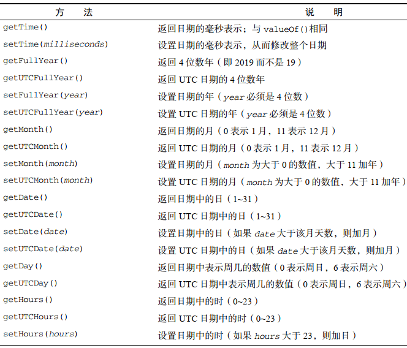

# **目录概要**

> 第 1 章，介绍 JavaScript 的起源：从哪里来，如何发展，以及现今的状况。这一章会谈到 JavaScript与 ECMAScript 的关系、 DOM、 BOM，以及 Ecma 和 W3C 相关的标准。
>
> 第 2 章，了解 JavaScript 如何与 HTML 结合来创建动态网页，主要介绍在网页中嵌入 JavaScript 的不同方式，还有 JavaScript 的内容类型及其与`<script>`元素的关系。
>
> 第 3 章，介绍语言的基本概念，包括语法和流控制语句；解释 JavaScript 与其他类 C 语言在语法上的异同点。在讨论内置操作符时也会谈到强制类型转换。此外还将介绍所有的原始类型，包括 Symbol。
>
> 第 4 章，探索 JavaScript 松散类型下的变量处理。这一章将涉及原始类型与引用类型的不同，以及与变量有关的执行上下文。此外，这一章也会讨论 JavaScript 中的垃圾回收，涉及在变量超出作用域时如何回收内存。
>
> 第 5 章，讨论 JavaScript 所有内置的引用类型，如 Date、 Regexp、原始类型及其包装类型。每种引用类型既有理论上的讲解，也有相关浏览器实现的剖析。
>
> 第 6 章，继续讨论内置引用类型，包括 Object、 Array、 Map、 WeakMap、 Set 和 WeakSet 等。
>
> 第 7 章，介绍 ECMAScript 新版中引入的两个基本概念：迭代器和生成器，并分别讨论它们最基本的行为和在当前语言环境下的应用。
>
> 第 8 章，解释如何在 JavaScript 中使用类和面向对象编程。首先会深入讨论 JavaScript 的 Object 类型，进而探讨原型式继承，接下来全面介绍 ES6 类及其与原型式继承的紧密关系。
>
> 第 9 章，介绍两个紧密相关的概念： Proxy（代理）和 Reflect（反射） API。代理和反射用于拦截和修改这门语言的基本操作。
>
> 第 10 章，探索 JavaScript 最强大的一个特性：函数表达式，主要涉及闭包、 this 对象、模块模式、创建私有对象成员、箭头函数、默认参数和扩展操作符。
>
> 第 11 章，介绍两个紧密相关的异步编程构造： Promise 类型和 async/await。这一章讨论 JavaScript的异步编程范式，进而介绍期约（ promise）与异步函数的关系。
>
> 第 12 章，介绍 BOM，即浏览器对象模型，跟与浏览器本身交互的 API 相关。所有 BOM 对象都会涉及，包括 window、 document、 location、 navigator 和 screen 等。
>
> 第 13 章，解释检测客户端机器及其能力的不同手段，包括能力检测和用户代理字符串检测。这一章讨论每种手段的优缺点，以及适用的场景。
>
> 第 14 章，介绍 DOM，即文档对象模型，主要是 DOM Level 1 定义的 API。这一章将简单讨论 XML及其与 DOM 的关系，进而全面探索 DOM 以及如何利用它操作网页。
>
> 第 15 章，解释其他 DOM API，包括浏览器本身对 DOM 的扩展，主要涉及 Selectors API、 ElementTraversal API 和 HTML5 扩展。
>
> 第 16 章，在之前两章的基础上，解释 DOM Level 2 和 Level 3 对 DOM 的扩展，包括新增的属性、方法和对象。这一章还会介绍 DOM4 的相关内容，比如 Mutation Observer。
>
> 第 17 章，解释事件在 JavaScript 中的本质，以及事件的起源及其在 DOM 中的运行方式。
>
> 第 18 章，围绕`<canvas>`标签讨论如何创建动态图形，包括 2D 和 3D 上下文（ WebGL）等动画和游戏开发所需的基础。这一章还会讨论 WebGL1 和 WebGL2。
>
> 第 19 章，探索使用 JavaScript 增强表单交互及突破浏览器限制，主要讨论文本框、选择框等表单元素及数据验证和操作。
>
> 第 20 章，介绍各种 JavaScript API，包括 Atomics、 Encoding、 File、 Blob、 Notifications、 Streams、Timing、 Web Components 和 Web Cryptography。
>
> 第 21 章，讨论浏览器如何处理 JavaScript 代码中的错误及几种错误处理方式。这一章同时介绍了每种浏览器的调试工具和技术，包括简化调试过程的建议。  
>
> 第 22 章，介绍通过 JavaScript 读取和操作 XML 数据的特性，解释了不同浏览器支持特性和对象的差异，提供了简化跨浏览器编码的建议。这一章也讨论了使用 XSLT 在客户端转换 XML 数据。
>
> 第 23 章，介绍作为 XML 替代的 JSON 数据格式，还讨论了浏览器原生解析和序列化 JSON，以及使用 JSON 时要注意的安全问题。
>
> 第 24 章，探讨浏览器请求数据和资源的常用方式，包括早期的 XMLHttpRequest 和现代的 Fetch API。
>
> 第 25 章，讨论应用程序离线时在客户端机器上存储数据的各种技术。先从 cookie 谈起，然后讨论Web Storage 和 IndexedDB。
>
> 第 26 章，介绍模块模式在编码中的应用，进而讨论 ES6 模块之前的模块加载方式，包括 CommonJS、AMD 和 UMD。最后介绍新的 ES6 模块及其正确用法。
>
> 第 27 章，深入介绍专用工作者线程、共享工作者线程和服务工作者线程。其中包括工作者线程在操作系统和浏览器层面的实现，以及使用各种工作者线程的最佳策略。
>
> 第 28 章，探讨在企业级开发中进行 JavaScript 编码的最佳实践。其中提到了提升代码可维护性的编码惯例，包括编码技巧、格式化及通用编码建议。深入讨论应用性能和提升速度的技术。最后介绍与上线部署相关的话题，包括项目构建流程。  

# 阅读指南

**本书知识点分布混乱，难度不均、找不到重点，需先看在线网站《现代JavaScript教程》。**

> 豆瓣用户 2012 版
>
> 第一章随便看看，了解历史
>
> 第二章简单看看，script 里的 defer 和 async 属性了解下就好了，noscript 不用看 
>
> 第三章位运算、label、with 不用看 
>
> 第四章概念性质的了解就可以，基本类型与引用类型需要掌握
>
> 第五章正则不用看
>
> 第六章都看看，重点内容
>
> 第七章也是重点内容，都需要看
>
> 第八章了解就可以了，知道 bom 是什么，用的时候能查到 
>
> 第九章随便看看，有个印象就行
>
> 10，11，12 了解 DOM 的类型，掌握操作 DOM，包括选择、style、文本等
>
> 13 事件中和 IE 有关的部分不用看
>
> 14 表单内容需要掌握，可以和 jquery 的 api 结合看，简化理解
>
> 15 可以跳过，有兴趣的自己看看就好了
>
> 16 了解就行了，postMessage 可能会出现在跨域问题中
>
> 17 18 19 跳过就可以了
>
> 20 21 是 JSON 和 AJAX，不过大部分应该掌握了，新加入的东西看看好了，用的时候 比如 formData 在上传文件的时候需要用上，progress 用的比较少。 跨域知识比较旧， 但是面试的套路就是要掌握这些，所以还是需要看。
>
> 22 高级技巧感兴趣就看看，因为要求相对较高，不愿意看也没有关系
>
> 23 看看 localStorage 和 cookie 就可以，其他的实际用得不多
>
> 24 看看还是有必要的，算是合格的编程风格
>
> 25 使用比较多的是 requestAnimationFrame(主要是改良动画) 和 File API，其他的 使用较少，用的时候再查就可以了
>
> 附录部分里的严格模式不用看，其他了解下就可以


# 第 1章　什么是JavaScript 1

1.1　简短的历史回顾 

## 1.2　JavaScript 实现 

- 完整的 JavaScript 实现包含以下几个部分（见图 1-1）：

  - 核心（ ECMAScript）
  - 文档对象模型（ DOM）
  - 浏览器对象模型（ BOM）  

  

### 1.2.1 ECMAScript

1. ECMAScript 版本
   1. ES6 正式支持了类、模块、迭代器、生成器、箭头函数、期约、反射、代理和众多新的数据类型。  
   2. ES7  包含少量语法层面的增强，`Array.prototype.includes` 和指数操作符。  
   3. ES8  主要增加了异步函数（ `async/await`）、 `SharedArrayBuffer` 及 `Atomics API`，以及`Object.values()/Object.entries()/Object.getOwnPropertyDescriptors()`和字符串填充方法，另外明确支持对象字面量最后的逗号。
   4. ES9   异步迭代、剩余和扩展属性、一组新的正则表达式特性、 Promise finally()，以及模板字面量修订。   
   5. ES10  增加了 `Array.prototype.flat()/flatMap()、String.prototype.trimStart()/trimEnd()、 Object.fromEntries()`方
      法，以及 `Symbol.prototype.description` 属性，明确定义了`Function.prototype.toString()`的返回值并固定了 `Array.prototype.sort()`的顺序。另外，这次修订解决了与 JSON 字符串兼容的问题，并定义了 catch 子句的可选绑定。  
2. ECMAScript 符合性是什么意思 
3. 浏览器对 ECMAScript 的支持  

### 1.2.2 DOM 

- **文档对象模型（ DOM， Document Object Model）**是一个应用编程接口（ API），用于在 HTML 中使用扩展的 XML。 DOM 将整个页面抽象为一组分层节点。   
  - DOM 通过创建表示文档的树，让开发者可以随心所欲地控制网页的内容和结构。使用 DOM API，可以轻松地删除、添加、替换、修改节点。 

1. 为什么 DOM 是必需的  
2. DOM 级别  
   - 这个规范由两个模块组成： DOM Core 和 DOM  HTML。前者提供了一种映射 XML 文档，从而方便访问和操作文档任意部分的方式；后者扩展了前者，并增加了特定于 HTML 的对象和方法。  
   - DOM Living Standard 其快照称为DOM4 。
3. 其他 DOM  
   1. 可伸缩矢量图（ SVG， Scalable Vector Graphics）
   2. 数学标记语言（ MathML， Mathematical Markup Language）
   3. 同步多媒体集成语言（ SMIL， Synchronized Multimedia Integration Language）
4. Web 浏览器对 DOM 的支持情况  

### 1.2.3 BOM

1. **浏览器对象模型（ BOM） API**  

   - 用于支持访问和操作浏览器的窗口。使用 BOM，开发者可以操控浏览器显示页面之外的部分。而 BOM 真正独一无二的地方，当然也是问题最多的地方，就是它是唯一一个没有相关标准的 JavaScript 实现。 
   - HTML5 改变了这个局面，这个版本的 HTML 以正式规范的形式涵盖了尽可能多的 BOM 特性。

2. BOM 主要针对**浏览器窗口和子窗口（ frame）**，不过人们通常会把任何特定于浏览器的扩展都归在 BOM 的范畴内。  比如，下面就是这样一些扩展：  

   1. 弹出新浏览器窗口的能力；
   2. 移动、缩放和关闭浏览器窗口的能力；
   3. `navigator` 对象，提供关于浏览器的详尽信息；
   4. `location` 对象，提供浏览器加载页面的详尽信息；  
   5. `screen` 对象，提供关于用户屏幕分辨率的详尽信息；
   6. `performance` 对象，提供浏览器内存占用、导航行为和时间统计的详尽信息；
   7. 对 cookie 的支持；
   8. 其他自定义对象，如 `XMLHttpRequest` 和 IE 的 `ActiveXObject`。  

   浏览器实现的都是自己的 BOM。有一些所谓的事实标准，比如对于 `window` 对象和 `navigator` 对象，每个浏览器都会给它们定义自己的属性和方法。  

1.3　JavaScript 版本 

## 1.4　小结 10

- JavaScript 是一门用来与网页交互的脚本语言，包含以下三个组成部分。
  1. ECMAScript：由 ECMA-262 定义并提供核心功能。
  2. 文档对象模型（ DOM）：提供与网页内容交互的方法和接口。
  3. 浏览器对象模型（ BOM）：提供与浏览器交互的方法和接口。

# 第 2章　HTML中的JavaScript 11

本章内容

- 使用`<script>`元素
- 行内脚本与外部脚本的比较
- 文档模式对 JavaScript 有什么影响
- 确保 JavaScript 不可用时的用户体验  

## 2.1　script 元素 11

- `<script>`元素有下列 8 个属性。
  1. **async**：可选。表示应该立即开始下载脚本，但不能阻止其他页面动作，比如下载资源或等待其他脚本加载。只对外部脚本文件有效。
  2. **charset**：可选。使用 src 属性指定的代码字符集。这个属性很少使用，因为大多数浏览器不在乎它的值。
  3. **crossorigin**：可选。配置相关请求的 CORS（跨源资源共享）设置。默认不使用 CORS。 crossorigin="anonymous"配置文件请求不必设置凭据标志。 crossorigin="use-credentials"设置凭据标志，意味着出站请求会包含凭据。
  4. **defer**：可选。 表示脚本可以延迟到文档完全被解析和显示之后再执行。 只对外部脚本文件有效。在 IE7 及更早的版本中，对行内脚本也可以指定这个属性。
  5. **integrity**：可选。允许比对接收到的资源和指定的加密签名以验证子资源完整性（ SRI，Subresource Integrity）。如果接收到的资源的签名与这个属性指定的签名不匹配，则页面会报错，脚本不会执行。这个属性可以用于确保内容分发网络（ CDN， Content Delivery Network）不会提供恶意内容。
  6. language：废弃。
  7. **src**：可选。表示包含要执行的代码的外部文件。
  8. **type**：可选。代替 language，表示代码块中**脚本语言的内容类型**（也称 **MIME 类型**）。
     - 按照惯例，这个值始终都是"text/javascript"，尽管"text/javascript"和"text/ecmascript"都已经废弃了。
     -  JavaScript 文件的 MIME 类型通常是 "application/x-javascript"，不过给 type 属性这个值 有 可 能 导 致 脚 本 被 忽 略 。 在 非 IE 的 浏 览 器 中 有 效 的 其 他 值 还 有"application/javascript"和"application/ecmascript"。
     - 如果这个值是 **module**，则代码会被当成 ES6 模块，而且只有这时候代码中才能出现 import 和 export 关键字。  

### 2.1.1 标签位置

1. 过去，所有`<script>`元素都被放在页面的`<head>`标签内

   - 意味着必须把所有 JavaScript 代码都下载、解析和解释完成后，才能开始渲染页面  

   ```html
   <!DOCTYPE html>
   <html>
   <head>
   <title>Example HTML Page</title>
   <script src="example1.js"></script>
   <script src="example2.js"></script>
   </head>
   <body>
   <!-- 这里是页面内容 -->
   </body>
   </html>
   ```

2. 现代 Web 应用程序通常将所有 JavaScript 引用放在`<body>`元素中的页面内容后面：

   - 页面会在处理 JavaScript 代码之前完全渲染页面。  

   ```html
   <!DOCTYPE html>
   <html>
   <head>
   <title>Example HTML Page</title>
   </head>
   <body>
   <!-- 这里是页面内容 -->
   <script src="example1.js"></script>
   <script src="example2.js"></script>
   </body>
   </html>
   ```

### 2.1.2 推迟执行脚本

```html
<!DOCTYPE html>
<html>
<head>
<title>Example HTML Page</title>
<script defer src="example1.js"></script>
<script defer src="example2.js"></script>
</head>
<body>
<!-- 这里是页面内容 -->
</body>
</html>
```

- 虽然这个例子中的`<script>`元素包含在页面的`<head>`中，但它们会在浏览器解析到结束的
  `</html>`标签后才会执行。 HTML5 规范要求脚本应该按照它们出现的顺序执行，因此第一个推迟的脚本会在第二个推迟的脚本之前执行，而且两者都会在 DOMContentLoaded 事件之前执行（关于事件，请参考第 17 章）。不过在实际当中，推迟执行的脚本不一定总会按顺序执行或者在 DOMContentLoaded 事件之前执行，因此最好只包含一个这样的脚本。 
  - defer 属性只对外部脚本文件才有效。   
  - `defer` 特性除了告诉浏览器“不要阻塞页面”之外，还可以确保脚本执行的相对顺序。

### 2.1.3 异步执行脚本

```html
<!DOCTYPE html>
<html>
<head>
<title>Example HTML Page</title>
<script async src="example1.js"></script>
<script async src="example2.js"></script>
</head>
<body>
<!-- 这里是页面内容 -->
</body>
</html>
```

- async 属性的目的是告诉浏览器，  不必等脚本下载和执行完后再加载页面，同样也不必等到该异步脚本下载和执行后再加载其他脚本。正因为如此，异步脚本不应该在加载期间修改DOM。 
- 异步脚本保证会在页面的 load 事件前执行，但可能会在 DOMContentLoaded（参见第 17 章）之前或之后。    

### 2.1.4 动态加载脚本

```javascript
let script = document.createElement('script');
script.src = 'gibberish.js';
document.head.appendChild(script);
```

- 默认情况下，以这种方式创建的`<script>`元素是以异步方式加载的，相当于添加了 async 属性。不过这样做可能会有问题，因为所有浏览器都支持 createElement()方法，但不是所有浏览器都支持 async 属性。因此，如果要统一动态脚本的加载行为，可以明确将其设置为同步加载。

  ```javascript
  script.async = false;
  ```

- 这会严重影响它们在资源获取队列中的优先级。根据应用程序的工作方式以及怎么使用，这种方式可能会严重影响性能。要想让预加载器知道这些动态请求文件的存在，可以在文档头部显式声明它们：

  ```html
  <link rel="preload" href="gibberish.js">
  ```

### 2.1.5 XHTML 中的变化

- **可扩展超文本标记语言（ XHTML， Extensible HyperText Markup Language）**是将 HTML 作为 XML的应用重新包装的结果。与 HTML 不同，在 XHTML 中使用 JavaScript 必须指定 **type** 属性且值为 text/javascript， HTML 中则可以没有这个属性。 XHTML 虽然已经退出历史舞台，但实践中偶尔可能也会遇到遗留代码，为此本节稍作介绍。  
  
- 在 HTML 中，解析`<script>`元素会应用特殊规则。 XHTML 中则没有这些规则。这意味着 a < b 语句中的小于号（ <）会被解释成一个标签的开始，并且由于作为标签开始的小于号后面不能有空格，这会导致语法错误。  解决方案：
  
  - 把所有代码都包含到一个 **CDATA** 块中。在 XHTML（及 XML）中， CDATA 块表示文档中**可以包含任意文本**的区块，其内容不作为标签来解析，因此可以在其中包含任意字符，包括小于号，并且不会引发语法错误。使用 CDATA 的格式如下：  
  
    ```xml
    <script type="text/javascript"><![CDATA[
    function compare(a, b) {
    if (a < b) {
    console.log("A is less than B");
    } else if (a > b) {
    console.log("A is greater than B");
    } else {
    console.log("A is equal to B");
    }
    }
    ]]></script>
    ```
  
  - 在兼容 XHTML 的浏览器中，这样能解决问题。但在不支持 CDATA 块的**非 XHTML 兼容浏览器**中则不行。为此， CDATA 标记必须使用 JavaScript 注释来抵消：  
    
    ```XML
    <script type="text/javascript">
    //<![CDATA[
    function compare(a, b) {
    if (a < b) {
    console.log("A is less than B");
    } else if (a > b) {
    console.log("A is greater than B");
    } else {
    console.log("A is equal to B");
    }
    }
    //]]>
    </script>
    ```

### 2.1.6 废弃的语法  

- type 属性使用一个 MIME 类型字符串来标识`<script>`的内容，但 MIME 类型并没有跨浏览器标准化。  
  - 因此，除非你使用 XHTML 或`<script>`标签要求或包含非 JavaScript 代码，最佳做法是不指定 type 属性。  

## 2.2　行内代码与外部文件 18

- 推荐使用外部文件的理由如下。
  1. **可维护性**。 JavaScript 代码如果分散到很多 HTML 页面，会导致维护困难。而用一个目录保存所有 JavaScript 文件，则更容易维护，这样开发者就可以独立于使用它们的 HTML 页面来编辑代码。
  2. **缓存**。浏览器会根据特定的设置缓存所有外部链接的 JavaScript 文件，这意味着如果两个页面都用到同一个文件，则该文件只需下载一次。这最终意味着页面加载更快。
  3. **适应未来**。 通过把 JavaScript 放到外部文件中，就不必考虑用 XHTML 或前面提到的注释黑科技。包含外部 JavaScript 文件的语法在 HTML 和 XHTML 中是一样的。  
- 在配置浏览器请求外部文件时，要重点考虑的一点是它们会占用多少带宽。在 SPDY/HTTP2 中，
  **预请求**的消耗已显著降低，以轻量、独立 JavaScript 组件形式向客户端送达脚本更具优势。
  - 在初次请求时，如果浏览器支持 SPDY/HTTP2，就可以从同一个地方取得一批文件，并将它们逐个放到浏览器缓存中。从浏览器角度看，通过 SPDY/HTTP2 获取所有这些独立的资源与获取一个大JavaScript 文件的延迟差不多。
  - 在第二个页面请求时，由于你已经把应用程序切割成了轻量可缓存的文件，第二个页面也依赖的某些组件此时已经存在于浏览器缓存中了。  
  - 

## 2.3　文档模式 18

- `doctype`   最初的文档模式有两种： 混杂模式（ quirks mode）和标准模式（ standards mode）。

  - 第三种文档模式： 准标准模式（ almost standards mode）。    
    - 主要区别在于如何对待图片元素周围的空白（在表格中使用图片时最明显）。  
  - 标准模式通过下列几种文档类型声明开启：  

  ```html
  <!-- HTML 4.01 Strict -->
  <!DOCTYPE HTML PUBLIC "-//W3C//DTD HTML 4.01//EN"
  "http://www.w3.org/TR/html4/strict.dtd">
  
  <!-- XHTML 1.0 Strict -->
  <!DOCTYPE html PUBLIC
  "-//W3C//DTD XHTML 1.0 Strict//EN"
  "http://www.w3.org/TR/xhtml1/DTD/xhtml1-strict.dtd">
  
  <!-- HTML5 -->
  <!DOCTYPE html>
  ```

  - 准标准模式通过过渡性文档类型（ Transitional）和框架集文档类型（ Frameset）来触发：  

  ```html
  <!-- HTML 4.01 Transitional -->
  <!DOCTYPE HTML PUBLIC
  "-//W3C//DTD HTML 4.01 Transitional//EN"
  "http://www.w3.org/TR/html4/loose.dtd">
  
  <!-- HTML 4.01 Frameset -->
  <!DOCTYPE HTML PUBLIC
  "-//W3C//DTD HTML 4.01 Frameset//EN"
  "http://www.w3.org/TR/html4/frameset.dtd">
  
  <!-- XHTML 1.0 Transitional -->
  <!DOCTYPE html PUBLIC
  "-//W3C//DTD XHTML 1.0 Transitional//EN"
  "http://www.w3.org/TR/xhtml1/DTD/xhtml1-transitional.dtd">
  
  <!-- XHTML 1.0 Frameset -->
  <!DOCTYPE html PUBLIC
  "-//W3C//DTD XHTML 1.0 Frameset//EN"
  "http://www.w3.org/TR/xhtml1/DTD/xhtml1-frameset.dtd">
  ```

- 准标准模式与标准模式非常接近，很少需要区分。  本书后面所说的标准模式，指的就是除混杂模式以外的模式。  

## 2.4　noscript 元素 19

- `<noscript>` 元素出现，被用于给不支持 JavaScript 的浏览器提供替代内容。虽然如今的浏览器已经 100%支持JavaScript，但对于禁用 JavaScript 的浏览器来说，这个元素仍然有它的用处。
  - `<noscript>`元素可以包含任何可以出现在`<body>`中的 HTML 元素， `<script>`除外。在下列两种情况下，浏览器将显示包含在`<noscript>`中的内容：
    - 浏览器不支持脚本；
    - 浏览器对脚本的支持被关闭。
  - 任何一个条件被满足，包含在`<noscript>`中的内容就会被渲染。否则，浏览器不会渲染`<noscript>`中的内容。  

```html
<!DOCTYPE html>
<html>
<head>
	<title>Example HTML Page</title>
  <script defer="defer" src="example1.js"></script>
  <script defer="defer" src="example2.js"></script>
</head>
<body>
  <noscript>
    <p>This page requires a JavaScript-enabled browser.</p>
  </noscript>
</body>
</html>
```

- 这个例子是在脚本不可用时让浏览器显示一段话。如果浏览器支持脚本，则用户永远不会看到它。

## 2.5　小结 20

- 要包含外部 JavaScript 文件，必须将 src 属性设置为要包含文件的 URL。文件可以跟网页在同
  一台服务器上，也可以位于完全不同的域。
- 所有`<script>`元素会依照它们在网页中出现的次序被解释。在不使用 defer 和 async 属性的
  情况下，包含在`<script>`元素中的代码必须严格按次序解释。
- 对不推迟执行的脚本，浏览器必须解释完位于`<script>`元素中的代码，然后才能继续渲染页面
  的剩余部分。为此，通常应该把`<script>`元素放到页面末尾，介于主内容之后及`</body>`标签之前。
- 可以使用 defer 属性把脚本推迟到文档渲染完毕后再执行。推迟的脚本原则上按照它们被列出
  的次序执行。
- 可以使用 async 属性表示脚本不需要等待其他脚本，同时也不阻塞文档渲染，即异步加载。异
  步脚本不能保证按照它们在页面中出现的次序执行。
- 通过使用`<noscript>`元素，可以指定在浏览器不支持脚本时显示的内容。如果浏览器支持并启用脚本，则`<noscript>`元素中的任何内容都不会被渲染。  

# 第3章　语言基础 21

本章内容

- 语法
- 数据类型
- 流控制语句
- 理解函数  

## 3.1　语法 21

### 3.1.1 区分大小写

- ECMAScript 中一切都区分大小写。无论是变量、函数名还是操作符，都区分大小写。  

### 3.1.2 标识符

- 所谓标识符，就是变量、函数、属性或函数参数的名称。标识符可以由一或多个下列字符组成：
  1. **第一个字符必须是一个字母、下划线 `_` 或美元符号 `$`；**
  2. 剩下的其他字符可以是字母、下划线、美元符号或数字。
  3. 标识符中的字母可以是扩展 ASCII（ Extended ASCII）中的字母，也可以是 Unicode 的字母字符，如 À 和 Æ（但不推荐使用）。
- 按照惯例， ECMAScript 标识符使用**驼峰大小写**形式，即第一个单词的首字母小写，后面每个单词的首字母大写，如：  `firstSecond、myCar、doSomethingImportant`。

### 3.1.3 注释 

- ECMAScript 采用 C 语言风格的注释，包括单行注释和块注释。  

```javascript
// 单行注释
块注释以一个斜杠和一个星号（ /*）开头，以它们的反向组合（ */）结尾，如：
/* 这是多行
注释 */
```

### 3.1.4 严格模式

- 严格模式（ strict mode）  

  - 要对整个脚本启用严格模式，在脚本开头加上这一行：`"use strict";`  

  - 也可以单独指定一个函数在严格模式下执行，只要把这个预处理指令放到函数体开头即可：

    ```JavaScript
    function doSomething() {
    	"use strict";
    	// 函数体
    }
    ```

  - 严格模式会影响 JavaScript 执行的很多方面，因此本书在用到它时会明确指出来。所有现代浏览器都支持严格模式。  


### 3.1.5 语句

- 以分号结尾。省略分号意味着由解析器确定语句在哪里结尾 ：

  ```JavaScript
  let sum = a + b // 没有分号也有效，但不推荐
  let diff = a - b; // 加分号有效，推荐
  ```

  - 即使语句末尾的分号不是必需的，也应该加上。  

- 多条语句可以合并到一个 C 语言风格的代码块中。  

- if 之类的控制语句只在执行多条语句时要求必须有代码块。  

  ```Javascript
  // 有效，但容易导致错误，应该避免
  if (test)
  	console.log(test);
  
  // 推荐
  if (test) {
  	console.log(test);
  }
  ```

## 3.2　关键字与保留字 23

```javascript
break 		do 				in 					typeof
case 			else 			instanceof 	var
catch 		export 		new 				void
class 		extends 	return 			while
const 		finally 	super 			with
continue 	for 			switch 			yield
debugger 	function 	this
default 	if 				throw
delete 		import 		try

//始终保留:
enum

//严格模式下保留:
implements  package 	public
interface 	protected static
let 				private

//模块代码中保留:
await
```


## 3.3　变量 24

### 3.3.1 var 关键字  

- 不仅可以改变保存的值，也可以改变值的类型：
  - 虽然不推荐改变变量保存值的类型，但这在 ECMAScript 中是完全有效的。  

```javascript
var message = "hi";
message = 100; // 合法，但不推荐
```

1. **var 声明作用域**  

   ```javascript
   function test() {
   	var message = "hi"; // 局部变量,该变量将在函数退出时被销毁
   }
   test();
   console.log(message); // 出错！
   ```

2. 在函数内定义变量时省略 var 操作符，可以创建一个全局变量：  

   ```javascript
   function test() {
   	message = "hi"; // 全局变量,不推荐这么做。很难维护
   }
   test();
   console.log(message); // "hi"
   ```

   - 如果需要定义多个变量，可以在一条语句中用逗号分隔每个变量（及可选的初始化）：  

   ```javascript
   var message = "hi",found = false, //插入换行和空格缩进并不是必需的
   age = 29;
   ```

   - 严格模式下，不能定义名为 eval 和 arguments 的变量，否则会导致语法错误。  

3. **var 声明提升（ hoist）**

   - 关键字声明的变量会自动提升到函数作用域顶部：  

   ```javascript
   function foo() {
   console.log(age);
   var age = 26;
   }
   foo(); // undefined
   
   //等价于如下代码：
   function foo() {
   var age;
   console.log(age);
   age = 26;
   }
   foo(); // undefined
   ```

   - 反复多次使用 var 声明同一个变量也没有问题。

### 3.3.2 let 声明  

- let 声明的范围是**块作用域**，而 var 声明的范围是**函数作用域**。  

  ```javascript
  if (true) {
  var name = 'Matt';
  console.log(name); // Matt
  }
  console.log(name); // Matt
  
  if (true) {
  let age = 26;
  console.log(age); // 26
  }
  console.log(age); // ReferenceError: age 没有定义
  ```

  - age 变量之所以不能在 if 块外部被引用，是因为它的作用域仅限于该块内部。块作用域是函数作用域的子集，因此适用于 var 的作用域限制同样也适用于 let。 

- let 也不允许同一个块作用域中出现冗余声明。这样会导致报错：

  ```javascript
  var name;
  var name;
  
  let age;
  let age; // SyntaxError；标识符 age 已经声明过了  
  ```

- JavaScript 引擎会记录用于变量声明的标识符及其**所在的块作用域**，因此**嵌套使用相同的标识符**不会报错，而这是因为同一个块中没有重复声明：  

  ```javascript
  var name = 'Nicholas';
  console.log(name); // 'Nicholas'
  if (true) {
  	var name = 'Matt';
  	console.log(name); // 'Matt'
  }
  
  let age = 30;
  console.log(age); // 30
  if (true) {
  	let age = 26;
  	console.log(age); // 26
  }
  ```

- 对声明冗余报错不会因混用 let 和 var 而受影响。这两个关键字声明的并不是不同类型的变量，它们只是指出变量在相关作用域如何存在。
  
  ```javascript
  var name;
  let name; // SyntaxError
  
  let age;
  var age; // SyntaxError  
  ```

1. **暂时性死区**
   let 与 var 的另一个重要的区别，就是 let 声明的变量不会在作用域中被提升。

   ```javascript
   // name 会被提升
   console.log(name); // undefined
   var name = 'Matt';
   // age 不会被提升
   console.log(age); // ReferenceError： age 没有定义
   let age = 26;
   ```

   - 在解析代码时， JavaScript 引擎也会注意出现在块后面的 let 声明，只不过在此之前不能以任何方式来引用未声明的变量。在 let 声明之前的执行瞬间被称为“暂时性死区”（ temporal dead zone），在此阶段引用任何后面才声明的变量都会抛出 ReferenceError。  

2. **全局声明**

   -   let 在全局作用域中声明的变量不会成为 window 对象的属性（ var 声明的变量则会）。 

3. **条件声明**  

   - var 声明变量时，由于声明会被提升， JavaScript 引擎会自动将多余的声明在作用域顶部合并为一个声明。  
   - **let 的作用域是块**，所以不可能检查前面是否已经使用 let 声明过同名变量。
     - 不能超出分号块的范围使用。

   ```javascript
   <script>
     var name = 'Nicholas';
     let age = 26;
   </script>
   
   <script>
     // 假设脚本不确定页面中是否已经声明了同名变量
     // 那它可以假设还没有声明过
     var name = 'Matt';
     // 这里没问题，因为可以被作为一个提升声明来处理
     // 不需要检查之前是否声明过同名变量
     let age = 36;
     // 如果 age 之前声明过，这里会报错
   </script>
   
   //使用 try/catch 语句或 typeof 操作符也不能解决，因为条件块中 let 声明的作用域仅限于该块。
   <script>
   let name = 'Nicholas';
   let age = 36;
   </script>
   
   <script>
   // 假设脚本不确定页面中是否已经声明了同名变量
   // 那它可以假设还没有声明过
   if (typeof name === 'undefined') {
     let name;
   }
   // name 被限制在 if {} 块的作用域内
   // 因此这个赋值形同全局赋值
   name = 'Matt';
   try {
     console.log(age); // 如果 age 没有声明过，则会报错
   }
   catch(error) {
   	let age;
   }
   // age 被限制在 catch {}块的作用域内
   // 因此这个赋值形同全局赋值
   age = 26;
   </script>
   ```

4. **for 循环中的 let 声明**  

   1. 在 let 出现之前， for 循环定义的迭代变量会渗透到循环体外部：  

      ```javascript
      for (var i = 0; i < 5; ++i) {
      	// 循环逻辑
      }
      console.log(i); // 5
      
      // 改成使用 let 之后，这个问题就消失了，因为迭代变量的作用域仅限于 for 循环块内部：
      for (let i = 0; i < 5; ++i) {
      	// 循环逻辑
      }
      console.log(i); // ReferenceError: i 没有定义
      ```

   2. 在使用 var 的时候，最常见的问题就是对**迭代变量**的奇特声明和修改：  

      ```javascript
      for (var i = 0; i < 5; ++i) {
      	setTimeout(() => console.log(i), 0)
      }
      // 你可能以为会输出 0、 1、 2、 3、 4
      // 实际上会输出 5、 5、 5、 5、 5
      // 退出循环时，迭代变量保存的是导致循环退出的值
      
      // 使用 let 声明迭代变量时， JavaScript 引擎在后台会为每个迭代循环声明一个新的迭代变量。
      for (let i = 0; i < 5; ++i) {
      	setTimeout(() => console.log(i), 0)
      }
      // 会输出 0、 1、 2、 3、 4
      ```

      - 每次迭代声明一个独立变量实例的行为适用于所有风格的 for 循环，包括 for-in 和 for-of 循环。  

### 3.3.3 const 声明  

- const 的行为与 let 基本相同，唯一一个重要的区别是用它声明变量时必须同时初始化变量，且尝试修改 const 声明的变量会导致运行时错误。  

  - const 声明的限制**只适用于它指向的变量的引用**。换句话说，如果 const 变量引用的是一个对象，那么修改这个对象内部的属性并不违反 const 的限制。  

    ```javascript
    const person = {};
    person.name = 'Matt'; // ok
    ```

  - const 声明一个不会被修改的 for 循环变量  

    ```javascript
    let i = 0;
    for (const j = 7; i < 5; ++i) {
    	console.log(j);
    }
    // 7, 7, 7, 7, 7
    for (const key in {a: 1, b: 2}) {
    	console.log(key);
    }
    // a, b
    for (const value of [1,2,3,4,5]) {
      console.log(value);
    }
    // 1, 2, 3, 4, 5
    ```

### 3.3.4 声明风格及最佳实践  

1. 不使用 var  
2. const 优先， let 次之  

## 3.4　数据类型 30

- ECMAScript 有 **6 种简单数据类型**（也称为原始类型）：
  -  Undefined、 Null、 Boolean、 Number、String 和 Symbol。   
  - 还有**一种复杂数据类型**叫 Object（对象）。  
    - Object 是一种**无序名值对的集合**。  

### 3.4.1 typeof 操作符

- 确定任意变量的数据类型。  

  - 对一个值使用 typeof 操作符会返回下列字符串之一：

    - "undefined"表示值未定义；
    - "boolean"表示值为布尔值；
    - "string"表示值为字符串；
    - "number"表示值为数值；
    - "object"表示值为对象（而不是函数）或 null；
    - "function"表示值为函数；
    - "symbol"表示值为符号。  

  - 下面是使用 typeof 操作符的例子：

    ```javascript
    let message = "some string";
    console.log(typeof message); // "string"
    console.log(typeof(message)); // "string"
    console.log(typeof 95); // "number"  
    ```

  - 注意，因为 typeof 是一个**操作符而不是函数**，所以**不需要参数**（但可以使用参数）。

### 3.4.2 Undefined 类型

- Undefined 类型只有一个值，就是特殊值 undefined。  

  - 当使用 var 或 let 声明了变量但没有初始化时，就相当于给变量赋予了 undefined 值。

    ```javascript
    let message;
    console.log(message == undefined); // true
    ```

  - 在对**未初始化的变量**调用 typeof 时，返回的结果是"undefined"，但对**未声明的变量**调用它时，返回的结果还是"undefined"，这就有点让人看不懂了。比如下面的例子：

    ```javascript
    let message; // 这个变量被声明了，只是值为 undefined
    // 确保没有声明过这个变量
    // let age
    console.log(typeof message); // "undefined"
    console.log(typeof age); // "undefined"  
    ```

    - 建议在声明变量的同时进行初始化，用来区分两种情况。

### 3.4.3 Null 类型

- Null 类型同样只有一个值，即特殊值 null。  

  - null 值表示一个**空对象指针**，这也是给typeof 传一个 null 会返回"object"的原因：  

    ```javascript
    let car = null;
    console.log(typeof car); // "object"
    ```

  - 在定义将来要保存对象值的变量时，**建议使用 null 来初始化**。只要检查这个变量的值是不是 null 就可以知道这个变量是否在后来被重新赋予了一个对象的引用，比如：

    - 用 null 来填充该变量 ，这样就可以保持 null 是空对象指针的语义，并进一步将其与 undefined 区分开来。  

    ```javascript
    if (car != null) {
    // car 是一个对象的引用
    } 
    ```

  - undefined 值是由 null 值派生而来的，因此 ECMA-262 将它们定义为表面上相等

    ```javascript
    console.log(null == undefined); // true
    ```

### 3.4.4 Boolean 类型

- Boolean（布尔值）类型是 ECMAScript 中使用最频繁的类型之一，有两个字面值： true 和 false。

  - 这两个布尔值不同于数值，因此 **true 不等于 1， false 不等于 0。**    

  - 下面是给变量赋布尔值的例子：

    ```javascript
    let found = true;
    let lost = false;  
    ```

- 将一个其他类型的值转换为布尔值，可以调用特定的 `Boolean()` 转型函数：

  ```javascript
  let message = "Hello world!";
  let messageAsBoolean = Boolean(message);  
  ```

- 下表总结了不同类型与布尔值之间的转换规则。  

  | 数据类型  |    转换为 true 的值    |       转换为 false 的值       |
  | :-------: | :--------------------: | :---------------------------: |
  |  Boolean  |          true          |             false             |
  |  String   |       非空字符串       |       `""`（空字符串）        |
  |  Number   | 非零数值（包括无穷值） | 0、 NaN（参见后面的相关内容） |
  |  Object   |        任意对象        |             null              |
  | Undefined |     N/A（不存在）      |           undefined           |

  - if 等流控制语句会**自动执行其他类型值到布尔值的转换**，例如：

    ```javascript
    let message = "Hello world!";
    if (message) {
    	console.log("Value is true");
    }  
    ```

### 3.4.5 Number 类型

- Number 类型使用 IEEE 754 格式表示**整数和浮点值**（在某些语言中也叫双精度值）。  不同的数值类型相应地也有不同的数值字面量格式。  

  - **十进制**整数 ：`let intNum = 55; // 整数  `

  - **八进制**（以 8 为基数），第一个数字必须是零 ，后面数值 0~7

    ```javascript
    let octalNum1 = 070; // 八进制的 56
    let octalNum2 = 079; // 无效的八进制值，当成 79 处理
    let octalNum3 = 08; // 无效的八进制值，当成 8 处理
    ```

    - 八进制字面量在严格模式下是无效的，会导致 JavaScript 引擎抛出语法错误。   

  - **十六进制**（以 16 为基数），数值前缀 0x（区分大小写），然后是十六进制数字（ 0~9 以
    及 A~F）。  

    ```javascript
    let hexNum1 = 0xA; // 十六进制 10
    let hexNum2 = 0x1f; // 十六进制 31
    ```

1. **浮点值**

   -   定义浮点值，数值中必须包含小数点，而且小数点后面必须至少有一个数字。  

     ```javascript
     let floatNum1 = 1.1;
     let floatNum2 = 0.1;
     let floatNum3 = .1; // 有效，但不推荐
     ```

     - 浮点值使用的内存空间是存储整数值的两倍。
     - 小数点后面没有数字的情况下，数值就会变成整数。  类似地，  数值本身就是整数，只是小数点后面**跟着 0（如 1.0），那它也会被转换为整数。**  

     ```javascript
     let floatNum1 = 1.; // 小数点后面没有数字，当成整数 1 处理
     let floatNum2 = 10.0; // 小数点后面是零，当成整数 10 处理
     ```

   - 非常大或非常小的数值，浮点值可以用科学记数法来表示。  

     - 一个数值（整数或浮点数）后跟一个大写或小写的字母 e，再加上一个要乘的 10 的多少次幂。比如：  

     ```javascript
     let floatNum = 3.125e7; // 等于 31250000
     ```

   - 浮点值的精确度最高可达 17 位小数，但在算术计算中远不如整数精确。

     - 例如， 0.1 加 0.2 得到的不是 0.3，而是 0.300 000 000 000 000 04。由于这种微小的舍入错误，导致很难测试特定的浮点值。比如下面的例子：

       ```javascript
       if (a + b == 0.3) { // 别这么干！
       	console.log("You got 0.3.");
       }  
       ```

     - **永远不要测试某个特定的浮点值。**  

2. **值的范围**  

   - ECMAScript 可以表示的最小数值保存在 `Number.MIN_VALUE` 中，这个值在多数浏览器中是 `5e-324`；可以表示的最大数值保存在`Number.MAX_VALUE` 中，这个值在多数浏览器中是 `1.797 693 134 862 315 7e+308`。

   - 如果某个计算得到的数值结果超出了 JavaScript 可以表示的范围，那么这个数值会被自动转换为一个特殊的 Infinity（无穷）值。任何无法表示的负数以 **-Infinity（负无穷大）**表示，任何无法表示的正数以 **Infinity（正无穷大）**表示  。

     - 要确定一个值是不是有限大（即介于 JavaScript 能表示的最小值和最大值之间），可以使用 `isFinite()` 函数，如下所示：

       ```javascript
       let result = Number.MAX_VALUE + Number.MAX_VALUE;
       console.log(isFinite(result)); // false  
       ```

3. **NaN**  

   - **“不是数值”（ Not a Number）**，用于表示本来要返回数值的操作失败了（而不是抛出错误）。

   - 比如，用 0 除任意数值在其他语言中通常都会导致错误，从而中止代码执行。但在 ECMAScript 中， 0、 +0 或-0 相除会返回 NaN：

     ```javascript
     console.log(0/0); // NaN
     console.log(-0/+0); // NaN  
     
     // 如果分子是非 0 值，分母是有符号 0 或无符号 0，则会返回 Infinity 或-Infinity：
     console.log(5/0); // Infinity
     console.log(5/-0); // -Infinity
     ```

   - **NaN 的属性：**

     - 任何涉及 NaN 的操作始终返回 NaN（如 NaN/10），
     - **NaN 不等于包括 NaN 在内的任何值。**  
       - `console.log(NaN == NaN); // false  `

   - `isNaN()` 函数。  

     - 任何不能转换为数值的值都会导致这个函数返回 true。举例如下：

       ```javascript
       console.log(isNaN(NaN)); // true
       console.log(isNaN(10)); // false， 10 是数值
       console.log(isNaN("10")); // false，可以转换为数值 10
       console.log(isNaN("blue")); // true，不可以转换为数值
       console.log(isNaN(true)); // false，可以转换为数值 1 
       ```

4. **数值转换**

   - 3 个函数可以将非数值转换为数值： `Number()`、 `parseInt()` 和 `parseFloat()`。  

   - **`Number()` 函数**基于如下规则执行转换：

     - 布尔值， true 转换为 1， false 转换为 0。
     - 数值，直接返回。
     - null，返回 0。
     - undefined，返回 NaN。
     - 字符串，应用以下规则：
       -  如果字符串**包含数值字符**，包括数值字符前面带加、减号的情况，则转换为一个十进制数值。
         因此， Number("1")返回 1， Number("123")返回 123， Number("011")返回 11（忽略前面
         的零）。
       - 如果字符串**包含有效的浮点值**格式如"1.1"，则会转换为相应的浮点值（同样，忽略前面的零）。
       - 如果字符串**包含有效的十六进制**格式如"0xf"，则会转换为与该十六进制值**对应的十进制整**
       **数值**。
       - 如果是空字符串（不包含字符），则返回 0。
       - 如果字符串包含除上述情况之外的其他字符，则返回 NaN。  
     - 对象，调用 `valueOf()` 方法，并按照上述规则转换返回的值。如果转换结果是 NaN，则调用`toString()` 方法，再按照转换字符串的规则转换。  

     ```javascript
     let num1 = Number("Hello world!"); // NaN
     let num2 = Number(""); // 0
     let num3 = Number("000011"); // 11
     let num4 = Number(true); // 1
     ```

   - 需要得到整数时可以优先使用 **`parseInt()` 函数**。  

     - 字符串最前面的空格会被忽略，从第一个非空格字符开始转换。如果第一个字符不是数值字符、加号或减号， **`parseInt()` 立即返回 NaN**。这意味着**空字符串也会返回 NaN**（这一点跟 `Number()` 不一样，它返回 0）。如果第一个字符是数值字符、加号或减号，则继续依次检测每个字符，直到字符串末尾，或碰到非数值字符。  

       ```javascript
       let num1 = parseInt("1234blue"); // 1234
       let num2 = parseInt(""); // NaN
       let num3 = parseInt("0xA"); // 10，解释为十六进制整数
       let num4 = parseInt(22.5); // 22
       let num5 = parseInt("70"); // 70，解释为十进制值
       let num6 = parseInt("0xf"); // 15，解释为十六进制整数
       ```

     - 不同的数值格式很容易混淆，因此 `parseInt()` 也接收第二个参数，用于指定底数（进制数）。如果知道要解析的值是十六进制，那么可以传入 16 作为第二个参数，以便正确解析：

       - 为避免解析出错，建议始终传给它第二个参数。  

       ```javascript
       let num = parseInt("0xAF", 16); // 175
       
       // 事实上，如果提供了十六进制参数，那么字符串前面的"0x"可以省掉：
       let num1 = parseInt("AF", 16); // 175
       let num2 = parseInt("AF"); // NaN
       
       // 通过第二个参数，可以极大扩展转换后获得的结果类型。比如：
       let num1 = parseInt("10", 2); // 2，按二进制解析
       let num2 = parseInt("10", 8); // 8，按八进制解析
       let num3 = parseInt("10", 10); // 10，按十进制解析
       let num4 = parseInt("10", 16); // 16，按十六进制解析
       ```

   - **`parseFloat()` 函数**的工作方式跟 `parseInt()` 函数类似，都是从位置 0 开始检测每个字符。同样，它也是解析到字符串末尾或者解析到一个无效的浮点数值字符为止。这意味着第一次出现的小数点是有效的，但第二次出现的小数点就无效了，此时字符串的剩余字符都会被忽略。 

     - `"22.34.5"将转换成 22.34  ` 
     - parseFloat() 函数的另一个不同之处在于，它始终忽略字符串开头的零。  
     - 十六进制数值始终会返回 0。因为 parseFloat() **只解析十进制值**，因此不能指定底数。
     - 如果字符串表示整数（没有小数点或者小数点后面只有一个零），则 parseFloat() 返回整数。    

     ```javascript
     let num1 = parseFloat("1234blue"); // 1234，按整数解析
     let num2 = parseFloat("0xA"); // 0
     let num3 = parseFloat("22.5"); // 22.5
     let num4 = parseFloat("22.34.5"); // 22.34
     let num5 = parseFloat("0908.5"); // 908.5
     let num6 = parseFloat("3.125e7"); // 31250000
     ```

### 3.4.6 String 类型

- **String（字符串）**数据类型表示零或多个 16 位 Unicode 字符序列。

  - 字符串可以使用双引号（ `"`）、单引号（ `'`）或反引号（ `）标示。
  - ECMAScript 语法中表示字符串的引号没有区别。  
  - 以某种引号作为字符串开头，必须仍然以该种引号作为字符串结尾。  

  ```javascript
  let firstName = "John";
  let lastName = 'Jacob';
  let lastName = `Jingleheimerschmidt`
  ```

1. **字符字面量**

   - 字符串数据类型包含一些字符字面量，用于表示非打印字符或有其他用途的字符，如下表所示：  

     | 字 面 量 | 含 义                                                        |
     | -------- | ------------------------------------------------------------ |
     | `\n`     | 换行                                                         |
     | `\t`     | 制表                                                         |
     | `\b`     | 退格                                                         |
     | `\r`     | 回车                                                         |
     | `\f`     | 换页                                                         |
     | `\\`     | 反斜杠                                                       |
     | `\'`     | 单引号（`‘`），在字符串以单引号标示时使用，例如  `'He said, \'hey.\''` |
     | `\"`     | 双引号（ `"`），在字符串以双引号标示时使用，例如 `"He said, \"hey.\""` |
     | `` \` `` | 反引号（ `` ` ``），在字符串以反引号标示时使用，例如 `` `He said, \`hey.\` ` `` |
     | `\xnn`   | 以十六进制编码 `nn` 表示的字符（其中 n 是十六进制数字 `0~F`），例如 `\x41` 等于"A" |
     | `\unnnn` | 以十六进制编码 `nnnn` 表示的 Unicode 字符（其中 n 是十六进制数字 `0~F`），例如 `\u03a3` 等于希腊字符 "Σ" |

     - 这些字符字面量**可以出现在字符串中的任意位置**，且可以**作为单个字符被解释**：

       ```javascript
       let text = "This is the letter sigma: \u03a3.";
       
       // 因为转义序列表示一个字符，所以只算一个字符
       console.log(text.length); // 28
       
       // 如果字符串中包含双字节字符，那么 length 属性返回的值可能不是准确的字符数。
       ```

2. **字符串的特点**

   - ECMAScript 中的字符串是**不可变的（ immutable）**，意思是一旦创建，它们的值就不能变了。

     - 要修改某个变量中的字符串值，必须先销毁原始的字符串，然后将包含新值的另一个字符串保存到该变量

       ```javascript
       let lang = "Java";
       lang = lang + "Script";
       ```

3. **转换为字符串**

   - 有两种方式把一个值转换为字符串。

     - 首先是使用几乎所有值都有的 **`toString()`** 方法。这个方法唯一的用途就是返回当前值的字符串等价物。  

       ```javascript
       let age = 11;
       let ageAsString = age.toString(); // 字符串"11"
       let found = true;
       let foundAsString = found.toString(); // 字符串"true"
       ```

     - toString() 方法可见于数值、布尔值、对象和字符串值。（没错，字符串值也有 toString()方法，该方法只是简单地返回自身的一个副本。） null 和 undefined 值没有 toString()方法。

     - 在对数值调用这个方法时， **toString()可以接收一个底数参数**，即以什么底数来输出数值的字符串表示。  

       ```javascript
       let num = 10;
       console.log(num.toString()); // "10"
       console.log(num.toString(2)); // "1010"
       console.log(num.toString(8)); // "12"
       console.log(num.toString(10)); // "10"
       console.log(num.toString(16)); // "a"
       ```

   - 如果你不确定一个值是不是 null 或 undefined，可以使用 **`String()` 转型函数**，它始终会返回表示相应类型值的字符串。 `String()` 函数遵循如下规则。

     - 如果值有 toString() 方法，则调用该方法（不传参数）并返回结果。
     - 如果值是 null，返回 "null"。
     - 如果值是 undefined，返回 "undefined"。  

     ```javascript
     let value1 = 10;
     let value2 = true;
     let value3 = null;
     let value4;
     console.log(String(value1)); // "10"
     console.log(String(value2)); // "true"
     console.log(String(value3)); // "null"
     console.log(String(value4)); // "undefined"
     ```

4. **模板字面量**

   - ECMAScript 6 新增了使用模板字面量定义字符串的能力。与使用单引号或双引号不同，模板字面量保留换行字符，可以跨行定义字符串：

     ```javascript
     let myMultiLineString = 'first line\nsecond line';
     let myMultiLineTemplateLiteral = `first line
     second line`;
     
     console.log(myMultiLineString);
     // first line
     // second line"
     
     console.log(myMultiLineTemplateLiteral);
     // first line
     // second line
     
     console.log(myMultiLineString === myMultiLinetemplateLiteral); // true
     ```

   - 顾名思义，模板字面量在定义模板时特别有用，比如下面这个 HTML 模板：  

     ```javascript
     let pageHTML = `
     <div>
       <a href="#">
       	<span>Jake</span>
       </a>
     </div>`;
     ```

   - 由于模板字面量会**保持反引号内部的空格**，因此在使用时要格外注意。格式正确的模板字符串看起来可能会缩进不当：  

     ```javascript
     // 这个模板字面量在换行符之后有 25 个空格符
     let myTemplateLiteral = `first line
     second line`;
     console.log(myTemplateLiteral.length); // 47
     
     // 这个模板字面量以一个换行符开头
     let secondTemplateLiteral = `
     first line
     second line`;
     console.log(secondTemplateLiteral[0] === '\n'); // true
     
     // 这个模板字面量没有意料之外的字符
     let thirdTemplateLiteral = `first line
     second line`;
     console.log(thirdTemplateLiteral);
     // first line
     // second line
     ```

5. **字符串插值**

   - 模板字面量最常用的一个特性是支持字符串插值，也就是可以在一个连续定义中插入一个或多个值。

     ```javascript
     // 字符串插值通过在${}中使用一个 JavaScript 表达式实现：
     let value = 5;
     let exponent = 'second';
     
     // 以前，字符串插值是这样实现的：
     let interpolatedString =
     value + ' to the ' + exponent + ' power is ' + (value * value);
     
     // 现在，可以用模板字面量这样实现：
     let interpolatedTemplateLiteral =
     `${ value } to the ${ exponent } power is ${ value * value }`;
     
     console.log(interpolatedString); // 5 to the second power is 25
     console.log(interpolatedTemplateLiteral); // 5 to the second power is 25
     ```

   - **所有插入的值都会使用 toString() 强制转型为字符串，而且任何 JavaScript 表达式都可以用于插值。**嵌套的模板字符串无须转义：

     ```javascript
     console.log(`Hello, ${ `World` }!`); // Hello, World!
     
     // 将表达式转换为字符串时会调用 toString()：
     let foo = { toString: () => 'World' };
     console.log(`Hello, ${ foo }!`); // Hello, World!
     
     // 在插值表达式中可以调用函数和方法：
     function capitalize(word) {
     	return `${ word[0].toUpperCase() }${ word.slice(1) }`;
     }
     console.log(`${ capitalize('hello') }, ${ capitalize('world') }!`); // Hello, World!
     
     // 此外，模板也可以插入自己之前的值：
     let value = '';
     function append() {
       value = `${value}abc`
       console.log(value);
     }
     append(); // abc
     append(); // abcabc
     append(); // abcabcabc
     ```

6. **模板字面量标签函数**

   - 模板字面量也支持定义**标签函数（ tag function）**，而通过标签函数可以**自定义插值**行为。标签函数会接收被插值记号分隔后的模板和对每个表达式求值的结果。  

     ```javascript
     let a = 6;
     let b = 9;
     
     function simpleTag(strings, aValExpression, bValExpression, sumExpression) {
       console.log(strings);
       console.log(aValExpression);
       console.log(bValExpression);
       console.log(sumExpression);
     	return 'foobar';
     }
     
     let untaggedResult = `${ a } + ${ b } = ${ a + b }`;
     let taggedResult = simpleTag`${ a } + ${ b } = ${ a + b }`;
     // ["", " + ", " = ", ""]
     // 6
     // 9
     // 15
     
     console.log(untaggedResult); // "6 + 9 = 15"
     console.log(taggedResult); // "foobar"
     ```

   - 因为表达式参数的数量是可变的，所以通常应该使用**剩余操作符（ rest operator）**将它们收集到一个数组中：`function zipTag(strings, ...expressions)`

     - 对于有 n 个插值的模板字面量，传给标签函数的表达式参数的个数始终是 n，而传给标签函数的第一个参数所包含的字符串个数则始终是 n+1。因此，如果你想把这些字符串和对表达式求值的结果拼接起来作为默认返回的字符串，可以这样做：    

     ```javascript
     let a = 6;
     let b = 9;
     
     function zipTag(strings, ...expressions) {
       return strings[0] +
       expressions.map((e, i) => `${e}${strings[i + 1]}`).join('');
     }
     
     let untaggedResult = `${ a } + ${ b } = ${ a + b }`;
     let taggedResult = zipTag`${ a } + ${ b } = ${ a + b }`;
     
     console.log(untaggedResult); // "6 + 9 = 15"
     console.log(taggedResult); // "6 + 9 = 15"
     
     // 等价于
     let a = 6;
     let b = 9;
     
     function zipTag(strings, ...expressions) {
       let c = expressions.map((e, i) => {
         return `${e}${strings[i + 1]}`;
       });
       //"" a + b = 15 ""
       return strings[0] + c.join('');
     }
     
     let untaggedResult = `${ a } + ${ b } = ${ a + b }`;
     let taggedResult = zipTag `${ a } + ${ b } = ${ a + b }`;
     
     console.log(untaggedResult); // "6 + 9 = 15"
     console.log(taggedResult); // "6 + 9 = 15"
     ```

7. **原始字符串**

   - 使用模板字面量也可以直接获取原始的模板字面量内容（如换行符或 Unicode 字符），而不是被转换后的字符表示。为此，可以使用默认的 **String.raw 标签函数**：  

     - 实际的换行符不行。

     ```javascript
     // Unicode 示例
     // \u00A9 是版权符号
     console.log(`\u00A9`); // ©
     console.log(String.raw `\u00A9`); // \u00A9
     
     // 换行符示例
     console.log(`first line\nsecond line`);
     // first line
     // second line
     
     console.log(String.raw `first line\nsecond line`); // "first line\nsecond line"
     
     // 对实际的换行符来说是不行的
     // 它们不会被转换成转义序列的形式
     console.log(`first line
     second line`);
     // first line
     // second line
     
     console.log(String.raw `first line
     second line`);
     // first line
     // second line
     
     
     // 另外，也可以通过标签函数的第一个参数，即字符串数组的.raw 属性取得每个字符串的原始内容：
     function printRaw(strings) {
       console.log('Actual characters:');
       for (const string of strings) {
         console.log(string);
       }
       console.log('Escaped characters;');
       for (const rawString of strings.raw) {
         console.log(rawString);
       }
     }
     printRaw `\u00A9${ 'and' }\n`;
     // Actual characters:
     // ©
     //（换行符）
     // Escaped characters:
     // \u00A9
     // \n
     ```

### 3.4.7 Symbol 类型 

- Symbol（符号）是 ECMAScript 6 新增的数据类型。符号是原始值，且符号实例是**唯一、不可变的**。符号的用途是**确保对象属性使用唯一标识符**，不会发生属性冲突的危险。  
  - **符号就是用来创建唯一记号，进而用作非字符串形式的对象属性。**

1. **符号的基本用法**

   1. 符号需要使用 `Symbol()` 函数初始化。因为符号本身是原始类型，所以 `typeof` 操作符对符号返回 `symbol`。  

      ```javascript
      let sym = Symbol();
      console.log(typeof sym); // symbol
      ```

   2. 调用 `Symbol()` 函数时，也可以传入一个字符串参数作为对符号的描述（ `description`），将来可以通过这个字符串来调试代码。但是，这个字符串参数与符号定义或标识完全无关：  

      ```javascript
      let genericSymbol = Symbol();
      let otherGenericSymbol = Symbol();
      let fooSymbol = Symbol('foo');
      let otherFooSymbol = Symbol('foo');
      console.log(genericSymbol == otherGenericSymbol); // false
      console.log(fooSymbol == otherFooSymbol); // false
      ```

   3. 符号没有字面量语法，这也是它们发挥作用的关键。按照规范，你只要创建 Symbol() 实例并将其用作对象的新属性，就可以保证它不会覆盖已有的对象属性，无论是符号属性还是字符串属性。  

      ```javascript
      let genericSymbol = Symbol();
      console.log(genericSymbol); // Symbol()
      let fooSymbol = Symbol('foo');
      console.log(fooSymbol); // Symbol(foo);
      ```

   4. 最重要的是， **Symbol() 函数不能与 new 关键字一起作为构造函数使用**。这样做是为了避免创建符号包装对象，像使用 Boolean、 String 或 Number 那样，它们都支持构造函数且可用于初始化包含原始值的包装对象：  

      ```javascript
      let myBoolean = new Boolean();
      console.log(typeof myBoolean); // "object"
      let myString = new String();
      console.log(typeof myString); // "object"
      let myNumber = new Number();
      console.log(typeof myNumber); // "object"
      let mySymbol = new Symbol(); // TypeError: Symbol is not a constructor
      
      // 如果你确实想使用符号包装对象，可以借用 Object()函数：
      let mySymbol = Symbol();
      let myWrappedSymbol = Object(mySymbol);
      console.log(typeof myWrappedSymbol); // "object"
      ```

2. **使用全局符号注册表**

   1. 如果运行时的不同部分需要共享和重用符号实例，那么可以用一个字符串作为键，在全局符号注册表中创建并重用符号。  

      - 需要使用 `Symbol.for()` 方法：  

        ```javascript
        let fooGlobalSymbol = Symbol.for('foo');
        console.log(typeof fooGlobalSymbol); // symbol
        ```

   2. `Symbol.for()` 对每个字符串键都执行幂等操作。第一次使用某个字符串调用时，它会检查全局运行时注册表，发现不存在对应的符号，于是就会生成一个新符号实例并添加到注册表中。后续使用相同字符串的调用同样会检查注册表，发现存在与该字符串对应的符号，然后就会返回该符号实例。  

      ```javascript
      let fooGlobalSymbol = Symbol.for('foo'); // 创建新符号
      let otherFooGlobalSymbol = Symbol.for('foo'); // 重用已有符号
      
      console.log(fooGlobalSymbol === otherFooGlobalSymbol); // true
      ```

   3. 即使采用相同的符号描述，在**全局注册表**中定义的符号跟使用 `Symbol()` 定义的符号也并不等同：

      ```javascript
      let localSymbol = Symbol('foo');
      let globalSymbol = Symbol.for('foo');
      
      console.log(localSymbol === globalSymbol); // false
      ```

   4. **全局注册表中的符号必须使用字符串键**来创建，因此作为参数传给 `Symbol.for()`的任何值都会被转换为字符串。此外，注册表中使用的键同时也会被用作符号描述。  

      ```javascript
      let emptyGlobalSymbol = Symbol.for();
      console.log(emptyGlobalSymbol); // Symbol(undefined)
      ```

   5. 还可以使用 **`Symbol.keyFor()`来查询全局注册表**，这个方法接收符号，返回该全局符号对应的字符串键。如果查询的不是全局符号，则返回 undefined。  

      ```javascript
      // 创建全局符号
      let s = Symbol.for('foo');
      console.log(Symbol.keyFor(s)); // foo
      
      // 创建普通符号
      let s2 = Symbol('bar');
      console.log(Symbol.keyFor(s2)); // undefined
      
      // 如果传给 Symbol.keyFor()的不是符号，则该方法抛出 TypeError：
      Symbol.keyFor(123); // TypeError: 123 is not a symbol
      ```

3. **使用符号作为属性**

   1. 凡是可以使用字符串或数值作为属性的地方，都可以使用符号。这就包括了对象字面量属性和`Object.defineProperty()/Object.defineProperties()`定义的属性。对象字面量只能在计算属性语法中使用符号作为属性。  

      ```javascript
      let s1 = Symbol('foo'),
        s2 = Symbol('bar'),
        s3 = Symbol('baz'),
        s4 = Symbol('qux');
      let o = {
        [s1]: 'foo val'
      };
      // 这样也可以： o[s1] = 'foo val';
      console.log(o);
      // {Symbol(foo): foo val}
      Object.defineProperty(o, s2, {
        value: 'bar val'
      });
      console.log(o);
      // {Symbol(foo): foo val, Symbol(bar): bar val}
      Object.defineProperties(o, {
        [s3]: {
          value: 'baz val'
        },
        [s4]: {
          value: 'qux val'
        }
      });
      console.log(o);
      // {Symbol(foo): foo val, Symbol(bar): bar val,
      // Symbol(baz): baz val, Symbol(qux): qux val}
      ```

   2. 类似于 `Object.getOwnPropertyNames()`返回对象实例的常规属性数组， `Object.getOwnPropertySymbols()`返回对象实例的符号属性数组。这两个方法的返回值彼此互斥。 `Object.getOwnPropertyDescriptors()`会返回同时包含常规和符号属性描述符的对象。 `Reflect.ownKeys()`会返回两种类型的键：  

      ```javascript
      let s1 = Symbol('foo'),
        s2 = Symbol('bar');
      let o = {
        [s1]: 'foo val',
        [s2]: 'bar val',
        baz: 'baz val',
        qux: 'qux val'
      };
      console.log(Object.getOwnPropertySymbols(o));
      // [Symbol(foo), Symbol(bar)]
      console.log(Object.getOwnPropertyNames(o));
      // ["baz", "qux"]
      console.log(Object.getOwnPropertyDescriptors(o));
      // {baz: {...}, qux: {...}, Symbol(foo): {...}, Symbol(bar): {...}}
      console.log(Reflect.ownKeys(o));
      // ["baz", "qux", Symbol(foo), Symbol(bar)]
      ```

   3. 因为符号属性是对内存中符号的一个引用，所以直接创建并用作属性的符号不会丢失。但是，如果没有显式地保存对这些属性的引用，那么必须遍历对象的所有符号属性才能找到相应的属性键：  

      ```javascript
      let o = {
        [Symbol('foo')]: 'foo val',
        [Symbol('bar')]: 'bar val'
      };
      console.log(o);
      // {Symbol(foo): "foo val", Symbol(bar): "bar val"}
      let barSymbol = Object.getOwnPropertySymbols(o)
        .find((symbol) => symbol.toString().match(/bar/));
      console.log(barSymbol);
      // Symbol(bar)
      ```

      

4. **常用内置符号**

   1. 常用内置符号（ **well-known symbol**），用于暴露语言内部行为，开发者可以直接访问、重写或模拟这些行为。这些内置符号都以 Symbol 工厂函数字符串属性的形式存在。  
   2. 这些内置符号最重要的用途之一是重新定义它们，从而改变原生结构的行为。比如，我们知道 for-of 循环会在相关对象上使用 Symbol.iterator 属性，那么就可以通过在自定义对象上重新定义 Symbol.iterator 的值，来改变 for-of 在迭代该对象时的行为。
   3. 这些内置符号也没有什么特别之处，它们就是全局函数 Symbol 的普通字符串属性，指向一个符号的实例。所有内置符号属性都是不可写、不可枚举、不可配置的。  
   4. @@iterator 指的就是 Symbol.iterator  

5. **`Symbol.asyncIterator`**

   1. 这个符号作为一个属性表示“一个方法， 该方法返回对象默认的 AsyncIterator。由 for-await-of 语句使用”。换句话说，这个符号表示实现异步迭代器 API 的函数。  

6. **`Symbol.hasInstance`**

   1. 这个符号作为一个属性表示“一个方法，该方法决定一个构造器对象是否认可一个对象是它的实例。由 instanceof 操作符使用”。 instanceof 操作符可以用来确定一个对象实例的原型链上是否有原型。   

7. **`Symbol.isConcatSpreadable`**

   1. 这个符号作为一个属性表示“一个布尔值，如果是 true，则意味着对象应该用 `Array.prototype.concat()`打平其数组元素”。  ES6 中的 `Array.prototype.concat()`方法会根据接收到的对象类型选择如何将一个类数组对象拼接成数组实例。覆盖 `Symbol.isConcatSpreadable` 的值可以修改这个行为。  

8. **`Symbol.iterator  `**

   1. 这个符号作为一个属性表示“一个方法，该方法返回对象默认的迭代器。由 for-of 语句使用”。换句话说，这个符号表示实现迭代器 API 的函数。  

9. **`Symbol.match  `**

   1. 这个符号作为一个属性表示“一个正则表达式方法，该方法用正则表达式去匹配字符串。由 `String.prototype.match()`方法使用”。 `String.prototype.match()`方法会使用以 `Symbol.match` 为键的函数来对正则表达式求值。  

   2. 正则表达式的原型上默认有这个函数的定义，因此所有正则表达式实例默认是这个 String 方法的有效参数  

      ```javascript
      console.log(RegExp.prototype[Symbol.match]);
      // ƒ [Symbol.match]() { [native code] }
      console.log('foobar'.match(/bar/));
      // ["bar", index: 3, input: "foobar", groups: undefined]
      ```

10. **`Symbol.replace  `**

    1. 这个符号作为一个属性表示“一个正则表达式方法，该方法替换一个字符串中匹配的子串。由 String.prototype.replace()方法使用”。 String.prototype.replace() 方法会使用以 Symbol.replace 为键的函数来对正则表达式求值。

11. **`Symbol.search  `**

    1. 这个符号作为一个属性表示“一个正则表达式方法，该方法返回字符串中匹配正则表达式的索引。由 String.prototype.search()方法使用”。String.prototype.search()方法会使用以 Symbol.search 为键的函数来对正则表达式求值。  

12. **`Symbol.species  `**

    1. 这个符号作为一个属性表示“一个函数值，该函数作为创建派生对象的构造函数”。这个属性在内置类型中最常用，用于对内置类型实例方法的返回值暴露实例化派生对象的方法。用 Symbol.species 定义静态的获取器（ getter）方法，可以覆盖新创建实例的原型定义：  

       ```javascript
       class Bar extends Array {}
       class Baz extends Array {
         static get[Symbol.species]() {
           return Array;
         }
       }
       let bar = new Bar();
       console.log(bar instanceof Array); // true
       console.log(bar instanceof Bar); // true
       bar = bar.concat('bar');
       console.log(bar instanceof Array); // true
       console.log(bar instanceof Bar); // true
       let baz = new Baz();
       console.log(baz instanceof Array); // true
       console.log(baz instanceof Baz); // true
       baz = baz.concat('baz');
       console.log(baz instanceof Array); // true
       console.log(baz instanceof Baz); // false
       ```

13. **`Symbol.split  `**

    1. 这个符号作为一个属性表示“一个正则表达式方法，该方法在匹配正则表达式的索引位置拆分字符串。由 String.prototype.split()方法使用” 。 String.prototype.split()方法会使用以 Symbol.split 为键的函数来对正则表达式求值。  

14. **`Symbol.toPrimitive  `**

    1. 这个符号作为一个属性表示“一个方法，该方法将对象转换为相应的原始值。由 ToPrimitive 抽象操作使用”。很多内置操作都会尝试强制将对象转换为原始值，包括字符串、数值和未指定的原始类型。对于一个自定义对象实例，通过在这个实例的Symbol.toPrimitive 属性上定义一个函数可以改变默认行为。  

15. **`Symbol.toStringTag  `**

    1. 这个符号作为一个属性表示“一个字符串，该字符串用于创建对象的默认字符串描述。由内置方法 Object.prototype.toString()使用”。  

16. **`Symbol.unscopables  `**

    1. 这个符号作为一个属性表示“一个对象，该对象所有的以及继承的属性，都会从关联对象的 with 环境绑定中排除”。设置这个符号并让其映射对应属性的键值为 true，就可以阻止该属性出现在 with 环境绑定中，如下例所示：  
    2. 注意 不推荐使用 with，因此也不推荐使用 Symbol.unscopables。  

    

### 3.4.8 Object 类型 

1. Object 的实例本身并不是很有用，但理解与它相关的概念非常重要。类似 Java 中的java.lang.Object， ECMAScript 中的 Object 也是派生其他对象的基类。 Object 类型的所有属性和方法在派生的对象上同样存在。  
2. 每个 Object 实例都有如下属性和方法。  
   1. **constructor**：用于创建当前对象的函数。在前面的例子中，这个属性的值就是 Object()
      函数。
   2. **hasOwnProperty(propertyName)**：用于判断当前对象实例（不是原型）上是否存在给定的属性。要检查的属性名必须是字符串（如 o.hasOwnProperty("name")）或符号。
   3. **isPrototypeOf(object)**：用于判断当前对象是否为另一个对象的原型。（第 8 章将详细介绍原型。）
   4. **propertyIsEnumerable(propertyName)**：用于判断给定的属性是否可以使用（本章稍后讨论的） for-in 语句枚举。与 **hasOwnProperty()**一样，属性名必须是字符串。
   5. **toLocaleString()**：返回对象的字符串表示，该字符串反映对象所在的本地化执行环境。
   6. **toString()**：返回对象的字符串表示。
   7. **valueOf()**：返回对象对应的字符串、数值或布尔值表示。通常与 toString()的返回值相同。
3. 因为在 ECMAScript 中 Object 是所有对象的基类，所以任何对象都有这些属性和方法。第 8 章将介绍对象间的继承机制。  
4. 注意：严格来讲， ECMA-262 中对象的行为不一定适合 JavaScript 中的其他对象。比如浏览器环境中的 BOM 和 DOM 对象，都是由宿主环境定义和提供的宿主对象。而宿主对象不受 ECMA-262 约束，所以它们可能会也可能不会继承 Object。  


## 3.5　操作符 56

### 3.5.1 一元操作符

只操作一个值的操作符叫一元操作符（ **unary operator**）。一元操作符是 ECMAScript 中最简单的操作符。  

1. 递增/递减操作符

   - 递增和递减操作符直接照搬自 C 语言  

   - 这 4 个操作符**可以作用于任何值**，意思是不限于整数——字符串、布尔值、浮点值，甚至对象都可以。递增和递减操作符遵循如下规则。  

     1. 对于字符串，如果是有效的数值形式，则转换为数值再应用改变。变量类型从字符串变成数值。
     2. 对于字符串，如果不是有效的数值形式，则将变量的值设置为 NaN 。变量类型从字符串变成数值。
     3. 对于布尔值，如果是 false，则转换为 0 再应用改变。变量类型从布尔值变成数值。
     4. 对于布尔值，如果是 true，则转换为 1 再应用改变。变量类型从布尔值变成数值。
     5. 对于浮点值，加 1 或减 1。
     6. 如果是对象，则调用其（第 5 章会详细介绍的） valueOf()方法取得可以操作的值。对得到的值应用上述规则。如果是 NaN，则调用 toString()并再次应用其他规则。变量类型从对象变成数值。  

     ```javascript
     let s1 = "2";
     let s2 = "z";
     let b = false;
     let f = 1.1;
     let o = {
       valueOf() {
         return -1;
       }
     };
     s1++; // 值变成数值 3
     s2++; // 值变成 NaN
     b++; // 值变成数值 1
     f--; // 值变成 0.10000000000000009（因为浮点数不精确）
     o--; // 值变成-2
     ```

2. 一元加和减  

   1. 如果将一元加应用到非数值，则会执行与使用 Number()转型函数一样的类型转换：布尔值 false和 true 转换为 0 和 1，字符串根据特殊规则进行解析，对象会调用它们的 valueOf() 和/或 toString() 方法以得到可以转换的值。

      下面的例子演示了一元加在应用到不同数据类型时的行为：    

      ```javascript
      let s1 = "01";
      let s2 = "1.1";
      let s3 = "z";
      let b = false;
      let f = 1.1;
      let o = {
        valueOf() {
          return -1;
        }
      };
      s1 = +s1; // 值变成数值 1
      s2 = +s2; // 值变成数值 1.1
      s3 = +s3; // 值变成 NaN
      b = +b; // 值变成数值 0
      f = +f; // 不变，还是 1.1
      o = +o; // 值变成数值-1
      ```

      

### 3.5.2 位操作符

1. 按位非  
   1. 按位非操作符用波浪符（ `~`）表示，它的作用是返回数值的一补数。按位非是ECMAScript 中为数不多的几个二进制数学操作符之一。  
2. 按位与  
   1. 按位与操作符用和号（ `&`）表示，有两个操作数。本质上，按位与就是将两个数的每一个位对齐，然后基于真值表中的规则，对每一位执行相应的与操作。  
3. 按位或  
   1. 按位或操作符用管道符（ `|`）表示，同样有两个操作数。  
4. 按位异或
   1. 按位异或用脱字符（ `^`）表示，同样有两个操作数。  
5. 左移
   1. 左移操作符用两个小于号（ `<<`）表示，会按照指定的位数将数值的所有位向左移动。  
6. 有符号右移
   1. 有符号右移由两个大于号（ `>>`）表示，会将数值的所有 32 位都向右移，同时保留符号（正或负）。有符号右移实际上是左移的逆运算。  
7. 无符号右移
   1. 无符号右移用 3 个大于号表示（ `>>>`），会将数值的所有 32 位都向右移。对于正数，无符号右移与有符号右移结果相同。  

### 3.5.3 布尔操作符

布尔操作符一共有 3 个：逻辑非、逻辑与和逻辑或。  

1. 逻辑非

   1. 逻辑非操作符由一个叹号（ `!`）表示，可应用给 ECMAScript 中的任何值。这个操作符始终返回布尔值，无论应用到的是什么数据类型。逻辑非操作符首先将操作数转换为布尔值，然后再对其取反。

   2. 逻辑非操作符也可以用于把任意值转换为布尔值。同时使用两个叹号（ `!!`），相当于调用了转型函数 `Boolean()`。无论操作数是什么类型，**第一个叹号总会返回布尔值**。**第二个叹号对该布尔值取反**，从而给出变量真正对应的布尔值。结果与对同一个值使用 `Boolean()`函数是一样的：  

      ```javascript
      console.log(!!"blue"); // true
      console.log(!!0); // false
      console.log(!!NaN); // false
      console.log(!!""); // false
      console.log(!!12345); // true
      ```

      

2. 逻辑与

   1. 逻辑与操作符由两个和号（ `&&`）表示  
   2. 逻辑与操作符**可用于任何类型的操作数**，不限于布尔值。如果有操作数不是布尔值，则逻辑与并不一定会返回布尔值，而是遵循如下规则：
      1. 如果第一个操作数是对象，则返回第二个操作数。
      2. 如果第二个操作数是对象，则只有第一个操作数求值为 true 才会返回该对象。
      3. 如果两个操作数都是对象，则返回第二个操作数。
      4. 如果有一个操作数是 null，则返回 null。
      5. 如果有一个操作数是 NaN，则返回 NaN。
      6. 如果有一个操作数是 undefined，则返回 undefined。  
   3. 逻辑与操作符是一种**短路操作符**，意思就是如果第一个操作数决定了结果，那么永远不会对第二个操作数求值。  

3. 逻辑或

   1. 逻辑或操作符由两个管道符（ `||`）表示  
   2. 与逻辑与类似，如果有一个操作数不是布尔值，那么逻辑或操作符也不一定返回布尔值。它遵循如下规则：
      1. 如果第一个操作数是对象，则返回第一个操作数。
      2. 如果第一个操作数求值为 false，则返回第二个操作数。
      3. 如果两个操作数都是对象，则返回第一个操作数。
      4. 如果两个操作数都是 null，则返回 null。
      5. 如果两个操作数都是 NaN，则返回 NaN。
      6. 如果两个操作数都是 undefined，则返回 undefined。  
   3. 同样与逻辑与类似，逻辑或操作符也具有**短路的特性**。只不过对逻辑或而言，第一个操作数求值为true，第二个操作数就不会再被求值了。  

### 3.5.4 乘性操作符

ECMAScript 定义了 3 个乘性操作符：乘法、除法和取模。这些操作符跟它们在 Java、 C 语言及 Perl 中对应的操作符作用一样，但在处理非数值时，它们也会包含一些自动的类型转换。如果乘性操作符有不是数值的操作数，则该操作数会在后台被使用 Number()转型函数转换为数值。这意味着空字符串会被当成 0，而布尔值 true 会被当成 1。  

1. 乘法操作符
   1. 乘法操作符由一个星号（ *）表示，可以用于计算两个数值的乘积。  
   2. 如果有任一操作数是 NaN，则返回 NaN。  
   3. 如果是 Infinity 乘以 0，则返回 NaN。
   4. 如果是 Infinity 乘以非 0 的有限数值，则根据第二个操作数的符号返回 Infinity 或-Infinity。
   5. 如果是 Infinity 乘以 Infinity，则返回 Infinity。
   6. 如果有不是数值的操作数，则先在后台用 Number()将其转换为数值，然后再应用上述规则。  
2. 除法操作符
   1. 除法操作符由一个斜杠（ /）表示，用于计算第一个操作数除以第二个操作数的商。
   2. 如果 ECMAScript不能表示商， 则返回Infinity 或-Infinity。  
   3. 如果有任一操作数是 NaN，则返回 NaN。
   4. 如果是 Infinity 除以 Infinity，则返回 NaN。
   5. 如果是 0 除以 0，则返回 NaN。
   6. 如果是非 0 的有限值除以 0，则根据第一个操作数的符号返回 Infinity 或-Infinity。
   7. 如果是 Infinity 除以任何数值，则根据第二个操作数的符号返回 Infinity 或-Infinity。
   8. 如果有不是数值的操作数，则先在后台用 Number()函数将其转换为数值，然后再应用上述规则。  
3. 取模操作符
   1. 取模（余数）操作符由一个百分比符号（ %）表示 。
   2. 如果被除数是无限值，除数是有限值，则返回 NaN。
   3. 如果被除数是有限值，除数是 0，则返回 NaN。
   4. 如果是 Infinity 除以 Infinity，则返回 NaN。
   5. 如果被除数是有限值，除数是无限值，则返回被除数。
   6. 如果被除数是 0，除数不是 0，则返回 0。
   7. 如果有不是数值的操作数，则先在后台用 Number()函数将其转换为数值，然后再应用上述规则。  

### 3.5.5 指数操作符 

ECMAScript 7 新增了指数操作符， `Math.pow()` 现在有了自己的操作符 `**`，结果是一样的：  

```javascript
console.log(Math.pow(3, 2); // 9
console.log(3 ** 2); // 9
console.log(Math.pow(16, 0.5); // 4
console.log(16** 0.5); // 4
```

不仅如此，指数操作符也有自己的**指数赋值操作符** `**=`，该操作符执行指数运算和结果的赋值操作：

```javascript
let squared = 3;
squared **= 2;
console.log(squared); // 9  
sqrt = 16;
sqrt **= 0.5;
console.log(sqrt); // 4
```


### 3.5.6 加性操作符 

加法和减法操作符，  在 ECMAScript 中，这两个操作符拥有一些特殊的行为。与乘性操作符类似，加性操作符在后台会发生不同数据类型的转换。只不过对这两个操作符来说，转换规则不是那么直观。  

1. 加法操作符  
   1. 如果两个操作数都是数值，加法操作符执行加法运算并根据如下规则返回结果：
      - 如果有任一操作数是 NaN，则返回 NaN；
      - 如果是 Infinity 加 Infinity，则返回 Infinity；
      - 如果是-Infinity 加-Infinity，则返回-Infinity；
      - 如果是 Infinity 加-Infinity，则返回 NaN；
      - 如果是+0 加+0，则返回+0；
      - 如果是-0 加+0，则返回+0；
      - 如果是-0 加-0，则返回-0。 
   2. 如果有一个操作数是字符串，则要应用如下规则：
      - 如果两个操作数都是字符串，则将第二个字符串**拼接**到第一个字符串后面；
      - 如果只有一个操作数是字符串，则将另一个操作数转换为字符串，再将两个字符串**拼接**在一起。
   3. 如果有任一操作数是对象、数值或布尔值，则调用它们的 toString()方法以获取字符串，然后再应用前面的关于字符串的规则。对于 undefined 和 null，则调用 String()函数，分别获取"undefined"和"null"。   
2. 减法操作符  
   1. 如果有任一操作数是字符串、布尔值、 null 或 undefined，则先在后台使用 `Number()`将其转换为数值，然后再根据前面的规则执行数学运算。如果转换结果是 NaN，则减法计算的结果是NaN。
   2. 如果有任一操作数是对象，则调用其 `valueOf()`方法取得表示它的数值。如果该值是 NaN，则减法计算的结果是 NaN。如果对象没有 `valueOf()`方法，则调用其`toString()`方法，然后再将得到的字符串转换为数值。  

### 3.5.7 关系操作符 

关系操作符执行比较两个值的操作，包括小于（ `<`）、大于（ `>`）、小于等于（ `<=`）和大于等于（ `>=`），用法跟数学课上学的一样。这几个操作符都返回布尔值。

1. 与 ECMAScript 中的其他操作符一样，在将它们应用到不同数据类型时也会发生类型转换和其他行为。
   - 如果操作数都是数值，则执行数值比较。
   - 如果操作数都是字符串，则逐个比较字符串中对应字符的编码。
   - 如果有任一操作数是数值，则将另一个操作数转换为数值，执行数值比较。
   - 如果有任一操作数是对象，则调用其 valueOf()方法，取得结果后再根据前面的规则执行比较。
   如果没有 valueOf()操作符，则调用 toString()方法，取得结果后再根据前面的规则执行比较。
   - 如果有任一操作数是布尔值，则将其转换为数值再执行比较。

2. 在使用关系操作符比较两个字符串时，会发生一个有趣的现象。很多人认为小于意味着“字母顺序靠前”，而大于意味着“字母顺序靠后”，实际上不是这么回事。对字符串而言，关系操作符会比较字符串中对应字符的编码，而这些编码是数值。比较完之后，会返回布尔值。问题的关键在于，大写字母的编码都小于小写字母的编码，因此以下这种情况就会发生：  

   ```javascript
   let result = "Brick" < "alphabet"; // true
   ```

   1. 在这里，字符串"Brick"被认为小于字符串"alphabet"，因为字母 B 的编码是 66，字母 a 的编码是 97。要得到确实按字母顺序比较的结果，就必须把两者都**转换为相同的大小写形式**（全大写或全小写），然后再比较。

   ```javascript
   let result = "23" < "3"; // true
   ```

   1. 因为两个操作数都是字符串，所以会逐个比较它们的字符编码（字符"2"的编码是 50，而字符"3"的编码是 51）。不过，如果有一个操作数是数值，那么比较的结果就对了 。

### 3.5.8 相等操作符 

判断两个变量是否相等是编程中最重要的操作之一。在比较字符串、数值和布尔值是否相等时，过程都很直观。但是在比较两个对象是否相等时，情形就比较复杂了。 ECMAScript 中的相等和不相等操作符，原本在比较之前会执行类型转换，但很快就有人质疑这种转换是否应该发生。最终， ECMAScript  提供了两组操作符。第一组是等于和不等于，它们在比较之前执行转换。第二组是全等和不全等，它们在比较之前不执行转换。  

1. 等于和不等于（ `==`）  （ `!=`）  

   1. 这两个操作符都会先进行类型转换（通常称为强制类型转换）再确定操作数是否相等。

   2. 在转换操作数的类型时，相等和不相等操作符遵循如下规则。
      - 如果任一操作数是布尔值，则将其转换为数值再比较是否相等。 false 转换为 0， true 转换为 1。
      - 如果一个操作数是字符串，另一个操作数是数值，则尝试将字符串转换为数值，再比较是否相等。
      - 如果一个操作数是对象，另一个操作数不是，则调用对象的 valueOf()方法取得其原始值，再根据前面的规则进行比较。

   3. 在进行比较时，这两个操作符会遵循如下规则。
      - null 和 undefined 相等。
      - null 和 undefined 不能转换为其他类型的值再进行比较。
      - 如果有任一操作数是 NaN，则相等操作符返回 false，不相等操作符返回 true。记住：即使两个操作数都是 NaN，相等操作符也返回 false，因为按照规则， NaN 不等于 NaN。
      - 如果两个操作数都是对象，则比较它们是不是同一个对象。如果两个操作数都指向同一个对象，则相等操作符返回 true。否则，两者不相等。    

   4. 一些特殊情况及比较的结果：

      

2. 全等和不全等（ `=== 、!==`  ）

   1. 全等和不全等操作符与相等和不相等操作符类似，只不过它们在比较相等时不转换操作数。  
   2. 虽然 null == undefined 是 true（因为这两个值类似），但 null === undefined 是 false，因为它们不是相同的数据类型。  

### 3.5.9 条件操作符 

条件操作符是 ECMAScript 中用途最为广泛的操作符之一，语法跟 Java 中一样：

```javascript
variable = boolean_expression ? true_value : false_value;
```


### 3.5.10 赋值操作符 

1. 简单赋值用等于号（ =）表示，将右手边的值赋给左手边的变量 。

2. 复合赋值使用乘性、加性或位操作符后跟等于号（ =）表示。  

3. 每个数学操作符以及其他一些操作符都有对应的复合赋值操作符：  

   - 乘后赋值（ `*=`）
   - 除后赋值（ `/=`）
   - 取模后赋值（ `%=`）
   - 加后赋值（ `+=`）
   - 减后赋值（ `-=`）
   - 左移后赋值（ `<<=`）
   - 右移后赋值（ `>>=`）
   - 无符号右移后赋值（ `>>>=`）  


### 3.5.11 逗号操作符 

逗号操作符可以用来在一条语句中执行多个操作，如下所示：  

```javascript
let num1 = 1, num2 = 2, num3 = 3;
```

在一条语句中同时声明多个变量是逗号操作符最常用的场景。不过，也可以使用逗号操作符来辅助
赋值。在赋值时使用逗号操作符分隔值，最终会返回表达式中最后一个值：  

```javascript
let num = (5, 1, 4, 8, 0); // num 的值为 0
```


## 3.6　语句 73

ECMA-262 描述了一些语句（也称为**流控制语句**），而 ECMAScript 中的大部分语法都体现在语句中。语句通常使用一或多个关键字完成既定的任务。语句可以简单，也可以复杂。简单的如告诉函数退出，复杂的如列出一堆要重复执行的指令。  

### 3.6.1 if 语句 

1. 这里的条件（ condition）**可以是任何表达式**，并且求值结果不一定是布尔值。 ECMAScript 会自动调用 `Boolean()`函数将这个表达式的值转换为布尔值。  

### 3.6.2 do-while 语句 

1. do-while 语句是一种后测试循环语句，即循环体中的代码执行后才会对退出条件进行求值。换句话说，循环体内的代码至少执行一次。  

### 3.6.3 while 语句 

1. while 语句是一种先测试循环语句，即先检测退出条件，再执行循环体内的代码。因此， while 循环体内的代码有可能不会执行。  

### 3.6.4 for 语句 

1. for 语句也是先测试语句，只不过增加了进入循环之前的初始化代码，以及循环执行后要执行的表达式。 

2. 初始化、条件表达式和循环后表达式都不是必需的。因此，下面这种写法可以创建一个无穷循环：  

   ```javascript
   for (;;) { // 无穷循环
   	doSomething();
   }
   
   
   // 如果只包含条件表达式，那么 for 循环实际上就变成了 while 循环：
   let count = 10;
   let i = 0;
   for (; i < count; ) {
   	console.log(i);
   	i++;
   }
   ```

   

### 3.6.5 for-in 语句 

for-in 语句是一种严格的迭代语句，用于枚举对象中的非符号键属性，语法如下：  

```javascript
for (property in expression) statement
```

下面是一个例子：

```javascript
for (const propName in window) {
	document.write(propName);
}  
```

1. 与 for 循环一样，这里控制语句中的 const 也不是必需的。但为了确保这个局部变量不被修改，推荐使用 const。  
2. ECMAScript 中对象的属性是无序的，因此 for-in 语句不能保证返回对象属性的顺序。  
3. 如果 for-in 循环要迭代的变量是 null 或 undefined，则不执行循环体。  

### 3.6.6 for-of 语句 

for-of 语句是一种严格的迭代语句，用于遍历可迭代对象的元素，语法如下：  

```javascript
for (property of expression) statement

// 下面是示例：
for (const el of [2,4,6,8]) {
	document.write(el);
}  
```

1. 在这个例子中，我们使用 for-of 语句显示了一个包含 4 个元素的数组中的所有元素。循环会一直持续到将所有元素都迭代完。与 for 循环一样，这里控制语句中的 const 也不是必需的。但为了确保这个局部变量不被修改，推荐使用 const。
2. for-of 循环会按照可迭代对象的 `next()`方法产生值的顺序迭代元素。关于可迭代对象，本书将在第 7 章详细介绍。  
3. 注意 **ES2018** 对 for-of 语句进行了扩展，增加了 `for-await-of` 循环，以支持生成期约（ promise）的异步可迭代对象。相关内容将在附录 A 介绍。  

### 3.6.7 标签语句 

标签语句用于给语句加标签，语法如下：

```javascript
label: statement

// 下面是一个例子：
start: for (let i = 0; i < count; i++) {
	console.log(i);
}
```

在这个例子中， start 是一个标签，可以在后面通过 break 或 continue 语句引用。标签语句的典型应用场景是嵌套循环。  

### 3.6.8 break 和 continue 语句 

break 和 continue 语句为执行循环代码提供了更严格的控制手段。其中， break 语句用于立即退出循环，强制执行循环后的下一条语句。而 continue 语句也用于立即退出循环，但会再次从循环顶部开始执行。  

break 和 continue 都可以与标签语句一起使用，返回代码中特定的位置。这通常是在嵌套循环中，如下面的例子所示：

```javascript
let num = 0;
outermost:
  for (let i = 0; i < 10; i++) {
    for (let j = 0; j < 10; j++) {
      if (i == 5 && j == 5) {
        break outermost;
      }
      num++;
    }
  }
console.log(num); // 55  
```

在这个例子中， outermost 标签标识的是第一个 for 语句。正常情况下，每个循环执行 10 次，意味着 num++语句会执行 100 次，而循环结束时 console.log 的结果应该是 100。但是， break 语句带来了一个变数，即要退出到的标签。添加标签不仅让 break 退出（使用变量 j 的）内部循环，也会退出（使用变量 i 的）外部循环。当执行到 i 和 j 都等于 5 时，循环停止执行，此时 num 的值是 55。  

组合使用标签语句和 break、 continue 能实现复杂的逻辑，但也容易出错。注意标签要使用描述性强的文本，而嵌套也不要太深。  


### 3.6.9 with 语句

警告：由于 with 语句影响性能且难于调试其中的代码，通常不推荐在产品代码中使用 with语句。

with 语句的用途是将代码作用域设置为特定的对象，其语法是：
`with (expression) statement;`
使用 with 语句的主要场景是针对一个对象反复操作，这时候将代码作用域设置为该对象能提供便利，如下面的例子所示：

```javascript
let qs = location.search.substring(1);
let hostName = location.hostname;
let url = location.href;
```

上面代码中的每一行都用到了 location 对象。如果使用 with 语句，就可以少写一些代码：

```javascript
with(location) {
  let qs = search.substring(1);
  let hostName = hostname;
  let url = href;
}
```

这里， with 语句用于连接 location 对象。这意味着在这个语句内部，每个变量首先会被认为是一个局部变量。如果没有找到该局部变量，则会搜索 location 对象，看它是否有一个同名的属性。如果有，则该变量会被求值为 location 对象的属性。
严格模式不允许使用 with 语句，否则会抛出错误。  

### 3.6.10 switch 语句  

switch 语句是与 if 语句紧密相关的一种流控制语句，从其他语言借鉴而来。 ECMAScript 中 switch语句跟 C 语言中 switch 语句的语法非常相似 。

1. 首先，switch 语句**可以用于所有数据类型**（在很多语言中，它只能用于数值），因此可以使用字符串甚至对象。其次，**条件的值不需要是常量，也可以是变量或表达式。**  
2. 注意 switch 语句在比较每个条件的值时会**使用全等操作符**，因此不会强制转换数据类型（比如，字符串"10"不等于数值 10）。  

```javascript
let num = 25;
switch (true) {
  case num < 0:
    console.log("Less than 0.");
    break;
  case num >= 0 && num <= 10:
    console.log("Between 0 and 10.");
    break;
  case num > 10 && num <= 20:
    console.log("Between 10 and 20.");
    break;
  default:
    console.log("More than 20.");
}
```


## 3.7　函数 80

函数对任何语言来说都是核心组件，因为它们可以封装语句，然后在任何地方、任何时间执行。
ECMAScript 中的函数使用 function 关键字声明，后跟一组参数，然后是函数体。  

1. 严格模式对函数也有一些限制：
   - 函数不能以 eval 或 arguments 作为名称；
   - 函数的参数不能叫 eval 或 arguments；
   - 两个命名参数不能拥有同一个名称。
   如果违反上述规则，则会导致语法错误，代码也不会执行。  


# 第4章　变量、作用域与内存

## 4.1　原始值与引用值

1. ECMAScript 变量可以包含两种不同类型的数据：原始值和引用值。 原始值（ primitive value）就是最简单的数据， 引用值（ reference value）则是由多个值构成的对象。
2. 在把一个值赋给变量时， JavaScript 引擎必须确定这个值是原始值还是引用值。上一章讨论了 **6 种原始值**： `Undefined、 Null、 Boolean、 Number、 String 和 Symbol`。保存原始值的变量是按值（ by value）访问的，因为我们操作的就是存储在变量中的实际值。
3. **引用值是保存在内存中的对象**。与其他语言不同， JavaScript 不允许直接访问内存位置，因此也就不能直接操作对象所在的内存空间。在操作对象时，实际上操作的是对该对象的引用（reference）而非实际的对象本身。为此，保存引用值的变量是按引用（ by reference）访问的。  

### 4.1.1 动态属性

1. 对于引用值而言，可以随时添加、修改和删除其属性和方法。 

2. 原始值不能有属性，尽管尝试给原始值添加属性不会报错。   

3. 注意，原始类型的初始化可以只使用原始字面量形式。如果使用的是 new 关键字，则 JavaScript 会创建一个 Object 类型的实例，但其行为类似原始值。下面来看看这两种初始化方式的差异：  

   ```javascript
   let name1 = "Nicholas";
   let name2 = new String("Matt");
   name1.age = 27;
   name2.age = 26;
   console.log(name1.age); // undefined
   console.log(name2.age); // 26
   console.log(typeof name1); // string
   console.log(typeof name2); // object
   ```

   

### 4.1.2 复制值  

1. 除了存储方式不同，原始值和引用值在通过变量复制时也有所不同。在通过变量把一个原始值赋值到另一个变量时，原始值会被复制到新变量的位置。 

2. 在把引用值从一个变量赋给另一个变量时，存储在变量中的值也会被复制到新变量所在的位置。

   - 区别在于，这里复制的值实际上是一个**指针**，它指向存储在堆内存中的对象。
   - 操作完成后，两个变量实际上指向同一个对象，因此一个对象上面的变化会在另一个对象上反映出来。

   

   

### 4.1.3 传递参数  

1. ECMAScript 中**所有函数的参数都是按值传递的**。

   - 这意味着函数外的值会被复制到函数内部的参数中，就像从一个变量复制到另一个变量一样。
   - 如果是原始值，那么就跟原始值变量的复制一样，如果是引用值，那么就跟引用值变量的复制一样。  

2. 很多开发者错误地认为，当在局部作用域中修改对象而变化反映到全局时，就意味着参数是按引用传递的。为证明对象是按值传递的，我们再来看看下面这个修改后的例子：  

   ```javascript
   function setName(obj) {
     obj.name = "Nicholas";
     obj = new Object();
     obj.name = "Greg";
   }
   let person = new Object();
   setName(person);
   console.log(person.name); // "Nicholas"
   ```

   - 这个例子前后唯一的变化就是 setName()中多了两行代码，将 obj 重新定义为一个有着不同 name的新对象。
   - 当 person 传入 setName()时，其 name 属性被设置为"Nicholas"。然后变量 obj 被设置为一个新对象且 name 属性被设置为"Greg"。
   - 如果 person 是按引用传递的，那么 person 应该自动将指针改为指向 name 为"Greg"的对象。
   - 可是，当我们再次访问 person.name 时， 它的值是"Nicholas"，这表明函数中参数的值改变之后，原始的引用仍然没变。
   - 当 obj 在函数内部被重写时，它变成了一个指向本地对象的指针。而那个本地对象在函数执行结束时就被销毁了。  

3. **注意** ECMAScript 中函数的参数就是局部变量。  


### 4.1.4 确定类型  

1. typeof 虽然对原始值很有用，但它对引用值的用处不大。我们通常不关心一个值是不是对象，而是想知道它是什么类型的对象。

   - 为了解决这个问题， ECMAScript 提供了 instanceof 操作符，语法如下：
   - `result = variable instanceof constructor  `
   - 如果变量是给定引用类型（由其原型链决定，将在第 8 章详细介绍）的实例，则 instanceof 操作符返回 true。  

   ```javascript
   console.log(person instanceof Object); // 变量 person 是 Object 吗？
   console.log(colors instanceof Array); // 变量 colors 是 Array 吗？
   console.log(pattern instanceof RegExp); // 变量 pattern 是 RegExp 吗？
   ```

   - 按照定义，所有引用值都是 Object 的实例，因此通过 instanceof 操作符检测任何引用值和 Object 构造函数都会返回 true。
   - 类似地，如果用 instanceof 检测原始值，则始终会返回 false，因为原始值不是对象。  

## 4.2　执行上下文与作用域

1. 变量或函数的上下文决定了它们可以访问哪些数据，以及它们的行为。

   - **每个上下文都有一个关联的变量对象（ variable object）**，
   - 而这个上下文中定义的**所有变量和函数都存在于这个对象上**。  

2. 根据 ECMAScript 实现的宿主环境，表示全局上下文的对象可能不一样。

   - 在浏览器中，全局上下文就是我们常说的 window 对象（第 12 章会详细介绍），因此所有通过 var 定义的全局变量和函数都会成为 window 对象的属性和方法。
   - 使用 let 和 const 的顶级声明不会定义在全局上下文中，但在作用域链解析上效果是一样的。  

3. 上下文中的代码在执行的时候，会创建变量对象的一个**作用域链（ scope chain）**。

   - 这个作用域链决定了各级上下文中的代码在访问变量和函数时的顺序。代码**正在执行的上下文的变量对象始终位于作用域链的最前端。**
   - 如果上下文是函数，则其**活动对象（ activation object）用作变量对象**。活动对象最初只有一个定义变量： arguments。（全局上下文中没有这个变量。）作用域链中的下一个变量对象来自包含上下文，再下一个对象来自再下一个包含上下文。以此类推直至全局上下文；**全局上下文的变量对象始终是作用域链的最后一个变量对象。**
   - 代码执行时的标识符解析是通过沿作用域链逐级搜索标识符名称完成的。搜索过程始终从作用域链的最前端开始，然后逐级往后，直到找到标识符。（如果没有找到标识符，那么通常会报错。）  

   


### 4.2.1 作用域链增强  

1. 某些语句会导致在作用域链前端临时添加一个上下文，这个上下文在代码执行后会被删除。通常在两种情况下会出现这个现象，即代码执行到下面任意一种情况时：  

   - try/catch 语句的 catch 块
   - with 语句  
   - 这两种情况下，都会在作用域链前端添加一个变量对象。对 with 语句来说，会向作用域链前端添加指定的对象；
   - 对 catch 语句而言，则会创建一个新的变量对象，这个变量对象会包含要抛出的错误对象的声明。看下面的例子：  

   ```javascript
   function buildUrl() {
   let qs = "?debug=true";
     with(location){
       let url = href + qs;
     }
       return url;
   }
   ```

   

### 4.2.2 变量声明  

1. 使用 var 的函数作用域声明  
   - 变量提升（ hoisting）  
2. 使用 let 的块级作用域声明  
   - 作用域是块级的，这也是 JavaScript 中的新概念。块级作用域由最近的一对包含花括号{}界定。  
3. 使用 const的块级作用域声明  
   - 如果想让整个对象都不能修改，可以使用 Object.freeze()，这样再给属性赋值时虽然不会报错，但会静默失败。
4. 标识符查找  
   - 当在特定上下文中为读取或写入而引用一个标识符时，必须通过搜索确定这个标识符表示什么。搜索开始于作用域链前端，以给定的名称搜索对应的标识符。如果在局部上下文中找到该标识符，则搜索停止，变量确定；如果没有找到变量名，则继续沿作用域链搜索。（注意，作用域链中的对象也有一个原型链，因此搜索可能涉及每个对象的原型链。）这个过程一直持续到搜索至全局上下文的变量对象。如果仍然没有找到标识符，则说明其未声明。  
   - 标识符查找并非没有代价。**访问局部变量比访问全局变量要快**，因为不用切换作用域。不过， JavaScript 引擎在优化标识符查找上做了很多工作，将来这个差异可能就微不足道了。  


## 4.3　垃圾回收

JavaScript 是使用垃圾回收的语言，也就是说执行环境负责在代码执行时管理内存。在 C 和 C++等语言中，跟踪内存使用对开发者来说是个很大的负担，也是很多问题的来源。 JavaScript 为开发者卸下了这个负担，通过自动内存管理实现内存分配和闲置资源回收。基本思路很简单：确定哪个变量不会再使用，然后释放它占用的内存。这个过程是周期性的，即垃圾回收程序每隔一定时间（或者说在代码执行过程中某个预定的收集时间）就会自动运行。垃圾回收过程是一个近似且不完美的方案，因为某块内存是否还有用，属于“不可判定的”问题，意味着靠算法是解决不了的。  

在浏览器的发展史上，用到过两种主要的标记策略：标记清理和引用计数。  

### 4.3.1 标记清理  

JavaScript 最常用的垃圾回收策略是**标记清理（ mark-and-sweep）**。当变量进入上下文，比如在函数内部声明一个变量时，这个变量会被加上存在于上下文中的标记。而在上下文中的变量，逻辑上讲，永远不应该释放它们的内存，因为只要上下文中的代码在运行，就有可能用到它们。当变量离开上下文时，也会被加上离开上下文的标记。  

垃圾回收程序运行的时候，会标记内存中存储的所有变量（记住，标记方法有很多种）。然后，它会将所有在上下文中的变量，以及被在上下文中的变量引用的变量的标记去掉。在此之后再被加上标记的变量就是待删除的了，原因是任何在上下文中的变量都访问不到它们了。随后垃圾回收程序做一次内存清理，销毁带标记的所有值并收回它们的内存。  

### 4.3.2 引用计数  

另一种没那么常用的垃圾回收策略是**引用计数（ reference counting）**。其思路是对每个值都记录它被引用的次数。声明变量并给它赋一个引用值时，这个值的引用数为 1。如果同一个值又被赋给另一个变量，那么引用数加 1。类似地，如果保存对该值引用的变量被其他值给覆盖了，那么引用数减 1。当一个值的引用数为 0 时，就说明没办法再访问到这个值了，因此可以安全地收回其内存了。垃圾回收程序下次运行的时候就会释放引用数为 0 的值的内存。  

### 4.3.3 性能  

垃圾回收程序会周期性运行，如果内存中分配了很多变量，则可能造成性能损失，因此垃圾回收的时间调度很重要。  

因此最好的办法是在写代码时就要做到：无论什么时候开始收集垃圾，都能让它尽快结束工作。  

现代垃圾回收程序会基于对 JavaScript 运行时环境的探测来决定何时运行。探测机制因引擎而异，但基本上都是根据已分配对象的大小和数量来判断的。比如，根据 V8 团队 2016 年的一篇博文的说法：“在一次完整的垃圾回收之后， V8 的堆增长策略会根据活跃对象的数量外加一些余量来确定何时再次垃圾回收。”  

### 4.3.4 内存管理  

JavaScript 运行在一个内存管理与垃圾回收都很特殊的环境。分配给浏览器的内存通常比分配给桌面软件的要少很多，分配给移动浏览器的就更少了。这更多出于安全考虑而不是别的，就是为了避免运行大量 JavaScript 的网页耗尽系统内存而导致操作系统崩溃。这个内存限制不仅影响变量分配，也影响调用栈以及能够同时在一个线程中执行的语句数量。

将内存占用量保持在一个较小的值可以让页面性能更好。优化内存占用的最佳手段就是保证在执行代码时只保存必要的数据。如果数据不再必要，那么**把它设置为 null**，从而释放其引用。这也可以叫作**解除引用**。这个建议最适合全局变量和全局对象的属性。  

1. 通过 const 和 let 声明提升性能  

   - 使用这两个新关键字可能会更早地让垃圾回收程序介入，尽早回收应该回收的内存。  

2. 隐藏类和删除操作  

   - V8 在将解释后的 JavaScript代码编译为实际的机器码时会利用“隐藏类”。如果你的代码非常注重性能，那么这一点可能对你很重要。  

   - 运行期间， V8 会将创建的对象与隐藏类关联起来，以跟踪它们的属性特征。能够共享相同隐藏类的对象性能会更好， V8 会针对这种情况进行优化，但不一定总能够做到。比如下面的代码：  

     ```javascript
     function Article() {
       this.title = 'Inauguration Ceremony Features Kazoo Band';
     }
     let a1 = new Article();
     let a2 = new Article();
     
     // 自动转换后的类
     class Article {
       constructor() {
         this.title = 'Inauguration Ceremony Features Kazoo Band';
       }
     }
     let a1 = new Article();
     let a2 = new Article();
     ```

   - V8 会在后台配置，让这两个类实例共享相同的隐藏类，因为这两个实例共享同一个构造函数和原型。假设之后又添加了下面这行代码：  

     ```javascript
     a2.author = 'Jake';
     ```

   - 此时两个 Article 实例就会对应两个不同的隐藏类。根据这种操作的频率和隐藏类的大小，这有可能对性能产生明显影响。

   - 当然，解决方案就是**避免 JavaScript 的“先创建再补充”（ ready-fire-aim）式的动态属性赋值，并在构造函数中一次性声明所有属性。**

   - 使用 delete 关键字会导致生成相同的隐藏类片段。看一下这个例子：  

     ```javascript
     function Article() {
       this.title = 'Inauguration Ceremony Features Kazoo Band';
       this.author = 'Jake';
     }
     let a1 = new Article();
     let a2 = new Article();
     // delete a1.author;
     
     // 保持隐藏类不变和继续共享
     a1.author = null;
     ```

   - 在代码结束后，即使两个实例使用了同一个构造函数，它们也不再共享一个隐藏类。动态删除属性与动态添加属性导致的后果一样。**最佳实践是把不想要的属性设置为 null。**这样可以保持隐藏类不变和继续共享，同时也能达到删除引用值供垃圾回收程序回收的效果。  

3. 内存泄漏  

   - JavaScript 中的内存泄漏大部分是由不合理的引用导致的。  

   - 意外声明全局变量是最常见但也最容易修复的内存泄漏问题。

   - 定时器也可能会悄悄地导致内存泄漏。下面的代码中，定时器的回调通过闭包引用了外部变量：  

     ```javascript
     let name = 'Jake';
     setInterval(() => {
     	console.log(name);
     }, 100);
     ```

   - 使用 JavaScript 闭包很容易在不知不觉间造成内存泄漏。请看下面的例子：  

     ```javascript
     let outer = function () {
       let name = 'Jake';
       return function () {
         return name;
       };
     };
     ```

     - 调用 outer()会导致分配给 name 的内存被泄漏。以上代码执行后创建了一个内部闭包，只要返回的函数存在就不能清理 name，因为闭包一直在引用着它。假如 name 的内容很大（不止是一个小字符串），那可能就是个大问题了。  

4. 静态分配与对象池  

   - 为了提升 JavaScript 性能，最后要考虑的一点往往就是压榨浏览器了。此时，一个关键问题就是如何减少浏览器执行垃圾回收的次数。开发者无法直接控制什么时候开始收集垃圾，但可以间接控制触发垃圾回收的条件。理论上，如果能够合理使用分配的内存，同时避免多余的垃圾回收，那就可以保住因释放内存而损失的性能。  

   - 浏览器决定何时运行垃圾回收程序的一个标准就是对象更替的速度。如果有很多对象被初始化，然后一下子又都超出了作用域，那么浏览器就会采用更激进的方式调度垃圾回收程序运行，这样当然会影响性能。看一看下面的例子，这是一个计算二维矢量加法的函数：  

     ```javascript
     function addVector(a, b) {
     	let resultant = new Vector();
       resultant.x = a.x + b.x;
       resultant.y = a.y + b.y;
       return resultant;
     }
     ```

     - 假如这个矢量加法函数频繁被调用，那么垃圾回收调度程序会发现这里对象更替的速度很快，从而会更频繁地安排垃圾回收。
     - 该问题的解决方案是不要动态创建矢量对象，比如可以修改上面的函数，让它使用一个已有的矢量对象：  

     ```javascript
     function addVector(a, b, resultant) {
       resultant.x = a.x + b.x;
       resultant.y = a.y + b.y;
       return resultant;
     }
     ```

   - 那么在哪里创建矢量可以不让垃圾回收调度程序盯上呢？一个策略是使用对象池。在初始化的某一时刻，可以创建一个对象池，用来管理一组可回收的对象。应用程序可以向这个对象池请求一个对象、设置其属性、使用它，然后在操作完成后再把它还给对象池。由于没发生对象初始化，垃圾回收探测就不会发现有对象更替，因此垃圾回收程序就不会那么频繁地运行。  

     ```javascript
     // vectorPool 是已有的对象池
     let v1 = vectorPool.allocate();
     let v2 = vectorPool.allocate();
     let v3 = vectorPool.allocate();
     v1.x = 10;
     v1.y = 5;
     v2.x = -3;
     v2.y = -6;
     addVector(v1, v2, v3);
     console.log([v3.x, v3.y]); // [7, -1]
     vectorPool.free(v1);
     vectorPool.free(v2);
     vectorPool.free(v3);
     // 如果对象有属性引用了其他对象
     // 则这里也需要把这些属性设置为 null
     v1 = null;
     v2 = null;
     v3 = null;
     ```

   - 如果对象池只按需分配矢量（在对象不存在时创建新的，在对象存在时则复用存在的），那么这个实现本质上是一种贪婪算法，有单调增长但为静态的内存。这个对象池必须使用某种结构维护所有对象，数组是比较好的选择。不过，使用数组来实现，必须留意不要招致额外的垃圾回收。  


# 第5章　基本引用类型

引用值（或者对象）是某个特定引用类型的实例。在 ECMAScript 中，引用类型是把数据和功能组织到一起的结构，经常被人错误地称作“类”。虽然从技术上讲 JavaScript 是一门面向对象语言，但ECMAScript 缺少传统的面向对象编程语言所具备的某些基本结构，包括类和接口。引用类型有时候也被称为对象定义，因为它们描述了自己的对象应有的属性和方法。

- 注意 引用类型虽然有点像类，但跟类并不是一个概念。为避免混淆，本章后面不会使用术语“类”。  

**对象被认为是某个特定引用类型的实例。新对象通过使用 new 操作符后跟一个构造函数（ constructor）来创建。**构造函数就是用来创建新对象的函数，比如下面这行代码：
`let now = new Date();`
这行代码创建了引用类型 Date 的一个新实例，并将它保存在变量 now 中。 Date()在这里就是构造函数，它负责创建一个只有默认属性和方法的简单对象。 ECMAScript 提供了很多像 Date 这样的原生引用类型，帮助开发者实现常见的任务。  

- 注意 函数也是一种引用类型，但有关函数的内容太多了，一章放不下，所以本书专门用第 10 章来介绍函数。  

## 5.1　Date

Date 类型将日期保存为自协调世界时（ UTC， Universal Time Coordinated）时间 1970 年 1 月 1 日午夜（零时）至今所经过的毫秒数。  

在不给 Date 构造函数传参数的情况下，创建的对象将保存当前日期和时间。要基于其他日期和时间创建日期对象，必须传入其毫秒表示（ UNIX 纪元 1970 年 1 月 1 日午夜之后的毫秒数）。 ECMAScript为此提供了两个辅助方法： `Date.parse()和 Date.UTC()`。

1. `Date.parse()`方法接收一个表示日期的字符串参数，尝试将这个字符串转换为表示该日期的毫秒数。

   ECMA-262 第 5 版定义了 Date.parse()应该支持的日期格式，填充了第 3 版遗留的空白。所有实现都必须支持下列日期格式：  

   ```
   “月/日/年”，如"5/23/2019"；
   “月名 日, 年”，如"May 23, 2019"；
   “周几 月名 日 年 时:分:秒 时区”，如"Tue May 23 2019 00:00:00 GMT-0700"；
   ISO 8601 扩展格式“YYYY-MM-DDTHH:mm:ss.sssZ”，如 2019-05-23T00:00:00（只适用于兼容 ES5 的实现）。  
   ```

   - 比如，要创建一个表示“2019 年 5 月 23 日”的日期对象，可以使用以下代码： 

     `let someDate = new Date(Date.parse("May 23, 2019"));  ` 

   - 如果传给 Date.parse()的字符串并不表示日期，则该方法会返回 NaN。如果直接把表示日期的字符串传给 Date 构造函数，那么 **Date 会在后台调用 Date.parse()**。

     `let someDate = new Date("May 23, 2019");`  

2. `Date.UTC()`方法也返回日期的毫秒表示，但使用的是跟 Date.parse() 不同的信息来生成这个值。

   传给 Date.UTC()的参数是年、零起点月数（ 1 月是 0， 2 月是 1，以此类推）、日（ 1~31）、时（ 0~23）、分、秒和毫秒。这些参数中，只有前两个（年和月）是必需的。如果不提供日，那么默认为 1 日。其他参数的默认值都是 0。下面是使用 Date.UTC() 的两个例子：  

   ```javascript
   // GMT 时间 2000 年 1 月 1 日零点
   let y2k = new Date(Date.UTC(2000, 0));
   // GMT 时间 2005 年 5 月 5 日下午 5 点 55 分 55 秒
   let allFives = new Date(Date.UTC(2005, 4, 5, 17, 55, 55));
   ```

   - 与 Date.parse() 一样， Date.UTC() 也会被 Date 构造函数隐式调用，但有一个区别：这种情况下创建的是本地日期，不是 GMT 日期。  

     ```javascript
     // 本地时间 2000 年 1 月 1 日零点
     let y2k = new Date(2000, 0);
     // 本地时间 2005 年 5 月 5 日下午 5 点 55 分 55 秒
     let allFives = new Date(2005, 4, 5, 17, 55, 55);
     ```

3. `Date.now()` 方法，返回表示方法执行时日期和时间的毫秒数。  


### 5.1.1 继承的方法  

Date 类型重写了 `toLocaleString()、 toString() 和 valueOf()` 方法。但与其他类型不同，重写后这些方法的返回值不一样。 

- Date 类型的 **`toLocaleString()`** 方法返回与浏览器运行的本地环境一致的日期和时间。这通常意味着格式中包含针对时间的 AM（上午）或 PM（下午），但不包含时区信息（具体格式可能因浏览器而不同）。 

- **`toString()`** 方法通常返回带时区信息的日期和时间，而时间也是以 24 小时制（ 0~23）表示的。

  - 下面给出了 toLocaleString() 和 toString() 返回的2019 年 2 月 1 日零点的示例（地区为"en-US"的 PST，即 Pacific Standard Time，太平洋标准时间）：  

  ```javascript
  toLocaleString() - 2/1/2019 12:00:00 AM
  toString() - Thu Feb 1 2019 00:00:00 GMT-0800 (Pacific Standard Time)
  ```

- Date 类型的 valueOf() 方法根本就不返回字符串，这个方法被重写后返回的是日期的**毫秒**表示。因此，操作符（如小于号和大于号）可以直接使用它返回的值。比如下面的例子：  

  ```javascript
  let date1 = new Date(2019, 0, 1); // 2019 年 1 月 1 日
  let date2 = new Date(2019, 1, 1); // 2019 年 2 月 1 日
  console.log(date1 < date2); // true
  console.log(date1 > date2); // false
  ```

  

### 5.1.2 日期格式化方法  

- Date 类型有几个专门用于格式化日期的方法，它们都会返回字符串：
  - **`toDateString()`** 显示日期中的周几、月、日、年（格式特定于实现）；
  - **`toTimeString()`** 显示日期中的时、分、秒和时区（格式特定于实现）；
  - **`toLocaleDateString()`** 显示日期中的周几、月、日、年（格式特定于实现和地区）；
  - **`toLocaleTimeString()`** 显示日期中的时、分、秒（格式特定于实现和地区）；
  - **`toUTCString()`** 显示完整的 UTC 日期（格式特定于实现）。
- 这些方法的输出与 toLocaleString() 和 toString() 一样，会因浏览器而异。因此**不能用于在用户界面上一致地显示日期**。  

### 5.1.3 日期/时间组件方法  

Date 类型剩下的方法（见下表）直接涉及取得或设置日期值的特定部分。注意表中“UTC 日期”，指的是没有时区偏移（将日期转换为 GMT）时的日期。  




## 5.2　RegExp

ECMAScript 通过 RegExp 类型支持正则表达式。正则表达式使用类似 Perl 的简洁语法来创建：
`let expression = /pattern/flags;`  

- 下面给出了表示匹配模式的标记。

  - g：全局模式，表示查找字符串的全部内容，而不是找到第一个匹配的内容就结束。
  - i：不区分大小写，表示在查找匹配时忽略 pattern 和字符串的大小写。
  - m：多行模式，表示查找到一行文本末尾时会继续查找。
  - y：粘附模式，表示只查找从 lastIndex 开始及之后的字符串。
  - u： Unicode 模式，启用 Unicode 匹配。
  - s： dotAll 模式，表示元字符`.`匹配任何字符（包括\n 或\r）。  

- 与其他语言中的正则表达式类似，所有元字符在模式中也必须转义，包括：  

  `( [ { \ ^ $ | ) ] } ? * + .  `

  - 元字符在正则表达式中都有一种或多种特殊功能，所以要匹配上面这些字符本身，就必须使用反斜杠来转义。  

- 前面例子中的正则表达式都是使用字面量形式定义的。正则表达式也可以使用 RegExp 构造函数来创建，它接收两个参数：模式字符串和（可选的）标记字符串。任何使用字面量定义的正则表达式也可以通过构造函数来创建，比如：  

  ```javascript
  // 匹配第一个"bat"或"cat"，忽略大小写
  let pattern1 = /[bc]at/i;
  
  // 跟 pattern1 一样，只不过是用构造函数创建的
  let pattern2 = new RegExp("[bc]at", "i");
  ```

  - 注意， RegExp 构造函数的两个参数都是字符串。**因为 RegExp 的模式参数是字符串，所以在某些情况下需要二次转义。**  

  

  - 此外，使用 RegExp 也可以基于已有的正则表达式实例，并可选择性地修改它们的标记：  

  ```javascript
  const re1 = /cat/g;
  console.log(re1); // "/cat/g"
  
  const re2 = new RegExp(re1);
  console.log(re2); // "/cat/g"
  
  const re3 = new RegExp(re1, "i");
  console.log(re3); // "/cat/i"
  ```

  

### 5.2.1 RegExp 实例属性  

- 每个 RegExp 实例都有下列属性，提供有关模式的各方面信息。
  - global：布尔值，表示是否设置了 g 标记。
  - ignoreCase：布尔值，表示是否设置了 i 标记。
  - unicode：布尔值，表示是否设置了 u 标记。
  - sticky：布尔值，表示是否设置了 y 标记。
  - lastIndex：整数，表示在源字符串中下一次搜索的开始位置，始终从 0 开始。
  - multiline：布尔值，表示是否设置了 m 标记。
  - dotAll：布尔值，表示是否设置了 s 标记。
  - source：正则表达式的字面量字符串（不是传给构造函数的模式字符串），没有开头和结尾的斜杠。
  - flags：正则表达式的标记字符串。始终以字面量而非传入构造函数的字符串模式形式返回（没有前后斜杠）。  

### 5.2.2 RegExp 实例方法  

RegExp 实例的主要方法是 `exec()`，主要用于配合捕获组使用。

- 这个方法只接收一个参数，即要应用模式的字符串。如果找到了匹配项，则返回包含第一个匹配信息的数组；如果没找到匹配项，则返回null。

- 返回的数组虽然是 Array 的实例，但包含两个额外的属性： index 和 input。 index 是字符串中匹配模式的起始位置， input 是要查找的字符串。

- 这个数组的第一个元素是匹配整个模式的字符串，其他元素是与表达式中的捕获组匹配的字符串。如果模式中没有捕获组，则数组只包含一个元素。

- 来看下面的例子：  

  ```javascript
  let text = "mom and dad and baby";
  let pattern = /mom( and dad( and baby)?)?/gi;
  
  let matches = pattern.exec(text);
  console.log(matches.index); // 0
  console.log(matches.input); // "mom and dad and baby"
  console.log(matches[0]); // "mom and dad and baby"
  console.log(matches[1]); // " and dad and baby"
  console.log(matches[2]); // " and baby"
  ```

- 如果模式设置了全局标记，则每次调用 exec()方法会返回一个匹配的信息。如果没有设置全局标记，则无论对同一个字符串调用多少次 exec()，也只会返回第一个匹配的信息。  

  - 如果在这个模式上设置了 g 标记，则每次调用 exec()都会在字符串中向前搜索下一个匹配项。
  - 注意模式的 lastIndex 属性每次都会变化。在全局匹配模式下，每次调用 exec()都会更新 lastIndex 值，以反映上次匹配的最后一个字符的索引。 

  ```javascript
  let text = "cat, bat, sat, fat";
  let pattern = /.at/g;
  
  let matches = pattern.exec(text);
  console.log(matches.index); // 0
  console.log(matches[0]); // cat
  console.log(pattern.lastIndex); // 3
  
  matches = pattern.exec(text);
  console.log(matches.index); // 5
  console.log(matches[0]); // bat
  console.log(pattern.lastIndex); // 8
  
  matches = pattern.exec(text);
  console.log(matches.index); // 10
  console.log(matches[0]); // sat
  console.log(pattern.lastIndex); // 13
  ```

  - 如果模式设置了粘附标记 y，则每次调用 exec() 就只会在 lastIndex 的位置上寻找匹配项。粘附标记覆盖全局标记。  

  ```javascript
  let text = "cat, bat, sat, fat";
  let pattern = /.at/y;
  
  let matches = pattern.exec(text);
  console.log(matches.index); // 0
  console.log(matches[0]); // cat
  console.log(pattern.lastIndex); // 3
  
  // 以索引 3 对应的字符开头找不到匹配项，因此 exec()返回 null
  // exec()没找到匹配项，于是将 lastIndex 设置为 0
  matches = pattern.exec(text);
  console.log(matches); // null
  console.log(pattern.lastIndex); // 0
  
  // 向前设置 lastIndex 可以让粘附的模式通过 exec()找到下一个匹配项：
  pattern.lastIndex = 5;
  matches = pattern.exec(text);
  console.log(matches.index); // 5
  console.log(matches[0]); // bat
  console.log(pattern.lastIndex); // 8
  ```

- 正则表达式的另一个方法是 `test()`，接收一个字符串参数。如果输入的文本与模式匹配，则参数返回 true，否则返回 false。这个方法适用于只想测试模式是否匹配，而不需要实际匹配内容的情况。  

- 无论正则表达式是怎么创建的，继承的方法 toLocaleString() 和 toString() 都返回正则表达式的字面量表示。  

  - valueOf() 方法返回正则表达式本身。  

### 5.2.3 RegExp 构造函数属性  

可以通过两种不同的方式访问它们。换句话说，每个属性都有一个全名和一个简写。  


通过这些属性可以提取出与 exec()和 test()执行的操作相关的信息。来看下面的例子：  

```javascript
let text = "this has been a short summer";
let pattern = /(.)hort/g;
if (pattern.test(text)) {
  console.log(RegExp.input); // this has been a short summer
  console.log(RegExp.leftContext); // this has been a
  console.log(RegExp.rightContext); // summer
  console.log(RegExp.lastMatch); // short
  console.log(RegExp.lastParen); // s
}
```

注意 RegExp 构造函数的所有属性都没有任何 Web 标准出处，因此不要在生产环境中使用它们。  


### 5.2.4 模式局限  

虽然 ECMAScript 对正则表达式的支持有了长足的进步，但仍然缺少 Perl 语言中的一些高级特性。下列特性目前还没有得到 ECMAScript 的支持（想要了解更多信息，可以参考 Regular-Expressions.info
网站）：
- \A 和\Z 锚（分别匹配字符串的开始和末尾）
- 联合及交叉类
- 原子组
- x（忽略空格）匹配模式
- 条件式匹配
- 正则表达式注释
虽然还有这些局限，但 ECMAScript 的正则表达式已经非常强大，可以用于大多数模式匹配任务。  


## 5.3　原始值包装类型

- ECMAScript 提供了 3 种特殊的引用类型： Boolean、 Number 和 String。  
- 具有与各自原始类型对应的特殊行为。每当用到某个原始值的方法或属性时，后台都会创建一个相应原始包装类型的对象，从而暴露出操作原始值的各种方法。
- 在以读模式访问字符串值的任何时候，后台都会执行以下 3 步：
  1. 创建一个 String 类型的实例；    
  2. 调用实例上的特定方法；  
  3. 销毁实例。 
- 可以把这 3 步想象成执行了如下 3 行 ECMAScript 代码：

```javascript
let s1 = new String("some text");
let s2 = s1.substring(2);
s1 = null;  
```

- 这种行为可以让原始值拥有对象的行为。对布尔值和数值而言，以上 3 步也会在后台发生，只不过使用的是 Boolean 和 Number 包装类型而已。  

- 引用类型与原始值包装类型的主要区别在于对象的生命周期。

  - 在通过 new 实例化引用类型后，得到的实例会在离开作用域时被销毁，而自动创建的原始值包装对象则只存在于访问它的那行代码执行期间。
  - 这意味着不能在运行时给原始值添加属性和方法。 

- 可以显式地使用 Boolean、 Number 和 String 构造函数创建原始值包装对象。不过应该在确实必要时再这么做，否则容易让开发者疑惑，分不清它们到底是原始值还是引用值。

  - 在原始值包装类型的实例上调用 typeof 会返回"object"，**所有原始值包装对象都会转换为布尔值 true**。  

- Object 构造函数作为一个工厂方法，能够根据传入值的类型返回相应原始值包装类型的实例。

- 注意，使用 new 调用原始值包装类型的构造函数，与调用同名的转型函数并不一样。    

  ```javascript
  let value = "25";
  let number = Number(value); // 转型函数
  console.log(typeof number); // "number"
  let obj = new Number(value); // 构造函数
  console.log(typeof obj); // "object"
  ```

  

### 5.3.1 Boolean  

- `let booleanObject = new Boolean(true);`  
- Boolean 的实例会重写 valueOf() 方法，返回一个原始值 true 或 false。 
- toString() 方法被调用时也会被覆盖，返回字符串"true"或"false"。  
- 理解原始布尔值和 Boolean 对象之间的区别非常重要，**强烈建议永远不要使用后者。**  

### 5.3.2 Number  

- Number 是对应数值的引用类型。要创建一个 Number 对象，就使用 Number 构造函数并传入一个数值。

  `let numberObject = new Number(10);  `

- 与 Boolean 类型一样， Number 类型重写了 valueOf()、 toLocaleString()和 toString()方法。

  -  `valueOf()` 方法返回 Number 对象表示的原始数值，另外两个方法返回数值字符串。
  - `toString()` 方法可选地接收一个表示基数的参数，并返回相应基数形式的数值字符串 。

  ```javascript
  let num = 10;
  console.log(num.toString()); // "10"
  console.log(num.toString(2)); // "1010"
  console.log(num.toString(8)); // "12"
  console.log(num.toString(10)); // "10"
  console.log(num.toString(16)); // "a"
  ```

- 除了继承的方法， Number 类型还提供了几个用于将数值格式化为字符串的方法。

  - `toFixed()` 方法返回包含指定小数点位数的数值字符串 

    ```javascript
    let num = 10;
    console.log(num.toFixed(2)); // "10.00"
    ```

    - 如果数值本身的小数位超过了参数指定的位数，则四舍五入 。
    - 注意 toFixed() 方法可以表示有 **0~20 个小数位的数值**。某些浏览器可能支持更大的范围，但这是通常被支持的范围。  

  - `toExponential()`，返回以科学记数法（也称为指数记数法）表示的数值字符串。  

    - 接收一个参数，表示结果中小数的位数。  

    ```javascript
    let num = 10;
    console.log(num.toExponential(1)); // "1.0e+1"
    ```

    - 这么小的数不用表示为科学记数法形式。如果想得到数值最适当的形式，那么可以使用 `toPrecision()`。  

  - `toPrecision()`方法会根据情况返回最合理的输出结果，可能是固定长度，也可能是科学记数法形式。

    - 这个方法接收一个参数，表示结果中**数字的总位数（不包含指数）**。  

    ```javascript
    let num = 99;
    console.log(num.toPrecision(1)); // "1e+2"
    console.log(num.toPrecision(2)); // "99"
    console.log(num.toPrecision(3)); // "99.0"
    ```

    - 本质上， toPrecision() 方法会根据数值和精度来决定调用 toFixed()还是 toExponential()。
    - 为了以正确的小数位精确表示数值，这 3 个方法都会向上或向下舍入。  
    - toPrecision()方法可以表示带 1~21 个小数位的数值。  

- **不建议直接实例化 Number 对象。**  

- `isInteger()` 方法与 `Number.isSafeInteger()`  

  - ES6 新增了 `Number.isInteger()`方法，用于辨别一个数值是否保存为整数。
  - 有时候，小数位的 0可能会让人误以为数值是一个浮点值： 

  ```javascript
  console.log(Number.isInteger(1)); // true
  console.log(Number.isInteger(1.00)); // true
  console.log(Number.isInteger(1.01)); // false
  ```

  - 这个数值范围从 `Number.MIN_SAFE_INTEGER`（ $-2^{53} + 1$）到 `Number.MAX_SAFE_INTEGER`（ $2^{53} -1$）。对超出这个范围的数值，即使尝试保存为整数， IEEE 754 编码格式也意味着二进制值可能会表示一个完全不同的数值。为了鉴别整数是否在这个范围内，可以使 `Number.isSafeInteger()`方法：  

  ```javascript
  console.log(Number.isSafeInteger(-1 * (2 ** 53))); // false
  console.log(Number.isSafeInteger(-1 * (2 ** 53) + 1)); // true
  console.log(Number.isSafeInteger(2 ** 53)); // false
  console.log(Number.isSafeInteger((2 ** 53) - 1)); // true
  ```

  

### 5.3.3 String  

- `let stringObject = new String("hello world");  `

- 3 个继承的方法 valueOf()、 toLocaleString() 和 toString() 都返回对象的原始字符串值。  

- 每个 String 对象都有一个 length 属性，表示字符串中字符的数量。

  ```javascript
  let stringValue = "hello world";
  console.log(stringValue.length); // "11"
  ```

  - 注意，即使字符串中包含双字节字符（而不是单字节的 ASCII 字符），也仍然会按单字符来计数。  

1. **JavaScript 字符**  

   - JavaScript 字符串由 **16 位码元（ code unit）**组成。对多数字符来说，每 16 位码元对应一个字符。

     - **`charAt()`** 方法返回给定索引位置的字符，由传给方法的整数参数指定。具体来说，这个方法查找指定索引位置的 16 位码元，并返回该码元对应的字符。
       - **方括号是获取字符的一种现代化方法**，而 `charAt` 是历史原因才存在的。它们之间的唯一区别是，如果没有找到字符，`[]` 返回 `undefined`，而 `charAt` 返回一个空字符串：
     - 使用 **`charCodeAt()`**方法可以查看指定码元的字符编码。这个方法返回指定索引位置的码元值，索引以整数指定。  
     - **`fromCharCode()`**方法用于根据给定的 **UTF-16 码元**创建字符串中的字符。这个方法可以接受任意多个数值，并返回将所有数值对应的字符拼接起来的字符串。
     - 对于 U+0000~U+FFFF 范围内的字符， `length、 charAt()、charCodeAt()和 fromCharCode()`返回的结果都跟预期是一样的。这是因为在这个范围内，每个字符都是用 16 位表示的，而这几个方法也都基于 16 位码元完成操作。只要字符编码大小与码元大小一一对应这些方法就能如期工作。  

   - 16 位只能唯一表示65 536 个字符。这对于大多数语言字符集是足够了，在 Unicode 中称为**基本多语言平面（ BMP）**。

     - 为了表示更多的字符， Unicode 采用了一个策略，即每个字符使用另外 16 位去选择一个**增补平面**。
     - 这种每个字符使用两个 16 位码元的策略称为**代理对**。  

   - 在涉及增补平面的字符时，前面讨论的字符串方法就会出问题。比如，下面的例子中使用了一个笑脸表情符号，也就是一个使用代理对编码的字符：  

     ```javascript
     // "smiling face with smiling eyes" 表情符号的编码是 U+1F60A
     // 0x1F60A === 128522
     let message = "ab😊de";
     console.log(message.length); // 6
     console.log(message.charAt(1)); // b
     console.log(message.charAt(2)); // <?>
     console.log(message.charAt(3)); // <?>
     console.log(message.charAt(4)); // d
     
     console.log(message.charCodeAt(1)); // 98
     console.log(message.charCodeAt(2)); // 55357
     console.log(message.charCodeAt(3)); // 56842
     console.log(message.charCodeAt(4)); // 100
     
     console.log(String.fromCodePoint(0x1F60A)); // ☺
     console.log(String.fromCharCode(97, 98, 55357, 56842, 100, 101)); // ab☺de
     ```

     - fromCharCode() 方法仍然返回正确的结果，因为它实际上是基于提供的二进制表示直接组合成字符串。浏览器可以正确解析代理对（由两个码元构成），并正确地将其识别为一个Unicode 笑脸字符。 

   - **`codePointAt()`** 接收 16 位码元的索引并返回该索引位置上的**码点（ code point）**。 

     - **码点是 Unicode 中一个字符的完整标识。**
     - 比如， "c"的码点是 0x0063，而"😊"的码点是 0x1F60A。
     - 码点可能是 16 位，也可能是 32 位，而 codePointAt()方法可以从指定码元位置识别完整的码点。  

     ```javascript
     let message = "ab😊de";
     console.log(message.codePointAt(1)); // 98
     console.log(message.codePointAt(2)); // 128522
     console.log(message.codePointAt(3)); // 56842
     console.log(message.codePointAt(4)); // 100
     ```

     - 注意，如果传入的码元索引并非代理对的开头，就会返回错误的码点。这种错误只有检测单个字符的时候才会出现，可以通过从左到右按正确的码元数遍历字符串来规避。  

   - fromCharCode() 也有一个对应的 **`fromCodePoint()`**。  

     ```javascript
     console.log(String.fromCharCode(97, 98, 55357, 56842, 100, 101)); // ab😊de
     console.log(String.fromCodePoint(97, 98, 128522, 100, 101)); // ab😊de
     ```

2. **`normalize()方法`**  

   1. 某些 Unicode 字符可以有多种编码方式。有的字符既可以通过一个 BMP 字符表示，也可以通过一个代理对表示。 

      ```javascript
      // U+00C5：上面带圆圈的大写拉丁字母 A
      console.log(String.fromCharCode(0x00C5)); // Å
      // U+212B：长度单位“埃”
      console.log(String.fromCharCode(0x212B)); // Å
      // U+004：大写拉丁字母 A
      // U+030A：上面加个圆圈
      console.log(String.fromCharCode(0x0041, 0x030A)); // Å
      
      
      // 比较操作符不在乎字符看起来是什么样的，因此这 3 个字符互不相等。
      let a1 = String.fromCharCode(0x00C5),
      a2 = String.fromCharCode(0x212B),
      a3 = String.fromCharCode(0x0041, 0x030A);
      console.log(a1, a2, a3); // Å, Å, Å
      console.log(a1 === a2); // false
      console.log(a1 === a3); // false
      console.log(a2 === a3); // false
      ```

   2. Unicode 提供了 4 种规范化形式，可以将类似上面的字符规范化为一致的格式，无论底层字符的代码是什么。

      1. 这 4 种规范化形式是： `NFD（ Normalization Form D）、 NFC（ Normalization Form C）、NFKD（ Normalization Form KD）和 NFKC（ Normalization Form KC）`。
      2. 可以使用 `normalize()` 方法对字符串应用上述规范化形式，使用时需要传入表示哪种形式的字符串： `"NFD"、 "NFC"、"NFKD"或"NFKC"`。  

   3. 通过比较字符串与其调用 normalize()的返回值，就可以知道该字符串是否已经规范化了：  

      ```javascript
      let a1 = String.fromCharCode(0x00C5),
        a2 = String.fromCharCode(0x212B),
        a3 = String.fromCharCode(0x0041, 0x030A);
      
      // U+00C5 是对 0+212B 进行 NFC/NFKC 规范化之后的结果
      console.log(a1 === a1.normalize("NFD")); // false
      console.log(a1 === a1.normalize("NFC")); // true
      console.log(a1 === a1.normalize("NFKD")); // false
      console.log(a1 === a1.normalize("NFKC")); // true
      
      // U+212B 是未规范化的
      console.log(a2 === a2.normalize("NFD")); // false
      console.log(a2 === a2.normalize("NFC")); // false
      console.log(a2 === a2.normalize("NFKD")); // false
      console.log(a2 === a2.normalize("NFKC")); // false
      
      // U+0041/U+030A 是对 0+212B 进行 NFD/NFKD 规范化之后的结果
      console.log(a3 === a3.normalize("NFD")); // true
      console.log(a3 === a3.normalize("NFC")); // false
      console.log(a3 === a3.normalize("NFKD")); // true
      console.log(a3 === a3.normalize("NFKC")); // false
      
      //选择同一种规范化形式可以让比较操作符返回正确的结果：
      let a1 = String.fromCharCode(0x00C5),
        a2 = String.fromCharCode(0x212B),
        a3 = String.fromCharCode(0x0041, 0x030A);
      console.log(a1.normalize("NFD") === a2.normalize("NFD")); // true
      console.log(a2.normalize("NFKC") === a3.normalize("NFKC")); // true
      console.log(a1.normalize("NFC") === a3.normalize("NFC")); // true
      ```

3. **字符串操作方法**  

   1. concat()，用于将一个或多个字符串拼接成一个新字符串。

      - 更常用的方式是使用加号操作符（ +）。  

      ```javascript
      let stringValue = "hello ";
      let result = stringValue.concat("world", "!");
      
      console.log(result); // "hello world!"
      console.log(stringValue); // "hello"
      ```

   2. **`slice()、 substr()和 substring()`**  

      - 第一个参数表示子字符串开始的位置，第二个参数表示子字符串结束的位置。  

      ```javascript
      let stringValue = "hello world";
      console.log(stringValue.slice(3)); // "lo world"
      console.log(stringValue.substring(3)); // "lo world"
      console.log(stringValue.substr(3)); // "lo world"
      console.log(stringValue.slice(3, 7)); // "lo w"
      console.log(stringValue.substring(3, 7)); // "lo w"
      
      // substr() 第二个参数对它而言表示返回的字符数。
      console.log(stringValue.substr(3, 7)); // "lo worl"
      ```

      - 当某个参数是负值时，这 3 个方法的行为又有不同。
        - `slice()` 方法将所有负值参数都当成字符串长度加上负参数值。
        -  `substr()` 方法将第一个负参数值当成字符串长度加上该值，将第二个负参数值转换为 0。
        - `substring()`方法会将所有负参数值都转换为 0。    

      ```javascript
      let stringValue = "hello world";
      console.log(stringValue.slice(-3)); // "rld"
      console.log(stringValue.substring(-3)); // "hello world"
      console.log(stringValue.substr(-3)); // "rld"
      console.log(stringValue.slice(3, -4)); // "lo w"
      console.log(stringValue.substring(3, -4)); // "hel"
      console.log(stringValue.substr(3, -4)); // "" (empty string)
      ```

      - 在第二个参数是负值时，这 3 个方法各不相同。   
        - slice()方法将第二个参数转换为 7 (11-4)，实际上相当于调用 slice(3, 7)，因此返回"lo w"。
        - 而 substring()方法会将第二个参数转换为 0，相当于调用substring(3, 0)，等价于 substring(0, 3)，这是因为这个方法会将较小的参数作为起点，将较大的参数作为终点。
        - 对 substr()来说，第二个参数会被转换为 0，意味着返回的字符串包含零个字符，因而会返回一个空字符串。  

4. **字符串位置方法**  

   - **`indexOf()和 lastIndexOf()`**。  

     - 这两个方法从字符串中搜索传入的字符串，并返回位置（如果没找到，则返回-1）。
     - 两者的区别在于， indexOf() 方法从字符串开头开始查找子字符串，而 lastIndexOf() 方法从字符串末尾开始查找子字符串。  

   - 这两个方法都可以接收可选的第二个参数，表示开始搜索的位置。这意味着， 

     - indexOf() 会从这个参数指定的位置开始向字符串末尾搜索，忽略该位置之前的字符；
     - lastIndexOf() 则会从这个参数指定的位置开始向字符串开头搜索，忽略该位置之后直到字符串末尾的字符。 

     ```javascript
     let stringValue = "hello world";
     console.log(stringValue.indexOf("o", 6)); // 7
     console.log(stringValue.lastIndexOf("o", 6)); // 4
     ```

5. **字符串包含方法**  

   ECMAScript 6 增加了 3 个用于判断字符串中是否包含另一个字符串的方法： `startsWith()、endsWith()和 includes()`。  

   - 这些方法都会从字符串中搜索传入的字符串，并返回一个表示是否包含
     的布尔值。
   - 它们的区别在于：
     1. **`startsWith()`** 检查开始于索引 0 的匹配项。
     2. **`endsWith()`** 检查开始于索引 `(string.length - substring.length)` 的匹配项。
     3. **`includes()`** 检查整个字符串。

   ```javascript
   let message = "foobarbaz";
   
   console.log(message.startsWith("foo")); // true
   console.log(message.startsWith("bar")); // false
   
   console.log(message.endsWith("baz")); // true
   console.log(message.endsWith("bar")); // false
   
   console.log(message.includes("bar")); // true
   console.log(message.includes("qux")); // false
   ```

   - startsWith() 和 includes() 方法接收可选的第二个参数，表示开始搜索的位置。如果传入第二个参数，则意味着这两个方法会从指定位置向着字符串末尾搜索，忽略该位置之前的所有字符。  

6. **`trim()方法`**  

   - ECMAScript 在所有字符串上都提供了 trim()方法。这个方法会创建字符串的一个副本，删除前、后所有空格符（和末尾换行符），再返回结果。
   - `trimLeft() 和 trimRight()` 方法分别用于从字符串开始和末尾清理空格符。  

7. **`repeat()方法`**  

   - 这个方法接收一个整数参数，表示要将字符串复制多少次，然后返回拼接所有副本后的结果。  

8. **`padStart()和 padEnd()方法  `**

   - padStart()和 padEnd()方法会复制字符串，如果小于指定长度，则在相应一边填充字符，直至满足长度条件。这两个方法的第一个参数是长度，第二个参数是可选的填充字符串，默认为空格（ U+0020）。  

     ```javascript
     let stringValue = "foo";
     console.log(stringValue.padStart(6)); // " foo"
     console.log(stringValue.padStart(9, ".")); // "......foo"
     console.log(stringValue.padEnd(6)); // "foo "
     console.log(stringValue.padEnd(9, ".")); // "foo......"
     ```

   - 可选的第二个参数并不限于一个字符。如果提供了多个字符的字符串，则会将其拼接并截断以匹配指定长度。此外，如果长度小于或等于字符串长度，则会返回原始字符串。  

9. **字符串迭代与解构**

   - 字符串的原型上暴露了一个`@@iterator` 方法，表示可以迭代字符串的每个字符。可以像下面这样手动使用迭代器：  

     ```javascript
     let message = "abc";
     let stringIterator = message[Symbol.iterator]();
     
     console.log(stringIterator.next()); // {value: "a", done: false}
     console.log(stringIterator.next()); // {value: "b", done: false}
     console.log(stringIterator.next()); // {value: "c", done: false}
     console.log(stringIterator.next()); // {value: undefined, done: true}
     ```

   - 有了这个迭代器之后，字符串就可以通过解构操作符来解构了。比如，可以更方便地把字符串分割为字符数组：  

     ```javascript
     let message = "abcde";
     console.log([...message]); // ["a", "b", "c", "d", "e"]
     ```

10. **字符串大小写转换**

    - 包括 4 个方法： `toLowerCase()、 toLocaleLowerCase()、 toUpperCase()和toLocaleUpperCase()` 。
    - toLowerCase()和toUpperCase()方法是原来就有的方法，与 java.lang.String 中的方法同名。
    -  toLocaleLowerCase() 和 toLocaleUpperCase() 方法旨在基于特定地区实现。在很多地区，地区特定的方法与通用的方法是一样的。但在少数语言中（如土耳其语），Unicode 大小写转换需应用特殊规则，要使用地区特定的方法才能实现正确转换。  
    - 通常，如果不知道代码涉及什么语言，则最好使用地区特定的转换方法。

11. **字符串模式匹配方法**

    - **`match() 方法`**

      - 这个方法本质上跟 RegExp 对象的 exec()方法相同。 match()方法接收一个参数，可以是一个正则表达式字符串，也可以是一个 RegExp 对象。  
      - match() 方法返回的数组与 RegExp 对象的 exec() 方法返回的数组是一样的：第一个元素是与整个模式匹配的字符串，其余元素则是与表达式中的捕获组匹配的字符串（如果有的话）。  
      - 不能直接匹配双引号内的元字符，需要正则表达式。

      ```javascript
      let text = "cat, bat, sat, fat";
      let pattern = /.at/;
      
      // 等价于 pattern.exec(text)
      let matches = text.match(pattern);
      console.log(matches.index); // 0
      console.log(matches[0]); // "cat"
      console.log(pattern.lastIndex); // 0
      ```

    - **`search()`**

      - 这个方法唯一的参数与 match()方法一样：正则表达式字符串或 RegExp 对象。这个方法返回模式第一个匹配的位置索引，如果没找到则返回 -1。 
      - search() 始终从字符串开头向后匹配模式。  

    - **`replace()方法  `**

      - 这个方法接收两个参数，第一个参数可以是一个 RegExp 对象或一个字符串（这个字符串不会转换为正则表达式），第二个参数可以是一个字符串或一个函数。
      - 如果第一个参数是字符串，那么只会替换第一个子字符串。要想替换所有子字符串，第一个参数必须为正则表达式并且带全局标记。
      - 第二个参数是字符串的情况下，有几个特殊的字符序列，可以用来插入正则表达式操作的值。ECMA-262 中规定了下表中的值。
        - 使用这些特殊的序列，可以在替换文本中使用之前匹配的内容，如下面的例子所示：  

    

    ```javascript
    let text = "cat, bat, sat, fat";
    result = text.replace(/(.at)/g, "word ($1)");
    console.log(result); // word (cat), word (bat), word (sat), word (fat)
    ```

    - `replace()` 的第二个参数可以是一个函数。

      - 在只有一个匹配项时，这个函数会收到 3 个参数：与整个模式匹配的字符串、匹配项在字符串中的开始位置，以及整个字符串。
      - 在有多个捕获组的情况下，每个匹配捕获组的字符串也会作为参数传给这个函数，但最后两个参数还是与整个模式匹配的开始位置和原始字符串。这个函数应该返回一个字符串，表示应该把匹配项替换成什么。使用函数作为第二个参数可以更细致地控制替换过程。

      ```javascript
      function htmlEscape(text) {
        return text.replace(/[<>"&]/g, function (match, pos, originalText) {
          switch (match) {
            case "<":
              return "&lt;";
            case ">":
              return "&gt;";
            case "&":
              return "&amp;";
            case "\"":
              return "&quot;";
          }
        });
      }
      console.log(htmlEscape("<p class=\"greeting\">Hello world!</p>"));
      // "&lt;p class=&quot;greeting&quot;&gt;Hello world!</p>"
      ```

      - 函数 htmlEscape()用于将一段 HTML 中的 4 个字符替换成对应的实体：小于号、大于号、和号，还有双引号（都必须经过转义）。  

    - **`split()`**

      - 这个方法会根据传入的分隔符将字符串拆分成数组。作为分隔符的参数可以是字符串，也可以是 RegExp 对象。（字符串分隔符不会被这个方法当成正则表达式。）还可以传入第二个参数，即数组大小，确保返回的数组不会超过指定大小。  

      ```javascript
      let colorText = "red,blue,green,yellow";
      let colors1 = colorText.split(","); // ["red", "blue", "green", "yellow"]
      let colors2 = colorText.split(",", 2); // ["red", "blue"]
      let colors3 = colorText.split(/[^,]+/); // ["", ",", ",", ",", ""]
      ```

      

12. **`localeCompare()方法  `**

    - 这个方法比较两个字符串，返回如下 3 个值中的一个。  
      - 如果按照字母表顺序，字符串应该排在字符串参数前头，则返回负值。（通常是-1，具体还要看与实际值相关的实现。）
      - 如果字符串与字符串参数相等，则返回 0。
      - 如果按照字母表顺序，字符串应该排在字符串参数后头，则返回正值。（通常是 1，具体还要看与实际值相关的实现。）  

    ```javascript
    let stringValue = "yellow";
    console.log(stringValue.localeCompare("brick")); // 1
    console.log(stringValue.localeCompare("yellow")); // 0
    console.log(stringValue.localeCompare("zoo")); // -1
    
    function determineOrder(value) {
      let result = stringValue.localeCompare(value);
      if (result < 0) {
        console.log(`The string 'yellow' comes before the string '${value}'.`);
      } else if (result > 0) {
        console.log(`The string 'yellow' comes after the string '${value}'.`);
      } else {
        console.log(`The string 'yellow' is equal to the string '${value}'.`);
      }
    }
    determineOrder("brick");
    determineOrder("yellow");
    determineOrder("zoo");
    ```

    - `localeCompare()` 的独特之处在于，实现所在的地区（国家和语言）决定了这个方法如何比较字符串。在美国，英语是 ECMAScript 实现的标准语言， `localeCompare()` 区分大小写，大写字母排在小写字母前面。但其他地区未必是这种情况。  

13. **HTML 方法**  

    - 这些方法基本上已经没有人使用了，因为结果通常不是语义化的标记。

    

## 5.4　单例内置对象

ECMA-262 对内置对象的定义是“任何由 ECMAScript 实现提供、与宿主环境无关，并在 ECMAScript 程序开始执行时就存在的对象”。这就意味着，开发者不用显式地实例化内置对象，因为它们已经实例化好了。前面我们已经接触了大部分内置对象，包括 Object、 Array 和 String。本节介绍 ECMA-262定义的另外两个单例内置对象： Global 和 Math。  

### 5.4.1 Global  

ECMA-262 规定 Global 对象为一种兜底对象，它所针对的是不属于任何对象的属性和方法。事实上，不存在全局变量或全局函数这种东西。在全局作用域中定义的变量和函数都会变成 Global 对象的属性 。本书前面介绍的函数，包括 `isNaN()、 isFinite()、 parseInt() 和 parseFloat()`，实际上都是 Global 对象的方法。除了这些， Global 对象上还有另外一些方法。

1. **URL 编码方法**  

   - `encodeURI()和 encodeURIComponent()方法`

     - 用于编码统一资源标识符（ URI），以便传给浏览器。有效的 URI 不能包含某些字符，比如空格。使用 URI 编码方法来编码 URI 可以让浏览器能够理解它们，同时又以特殊的 UTF-8 编码替换掉所有无效字符。  

   - `decodeURI()和 decodeURIComponent()。`

     - decodeURI() 只对使用 encodeURI() 编码过的字符解码。  

     ```javascript
     let uri = "http://www.wrox.com/illegal value.js#start";
     // "http://www.wrox.com/illegal%20value.js#start"
     console.log(encodeURI(uri));
     // "http%3A%2F%2Fwww.wrox.com%2Fillegal%20value.js%23start"
     console.log(encodeURIComponent(uri));
     ```

     - decodeURIComponent() 解码所有被 encodeURIComponent() 编码的字符，基本上就是解码所有特殊值。

     ```javascript
     let uri = "http%3A%2F%2Fwww.wrox.com%2Fillegal%20value.js%23start";
     // http%3A%2F%2Fwww.wrox.com%2Fillegal value.js%23start
     console.log(decodeURI(uri));
     // http:// www.wrox.com/illegal value.js#start
     console.log(decodeURIComponent(uri));
     ```

2. **`eval()` 方法**  

   - 最后一个方法可能是整个 ECMAScript 语言中最强大的了，它就是 eval()。
     - 这个方法就是一个完整的 ECMAScript 解释器，它接收一个参数，即一个要执行的 ECMAScript（ JavaScript）字符串。  
     - 当解释器发现 eval()调用时，会将参数解释为实际的 ECMAScript 语句，然后将其插入到该位置。通过 eval()执行的代码属于该调用所在上下文，被执行的代码与该上下文拥有相同的作用域链。这意味着定义在包含上下文中的变量可以在 eval()调用内部被引用  。
     - 通过 eval()定义的任何变量和函数都不会被提升，这是因为在解析代码的时候，它们是被包含在一个字符串中的。它们只是在 eval()执行的时候才会被创建。
     - 在严格模式下，在 eval()内部创建的变量和函数无法被外部访问。换句话说，最后两个例子会报错。同样，在严格模式下，赋值给 eval 也会导致错误 。
   - **总结：**调用 `eval(code)` 会运行代码字符串，并返回最后一条语句的结果。
     - 在现代 JavaScript 编程中，很少使用它，通常也不需要使用它。
     - 可以访问外部局部变量。这被认为是一个不好的编程习惯。
     - 要在全局作用域中 `eval` 代码，可以使用 `window.eval(code)` 进行替代。
     - 此外，如果你的代码需要从外部作用域获取数据，请使用 `new Function`，并将数据作为参数传递给函数。

   > 注意 解释代码字符串的能力是非常强大的，但也非常危险。在使用 eval()的时候必须极为慎重，特别是在解释用户输入的内容时。因为这个方法会对 XSS 利用暴露出很大的攻击面。恶意用户可能插入会导致你网站或应用崩溃的代码。  

3. **Global 对象属性**  

   

   

   

4. **window 对象**  

   - 虽然 ECMA-262 没有规定直接访问 Global 对象的方式，但浏览器将 window 对象实现为 Global 对象的代理。因此，所有全局作用域中声明的变量和函数都变成了 window 的属性。  
   - 当一个函数在没有明确（通过成为某个对象的方法，或者通过 call()/apply()）指定 this 值的情况下执行时， this 值等于 Global 对象。因此，调用一个简单返回 this 的函数是在任何执行上下文中获取 Global 对象的通用方式。  

   > 注意 window 对象在 JavaScript 中远不止实现了 ECMAScript 的 Global 对象那么简单。关于 window 对象的更多介绍，请参考第 12 章。  


### 5.4.2 Math  

ECMAScript 提供了 Math 对象作为保存数学公式、信息和计算的地方。 Math 对象提供了一些辅助计算的属性和方法。  

> 注意：Math 对象上提供的计算要比直接在 JavaScript 实现的快得多，因为 Math 对象上的计算使用了 JavaScript 引擎中更高效的实现和处理器指令。但使用 Math 计算的问题是精度会因浏览器、操作系统、指令集和硬件而异。  

1. **Math 对象属性**  

   

   

2. **`min()和 max()方法`**  

   - min()和 max()方法用于确定一组数值中的最小值和最大值。这两个方法都接收任意多个参数，如下面的例子所示：  

   ```javascript
   let max = Math.max(3, 54, 32, 16);
   console.log(max); // 54
   
   let min = Math.min(3, 54, 32, 16);
   console.log(min); // 3
   ```

   - 要知道数组中的最大值和最小值，可以像下面这样使用扩展操作符：  

   ```javascript
   let values = [1, 2, 3, 4, 5, 6, 7, 8];
   let max = Math.max(...values);
   console.log(max);
   ```

   

3. **舍入方法**  

   - 把小数值舍入为整数的 4 个方法： `Math.ceil()、 Math.floor()、 Math.round()和 Math.fround()`。  
     - Math.ceil()方法始终向上舍入为最接近的整数。  
     - Math.floor()方法始终向下舍入为最接近的整数。  
     - Math.round()方法执行四舍五入。  
     - Math.fround()方法返回数值最接近的单精度（ 32 位）浮点值表示。  

   ```javascript
   console.log(Math.ceil(25.9)); // 26
   console.log(Math.ceil(25.5)); // 26
   console.log(Math.ceil(25.1)); // 26
   
   console.log(Math.round(25.9)); // 26
   console.log(Math.round(25.5)); // 26
   console.log(Math.round(25.1)); // 25
   
   console.log(Math.fround(0.4)); // 0.4000000059604645
   console.log(Math.fround(0.5)); // 0.5
   console.log(Math.fround(25.9)); // 25.899999618530273
   
   console.log(Math.floor(25.9)); // 25
   console.log(Math.floor(25.5)); // 25
   console.log(Math.floor(25.1)); // 25
   ```

   

4. **`random()方法`**  

   - Math.random() 方法返回一个 0~1 范围内的随机数，其中**包含 0 但不包含 1**。  
   - 可以基于如下公式使用 Math.random()从一组整数中随机选择一个数：  
     - `number = Math.floor(Math.random() * total_number_of_choices + first_possible_value)  `
   - 从 1~10 范围内随机选择一个数  
     - `let num = Math.floor(Math.random() * 10 + 1);  `

   > 注意 Math.random()方法在这里出于演示目的是没有问题的。如果是为了加密而需要生成随机数（传给生成器的输入需要较高的不确定性），那么建议使用 window.crypto.getRandomValues()。  

5. **其他方法**  

   


# 第6章　集合引用类型

## 6.1　Object

虽然 Object 的实例没有多少功能，但很适合存储和在应用程序间交换数据。  

- 显式地创建 Object 的实例有两种方式。

  1. 第一种是使用 new 操作符和 Object 构造函数 ：

  ```javascript
  let person = new Object();
  person.name = "Nicholas";
  person.age = 29;
  ```

  2. 另一种方式是使用**对象字面量（ object literal）表示法**。  

  ```javascript
  let person = {
    name: "Nicholas",
    age: 29
  };
  ```

  - 在这个例子中，左大括号（ `{`）表示对象字面量开始，因为它出现在一个**表达式上下文（ expression context）**中。
  - 在 ECMAScript 中，表达式上下文指的是期待返回值的上下文。赋值操作符表示后面要期待一个值，因此左大括号表示一个表达式的开始。
  - 同样是左大括号，如果出现在**语句上下文（ statement context）**中，比如 if 语句的条件后面，则表示一个语句块的开始。  

- 属性名可以是字符串或数值  

  - 数值属性会自动转换为字符串。  

- **注意：在使用对象字面量表示法定义对象时，并不会实际调用 Object 构造函数。**  

- 虽然属性一般是通过**点语法**来存取的，这也是面向对象语言的惯例，但也可以使用**中括号**来存取属性。 

  - 从功能上讲，这两种存取属性的方式没有区别。使用中括号的主要优势就是可以通过变量访问属性。
  - 如果属性名中包含可能会导致语法错误的字符，或者包含关键字/保留字时，也可以使用中括号语法。  

  ```javascript
  person["first name"] = "Nicholas";
  ```

  

## 6.2　Array

ECMAScript 数组也是一组有序的数据，但跟其他语言不同的是，**数组中每个槽位可以存储任意类型的数据。**这意味着可以创建一个数组，它的第一个元素是字符串，第二个元素是数值，第三个是对象。   

### 6.2.1 创建数组  

- 一种是使用 Array 构造函数：

  - `let colors = new Array();  `
  - `let colors = new Array(20);  `
  - `let colors = new Array("red", "blue", "green");  `
  - 创建数组时可以给构造函数传一个值。这时候就有点问题了，因为如果这个值是数值，则会创建一个长度为指定数值的数组；而如果这个值是其他类型的，则会创建一个只包含该特定值的数组。  

  ```javascript
  let colors = new Array(3); // 创建一个包含 3 个元素的数组
  let names = new Array("Greg"); // 创建一个只包含一个元素，即字符串"Greg"的数组
  
  //在使用 Array 构造函数时，也可以省略 new 操作符。结果是一样的，比如：
  let colors = Array(3); // 创建一个包含 3 个元素的数组
  let names = Array("Greg"); // 创建一个只包含一个元素，即字符串"Greg"的数组
  ```

- 另一种创建数组的方式是使用**数组字面量（ array literal）表示法**。数组字面量是在中括号中包含以逗号分隔的元素列表。

  ```javascript
  let colors = ["red", "blue", "green"]; // 创建一个包含 3 个元素的数组
  let names = []; // 创建一个空数组
  let values = [1,2,]; // 创建一个包含 2 个元素的数组
  ```

  > 注意 与对象一样，在使用数组字面量表示法创建数组不会调用 Array 构造函数。

- Array 构造函数还有两个 **ES6 新增**的用于创建数组的静态方法： 

  - **`from()`** 用于将**类数组结构转换为数组实例**，

    - `Array.from()`的第一个参数是一个类数组对象，即任何可迭代的结构，或者有一个 length 属性和可索引元素的结构。  

    ```javascript
    // 字符串会被拆分为单字符数组
    console.log(Array.from("Matt")); // ["M", "a", "t", "t"]
    
    // 可以使用 from()将集合和映射转换为一个新数组
    const m = new Map().set(1, 2)
      .set(3, 4);
    const s = new Set().add(1)
      .add(2)
      .add(3)
      .add(4);
    
    console.log(Array.from(m)); // [[1, 2], [3, 4]]
    console.log(Array.from(s)); // [1, 2, 3, 4]
    
    // Array.from()对现有数组执行浅复制
    const a1 = [1, 2, 3, 4];
    const a2 = Array.from(a1);
    console.log(a1); // [1, 2, 3, 4]
    alert(a1 === a2); // false
    
    // 可以使用任何可迭代对象
    const iter = {
      *[Symbol.iterator]() {
        yield 1;
        yield 2;
        yield 3;
        yield 4;
      }
    };
    console.log(Array.from(iter)); // [1, 2, 3, 4]
    
    // arguments 对象可以被轻松地转换为数组
    function getArgsArray() {
      return Array.from(arguments);
    }
    console.log(getArgsArray(1, 2, 3, 4)); // [1, 2, 3, 4]
    
    // from()也能转换带有必要属性的自定义对象
    const arrayLikeObject = {
      0: 1,
      1: 2,
      2: 3,
      3: 4,
      length: 4
    };
    console.log(Array.from(arrayLikeObject)); // [1, 2, 3, 4]
    ```

    - `Array.from()` 还接收第二个可选的映射函数参数。这个函数可以直接增强新数组的值，而无须像调用 `Array.from().map()`那样先创建一个中间数组。还可以接收第三个可选参数，用于指定映射函数中 this 的值。但这个重写的 this 值在箭头函数中不适用。  

    ```javascript
    const a1 = [1, 2, 3, 4];
    const a2 = Array.from(a1, x => x**2);
    const a3 = Array.from(a1, function(x) {return x**this.exponent}, {exponent: 2});
    console.log(a2); // [1, 4, 9, 16]
    console.log(a3); // [1, 4, 9, 16]
    ```

  - **`of()`** 用于将**一组参数转换为数组实例**。  

    - `Array.of()`可以把一组参数转换为数组。这个方法用于替代在 ES6 之前常用的 `Array.prototype.slice.call(arguments)`，一种异常笨拙的将 arguments 对象转换为数组的写法：  

    ```javascript
    console.log(Array.of(1, 2, 3, 4)); // [1, 2, 3, 4]
    console.log(Array.of(undefined)); // [undefined]
    ```

### 6.2.2 数组空位  

- 使用数组字面量初始化数组时，可以使用一串逗号来创建**空位（ hole）**。 ECMAScript 会将逗号之间相应索引位置的值当成空位， ES6 规范重新定义了该如何处理这些空位。  

  ```javascript
  const options = [,,,,,]; // 创建包含 5 个元素的数组
  console.log(options.length); // 5
  console.log(options); // [,,,,,]
  ```

  - ES6 新增的方法和迭代器与早期 ECMAScript 版本中存在的方法行为不同。 
    - ES6 新增方法普遍将这些空位当成**存在的元素( empty )**，只不过值为 `undefined`  。
  - ES6 之前的方法则会忽略这个空位，但具体的行为也会因方法而异。

  注意：由于行为不一致和存在性能隐患，因此实践中要**避免使用数组空位。如果确实需要空位，则可以显式地用 undefined 值代替。**  

### 6.2.3 数组索引  

- 在中括号中提供的索引表示要访问的值。  
- 设置数组的值方法也是一样的，就是替换指定位置的值。  
  - 如果把一个值设置给超过数组最大索引的索引，  数组长度会自动扩展到该索引值加 1。
- 数组中元素的数量保存在 length 属性中，这个属性始终返回 0 或大于 0 的值  。
  - 通过修改 length 属性，可以从数组末尾删除或添加元素。  

- **注意：**数组最多可以包含 `4 294 967 295` 个元素，这对于大多数编程任务应该足够了。
  - 如果尝试添加更多项，则会导致抛出错误。以这个最大值作为初始值创建数组，可能导致脚本运行时间过长的错误。  

### 6.2.4 检测数组  

- 判断一个对象是不是数组。在只有一个网页（因而只有一个全局作用域）的情况下，使用 `instanceof` 操作符就足矣：  

  ```javascript
  if (value instanceof Array){
  	// 操作数组
  }
  ```

  - 使用 instanceof 的问题是假定只有一个全局执行上下文。如果网页里有多个框架，则可能涉及两个不同的全局执行上下文，因此就会有两个不同版本的 Array 构造函数。如果要把数组从一个框架传给另一个框架，则这个数组的构造函数将有别于在第二个框架内本地创建的数组。  

- **`Array.isArray()`方法**。

  - 为解决上述问题 。
  - 这个方法的目的就是确定一个值是否为数组，而不用管它是在哪个全局执行上下文中创建的。  

  ```javascript
  if (Array.isArray(value)){
  	// 操作数组
  }
  ```

  

### 6.2.5 迭代器方法  

Array 的原型上暴露了 3 个用于检索数组内容的方法： keys()、 values()和
entries()。 

1. **`keys()`**返回数组索引的迭代器
2. **`values()`**返回数组元素的迭代器
3. **`entries()`**返回索引/值对的迭代器  

```javascript
const a = ["foo", "bar", "baz", "qux"];

// 因为这些方法都返回迭代器，所以可以将它们的内容
// 通过 Array.from()直接转换为数组实例
const aKeys = Array.from(a.keys());
const aValues = Array.from(a.values());
const aEntries = Array.from(a.entries());

console.log(aKeys); // [0, 1, 2, 3]
console.log(aValues); // ["foo", "bar", "baz", "qux"]
console.log(aEntries); // [[0, "foo"], [1, "bar"], [2, "baz"], [3, "qux"]]

// 使用 ES6 的解构可以非常容易地在循环中拆分键/值对：
// const a = ["foo", "bar", "baz", "qux"];
for (const [idx, element] of a.entries()) {
  console.log(idx);
  console.log(element);
}
// 0
// foo
// 1
// bar
// 2
// baz
// 3
// qux

console.log(...a.keys()); // 0 1 2 3
console.log(...a.values()); // foo bar baz qux
console.log(...a.entries()); // [0, "foo"] [1, "bar"] [3, "qux"]
```


### 6.2.6 复制和填充方法  

ES6 新增了两个方法：批量复制方法 `copyWithin()`，以及填充数组方法 `fill()`。这两个方法的函数签名类似，都需要指定既有数组实例上的一个范围，包含开始索引，不包含结束索引。使用这个方法不会改变数组的大小。  

- **`fill()`**方法可以向一个已有的数组中插入全部或部分相同的值。

  - 开始索引用于指定开始填充的位置，它是可选的。
  - 如果不提供结束索引，则一直填充到数组末尾。负值索引从数组末尾开始计算。也可以将负索引想象成数组长度加上它得到的一个正索引。

  ```javascript
  const zeroes = [0, 0, 0, 0, 0];
  
  // 用 5 填充整个数组
  zeroes.fill(5);
  console.log(zeroes); // [5, 5, 5, 5, 5]
  zeroes.fill(0); // 重置
  
  // 用 6 填充索引大于等于 3 的元素
  zeroes.fill(6, 3);
  console.log(zeroes); // [0, 0, 0, 6, 6]
  zeroes.fill(0); // 重置
  
  // 用 7 填充索引大于等于 1 且小于 3 的元素
  zeroes.fill(7, 1, 3);
  console.log(zeroes); // [0, 7, 7, 0, 0];
  zeroes.fill(0); // 重置
  
  // 用 8 填充索引大于等于 1 且小于 4 的元素
  // (-4 + zeroes.length = 1)
  // (-1 + zeroes.length = 4)
  zeroes.fill(8, -4, -1);
  console.log(zeroes); // [0, 8, 8, 8, 0];
  
  // fill()静默忽略超出数组边界、零长度及方向相反的索引范围：
  const zeroes = [0, 0, 0, 0, 0];
  
  // 索引过低，忽略
  zeroes.fill(1, -10, -6);
  console.log(zeroes); // [0, 0, 0, 0, 0]
  
  // 索引过高，忽略
  zeroes.fill(1, 10, 15);
  console.log(zeroes); // [0, 0, 0, 0, 0]
  
  // 索引反向，忽略
  zeroes.fill(2, 4, 2);
  console.log(zeroes); // [0, 0, 0, 0, 0]
  
  // 索引部分可用，填充可用部分
  zeroes.fill(4, 3, 10)
  console.log(zeroes); // [0, 0, 0, 4, 4]
  ```

- **`copyWithin()`** 会按照指定范围浅复制数组中的部分内容，然后将它们插入到指定索引开始的位置。开始索引和结束索引则与 `fill()`使用同样的计算方法：  

  ```javascript
  let ints,
    reset = () => ints = [0, 1, 2, 3, 4, 5, 6, 7, 8, 9];
  reset();
  
  // 从 ints 中复制索引 0 开始的内容，插入到索引 5 开始的位置
  // 在源索引或目标索引到达数组边界时停止
  ints.copyWithin(5);
  console.log(ints); // [0, 1, 2, 3, 4, 0, 1, 2, 3, 4]
  reset();
  
  // 从 ints 中复制索引 5 开始的内容，插入到索引 0 开始的位置
  ints.copyWithin(0, 5);
  console.log(ints); // [5, 6, 7, 8, 9, 5, 6, 7, 8, 9]
  reset();
  
  // 从 ints 中复制索引 0 开始到索引 3 结束的内容
  // 插入到索引 4 开始的位置
  ints.copyWithin(4, 0, 3);
  console.log(ints); // [0, 1, 2, 3, 0, 1, 2, 7, 8, 9]
  reset();
  
  // JavaScript 引擎在插值前会完整复制范围内的值
  // 因此复制期间不存在重写的风险
  ints.copyWithin(2, 0, 6);
  console.log(ints); // [0, 1, 0, 1, 2, 3, 4, 5, 8, 9]
  reset();
  
  // 支持负索引值，与 fill()相对于数组末尾计算正向索引的过程是一样的
  ints.copyWithin(-4, -7, -3);
  console.log(ints); // [0, 1, 2, 3, 4, 5, 3, 4, 5, 6]
  
  
  // copyWithin() 静默忽略超出数组边界、 零长度及方向相反的索引范围：
  // let ints,
  //   reset = () => ints = [0, 1, 2, 3, 4, 5, 6, 7, 8, 9];
  // reset();
  
  // 索引过低，忽略
  ints.copyWithin(1, -15, -12);
  console.log(ints); // [0, 1, 2, 3, 4, 5, 6, 7, 8, 9];
  reset()
  
  // 索引过高，忽略
  ints.copyWithin(1, 12, 15);
  console.log(ints); // [0, 1, 2, 3, 4, 5, 6, 7, 8, 9];
  reset();
  
  // 索引反向，忽略
  ints.copyWithin(2, 4, 2);
  console.log(ints); // [0, 1, 2, 3, 4, 5, 6, 7, 8, 9];
  reset();
  
  // 索引部分可用，复制、填充可用部分
  ints.copyWithin(4, 7, 10)
  console.log(ints); // [0, 1, 2, 3, 7, 8, 9, 7, 8, 9];
  ```

  

### 6.2.7 转换方法  

所有对象都有 `toLocaleString()、 toString()和 valueOf()`方法。

-  `valueOf()`返回的还是数组本身。而 `toString()`返回由数组中每个值的等效字符串拼接而成的一个逗号分隔的字符串。 
- `toLocaleString()`方法也可能返回跟 toString()和 valueOf()相同的结果，但也不一定。在调用数组的 toLocaleString()方法时，会得到一个逗号分隔的数组值的字符串。
  - 它与另外两个方法唯一的区别是，为了得到最终的字符串，会调用数组每个值的 toLocaleString()方法，而不是toString()方法。   
- 如果想使用不同的分隔符，则可以使用 **`join()`**方法。
  - `join()` 方法接收一个参数，即字符串分隔符，返回包含所有项的字符串。  
  - 如果不给 join()传入任何参数，或者传入 undefined，则仍然使用逗号作为分隔符。  
- **注意：** 如果数组中某一项是 `null 或 undefined`，则在 `join()、 toLocaleString()、toString()和 valueOf()`返回的结果中会以空字符串表示。  

### 6.2.8 栈方法  

数组对象可以像栈一样，也就是一种限制插入和删除项的数据结构。

- 栈是一种**后进先出（ LIFO， Last-In-First-Out）的结构**，也就是最近添加的项先被删除。
- 数据项的**插入（称为推入， push）**和**删除（称为弹出， pop）**只在栈的一个地方发生，即**栈顶**。 
- ECMAScript 数组提供了 push() 和 pop() 方法，以实现类似栈的行为。
  - **`push()`**方法接收任意数量的参数，并将它们添加到数组末尾，返回数组的最新长度。 
  - **`pop()`**方法则用于删除数组的最后一项，同时减少数组的 length 值，返回被删除的项。    

### 6.2.9 队列方法  

- 队列以**先进先出（ FIFO， First-In-First-Out）**形式限制访问。
  - 队列在列表末尾添加数据，但从列表开头获取数据。因为有了在数据末尾添加数据的 push() 方法，所以要模拟队列就差一个从数组开头取得数据的方法了。
- 这个数组方法叫 **`shift()`**，它会删除数组的第一项并返回它，然后数组长度减 1。
  - 使用 shift() 和 push()，可以把数组当成队列来使用。
- **`unshift() 方法`**。
  - `unshift()` 就是执行跟 `shift()` 相反的操作：在数组开头添加任意多个值，然后返回新的数组长度。 
  - 通过使用 unshift() 和 pop() ，可以在相反方向上模拟队列，即在数组开头添加新数据，在数组末尾取得数据。

### 6.2.10 排序方法  

数组有两个方法可以用来对元素重新排序： reverse() 和 sort()。

- 顾名思义， **`reverse() 方法`**就是将数组元素反向排列。比如：

  ```javascript
  let values = [1, 2, 3, 4, 5];
  values.reverse();
  alert(values); // 5,4,3,2,1  
  ```

- 默认情况下， **`sort()`** 会按照升序重新排列数组元素，即最小的值在前面，最大的值在后面。

  - 为此，**sort() 会在每一项上调用 String() 转型函数，然后比较字符串来决定顺序**。
  - 即使数组的元素都是数值，也会先把数组转换为字符串再比较、排序。比如：

  ```javascript
  let values = [0, 1, 5, 10, 15];
  values.sort();
  alert(values); // 0,1,10,15,5  
  ```

  - sort() 方法可以接收一个比较函数，用于判断哪个值应该排在前面。

    - 比较函数接收两个参数：
    - 如果第一个参数应该排在第二个参数前面，就返回负值；如果两个参数相等，就返回 0；
    - 如果第一个参数应该排在第二个参数后面，就返回正值。   

    ```javascript
    function compare(value1, value2) {
      if (value1 < value2) {
        return -1;
      } else if (value1 > value2) {
        return 1;
      } else {
        return 0;
      }
    }
    
    let values = [0, 1, 5, 10, 15];
    // values.sort(compare);
    // alert(values); // 0,1,5,10,15
    
    values.sort((a, b) => a < b ? 1 : a > b ? -1 : 0);
    alert(values); // 15,10,5,1,0
    ```

- **注意：**reverse()和 sort()都返回调用它们的数组的引用。  

- 如果数组的元素是数值，比较函数就是要返回小于 0、 0 和大于 0 的数值，因此减法操作完全可以满足要求。  

  ```javascript
  function compare(value1, value2){
  	return value2 - value1;
  }
  ```

  

### 6.2.11 操作方法  

- **`concat()方法`**可以在现有数组全部元素基础上创建一个新数组。

  - 它首先会创建一个当前数组的副本，然后再把它的参数添加到副本末尾，最后返回这个新构建的数组。

  - 如果传入一个或多个数组，则 concat()会把这些数组的每一项都添加到结果数组。

  - 如果参数不是数组，则直接把它们添加到结果数组末尾。  

  - 打平数组参数的行为可以重写，方法是在参数数组上指定一个特殊的符号： `Symbol.isConcatSpreadable`。

    - 这个符号能够阻止 `concat()`打平参数数组。
    - 相反，把这个值设置为 true 可以强制打平类数组对象。

    ```javascript
    let colors = ["red", "green", "blue"];
    let newColors = ["black", "brown"];
    let moreNewColors = {
      [Symbol.isConcatSpreadable]: true,
      length: 2,
      0: "pink",
      1: "cyan"
    };
    
    newColors[Symbol.isConcatSpreadable] = false;
    
    // 强制不打平数组
    let colors2 = colors.concat("yellow", newColors);
    
    // 强制打平类数组对象
    let colors3 = colors.concat(moreNewColors);
    
    console.log(colors); // ["red", "green", "blue"]
    console.log(colors2); // ["red", "green", "blue", "yellow", ["black", "brown"]]
    console.log(colors3); // ["red", "green", "blue", "pink", "cyan"]
    ```

- **`方法 slice()`** 用于创建一个包含原有数组中一个或多个元素的新数组。

  - `slice()`方法可以接收一个或两个参数：返回元素的开始索引和结束索引。
  - 如果只有一个参数，则 `slice()`会返回该索引到数组末尾的所有元素。
  - 如果有两个参数，则 `slice()`返回从开始索引到结束索引对应的所有元素，其中不包含结束索引对应的元素。
    - 记住，这个操作不影响原始数组。  

  ```javascript
  let colors = ["red", "green", "blue", "yellow", "purple"];
  let colors2 = colors.slice(1);
  let colors3 = colors.slice(1, 4);
  
  alert(colors2); // green,blue,yellow,purple
  alert(colors3); // green,blue,yellow
  ```

  - **注意：** 如果 slice() 的参数有负值，那么就以数值长度加上这个负值的结果确定位置。比如，在包含 5 个元素的数组上调用 slice(-2,-1)，就相当于调用 slice(3,4)。如果结束位置小于开始位置，则返回空数组。  

- **`splice()`** 的主要目的是在数组中间插入元素，但有 3 种不同的方式使用这个方法。  

  1. **删除。**
     - 需要给 splice() 传 2 个参数：要删除的第一个元素的位置和要删除的元素数量。
     - 可以从数组中删除任意多个元素，比如 splice(0, 2)会删除前两个元素。
  2. **插入。**
     - 需要给 splice() 传 3 个参数：开始位置、 0（要删除的元素数量）和要插入的元素，可以在数组中指定的位置插入元素。
     - 第三个参数之后还可以传第四个、第五个参数，乃至任意多个要插入的元素。
     - 比如， splice(2, 0, "red", "green")会从数组位置 2 开始插入字符串"red"和"green"。
  3. **替换。** 
     - splice() 在删除元素的同时可以在指定位置插入新元素，同样要传入 3 个参数：开始位置、要删除元素的数量和要插入的任意多个元素。要插入的元素数量不一定跟删除的元素数量一致。
     - 比如， `splice(2, 1, "red", "green")`会在位置 2 删除一个元素，然后从该位置开始向数组中插入"red"和"green"。  

  `splice()` 方法始终返回一个数组，它包含从数组中被删除的元素（如果没有删除元素，则返回空数组）。  

  ```javascript
  let colors = ["red", "green", "blue"];
  let removed = colors.splice(0, 1); // 删除第一项
  
  alert(colors); // green,blue
  alert(removed); // red，只有一个元素的数组
  
  removed = colors.splice(1, 0, "yellow", "orange"); // 在位置 1 插入两个元素
  alert(colors); // green,yellow,orange,blue
  alert(removed); // 空数组
  
  removed = colors.splice(1, 1, "red", "purple"); // 插入两个值，删除一个元素
  alert(colors); // green,red,purple,orange,blue
  alert(removed); // yellow，只有一个元素的数组
  ```

  

### 6.2.12 搜索和位置方法  

ECMAScript 提供两类搜索数组的方法：按严格相等搜索和按断言函数搜索。  

1. **严格相等**

   - ECMAScript 提供了 3 个严格相等的搜索方法： `indexOf()、lastIndexOf()和 includes()`。
     - 其中，前两个方法在所有版本中都可用，而第三个方法是 ECMAScript 7 新增的。
     - 这些方法都接收两个参数：
       - 要查找的元素和
       - 一个可选的起始搜索位置。 
     - `indexOf()和 includes()`方法从数组前头（第一项）开始向后搜索，而 `lastIndexOf()`从数组末尾（最后一项）开始向前搜索。  
   - `indexOf()和 lastIndexOf()`都返回要查找的元素在数组中的位置，如果没找到则返回 -1。
   - `includes()`返回布尔值，表示是否至少找到一个与指定元素匹配的项。
   - 在比较第一个参数跟数组每一项时，会使用全等（ `===`）比较，也就是说两项**必须严格相等**。  

   ```javascript
   let numbers = [1, 2, 3, 4, 5, 4, 3, 2, 1];
   
   console.log(numbers.indexOf(4)); // 3
   console.log(numbers.lastIndexOf(4)); // 5
   console.log(numbers.includes(4)); // true
   
   console.log(numbers.indexOf(4, 4)); // 5
   console.log(numbers.lastIndexOf(4, 4)); // 3
   console.log(numbers.includes(4, 7)); // false
   
   let person = {
     name: "Nicholas"
   };
   let people = [{
     name: "Nicholas"
   }];
   let morePeople = [person];
   
   console.log(people.indexOf(person)); // -1
   console.log(morePeople.indexOf(person)); // 0
   console.log(people.includes(person)); // false
   console.log(morePeople.includes(person)); // true
   console.log(morePeople, people, person);
   ```

   

2. **断言函数**

   - ECMAScript 也允许按照定义的断言函数搜索数组，每个索引都会调用这个函数。断言函数的返回值决定了相应索引的元素是否被认为匹配。  
   - 断言函数接收 3 个参数：元素、索引和数组本身。
     - 其中元素是数组中当前搜索的元素，索引是当前元素的索引，而数组就是正在搜索的数组。
     - 断言函数返回真值，表示是否匹配。
   - **`find() 和 findIndex()`** 方法使用了断言函数。这两个方法都从数组的最小索引开始。
     - find() 返回第一个匹配的元素， 
     - findIndex() 返回第一个匹配元素的索引。
     - 这两个方法也都接收第二个可选的参数，用于指定断言函数内部 this 的值。 
   - 找到匹配项后，这两个方法都不再继续搜索。   

   ```javascript
   const people = [{
       name: "Matt",
       age: 27
     },
     {
       name: "Nicholas",
       age: 29
     }
   ];
   
   console.log(people.find((element, index, array) => element.age < 28));
   // {name: "Matt", age: 27}
   
   console.log(people.findIndex((element, index, array) => element.age < 28));
   // 0
   ```

   

### 6.2.13 迭代方法  

ECMAScript 为数组定义了 5 个迭代方法。

- 每个方法接收两个参数：

  - 以每一项为参数运行的函数，
  - 以及可选的作为函数运行上下文的作用域对象（影响函数中 this 的值）。

- 传给每个方法的函数接收 3 个参数：数组元素、元素索引和数组本身。

  - 因具体方法而异，这个函数的执行结果可能会也可能不会影响方法的返回值。

- 数组的 5 个迭代方法如下。  

  1. **`every()`**： 对数组每一项都运行传入的函数，如果对每一项函数都返回 true， 则这个方法返回 true。
  2. **`filter()`**：对数组每一项都运行传入的函数，函数返回 true 的项会组成数组之后返回。
  3. **`forEach()`**：对数组每一项都运行传入的函数，没有返回值。
  4. **`map()`**：对数组每一项都运行传入的函数，返回由每次函数调用的结果构成的数组。
  5. **`some()`**：对数组每一项都运行传入的函数，如果有一项函数返回 true，则这个方法返回 true。

  这些方法都不改变调用它们的数组。  

  ```javascript
  let numbers = [1, 2, 3, 4, 5, 4, 3, 2, 1];
  
  let everyResult = numbers.every((item, index, array) => item > 2);
  console.log(everyResult); // false
  
  let someResult = numbers.some((item, index, array) => item > 2);
  console.log(someResult); // true
  
  let filterResult = numbers.filter((item, index, array) => item > 2);
  console.log(filterResult); // 3,4,5,4,3
  
  let mapResult = numbers.map((item, index, array) => item * 2);
  console.log(mapResult); // 2,4,6,8,10,8,6,4,2
  
  numbers.forEach((item, index, array) => {
    // 执行某些操作
  });
  ```

  

### 6.2.14 归并方法  

ECMAScript 为数组提供了两个归并方法： **`reduce()`** 和 **`reduceRight()`**。

- 这两个方法都会迭代数组的所有项，并在此基础上构建一个最终返回值。 

- `reduce()` 方法从数组第一项开始遍历到最后一项。

- 而 `reduceRight()` 从最后一项开始遍历至第一项。

  - 这两个方法都接收两个参数：对每一项都会运行的**归并函数**，以及可选的以之为归并的**初始值**。
  - 传给 `reduce()` 和 `reduceRight()` 的函数接收 4 个参数：
    - **上一个归并值**、**当前项**、**当前项的索引**和**数组本身**。
    - `accumulator 累计器`
    - `currentValue 当前值`
    - `currentIndex 当前索引`
    - `array 数组`
  - 这个函数**返回的任何值**都会作为下一次调用同一个函数的第一个参数。
    - 如果没有给这两个方法传入可选的第二个参数（作为归并起点值），则第一次迭代将从数组的第二项开始，因此传给归并函数的第一个参数是数组的第一项，第二个参数是数组的第二项。
  
  ```javascript
  let values = [1, 2, 3, 4, 5];
  let sum = values.reduce((prev, cur, index, array) => {
    console.log(prev, cur);
    return cur;
  });
  
  sum = values.reduceRight(function (prev, cur, index, array) {
    return prev + cur;
  });
  alert(sum); // 15
  ```
  
  

## 6.3　定型数组

**定型数组（ typed array）**是 ECMAScript 新增的结构，目的是提升向原生库传输数据的效率。

实际上，JavaScript 并没有“TypedArray”类型，它所指的其实是一种特殊的包含数值类型的数组。为理解如何使用定型数组，有必要先了解一下它的用途。  

### 6.3.1 历史  

其目标是开发一套 JavaScript API，从而充分利用 3D 图形 API 和 GPU 加速，以便在`<canvas>`元素上渲染复杂的图形。  

1. WebGL  
   - JavaScript API 是基于 OpenGL ES（ OpenGL for Embedded Systems） 2.0 规范的。 OpenGL ES是 OpenGL 专注于 2D 和 3D 计算机图形的子集。这个新 API 被命名为 WebGL（ Web Graphics Library），于 2011 年发布 1.0 版。有了它，开发者就能够编写涉及复杂图形的应用程序，它会被兼容 WebGL 的浏览器原生解释执行。  
2. 定型数组  
   - CanvasFloatArray。这是一个提供JavaScript 接口的、 C 语言风格的浮点值数组。 JavaScript 运行时使用这个类型可以分配、读取和写入数组。这个数组可以直接传给底层图形驱动程序 API，也可以直接从底层获取到。最终， CanvasFloatArray变成了 Float32Array，也就是今天定型数组中可用的第一个“类型”。  

### 6.3.2 ArrayBuffer  

- Float32Array 实际上是一种“视图”，可以允许 JavaScript 运行时访问一块名为 ArrayBuffer 的预分配内存。 ArrayBuffer 是所有定型数组及视图引用的基本单位。  
- `ArrayBuffer()`是一个普通的 JavaScript 构造函数，可用于在内存中分配特定数量的字节空间。  
- ArrayBuffer 一经创建就不能再调整大小。不过，可以使用 slice()复制其全部或部分到一个新实例中。
- ArrayBuffer 某种程度上类似于 C++的 malloc()，但也有几个明显的区别。
  - malloc()在分配失败时会返回一个 null 指针。 ArrayBuffer 在分配失败时会抛出错误。
  - malloc()可以利用虚拟内存，因此最大可分配尺寸只受可寻址系统内存限制。 ArrayBuffer分配的内存不能超过 Number.MAX_SAFE_INTEGER（ 253 -1）字节。
  - malloc()调用成功不会初始化实际的地址。声明 ArrayBuffer 则会将所有二进制位初始化为 0。
  - 通过 malloc() 分配的堆内存除非调用 free()或程序退出，否则系统不能再使用。而通过声明 ArrayBuffer 分配的堆内存可以被当成垃圾回收，不用手动释放。
- 不能仅通过对 ArrayBuffer 的引用就读取或写入其内容。要读取或写入 ArrayBuffer，就必须通过视图。视图有不同的类型，但引用的都是 ArrayBuffer 中存储的二进制数据。  

### 6.3.3 DataView  

第一种允许你读写 ArrayBuffer 的视图是 DataView。这个视图专为文件 I/O 和网络 I/O 设计，其API 支持对缓冲数据的高度控制，但相比于其他类型的视图性能也差一些。 DataView 对缓冲内容没有任何预设，也不能迭代。  

必须在对已有的 ArrayBuffer 读取或写入时才能创建 DataView 实例。这个实例可以使用全部或部分 ArrayBuffer，且维护着对该缓冲实例的引用，以及视图在缓冲中开始的位置。  

```javascript
const buf = new ArrayBuffer(16);

// DataView 默认使用整个 ArrayBuffer
const fullDataView = new DataView(buf);
alert(fullDataView.byteOffset); // 0
alert(fullDataView.byteLength); // 16
alert(fullDataView.buffer === buf); // true

// 构造函数接收一个可选的字节偏移量和字节长度
// byteOffset=0 表示视图从缓冲起点开始
// byteLength=8 限制视图为前 8 个字节
const firstHalfDataView = new DataView(buf, 0, 8);
alert(firstHalfDataView.byteOffset); // 0
alert(firstHalfDataView.byteLength); // 8
alert(firstHalfDataView.buffer === buf); // true

// 如果不指定，则 DataView 会使用剩余的缓冲
// byteOffset=8 表示视图从缓冲的第 9 个字节开始
// byteLength 未指定，默认为剩余缓冲
const secondHalfDataView = new DataView(buf, 8);
alert(secondHalfDataView.byteOffset); // 8
alert(secondHalfDataView.byteLength); // 8
alert(secondHalfDataView.buffer === buf); // true
```

要通过 DataView 读取缓冲，还需要几个组件。

- 首先是要读或写的字节偏移量。可以看成 DataView 中的某种“地址”。
- DataView 应该使用 ElementType 来实现 JavaScript 的 Number 类型到缓冲内二进制格式的转换。
- 最后是内存中值的字节序。默认为大端字节序。  


1. **ElementType**

   - DataView 对存储在缓冲内的数据类型没有预设。它暴露的 API 强制开发者在读、写时指定一个ElementType，然后 DataView 就会忠实地为读、写而完成相应的转换。  
   - ECMAScript 6 支持 8 种不同的 ElementType（见下表）。  

   

   - DataView 为上表中的每种类型都暴露了 get 和 set 方法，这些方法使用 byteOffset（字节偏移量）定位要读取或写入值的位置。类型是可以互换使用的，如下例所示：  

   ```javascript
   // 在内存中分配两个字节并声明一个 DataView
   const buf = new ArrayBuffer(2);
   const view = new DataView(buf);
   
   // 说明整个缓冲确实所有二进制位都是 0
   // 检查第一个和第二个字符
   alert(view.getInt8(0)); // 0
   alert(view.getInt8(1)); // 0
   
   // 检查整个缓冲
   alert(view.getInt16(0)); // 0
   
   // 将整个缓冲都设置为 1
   // 255 的二进制表示是 11111111（ 2^8 - 1）
   view.setUint8(0, 255);
   
   // DataView 会自动将数据转换为特定的 ElementType
   // 255 的十六进制表示是 0xFF
   view.setUint8(1, 0xFF);
   
   // 现在，缓冲里都是 1 了
   // 如果把它当成二补数的有符号整数，则应该是-1
   alert(view.getInt16(0)); // -1
   ```

   

2. **字节序**

   - DataView 只支持两种约定：大端字节序和小端字节序。
     - 大端字节序也称为“网络字节序”，意思是最高有效位保存在第一个字节，而最低有效位保存在最后一个字节。
     - 小端字节序正好相反，即最低有效位保存在第一个字节，最高有效位保存在最后一个字节。  
   - JavaScript 运行时所在系统的原生字节序决定了如何读取或写入字节，但 DataView 并不遵守这个约定。
     - 对一段内存而言， DataView 是一个中立接口，它会遵循你指定的字节序。 
     - DataView 的所有 API 方法都以大端字节序作为默认值，但接收一个可选的布尔值参数，设置为 true 即可启用小端字节序。  

   ```javascript
   // 在内存中分配两个字节并声明一个 DataView
   const buf = new ArrayBuffer(2);
   const view = new DataView(buf);
   
   // 填充缓冲，让第一位和最后一位都是 1
   view.setUint8(0, 0x80); // 设置最左边的位等于 1
   view.setUint8(1, 0x01); // 设置最右边的位等于 1
   
   // 缓冲内容（为方便阅读，人为加了空格）
   // 0x8 0x0 0x0 0x1
   // 1000 0000 0000 0001
   // 按大端字节序读取 Uint16
   // 0x80 是高字节， 0x01 是低字节
   // 0x8001 = 2^15 + 2^0 = 32768 + 1 = 32769
   alert(view.getUint16(0)); // 32769
   
   // 按小端字节序读取 Uint16
   // 0x01 是高字节， 0x80 是低字节
   // 0x0180 = 2^8 + 2^7 = 256 + 128 = 384
   alert(view.getUint16(0, true)); // 384
   
   // 按大端字节序写入 Uint16
   view.setUint16(0, 0x0004);
   
   // 缓冲内容（为方便阅读，人为加了空格）
   // 0x0 0x0 0x0 0x4
   // 0000 0000 0000 0100
   alert(view.getUint8(0)); // 0
   alert(view.getUint8(1)); // 4
   
   // 按小端字节序写入 Uint16
   view.setUint16(0, 0x0002, true);
   
   // 缓冲内容（为方便阅读，人为加了空格）
   // 0x0 0x2 0x0 0x0
   // 0000 0010 0000 0000
   alert(view.getUint8(0)); // 2
   alert(view.getUint8(1)); // 0
   ```

3. **边界情形**

   - DataView 完成读、写操作的前提是必须有充足的缓冲区，否则就会抛出 RangeError：  

     ```javascript
     const buf = new ArrayBuffer(6);
     const view = new DataView(buf);
     
     // 尝试读取部分超出缓冲范围的值
     view.getInt32(4);
     // RangeError
     
     // 尝试读取超出缓冲范围的值
     view.getInt32(8);
     // RangeError
     
     // 尝试读取超出缓冲范围的值
     view.getInt32(-1);
     // RangeError
     
     // 尝试写入超出缓冲范围的值
     view.setInt32(4, 123);
     // RangeError
     ```

     

   - DataView 在写入缓冲里会尽最大努力把一个值转换为适当的类型，后备为 0。如果无法转换，则抛出错误：  

     ```javascript
     const buf = new ArrayBuffer(1);
     const view = new DataView(buf);
     
     view.setInt8(0, 1.5);
     alert(view.getInt8(0)); // 1
     
     view.setInt8(0, [4]);
     alert(view.getInt8(0)); // 4
     
     view.setInt8(0, 'f');
     alert(view.getInt8(0)); // 0
     
     view.setInt8(0, Symbol()); // TypeError
     ```

     

### 6.3.4 定型数组  

定型数组是另一种形式的 ArrayBuffer 视图。

- 虽然概念上与 DataView 接近，但定型数组的区别在于，它特定于一种 ElementType 且遵循系统原生的字节序。

- 相应地，定型数组提供了适用面更广的API 和更高的性能。

- 设计定型数组的目的就是提高与 WebGL 等原生库交换二进制数据的效率。

- 由于定型数组的二进制表示对操作系统而言是一种容易使用的格式， JavaScript 引擎可以重度优化算术运算、按位运算和其他对定型数组的常见操作，因此使用它们速度极快。

- 创建定型数组的方式包括**读取已有的缓冲、使用自有缓冲、填充可迭代结构，以及填充基于任意类型的定型数组**。

- 另外，通过**`<ElementType>.from()`**和**`<ElementType>.of()`**也可以创建定型数组：  

  ```javascript
  // 创建一个 12 字节的缓冲
  const buf = new ArrayBuffer(12);
  // 创建一个引用该缓冲的 Int32Array
  const ints = new Int32Array(buf);
  // 这个定型数组知道自己的每个元素需要 4 字节
  // 因此长度为 3
  alert(ints.length); // 3
  
  // 创建一个长度为 6 的 Int32Array
  const ints2 = new Int32Array(6);
  // 每个数值使用 4 字节，因此 ArrayBuffer 是 24 字节
  alert(ints2.length); // 6
  // 类似 DataView，定型数组也有一个指向关联缓冲的引用
  alert(ints2.buffer.byteLength); // 24
  
  // 创建一个包含[2, 4, 6, 8]的 Int32Array
  const ints3 = new Int32Array([2, 4, 6, 8]);
  alert(ints3.length); // 4
  alert(ints3.buffer.byteLength); // 16
  alert(ints3[2]); // 6
  
  // 通过复制 ints3 的值创建一个 Int16Array
  const ints4 = new Int16Array(ints3);
  // 这个新类型数组会分配自己的缓冲
  // 对应索引的每个值会相应地转换为新格式
  alert(ints4.length); // 4
  alert(ints4.buffer.byteLength); // 8
  alert(ints4[2]); // 6
  
  // 基于普通数组来创建一个 Int16Array
  const ints5 = Int16Array.from([3, 5, 7, 9]);
  alert(ints5.length); // 4
  alert(ints5.buffer.byteLength); // 8
  alert(ints5[2]); // 7
  
  // 基于传入的参数创建一个 Float32Array
  const floats = Float32Array.of(3.14, 2.718, 1.618);
  alert(floats.length); // 3
  alert(floats.buffer.byteLength); // 12
  alert(floats[2]); // 1.6180000305175781
  ```

- 定型数组的构造函数和实例都有一个 **BYTES_PER_ELEMENT** 属性，返回该类型数组中每个元素的大小：  

  ```javascript
  alert(Int16Array.BYTES_PER_ELEMENT); // 2
  alert(Int32Array.BYTES_PER_ELEMENT); // 4
  
  const ints = new Int32Array(1),
  floats = new Float64Array(1);
  
  alert(ints.BYTES_PER_ELEMENT); // 4
  alert(floats.BYTES_PER_ELEMENT); // 8
  
  // 如果定型数组没有用任何值初始化，则其关联的缓冲会以 0 填充：
  const ints = new Int32Array(4);
  alert(ints[0]); // 0
  alert(ints[1]); // 0
  alert(ints[2]); // 0
  alert(ints[3]); // 0
  ```


1. **定型数组行为**

   - 从很多方面看，定型数组与普通数组都很相似。定型数组支持如下操作符、方法和属性：

     - `[]`
     - `copyWithin()`
     - `entries()`  

     - `every()`
     - `fill()`
     - `filter()`
     - `find()`
     - `findIndex()`
     - `forEach()`
     - `indexOf()`
     - `join()`
     - `keys()`
     - `lastIndexOf()`
     - `length`
     - `map()`
     - `reduce()`
     - `reduceRight()`
     - `reverse()`
     - `slice()`
     - `some()`
     - `sort()`
     - `toLocaleString()`
     - `toString()`
     - `values()`  

   - 其中，返回新数组的方法也会返回包含同样元素类型（ element type）的新定型数组：  

     ```javascript
     const ints = new Int16Array([1, 2, 3]);
     const doubleints = ints.map(x => 2*x);
     alert(doubleints instanceof Int16Array); // true
     ```

   - 定型数组有一个 `Symbol.iterator` 符号属性，因此可以通过 `for..of` 循环和扩展操作符来操作  

2. **合并、复制和修改定型数组**

   - **`set()`**

     - 从提供的**数组或定型数组**中把值复制到当前定型数组中指定的索引位置。

     ```javascript
     // 创建长度为 8 的 int16 数组
     const container = new Int16Array(8);
     
     // 把定型数组复制为前 4 个值
     // 偏移量默认为索引 0
     container.set(Int8Array.of(1, 2, 3, 4));
     console.log(container); // [1,2,3,4,0,0,0,0]
     
     // 把普通数组复制为后 4 个值
     // 偏移量 4 表示从索引 4 开始插入
     container.set([5,6,7,8], 4);
     console.log(container); // [1,2,3,4,5,6,7,8]
     
     // 溢出会抛出错误
     container.set([5,6,7,8], 7);
     // RangeError
     ```

   - **`subarray()`** 执行与 `set()` 相反的操作，

     - 它会基于从原始定型数组中复制的值返回一个新定型数组。
     - 复制值时的开始索引和结束索引是可选的：  

     ```javascript
     const source = Int16Array.of(2, 4, 6, 8);
     
     // 把整个数组复制为一个同类型的新数组
     const fullCopy = source.subarray();
     console.log(fullCopy); // [2, 4, 6, 8]
     
     // 从索引 2 开始复制数组
     const halfCopy = source.subarray(2);
     console.log(halfCopy); // [6, 8]
     
     // 从索引 1 开始复制到索引 3
     const partialCopy = source.subarray(1, 3);
     console.log(partialCopy); // [4, 6]
     
     // 定型数组没有原生的拼接能力， 但使用定型数组 API 提供的很多工具可以手动构建：
     // 第一个参数是应该返回的数组类型
     // 其余参数是应该拼接在一起的定型数组
     function typedArrayConcat(typedArrayConstructor, ...typedArrays) {
       // 计算所有数组中包含的元素总数
       const numElements = typedArrays.reduce((x, y) => (x.length || x) + y.length);
     
       // 按照提供的类型创建一个数组，为所有元素留出空间
       const resultArray = new typedArrayConstructor(numElements);
     
       // 依次转移数组
       let currentOffset = 0;
       typedArrays.map(x => {
         resultArray.set(x, currentOffset);
         currentOffset += x.length;
       });
       return resultArray;
     }
     
     const concatArray = typedArrayConcat(Int32Array,
       Int8Array.of(1, 2, 3),
       Int16Array.of(4, 5, 6),
       Float32Array.of(7, 8, 9));
     console.log(concatArray); // [1, 2, 3, 4, 5, 6, 7, 8, 9]
     console.log(concatArray instanceof Int32Array); // true
     ```

     

3. **下溢和上溢**

   - 定型数组中值的下溢和上溢不会影响到其他索引，但仍然需要考虑数组的元素应该是什么类型。

     - 定型数组对于可以存储的每个索引只接受一个相关位，而不考虑它们对实际数值的影响。
     - 以下代码演示了如何处理下溢和上溢：  

     ```javascript
     // 长度为 2 的有符号整数数组
     // 每个索引保存一个二补数形式的有符号整数
     // 范围是-128（ -1 * 2^7） ~127（ 2^7 - 1）
     const ints = new Int8Array(2);
     
     // 长度为 2 的无符号整数数组
     // 每个索引保存一个无符号整数
     // 范围是 0~255（ 2^7 - 1）
     const unsignedInts = new Uint8Array(2);
     
     // 上溢的位不会影响相邻索引
     // 索引只取最低有效位上的 8 位
     unsignedInts[1] = 256; // 0x100
     console.log(unsignedInts); // [0, 0]
     unsignedInts[1] = 511; // 0x1FF
     console.log(unsignedInts); // [0, 255]
     
     // 下溢的位会被转换为其无符号的等价值
     // 0xFF 是以二补数形式表示的-1（截取到 8 位） ,
     // 但 255 是一个无符号整数
     unsignedInts[1] = -1 // 0xFF (truncated to 8 bits)
     console.log(unsignedInts); // [0, 255]
     
     // 上溢自动变成二补数形式
     // 0x80 是无符号整数的 128，是二补数形式的-128
     ints[1] = 128; // 0x80
     console.log(ints); // [0, -128]
     
     // 下溢自动变成二补数形式
     // 0xFF 是无符号整数的 255，是二补数形式的-1
     ints[1] = 255; // 0xFF
     console.log(ints); // [0, -1]
     ```

   - 除了 8 种元素类型，还有一种“夹板”数组类型： Uint8ClampedArray，不允许任何方向溢出。超出最大值 255 的值会被向下舍入为 255，而小于最小值 0 的值会被向上舍入为 0。  

   - 按照 JavaScript 之父 Brendan Eich 的说法：“Uint8ClampedArray 完全是 HTML5canvas 元素的历史留存。除非真的做跟 canvas 相关的开发，否则不要使用它。”  


## 6.4　Map

Map 是一种新的集合类型，为这门语言带来了真正的键/值存储机制。 Map 的大多数特性都可以通过 Object 类型实现，但二者之间还是存在一些细微的差异。  

我们已经了解了以下复杂的数据结构：

- 存储带键的数据（keyed）集合的对象。
- 存储有序集合的数组。

但这还不足以应对现实情况。这就是为什么存在 `Map` 和 `Set`。

[Map](https://developer.mozilla.org/zh/docs/Web/JavaScript/Reference/Global_Objects/Map) 是一个带键的数据项的集合，就像一个 `Object` 一样。 但是它们最大的差别是 `Map` 允许任何类型的键（key）。

### 6.4.1 基本 API  

- `const m = new Map();  `

- 如果想在创建的同时初始化实例，可以给 Map 构造函数传入一个可迭代对象，需要包含键/值对数组。

  - 可迭代对象中的每个键/值对都会按照迭代顺序插入到新映射实例中。

  ```javascript
  // 使用嵌套数组初始化映射
  const m1 = new Map([
    ["key1", "val1"],
    ["key2", "val2"],
    ["key3", "val3"]
  ]);
  alert(m1.size); // 3
  
  // 使用自定义迭代器初始化映射
  const m2 = new Map({
    [Symbol.iterator]: function* () {
      yield ["key1", "val1"];
      yield ["key2", "val2"];
      yield ["key3", "val3"];
    }
  });
  alert(m2.size); // 3
  
  // 映射期待的键/值对，无论是否提供
  const m3 = new Map([
    []
  ]);
  alert(m3.has(undefined)); // true
  alert(m3.get(undefined)); // undefined
  ```

- 初始化之后，可以使用 **`set()`** 方法再添加键/值对。

  - 另外，可以使用 **`get()`** 和 **`has()`**进行查询，
  - 可以通过 **`size`** 属性获取映射中的键/值对的数量，
  - 还可以使用 **`delete()`**和 **`clear()`** 删除值。  

  ```javascript
  const m = new Map();
  
  alert(m.has("firstName")); // false
  alert(m.get("firstName")); // undefined
  
  alert(m.size); // 0
  
  // set()方法返回映射实例，因此可以把多个操作连缀起来，包括初始化声明
  m.set("firstName", "Matt")
    .set("lastName", "Frisbie");
  
  alert(m.has("firstName")); // true
  alert(m.get("firstName")); // Matt
  alert(m.size); // 2
  
  m.delete("firstName"); // 只删除这一个键/值对
  
  alert(m.has("firstName")); // false
  alert(m.has("lastName")); // true
  alert(m.size); // 1
  
  m.clear(); // 清除这个映射实例中的所有键/值对
  
  alert(m.has("firstName")); // false
  alert(m.has("lastName")); // false
  alert(m.size); // 0
  ```

- 与 Object 只能使用数值、字符串或符号作为键不同， Map 可以使用任何 JavaScript 数据类型作为键。 

  - Map 内部使用 **SameValueZero** 比较操作（ ECMAScript 规范内部定义，语言中不能使用），基本上相当于使用严格对象相等的标准来检查键的匹配性。
  - 与 Object 类似，映射的值是没有限制的。 

- 与严格相等一样，在映射中用作键和值的对象及其他“集合”类型，在自己的内容或属性被修改时仍然保持不变。

  ```javascript
  const m = new Map();
  const objKey = {},
    objVal = {},
    arrKey = [],
    arrVal = [];
  m.set(objKey, objVal);
  m.set(arrKey, arrVal);
  objKey.foo = "foo";
  objVal.bar = "bar";
  arrKey.push("foo");
  arrVal.push("bar");
  console.log(m.get(objKey)); // {bar: "bar"}
  console.log(m.get(arrKey)); // ["bar"]
  
  // SameValueZero 比较也可能导致意想不到的冲突：
  // const m = new Map();
  const a = 0 / "", // NaN
    b = 0 / "", // NaN
    pz = +0,
    nz = -0;
  alert(a === b); // false
  alert(pz === nz); // true
  m.set(a, "foo");
  m.set(pz, "bar");
  alert(m.get(b)); // foo
  alert(m.get(nz)); // bar
  ```

  

### 6.4.2 顺序与迭代  

- 与 Object 类型的一个主要差异是， Map 实例会维护键值对的插入顺序，因此可以根据插入顺序执行迭代操作。

  - 映射实例可以提供一个迭代器（ Iterator），能以插入顺序生成`[key, value]`形式的数组。
  - 可以通过 `entries()`方法（或者 `Symbol.iterator` 属性，它引用 `entries()`）取得这个迭代器。

  ```javascript
  const m = new Map([
    ["key1", "val1"],
    ["key2", "val2"],
    ["key3", "val3"]
  ]);
  alert(m.entries === m[Symbol.iterator]); // true
  
  for (let pair of m.entries()) {
    alert(pair);
  }
  // [key1,val1]
  // [key2,val2]
  // [key3,val3]
  
  for (let pair of m[Symbol.iterator]()) {
    alert(pair);
  }
  // [key1,val1]
  // [key2,val2]
  // [key3,val3]
  ```

  

- 如果不使用迭代器，而是使用回调方式，则可以调用映射的 `forEach(callback, opt_thisArg)` 方法并传入回调，依次迭代每个键/值对。传入的回调接收可选的第二个参数，这个参数用于重写回调内部 `this` 的值。

  ```javascript
  const m = new Map([
    ["key1", "val1"],
    ["key2", "val2"],
    ["key3", "val3"]
  ]);
  
  m.forEach((val, key) => alert(`${key} -> ${val}`));
  // key1 -> val1
  // key2 -> val2
  // key3 -> val3
  
  
  // keys() 和 values() 分别返回以插入顺序生成键和值的迭代器：
  for (let key of m.keys()) {
    alert(key);
  }
  // key1
  // key2
  // key3
  for (let key of m.values()) {
    alert(key);
  }
  // value1
  // value2
  // value3
  ```

  

- 键和值在迭代器遍历时是可以修改的，但映射内部的引用则无法修改。当然，这并不妨碍修改作为键或值的对象内部的属性，因为这样并不影响它们在映射实例中的身份。

  ```javascript
  const m1 = new Map([
    ["key1", "val1"]
  ]);
  
  // 作为键的字符串原始值是不能修改的
  for (let key of m1.keys()) {
    key = "newKey";
    alert(key); // newKey
    alert(m1.get("key1")); // val1
  }
  const keyObj = {
    id: 1
  };
  const m = new Map([
    [keyObj, "val1"]
  ]);
  
  // 修改了作为键的对象的属性，但对象在映射内部仍然引用相同的值
  for (let key of m.keys()) {
    key.id = "newKey";
    alert(key); // {id: "newKey"}
    alert(m.get(keyObj)); // val1
  }
  alert(keyObj); // {id: "newKey"}
  ```

  

### 6.4.3 选择 Object 还是 Map  

对于多数 Web 开发任务来说，选择 Object 还是 Map 只是个人偏好问题，影响不大。不过，对于在乎内存和性能的开发者来说，对象和映射之间确实存在显著的差别。

1. **内存占用**
   - Object 和 Map 的工程级实现在不同浏览器间存在明显差异，但存储单个键/值对所占用的内存数量都会随键的数量线性增加。批量添加或删除键/值对则取决于各浏览器对该类型内存分配的工程实现。
   - 不同浏览器的情况不同，但给定固定大小的内存， Map 大约可以比Object 多存储 50%的键/值对。
2. **插入性能**
   - 向 Object 和 Map 中插入新键/值对的消耗大致相当，不过插入 Map 在所有浏览器中一般会稍微快一点儿。
   - 对这两个类型来说，插入速度并不会随着键/值对数量而线性增加。如果代码涉及大量插入操作，那么显然 Map 的性能更佳。
3. **查找速度**
   - 与插入不同，从大型 Object 和 Map 中查找键/值对的性能差异极小，但如果只包含少量键/值对，则 Object 有时候速度更快。在把 Object 当成数组使用的情况下（比如使用连续整数作为属性），浏览器引擎可以进行优化，在内存中使用更高效的布局。
   - 这对 Map 来说是不可能的。对这两个类型而言，查找速度不会随着键/值对数量增加而线性增加。如果代码涉及大量查找操作，那么某些情况下可能选择 Object 更好一些。
4. **删除性能**
   - 使用 delete 删除 Object 属性的性能一直以来饱受诟病，目前在很多浏览器中仍然如此。为此，出现了一些伪删除对象属性的操作，包括把属性值设置为 undefined 或 null。但很多时候，这都是一种讨厌的或不适宜的折中。
   - 而对大多数浏览器引擎来说， Map 的 delete()操作都比插入和查找更快。如果代码涉及大量删除操作，那么毫无疑问应该选择 Map。  

## 6.5　WeakMap

ECMAScript 6 新增的**“弱映射”（ WeakMap）**是一种新的集合类型，为这门语言带来了增强的键/值对存储机制。 

WeakMap 是 Map 的“兄弟”类型，其 API 也是 Map 的子集。 

WeakMap 中的 “weak”（弱），描述的是 JavaScript **垃圾回收程序对待“弱映射”中键的方式**。  

### 6.5.1 基本 API  

- `const wm = new WeakMap();  `

  - 弱映射中的**键**只能是 **Object 或者继承自 Object 的类型**，尝试使用非对象设置键会抛出TypeError。值的类型没有限制。  

- 如果想在初始化时填充弱映射，则构造函数可以接收一个可迭代对象，其中需要包含键/值对数组。

  - 可迭代对象中的每个键/值都会按照迭代顺序插入新实例中。

  ```javascript
  const key1 = {
      id: 1
    },
    key2 = {
      id: 2
    },
    key3 = {
      id: 3
    };
  
  // 使用嵌套数组初始化弱映射
  const wm1 = new WeakMap([
    [key1, "val1"],
    [key2, "val2"],
    [key3, "val3"]
  ]);
  alert(wm1.get(key1)); // val1
  alert(wm1.get(key2)); // val2
  alert(wm1.get(key3)); // val3
  
  // 初始化是全有或全无的操作
  // 只要有一个键无效就会抛出错误，导致整个初始化失败
  const wm2 = new WeakMap([
    [key1, "val1"],
    ["BADKEY", "val2"],
    [key3, "val3"]
  ]);
  // TypeError: Invalid value used as WeakMap key
  typeof wm2;
  
  // ReferenceError: wm2 is not defined
  // 原始值可以先包装成对象再用作键
  const stringKey = new String("key1");
  const wm3 = new WeakMap([
    stringKey, "val1"
  ]);
  alert(wm3.get(stringKey)); // "val1"
  ```

- 初始化之后可以使用 set() 再添加键/值对，可以使用 get() 和 has() 查询， 还可以使用 delete() 删除：  

  ```javascript
  const wm = new WeakMap();
  
  const key1 = {
      id: 1
    },
    key2 = {
      id: 2
    };
  alert(wm.has(key1)); // false
  alert(wm.get(key1)); // undefined
  
  // set()方法返回弱映射实例，因此可以把多个操作连缀起来，包括初始化声明：
  wm.set(key1, "Matt")
    .set(key2, "Frisbie");
  alert(wm.has(key1)); // true
  alert(wm.get(key1)); // Matt
  
  wm.delete(key1); // 只删除这一个键/值对
  alert(wm.has(key1)); // false
  alert(wm.has(key2)); // true
  ```

  

### 6.5.2 弱键  

WeakMap 中“weak”表示弱映射的键是“弱弱地拿着”的。意思就是，这些键不属于正式的引用，不会阻止垃圾回收。

但要注意的是，弱映射中值的引用可不是“弱弱地拿着”的。

**只要键存在，键/值对就会存在于映射中，并被当作对值的引用，因此就不会被当作垃圾回收**。  

```javascript
const wm = new WeakMap();
wm.set({}, "val");
```

- `set()` 方法初始化了一个新对象并将它用作一个字符串的键。因为没有指向这个对象的其他引用，所以当这行代码执行完成后，这个对象键就会被当作垃圾回收。
- 然后，这个键/值对就从弱映射中消失了，使其成为一个空映射。
- 在这个例子中，因为值也没有被引用，所以这对键/值被破坏以后，值本身也会成为垃圾回收的目标。  

```javascript
const wm = new WeakMap();
const container = {
  key: {}
};
wm.set(container.key, "val");

function removeReference() {
  container.key = null;
}
```

这一次， container 对象维护着一个对弱映射键的引用，因此这个对象键不会成为垃圾回收的目标。不过，如果调用了 `removeReference()`，就会摧毁键对象的最后一个引用，垃圾回收程序就可以把这个键/值对清理掉。

  

### 6.5.3 不可迭代键  

- 因为 WeakMap 中的键/值对任何时候都可能被销毁，所以没必要提供迭代其键/值对的能力。
- 当然，也用不着像 clear()这样一次性销毁所有键/值的方法。 WeakMap 确实没有这个方法。
- 因为不可能迭代，所以也不可能在不知道对象引用的情况下从弱映射中取得值。即便代码可以访问 WeakMap 实例，也没办法看到其中的内容。  
- WeakMap 实例之所以限制只能用对象作为键，是为了保证只有通过键对象的引用才能取得值。
- 如果允许原始值，那就没办法区分初始化时使用的字符串字面量和初始化之后使用的一个相等的字符串了。  


### 6.5.4 使用弱映射  

1. **私有变量**

   - 弱映射造就了在 JavaScript 中实现真正私有变量的一种新方式。
     - 私有变量会存储在弱映射中，以对象实例为键，以私有成员的字典为值。

   ```javascript
   const wm = new WeakMap();
   
   class User {
     constructor(id) {
       this.idProperty = Symbol('id');
       this.setId(id);
     }
     setPrivate(property, value) {
       const privateMembers = wm.get(this) || {};
       privateMembers[property] = value;
       wm.set(this, privateMembers);
     }
     getPrivate(property) {
       return wm.get(this)[property];
     }
     setId(id) {
       this.setPrivate(this.idProperty, id);
     }
     getId() {
       return this.getPrivate(this.idProperty);
     }
   }
   
   const user = new User(123);
   alert(user.getId()); // 123
   user.setId(456);
   alert(user.getId()); // 456
   
   // 并不是真正私有的
   alert(wm.get(user)[user.idProperty]); // 456
   ```

   - 慧眼独具的读者会发现，对于上面的实现，外部代码只需要拿到对象实例的引用和弱映射，就可以取得“私有”变量了。为了避免这种访问，可以用一个闭包把 WeakMap 包装起来，这样就可以把弱映射与外界完全隔离开了：  

   ```javascript
   const User = (() => {
     const wm = new WeakMap();
     class User {
       constructor(id) {
         this.idProperty = Symbol('id');
         this.setId(id);
       }
       setPrivate(property, value) {
         const privateMembers = wm.get(this) || {};
         privateMembers[property] = value;
         wm.set(this, privateMembers);
       }
       getPrivate(property) {
         return wm.get(this)[property];
       }
       setId(id) {
         this.setPrivate(this.idProperty, id);
       }
       getId(id) {
         return this.getPrivate(this.idProperty);
       }
     }
     return User;
   })();
   
   const user = new User(123);
   alert(user.getId()); // 123
   user.setId(456);
   alert(user.getId()); // 456
   ```

   - 这样拿不到弱映射中的健，也就无法取得弱映射中对应的值。
   - 虽然这防止了前面提到的访问，但整个代码也完全陷入了 ES6 之前的闭包私有变量模式。  

2. **DOM 节点元数据**

   - 因为 WeakMap 实例不会妨碍垃圾回收，所以非常适合保存关联元数据。

     - Map 例子：

     ```javascript
     const m = new Map();
     const loginButton = document.querySelector('#login');
     
     // 给这个节点关联一些元数据
     m.set(loginButton, {
       disabled: true
     });
     ```

     - 假设在上面的代码执行后，页面被 JavaScript 改变了，原来的登录按钮从 DOM 树中被删掉了。
     - **但由于映射中还保存着按钮的引用**，所以对应的 DOM 节点仍然会逗留在内存中，除非明确将其从映射中删除或者等到映射本身被销毁。  

   - 如果这里使用的是弱映射，如以下代码所示，**那么当节点从 DOM 树中被删除后，垃圾回收程序就可以立即释放其内存**（假设没有其他地方引用这个对象）：

     ```javascript
     const wm = new WeakMap();
     const loginButton = document.querySelector('#login');
     
     // 给这个节点关联一些元数据
     wm.set(loginButton, {
       disabled: true
     });
     ```

     

## 6.6　Set

ECMAScript 6 新增的 Set 是一种新集合类型，为这门语言带来集合数据结构。 Set 在很多方面都像是加强的 Map，这是因为它们的大多数 API 和行为都是共有的。  

`Set` 是一个特殊的类型集合 —— “**值的集合**”（没有键），它的**每一个值只能出现一次**。

### 6.6.1 基本 API  

- `const m = new Set();  `

- 在创建的同时初始化实例，则可以给 Set 构造函数传入一个可迭代对象，其中需要包含插入到新集合实例中的元素。

  - 使用 `add()` 增加值， 
  - 使用 `has()` 查询， 
  - 通过 `size` 取得元素数量，
  - 使用 `delete()` 和 `clear()` 删除元素：  

  ```javascript
  // 使用数组初始化集合
  const s1 = new Set(["val1", "val2", "val3"]);
  alert(s1.size); // 3
  
  // 使用自定义迭代器初始化集合
  const s2 = new Set({
    [Symbol.iterator]: function* () {
      yield "val1";
      yield "val2";
      yield "val3";
    }
  });
  alert(s2.size); // 3
  
  
  const s = new Set();
  
  alert(s.has("Matt")); // false
  alert(s.size); // 0
  
  // add()返回集合的实例，所以可以将多个添加操作连缀起来，包括初始化
  s.add("Matt")
    .add("Frisbie");
  alert(s.has("Matt")); // true
  alert(s.size); // 2
  
  s.delete("Matt");
  alert(s.has("Matt")); // false
  alert(s.has("Frisbie")); // true
  alert(s.size); // 1
  
  s.clear(); // 销毁集合实例中的所有值
  
  alert(s.has("Matt")); // false
  alert(s.has("Frisbie")); // false
  alert(s.size); // 0
  ```

- 与 Map 类似， Set 可以包含任何 JavaScript 数据类型作为值。集合也使用 SameValueZero 操作（ ECMAScript 内部定义，无法在语言中使用），基本上相当于使用严格对象相等的标准来检查值的匹配性。  

- 与严格相等一样，用作值的对象和其他“集合”类型在自己的内容或属性被修改时也不会改变。

  ```javascript
  const s = new Set();
  
  const objVal = {},
    arrVal = [];
  
  s.add(objVal);
  s.add(arrVal);
  
  objVal.bar = "bar";
  arrVal.push("bar");
  
  alert(s.has(objVal)); // true
  alert(s.has(arrVal)); // true
  
  s.clear(); // 销毁集合实例中的所有值
  
  // add() 和 delete() 操作是幂等的。 delete() 返回一个布尔值， 表示集合中是否存在要删除的值：
  
  s.add('foo');
  alert(s.size); // 1
  s.add('foo');
  alert(s.size); // 1
  
  // 集合里有这个值
  alert(s.delete('foo')); // true
  
  // 集合里没有这个值
  alert(s.delete('foo')); // false
  ```

- 它的主要特点是，**重复使用同一个值调用 `set.add(value)` 并不会发生什么改变**。这就是 `Set` 里面的每一个值只出现一次的原因。

### 6.6.2 顺序与迭代  

Set 会维护值插入时的顺序，因此支持按顺序迭代。

- 集合实例可以提供一个迭代器（ Iterator），能以插入顺序生成集合内容。

  - 可以通过 `values()` 方法及其别名方法 `keys()`（或者 `Symbol.iterator` 属性，它引用 `values()`）取得这个迭代器。
  - 同 Map。

- 因为 `values()` 是默认迭代器，所以可以直接对集合实例使用扩展操作，把集合转换为数组：

  ```javascript
  const s = new Set(["val1", "val2", "val3"]);
  console.log([...s]); // ["val1", "val2", "val3"]
  ```

- 如果不使用迭代器，而是使用回调方式，则可以调用集合的 `forEach()`方法并传入回调，依次迭代每个键/值对。传入的回调接收可选的第二个参数，这个参数用于重写回调内部 this 的值。

  - 修改集合中值的属性不会影响其作为集合值的身份。
  - 同 Map。

### 6.6.3 定义正式集合操作  

从各方面来看， Set 跟 Map 都很相似，只是 API 稍有调整。

- 唯一需要强调的就是集合的 API 对自身的简单操作。

- 很多开发者都喜欢使用 Set 操作，

  - 但需要手动实现：或者是子类化 Set，或者是定义一个实用函数库。
  - 要把两种方式合二为一，可以在子类上实现静态方法，然后在实例方法中使用这些静态方法。

- 在实现这些操作时，需要考虑几个地方。

  - 某些 Set 操作是有关联性的，因此最好让实现的方法能支持处理任意多个集合实例。
  - Set 保留插入顺序，所有方法返回的集合必须保证顺序。
  - 尽可能高效地使用内存。扩展操作符的语法很简洁，但尽可能避免集合和数组间的相互转换能够节省对象初始化成本。
  - 不要修改已有的集合实例。 `union(a, b)`或 `a.union(b)`应该返回包含结果的新集合实例。  

  ```javascript
  class XSet extends Set {
    union(...sets) {
      return XSet.union(this, ...sets)
    }
    intersection(...sets) {
      return XSet.intersection(this, ...sets);
    }
    difference(set) {
      return XSet.difference(this, set);
    }
    symmetricDifference(set) {
      return XSet.symmetricDifference(this, set);
    }
    cartesianProduct(set) {
      return XSet.cartesianProduct(this, set);
    }
    powerSet() {
      return XSet.powerSet(this);
    }
  
    // 返回两个或更多集合的并集
    static union(a, ...bSets) {
      const unionSet = new XSet(a);
      for (const b of bSets) {
        for (const bValue of b) {
          unionSet.add(bValue);
        }
      }
      return unionSet;
    }
  
    // 返回两个或更多集合的交集
    static intersection(a, ...bSets) {
      const intersectionSet = new XSet(a);
      for (const aValue of intersectionSet) {
        for (const b of bSets) {
          if (!b.has(aValue)) {
            intersectionSet.delete(aValue);
          }
        }
      }
      return intersectionSet;
    }
  
    // 返回两个集合的差集
    static difference(a, b) {
      const differenceSet = new XSet(a);
      for (const bValue of b) {
        if (a.has(bValue)) {
          differenceSet.delete(bValue);
        }
      }
      return differenceSet;
    }
  
    // 返回两个集合的对称差集
    static symmetricDifference(a, b) {
      // 按照定义，对称差集可以表达为
      return a.union(b).difference(a.intersection(b));
    }
  
    // 返回两个集合（数组对形式）的笛卡儿积
    // 必须返回数组集合，因为笛卡儿积可能包含相同值的对
    static cartesianProduct(a, b) {
      const cartesianProductSet = new XSet();
      for (const aValue of a) {
        for (const bValue of b) {
          cartesianProductSet.add([aValue, bValue]);
        }
      }
      return cartesianProductSet;
    }
  
    // 返回一个集合的幂集
    static powerSet(a) {
      const powerSet = new XSet().add(new XSet());
      for (const aValue of a) {
        for (const set of new XSet(powerSet)) {
          powerSet.add(new XSet(set).add(aValue));
        }
      }
      return powerSet;
    }
  }
  ```

  

## 6.7　WeakSet

ECMAScript 6 新增的“弱集合”（ WeakSet）是一种新的集合类型，为这门语言带来了集合数据结构。 WeakSet 是 Set 的“兄弟”类型，其 API 也是 Set 的子集。 

WeakSet 中的“weak”（弱），描述的是 JavaScript 垃圾回收程序对待“弱集合”中值的方式。  

### 6.7.1 基本 API  

- `const ws = new WeakSet();  `

- 弱集合中的值只能是 Object 或者继承自 Object 的类型，尝试使用非对象设置值会抛出 TypeError。

  - 如果想在初始化时填充弱集合，则构造函数可以接收一个可迭代对象，其中需要包含有效的值。
  - 可迭代对象中的每个值都会按照迭代顺序插入到新实例中。

  ```javascript
  const val1 = {
      id: 1
    },
    val2 = {
      id: 2
    },
    val3 = {
      id: 3
    };
  
  // 使用数组初始化弱集合
  const ws1 = new WeakSet([val1, val2, val3]);
  alert(ws1.has(val1)); // true
  alert(ws1.has(val2)); // true
  alert(ws1.has(val3)); // true
  
  // 初始化是全有或全无的操作
  // 只要有一个值无效就会抛出错误，导致整个初始化失败
  const ws2 = new WeakSet([val1, "BADVAL", val3]);
  // TypeError: Invalid value used in WeakSet
  typeof ws2;
  
  // ReferenceError: ws2 is not defined
  // 原始值可以先包装成对象再用作值
  const stringVal = new String("val1");
  const ws3 = new WeakSet([stringVal]);
  alert(ws3.has(stringVal)); // true
  ```

- 同 WeakMap。

### 6.7.2 弱值  

```javascript
const ws = new WeakSet();
ws.add({});
```

- `add()`方法初始化了一个新对象，并将它用作一个值。因为没有指向这个对象的其他引用，所以当这行代码执行完成后，这个对象值就会被当作垃圾回收。然后，这个值就从弱集合中消失了，使其成为一个空集合。  

```javascript
const ws = new WeakSet();
const container = {
  val: {}
};
ws.add(container.val);

function removeReference() {
  container.val = null;
}
```

- 这一次， `container` 对象维护着一个对弱集合值的引用，因此这个对象值不会成为垃圾回收的目标。不过，如果调用了 `removeReference()`，就会摧毁值对象的最后一个引用，垃圾回收程序就可以把这个值清理掉。  

### 6.7.3 不可迭代值  

- 因为 WeakSet 中的值任何时候都可能被销毁，所以没必要提供迭代其值的能力。
  - 当然，也用不着像 `clear()`这样一次性销毁所有值的方法。
  -  WeakSet 确实没有这个方法。因为不可能迭代，所以也不可能在不知道对象引用的情况下从弱集合中取得值。
  - 即便代码可以访问 WeakSet 实例，也没办法看到其中的内容。

- WeakSet 之所以限制只能用对象作为值，是为了保证只有通过值对象的引用才能取得值。
  - 如果允许原始值，那就没办法区分初始化时使用的字符串字面量和初始化之后使用的一个相等的字符串了。  

### 6.7.4 使用弱集合  

- 相比于 WeakMap 实例， WeakSet 实例的用处没有那么大。不过，弱集合在给对象打标签时还是有价值的。  

```javascript
const disabledElements = new Set();
const loginButton = document.querySelector('#login');

// 通过加入对应集合，给这个节点打上“禁用”标签
disabledElements.add(loginButton);
```

- 这样，通过查询元素在不在 disabledElements 中，就可以知道它是不是被禁用了。不过，假如元素从 DOM 树中被删除了，它的引用却仍然保存在 Set 中，因此垃圾回收程序也不能回收它。
- 为了让垃圾回收程序回收元素的内存，可以在这里使用 WeakSet：  

```javascript
const disabledElements = new WeakSet();
const loginButton = document.querySelector('#login');

// 通过加入对应集合，给这个节点打上“禁用”标签
disabledElements.add(loginButton);
```

- 这样，只要 WeakSet 中任何元素从 DOM 树中被删除，垃圾回收程序就可以忽略其存在，而立即释放其内存（假设没有其他地方引用这个对象）。  

## 6.8　迭代与扩展操作

ECMAScript 6 新增的迭代器和扩展操作符对集合引用类型特别有用。这些新特性让集合类型之间相互操作、复制和修改变得异常方便。  

> 注意 第 7 章会更详细地介绍迭代器和生成器。  

- 如本章前面所示，有 4 种原生集合类型定义了默认迭代器：

  1. Array
  2. 所有定型数组
  3. Map
  4. Set  

- 很简单，这意味着上述所有类型都支持顺序迭代，都可以传入 for-of 循环。

- 这也意味着所有这些类型都兼容扩展操作符。

  - 扩展操作符在对可迭代对象执行浅复制时特别有用，只需简单的语法就可以复制整个对象：  

  ```javascript
  let arr1 = [1, 2, 3];
  let arr2 = [...arr1];
  
  console.log(arr1); // [1, 2, 3]
  console.log(arr2); // [1, 2, 3]
  console.log(arr1 === arr2); // false
  ```

- 对于期待可迭代对象的构造函数，只要传入一个可迭代对象就可以实现复制：  

  ```javascript
  let map1 = new Map([
    [1, 2],
    [3, 4]
  ]);
  let map2 = new Map(map1);
  console.log(map1); // Map {1 => 2, 3 => 4}
  console.log(map2); // Map {1 => 2, 3 => 4}
  
  // 当然， 也可以构建数组的部分元素：
  let arr1 = [1, 2, 3];
  let arr2 = [0, ...arr1, 4, 5];
  console.log(arr2); // [0, 1, 2, 3, 4, 5]
  
  // 浅复制意味着只会复制对象引用：
  arr1 = [{}];
  arr2 = [...arr1];
  arr1[0].foo = 'bar';
  console.log(arr2[0]); // { foo: 'bar' }
  ```

- 上面的这些类型都支持多种构建方法，比如 `Array.of()` 和 `Array.from()` 静态方法。在与扩展操作符一起使用时，可以非常方便地实现互操作：  

  ```javascript
  let arr1 = [1, 2, 3];
  
  // 把数组复制到定型数组
  let typedArr1 = Int16Array.of(...arr1);
  let typedArr2 = Int16Array.from(arr1);
  console.log(typedArr1); // Int16Array [1, 2, 3]
  console.log(typedArr2); // Int16Array [1, 2, 3]
  
  // 把数组复制到映射
  let map = new Map(arr1.map((x) => [x, 'val' + x]));
  console.log(map); // Map {1 => 'val 1', 2 => 'val 2', 3 => 'val 3'}
  
  // 把数组复制到集合
  let set = new Set(typedArr2);
  console.log(set); // Set {1, 2, 3}
  
  // 把集合复制回数组
  let arr2 = [...set];
  console.log(arr2); // [1, 2, 3]
  ```

  

# 第7章　迭代器与生成器 

迭代的英文“iteration”源自拉丁文 itero，意思是“重复”或“再来”。

在软件开发领域，“迭代”的意思是按照顺序反复多次执行一段程序，通常会有明确的终止条件。 

ECMAScript 6 规范新增了两个高级特性：迭代器和生成器。使用这两个特性，能够更清晰、高效、方便地实现迭代。  

## 7.1　理解迭代

- 在 JavaScript 中，计数循环就是一种最简单的迭代：

  ```javascript
  for (let i = 1; i <= 10; ++i) {
  	console.log(i);
  }  
  ```

- 循环是迭代机制的基础，这是因为它可以指定迭代的次数，以及每次迭代要执行什么操作。每次循环都会在下一次迭代开始之前完成，而每次迭代的顺序都是事先定义好的。  

- 迭代会在一个有序集合上进行。（“有序”可以理解为集合中所有项都可以按照既定的顺序被遍历到，特别是开始和结束项有明确的定义。）数组是 JavaScript 中有序集合的最典型例子。  

- 因为数组有已知的长度，且数组每一项都可以通过索引获取，所以整个数组可以通过递增索引来遍历。由于如下原因，通过这种循环来执行例程并不理想。  

  1. **迭代之前需要事先知道如何使用数据结构**。数组中的每一项都只能先通过引用取得数组对象，然后再通过`[]`操作符取得特定索引位置上的项。这种情况并**不适用于所有数据结构**。
  2. **遍历顺序并不是数据结构固有的**。通过递增索引来访问数据是特定于数组类型的方式，并**不适用于其他具有隐式顺序的数据结构**。  

- ES5 新增了 `Array.prototype.forEach()`方法，向通用迭代需求迈进了一步（但仍然不够理想）

  - 这个方法解决了单独记录索引和通过数组对象取得值的问题。不过，**没有办法标识迭代何时终止**。
  - 因此这个方法只适用于数组，而且回调结构也比较笨拙。  

- 解决方案就是迭代器模式。 Python、 Java、 C++，还有其他很多语言都对这个模式提供了完备的支持。 JavaScript 在 ECMAScript 6 以后也支持了迭代器模式。  

## 7.2　迭代器模式

可以把有些结构称为**“可迭代对象”（ iterable）**，因为它们实现了正式的 Iterable 接口，而且可以通过迭代器 Iterator 消费。  

- 可以把可迭代对象理解成数组或集合这样的集合类型的对象。它们包含的元素都是有限的，而且都具有无歧义的遍历顺序。

任何实现 Iterable 接口的数据结构都可以被实现 Iterator 接口的结构“消费”（ consume）。 

- **迭代器（ iterator）**是按需创建的一次性对象。
- 每个迭代器都会关联一个**可迭代对象**，而迭代器会暴露迭代其关联可迭代对象的 API。
- 迭代器无须了解与其关联的可迭代对象的结构，只需要知道如何取得连续的值。
- 这种概念上的分离正是 Iterable 和 Iterator 的强大之处。  

**现代JavaScript教程：**

- 可以应用 `for..of` 的对象被称为 **可迭代的**。
  - 技术上来说，可迭代对象必须实现 `Symbol.iterator` 方法。
    - `obj[Symbol.iterator]()` 的结果被称为 **迭代器（iterator）**。由它处理进一步的迭代过程。
    - 一个迭代器必须有 `next()` 方法，它返回一个 `{done: Boolean, value: any}` 对象，这里 `done:true` 表明迭代结束，否则 `value` 就是下一个值。
  - `Symbol.iterator` 方法会被 `for..of` 自动调用，但我们也可以直接调用它。
  - 内置的可迭代对象例如字符串和数组，都实现了 `Symbol.iterator`。
  - 字符串迭代器能够识别代理对（surrogate pair）。（译注：代理对也就是 UTF-16 扩展字符。）

### 7.2.1 可迭代协议  

- 实现 Iterable 接口（可迭代协议）要求同时具备两种能力：

  - 支持迭代的自我识别能力，
  - 创建实现 Iterator 接口的对象的能力。  

- 这意味着必须暴露一个属性作为“默认迭代器”，而且这个属性必须使用特殊的 `Symbol.iterator` 作为键。  

  - 这个默认迭代器属性必须引用一个迭代器工厂函数，调用这个工厂函数必须返回一个新迭代器。  

- 很多内置类型都实现了 Iterable 接口：

  - 字符串
  - 数组  
  - 映射
  - 集合
  - arguments 对象
  - NodeList 等 DOM 集合类型  

- 检查是否存在默认迭代器属性可以暴露这个工厂函数：  

  ```javascript
  let num = 1;
  let obj = {};
  
  // 这两种类型没有实现迭代器工厂函数
  console.log(num[Symbol.iterator]); // undefined
  console.log(obj[Symbol.iterator]); // undefined
  
  let str = 'abc';
  let arr = ['a', 'b', 'c'];
  let map = new Map().set('a', 1).set('b', 2).set('c', 3);
  let set = new Set().add('a').add('b').add('c');
  let els = document.querySelectorAll('div');
  
  // 这些类型都实现了迭代器工厂函数
  console.log(str[Symbol.iterator]); // f values() { [native code] }
  console.log(arr[Symbol.iterator]); // f values() { [native code] }
  console.log(map[Symbol.iterator]); // f values() { [native code] }
  console.log(set[Symbol.iterator]); // f values() { [native code] }
  console.log(els[Symbol.iterator]); // f values() { [native code] }
  
  // 调用这个工厂函数会生成一个迭代器
  console.log(str[Symbol.iterator]()); // StringIterator {}
  console.log(arr[Symbol.iterator]()); // ArrayIterator {}
  console.log(map[Symbol.iterator]()); // MapIterator {}
  console.log(set[Symbol.iterator]()); // SetIterator {}
  console.log(els[Symbol.iterator]()); // ArrayIterator {}
  ```

- 实际写代码过程中，不需要显式调用这个工厂函数来生成迭代器。实现可迭代协议的所有类型都会自动兼容接收可迭代对象的任何语言特性。接收可迭代对象的原生语言特性包括：

  - `for-of` 循环
  - 数组解构
  - 扩展操作符
  - `Array.from()`
  - 创建集合
  - 创建映射
  - `Promise.all()` 接收由期约组成的可迭代对象
  - `Promise.race()` 接收由期约组成的可迭代对象
  - `yield*`操作符，在生成器中使用  

  ```javascript
  let arr = ['foo', 'bar', 'baz'];
  // for-of 循环
  for (let el of arr) {
    console.log(el);
  }
  // foo
  // bar
  // baz
  
  // 数组解构
  let [a, b, c] = arr;
  console.log(a, b, c); // foo, bar, baz
  
  // 扩展操作符
  let arr2 = [...arr];
  console.log(arr2); // ['foo', 'bar', 'baz']
  
  // Array.from()
  let arr3 = Array.from(arr);
  console.log(arr3); // ['foo', 'bar', 'baz']
  
  // Set 构造函数
  let set = new Set(arr);
  console.log(set); // Set(3) {'foo', 'bar', 'baz'}
  
  // Map 构造函数
  let pairs = arr.map((x, i) => [x, i]);
  console.log(pairs); // [['foo', 0], ['bar', 1], ['baz', 2]]
  let map = new Map(pairs);
  console.log(map); // Map(3) { 'foo'=>0, 'bar'=>1, 'baz'=>2 }
  
  // 如果对象原型链上的父类实现了 Iterable 接口， 那这个对象也就实现了这个接口：
  class FooArray extends Array {}
  let fooArr = new FooArray('foo', 'bar', 'baz');
  for (let el of fooArr) {
    console.log(el);
  }
  // foo
  // bar
  // baz
  ```

  

### 7.2.2 迭代器协议  

- 迭代器是一种一次性使用的对象，用于迭代与其关联的可迭代对象。迭代器 API 使用 next() 方法在可迭代对象中遍历数据。每次成功调用 next()，都会返回一个 IteratorResult 对象，其中包含迭代器返回的下一个值。若不调用 next()，则无法知道迭代器的当前位置。

- next() 方法返回的迭代器对象 IteratorResult 包含两个属性： done 和 value。 

  - done 是一个布尔值，表示是否还可以再次调用 next()取得下一个值； done: true 状态称为“耗尽”。
  - value 包含可迭代对象的下一个值（ done 为false），或者 undefined（ done 为 true）。 

  ```javascript
  // 可迭代对象
  let arr = ['foo', 'bar'];
  
  // 迭代器工厂函数
  console.log(arr[Symbol.iterator]); // f values() { [native code] }
  
  // 迭代器
  let iter = arr[Symbol.iterator]();
  console.log(iter); // ArrayIterator {}
  
  // 执行迭代
  console.log(iter.next()); // { done: false, value: 'foo' }
  console.log(iter.next()); // { done: false, value: 'bar' }
  console.log(iter.next()); // { done: true, value: undefined }
  ```

  - 迭代器并不知道怎么从可迭代对象中取得下一个值，也不知道可迭代对象有多大。只要迭代器到达 done: true 状态，后续调用 next()就一直返回同样的值了。
  - 每个迭代器都表示对可迭代对象的一次性有序遍历。不同迭代器的实例相互之间没有联系  

- 迭代器并不与可迭代对象某个时刻的快照绑定，而仅仅是使用游标来记录遍历可迭代对象的历程。如果可迭代对象在迭代期间被修改了，那么迭代器也会反映相应的变化。

  ```javascript
  let arr = ['foo', 'baz'];
  let iter = arr[Symbol.iterator]();
  
  console.log(iter.next()); // { done: false, value: 'foo' }
  
  // 在数组中间插入值
  arr.splice(1, 0, 'bar');
  
  console.log(iter.next()); // { done: false, value: 'bar' }
  console.log(iter.next()); // { done: false, value: 'baz' }
  console.log(iter.next()); // { done: true, value: undefined }
  ```

- “迭代器”的概念有时候容易模糊，因为它可以指通用的迭代，也可以指接口，还可以指正式的迭代器类型。下面的例子比较了一个显式的迭代器实现和一个原生的迭代器实现。  

  ```javascript
  // 这个类实现了可迭代接口（ Iterable）
  // 调用默认的迭代器工厂函数会返回
  // 一个实现迭代器接口（ Iterator）的迭代器对象
  class Foo {
    [Symbol.iterator]() {
      return {
        next() {
          return {
            done: false,
            value: 'foo'
          };
        }
      }
    }
  }
  let f = new Foo();
  
  // 打印出实现了迭代器接口的对象
  console.log(f[Symbol.iterator]()); // { next: f() {} }
  
  // Array 类型实现了可迭代接口（ Iterable）
  // 调用 Array 类型的默认迭代器工厂函数
  // 会创建一个 ArrayIterator 的实例
  let a = new Array();
  
  // 打印出 ArrayIterator 的实例
  console.log(a[Symbol.iterator]()); // Array Iterator {}
  ```

  

### 7.2.3 自定义迭代器  

- 与 Iterable 接口类似，任何实现 Iterator 接口的对象都可以作为迭代器使用。  

- 下面这个例子中的 Counter 类只能被迭代一定的次数：  

  ```javascript
  class Counter {
    // Counter 的实例应该迭代 limit 次
    constructor(limit) {
      this.count = 1;
      this.limit = limit;
    }
    next() {
        if (this.count <= this.limit) {
          return {
            done: false,
            value: this.count++
          };
        } else {
          return {
            done: true,
            value: undefined
          };
        }
      }
      [Symbol.iterator]() {
        return this;
      }
  }
  
  let counter = new Counter(3);
  
  for (let i of counter) {
    console.log(i);
  }
  // 1
  // 2
  // 3
  ```

- 为了让一个可迭代对象能够创建多个迭代器，  必须每创建一个迭代器就对应一个新计数器。为此，可以把计数器变量放到闭包里，然后通过闭包返回迭代器：  

  ```javascript
  class Counter {
    constructor(limit) {
        this.limit = limit;
      }
      [Symbol.iterator]() {
        let count = 1,
          limit = this.limit;
        return {
          next() {
            if (count <= limit) {
              return {
                done: false,
                value: count++
              };
            } else {
              return {
                done: true,
                value: undefined
              };
            }
          }
        };
      }
  }
  
  let counter = new Counter(3);
  for (let i of counter) {
    console.log(i);
  }
  // 1
  // 2
  // 3
  
  for (let i of counter) {
    console.log(i);
  }
  // 1
  // 2
  // 3
  ```

- 每个以这种方式创建的迭代器也实现了 Iterable 接口。 Symbol.iterator 属性引用的工厂函数会返回相同的迭代器。

-   因为每个迭代器也实现了 Iterable 接口，所以它们可以用在任何期待可迭代对象的地方，比如for-of 循环  。

  

### 7.2.4 提前终止迭代器  

- 可选的 `return()` 方法用于指定在迭代器**提前关闭**时执行的逻辑。执行迭代的结构在想让迭代器知道它不想遍历到可迭代对象耗尽时，就可以“关闭”迭代器。可能的情况包括：

  - for-of 循环通过 break、 continue、 return 或 throw 提前退出；
  - 解构操作并未消费所有值。

- `return()` 方法必须返回一个有效的 IteratorResult 对象。简单情况下，可以只返回`{ done: true }`。

  - 因为这个返回值只会用在生成器的上下文中，所以本章后面再讨论这种情况。

- 如下面的代码所示，内置语言结构在发现还有更多值可以迭代，但不会消费这些值时，会自动调用 `return()` 方法。  

  ```javascript
  class Counter {
    constructor(limit) {
        this.limit = limit;
      }
      [Symbol.iterator]() {
        let count = 1,
          limit = this.limit;
        return {
          next() {
            if (count <= limit) {
              return {
                done: false,
                value: count++
              };
            } else {
              return {
                done: true
              };
            }
          },
          return () {
            console.log('Exiting early');
            return {
              done: true
            };
          }
        };
      }
  }
  
  let counter1 = new Counter(5);
  
  for (let i of counter1) {
    if (i > 2) {
      break;
    }
    console.log(i);
  }
  // 1
  // 2
  // Exiting early
  
  
  let counter2 = new Counter(5);
  
  try {
    for (let i of counter2) {
      if (i > 2) {
        throw 'err';
      }
      console.log(i);
    }
  } catch (e) {}
  // 1
  // 2
  // Exiting early
  
  let counter3 = new Counter(5);
  
  let [a, b] = counter3;
  // Exiting early
  ```

- 如果迭代器没有关闭，则还可以继续从上次离开的地方继续迭代。比如，数组的迭代器就是不能关闭的。

  ```javascript
  let a = [1, 2, 3, 4, 5];
  let iter = a[Symbol.iterator]();
  
  for (let i of iter) {
    console.log(i);
    if (i > 2) {
      break
    }
  }
  // 1
  // 2
  // 3
  
  for (let i of iter) {
    console.log(i);
  }
  // 4
  // 5
  ```

- 因为 return() 方法是可选的，所以并非所有迭代器都是可关闭的。

  - 要知道某个迭代器是否可关闭，可以测试这个迭代器实例的 return 属性是不是函数对象。
  - 不过，仅仅给一个不可关闭的迭代器增加这个方法**并不能让它变成可关闭的**。
  - 这是因为调用 return() 不会强制迭代器进入关闭状态。即便如此，return() 方法还是会被调用。  

  ```javascript
  let a = [1, 2, 3, 4, 5];
  let iter = a[Symbol.iterator]();
  
  iter.return = function () {
    console.log('Exiting early');
    return {
      done: true
    };
  };
  
  for (let i of iter) {
    console.log(i);
    if (i > 2) {
      break
    }
  }
  // 1
  // 2
  // 3
  // 提前退出
  
  for (let i of iter) {
    console.log(i);
  }
  // 4
  // 5
  ```

  

## 7.3　生成器

生成器是 ECMAScript 6 新增的一个极为灵活的结构，拥有在一个函数块内暂停和恢复代码执行的能力。这种新能力具有深远的影响，比如，使用生成器可以自定义迭代器和实现协程。  

### 7.3.1 生成器基础  

生成器的形式是一个函数，函数名称前面加一个星号（ *）表示它是一个生成器。只要是可以定义函数的地方，就可以定义生成器。  

```javascript
// 生成器函数声明
function* generatorFn() {}

// 生成器函数表达式
let generatorFn = function* () {}

// 作为对象字面量方法的生成器函数
let foo = {
  * generatorFn() {}
}

// 作为类实例方法的生成器函数
class Foo {
  * generatorFn() {}
}

// 作为类静态方法的生成器函数
class Bar {
  static * generatorFn() {}
}
```

- 注意: 箭头函数不能用来定义生成器函数。  
- 标识生成器函数的星号不受两侧空格的影响。

调用生成器函数会产生一个**生成器对象**。生成器对象一开始处于暂停执行（ suspended）的状态。与迭代器相似，生成器对象也实现了 Iterator 接口，因此具有 next() 方法。调用这个方法会让生成器开始或恢复执行。

```javascript
function* generatorFn() {}
const g = generatorFn();
console.log(g); // generatorFn {<suspended>}
console.log(g.next); // f next() { [native code] }
```

**next() 方法的返回值**类似于迭代器，有一个 done 属性和一个 value 属性。函数体为空的生成器函数中间不会停留，调用一次 next() 就会让生成器到达 `done: true` 状态。  

- value 属性是生成器函数的返回值，默认值为 undefined，可以通过生成器函数的返回值指定：

```javascript
function* generatorFn() {
	return 'foo';
}
let generatorObject = generatorFn();
console.log(generatorObject); // generatorFn {<suspended>}
console.log(generatorObject.next()); // { done: true, value: 'foo' }
```

- 生成器函数只会在初次调用 next() 方法后开始执行。
- 生成器对象实现了 Iterable 接口，它们默认的迭代器是自引用的：  

```javascript
function* generatorFn() {}

console.log(generatorFn);
// f* generatorFn() {}
console.log(generatorFn()[Symbol.iterator]);
// f [Symbol.iterator]() {native code}
console.log(generatorFn());
// generatorFn {<suspended>}
console.log(generatorFn()[Symbol.iterator]());
// generatorFn {<suspended>}

const g = generatorFn();

console.log(g === g[Symbol.iterator]());
// true
```


### 7.3.2 通过 yield 中断执行  

**`yield`** 关键字可以让生成器停止和开始执行，也是生成器最有用的地方。

- 生成器函数在遇到 yield关键字之前会正常执行。遇到这个关键字后，执行会停止，函数作用域的状态会被保留。

- 停止执行的生成器函数只能通过在生成器对象上调用 next()方法来恢复执行。

- yield 关键字可以让生成器停止和开始执行，也是生成器最有用的地方。生成器函数在遇到 yield 关键字之前会正常执行。遇到这个关键字后，执行会停止，函数作用域的状态会被保留。停止执行的生成器函数只能通过在生成器对象上调用 next()方法来恢复执行：  

```javascript
function* generatorFn() {
  yield 'foo';
  yield 'bar';
  return 'baz';
}

let generatorObject = generatorFn();

console.log(generatorObject.next()); // { done: false, value: 'foo' }
console.log(generatorObject.next()); // { done: false, value: 'bar' }
console.log(generatorObject.next()); // { done: true, value: 'baz' }
```

- 生成器函数内部的执行流程会针对每个生成器对象区分作用域。在一个生成器对象上调用 next() 不会影响其他生成器。
- yield 关键字只能在生成器函数内部使用，用在其他地方会抛出错误。类似函数的 return 关键字，yield 关键字必须直接位于生成器函数定义中，出现在嵌套的非生成器函数中会抛出语法错误：  

```javascript
// 有效
function* validGeneratorFn() {
  yield;
}
// 无效
function* invalidGeneratorFnA() {
  function a() {
    yield;
  }
}
// 无效
function* invalidGeneratorFnB() {
  const b = () => {
    yield;
  }
}
// 无效
function* invalidGeneratorFnC() {
  (() => {
    yield;
  })();
}
```


1. **生成器对象作为可迭代对象**

   - 在生成器对象上显式调用 next() 方法的用处并不大。其实，如果把生成器对象当成可迭代对象，那么使用起来会更方便：  

   ```javascript
   function* generatorFn() {
     yield 1;
     yield 2;
     yield 3;
   }
   for (const x of generatorFn()) {
     console.log(x);
   }
   // 1
   // 2
   // 3
   ```

   - 在需要自定义迭代对象时，这样使用生成器对象会特别有用。比如，我们需要定义一个可迭代对象，而它会产生一个迭代器，这个迭代器会执行指定的次数。使用生成器，可以通过一个简单的循环来实现。

   ```javascript
   function* nTimes(n) {
     while (n--) {
       yield;
     }
   }
   for (let _ of nTimes(3)) {
     console.log('foo');
   }
   // foo
   // foo
   // foo
   ```

   - 传给生成器的函数可以控制迭代循环的次数。在 n 为 0 时， while 条件为假，循环退出，生成器函数返回。  

   

2. **使用 yield 实现输入和输出**

   - 除了可以作为函数的中间返回语句使用， yield 关键字还可以作为函数的中间参数使用。上一次让生成器函数暂停的 yield 关键字会接收到传给 next() 方法的第一个值。
     - 这里有个地方不太好理解——第一次调用 next() 传入的值不会被使用，因为这一次调用是为了开始执行生成器函数：  
     - 因为函数必须对整个表达式求值才能确定要返回的值，所以它在遇到 yield 关键字时暂停执行并计算出要产生的值： "foo"。下一次调用 next()传入了"bar"，作为交给同一个 yield 的值。然后这个值被确定为本次生成器函数要返回的值。  

   ```javascript
   function* generatorFn(initial) {
     console.log(initial);
     console.log(yield);
     console.log(yield);
   }
   
   let generatorObject = generatorFn('foo');
   
   generatorObject.next('bar'); // foo
   generatorObject.next('baz'); // baz
   generatorObject.next('qux'); // qux
   ```

   - 这样使用生成器也可以实现范围和填充数组：  

   ```javascript
   function* range(start, end) {
     while (end > start) {
       yield start++;
     }
   }
   for (const x of range(4, 7)) {
     console.log(x);
   }
   // 4
   // 5
   // 6
   function* zeroes(n) {
     while (n--) {
       yield 0;
     }
   }
   console.log(Array.from(zeroes(8))); // [0, 0, 0, 0, 0, 0, 0, 0]
   ```

   

3. **产生可迭代对象**

   - 可以使用星号增强 yield 的行为，让它能够**迭代一个可迭代对象**，从而一次产出一个值：  

   ```javascript
   // 等价的 generatorFn：
   // function* generatorFn() {
   // for (const x of [1, 2, 3]) {
   // yield x;
   // }
   // }
   function* generatorFn() {
     yield*[1, 2, 3];
   }
   
   let generatorObject = generatorFn();
   
   for (const x of generatorFn()) {
     console.log(x);
   }
   // 1
   // 2
   // 3
   ```

   - `yield*`的值是关联迭代器返回 `done: true` 时的 value 属性。对于普通迭代器来说，这个值是`undefined`：  

   ```javascript
   function* generatorFn() {
     console.log('iter value:', yield*[1, 2, 3]);
   }
   for (const x of generatorFn()) {
     console.log('value:', x);
   }
   // value: 1
   // value: 2
   // value: 3
   // iter value: undefined
   
   // 对于生成器函数产生的迭代器来说， 这个值就是生成器函数返回的值：
   function* innerGeneratorFn() {
     yield 'foo';
     return 'bar';
   }
   
   function* outerGeneratorFn(genObj) {
     console.log('iter value:', yield* innerGeneratorFn());
   }
   for (const x of outerGeneratorFn()) {
     console.log('value:', x);
   }
   // value: foo
   // iter value: bar
   ```

   

4. **使用 yield*实现递归算法**

   - **`yield*`**最有用的地方是实现递归操作，此时生成器可以产生自身。  

   ```javascript
   function* nTimes(n) {
     if (n > 0) {
       yield* nTimes(n - 1);
       yield n - 1;
     }
   }
   for (const x of nTimes(3)) {
     console.log(x);
   }
   // 0
   // 1
   // 2
   ```

   - 从最顶层来看，这就相当于创建一个可迭代对象并返回递增的整数。
   - 使用递归生成器结构和 **`yield*`**可以优雅地表达递归算法。
   - 下面是一个图的实现，用于生成一个随机的双向图：  

   ```javascript
   class Node {
     constructor(id) {
       this.id = id;
       this.neighbors = new Set();
     }
     connect(node) {
       if (node !== this) {
         this.neighbors.add(node);
         node.neighbors.add(this);
       }
     }
   }
   class RandomGraph {
     constructor(size) {
       this.nodes = new Set();
   
       // 创建节点
       for (let i = 0; i < size; ++i) {
         this.nodes.add(new Node(i));
       }
   
       // 随机连接节点
       const threshold = 1 / size;
       for (const x of this.nodes) {
         for (const y of this.nodes) {
           if (Math.random() < threshold) {
             x.connect(y);
           }
         }
       }
     }
   
     // 这个方法仅用于调试
     print() {
       for (const node of this.nodes) {
         const ids = [...node.neighbors]
           .map((n) => n.id)
           .join(',');
         console.log(`${node.id}: ${ids}`);
       }
     }
   }
   const g = new RandomGraph(6);
   
   g.print();
   // 示例输出：
   // 0: 2,3,5
   // 1: 2,3,4,5
   // 2: 1,3
   // 3: 0,1,2,4
   // 4: 2,3
   // 5: 0,4
   ```

   - 图数据结构非常适合递归遍历，而递归生成器恰好非常合用。
   - 为此，生成器函数必须接收一个可迭代对象，产出该对象中的每一个值，并且对每个值进行递归。
   - 这个实现可以用来测试某个图是否连通，即是否没有不可到达的节点。
   - 只要从一个节点开始，然后尽力访问每个节点就可以了。
   - 结果就得到了一个非常简洁的深度优先遍历：  

   ```javascript
   class Node {
     constructor(id) {
       //...
     }
     connect(node) {
       //...
     }
   }
   class RandomGraph {
     constructor(size) {
       //...
     }
     print() {
       //...
     }
     isConnected() {
       const visitedNodes = new Set();
   
       function* traverse(nodes) {
         for (const node of nodes) {
           if (!visitedNodes.has(node)) {
             yield node;
             yield* traverse(node.neighbors);
           }
         }
       }
   
       // 取得集合中的第一个节点
       const firstNode = this.nodes[Symbol.iterator]().next().value;
   
       // 使用递归生成器迭代每个节点
       for (const node of traverse([firstNode])) {
         visitedNodes.add(node);
       }
   
       return visitedNodes.size === this.nodes.size;
     }
   }
   ```

   

### 7.3.3 生成器作为默认迭代器  

因为生成器对象实现了 Iterable 接口，而且生成器函数和默认迭代器被调用之后都产生迭代器，所以生成器格外适合作为默认迭代器。下面是一个简单的例子，这个类的默认迭代器可以用一行代码产出类的内容：  

```javascript
class Foo {
  constructor() {
      this.values = [1, 2, 3];
    }
    *[Symbol.iterator]() {
      yield* this.values;
    }
}
const f = new Foo();
for (const x of f) {
  console.log(x);
}
// 1
// 2
// 3
```

这里， for-of 循环调用了默认迭代器（它恰好又是一个生成器函数）并产生了一个生成器对象。这个生成器对象是可迭代的，所以完全可以在迭代中使用。  

### 7.3.4 提前终止生成器  

与迭代器类似，生成器也支持“可关闭”的概念。

一个实现 Iterator 接口的对象一定有 `next()`方法，还有一个可选的 `return()`方法用于提前终止迭代器，还有第三个方法： `throw()`。  

1. **`return()  `**

   - return()方法会强制生成器进入关闭状态。提供给 return()方法的值，就是终止迭代器对象的值：  

   ```javascript
   function* generatorFn() {
   for (const x of [1, 2, 3]) {
   yield x;
   }
   }
   const g = generatorFn();
   console.log(g); // generatorFn {<suspended>}
   console.log(g.return(4)); // { done: true, value: 4 }
   console.log(g); // generatorFn {<closed>}
   ```

   

   - 与迭代器不同，所有生成器对象都有 return()方法，只要通过它进入关闭状态，就无法恢复了。后续调用 next()会显示 done: true 状态，而提供的任何返回值都不会被存储或传播。
   - for-of 循环等内置语言结构会忽略状态为 `done: true` 的 IteratorObject 内部返回的值。  

   ```javascript
   function* generatorFn() {
     for (const x of [1, 2, 3]) {
       yield x;
     }
   }
   
   const g = generatorFn();
   
   for (const x of g) {
     if (x > 1) {
       g.return(4);
     }
     console.log(x);
   }
   // 1
   // 2
   ```

   

2. **`throw()  `**

   - `throw()`方法会在暂停的时候将一个提供的错误注入到生成器对象中。如果错误未被处理，生成器就会关闭：  

   ```javascript
   function* generatorFn() {
     for (const x of [1, 2, 3]) {
       yield x;
     }
   }
   
   const g = generatorFn();
   
   console.log(g); // generatorFn {<suspended>}
   try {
     g.throw('foo');
   } catch (e) {
     console.log(e); // foo
   }
   console.log(g); // generatorFn {<closed>}
   ```

   

   - 不过，假如生成器函数内部处理了这个错误，那么生成器就不会关闭，而且还可以恢复执行。错误处理会跳过对应的 `yield`，因此在这个例子中会跳过一个值。比如：  

   ```javascript
   function* generatorFn() {
     for (const x of [1, 2, 3]) {
       try {
         yield x;
       } catch (e) {}
     }
   }
   const g = generatorFn();
   
   console.log(g.next()); // { done: false, value: 1}
   g.throw('foo');
   console.log(g.next()); // { done: false, value: 3}
   ```

   

   - 在这个例子中，生成器在 `try/catch` 块中的 `yield` 关键字处暂停执行。
     - 在暂停期间， `throw()` 方法向生成器对象内部注入了一个错误：字符串"foo"。
     - 这个错误会被 `yield` 关键字抛出。因为错误是在生成器的 `try/catch` 块中抛出的，所以仍然在生成器内部被捕获。
     - 可是，由于 `yield` 抛出了那个错误，生成器就不会再产出值 2。
     - 此时，生成器函数继续执行，在下一次迭代再次遇到 `yield` 关键字时产出了值 3。  
   - **注意：** 如果生成器对象还没有开始执行，那么调用 `throw()`抛出的错误不会在函数内部被捕获，因为这相当于在函数块外部抛出了错误。  


# 第8章　对象、类与面向对象编程
## 8.1　理解对象

### 8.1.1 属性的类型  

ECMA-262 使用一些内部特性来描述属性的特征。这些特性是由为 JavaScript 实现引擎的规范定义的。因此，开发者不能在 JavaScript 中直接访问这些特性。为了将某个特性标识为内部特性，规范会用两个中括号把特性的名称括起来，比如`[[Enumerable]]`。

属性分两种：数据属性和访问器属性。

1. **数据属性**

   - 数据属性包含一个保存数据值的位置。  
   - 数据属性有 4 个特性描述它们的行为。  
     1. `[[Configurable]]`：表示属性是否可以通过 delete 删除并重新定义，是否可以修改它的特性，以及是否可以把它改为访问器属性。默认情况下，所有直接定义在对象上的属性的这个特性都是 true，如前面的例子所示。
     2. `[[Enumerable]]`：表示属性是否可以通过 for-in 循环返回。默认情况下，所有直接定义在对象上的属性的这个特性都是 true，如前面的例子所示。
     3. `[[Writable]]`：表示属性的值是否可以被修改。默认情况下，所有直接定义在对象上的属性的这个特性都是 true，如前面的例子所示。
     4. `[[Value]]`：包含属性实际的值。这就是前面提到的那个读取和写入属性值的位置。这个特性的默认值为 undefined。  

   ```javascript
   let person = {};
   Object.defineProperty(person, "name", {
     writable: false,
     value: "Nicholas"
   });
   console.log(person.name); // "Nicholas"
   person.name = "Greg";
   console.log(person.name); // "Nicholas"
   ```

   - 赋予了一个只读的值，这个属性的值就不能再修改了，在非严格模式下尝试给这个属性重新赋值会被忽略。在严格模式下，尝试修改只读属性的值会抛出错误。  
   - 类似的规则也适用于创建不可配置的属性。  

   ```javascript
   let person = {};
   Object.defineProperty(person, "name", {
     configurable: false,
     value: "Nicholas"
   });
   console.log(person.name); // "Nicholas"
   delete person.name;
   console.log(person.name); // "Nicholas"
   ```

   - 把 `configurable` 设置为 false，意味着这个属性不能从对象上删除。非严格模式下对这个属性调用 delete 没有效果，严格模式下会抛出错误。
   - 此外，一个属性被定义为不可配置之后，就不能再变回可配置的了。  
   - 虽然可以对同一个属性多次调用 `Object.defineProperty()`，但在把 `configurable` 设置为 false 之后就会受限制了。  
   - 在调用 `Object.defineProperty()`时， `configurable、 enumerable 和 writable` 的值如果不指定，则都默认为 `false`。
   - 多数情况下，可能都不需要 `Object.defineProperty()`提供的这些强大的设置，但要理解 JavaScript 对象，就要理解这些概念。  

2. **访问器属性**

   - 访问器属性不包含数据值。相反，它们包含一个获取（ `getter`）函数和一个设置（ `setter`）函数，不过这两个函数不是必需的。
   - 在读取访问器属性时，会调用获取函数，这个函数的责任就是返回一个有效的值。在写入访问器属性时，会调用设置函数并传入新值，这个函数必须决定对数据做出什么修改。
   - 访问器属性有 4 个特性描述它们的行为。  
     1. `[[Configurable]]`：表示属性是否可以通过 `delete` 删除并重新定义，是否可以修改它的特性，以及是否可以把它改为数据属性。
        - 默认情况下，所有直接定义在对象上的属性的这个特性都是 `true`。
     2. `[[Enumerable]]`：表示属性是否可以通过 `for-in` 循环返回。
        - 默认情况下，所有直接定义在对象上的属性的这个特性都是 `true`。
     3. `[[Get]]`：获取函数，在读取属性时调用。
        - 默认值为 `undefined`。
     4. `[[Set]]`：设置函数，在写入属性时调用。
        - 默认值为 `undefined`。
   - ~~访问器属性是不能直接定义的，必须使用~~ **`Object.defineProperty()`**。  
   - 可以直接定义：
   
   ```javascript
   let user = {
     name: "John",
     surname: "Smith",
   
     get fullName() {
       return `${this.name} ${this.surname}`;
     },
   
     set fullName(value) {
       [this.name, this.surname] = value.split(" ");
     }
   };
   
   // set fullName 将以给定值执行
   user.fullName = "Alice Cooper";
   
   alert(user.name); // Alice
   alert(user.surname); // Cooper
   ```
   
   - 不需要这样做：
   
   ```javascript
   // 定义一个对象，包含伪私有成员 year_和公共成员 edition
   let book = {
     year_: 2017,
     edition: 1
   };
   
   Object.defineProperty(book, "year", {
     get() {
       return this.year_;
     },
     set(newValue) {
       if (newValue > 2017) {
         this.year_ = newValue;
         this.edition += newValue - 2017;
       }
     }
   });
   
   book.year = 2018;
   console.log(book.edition); // 2
   ```
   
   

### 8.1.2 定义多个属性  

- `Object.defineProperties()` 方法可以通过多个描述符一次性定义多个属性。它接收两个参数：

  - 要为之添加或修改属性的**对象**，
  - 和另一个**描述符对象**，

  其属性与要添加或修改的属性一一对应。  

  ```javascript
  let book = {};
  Object.defineProperties(book, {
    year_: {
      value: 2017
    },
    edition: {
      value: 1
    },
    year: {
      get() {
        return this.year_;
      },
      set(newValue) {
        if (newValue > 2017) {
          this.year_ = newValue;
          this.edition += newValue - 2017;
        }
      }
    }
  });
  ```

  - 对象跟上一节示例中的一样。唯一的区别是所有属性都是同时定义的，并且数据属性的 `configurable、 enumerable 和 writable` 特性值都是 `false`。  

  

### 8.1.3 读取属性的特性  

- 使用 **`Object.getOwnPropertyDescriptor()`**方法可以取得指定属性的属性描述符。

  - 这个方法接收两个参数：属性所在的对象和要取得其描述符的属性名。
  - 返回值是一个对象，对于访问器属性包含`configurable、 enumerable、 get 和 set` 属性，对于数据属性包含 `configurable、 enumerable、writable 和 value` 属性。  

  ```javascript
  let book = {};
  Object.defineProperties(book, {
    year_: {
      value: 2017
    },
    edition: {
      value: 1
    },
    year: {
      get: function () {
        return this.year_;
      },
      set: function (newValue) {
        if (newValue > 2017) {
          this.year_ = newValue;
          this.edition += newValue - 2017;
        }
      }
    }
  });
  
  let descriptor = Object.getOwnPropertyDescriptor(book, "year_");
  console.log(descriptor.value); // 2017
  console.log(descriptor.configurable); // false
  console.log(typeof descriptor.get); // "undefined"
  
  descriptor = Object.getOwnPropertyDescriptor(book, "year");
  console.log(descriptor.value); // undefined
  console.log(descriptor.enumerable); // false
  console.log(typeof descriptor.get); // "function"
  
  console.log(Object.getOwnPropertyDescriptors(book));
  // {
  // edition: {
  // configurable: false,
  // enumerable: false,
  // value: 1,
  // writable: false
  // },
  // year: {
  // configurable: false,
  // enumerable: false,
  // get: f(),
  // set: f(newValue),
  // },
  // year_: {
  // configurable: false,
  // enumerable: false,
  // value: 2017,
  // writable: false
  // }
  // }
  ```

  - 对于数据属性 `year_`， `value` 等于原来的值， `configurable` 是 `false`， `get` 是 `undefined`。
  - 对于访问器属性 `year`， `value` 是 `undefined`， `enumerable` 是 false， get 是一个指向获取函数的指针。  

- ECMAScript 2017 新增了 **`Object.getOwnPropertyDescriptors()`**静态方法。

  - 这个方法实际上会在每个自有属性上调用 `Object.getOwnPropertyDescriptor()`并在一个新对象中返回它们。  

### 8.1.4 合并对象  

- 合并对象提供了 `Object.assign()`方法。

  - 接收一个**目标对象** 和 一个或多个**源对象** 作为参数；
  - 然后将每个源对象中可枚举（ `Object.propertyIsEnumerable()`返回 true）和自有（ `Object.hasOwnProperty()`返回 true）属性复制到目标对象。
  - 以字符串和符号为键的属性会被复制。对每个符合条件的属性，这个方法会使用源对象上的`[[Get]]`取得属性的值，然后使用目标对象上的`[[Set]]`设置属性的值。  

  ```javascript
  let dest, src, result;
  
  /**
   * 简单复制
   */
  dest = {};
  src = {
    id: 'src'
  };
  
  result = Object.assign(dest, src);
  
  // Object.assign 修改目标对象
  // 也会返回修改后的目标对象
  console.log(dest === result); // true
  console.log(dest !== src); // true
  console.log(result); // { id: src }
  console.log(dest); // { id: src }
  
  /**
   * 多个源对象
   */
  dest = {};
  result = Object.assign(dest, {
    a: 'foo'
  }, {
    b: 'bar'
  });
  console.log(result); // { a: foo, b: bar }
  
  /**
   * 获取函数与设置函数
   */
  dest = {
    set a(val) {
      console.log(`Invoked dest setter with param ${val}`);
    }
  };
  src = {
    get a() {
      console.log('Invoked src getter');
      return 'foo';
    }
  };
  
  Object.assign(dest, src);
  // 调用 src 的获取方法
  // 调用 dest 的设置方法并传入参数"foo"
  // 因为这里的设置函数不执行赋值操作
  // 所以实际上并没有把值转移过来
  console.log(dest); // { set a(val) {...} }
  ```

- `Object.assign()` 实际上对每个源对象执行的是浅复制。

  - 如果多个源对象都有相同的属性，则使用最后一个复制的值。
  - 此外，从源对象访问器属性取得的值，比如获取函数，会作为一个静态值赋给目标对象。
  - 换句话说，不能在两个对象间转移获取函数和设置函数。  

  ```javascript
  let dest, src, result;
  /**
   * 覆盖属性
   */
  dest = {
    id: 'dest'
  };
  result = Object.assign(dest, {
    id: 'src1',
    a: 'foo'
  }, {
    id: 'src2',
    b: 'bar'
  });
  
  // Object.assign 会覆盖重复的属性
  console.log(result); // { id: src2, a: foo, b: bar }
  
  // 可以通过目标对象上的设置函数观察到覆盖的过程：
  dest = {
    set id(x) {
      console.log(x);
    }
  };
  Object.assign(dest, {
    id: 'first'
  }, {
    id: 'second'
  }, {
    id: 'third'
  });
  // first
  // second
  // third
  
  /**
   * 对象引用
   */
  dest = {};
  src = {
    a: {}
  };
  Object.assign(dest, src);
  
  // 浅复制意味着只会复制对象的引用
  console.log(dest); // { a :{} }
  console.log(dest.a === src.a); // true
  ```

- 如果赋值期间出错，则操作会中止并退出，同时抛出错误。 `Object.assign()`没有“回滚”之前赋值的概念，因此它是一个尽力而为、可能只会完成部分复制的方法。  

### 8.1.5 对象标识及相等判定  

- 有些特殊情况即使是`===`操作符也无能为力：  

  ```javascript
  // 这些是===符合预期的情况
  console.log(true === 1); // false
  console.log({} === {}); // false
  console.log("2" === 2); // false
  
  // 这些情况在不同 JavaScript 引擎中表现不同，但仍被认为相等
  console.log(+0 === -0); // true
  console.log(+0 === 0); // true
  console.log(-0 === 0); // true
  
  // 要确定 NaN 的相等性，必须使用极为讨厌的 isNaN()
  console.log(NaN === NaN); // false
  console.log(isNaN(NaN)); // true
  ```

- ECMAScript 6 规范新增了 **`Object.is()`**，这个方法与`===`很像，但同时也考虑到了上述边界情形。  

  ```javascript
  console.log(Object.is(true, 1)); // false
  console.log(Object.is({}, {})); // false
  console.log(Object.is("2", 2)); // false
  
  // 正确的 0、 -0、 +0 相等/不等判定
  console.log(Object.is(+0, -0)); // false
  console.log(Object.is(+0, 0)); // true
  console.log(Object.is(-0, 0)); // false
  
  // 正确的 NaN 相等判定
  console.log(Object.is(NaN, NaN)); // true
  
  // 要检查超过两个值， 递归地利用相等性传递即可：
  function recursivelyCheckEqual(x, ...rest) {
    return Object.is(x, rest[0]) &&
      (rest.length < 2 || recursivelyCheckEqual(...rest));
  }
  ```

  

### 8.1.6 增强的对象语法  

ECMAScript 6 为定义和操作对象新增了很多极其有用的语法糖特性。这些特性都没有改变现有引擎的行为，但极大地提升了处理对象的方便程度。  

1. **属性值简写**

   - 简写属性名只要使用变量名（不用再写冒号）就会自动被解释为同名的属性键。如果没有找到同名变量，则会抛出 `ReferenceError`。  

   ```javascript
   function makePerson(name) {
     return {
       name
     };
   }
   let person = makePerson('Matt');
   console.log(person.name); // Matt
   ```

   - 即使参数标识符只限定于函数作用域，编译器也会保留初始的 name 标识符。如果使用Google Closure 编译器压缩，那么函数参数会被缩短，而属性名不变。  

2. **可计算属性**

   - 有了可计算属性，就可以在对象字面量中完成动态属性赋值。
   - **中括号包围的对象属性键**告诉运行时将其作为 JavaScript 表达式而不是字符串来求值  。

   ```javascript
   const nameKey = 'name';
   const ageKey = 'age';
   const jobKey = 'job';
   let person = {
     [nameKey]: 'Matt',
     [ageKey]: 27,
     [jobKey]: 'Software engineer'
   };
   console.log(person); // { name: 'Matt', age: 27, job: 'Software engineer' }
   
   // 因为被当作 JavaScript 表达式求值，所以可计算属性本身可以是复杂的表达式，在实例化时再求值：
   let uniqueToken = 0;
   
   function getUniqueKey(key) {
     return `${key}_${uniqueToken++}`;
   }
   person = {
     [getUniqueKey(nameKey)]: 'Matt',
     [getUniqueKey(ageKey)]: 27,
     [getUniqueKey(jobKey)]: 'Software engineer'
   };
   console.log(person); // { name_0: 'Matt', age_1: 27, job_2: 'Software engineer' }
   ```

   - 可计算属性表达式中抛出任何错误都会中断对象创建。  

3. **简写方法名**

   - 新的简写方法的语法遵循同样的模式，但开发者要放弃给函数表达式命名（不过给作为方法的函数命名通常没什么用）。相应地，这样也可以明显缩短方法声明。  
   - 简写方法名对获取函数和设置函数也是适用的。
   - 简写方法名与可计算属性键相互兼容。

   ```javascript
   let person = {
     name_: '',
     get name() {
       return this.name_;
     },
     set name(name) {
       this.name_ = name;
     },
     sayName() {
       console.log(`My name is ${this.name_}`);
     }
   };
   
   person.name = 'Matt';
   person.sayName(); // My name is Matt
   
   // 与可计算属性键相互兼容
   const methodKey = 'sayName';
   person = {
     [methodKey](name) {
       console.log(`My name is ${name}`);
     }
   }
   person.sayName('Matt'); // My name is Matt
   ```

   

### 8.1.7 对象解构  

ECMAScript 6 新增了对象解构语法，可以在一条语句中使用嵌套数据实现一个或多个赋值操作。

简单地说，对象解构就是使用与对象匹配的结构来实现对象属性赋值。

- 使用对象解构

```javascript
// 使用对象解构
let person = {
  name: 'Matt',
  age: 27
};

let {
  name: personName,
  age: personAge
} = person;

console.log(personName); // Matt
console.log(personAge); // 27
```

- 使用解构，可以在一个类似对象字面量的结构中，声明多个变量，同时执行多个赋值操作。
- 如果想让变量直接使用属性的名称，那么可以使用简写语法。

```javascript
let person = {
  name: 'Matt',
  age: 27
};
let {
  name,
  age
} = person;

console.log(name); // Matt
console.log(age); // 27
```

- 解构赋值不一定与对象的属性匹配。赋值的时候可以忽略某些属性，而如果引用的属性不存在，则该变量的值就是 undefined。

```javascript
let person = {
  name: 'Matt',
  age: 27
};
let {
  name,
  job
} = person;

console.log(name); // Matt
console.log(job); // undefined
```

- 也可以在解构赋值的同时定义默认值，这适用于前面刚提到的引用的属性不存在于源对象中的情况。

```javascript
let person = {
  name: 'Matt',
  age: 27
};
let {
  name,
  job = 'Software engineer'
} = person;

console.log(name); // Matt
console.log(job); // Software engineer
```

- 解构在内部使用函数 `ToObject()`（不能在运行时环境中直接访问）把源数据结构转换为对象。这意味着在对象解构的上下文中，原始值会被当成对象。这也意味着（根据 `ToObject()`的定义）， `null` 和 `undefined` 不能被解构，否则会抛出错误。  

```javascript
let {
  length
} = 'foobar';
console.log(length); // 6

let {
  constructor: c
} = 4;
console.log(c === Number); // true

let {
  _
} = null; // TypeError

let {
  _
} = undefined; // TypeError
```

- 解构并不要求变量必须在解构表达式中声明。不过，如果是给事先声明的变量赋值，则赋值表达式必须包含在一对括号中：  

```javascript
let personName, personAge;
let person = {
  name: 'Matt',
  age: 27
};

({
  name: personName,
  age: personAge
} = person);

console.log(personName, personAge); // Matt, 27
```


1. **嵌套解构**

   - 解构对于引用嵌套的属性或赋值目标没有限制。为此，可以通过解构来复制对象属性：  

   ```javascript
   let person = {
     name: 'Matt',
     age: 27,
     job: {
       title: 'Software engineer'
     }
   };
   let personCopy = {};
   
   ({
     name: personCopy.name,
     age: personCopy.age,
     job: personCopy.job
   } = person);
   
   // 因为一个对象的引用被赋值给 personCopy，所以修改
   // person.job 对象的属性也会影响 personCopy
   person.job.title = 'Hacker'
   
   console.log(person);
   // { name: 'Matt', age: 27, job: { title: 'Hacker' } }
   
   console.log(personCopy);
   // { name: 'Matt', age: 27, job: { title: 'Hacker' } }
   ```

   - 解构赋值可以使用嵌套结构，以匹配嵌套的属性：  

   ```javascript
   let person = {
     name: 'Matt',
     age: 27,
     job: {
       title: 'Software engineer'
     }
   };
   
   // 声明 title 变量并将 person.job.title 的值赋给它
   let {
     job: {
       title
     }
   } = person;
   
   console.log(title); // Software engineer
   ```

   - 在外层属性没有定义的情况下不能使用嵌套解构。无论源对象还是目标对象都一样：  

   ```javascript
   let person = {
     job: {
       title: 'Software engineer'
     }
   };
   let personCopy = {};
   
   // foo 在源对象上是 undefined
   ({
     foo: {
       bar: personCopy.bar
     }
   } = person);
   // TypeError: Cannot destructure property 'bar' of 'undefined' or 'null'.
   
   // job 在目标对象上是 undefined
   ({
     job: {
       title: personCopy.job.title
     }
   } = person);
   // TypeError: Cannot set property 'title' of undefined
   ```

   

2. **部分解构**

   - 需要注意的是，涉及多个属性的解构赋值是一个输出无关的顺序化操作。如果一个解构表达式涉及多个赋值，开始的赋值成功而后面的赋值出错，则整个解构赋值只会完成一部分：  

   ```javascript
   let person = {
     name: 'Matt',
     age: 27
   };
   
   let personName, personBar, personAge;
   try {
     // person.foo 是 undefined，因此会抛出错误
     ({
       name: personName,
       foo: {
         bar: personBar
       },
       age: personAge
     } = person);
   } catch (e) {}
   
   console.log(personName, personBar, personAge);
   // Matt, undefined, undefined
   ```

   - 虽然我们在 Javascript 中还没有真正的**命名参数和可选参数**，使用ES6解构来获取功能上等同的行为。 

3. **参数上下文匹配**

   - 在函数参数列表中也可以进行解构赋值。对参数的解构赋值不会影响`arguments` 对象，但可以在函数签名中声明在函数体内使用局部变量。

   ```javascript
   let person = {
     name: 'Matt',
     age: 27
   };
   
   function printPerson(foo, {
     name,
     age
   }, bar) {
     console.log(arguments);
     console.log(name, age);
   }
   
   function printPerson2(foo, {
     name: personName,
     age: personAge
   }, bar) {
     console.log(arguments);
     console.log(personName, personAge);
   }
   
   printPerson('1st', person, '2nd');
   // ['1st', { name: 'Matt', age: 27 }, '2nd']
   // 'Matt', 27
   
   printPerson2('1st', person, '2nd');
   // ['1st', { name: 'Matt', age: 27 }, '2nd']
   // 'Matt', 27
   ```

   

## 8.2　创建对象

虽然使用 Object 构造函数或对象字面量可以方便地创建对象，但这些方式也有明显不足：创建具有同样接口的多个对象需要重复编写很多代码。  

### 8.2.1 概述  

ECMAScript 5.1 并没有正式支持面向对象的结构，比如类或继承。正如接下来几节会介绍的，巧妙地运用原型式继承可以成功地模拟同样的行为。  

ECMAScript 6 开始正式支持类和继承。 ES6 的类旨在完全涵盖之前规范设计的基于原型的继承模式。ES6 的类都仅仅是封装了 ES5.1 构造函数加原型继承的语法糖而已。  

### 8.2.2 工厂模式  

工厂模式是一种众所周知的设计模式，广泛应用于软件工程领域，用于抽象创建特定对象的过程。  

```javascript
function createPerson(name, age, job) {
  let o = new Object();
  o.name = name;
  o.age = age;
  o.job = job;
  o.sayName = function () {
    console.log(this.name);
  };
  return o;
}
let person1 = createPerson("Nicholas", 29, "Software Engineer");
let person2 = createPerson("Greg", 27, "Doctor");
```

- 这种工厂模式虽然可以解决创建多个类似对象的问题，但没有解决对象标识问题（即新创建的对象是什么类型）。  

### 8.2.3 构造函数模式  

ECMAScript 中的构造函数是用于创建特定类型对象的。

像 Object 和 Array 这样的原生构造函数，运行时可以直接在执行环境中使用。

当然也可以自定义构造函数，以函数的形式为自己的对象类型定义属性和方法。  

```javascript
function Person(name, age, job) {
  this.name = name;
  this.age = age;
  this.job = job;
  this.sayName = function () {
    console.log(this.name);
  };
}
let person1 = new Person("Nicholas", 29, "Software Engineer");
let person2 = new Person("Greg", 27, "Doctor");
person1.sayName(); // Nicholas
person2.sayName(); // Greg

// person1 和 person2 分别保存着 Person 的不同实例。这两个对象都有一个constructor 属性指向 Person，如下所示：
console.log(person1.constructor == Person); // true
console.log(person2.constructor == Person); // true
```

- 只是有如下区别。

  1. 没有显式地创建对象。
  2. 属性和方法直接赋值给了 this。
  3. 没有 return。

- 另外，要注意函数名 Person 的首字母大写了。按照惯例，**构造函数名称的首字母都是要大写的，非构造函数则以小写字母开头**。

  - 这是从面向对象编程语言那里借鉴的，有助于在 ECMAScript 中区分构造函数和普通函数。毕竟 ECMAScript 的构造函数就是能创建对象的函数。

- 要创建 Person 的实例，应使用 new 操作符。以这种方式调用构造函数会执行如下操作。

  1. 在内存中创建一个新对象。
  2. 这个新对象内部的`[[Prototype]]`特性被赋值为构造函数的 `prototype` 属性。  
  3. 构造函数内部的 this 被赋值为这个新对象（即 this 指向新对象）。
  4. 执行构造函数内部的代码（给新对象添加属性）。
  5. 如果构造函数返回非空对象，则返回该对象；否则，返回刚创建的新对象。

- constructor 本来是用于标识对象类型的。不过，一般认为 instanceof 操作符是确定对象类型更可靠的方式。前面例子中的每个对象都是 Object 的实例，同时也是 Person 的实例。

  ```javascript
  console.log(person1 instanceof Object); // true
  console.log(person1 instanceof Person); // true
  console.log(person2 instanceof Object); // true
  console.log(person2 instanceof Person); // true
  ```

- 构造函数后面的括号可加可不加。只要有 new 操作符，就可以调用相应的构造函数。


1. **构造函数也是函数**

   - 构造函数与普通函数唯一的区别就是调用方式不同。  
     - 任何函数只要使用 new 操作符调用就是构造函数，而不使用 new 操作符调用的函数就是普通函数。  

   ```javascript
   // 作为构造函数
   let person = new Person("Nicholas", 29, "Software Engineer");
   person.sayName(); // "Nicholas"
   
   // 作为函数调用
   Person("Greg", 27, "Doctor"); // 添加到 window 对象
   window.sayName(); // "Greg"
   
   // 在另一个对象的作用域中调用
   let o = new Object();
   Person.call(o, "Kristen", 25, "Nurse");
   o.sayName(); // "Kristen"
   ```

   - 这个例子一开始展示了典型的构造函数调用方式，即使用 new 操作符创建一个新对象。
   - 然后是普通函数的调用方式，这时候没有使用 new 操作符调用 `Person()`，结果会将属性和方法添加到 window 对象。
     - 这里要记住，在调用一个函数而**没有明确设置 `this` 值**的情况下（即没有作为对象的方法调用，或者没有使用 `call()/apply()`调用）， **`this` 始终指向 Global 对象**（在浏览器中就是 window 对象）。
     - 因此在上面的调用之后， window 对象上就有了一个 `sayName()`方法，调用它会返回"Greg"。
   - 最后展示的调用方式是通过 `call()`（或 `apply()`）调用函数，同时将特定对象指定为作用域。
     - 这里的调用将对象 `o` 指定为 `Person()`内部的 `this` 值，因此执行完函数代码后，所有属性和 `sayName()`方法都会添加到对象 `o` 上面。  

   

2. **构造函数的问题**

   - 构造函数的主要问题在于，其定义的方法会在每个实例上都创建一遍。
     - ECMAScript 中的函数是对象，因此每次定义函数时，都会初始化一个对象。  

   ```javascript
   function Person(name, age, job) {
     this.name = name;
     this.age = age;
     this.job = job;
     this.sayName = new Function("console.log(this.name)"); // 逻辑等价
   }
   
   // 以这种方式创建函数会带来不同的作用域链和标识符解析。但创建新 Function实例的机制是一样的。因此不同实例上的函数虽然同名却不相等。
   console.log(person1.sayName == person2.sayName); // false
   ```

   - 要解决这个问题，可以把函数定义转移到构造函数外部。
     - `this` 对象可以把函数与对象的绑定推迟到运行时。

   ```javascript
   function Person(name, age, job) {
     this.name = name;
     this.age = age;
     this.job = job;
     this.sayName = sayName;
   }
   
   function sayName() {
     console.log(this.name);
   }
   
   let person1 = new Person("Nicholas", 29, "Software Engineer");
   let person2 = new Person("Greg", 27, "Doctor");
   
   person1.sayName(); // Nicholas
   person2.sayName(); // Greg
   ```

   - 这一次 `sayName` 属性中包含的只是一个指向外部函数的指针，所以 `person1` 和 `person2` 共享了定义在全局作用域上的 `sayName()`函数。
   - 这样虽然解决了相同逻辑的函数重复定义的问题，但**全局作用域也因此被搞乱了**，因为那个函数实际上只能在一个对象上调用。
     - 如果这个对象需要多个方法，那么就要在全局作用域中定义多个函数。
     - 这会导致自定义类型引用的代码不能很好地聚集一起。这个新问题可以通过原型模式来解决。  


### 8.2.4 原型模式  

- 每个函数都会创建一个 prototype 属性，这个属性是一个对象，包含应该由特定引用类型的实例共享的属性和方法。
- 这个对象就是通过调用构造函数创建的对象的原型。原型对象上面定义的属性和方法可以被对象实例共享。
- 原来在构造函数中直接赋给对象实例的值，可以直接赋值给它们的原型

```javascript
function Person() {}
Person.prototype.name = "Nicholas";
Person.prototype.age = 29;
Person.prototype.job = "Software Engineer";
Person.prototype.sayName = function () {
  console.log(this.name);
};

let person1 = new Person();
person1.sayName(); // "Nicholas"

let person2 = new Person();
person2.sayName(); // "Nicholas"

console.log(person1.sayName == person2.sayName); // true

// 使用函数表达式也可以
// let Person = function() {};
```


1. **理解原型**

   - 只要创建一个函数，就会按照特定的规则为这个函数创建一个 prototype 属性（指向原型对象）。  
   - 默认情况下，所有原型对象自动获得一个名为 constructor 的属性，指回与之关联的构造函数。  
     - 对前面的例子而言， `Person.prototype.constructor` 指向 `Person`。然后，因构造函数而异，可能会给原型对象添加其他属性和方法。  
   - 自定义构造函数时，原型对象默认只会获得 constructor 属性，其他的所有方法都继承自Object。
     - 每次调用构造函数创建一个新实例，这个实例的内部`[[Prototype]]`指针就会被赋值为构造函数的原型对象。
     - 脚本中没有访问这个`[[Prototype]]`特性的标准方式， 但 Firefox、Safari 和 Chrome会在每个对象上暴露`__proto__`属性，通过这个属性可以访问对象的原型。在其他实现中，这个特性完全被隐藏了。
     - 关键在于理解这一点：实例与构造函数原型之间有直接的联系，但实例与构造函数之间没有。  

   ```javascript
   /**
    * 构造函数可以是函数表达式
    * 也可以是函数声明，因此以下两种形式都可以：
    * function Person() {}
    * let Person = function() {}
    */
   function Person() {}
   
   /**
    * 声明之后，构造函数就有了一个
    * 与之关联的原型对象：
    */
   console.log(typeof Person.prototype);
   console.log(Person.prototype);
   
   // {
   // constructor: f Person(),
   // __proto__: Object
   // }
   
   /**
    * 如前所述，构造函数有一个 prototype 属性
    * 引用其原型对象，而这个原型对象也有一个
    * constructor 属性，引用这个构造函数
    * 换句话说，两者循环引用：
    */
   console.log(Person.prototype.constructor === Person); // true
   
   /**
    * 正常的原型链都会终止于 Object 的原型对象
    * Object 原型的原型是 null
    */
   console.log(Person.prototype.__proto__ === Object.prototype); // true
   console.log(Person.prototype.__proto__.constructor === Object); // true
   console.log(Person.prototype.__proto__.__proto__ === null); // true
   console.log(Person.prototype.__proto__);
   
   // {
   // constructor: f Object(),
   // toString: ...
   // hasOwnProperty: ...
   // isPrototypeOf: ...
   // ...
   // }
   let person1 = new Person(),
     person2 = new Person();
   
   /**
    * 构造函数、原型对象和实例
    * 是 3 个完全不同的对象：
    */
   console.log(person1 !== Person); // true
   console.log(person1 !== Person.prototype); // true
   console.log(Person.prototype !== Person); // true
   
   /**
    * 实例通过__proto__链接到原型对象，
    * 它实际上指向隐藏特性[[Prototype]]
    *
    * 构造函数通过 prototype 属性链接到原型对象
    *
    * 实例与构造函数没有直接联系，与原型对象有直接联系
    */
   console.log(person1.__proto__ === Person.prototype); // true
   conosle.log(person1.__proto__.constructor === Person); // true
   
   /**
    * 同一个构造函数创建的两个实例
    * 共享同一个原型对象：
    */
   console.log(person1.__proto__ === person2.__proto__); // true
   
   /**
    * instanceof 检查实例的原型链中
    * * 是否包含指定构造函数的原型：
    */
   console.log(person1 instanceof Person); // true
   console.log(person1 instanceof Object); // true
   console.log(Person.prototype instanceof Object); // true
   ```

   - 各个对象之间的关系。  

   

   - 虽然不是所有实现都对外暴露了`[[Prototype]]`，但可以使用 isPrototypeOf()方法确定两个对象之间的这种关系。

     - 本质上， `isPrototypeOf()`会在传入参数的`[[Prototype]]`指向调用它的对象时返回 true，如下所示：

     ```javascript
     console.log(Person.prototype.isPrototypeOf(person1)); // true
     console.log(Person.prototype.isPrototypeOf(person2)); // true
     ```

   - ECMAScript 的 Object 类型有一个方法叫 `Object.getPrototypeOf()`，返回参数的内部特性 `[[Prototype]]`的值。例如：

     ```javascript
     console.log(Object.getPrototypeOf(person1) == Person.prototype); // true
     console.log(Object.getPrototypeOf(person1).name); // "Nicholas"
     ```

     - 第一行代码简单确认了 `Object.getPrototypeOf()`返回的对象就是传入对象的原型对象。
     - 第二行代码则取得了原型对象上 name 属性的值，即"Nicholas"。
     - 使用 `Object.getPrototypeOf()`可以方便地取得一个对象的原型，而这在通过原型实现继承时显得尤为重要（本章后面会介绍）。  

   - Object 类型还有一个 `setPrototypeOf()`方法，可以向实例的私有特性`[[Prototype]]`写入一个新值。

     - 这样就可以重写一个对象的原型继承关系：  

   ```javascript
   let biped = {
     numLegs: 2
   };
   let person = {
     name: 'Matt'
   };
   
   Object.setPrototypeOf(person, biped);
   
   console.log(person.name); // Matt
   console.log(person.numLegs); // 2
   console.log(Object.getPrototypeOf(person) === biped); // true
   console.log(person, biped);
   ```

   - **警告:** `Object.setPrototypeOf()`可能会严重影响代码性能。  
     - 会涉及所有访问了那些修改过`[[Prototype]]`的对象的代码。   
   - 为避免使用 `Object.setPrototypeOf()`可能造成的性能下降，可以通过 **`Object.create()`**来创建一个新对象，同时为其指定原型：  

   ```javascript
   let biped = {
     numLegs: 2
   };
   
   let person = Object.create(biped);
   
   person.name = 'Matt';
   console.log(person.name); // Matt
   console.log(person.numLegs); // 2
   console.log(Object.getPrototypeOf(person) === biped); // true
   ```

   

2. **原型层级**

   - 在通过对象访问属性时，会按照这个属性的名称开始搜索。
     1. 搜索开始于对象实例本身。
     2. 如果在这个实例上发现了给定的名称，则返回该名称对应的值。
     3. **如果没有找到这个属性，则搜索会沿着指针进入原型对象，然后在原型对象上找到属性后，再返回对应的值。**
   - 因此，在调用 `person1.sayName()`时，会发生两步搜索。
     1. 首先， JavaScript 引擎会问：“person1 实例有 sayName 属性吗？”答案是没有。
     2. 然后，继续搜索并问：“person1 的原型有 sayName 属性吗？”答案是有。
     3. 于是就返回了保存在原型上的这个函数。
   - 在调用 `person2.sayName()`时，会发生同样的搜索过程，而且也会返回相同的结果。
   - 这就是原型用于在多个对象实例间共享属性和方法的原理。  
   - **注意:** 前面提到的 constructor 属性只存在于原型对象，因此通过实例对象也是可以访问到的。  
   - 虽然**可以通过实例读取原型对象上的值，但不可能通过实例重写这些值**。如果在实例上添加了一个与原型对象中同名的属性，那就会在实例上创建这个属性，这个属性会**遮住**原型对象上的属性。  
     - **遮蔽（ shadow）**原型对象上的同名属性。
     - 使用 **`delete`** 操作符可以完全删除实例上的这个属性，从而让标识符解析过程能够继续搜索原型对象。  

   ```javascript
   function Person() {}
   Person.prototype.name = "Nicholas";
   Person.prototype.age = 29;
   Person.prototype.job = "Software Engineer";
   Person.prototype.sayName = function () {
     console.log(this.name);
   };
   
   let person1 = new Person();
   let person2 = new Person();
   person1.name = "Greg";
   
   console.log(person1.name); // "Greg"，来自实例
   console.log(person2.name); // "Nicholas"，来自原型
   
   delete person1.name;
   console.log(person1.name); // "Nicholas"，来自原型
   ```

   - **`hasOwnProperty()`**方法用于确定某个属性是在实例上还是在原型对象上。
     - 这个方法是继承自 Object 的，会在属性存在于调用它的对象实例上时返回 true。

   ```javascript
   function Person() {}
   Person.prototype.name = "Nicholas";
   Person.prototype.age = 29;
   Person.prototype.job = "Software Engineer";
   Person.prototype.sayName = function () {
     console.log(this.name);
   };
   
   let person1 = new Person();
   let person2 = new Person();
   console.log(person1.hasOwnProperty("name")); // false
   
   person1.name = "Greg";
   console.log(person1.name); // "Greg"，来自实例
   console.log(person1.hasOwnProperty("name")); // true
   
   console.log(person2.name); // "Nicholas"，来自原型
   console.log(person2.hasOwnProperty("name")); // false
   
   delete person1.name;
   console.log(person1.name); // "Nicholas"，来自原型
   console.log(person1.hasOwnProperty("name")); // false
   ```

   - 通过调用 `hasOwnProperty()`能够清楚地看到访问的是实例属性还是原型属性。
     - 调用 `person1.hasOwnProperty("name")`只在重写 person1 上 name 属性的情况下才返回 true，表明此时 name 是一个实例属性，不是原型属性。  

   

   - 注意 ECMAScript 的 `Object.getOwnPropertyDescriptor()` 方法只对实例属性有效。要取得原型属性的描述符，就必须直接在原型对象上调用`Object.getOwnPropertyDescriptor()`。  

3. **原型和 in 操作符**

   - 有两种方式使用 `in` 操作符：
     1. 单独使用和在 `for-in` 循环中使用。
     2. 在单独使用时， `in` 操作符会在可以通过对象访问指定属性时返回 `true`，**无论该属性是在实例上还是在原型上**。  

   ```javascript
   function Person() {}
   
   Person.prototype.name = "Nicholas";
   Person.prototype.age = 29;
   Person.prototype.job = "Software Engineer";
   Person.prototype.sayName = function () {
     console.log(this.name);
   };
   
   let person1 = new Person();
   let person2 = new Person();
   console.log(person1.hasOwnProperty("name")); // false
   console.log("name" in person1); // true
   
   person1.name = "Greg";
   console.log(person1.name); // "Greg"，来自实例
   console.log(person1.hasOwnProperty("name")); // true
   console.log("name" in person1); // true
   
   console.log(person2.name); // "Nicholas"，来自原型
   console.log(person2.hasOwnProperty("name")); // false
   console.log("name" in person2); // true
   
   delete person1.name;
   console.log(person1.name); // "Nicholas"，来自原型
   console.log(person1.hasOwnProperty("name")); // false
   console.log("name" in person1); // true
   ```

   - 如果要确定某个属性是否存在于原型上，则可以像下面这样同时使用 `hasOwnProperty()和 in` 操作符：  

   ```javascript
   function hasPrototypeProperty(object, name){
   	return !object.hasOwnProperty(name) && (name in object);
   }
   ```

   - 在 **`for-in`** 循环中使用 `in` 操作符时，可以通过对象访问且可以被枚举的属性都会返回，包括实例属性和原型属性。
     - 遮蔽原型中不可枚举（ `[[Enumerable]]`特性被设置为 `false`）属性的实例属性也会在 `for-in` 循环中返回，因为默认情况下开发者定义的属性都是可枚举的。
   - 使用 **`Object.keys()`**方法获得对象上所有可枚举的实例属性。
     - 这个方法接收一个对象作为参数，返回包含该对象所有可枚举属性名称的字符串数组。  

   ```javascript
   function Person() {}
   Person.prototype.name = "Nicholas";
   Person.prototype.age = 29;
   Person.prototype.job = "Software Engineer";
   Person.prototype.sayName = function () {
     console.log(this.name);
   };
   
   let keys = Object.keys(Person.prototype);
   console.log(keys); // "name,age,job,sayName"
   let p1 = new Person();
   p1.name = "Rob";
   p1.age = 31;
   let p1keys = Object.keys(p1);
   console.log(p1keys); // "[name,age]"
   ```

   - 列出所有实例属性，无论是否可以枚举，都可以使用**`Object.getOwnPropertyNames()`**：  

   ```javascript
   let keys = Object.getOwnPropertyNames(Person.prototype);
   console.log(keys); // "[constructor,name,age,job,sayName]"
   ```

   - `Object.keys()和 Object.getOwnPropertyNames()`在适当的时候都可用来代替 `for-in` 循环。  
   - 因为以符号为键的属性没有名称的概念。因此， **`Object.getOwnPropertySymbols()`** 方法就出现了，这个方法与`Object.getOwnPropertyNames()`类似，只是针对符号而已：  

   ```javascript
   let k1 = Symbol('k1'),
     k2 = Symbol('k2');
   let o = {
     [k1]: 'k1',
     [k2]: 'k2'
   };
   console.log(Object.getOwnPropertySymbols(o));
   // [Symbol(k1), Symbol(k2)]
   ```

   

4. **属性枚举顺序**

   - `for-in 循环、 Object.keys()、 Object.getOwnPropertyNames()、 Object.getOwnPropertySymbols()以及 Object.assign()`在属性枚举顺序方面有很大区别。 
     - `for-in 循环和 Object.keys()` 的**枚举顺序是不确定的**，取决于 JavaScript 引擎，可能因浏览器而异。
     - `Object.getOwnPropertyNames()、 Object.getOwnPropertySymbols()和 Object.assign()` 的**枚举顺序是确定性的**。先以升序枚举数值键，然后以插入顺序枚举字符串和符号键。在对象字面量中定义的键以它们逗号分隔的顺序插入。  

   ```javascript
   let k1 = Symbol('k1'),
     k2 = Symbol('k2');
   let o = {
     1: 1,
     first: 'first',
     [k1]: 'sym2',
     second: 'second',
     0: 0
   };
   
   o[k2] = 'sym2';
   o[3] = 3;
   o.third = 'third';
   o[2] = 2;
   
   console.log(Object.getOwnPropertyNames(o));
   // ["0", "1", "2", "3", "first", "second", "third"]
   
   console.log(Object.getOwnPropertySymbols(o));
   // [Symbol(k1), Symbol(k2)]
   ```

   

### 8.2.5 对象迭代  

- 迭代对象属性都是一个难题。 ECMAScript 2017 新增了两个静态方法，用于将对象内容转换为序列化的——更重要的是可迭代的——格式。

- 这两个静态方法 **`Object.values()`** 和 **`Object.entries()`** 接收一个对象，返回它们内容的数组。

  -  `Object.values()` 返回**对象值**的数组，
  -  `Object.entries()` 返回**键/值对**的数组。  
  - 这两个方法执行对象的浅复制。  
  - 符号属性会被忽略。

  注意，非字符串属性会被转换为字符串输出。  


1. **其他原型语法**

   - 为了减少代码冗余，也为了从视觉上更好地封装原型功能，直接通过一个包含所有属性和方法的对象字面量来重写原型成为了一种常见的做法。

   ```javascript
   function Person() {}
   
   Person.prototype = {
     name: "Nicholas",
     age: 29,
     job: "Software Engineer",
     sayName() {
       console.log(this.name);
     }
   };
   
   let friend = new Person();
   console.log(friend instanceof Object); // true
   console.log(friend instanceof Person); // true
   
   console.log(friend.constructor == Person); // false
   console.log(friend.constructor == Object); // true
   ```

   - 这样重写之后， `Person.prototype` 的 constructor 属性就不指向 Person
     了。
     - 在创建函数时，也会创建它的 prototype 对象，同时会自动给这个原型的 constructor 属性赋值。
     - 而上面的写法完全重写了默认的 prototype 对象，因此其 constructor 属性也指向了完全不同的新对象（ Object 构造函数），不再指向原来的构造函数。
     - 虽然 `instanceof` 操作符还能可靠地返回值，但我们不能再依靠 constructor 属性来识别类型了。
   - 在重写原型对象时专门设置一下 constructor 的值。

   ```javascript
   function Person() {}
   
   Person.prototype = {
     constructor: Person,
     name: "Nicholas",
     age: 29,
     job: "Software Engineer",
     sayName() {
       console.log(this.name);
     }
   };
   ```

   - 注意，以这种方式恢复 `constructor` 属性会创建一个`[[Enumerable]]`为 `true` 的属性。而原生 `constructor` 属性默认是不可枚举的。因此，如果你使用的是兼容 ECMAScript 的 JavaScript 引擎，那可能会改为使用 **`Object.defineProperty()`** 方法来定义 `constructor` 属性：  

   ```javascript
   function Person() {}
   
   Person.prototype = {
     name: "Nicholas",
     age: 29,
     job: "Software Engineer",
     sayName() {
       console.log(this.name);
     }
   };
   
   // 恢复 constructor 属性
   Object.defineProperty(Person.prototype, "constructor", {
     enumerable: false,
     value: Person
   });
   ```

   

2. **原型的动态性**

   - 从原型上搜索值的过程是动态的，所以即使实例在修改原型之前已经存在，任何时候对原型对象所做的修改也会在实例上反映出来。  因为实例和原型之间的链接就是简单的指针。
   - 虽然随时能给原型添加属性和方法，并能够立即反映在所有对象实例上，但这跟重写整个原型是两回事。
     - 实例的`[[Prototype]]`指针是在调用构造函数时自动赋值的，这个指针即使把原型修改为不同的对象也不会变。
     - 重写整个原型会切断最初原型与构造函数的联系，但实例引用的仍然是最初的原型。
     - 记住，**实例只有指向原型的指针，没有指向构造函数的指针。**  

   ```javascript
   function Person() {}
   
   let friend = new Person();
   Person.prototype = {
     constructor: Person,
     name: "Nicholas",
     age: 29,
     job: "Software Engineer",
     sayName() {
       console.log(this.name);
     }
   };
   
   friend.sayName(); // 错误
   ```

   - Person 的新实例是在重写原型对象之前创建的。在调用 `friend.sayName()`的时候，会导致错误。这是因为 firend 指向的原型还是最初的原型，而这个原型上并没有 sayName 属性。

   

   - 重写构造函数上的原型之后再创建的实例才会引用新的原型。而在此之前创建的实例仍然会引用最初的原型。  

3. **原生对象原型**

   - 原型模式之所以重要，不仅体现在自定义类型上，而且还因为它也是实现所有原生引用类型的模式。
   - 所有原生引用类型的构造函数（包括 Object、 Array、 String 等）都在原型上定义了实例方法。比如，数组实例的 `sort()` 方法就是 `Array.prototype` 上定义的，而字符串包装对象的 `substring()`方法也是在 `String.prototype` 上定义的，如下所示：  

   ```javascript
   console.log(typeof Array.prototype.sort); // "function"
   console.log(typeof String.prototype.substring); // "function"
   ```

   - 通过原生对象的原型可以取得所有默认方法的引用，也可以给原生类型的实例定义新的方法。
     - 可以像修改自定义对象原型一样修改原生对象原型，因此随时可以添加方法。
     - 比如， 下面的代码就给 String 原始值包装类型的实例添加了一个 `startsWith()` 方法： 

   ```javascript
   String.prototype.startsWith = function (text) {
     return this.indexOf(text) === 0;
   };
   let msg = "Hello world!";
   console.log(msg.startsWith("Hello")); // true
   ```

   

4. **原型的问题**

   - 弱化了向构造函数**传递初始化参数**的能力，会导致所有实例默认都取得相同的属性值。  
     - 原型的最主要问题源自它的**共享特性**。  
   - 真正的问题来自包含引用值的属性。  

   ```javascript
   function Person() {}
   Person.prototype = {
     constructor: Person,
     name: "Nicholas",
     age: 29,
     job: "Software Engineer",
     friends: ["Shelby", "Court"],
     sayName() {
       console.log(this.name);
     }
   };
   
   let person1 = new Person();
   let person2 = new Person();
   
   person1.friends.push("Van");
   
   console.log(person1.friends); // "Shelby,Court,Van"
   console.log(person2.friends); // "Shelby,Court,Van"
   console.log(person1.friends === person2.friends); // true
   ```

   - 由于这个 `friends` 属性存在于 `Person.prototype` 而非 `person1` 上，新加的这个字符串也会在（指向同一个数组的） `person2.friends` 上反映出来。如果这是有意在多个实例间共享数组，那没什么问题。
   - 但一般来说，**不同的实例应该有属于自己的属性副本**。这就是实际开发中通常不单独使用原型模式的原因。  


## 8.3　继承

很多面向对象语言都支持两种继承：**接口继承和实现继承**。

- 前者只继承方法签名，后者继承实际的方法。

- 接口继承在 ECMAScript 中是不可能的，因为函数没有签名。
- 实现继承是 ECMAScript 唯一支持的继承方式，而这主要是通过原型链实现的。  

### 8.3.1 原型链  

- 其基本思想就是通过原型继承多个引用类型的属性和方法。
- 重温一下构造函数、原型和实例的关系：每个构造函数都有一个原型对象，原型有一个属性指回构造函数，而实例有一个内部指针指向原型。
- 如果原型是另一个类型的实例呢？
  - 那就意味着这个原型本身有一个内部指针指向另一个原型，相应地另一个原型也有一个指针指向另一个构造函数。
  - 这样就在实例和原型之间构造了一条**原型链**。这就是原型链的基本构想。  


- 这个例子中实现继承的关键，是 SubType 没有使用默认原型，而是将其替换成了一个新的对象。这个新的对象恰好是 SuperType 的实例。  
- 原型链扩展了前面描述的原型搜索机制。  
  - 在读取实例上的属性时，首先会在实例上搜索这个属性。如果没找到，则会继承搜索实例的原型。
  - 在通过原型链实现继承之后，搜索就可以继承向上，搜索原型的原型。  


1. **默认原型**

   - 实际上，原型链中还有一环。默认情况下，所有引用类型都继承自 Object，这也是通过原型链实现的。
   - 任何函数的默认原型都是一个 Object 的实例，这意味着这个实例有一个内部指针指向 `Object.prototype`。这也是为什么自定义类型能够继承包括 `toString()、 valueOf()`在内的所有默认方法的原因。
   - 因此前面的例子还有额外一层继承关系。  

   

   

2. **原型与继承关系**

   - 原型与实例的关系可以通过两种方式来确定。
   - 第一种方式是使用 **`instanceof`** 操作符，如果一个实例的原型链中出现过相应的**构造函数**，则 instanceof 返回 true。  
   - 确定这种关系的第二种方式是使用 **`isPrototypeOf()`**方法。
     - 原型链中的每个原型都可以调用这个方法，如下例所示，只要**原型链中包含这个原型**，这个方法就返回 true。

   ```javascript
   console.log(instance instanceof Object); // true
   console.log(instance instanceof SuperType); // true
   console.log(instance instanceof SubType); // true
   
   console.log(Object.prototype.isPrototypeOf(instance)); // true
   console.log(SuperType.prototype.isPrototypeOf(instance)); // true
   console.log(SubType.prototype.isPrototypeOf(instance)); // true
   ```

   

3. **关于方法**

   - 子类有时候需要覆盖父类的方法，或者增加父类没有的方法。为此，这些方法必须在原型赋值之后再添加到原型上。  
   - 另一个要理解的重点是，**以对象字面量方式创建原型方法会破坏之前的原型链，因为这相当于重写了原型链**。 

   ```javascript
   function SuperType() {
     this.property = true;
   }
   
   SuperType.prototype.getSuperValue = function () {
     return this.property;
   };
   
   function SubType() {
     this.subproperty = false;
   }
   
   // 继承 SuperType
   SubType.prototype = new SuperType();
   
   // 通过对象字面量添加新方法，这会导致上一行无效
   SubType.prototype = {
     getSubValue() {
       return this.subproperty;
     },
     someOtherMethod() {
       return false;
     }
   };
   
   let instance = new SubType();
   console.log(instance.getSuperValue()); // 出错！
   ```

   

4. **原型链的问题**

   - 原型中包含的引用值会在所有实例间共享，这也是为什么属性通常会在构造函数中定义而不会定义在原型上的原因。
   - 在使用原型实现继承时，原型实际上变成了另一个类型的实例。这意味着原先的实例属性摇身一变成为了原型属性。  

   ```javascript
   function SuperType() {
     this.colors = ["red", "blue", "green"];
   }
   
   function SubType() {}
   
   // 继承 SuperType
   SubType.prototype = new SuperType();
   
   let instance1 = new SubType();
   instance1.colors.push("black");
   console.log(instance1.colors); // "red,blue,green,black"
   
   let instance2 = new SubType();
   console.log(instance2.colors); // "red,blue,green,black"
   ```

   - 原型链的第二个问题是，子类型在实例化时不能给父类型的构造函数传参。
     - 事实上，我们无法在不影响所有对象实例的情况下把参数传进父类的构造函数。
     - 再加上之前提到的原型中包含引用值的问题，就导致原型链基本不会被单独使用。  


### 8.3.2 盗用构造函数  

为了解决原型包含引用值导致的继承问题，一种叫作**“盗用构造函数”（ constructor stealing）**的技术在开发社区流行起来（这种技术有时也称作“对象伪装”或“经典继承”）。

- 基本思路很简单：**在子类构造函数中调用父类构造函数**。
- 因为毕竟函数就是在特定上下文中执行代码的简单对象，所以可以使用 `apply()`和 `call()`方法以新创建的对象为上下文执行构造函数。  
  - 通过使用 `call()`（或 `apply()`）方法， SuperType 构造函数在为 SubType 的实例创建的新对象的上下文中执行了。
  - 这相当于新的 SubType 对象上运行了`SuperType()` 函数中的所有初始化代码。结果就是每个实例都会有自己的 colors 属性。  

```javascript
function SuperType() {
  this.colors = ["red", "blue", "green"];
}

function SubType() {
  // 继承 SuperType
  SuperType.call(this);
}

let instance1 = new SubType();

instance1.colors.push("black");
console.log(instance1.colors); // "red,blue,green,black"

let instance2 = new SubType();
console.log(instance2.colors); // "red,blue,green"
```


1. **传递参数**

   - 相比于使用原型链，盗用构造函数的一个优点就是可以在子类构造函数中向父类构造函数传参。  

   ```javascript
   function SuperType(name) {
     this.name = name;
   }
   
   function SubType() {
     // 继承 SuperType 并传参
     SuperType.call(this, "Nicholas");
     // 实例属性
     this.age = 29;
   }
   
   let instance = new SubType();
   console.log(instance.name); // "Nicholas";
   console.log(instance.age); // 29
   ```

   - 为确保 SuperType 构造函数不会覆盖 SubType 定义的属性，可以在调用父类构造函数之后再给子类实例添加额外的属性。  

2. **盗用构造函数的问题**

   - 盗用构造函数的主要缺点，也是使用构造函数模式自定义类型的问题：
     - 必须在构造函数中定义方法，  因此函数不能重用。
     - 此外，子类也不能访问父类原型上定义的方法，因此所有类型只能使用构造函数模式。
     - 由于存在这些问题，盗用构造函数基本上也不能单独使用。  


### 8.3.3 组合继承  

**组合继承**（有时候也叫**伪经典继承**）综合了原型链和盗用构造函数，将两者的优点集中了起来。

- 基本的思路是使用原型链继承原型上的属性和方法，而通过盗用构造函数继承实例属性。
- 这样既可以把方法定义在原型上以实现重用，又可以让每个实例都有自己的属性。  

```javascript
function SuperType(name) {
  this.name = name;
  this.colors = ["red", "blue", "green"];
}

SuperType.prototype.sayName = function () {
  console.log(this.name);
};

function SubType(name, age) {
  // 继承属性
  SuperType.call(this, name);
  this.age = age;
}

// 继承方法
SubType.prototype = new SuperType();
SubType.prototype.sayAge = function () {
  console.log(this.age);
};

let instance1 = new SubType("Nicholas", 29);
instance1.colors.push("black");
console.log(instance1.colors); // "red,blue,green,black"
instance1.sayName(); // "Nicholas";
instance1.sayAge(); // 29

let instance2 = new SubType("Greg", 27);
console.log(instance2.colors); // "red,blue,green"
instance2.sayName(); // "Greg";
instance2.sayAge(); // 27

console.log(instance1 instanceof SuperType);
console.log(instance1 instanceof SubType);
console.log(Object.prototype.isPrototypeOf(instance1));
console.log(SuperType.prototype.isPrototypeOf(instance2));

console.log(instance1);
```

- **组合继承弥补了原型链和盗用构造函数的不足，是 JavaScript 中使用最多的继承模式。**
- 而且组合继承也保留了 `instanceof` 操作符和 `isPrototypeOf()`方法识别合成对象的能力。  


### 8.3.4 原型式继承  

即使不自定义类型也可以通过原型实现对象之间的信息共享。  

```javascript
function object(o) {
  function F() {}
  F.prototype = o;
  return new F();
}
```

- 这个 `object()` 函数会创建一个临时构造函数，将传入的对象赋值给这个构造函数的原型，然后返回这个临时类型的一个实例。
- 本质上， `object()` 是对传入的对象执行了一次浅复制。  

```javascript
function object(o) {
  function F() {}
  F.prototype = o;
  return new F();
}

let person = {
  name: "Nicholas",
  friends: ["Shelby", "Court", "Van"]
};

let anotherPerson = object(person);
anotherPerson.name = "Greg";
anotherPerson.friends.push("Rob");

let yetAnotherPerson = object(person);
yetAnotherPerson.name = "Linda";
yetAnotherPerson.friends.push("Barbie");

console.log(person.friends); // "Shelby,Court,Van,Rob,Barbie"  
```

- 在这个例子中， person 对象定义了另一个对象也应该共享的信息，把它传给 `object()` 之后会返回一个新对象。
  - 这个新对象的原型是 person，意味着它的原型上既有原始值属性又有引用值属性。
  - 这也意味着 `person.friends` 不仅是 `person` 的属性，也会跟 `anotherPerson` 和 `yetAnotherPerson` 共享。
  - 这里实际上克隆了两个 `person`。
- ECMAScript 5 通过增加 **`Object.create()`**方法将原型式继承的概念规范化了。
  - 这个方法接收两个参数：作为新对象原型的对象，以及给新对象定义额外属性的对象（第二个可选）。
  - 在只有一个参数时，`Object.create()`与这里的 `object()`方法效果相同。

```javascript
let person = {
  name: "Nicholas",
  friends: ["Shelby", "Court", "Van"]
};

let anotherPerson = Object.create(person);
anotherPerson.name = "Greg";
anotherPerson.friends.push("Rob");

let yetAnotherPerson = Object.create(person);
yetAnotherPerson.name = "Linda";
yetAnotherPerson.friends.push("Barbie");
console.log(person.friends); // "Shelby,Court,Van,Rob,Barbie"
```

- **`Object.create()`** 的第二个参数与 `Object.defineProperties()` 的第二个参数一样：每个新增属性都通过各自的描述符来描述。以这种方式添加的属性会遮蔽原型对象上的同名属性。  

```javascript
let person = {
  name: "Nicholas",
  friends: ["Shelby", "Court", "Van"]
};
let anotherPerson = Object.create(person, {
  name: {
    value: "Greg"
  }
});
console.log(anotherPerson.name); // "Greg"
```

- 原型式继承**非常适合不需要单独创建构造函数，但仍然需要在对象间共享信息的场合。**
- 但要记住，**属性中包含的引用值始终会在相关对象间共享，跟使用原型模式是一样的。**  


### 8.3.5 寄生式继承  

- 与原型式继承比较接近的一种继承方式是**寄生式继承（ parasitic inheritance）**，也是 Crockford 首倡的一种模式。
- 寄生式继承背后的思路类似于寄生构造函数和工厂模式：
  - 创建一个实现继承的函数，以某种方式增强对象，然后返回这个对象。  

```javascript
function object(o) {
  function F() {}
  F.prototype = o;
  return new F();
}

function createAnother(original) {
  let clone = object(original); // 通过调用函数创建一个新对象
  clone.sayHi = function () { // 以某种方式增强这个对象
    console.log("hi");
  };
  return clone; // 返回这个对象
}

let person = {
  name: "Nicholas",
  friends: ["Shelby", "Court", "Van"]
};
let anotherPerson = createAnother(person);
anotherPerson.sayHi(); // "hi"
```

- 这个例子基于 `person` 对象返回了一个新对象。
  - 新返回的 `anotherPerson` 对象具有 `person` 的所有属性和方法，还有一个新方法叫 `sayHi()`。
- 寄生式继承同样适合主要关注对象，而**不在乎类型和构造函数的场景**。 
  - `object()`函数不是寄生式继承所必需的，任何返回新对象的函数都可以在这里使用。  

- 通过寄生式继承给对象添加函数会导致函数难以重用，与构造函数模式类似。  


### 8.3.6 寄生式组合继承  

- 组合继承其实也存在效率问题。
- 最主要的效率问题就是父类构造函数始终会被调用两次：
  - 一次在是创建子类原型时调用，
  - 另一次是在子类构造函数中调用。
- 本质上，子类原型最终是要包含超类对象的所有实例属性，子类构造函数只要在执行时重写自己的原型就行了。  

```javascript
function SuperType(name) {
  this.name = name;
  this.colors = ["red", "blue", "green"];
}
SuperType.prototype.sayName = function () {
  console.log(this.name);
};

function SubType(name, age) {
  SuperType.call(this, name); // 第二次调用 SuperType()
  this.age = age;
}
SubType.prototype = new SuperType(); // 第一次调用 SuperType()
SubType.prototype.constructor = SubType;
SubType.prototype.sayAge = function () {
  console.log(this.age);
};
```


- 寄生式组合继承通过盗用构造函数继承属性，但使用混合式原型链继承方法。
  - 基本思路是不通过调用父类构造函数给子类原型赋值，而是取得父类原型的一个副本。
  - 说到底就是使用寄生式继承来继承父类原型，然后将返回的新对象赋值给子类原型。  
- 寄生式组合继承的基本模式：

```javascript
function inheritPrototype(subType, superType) {
  let prototype = object(superType.prototype); // 创建对象
  prototype.constructor = subType; // 增强对象
  subType.prototype = prototype; // 赋值对象
}
```

- **`inheritPrototype()`** 函数实现了寄生式组合继承的核心逻辑。
  - 这个函数接收两个参数：子类构造函数和父类构造函数。
  - 在这个函数内部，第一步是创建父类原型的一个副本。
  - 然后，给返回的 prototype 对象设置 constructor 属性，解决由于重写原型导致默认 constructor 丢失的问题。
  - 最后将新创建的对象赋值给子类型的原型。
- 如下例所示，调用 `inheritPrototype()` 就可以实现前面例子中的子类型原型赋值：  

```javascript
function object(o) {
  function F() {}
  F.prototype = o;
  return new F();
}

function inheritPrototype(subType, superType) {
  let prototype = object(superType.prototype); // 创建对象
  prototype.constructor = subType; // 增强对象
  subType.prototype = prototype; // 赋值对象
}

function SuperType(name) {
  this.name = name;
  this.colors = ["red", "blue", "green"];
}
SuperType.prototype.sayName = function () {
  console.log(this.name);
};

function SubType(name, age) {
  SuperType.call(this, name);
  this.age = age;
}
inheritPrototype(SubType, SuperType);
SubType.prototype.sayAge = function () {
  console.log(this.age);
};

let sub = new SubType("王五", 11);
console.log(sub);
// SubType {name: "王五", colors: Array(3), age: 11}
// age: 11
// colors: (3) ["red", "blue", "green"]
// name: "王五"
// __proto__: SuperType
// constructor: ƒ SubType(name, age)
// sayAge: ƒ ()
// __proto__:
// sayName: ƒ ()
// constructor: ƒ SuperType(name)
// __proto__: Object
```

- 这里只调用了一次 `SuperType` 构造函数，避免了 `SubType.prototype` 上不必要也用不到的属性，因此可以说这个例子的效率更高。
  - 而且，原型链仍然保持不变，因此 `instanceof` 操作符和 `isPrototypeOf()` 方法正常有效。
- **寄生式组合继承可以算是引用类型继承的最佳模式。**


## 8.4　类

前几节深入讲解了如何只使用 ECMAScript 5 的特性来模拟类似于**类（ class-like）** 的行为。 不难看出，各种策略都有自己的问题，也有相应的妥协。正因为如此，实现继承的代码也显得非常冗长和混乱。

为解决这些问题， ECMAScript 6 新引入的 `class` 关键字具有**正式定义类的能力**。类（ class）是ECMAScript 中新的基础性语法糖结构，因此刚开始接触时可能会不太习惯。

虽然 ECMAScript 6 类表面上看起来可以支持正式的面向对象编程，但实际上它背后使用的仍然是原型和构造函数的概念。  

### 8.4.1 类定义  

- 与函数类型相似，定义类也有两种主要方式：类声明和类表达式。这两种方式都使用 class 关键字加大括号：  

```javascript
// 类声明
class Person {}

// 类表达式
const Animal = class {};
```

- 与函数表达式类似，类表达式在它们被求值前也不能引用。
- 与函数定义不同的是，虽然函数声明可以提升，但**类定义不能提升**。
  - **严格模式下不会提升！**

```javascript
console.log(FunctionExpression); // undefined
var FunctionExpression = function () {};
console.log(FunctionExpression); // function() {}
console.log(FunctionDeclaration); // FunctionDeclaration() {}
function FunctionDeclaration() {}
console.log(FunctionDeclaration); // FunctionDeclaration() {}

console.log(ClassExpression); // undefined
var ClassExpression = class {};
console.log(ClassExpression); // class {}

// console.log(ClassDeclaration); // ReferenceError: ClassDeclaration is not defined
class ClassDeclaration {}
console.log(ClassDeclaration); // class ClassDeclaration {}
```

- 另一个跟函数声明不同的地方是，函数受函数作用域限制，而**类受块作用域限制**  。
  - **严格模式下相同！**

```javascript
{
  function FunctionDeclaration() {}
  class ClassDeclaration {}
}
console.log(FunctionDeclaration); // FunctionDeclaration() {}
console.log(ClassDeclaration); // ReferenceError: ClassDeclaration is not defined
```


- **类的构成**

  - 类可以包含**构造函数方法、实例方法、获取函数、设置函数和静态类方法**，但这些都不是必需的。空的类定义照样有效。
    - 默认情况下，类定义中的代码都在严格模式下执行。  
  - 与函数构造函数一样，多数编程风格都建议类名的**首字母要大写**，以区别于通过它创建的实例（比如，通过 `class Foo {}`创建实例 `foo`）  

  ```javascript
  // 空类定义，有效
  class Foo {}
  
  // 有构造函数的类，有效
  class Bar {
    constructor() {}
  }
  
  // 有获取函数的类，有效
  class Baz {
    get myBaz() {}
  }
  
  // 有静态方法的类，有效
  class Qux {
    static myQux() {}
  }
  ```

  - 类表达式的名称是可选的。
    - 在把类表达式赋值给变量后，可以通过 **name 属性**取得类表达式的名称字符串。
    - 但不能在类表达式作用域外部访问这个标识符。  

  ```javascript
  let Person = class PersonName {
    identify() {
      console.log(Person.name, PersonName.name);
    }
  }
  
  let p = new Person();
  p.identify(); // PersonName PersonName
  
  console.log(Person.name); // PersonName
  console.log(PersonName); // ReferenceError: PersonName is not defined
  ```

  

### 8.4.2 类构造函数  

constructor 关键字用于在类定义块内部创建类的构造函数。

方法名 constructor 会告诉解释器在使用 new 操作符创建类的新实例时，应该调用这个函数。

构造函数的定义不是必需的，不定义构造函数相当于将构造函数定义为空函数。  

1. **实例化**

   - 使用 new 操作符实例化 Person 的操作等于使用 new 调用其构造函数。
     - 唯一可感知的不同之处就是， JavaScript 解释器知道使用 new 和类意味着应该使用 constructor 函数进行实例化。
   - 使用 new 调用类的构造函数会执行如下操作。
     1. 在内存中创建一个新对象。
     2. 这个新对象内部的`[[Prototype]]`指针被赋值为构造函数的 `prototype` 属性。
     3. 构造函数内部的 `this` 被赋值为这个新对象（即 `this` 指向新对象）。
     4. 执行构造函数内部的代码（给新对象添加属性）。
     5. 如果构造函数返回非空对象，则返回该对象；否则，返回刚创建的新对象。 

   ```javascript
   class Animal {}
   class Person {
     constructor() {
       console.log('person ctor');
     }
   }
   class Vegetable {
     constructor() {
       this.color = 'orange';
     }
   }
   let a = new Animal();
   let p = new Person(); // person ctor
   
   let v = new Vegetable();
   console.log(v.color); // orange
   ```

   - 类实例化时传入的参数会用作构造函数的参数。如果不需要参数，则类名后面的括号也是可选的。

   ```javascript
   class Person {
     constructor(name) {
       console.log(arguments.length);
       this.name = name || null;
     }
   }
   
   let p1 = new Person; // 0
   console.log(p1.name); // null
   
   let p2 = new Person(); // 0
   console.log(p2.name); // null
   
   let p3 = new Person('Jake'); // 1
   console.log(p3.name); // Jake
   ```

   - 默认情况下，类构造函数会在执行之后返回 this 对象。构造函数返回的对象会被用作实例化的对象，如果没有什么引用新创建的 this 对象，那么这个对象会被销毁。
     - 不过，如果返回的不是 this 对象，而是其他对象，那么这个对象不会通过 instanceof 操作符检测出跟类有关联，因为这个对象的原型指针并没有被修改。  

   ```javascript
   class Person {
     constructor(override) {
       this.foo = 'foo';
       if (override) {
         return {
           bar: 'bar'
         };
       }
     }
   }
   
   let p1 = new Person(),
     p2 = new Person(true);
   
   console.log(p1); // Person{ foo: 'foo' }
   console.log(p1 instanceof Person); // true
   
   console.log(p2); // { bar: 'bar' }
   console.log(p2 instanceof Person); // false
   ```

   - 类构造函数与构造函数的主要区别是，调用类构造函数必须使用 `new` 操作符。而普通构造函数如果不使用 `new` 调用，那么就会以全局的 `this`（通常是 window）作为内部对象。调用类构造函数时如果忘了使用 `new` 则会抛出错误：  

   ```javascript
   function Person() {}
   class Animal {}
   
   // 把 window 作为 this 来构建实例
   let p = Person();
   let a = Animal();
   // TypeError: class constructor Animal cannot be invoked without 'new'
   ```

   - 类构造函数没有什么特殊之处，实例化之后，它会成为普通的实例方法（但作为类构造函数，仍然要使用 new 调用）。  
     - `let p2 = new p1.constructor();  `

2. **把类当成特殊函数**

   - 通过 **`typeof`** 操作符检测类标识符，表明它是一个函数。
     - `console.log(typeof Person); // function  `
   - 类标识符有 **`prototype`** 属性，而这个原型也有一个 `constructor` 属性指向类自身。
     - `console.log(Person.prototype); // { constructor: f() }  `
   - 与普通构造函数一样， 可以使用 **`instanceof`** 操作符检查构造函数原型是否存在于实例的原型链中。
     - `console.log(p instanceof Person); // true  `
     - 可以使用 `instanceof` 操作符检查一个对象与类构造函数，以确定这个对象是不是类的实例。只不过此时的类构造函数要使用类标识符。
   - 类本身具有与普通构造函数一样的行为。在类的上下文中，类本身在使用 `new` 调用时就会被当成构造函数。
     - 重点在于，类中定义的 `constructor` 方法不会被当成构造函数，在对它使用 `instanceof` 操作符时会返回 `false`。
     - 但是，如果在创建实例时直接将类构造函数当成普通构造函数来使用，那么 `instanceof` 操作符的返回值会反转。

   ```javascript
   class Person {}
   
   let p1 = new Person();
   
   console.log(p1.constructor === Person); // true
   console.log(p1 instanceof Person); // true
   console.log(p1 instanceof Person.constructor); // false
   
   let p2 = new Person.constructor();
   
   console.log(p2.constructor === Person); // false
   console.log(p2 instanceof Person); // false
   console.log(p2 instanceof Person.constructor); // true
   ```

   - 类是 JavaScript 的一等公民，因此可以像其他对象或函数引用一样把类作为参数传递。

   ```javascript
   // 类可以像函数一样在任何地方定义，比如在数组中
   let classList = [
     class {
       constructor(id) {
         this.id_ = id;
         console.log(`instance ${this.id_}`);
       }
     }
   ];
   
   function createInstance(classDefinition, id) {
     return new classDefinition(id);
   }
   
   let foo = createInstance(classList[0], 3141); // instance 3141
   ```

   - 与立即调用函数表达式相似，类也可以立即实例化：  

   ```javascript
   // 因为是一个类表达式，所以类名是可选的
   let p = new class Foo {
     constructor(x) {
       console.log(x);
     }
   }('bar'); // bar
   console.log(p); // Foo {}
   ```

   

### 8.4.3 实例、原型和类成员  

1. **实例成员**

   - 每次通过`new` 调用类标识符时，都会执行类构造函数。
     - 在这个函数内部，可以为新创建的实例（ `this`）添加“自有”属性。
     - 至于添加什么样的属性，则没有限制。
     - 另外，在构造函数执行完毕后，仍然可以给实例继续添加新成员。  
   - 实例成员不在原型上共享。

   ```javascript
   class Person {
     constructor() {
       // 这个例子先使用对象包装类型定义一个字符串
       // 为的是在下面测试两个对象的相等性
       this.name = new String('Jack');
       this.sayName = () => console.log(this.name);
       this.nicknames = ['Jake', 'J-Dog']
     }
   }
   
   let p1 = new Person(),
     p2 = new Person();
   
   p1.sayName(); // Jack
   p2.sayName(); // Jack
   
   console.log(p1.name === p2.name); // false
   console.log(p1.sayName === p2.sayName); // false
   console.log(p1.nicknames === p2.nicknames); // false
   
   p1.name = p1.nicknames[0];
   p2.name = p2.nicknames[1];
   
   p1.sayName(); // Jake
   p2.sayName(); // J-Dog
   ```

   

2. **原型方法与访问器**

   - 为了在实例间共享方法，类定义语法把**在类块中定义的方法作为原型方法**。  

   ```javascript
   class Person {
     constructor() {
       // 添加到 this 的所有内容都会存在于不同的实例上
       this.locate = () => console.log('instance');
     }
     // 在类块中定义的所有内容都会定义在类的原型上
     locate() {
       console.log('prototype');
     }
   }
   let p = new Person();
   
   p.locate(); // instance
   Person.prototype.locate(); // prototype
   ```

   - 可以把方法定义在类构造函数中或者类块中，但**不能在类块中给原型添加原始值**或对象作为成员数据：  

   ```javascript
   class Person {
   	name: 'Jake'
   }
   // Uncaught SyntaxError: Unexpected token
   ```

   - 类方法等同于对象属性，因此可以使用字符串、符号或计算的值作为键：  

   ```javascript
   const symbolKey = Symbol('symbolKey');
   class Person {
     stringKey() {
         console.log('invoked stringKey');
       }
       [symbolKey]() {
         console.log('invoked symbolKey');
       }
       ['computed' + 'Key']() {
         console.log('invoked computedKey');
       }
   }
   let p = new Person();
   
   p.stringKey(); // invoked stringKey
   p[symbolKey](); // invoked symbolKey
   p.computedKey(); // invoked computedKey
   ```

   - 类定义也支持获取和设置**访问器**。语法与行为跟普通对象一样  

   ```javascript
   class Person {
     set name(newName) {
       this.name_ = newName + ":Set";
     }
     get name() {
       return this.name_ + ":Get";
     }
   }
   let p = new Person();
   
   p.name = 'Jake';
   console.log(p.name); // Jake
   ```

   

3. **静态类方法**

   - 可以在类上定义静态方法。这些方法通常用于执行不特定于实例的操作，也不要求存在类的实例。与原型成员类似，~~静态成员每个类上只能有一个~~。  
     - 可以有多个静态成员
     - 可以使用静态属性（新添加）
   - 静态类成员在类定义中使用 **`static` 关键字**作为前缀。在静态成员中， `this` 引用类自身。其他所有约定跟原型成员一样：  

   ```javascript
   class Person {
     constructor() {
       // 添加到 this 的所有内容都会存在于不同的实例上
       this.locate = () => console.log('instance', this);
     }
     // 定义在类的原型对象上
     locate() {
       console.log('prototype', this);
     }
     // 定义在类本身上
     static locate() {
       console.log('class', this);
     }
   }
   let p = new Person();
   
   p.locate(); // instance, Person {}
   Person.prototype.locate(); // prototype, {constructor: ... }
   Person.locate(); // class, class Person {}
   ```

   - 静态类方法非常适合作为实例工厂：

   ```javascript
   class Person {
     constructor(age) {
       this.age_ = age;
     }
     sayAge() {
       console.log(this.age_);
     }
     static create() {
       // 使用随机年龄创建并返回一个 Person 实例
       return new Person(Math.floor(Math.random() * 100)); // 或者 new this()
     }
   }
   console.log(Person.create()); // Person { age_: ... }
   ```

   

4. **非函数原型和类成员**

   - 虽然类定义并不显式支持在原型或类上添加成员数据，但在类定义外部，可以手动添加：  

   ```javascript
   class Person {
     sayName() {
       console.log(`${Person.greeting} ${this.name}`);
     }
   }
   // 在类上定义数据成员
   Person.greeting = 'My name is';
   
   // 在原型上定义数据成员
   Person.prototype.name = 'Jake';
   
   let p = new Person();
   p.sayName(); // My name is Jake
   ```

   - **注意：** 类定义中之所以没有显式支持添加数据成员，是因为在共享目标（原型和类）上添加可变（可修改）数据成员是一种反模式。
     - 一般来说，对象实例应该独自拥有通过 this 引用的数据。  

5. **迭代器与生成器方法**

   - 类定义语法支持在原型和类本身上定义生成器方法：  

   ```javascript
   class Person {
     // 在原型上定义生成器方法
     * createNicknameIterator() {
       yield 'Jack';
       yield 'Jake';
       yield 'J-Dog';
     }
     // 在类上定义生成器方法
     static * createJobIterator() {
       yield 'Butcher';
       yield 'Baker';
       yield 'Candlestick maker';
     }
   }
   
   let jobIter = Person.createJobIterator();
   console.log(jobIter.next().value); // Butcher
   console.log(jobIter.next().value); // Baker
   console.log(jobIter.next().value); // Candlestick maker
   
   let p = new Person();
   let nicknameIter = p.createNicknameIterator();
   console.log(nicknameIter.next().value); // Jack
   console.log(nicknameIter.next().value); // Jake
   console.log(nicknameIter.next().value); // J-Dog
   ```

   - 因为支持生成器方法，所以可以通过添加一个默认的迭代器，把类实例变成可迭代对象：  

   ```javascript
   class Person {
     constructor() {
         this.nicknames = ['Jack', 'Jake', 'J-Dog'];
       }
       *[Symbol.iterator]() {
         yield* this.nicknames.entries();
       }
   }
   let p = new Person();
   for (let [idx, nickname] of p) {
     console.log(nickname);
   }
   // Jack
   // Jake
   // J-Dog
   
   
   // 也可以只返回迭代器实例：
   class Person2 {
     constructor() {
         this.nicknames = ['Jack', 'Jake', 'J-Dog'];
       }
       [Symbol.iterator]() {
         return this.nicknames.entries();
       }
   }
   let p2 = new Person2();
   for (let [idx, nickname] of p) {
     console.log(nickname);
   }
   // Jack
   // Jake
   // J-Dog
   ```

   

### 8.4.4 继承  

ECMAScript 6 新增特性中最出色的一个就是**原生支持了类继承机制**。虽然类继承使用的是新语法，但背后依旧使用的是原型链。  

1. **继承基础**

   - ES6 类支持单继承。
     - 使用 **`extends`** 关键字，就可以继承任何拥有**`[[Construct]]`**和**原型**的对象。
     - 很大程度上，这意味着不仅可以继承一个类，也可以继承普通的构造函数（保持向后兼容）：  

   ```javascript
   class Vehicle {}
   // 继承类
   class Bus extends Vehicle {}
   
   let b = new Bus();
   console.log(b instanceof Bus); // true
   console.log(b instanceof Vehicle); // true
   
   function Person() {}
   
   // 继承普通构造函数
   class Engineer extends Person {}
   
   let e = new Engineer();
   console.log(e instanceof Engineer); // true
   console.log(e instanceof Person); // true
   ```

   - 派生类都会通过原型链访问到类和原型上定义的方法。 `this` 的值会反映调用相应方法的实例或者类：  

   ```javascript
   class Vehicle {
     identifyPrototype(id) {
       console.log(id, this);
     }
     static identifyClass(id) {
       console.log(id, this);
     }
   }
   class Bus extends Vehicle {}
   
   let v = new Vehicle();
   let b = new Bus();
   
   b.identifyPrototype('bus'); // bus, Bus {}
   v.identifyPrototype('vehicle'); // vehicle, Vehicle {}
   
   Bus.identifyClass('bus'); // bus, class Bus {}
   Vehicle.identifyClass('vehicle'); // vehicle, class Vehicle {}
   ```

   - **注意：** `extends` 关键字也可以在类表达式中使用，因此 `let Bar = class extends Foo {}` 是有效的语法。  

   

2. **构造函数、 HomeObject 和 super()**

   - 派生类的方法可以通过 `super` 关键字引用它们的原型。
     - 这个关键字只能在派生类中使用，而且仅限于类构造函数、实例方法和静态方法内部。
     - 在类构造函数中使用 `super` 可以调用父类构造函数。  

   ```javascript
   class Vehicle {
     constructor() {
       this.hasEngine = true;
     }
   }
   class Bus extends Vehicle {
     constructor() {
       // 不要在调用 super()之前引用 this，否则会抛出 ReferenceError
       super(); // 相当于 super.constructor()
       console.log(this instanceof Vehicle); // true
       console.log(this); // Bus { hasEngine: true }
     }
   }
   new Bus();
   ```

   - 在静态方法中可以通过 `super` 调用继承的类上定义的静态方法：

   ```javascript
   class Vehicle {
     static identify() {
       console.log('vehicle');
     }
   }
   class Bus extends Vehicle {
     static identify() {
       super.identify();
     }
   }
   Bus.identify(); // vehicle
   ```

   - **注意：** ES6 给类构造函数和静态方法添加了内部特性`[[HomeObject]]`，这个特性是一个指针，指向定义该方法的对象。
     - 这个指针是自动赋值的，而且只能在 JavaScript 引擎内部访问。 super 始终会定义为`[[HomeObject]]`的原型。  
   - **在使用 `super` 时要注意几个问题。**  
     1. `super` 只能在派生类构造函数和静态方法中使用。  
     2. 不能单独引用 `super` 关键字，要么用它调用构造函数，要么用它引用静态方法。  
     3. 调用 `super()`会调用父类构造函数，并将返回的实例赋值给 `this`。
     4. `super()`的行为如同调用构造函数，如果需要给父类构造函数传参，则需要手动传入。    
     5. 如果没有定义类构造函数，在实例化派生类时会调用 `super()`，而且会传入所有传给派生类的参数。  
     6. **在类构造函数中，不能在调用 `super()`之前引用 `this`。**  
     7. 如果在派生类中显式定义了构造函数，则要么必须在其中调用 `super()`，要么必须在其中返回一个对象。  

   ```javascript
   // 1
   class Vehicle {
     constructor() {
       super();
       // SyntaxError: 'super' keyword unexpected
     }
   }
   
   // 2
   class Vehicle {}
   class Bus extends Vehicle {
     constructor() {
       console.log(super);
       // SyntaxError: 'super' keyword unexpected here
     }
   }
   
   // 3
   class Vehicle {}
   class Bus extends Vehicle {
     constructor() {
       super();
       console.log(this instanceof Vehicle);
     }
   }
   new Bus(); // true
   
   // 4
   class Vehicle {
     constructor(licensePlate) {
       this.licensePlate = licensePlate;
     }
   }
   class Bus extends Vehicle {
     constructor(licensePlate) {
       super(licensePlate);
     }
   }
   console.log(new Bus('1337H4X')); // Bus { licensePlate: '1337H4X' }
   
   // 5
   class Vehicle {
     constructor(licensePlate) {
       this.licensePlate = licensePlate;
     }
   }
   class Bus extends Vehicle {}
   console.log(new Bus('1337H4X')); // Bus { licensePlate: '1337H4X' }
   
   // 6
   class Vehicle {}
   class Bus extends Vehicle {
     constructor() {
       console.log(this);
     }
   }
   new Bus();
   // ReferenceError: Must call super constructor in derived class
   // before accessing 'this' or returning from derived constructor
   
   // 7
   class Vehicle {}
   class Car extends Vehicle {}
   class Bus extends Vehicle {
     constructor() {
       super();
     }
   }
   class Van extends Vehicle {
     constructor() {
       return {};
     }
   }
   console.log(new Car()); // Car {}
   console.log(new Bus()); // Bus {}
   console.log(new Van()); // {}
   ```

   

3. **抽象基类**

   - 有时候可能需要定义这样一个类，它可供其他类继承，但本身不会被实例化。

     - 虽然 ECMAScript 没有专门支持这种类的语法 ，但通过 `new.target` 也很容易实现。 

     - **`new.target`**属性允许你检测函数或构造方法是否是通过[new](https://developer.mozilla.org/zh-CN/docs/orphaned/Web/JavaScript/Reference/Operators/new)运算符被调用的。

       - 在**通过 new 运算符被初始化的函数**或构造方法中，`new.target`返回一个指向构造方法或函数的引用。

       - 在**普通的函数**调用中，`new.target` 的值是[`undefined`](https://developer.mozilla.org/zh-CN/docs/orphaned/Web/JavaScript/Reference/Global_Objects/undefined)。

     - `new.target` 保存通过 `new` 关键字调用的类或函数。通过在实例化时检测 `new.target` 是不是抽象基类，可以阻止对抽象基类的实例化：  

   ```javascript
   // 抽象基类
   class Vehicle {
     constructor() {
       console.log(new.target);
       if (new.target === Vehicle) {
         throw new Error('Vehicle cannot be directly instantiated');
       }
     }
   }
   // 派生类
   class Bus extends Vehicle {}
   new Bus(); // class Bus {}
   new Vehicle(); // class Vehicle {}
   // Error: Vehicle cannot be directly instantiated
   ```

   - 另外，通过在抽象基类构造函数中进行检查，可以要求派生类必须定义某个方法。因为原型方法在调用类构造函数之前就已经存在了，所以可以通过 `this` 关键字来检查相应的方法：

   ```javascript
   // 抽象基类
   class Vehicle {
     constructor() {
       if (new.target === Vehicle) {
         throw new Error('Vehicle cannot be directly instantiated');
       }
       if (!this.foo) {
         throw new Error('Inheriting class must define foo()');
       }
       console.log('success!');
     }
   }
   // 派生类
   class Bus extends Vehicle {
     foo() {}
   }
   // 派生类
   class Van extends Vehicle {}
   new Bus(); // success!
   new Van(); // Error: Inheriting class must define foo()
   ```

   

4. **继承内置类型**

   - ES6 类为继承内置引用类型提供了顺畅的机制，开发者可以方便地扩展内置类型：  

   ```javascript
   class SuperArray extends Array {
     shuffle() {
       // 洗牌算法
       for (let i = this.length - 1; i > 0; i--) {
         const j = Math.floor(Math.random() * (i + 1));
         [this[i], this[j]] = [this[j], this[i]];
       }
     }
   }
   let a = new SuperArray(1, 2, 3, 4, 5);
   console.log(a instanceof Array); // true
   console.log(a instanceof SuperArray); // true
   
   console.log(a); // [1, 2, 3, 4, 5]
   a.shuffle();
   console.log(a); // [3, 1, 4, 5, 2]
   ```

   - 有些内置类型的方法会返回新实例。默认情况下，返回实例的类型与原始实例的类型是一致的：

   ```javascript
   class SuperArray extends Array {}
   let a1 = new SuperArray(1, 2, 3, 4, 5);
   let a2 = a1.filter(x => !!(x % 2))
   console.log(a1); // [1, 2, 3, 4, 5]
   console.log(a2); // [1, 3, 5]
   console.log(a1 instanceof SuperArray); // true
   console.log(a2 instanceof SuperArray); // true
   ```

   - 如果想覆盖这个默认行为，则可以覆盖 `Symbol.species` 访问器，这个访问器决定在创建返回的实例时使用的类：

   ```javascript
   class SuperArray extends Array {
     static get[Symbol.species]() {
       return Array;
     }
   }
   let a1 = new SuperArray(1, 2, 3, 4, 5);
   let a2 = a1.filter(x => !!(x % 2))
   console.log(a1); // [1, 2, 3, 4, 5]
   console.log(a2); // [1, 3, 5]
   console.log(a1 instanceof SuperArray); // true
   console.log(a2 instanceof SuperArray); // false
   ```

   

5. **类混入**

   - 把不同类的行为集中到一个类是一种常见的 JavaScript 模式。虽然 ES6 没有显式支持多类继承，但通过现有特性可以轻松地模拟这种行为。  
     - **注意：** `Object.assign()`方法是为了混入对象行为而设计的。只有在需要混入类的行为时才有必要自己实现混入表达式。如果只是需要混入多个对象的属性，那么使用`Object.assign()`就可以了。  
   - 在下面的代码片段中， `extends` 关键字后面是一个 JavaScript 表达式。任何可以解析为一个类或一个构造函数的表达式都是有效的。这个表达式会在求值类定义时被求值：  

   ```javascript
   class Vehicle {}
   
   function getParentClass() {
     console.log('evaluated expression');
     return Vehicle;
   }
   class Bus extends getParentClass() {}
   // 可求值的表达式
   ```

   - 混入模式可以通过在一个表达式中连缀多个混入元素来实现，这个表达式最终会解析为一个可以被继承的类。如果 Person 类需要组合 A、 B、 C，则需要某种机制实现 B 继承 A， C 继承 B，而 Person  再继承 C，从而把 A、 B、 C 组合到这个超类中。实现这种模式有不同的策略。
   - 一个策略是定义一组“可嵌套”的函数，每个函数分别接收一个超类作为参数，而将混入类定义为这个参数的子类，并返回这个类。这些组合函数可以连缀调用，最终组合成超类表达式：  

   ```javascript
   class Vehicle {}
   let FooMixin = (Superclass) => class extends Superclass {
     foo() {
       console.log('foo');
     }
   };
   let BarMixin = (Superclass) => class extends Superclass {
     bar() {
       console.log('bar');
     }
   };
   let BazMixin = (Superclass) => class extends Superclass {
     baz() {
       console.log('baz');
     }
   };
   class Bus extends FooMixin(BarMixin(BazMixin(Vehicle))) {}
   let b = new Bus();
   b.foo(); // foo
   b.bar(); // bar
   b.baz(); // baz
   ```

   - 通过写一个辅助函数， 可以把嵌套调用展开：

   ```javascript
   class Vehicle {}
   let FooMixin = (Superclass) => class extends Superclass {
     foo() {
       console.log('foo');
     }
   };
   let BarMixin = (Superclass) => class extends Superclass {
     bar() {
       console.log('bar');
     }
   };
   let BazMixin = (Superclass) => class extends Superclass {
     baz() {
       console.log('baz');
     }
   };
   
   function mix(BaseClass, ...Mixins) {
     return Mixins.reduce((accumulator, current) => current(accumulator), BaseClass);
   }
   class Bus extends mix(Vehicle, FooMixin, BarMixin, BazMixin) {}
   
   let b = new Bus();
   b.foo(); // foo
   b.bar(); // bar
   b.baz(); // baz
   ```

   - **注意：** 很多 JavaScript 框架（特别是 React）已经抛弃混入模式，转向了组合模式（把方法提取到独立的类和辅助对象中，然后把它们组合起来，但不使用继承）。
   - 这反映了那个众所周知的软件设计原则：**“组合胜过继承（ composition over inheritance）。”**这个设计原则被很多人遵循，在代码设计中能提供极大的灵活性。  


# 第9章　代理与反射

ECMAScript 6 新增的代理和反射为开发者提供了**拦截并向基本操作嵌入额外行为的能力**。  

具体地说，可以给目标对象定义一个关联的代理对象，而这个代理对象可以作为抽象的目标对象来使用。在对目标对象的各种操作影响目标对象之前，可以在代理对象中对这些操作加以控制。

- 由于**代理是一种新的基础性语言能力**，很多转译程序都不能把代理行为转换为之前的 ECMAScript 代码，因为代理的行为实际上是无可替代的。  

## 9.1　代理基础
### 9.1.1 创建空代理  

1. 代理是使用 Proxy 构造函数创建的。

   - 这个构造函数接收两个参数：**目标对象**和**处理程序对象**。

   - 缺少其中任何一个参数都会抛出 TypeError。
   - 要创建空代理，可以传一个简单的对象字面量作为处理程序对象，从而让所有操作畅通无阻地抵达目标对象。  

   ```javascript
   const target = {
     id: 'target'
   };
   const handler = {};
   const proxy = new Proxy(target, handler);
   
   // id 属性会访问同一个值
   console.log(target.id); // target
   console.log(proxy.id); // target
   
   // 给目标属性赋值会反映在两个对象上
   // 因为两个对象访问的是同一个值
   target.id = 'foo';
   console.log(target.id); // foo
   console.log(proxy.id); // foo
   
   // 给代理属性赋值会反映在两个对象上
   // 因为这个赋值会转移到目标对象
   proxy.id = 'bar';
   console.log(target.id); // bar
   console.log(proxy.id); // bar
   
   // hasOwnProperty()方法在两个地方
   // 都会应用到目标对象
   console.log(target.hasOwnProperty('id')); // true
   console.log(proxy.hasOwnProperty('id')); // true
   
   // Proxy.prototype 是 undefined
   // 因此不能使用 instanceof 操作符
   // console.log(target instanceof Proxy); // TypeError: Function has non-object prototype 'undefined' in instanceof check
   // console.log(proxy instanceof Proxy); // TypeError: Function has non-object prototype 'undefined' in instanceof check
   
   // 严格相等可以用来区分代理和目标
   console.log(target === proxy); // false
   ```

   

### 9.1.2 定义捕获器  

1. **捕获器（ trap）**。

   - 捕获器就是在处理程序对象中定义的“基本操作的拦截器”。
   - 每个处理程序对象可以包含零个或多个捕获器，每个捕获器都对应一种基本操作，可以直接或间接在代理对象上调用。
   - 每次在代理对象上调用这些基本操作时，代理可以在这些操作传播到目标对象之前先调用捕获器函数，从而拦截并修改相应的行为。  
   - **注意：** 捕获器（ trap）是从操作系统中借用的概念。
     - 在操作系统中，捕获器是程序流中的一个同步中断，可以暂停程序流，转而执行一段子例程，之后再返回原始程序流。  
   - 定义一个 g`et()`捕获器，在 ECMAScript 操作以某种形式调用 `get()`时触发：

   ```javascript
   const target = {
     foo: 'bar'
   };
   const handler = {
     // 捕获器在处理程序对象中以方法名为键
     get() {
       return 'handler override';
     }
   };
   const proxy = new Proxy(target, handler);
   
   console.log(target.foo); // bar
   console.log(proxy.foo); // handler override
   
   console.log(target['foo']); // bar
   console.log(proxy['foo']); // handler override
   
   console.log(Object.create(target)['foo']); // bar
   console.log(Object.create(proxy)['foo']); // handler override
   ```

   

### 9.1.3 捕获器参数和反射 API  

1. 所有捕获器都可以访问相应的参数，基于这些参数可以重建被捕获方法的原始行为。

   - 比如， `get()` 捕获器会接收到**目标对象**、**要查询的属性**和**代理对象**三个参数。  

   ```javascript
   const target = {
     foo: 'bar'
   };
   const handler = {
     get(trapTarget, property, receiver) {
       console.log(trapTarget === target);
       console.log(property);
       console.log(receiver === proxy);
     }
   };
   const proxy = new Proxy(target, handler);
   proxy.foo;
   // true
   // foo
   // true
   ```

   - 有了这些参数， 就可以重建被捕获方法的原始行为：

   ```javascript
   const target = {
     foo: 'bar'
   };
   const handler = {
     get(trapTarget, property, receiver) {
       return trapTarget[property];
     }
   };
   const proxy = new Proxy(target, handler);
   console.log(proxy.foo); // bar
   console.log(target.foo); // bar
   ```

2. 调用全局 **Reflect** 对象上（封装了原始行为）的同名方法来重建原始行为。

   - 处理程序对象中所有可以捕获的方法都有对应的**反射（ Reflect） API 方法**。这些方法与捕获器拦截的方法具有相同的名称和函数签名，而且也具有与被拦截方法相同的行为。  

   ```javascript
   const target = {
     foo: 'bar'
   };
   const handler = {
     get() {
       return Reflect.get(...arguments);
     }
   };
   const proxy = new Proxy(target, handler);
   console.log(proxy.foo); // bar
   console.log(target.foo); // bar
   
   // 甚至还可以写得更简洁一些：
   const target = {
     foo: 'bar'
   };
   const handler = {
     get: Reflect.get
   };
   const proxy = new Proxy(target, handler);
   console.log(proxy.foo); // bar
   console.log(target.foo); // bar
   ```

3. 创建一个可以捕获所有方法，然后将每个方法转发给对应反射 API 的空代理，那么甚至不需要定义处理程序对象：  

   ```javascript
   const target = {
     foo: 'bar'
   };
   const proxy = new Proxy(target, Reflect);
   console.log(proxy.foo); // bar
   console.log(target.foo); // bar
   ```

4. 反射 API 为开发者准备好了样板代码，在此基础上开发者可以用最少的代码修改捕获的方法。   

   ```javascript
   const target = {
     foo: 'bar',
     baz: 'qux'
   };
   const handler = {
     get(trapTarget, property, receiver) {
       let decoration = '';
       if (property === 'foo') {
         decoration = '!!!';
       }
       return Reflect.get(...arguments) + decoration;
     }
   };
   const proxy = new Proxy(target, handler);
   
   console.log(proxy.foo); // bar!!!
   console.log(target.foo); // bar
   
   console.log(proxy.baz); // qux
   console.log(target.baz); // qux
   ```

   

### 9.1.4 捕获器不变式  

1. 使用捕获器几乎可以改变所有基本方法的行为，但也不是没有限制。

   - 每个捕获的方法都知道目标对象上下文、捕获函数签名，而捕获处理程序的行为必须遵循**“捕获器不变式”（ trap invariant）**。
   - 捕获器不变式因方法不同而异，但通常都会防止捕获器定义出现过于反常的行为。
   - 比如，如果目标对象有一个不可配置且不可写的数据属性，那么在捕获器返回一个与该属性不同的值时，会抛出 TypeError：  

   ```javascript
   const target = {};
   Object.defineProperty(target, 'foo', {
     configurable: false,
     writable: false,
     value: 'bar'
   });
   const handler = {
     get() {
       return 'qux';
     }
   };
   const proxy = new Proxy(target, handler);
   console.log(proxy.foo);
   // TypeError
   ```

   

### 9.1.5 可撤销代理  

1. 对于使用 `new Proxy()` 创建的普通代理来说，这种联系会在代理对象的生命周期内一直持续存在。  

2. Proxy 也暴露了 **`revocable()`**方法，这个方法支持撤销代理对象与目标对象的关联。

   - 撤销代理的操作是不可逆的。
   - 而且，撤销函数（ `revoke()`）是幂等的，调用多少次的结果都一样。
   - 撤销代理之后再调用代理会抛出 `TypeError`。  

   ```javascript
   const target = {
     foo: 'bar'
   };
   const handler = {
     get() {
       return 'intercepted';
     }
   };
   const {
     proxy,
     revoke
   } = Proxy.revocable(target, handler);
   
   console.log(proxy.foo); // intercepted
   console.log(target.foo); // bar
   
   revoke(); // proxy.revocable();
   console.log(proxy.foo); // TypeError
   ```

   

### 9.1.6 实用反射 API  

某些情况下应该优先使用反射 API，这是有一些理由的。  

1. **反射 API 与对象 API  **

   1. 反射 API 并不限于捕获处理程序；
   2. 大多数反射 API 方法在 Object 类型上有对应的方法。

   通常， Object 上的方法适用于通用程序，而反射方法适用于细粒度的对象控制与操作。  

2. **状态标记  **

   - 很多反射方法返回称作 “状态标记” 的布尔值，表示意图执行的操作是否成功。有时候，状态标记比那些返回修改后的对象或者抛出错误（取决于方法）的反射 API 方法更有用。  

   ```javascript
   // 初始代码
   const o = {};
   
   try {
     Object.defineProperty(o, 'foo', 'bar');
     console.log('success');
   } catch (e) {
     console.log('failure');
   }
   ```

   - 在定义新属性时如果发生问题， `Reflect.defineProperty()`会返回 `false`，而不是抛出错误。
     - 因此使用这个反射方法可以这样重构上面的代码：  

   ```javascript
   // 重构后的代码
   const o = {};
   
   if (Reflect.defineProperty(o, 'foo', {
       value: 'bar'
     })) {
     console.log('success');
   } else {
     console.log('failure');
   }
   ```

   - 以下反射方法都会提供状态标记：
     - `Reflect.defineProperty()`
     - `Reflect.preventExtensions()`
     - `Reflect.setPrototypeOf()`
     - `Reflect.set()`
     - `Reflect.deleteProperty()`  

3. **用一等函数替代操作符  **

   - 以下反射方法提供**只有通过操作符**才能完成的操作。
     - `Reflect.get()`：可以替代对象属性访问操作符。
     - `Reflect.set()`：可以替代 `= `赋值操作符。
     - `Reflect.has()`：可以替代 `in` 操作符或 `with()`。
     - `Reflect.deleteProperty()`：可以替代 `delete` 操作符。
     - `Reflect.construct()`：可以替代 `new` 操作符。  

4. **安全地应用函数  **

   - 在通过 apply 方法调用函数时，被调用的函数可能也定义了自己的 apply 属性（虽然可能性极小）。
     - 为绕过这个问题，可以使用定义在 Function 原型上的 apply 方法，比如：  
       - `Function.prototype.apply.call(myFunc, thisVal, argumentList);`
     - 这种可怕的代码完全可以使用 `Reflect.apply` 来避免：
       - `Reflect.apply(myFunc, thisVal, argumentsList);`


### 9.1.7 代理另一个代理  

1. 代理可以拦截反射 API 的操作，而这意味着完全可以创建一个代理，通过它去代理另一个代理。这样就可以在一个目标对象之上构建多层拦截网：  

```javascript
const target = {
  foo: 'bar'
};

const firstProxy = new Proxy(target, {
  get() {
    console.log('first proxy');
    return Reflect.get(...arguments);
  }
});

const secondProxy = new Proxy(firstProxy, {
  get() {
    console.log('second proxy');
    return Reflect.get(...arguments);
  }
});

console.log(secondProxy.foo);
// second proxy
// first proxy
// bar
```


### 9.1.8 代理的问题与不足  

某些情况下，代理也不能与现在的 ECMAScript 机制很好地协同。  

1. **代理中的 this  **

   ```javascript
   const target = {
     thisValEqualsProxy() {
       return this === proxy;
     }
   }
   const proxy = new Proxy(target, {});
   
   console.log(target.thisValEqualsProxy()); // false
   console.log(proxy.thisValEqualsProxy()); // true
   ```

   - 调用代理上的任何方法，比如 `proxy.outerMethod()`，而这个方法进而又会调用另一个方法，如 `this.innerMethod()`，实际上都会调用 `proxy.innerMethod()`。
   - 多数情况下，这是符合预期的行为。可是，如果目标对象依赖于对象标识，那就可能碰到意料之外的问题。  

   ```javascript
   const wm = new WeakMap();
   class User {
     constructor(userId) {
       wm.set(this, userId);
     }
     set id(userId) {
       wm.set(this, userId);
     }
     get id() {
       return wm.get(this);
     }
   }
   
   // 由于这个实现依赖 User 实例的对象标识，在这个实例被代理的情况下就会出问题：
   const user = new User(123);
   console.log(user.id); // 123
   
   const userInstanceProxy = new Proxy(user, {});
   console.log(userInstanceProxy.id); // undefined
   ```

   - 这是因为 User 实例一开始使用目标对象作为 WeakMap 的键，代理对象却尝试从自身取得这个实例。
   - 要解决这个问题，就需要重新配置代理，把代理 User 实例改为代理 User 类本身。之后再创建代理的实例就会以代理实例作为 WeakMap 的键了：  

   ```javascript
   const UserClassProxy = new Proxy(User, {});
   const proxyUser = new UserClassProxy(456);
   console.log(proxyUser.id);
   ```

2. **代理与内部槽位  **

   - 代理与内置引用类型（比如 Array）的实例通常可以很好地协同，但有些 ECMAScript 内置类型可
     能会依赖代理无法控制的机制，结果导致在代理上调用某些方法会出错。
   - 一个典型的例子就是 **Date 类型**。
     - 根据 ECMAScript 规范， Date 类型方法的执行依赖 `this` 值上的内部槽位`[[NumberDate]]`。
     - 代理对象上不存在这个内部槽位，而且这个内部槽位的值也不能通过普通的 `get()`和 `set()`操作访问到，于是代理拦截后本应转发给目标对象的方法会抛出 TypeError：  

   ```javascript
   const target = new Date();
   const proxy = new Proxy(target, {});
   console.log(proxy instanceof Date); // true
   proxy.getDate(); // TypeError: 'this' is not a Date object
   ```

   

## 9.2　代理捕获器与反射方法

代理可以捕获 13 种不同的基本操作。这些操作有各自不同的反射 API 方法、参数、 关联 ECMAScript 操作和不变式。  

### 9.2.1 get()  

`get()` 捕获器会在获取属性值的操作中被调用。对应的反射 API 方法为 `Reflect.get()`。  

```javascript
const myTarget = {};
const proxy = new Proxy(myTarget, {
  get(target, property, receiver) {
    console.log('get()');
    return Reflect.get(...arguments)
  }
});
proxy.foo;
// get()
```

1. 返回值
   - 返回值无限制。
2. 拦截的操作
   - `proxy.property`
   - `proxy[property]`
   - `Object.create(proxy)[property]`
   - `Reflect.get(proxy, property, receiver)`
3. 捕获器处理程序参数
   - `target`：目标对象。
   - `property`：引用的目标对象上的字符串键属性。 ①
   - `receiver`：代理对象或继承代理对象的对象。
4. 捕获器不变式
   - 如果 `target.property` 不可写且不可配置，则处理程序返回的值必须与 `target.property` 匹配。
   - 如果 `target.property` 不可配置且`[[Get]]`特性为 `undefined`， 处理程序的返回值也必须是 `undefined`。  

### 9.2.2 set()  

`set()` 捕获器会在设置属性值的操作中被调用。对应的反射 API 方法为 `Reflect.set()`。  

```javascript
const myTarget = {};
const proxy = new Proxy(myTarget, {
  set(target, property, value, receiver) {
    console.log('set()');
    return Reflect.set(...arguments)
  }
});
proxy.foo = 'bar';
// set()
```

1. 返回值
   返回 true 表示成功；返回 false 表示失败，严格模式下会抛出 TypeError。  
2. 拦截的操作
   ` proxy.property = value`
   ` proxy[property] = value`
   ` Object.create(proxy)[property] = value`
   ` Reflect.set(proxy, property, value, receiver)`
3. 捕获器处理程序参数
    target：目标对象。
    property：引用的目标对象上的字符串键属性。
    value：要赋给属性的值。
    receiver：接收最初赋值的对象。
4. 捕获器不变式
   如果 target.property 不可写且不可配置，则不能修改目标属性的值。
   如果 target.property 不可配置且`[[Set]]`特性为 undefined，则不能修改目标属性的值。
   在严格模式下，处理程序中返回 false 会抛出 TypeError。  

### 9.2.3 has()  

```javascript
// has() 捕获器会在 in 操作符中被调用。 对应的反射 API 方法为 Reflect.has()。
const myTarget = {};
const proxy = new Proxy(myTarget, {
  has(target, property) {
    console.log('has()');
    return Reflect.has(...arguments)
  }
});
'foo' in proxy;
// has()
```

1. 返回值
   has()必须返回布尔值，表示属性是否存在。返回非布尔值会被转型为布尔值。
2. 拦截的操作
   ` property in proxy`
   ` property in Object.create(proxy)`
   ` with(proxy) {(property);}`
   ` Reflect.has(proxy, property)`
3. 捕获器处理程序参数
    target：目标对象。
    property：引用的目标对象上的字符串键属性。
4. 捕获器不变式
   如果 target.property 存在且不可配置，则处理程序必须返回 true。
   如果 target.property 存在且目标对象不可扩展，则处理程序必须返回 true。  

### 9.2.4 defineProperty()  

```javascript
// defineProperty()捕获器会在 Object.defineProperty()中被调用。对应的反射 API 方法为 Reflect.defineProperty()。
const myTarget = {};
const proxy = new Proxy(myTarget, {
  defineProperty(target, property, descriptor) {
    console.log('defineProperty()');
    return Reflect.defineProperty(...arguments)
  }
});
Object.defineProperty(proxy, 'foo', {
  value: 'bar'
});
// defineProperty()
```

1. 返回值
   defineProperty()必须返回布尔值，表示属性是否成功定义。返回非布尔值会被转型为布尔值。
2. 拦截的操作
   ` Object.defineProperty(proxy, property, descriptor)`
   ` Reflect.defineProperty(proxy, property, descriptor)`
3. 捕获器处理程序参数
    target：目标对象。
    property：引用的目标对象上的字符串键属性。
    descriptor：包含可选的 enumerable、 configurable、 writable、 value、 get 和 set
   定义的对象。
4. 捕获器不变式
   如果目标对象不可扩展，则无法定义属性。
   如果目标对象有一个可配置的属性，则不能添加同名的不可配置属性。
   如果目标对象有一个不可配置的属性，则不能添加同名的可配置属性。  

### 9.2.5 getOwnPropertyDescriptor()  

```javascript
// getOwnPropertyDescriptor() 捕获器会在 Object.getOwnPropertyDescriptor()中被调 用。对应的反射 API 方法为 Reflect.getOwnPropertyDescriptor()。
const myTarget = {};
const proxy = new Proxy(myTarget, {
  getOwnPropertyDescriptor(target, property) {
    console.log('getOwnPropertyDescriptor()');
    return Reflect.getOwnPropertyDescriptor(...arguments)
  }
});
Object.getOwnPropertyDescriptor(proxy, 'foo');
// getOwnPropertyDescriptor()
```

1. 返回值
   getOwnPropertyDescriptor()必须返回对象，或者在属性不存在时返回 undefined。  
2. 拦截的操作
   ` Object.getOwnPropertyDescriptor(proxy, property)`
   ` Reflect.getOwnPropertyDescriptor(proxy, property)`
3. 捕获器处理程序参数
    target：目标对象。
    property：引用的目标对象上的字符串键属性。
4. 捕获器不变式
   如果自有的 target.property 存在且不可配置，则处理程序必须返回一个表示该属性存在的对象。
   如果自有的 target.property 存在且可配置，则处理程序必须返回表示该属性可配置的对象。
   如果自有的 target.property 存在且 target 不可扩展，则处理程序必须返回一个表示该属性存在的对象。
   如果 target.property 不存在且 target 不可扩展，则处理程序必须返回 undefined 表示该属性不存在。
   如果 target.property 不存在，则处理程序不能返回表示该属性可配置的对象。  

### 9.2.6 deleteProperty()  

```javascript
// deleteProperty()捕获器会在 delete 操作符中被调用。对应的反射 API 方法为 Reflect.deleteProperty()。
const myTarget = {};
const proxy = new Proxy(myTarget, {
  deleteProperty(target, property) {
    console.log('deleteProperty()');
    return Reflect.deleteProperty(...arguments)
  }
});
delete proxy.foo
// deleteProperty()
```

1. 返回值
   deleteProperty() 必须返回布尔值，表示删除属性是否成功。返回非布尔值会被转型为布尔值。
2. 拦截的操作
   ` delete proxy.property`
   ` delete proxy[property]`
   ` Reflect.deleteProperty(proxy, property)`
3. 捕获器处理程序参数
    target：目标对象。
    property：引用的目标对象上的字符串键属性。
4. 捕获器不变式
   如果自有的 target.property 存在且不可配置，则处理程序不能删除这个属性。  

### 9.2.7 ownKeys()  

```javascript
// ownKeys() 捕获器会在 Object.keys() 及类似方法中被调用。 对应的反射 API 方法为 Reflect.ownKeys()。
const myTarget = {};
const proxy = new Proxy(myTarget, {
  ownKeys(target) {
    console.log('ownKeys()');
    return Reflect.ownKeys(...arguments)
  }
});
Object.keys(proxy);
// ownKeys()
```

1. 返回值
   ownKeys()必须返回包含字符串或符号的可枚举对象。
2. 拦截的操作
   ` Object.getOwnPropertyNames(proxy)`
   ` Object.getOwnPropertySymbols(proxy)`
   ` Object.keys(proxy)`
   ` Reflect.ownKeys(proxy)`
3. 捕获器处理程序参数
    target：目标对象。
4. 捕获器不变式
   返回的可枚举对象必须包含 target 的所有不可配置的自有属性。
   如果 target 不可扩展，则返回可枚举对象必须准确地包含自有属性键。  

### 9.2.8 getPrototypeOf()  

```javascript
// getPrototypeOf()捕获器会在 Object.getPrototypeOf()中被调用。对应的反射 API 方法为 Reflect.getPrototypeOf()。
const myTarget = {};
const proxy = new Proxy(myTarget, {
  getPrototypeOf(target) {
    console.log('getPrototypeOf()');
    return Reflect.getPrototypeOf(...arguments)
  }
});
Object.getPrototypeOf(proxy);
// getPrototypeOf()
```

1. 返回值
   getPrototypeOf()必须返回对象或 null。

2. 拦截的操作
   ` Object.getPrototypeOf(proxy)`  

   ` Reflect.getPrototypeOf(proxy)`
   ` proxy.__proto__`
   ` Object.prototype.isPrototypeOf(proxy)`
   ` proxy instanceof Obj`  

3. 捕获器处理程序参数
    target：目标对象。

4. 捕获器不变式
   如果 target 不可扩展，则 Object.getPrototypeOf(proxy)唯一有效的返回值就是 Object.
   getPrototypeOf(target)的返回值。  

### 9.2.9 setPrototypeOf()  

```javascript
// setPrototypeOf()捕获器会在 Object.setPrototypeOf()中被调用。对应的反射 API 方法为 Reflect.setPrototypeOf()。
const myTarget = {};
const proxy = new Proxy(myTarget, {
  setPrototypeOf(target, prototype) {
    console.log('setPrototypeOf()');
    return Reflect.setPrototypeOf(...arguments)
  }
});
Object.setPrototypeOf(proxy, Object);
// setPrototypeOf()
```

1. 返回值
   setPrototypeOf()必须返回布尔值，表示原型赋值是否成功。返回非布尔值会被转型为布尔值。
2. 拦截的操作
   ` Object.setPrototypeOf(proxy)`
   ` Reflect.setPrototypeOf(proxy)`
3. 捕获器处理程序参数
    target：目标对象。
    prototype： target 的替代原型，如果是顶级原型则为 null。
4. 捕获器不变式
   如果 target 不可扩展，则唯一有效的 prototype 参数就是 Object.getPrototypeOf(target)
   的返回值。  

### 9.2.10 isExtensible()  

```javascript
// isExtensible()捕获器会在 Object.isExtensible()中被调用。对应的反射 API 方法为 Reflect.isExtensible()。
const myTarget = {};
const proxy = new Proxy(myTarget, {
  isExtensible(target) {
    console.log('isExtensible()');
    return Reflect.isExtensible(...arguments)
  }
});
Object.isExtensible(proxy);
// isExtensible()
```

1. 返回值
   isExtensible()必须返回布尔值，表示 target 是否可扩展。返回非布尔值会被转型为布尔值。
2. 拦截的操作
   ` Object.isExtensible(proxy)`
   ` Reflect.isExtensible(proxy)`
3. 捕获器处理程序参数
    target：目标对象。
4. 捕获器不变式
   如果 target 可扩展，则处理程序必须返回 true。
   如果 target 不可扩展，则处理程序必须返回 false。  

### 9.2.11 preventExtensions()  

```javascript
// preventExtensions()捕获器会在 Object.preventExtensions()中被调用。对应的反射 API 方法为 Reflect.preventExtensions()。
const myTarget = {};
const proxy = new Proxy(myTarget, {
  preventExtensions(target) {
    console.log('preventExtensions()');
    return Reflect.preventExtensions(...arguments)
  }
});
Object.preventExtensions(proxy);
// preventExtensions()
```

1. 返回值
   preventExtensions()必须返回布尔值，表示 target 是否已经不可扩展。返回非布尔值会被转
   型为布尔值。
2. 拦截的操作
   ` Object.preventExtensions(proxy)`
   ` Reflect.preventExtensions(proxy)`
3. 捕获器处理程序参数
    target：目标对象。
4. 捕获器不变式
   如果 `Object.isExtensible(proxy)` 是 false，则处理程序必须返回 true。  

### 9.2.12 apply()  

`apply()` 捕获器会在调用函数时中被调用。对应的反射 API 方法为 `Reflect.apply()`。  

```javascript
const myTarget = () => {};
const proxy = new Proxy(myTarget, {
  apply(target, thisArg, ...argumentsList) {
    console.log('apply()');
    return Reflect.apply(...arguments)
  }
});
proxy();
// apply()
```

1. 返回值
   返回值无限制。
2. 拦截的操作
   ` proxy(...argumentsList)`
   ` Function.prototype.apply(thisArg, argumentsList)`
   ` Function.prototype.call(thisArg, ...argumentsList)`
   ` Reflect.apply(target, thisArgument, argumentsList)`
3. 捕获器处理程序参数
    target：目标对象。
    thisArg：调用函数时的 this 参数。
    argumentsList：调用函数时的参数列表
4. 捕获器不变式
   target 必须是一个函数对象。  

### 9.2.13 construct()  

```javascript
// construct()捕获器会在 new 操作符中被调用。对应的反射 API 方法为 Reflect.construct()。
const myTarget = function () {};
const proxy = new Proxy(myTarget, {
  construct(target, argumentsList, newTarget) {
    console.log('construct()');
    return Reflect.construct(...arguments)
  }
});
new proxy;
// construct()
```

1. 返回值
   construct()必须返回一个对象。

2. 拦截的操作
   ` new proxy(...argumentsList)`
   ` Reflect.construct(target, argumentsList, newTarget)`

3. 捕获器处理程序参数
    target：目标构造函数。  

    argumentsList：传给目标构造函数的参数列表。
    newTarget：最初被调用的构造函数。

4. 捕获器不变式
   target 必须可以用作构造函数。  


## 9.3　代理模式

使用代理可以在代码中实现一些有用的编程模式。  

### 9.3.1 跟踪属性访问  

1. 通过捕获 `get`、 `set` 和 `has` 等操作，可以知道对象属性什么时候被访问、被查询。

   - 把实现相应捕获器的某个对象代理放到应用中，可以监控这个对象何时在何处被访问过：  

   ```javascript
   const user = {
     name: 'Jake'
   };
   
   const proxy = new Proxy(user, {
     get(target, property, receiver) {
       console.log(`Getting ${property}`);
       return Reflect.get(...arguments);
     },
     set(target, property, value, receiver) {
       console.log(`Setting ${property}=${value}`);
       return Reflect.set(...arguments);
     }
   });
   
   proxy.name; // Getting name
   proxy.age = 27; // Setting age=27
   ```

   

### 9.3.2 隐藏属性  

代理的内部实现对外部代码是不可见的，因此要隐藏目标对象上的属性也轻而易举。  

```javascript
const hiddenProperties = ['foo', 'bar'];
const targetObject = {
  foo: 1,
  bar: 2,
  baz: 3
};
const proxy = new Proxy(targetObject, {
  get(target, property) {
    if (hiddenProperties.includes(property)) {
      return undefined;
    } else {
      return Reflect.get(...arguments);
    }
  },
  has(target, property) {
    if (hiddenProperties.includes(property)) {
      return false;
    } else {
      return Reflect.has(...arguments);
    }
  }
});
// get()
console.log(proxy.foo); // undefined
console.log(proxy.bar); // undefined
console.log(proxy.baz); // 3
// has()
console.log('foo' in proxy); // false
console.log('bar' in proxy); // false
console.log('baz' in proxy); // true
```


### 9.3.3 属性验证  

因为所有赋值操作都会触发 `set()` 捕获器，所以可以根据所赋的值决定是允许还是拒绝赋值：  

```javascript
const target = {
  onlyNumbersGoHere: 0
};

const proxy = new Proxy(target, {
  set(target, property, value) {
    if (typeof value !== 'number') {
      return false;
    } else {
      return Reflect.set(...arguments);
    }
  }
});
proxy.onlyNumbersGoHere = 1;
console.log(proxy.onlyNumbersGoHere); // 1
proxy.onlyNumbersGoHere = '2';
console.log(proxy.onlyNumbersGoHere); // 1
```


### 9.3.4 函数与构造函数参数验证  

跟保护和验证对象属性类似，也可对函数和构造函数参数进行审查。比如，可以让函数只接收某种类型的值：  

```javascript
function median(...nums) {
  return nums.sort()[Math.floor(nums.length / 2)];
}
const proxy = new Proxy(median, {
  apply(target, thisArg, argumentsList) {
    for (const arg of argumentsList) {
      if (typeof arg !== 'number') {
        throw 'Non-number argument provided';
      }
    }
    return Reflect.apply(...arguments);
  }
});
console.log(proxy(4, 7, 1)); // 4
console.log(proxy(4, '7', 1));
// Error: Non-number argument provided


// 类似地，可以要求实例化时必须给构造函数传参：
class User {
  constructor(id) {
    this.id_ = id;
  }
}
const proxy = new Proxy(User, {
  construct(target, argumentsList, newTarget) {
    if (argumentsList[0] === undefined) {
      throw 'User cannot be instantiated without id';
    } else {
      return Reflect.construct(...arguments);
    }
  }
});
new proxy(1);
new proxy();
// Error: User cannot be instantiated without id
```


### 9.3.5 数据绑定与可观察对象  

通过代理可以把运行时中原本不相关的部分联系到一起。这样就可以实现各种模式，从而让不同的代码互操作。  

比如，可以将被代理的类绑定到一个全局实例集合，让所有创建的实例都被添加到这个集合中：  

```javascript
const userList = [];

class User {
  constructor(name) {
    this.name_ = name;
  }
}

const proxy = new Proxy(User, {
  construct() {
    const newUser = Reflect.construct(...arguments);
    userList.push(newUser);
    return newUser;
  }
});

new proxy('John');
new proxy('Jacob');
new proxy('Jingleheimerschmidt');
console.log(userList); // [User {}, User {}, User{}]
```

另外，还可以把集合绑定到一个事件分派程序，每次插入新实例时都会发送消息：  

```javascript
const userList = [];

function emit(newValue) {
  console.log(newValue);
}
const proxy = new Proxy(userList, {
  set(target, property, value, receiver) {
    const result = Reflect.set(...arguments);
    if (result) {
      emit(Reflect.get(target, property, receiver));
    }
    return result;
  }
});
proxy.push('John');
// John
proxy.push('Jacob');
// Jacob
```


# 第 10章　函数

每个函数都是 Function 类型的实例，而 Function 也有属性和方法，跟其他引用类型一样。

因为函数是对象，所以函数名就是指向函数对象的指针，而且不一定与函数本身紧密绑定。  

函数的四种形式：

1. 函数声明
2. 函数表达式
3. 箭头函数
4. Function 构造函数（不推荐）

这几种实例化函数对象的方式之间存在微妙但重要的差别，本章后面会讨论。  

## 10.1　箭头函数

ECMAScript 6 新增了使用胖箭头（ =>）语法定义函数表达式的能力。很大程度上，箭头函数实例化的函数对象与正式的函数表达式创建的函数对象行为是相同的。任何可以使用函数表达式的地方，都可以使用箭头函数。

1. 如果只有一个参数，那也可以不用括号。只有没有参数，或者多个参数的情况下，才需要使用括号。
2. 箭头函数也可以不用大括号，但这样会改变函数的行为。
   1. 使用大括号就说明包含“函数体”，可以在一个函数中包含多条语句，跟常规的函数一样。
   2. 如果不使用大括号，那么箭头后面就只能有一行代码，比如一个赋值操作，或者一个表达式。
   3. 而且，省略大括号会**隐式返回这行代码的值**。
3. 箭头函数虽然语法简洁，但也有很多场合不适用。
   1. 箭头函数不能使用 `arguments`、 `super` 和 `new.target`，也不能用作构造函数。
   2. 此外，箭头函数也没有 `prototype` 属性。  

## 10.2　函数名

函数名就是指向函数的指针，所以它们跟其他包含对象指针的变量具有相同的行为。这意味着一个函数可以有多个名称。

- 注意，使用**不带括号的函数名会访问函数指针**，而不会执行函数。  

- 把 `sum` 设置为 `null` 之后，就切断了它与函数之间的关联。而 `anotherSum()` 还是可以照常调用，没有问题。  

- ECMAScript 6 的所有函数对象都会暴露一个只读的 **`name`** 属性，其中包含关于函数的信息。

  - 多数情况下，这个属性中保存的就是一个函数标识符，或者说是一个字符串化的变量名。
  - 即使函数没有名称，也会如实显示成空字符串。
  - 如果它是使用 `Function` 构造函数创建的，则会标识成"`anonymous`"  。

- 如果函数是一个**获取函数**、**设置函数**，或者使用 **`bind()`**实例化，那么标识符前面会加上一个前缀：

  ```javascript
  function foo() {}
  
  console.log(foo.bind(null).name); // bound foo
  
  let dog = {
    years: 1,
    get age() {
      return this.years;
    },
    set age(newAge) {
      this.years = newAge;
    }
  }
  let propertyDescriptor = Object.getOwnPropertyDescriptor(dog, 'age');
  console.log(propertyDescriptor.get.name); // get age
  console.log(propertyDescriptor.set.name); // set age
  ```

  

## 10.3　理解参数

ECMAScript 函数既不关心传入的参数个数，也不关心这些参数的数据类型。  

ECMAScript 函数的参数在内部表现为一个数组。  

在使用 `function` 关键字定义（非箭头）函数时，可以在函数内部访问 `arguments` 对象，从中取得传进来的每个参数值。  

- `arguments` 对象是一个类数组对象（但不是 Array 的实例），因此可以使用中括号语法访问其中的元素（第一个参数是 `arguments[0]`，第二个参数是 `arguments[1]`）。
- 而要确定传进来多少个参数，可以访问 `arguments.length` 属性。  

ECMAScript 函数的参数只是为了方便才写出来的，并不是必须写出来的。  

- 在ECMAScript 中的命名参数不会创建让之后的调用必须匹配的函数签名。这是因为根本**不存在验证命名参数的机制。**  

**`arguments` 对象可以跟命名参数一起使用**：

```javascript
function doAdd(num1, num2) {
  if (arguments.length === 1) {
    console.log(num1 + 10);
  } else if (arguments.length === 2) {
    console.log(arguments[0] + num2);
  }
}
```

**arguments 对象的值始终会与对应的命名参数同步。**  

**严格模式下， arguments 会有一些变化。**

- 首先，像前面那样给 `arguments[1]`赋值不会再影响 `num2`的值。就算把 `arguments[1]`设置为 10， `num2` 的值仍然还是传入的值。
- 其次，在函数中尝试重写`arguments` 对象会导致语法错误。（代码也不会执行。）  


**箭头函数中的参数**

- 如果函数是使用箭头语法定义的，那么传给函数的参数将不能使用 `arguments` 关键字访问，而只能通过定义的命名参数访问。  


## 10.4　没有重载

在其他语言比如 Java 中，一个函数可以有两个定义，只要签名（接收参数的类型和数量）不同就行。如前所述， ECMAScript 函数没有签名，因为参数是由包含零个或多个值的数组表示的。没有函数签名，自然也就没有重载。  

1. 如果在 ECMAScript 中定义了两个同名函数，则后定义的会覆盖先定义的。  
   - 可以通过检查参数的类型和数量，然后分别执行不同的逻辑来模拟函数重载。  


## 10.5　默认参数值

1. 实现默认参数的一种常用方式就是检测某个参数是否等于 undefined，如果是则意味着没有传这个参数，那就给它赋一个值。

2. ECMAScript 6 之后就不用这么麻烦了，因为它支持显式定义默认参数了。下面就是与前面代码等价的 ES6 写法，只要在函数定义中的参数后面用=就可以为参数赋一个默认值。

   - `function makeKing(name = 'Henry'){}`
   - 给参数传 `undefined` 相当于没有传值，不过这样可以利用多个独立的默认值：

   ```javascript
   function makeKing(name = 'Henry', numerals = 'VIII') {
     return `King ${name} ${numerals}`;
   }
   console.log(makeKing()); // 'King Henry VIII'
   console.log(makeKing('Louis')); // 'King Louis VIII'
   console.log(makeKing(undefined, 'VI')); // 'King Henry VI'
   ```

3. 在使用默认参数时， arguments 对象的值不反映参数的默认值，只反映传给函数的参数。

   - 当然，跟 ES5 严格模式一样，修改命名参数也不会影响 arguments 对象，它始终以调用函数时传入的值为准。

4. 默认参数值并不限于原始值或对象类型，也可以使用调用函数返回的值。

5. 函数的**默认参数只有在函数被调用时才会求值**，不会在函数定义时求值。而且，计算默认值的函数只有在调用函数但未传相应参数时才会被调用。

6. 箭头函数同样也可以这样使用默认参数，只不过在只有一个参数时，就必须使用括号而不能省略了。


**默认参数作用域与暂时性死区**

1. 因为在求值默认参数时可以定义对象，也可以动态调用函数，所以函数参数肯定是在某个作用域中
   求值的。

   - 给多个参数定义默认值实际上跟使用 let 关键字顺序声明变量一样。  
   - 默认参数会按照定义它们的顺序依次被初始化。  
   - 参数初始化顺序遵循“暂时性死区”规则，**即前面定义的参数不能引用后面定义的**。  

   ```javascript
   // 调用时不传第一个参数会报错
   function makeKing(name = numerals, numerals = 'VIII') {
     return `King ${name} ${numerals}`;
   }
   
   // 参数也存在于自己的作用域中， 它们不能引用函数体的作用域：
   // 调用时不传第二个参数会报错
   function makeKing(name = 'Henry', numerals = defaultNumeral) {
     let defaultNumeral = 'VIII';
     return `King ${name} ${numerals}`;
   }
   ```

   

## 10.6　参数扩展与收集

ECMAScript 6 新增了扩展操作符，使用它可以非常简洁地操作和组合集合数据。

扩展操作符最有用的场景就是函数定义中的参数列表，在这里它可以充分利用这门语言的弱类型及参数长度可变的特点。

扩展操作符既可以用于调用函数时传参，也可以用于定义函数参数。  

### 10.6.1 扩展参数  

1. 如果不使用扩展操作符传参，那么就得求助于 `apply()`方法：  
   - 语法：`func.apply(thisArg, [argsArray])`
   - `console.log(getSum.apply(null, values)); // 10  `
2. 使用扩展操作符传参：
   - `console.log(getSum(...values)); // 10  `
3. 也可以将扩展操作符用于命名参数，当然同时也可以使用默认参数。

### 10.6.2 收集参数  

1. 在构思函数定义时，可以使用扩展操作符把不同长度的独立参数组合为一个数组。这有点类似 `arguments` 对象的构造机制，只不过收集参数的结果会得到一个 `Array` 实例。  

2. 收集参数的前面如果还有命名参数，则只会收集其余的参数；如果没有则会得到空数组。因为收集参数的结果可变，所以只能把它作为最后一个参数：  

   ```javascript
   // 不可以 Module parse failed: Comma is not permitted after the rest element
   function getProduct(...values, lastValue) {}
   // 可以
   function ignoreFirst(firstValue, ...values) {
     console.log(values);
   }
   ignoreFirst(); // []
   ignoreFirst(1); // []
   ignoreFirst(1, 2); // [2]
   ignoreFirst(1, 2, 3); // [2, 3]
   ```

3. 箭头函数虽然不支持 `arguments` 对象，但支持收集参数的定义方式。

4. 使用收集参数并不影响 `arguments` 对象，它仍然反映调用时传给函数的参数。

   ```javascript
   function getSum(...values) {
     console.log(arguments.length); // 3
     console.log(arguments); // [1, 2, 3]
     console.log(values); // [1, 2, 3]
   }
   console.log(getSum(1, 2, 3));
   ```

   

## 10.7　函数声明与函数表达式

一直没有把函数声明和函数表达式区分得很清楚。  

事实上， JavaScript 引擎在加载数据时对它们是区别对待的。 

- 函数声明：
  - **函数声明提升（ function declaration hoisting）**。 
    - 把发现的函数声明提升到源代码树的顶部。  
  - JavaScript 引擎在任何代码执行之前，会先读取函数声明，并在执行上下文中生成函数定义。 
- 函数表达式：
  - **必须等到代码执行到它那一行**，才会在执行上下文中生成函数定义。  


## 10.8　函数作为值

因为函数名在 ECMAScript 中就是变量，所以函数可以用在任何可以使用变量的地方。

- 这意味着不仅可以把**函数作为参数**传给另一个函数，而且还可以在一个**函数中返回另一个函数**。  


## 10.9　函数内部

在 ECMAScript 5 中，函数内部存在两个特殊的对象： `arguments` 和 `this`。 ECMAScript 6 又新增了 `new.target` 属性。  

### 10.9.1 arguments  

1. 虽然主要用于包含函数参数，但 arguments 对象其实还有一个 **`callee`** 属性，是一个指向 arguments 对象所在函数的指针。  

   - **严格模式下不能使用！**
     - `Uncaught TypeError: 'caller', 'callee', and 'arguments' properties may not be accessed on strict mode functions or the arguments objects for calls to them`

   ```javascript
   function factorial(num) {
     if (num <= 1) {
       return 1;
     } else {
       return num * factorial(num - 1);
     }
   }
   
   // 阶乘函数一般定义成递归调用的， 就像上面这个例子一样。 
   // 只要给函数一个名称， 而且这个名称不会变， 这样定义就没有问题。 
   // 但是， 这个函数要正确执行就必须保证函数名是 factorial， 从而导致了紧密耦合。 
   // 使用 arguments.callee 就可以让函数逻辑与函数名解耦：
   
   function factorial(num) {
     if (num <= 1) {
       return 1;
     } else {
       return num * arguments.callee(num - 1);
     }
   }
   
   // 这个重写之后的 factorial()函数已经用 arguments.callee 代替了之前硬编码的 factorial。
   // 这意味着无论函数叫什么名称，都可以引用正确的函数。
   
   let trueFactorial = factorial;
   factorial = function() {
     return 0;
   };
   console.log(trueFactorial(5)); // 120
   console.log(factorial(5)); // 0
   
   // 这里， trueFactorial 变量被赋值为 factorial，实际上把同一个函数的指针又保存到了另一个位置。
   // 然后， factorial 函数又被重写为一个返回 0 的函数。
   // 如果像 factorial()最初的版本那样不使用 arguments.callee，那么像上面这样调用 trueFactorial()就会返回 0。
   // 不过，通过将函数与名称解耦， trueFactorial()就可以正确计算阶乘，而 factorial()则只能返回 0。
   ```

   

### 10.9.2 this  

1. 另一个特殊的对象是 this，它在标准函数和箭头函数中有不同的行为。

   - 在标准函数中， this 引用的是把函数当成方法调用的上下文对象，这时候通常称其为 this 值（在网页的全局上下文中调用函数时， this 指向 windows）。  
   - 在箭头函数中， this 引用的是定义箭头函数的上下文。  

   ```javascript
   window.color = 'red';
   let o = {
     color: 'blue'
   };
   let sayColor = () => console.log(this.color);
   
   sayColor(); // 'red'
   o.sayColor = sayColor;
   o.sayColor(); // 'red'
   ```

   - 在事件回调或定时回调中调用某个函数时， this 值指向的并非想要的对象。此时将回调函数写成箭头函数就可以解决问题。这是因为箭头函数中的 this 会保留定义该函数时的上下文：

   ```javascript
   function King() {
     this.royaltyName = 'Henry';
     // this 引用 King 的实例
     setTimeout(() => console.log(this.royaltyName), 1000);
   }
   
   function Queen() {
     this.royaltyName = 'Elizabeth';
     // this 引用 window 对象
     setTimeout(function () {
       console.log(this.royaltyName);
     }, 1000);
   }
   new King(); // Henry
   new Queen(); // undefined
   ```

   

### 10.9.3 caller  

ECMAScript 5 也会给函数对象上添加一个属性： **`caller`**。

1. 这个属性**引用的是调用当前函数的函数**，或者如果是在**全局作用域中调用的则为 null**。  

```javascript
function outer() {
  inner();
}

function inner() {
  console.log(inner.caller);
}
outer();

// 以上代码会显示 outer() 函数的源代码。 这是因为 ourter() 调用了 inner()， inner.caller指向 outer()。 
// 如果要降低耦合度， 则可以通过 arguments.callee.caller 来引用同样的值：
function outer() {
  inner();
}

function inner() {
  console.log(arguments.callee.caller);
}
outer();
```

- **在严格模式下访问 `arguments.callee` 会报错**。 
  - ECMAScript 5 也定义了 `arguments.caller`， 但在严格模式下访问它会报错， 在非严格模式下则始终是 `undefined`。 
  - 这是**为了分清 `arguments.caller` 和函数的 `caller`** 而故意为之的。 
  - 而作为对这门语言的安全防护， 这些改动也让第三方代码无法检测同一上下文中运行的其他代码。
- 严格模式下还有一个限制， 就是不能给函数的 `caller` 属性赋值， 否则会导致错误。


### 10.9.4 new.target  

1. ECMAScript 6 新增了检测函数是否使用 `new` 关键字调用的 `new.target` 属性。

   - 如果函数是正常调用的，则 `new.target` 的值是 `undefined`；
   - 如果是使用 `new` 关键字调用的，则 `new.target` 将引用被调用的构造函数。  

   ```javascript
   function King() {
     if (!new.target) {
       throw 'King must be instantiated using "new"'
     }
   	console.log('King instantiated using "new"');
   }
   new King(); // King instantiated using "new"
   King(); // Error: King must be instantiated using "new"
   ```

   

## 10.10　函数属性与方法

1. 每个函数都有两个属性： **`length`** 和 **`prototype`**。

   - 其中， length 属性保存函数定义的命名参数的个数。
   - prototype 属性也许是 ECMAScript 核心中最有趣的部分。 
     - prototype 是保存引用类型所有实例方法的地方， toString()、 valueOf()等方法实际上都保存在 prototype 上，进而由所有实例共享。
     - prototype 属性是不可枚举的，因此使用 for-in 循环不会返回这个属性。  

2. 函数还有两个方法： `apply()` 和 `call()`。

   - 这两个方法都会以指定的 this 值来调用函数，即会设置调用函数时函数体内 this 对象的值。 
   - `apply()` 方法接收两个参数：函数内 this 的值和一个参数数组。第二个参数可以是 Array 的实例，但也可以是 arguments 对象。  
     - **注意：** 在严格模式下，调用函数时如果没有指定上下文对象，则 this 值不会指向 window。除非使用 `apply()`或 `call()`把函数指定给一个对象，否则 this 的值会变成 undefined。 

   - `call()` 方法与 `apply()` 的作用一样，只是传参的形式不同。
     - 第一个参数跟 `apply()`一样， 也是 this 值，而剩下的要传给被调用函数的参数则是逐个传递的。  
   - `apply()和 call()`真正强大的地方并不是给函数传参，而是控制函数调用上下文即函数体内 this 值的能力。  
     - 可以将任意对象设置为任意函数的作用域，这样对象可以不用关心方法。  

   ```javascript
   window.color = 'red';
   let o = {
     color: 'blue'
   };
   
   function sayColor() {
     console.log(this.color);
   }
   sayColor(); // red
   sayColor.call(this); // red
   sayColor.call(window); // red
   sayColor.call(o); // blue
   ```

3. **`bind()`** 方法会创建一个新的函数实例，其 `this` 值会被绑定到传给 `bind()`的对象。  

   ```javascript
   window.color = 'red';
   var o = {
     color: 'blue'
   };
   
   function sayColor() {
     console.log(this.color);
   }
   let objectSayColor = sayColor.bind(o);
   objectSayColor(); // blue
   ```

4. 对函数而言，继承的方法 `toLocaleString()`和 `toString()`始终返回函数的代码。返回代码的具体格式因浏览器而异。有的返回源代码，包含注释，而有的只返回代码的内部形式，会删除注释，甚至代码可能被解释器修改过。由于这些差异，因此不能在重要功能中依赖这些方法返回的值，而只应在调试中使用它们。继承的方法 `valueOf()`返回函数本身。  


## 10.11　函数表达式

函数声明的关键特点是函数声明提升，即函数声明会在代码执行之前获得定义。  

函数表达式看起来就像一个普通的变量定义和赋值，即创建一个函数再把它赋值给一个变量functionName。这样创建的函数叫作**匿名函数（ anonymous funtion）**，因为 function 关键字后面没有标识符。（匿名函数有也时候也被称为**兰姆达函数**）。未赋值给其他变量的匿名函数的 name 属性是空字符串。  


## 10.12　递归

递归函数通常的形式是一个函数通过名称调用自己。

1. 在严格模式下运行的代码是不能访问 `arguments.callee` 的，因为访问会出错。此时，可以使用**命名函数表达式（ named function expression）**达到目的。  

   ```javascript
   const factorial = (function f(num) {
     if (num <= 1) {
       return 1;
     } else {
       return num * f(num - 1);
     }
   });
   ```

   

## 10.13　尾调用优化

ECMAScript 6 规范新增了一项内存管理优化机制，让 JavaScript 引擎在满足条件时可以重用栈帧。
具体来说，这项优化非常适合“尾调用”，即外部函数的返回值是一个内部函数的返回值。比如：

```
function outerFunction() {
	return innerFunction(); // 尾调用
}
```

- 在 ES6 优化之前，执行这个例子会在内存中发生如下操作。
  (1) 执行到 outerFunction 函数体，第一个栈帧被推到栈上。
  (2) 执行 outerFunction 函数体，到 return 语句。计算返回值必须先计算 innerFunction。
  (3) 执行到 innerFunction 函数体，第二个栈帧被推到栈上。
  (4) 执行 innerFunction 函数体，计算其返回值。
  (5) 将返回值传回 outerFunction，然后 outerFunction 再返回值。
  (6) 将栈帧弹出栈外。
- 在 ES6 优化之后，执行这个例子会在内存中发生如下操作。
  (1) 执行到 outerFunction 函数体，第一个栈帧被推到栈上。
  (2) 执行 outerFunction 函数体，到达 return 语句。为求值返回语句，必须先求值 innerFunction。
  (3) 引擎发现把第一个栈帧弹出栈外也没问题，因为 innerFunction 的返回值也是 outerFunction的返回值。
  (4) 弹出 outerFunction 的栈帧。
  (5) 执行到 innerFunction 函数体，栈帧被推到栈上。
  (6) 执行 innerFunction 函数体，计算其返回值。
  (7) 将 innerFunction 的栈帧弹出栈外。

- 很明显，第一种情况下每多调用一次嵌套函数，就会多增加一个栈帧。而第二种情况下无论调用多少次嵌套函数，都只有一个栈帧。这就是 ES6 尾调用优化的关键：如果函数的逻辑允许基于尾调用将其销毁，则引擎就会那么做。  

**注意：** 现在还没有办法测试尾调用优化是否起作用。不过，因为这是 ES6 规范所规定的，兼容的浏览器实现都能保证在代码满足条件的情况下应用这个优化。  

### 10.13.1 尾调用优化的条件  

1. 尾调用优化的条件就是确定外部栈帧真的没有必要存在了。涉及的条件如下：
    代码在严格模式下执行；
    外部函数的返回值是对尾调用函数的调用；  

    尾调用函数返回后不需要执行额外的逻辑；
    尾调用函数不是引用外部函数作用域中自由变量的闭包。  

2. 差异化尾调用和递归尾调用是容易让人混淆的地方。无论是递归尾调用还是非递归尾调用，都可以应用优化。引擎并不区分尾调用中调用的是函数自身还是其他函数。不过，这个优化在递归场景下的效果是最明显的，因为递归代码最容易在栈内存中迅速产生大量栈帧。  

3. 注意 之所以要求严格模式，主要因为在非严格模式下函数调用中允许使用 f.arguments 和 f.caller，而它们都会引用外部函数的栈帧。  

### 10.13.2 尾调用优化的代码  

- 可以通过把简单的递归函数转换为待优化的代码来加深对尾调用优化的理解。下面是一个通过递归计算斐波纳契数列的函数：  

  ```javascript
  function fib(n) {
    if (n < 2) {
      return n;
    }
    return fib(n - 1) + fib(n - 2);
  }
  console.log(fib(0)); // 0
  console.log(fib(1)); // 1
  console.log(fib(2)); // 1
  console.log(fib(3)); // 2
  console.log(fib(4)); // 3
  console.log(fib(5)); // 5
  console.log(fib(6)); // 8
  ```

  - 结果， `fib(n)`的栈帧数的内存复杂度是$O(2^n)$​​。  

- 解决这个问题也有不同的策略，比如把递归改写成迭代循环形式。不过，也可以保持递归实现，但将其重构为满足优化条件的形式。为此可以使用两个嵌套的函数，外部函数作为基础框架，内部函数执行递归：  

  ```javascript
  "use strict";
  // 基础框架
  function fib(n) {
    return fibImpl(0, 1, n);
  }
  // 执行递归
  function fibImpl(a, b, n) {
    if (n === 0) {
      return a;
    }
    return fibImpl(b, a + b, n - 1);
  }
  ```

  

## 10.14　闭包

匿名函数经常被人误认为是**闭包（ closure）**。 闭包指的是那些**引用了另一个函数作用域中变量的函数**，通常是在嵌套函数中实现的。  

1. 理解**作用域链**创建和使用的细节对理解闭包非常重要。

   - 在调用一个函数时，会为这个函数调用创建一个**执行上下文**，并创建一个**作用域链**。
   - 然后用 `arguments` 和其他命名参数来初始化这个函数的**活动对象**。
   - 外部函数的活动对象是内部函数作用域链上的第二个对象。
   - 这个作用域链一直向外串起了所有包含函数的活动对象，直到全局执行上下文才终止。 

   ```javascript
   function compare(value1, value2) {
     if (value1 < value2) {
       return -1;
     } else if (value1 > value2) {
       return 1;
     } else {
       return 0;
     }
   }
   let result = compare(5, 10);
   ```

   

2. 函数执行时，每个执行上下文中都会有一个包含其中变量的对象。

   - 全局上下文中的叫变量对象，它会在代码执行期间始终存在。

   - 而函数局部上下文中的叫活动对象，只在函数执行期间存在。
   - 在定义`compare()`函数时，就会为它创建作用域链，预装载全局变量对象，并保存在内部的`[[Scope]]`中。
   - 在调用这个函数时，会创建相应的执行上下文，然后通过复制函数的`[[Scope]]`来创建其作用域链。
   - 接着会创建函数的活动对象（用作变量对象）并将其推入作用域链的前端。
   - 在这个例子中，这意味着 `compare()` 函数执行上下文的作用域链中有两个变量对象：局部变量对象和全局变量对象。
   - 作用域链其实是一个包含指针的列表，每个指针分别指向一个变量对象，但物理上并不会包含相应的对象。  

   

   - 函数内部的代码在访问变量时，就会使用给定的名称从作用域链中查找变量。
     - 函数执行完毕后，局部活动对象会被销毁，内存中就只剩下全局作用域。
     - 不过，闭包就不一样了。  
   - 在一个函数内部定义的函数会把其包含函数的活动对象添加到自己的作用域链中。
     - 因此，在`createComparisonFunction()`函数中，匿名函数的作用域链中实际上包含`createComparisonFunction()`的活动对象。

   

   

### [变量作用域，闭包](https://zh.javascript.info/closure)

**闭包**

右侧的矩形演示了执行过程中全局词法环境的变化：

1. 当脚本开始运行，词法环境预先填充了所有声明的变量。
   - 最初，它们处于“**未初始化（`Uninitialized`）**”状态。这是一种特殊的内部状态，这意味着引擎知道变量，但是在用 `let` 声明前，不能引用它。几乎就像变量不存在一样。
2. 然后 `let phrase` 定义出现了。它尚未被赋值，因此它的值为 `undefined`。从这一刻起，我们就可以使用变量了。
3. `phrase` 被赋予了一个值。
4. `phrase` 的值被修改。

**总结：**

- 开发者通常应该都知道“闭包”这个通用的编程术语。
- [闭包](https://en.wikipedia.org/wiki/Closure_(computer_programming)) 是指内部函数总是可以访问其所在的外部函数中声明的变量和参数，即使在其外部函数被返回（寿命终结）了之后。在某些编程语言中，这是不可能的，或者应该以特殊的方式编写函数来实现。但是如上所述，在 JavaScript 中，所有函数都是天生闭包的（只有一个例外，将在 ["new Function" 语法](http://127.0.0.1:8081/new-function.htm) 中讲到）。
  - **所有函数都有名为 `[[Environment]]` 的隐藏属性，该属性保存了对创建该函数的词法环境的引用。**
- 也就是说：JavaScript 中的函数会自动通过隐藏的 `[[Environment]]` 属性记住创建它们的位置，所以它们都可以访问外部变量。
- 在面试时，前端开发者通常会被问到“什么是闭包？”，正确的回答应该是闭包的定义，并解释清楚为什么 JavaScript 中的所有函数都是闭包的，以及可能的关于 `[[Environment]]` 属性和词法环境原理的技术细节。

```javascript
function foo() {
  let a = 0;
  return () => {
    return a++;
  };
}
let b = foo();
console.log(b()); // 0
console.log(b()); // 1
console.log(b()); // 2
console.log(b()); // 3
```

- 理论上当函数可达时，它外部的所有变量也都将存在。

- 但在实际中，JavaScript 引擎会试图优化它。它们会分析变量的使用情况，如果从代码中可以明显看出有未使用的外部变量，那么就会将其删除。

  - **在 V8（Chrome，Edge，Opera）中的一个重要的副作用是，此类变量在调试中将不可用。**

- 编写一个像 `sum(a)(b) = a+b` 这样工作的 `sum` 函数。

  - `sum(1)(2) = 3`

  ```javascript
  function sum(a) {
    return (b) => {
      return a + b;
    }
  }
  console.log(sum(1)(2));
  ```

  

### 10.14.1 this 对象  

1. 在闭包中使用 this 会让代码变复杂。

   1. 如果内部函数没有使用箭头函数定义，则 this 对象会在运行时绑定到执行函数的上下文。
   2. 如果在全局函数中调用，则 this 在非严格模式下等于 window，在严格模式下等于 undefined。
   3. 如果作为某个对象的方法调用，则 this 等于这个对象。
   4. 匿名函数在这种情况下不会绑定到某个对象，这就意味着 this 会指向 window，除非在严格模式下 this 是 undefined。
   5. 不过，由于闭包的写法所致，这个事实有时候没有那么容易看出来。

   ```javascript
   window.identity = 'The Window';
   let object = {
     identity: 'My Object',
     getIdentityFunc() {
       return function () {
         return this.identity;
       };
     }
   };
   console.log(object.getIdentityFunc()()); // 'The Window'
   
   
   // 如果把 this 保存到闭包可以访问的另一个变量中，则是行得通的。 比如：
   window.identity = 'The Window';
   let object = {
     identity: 'My Object',
     getIdentityFunc() {
       let that = this;
       return function () {
         return that.identity;
       };
     }
   };
   console.log(object.getIdentityFunc()()); // 'My Object'
   ```

   - **注意：** this 和 arguments 都是不能直接在内部函数中访问的。如果想访问包含作用域中的 arguments 对象，则同样需要将其引用先保存到闭包能访问的另一个变量中。  

2. 在一些特殊情况下， this 值可能并不是我们所期待的值。比如下面这个修改后的例子：

   ```javascript
   window.identity = 'The Window';
   let object = {
     identity: 'My Object',
     getIdentity() {
       return this.identity;
     }
   };
   
   object.getIdentity(); // 'My Object'
   (object.getIdentity)(); // 'My Object'
   (object.getIdentity = object.getIdentity)(); // 'The Window'
   // 第三行执行了一次赋值，然后再调用赋值后的结果。
   ```

   

### 10.14.2 内存泄漏  

- 消除循环引用  

## 10.15　立即调用的函数表达式

- 立即调用的匿名函数又被称作**立即调用的函数表达式（ IIFE， Immediately Invoked Function Expression）**。

  - 它类似于函数声明，但由于被包含在括号中，所以会被解释为函数表达式。
  - 紧跟在第一组括号后面的第二组括号会立即调用前面的函数表达式。

  ```javascript
  (function () {
    // 块级作用域
  })();
  ```

- 使用 IIFE 可以模拟块级作用域，即在一个函数表达式内部声明变量，然后立即调用这个函数。

  - 这样位于函数体作用域的变量就像是在块级作用域中一样。 ECMAScript 5 尚未支持块级作用域， 使用 IIFE 模拟块级作用域是相当普遍的。 

  ```javascript
  // IIFE
  (function () {
    for (var i = 0; i < count; i++) {
      console.log(i);
    }
  })();
  console.log(i); // 抛出错误
  ```

- 说明 IIFE 用途的一个实际的例子，就是可以用它锁定参数值。  

  - `var` 变量作用域外溢

  ```javascript
  let divs = document.querySelectorAll('div');
  // 达不到目的！
  for (var i = 0; i < divs.length; ++i) {
    divs[i].addEventListener('click', function () {
      console.log(i);
    });
  }
  
  // 需要借助 IIFE 来执行一个函数表达式，传入每次循环的当前索引，从而“锁定”点击时应该显示的索引值
  let divs = document.querySelectorAll('div');
  for (var i = 0; i < divs.length; ++i) {
    divs[i].addEventListener('click', (function (frozenCounter) {
      return function () {
        console.log(frozenCounter);
      };
    })(i));
  }
  ```

- 而使用 ECMAScript 块级作用域变量，就不用这么大动干戈了：  

  ```javascript
  let divs = document.querySelectorAll('div');
  
  for (let i = 0; i < divs.length; ++i) {
    divs[i].addEventListener('click', function () {
      console.log(i++); 
    });
  }
  ```

  

## 10.16　私有变量

- JavaScript 没有私有成员的概念，所有对象属性都公有的。不过，倒是有私有变量的概念。

  - 任何定义在函数或块中的变量，都可以认为是私有的，因为在这个函数或块的外部无法访问其中的变量。
  - 私有变量包括函数参数、局部变量，以及函数内部定义的其他函数。  

- 如果函数中创建了一个闭包，则这个闭包能通过其作用域链访问其外部的变量。基于这一点，就可以创建出能够访问私有变量的公有方法。  

  ```javascript
  function MyObject() {
    // 私有变量和私有函数
    let privateVariable = 10;
  
    function privateFunction() {
      return false;
    }
    // 特权方法
    this.publicMethod = function () {
      privateVariable++;
      return privateFunction();
    };
  }
  ```

  - 这个模式是把所有私有变量和私有函数都定义在构造函数中。然后，再创建一个能够访问这些私有成员的特权方法。
  - 这样做之所以可行，是因为定义在构造函数中的特权方法其实是一个闭包，它具有访问构造函数中定义的所有变量和函数的能力。  

  ```javascript
  function Person(name) {
    this.getName = function () {
      return name;
    };
    this.setName = function (value) {
      name = value;
    };
  }
  let person = new Person('Nicholas');
  console.log(person.getName()); // 'Nicholas'
  person.setName('Greg');
  console.log(person.getName()); // 'Greg'
  ```

- 构造函数模式的缺点是每个实例都会重新创建一遍新方法。使用静态私有变量实现特权方法可以避免这个问题。  

### 10.16.1 静态私有变量  

```javascript
(function () {
  // 私有变量和私有函数
  let privateVariable = 10;

  function privateFunction() {
    return false;
  }
  // 构造函数
  MyObject = function () {};
  // 公有和特权方法
  MyObject.prototype.publicMethod = function () {
    privateVariable++;
    return privateFunction();
  };
})();
```

- 公有方法定义在构造函数的原型上，与典型的原型模式一样。
  - 注意，这个模式定义的构造函数没有使用函数声明，使用的是函数表达式。  
  - 函数声明会创建内部函数，在这里并不是必需的。基于同样的原因（但操作相反），这里声明 MyObject 并没有使用任何关键字。因为不使用关键字声明的变量会创建在全局作用域中，所以 MyObject 变成了全局变量，可以在这个私有作用域外部被访问。注意在严格模式下给未声明的变量赋值会导致错误。  
  - 私有变量和私有函数是由实例共享的。  

```javascript
(function () {
  let name = '';
  Person = function (value) {
    name = value;
  };
  Person.prototype.getName = function () {
    return name;
  };
  Person.prototype.setName = function (value) {
    name = value;
  };
})();
let person1 = new Person('Nicholas');
console.log(person1.getName()); // 'Nicholas'
person1.setName('Matt');
console.log(person1.getName()); // 'Matt'
let person2 = new Person('Michael');
console.log(person1.getName()); // 'Michael'
console.log(person2.getName()); // 'Michael'
```

- 像这样创建静态私有变量可以利用原型更好地重用代码，只是每个实例没有了自己的私有变量。最终，到底是把私有变量放在实例中，还是作为静态私有变量，都需要根据自己的需求来确定。  
- **注意：** 使用闭包和私有变量会导致作用域链变长，作用域链越长，则查找变量所需的时间也越多。  


### 10.16.2 模块模式  

- 在一个单例对象上实现了相同的隔离和封装。单例对象（ singleton）就是只有一个实例的对象。  

  - 模块模式是在单例对象基础上加以扩展，使其通过作用域链来关联私有变量和特权方法。  

  ```javascript
  let singleton = {
    name: value,
    method() {
      // 方法的代码
    }
  };
  
  // 实例
  let singleton = function () {
    // 私有变量和私有函数
    let privateVariable = 10;
  
    function privateFunction() {
      return false;
    }
    // 特权/公有方法和属性
    return {
      publicProperty: true,
      publicMethod() {
        privateVariable++;
        return privateFunction();
      }
    };
  }();
  ```

- 模块模式使用了匿名函数返回一个对象。

  - 在匿名函数内部，首先定义私有变量和私有函数。
  - 之后，创建一个要通过匿名函数返回的对象字面量。这个对象字面量中只包含可以公开访问的属性和方法。因为这个对象定义在匿名函数内部，所以它的所有公有方法都可以访问同一个作用域的私有变量和私有函数。
  - 本质上，对象字面量定义了单例对象的公共接口。  

  ```javascript
  let application = function () {
    // 私有变量和私有函数
    let components = new Array();
    // 初始化
    components.push(new BaseComponent());
    // 公共接口
    return {
      getComponentCount() {
        return components.length;
      },
      registerComponent(component) {
        if (typeof component == 'object') {
          components.push(component);
        }
      }
    };
  }();
  ```

  

### 10.16.3 模块增强模式  

- 另一个利用模块模式的做法是在返回对象之前先对其进行增强。

  - 这适合单例对象需要是某个特定类型的实例，但又必须给它添加额外属性或方法的场景。  

  ```javascript
  let singleton = function () {
    // 私有变量和私有函数
    let privateVariable = 10;
  
    function privateFunction() {
      return false;
    }
    // 创建对象
    let object = new CustomType();
    // 添加特权/公有属性和方法
    object.publicProperty = true;
    object.publicMethod = function () {
      privateVariable++;
      return privateFunction();
    };
    // 返回对象
    return object;
  }();
  
  // 如果前一节的 application 对象必须是 BaseComponent 的实例，那么就可以使用下面的代码来创建它：
  let application = function () {
    // 私有变量和私有函数
    let components = new Array();
    // 初始化
    components.push(new BaseComponent());
    // 创建局部变量保存实例
    let app = new BaseComponent();
    // 公共接口
    app.getComponentCount = function () {
      return components.length;
    };
    app.registerComponent = function (component) {
      if (typeof component == "object") {
        components.push(component);
      }
    };
    // 返回实例
    return app;
  }();
  ```

  - 在这个重写的 application 单例对象的例子中，首先定义了私有变量和私有函数，跟之前例子中一样。主要区别在于这里创建了一个名为 app 的变量，其中保存了 BaseComponent 组件的实例。这是最终要变成 application 的那个对象的局部版本。在给这个局部变量 app 添加了能够访问私有变量的公共方法之后，匿名函数返回了这个对象。然后，这个对象被赋值给 application。  


# 第 11章　期约与异步函数

> 建议先阅读《现代JavaScript教程》的本章内容

ECMAScript 6 新增了正式的 Promise（期约）引用类型，支持优雅地定义和组织异步逻辑。接下来几个版本增加了使用 async 和 await 关键字定义异步函数的机制。  

## 11.1　异步编程
### 11.1.1 同步与异步  

1. **同步行为**对应内存中顺序执行的处理器指令。
   - 每条指令都会严格按照它们出现的顺序来执行，而每条指令执行后也能立即获得存储在系统本地（如寄存器或系统内存）的信息。这样的执行流程容易分析程序在执行到代码任意位置时的状态（比如变量的值）。  
2. **异步行为**类似于系统中断，即当前进程外部的实体可以触发代码执行。
   - 异步操作经常是必要的，因为强制进程等待一个长时间的操作通常是不可行的（同步操作则必须要等）。  

### 11.1.2 以往的异步编程模式  

- 在早期的 JavaScript 中，只支持定义回调函数来表明异步操作完成。
  - 串联多个异步操作是一个常见的问题，通常需要深度嵌套的回调函数（俗称“**回调地狱**”）来解决。  

1. **异步返回值  **

   - 有什么好办法把这个值传给需要它的地方？广泛接受的一个策略是给异步操作提供一个回调，这个回调中包含要使用异步返回值的代码（作为回调的参数）。  

     - 位于函数闭包中的回调及其参数在异步执行时仍然是可用的。  

     ```javascript
     function double(value, callback) {
       setTimeout(() => callback(value * 2), 1000);
     }
     double(3, (x) => console.log(`I was given: ${x}`));
     // I was given: 6（大约 1000 毫秒之后）
     ```

     

2. **失败处理  **

   - 异步操作的失败处理在回调模型中也要考虑，因此自然就出现了成功回调和失败回调：  

     ```javascript
     function double(value, success, failure) {
       setTimeout(() => {
         try {
           if (typeof value !== 'number') {
             throw 'Must provide number as first argument';
           }
           success(2 * value);
         } catch (e) {
           failure(e);
         }
       }, 1000);
     }
     const successCallback = (x) => console.log(`Success: ${x}`);
     const failureCallback = (e) => console.log(`Failure: ${e}`);
     double(3, successCallback, failureCallback);
     double('b', successCallback, failureCallback);
     // Success: 6（大约 1000 毫秒之后）
     // Failure: Must provide number as first argument（大约 1000 毫秒之后）
     ```

   - 这种模式已经不可取了，因为必须在**初始化异步操作时定义回调**。

   - 异步函数的返回值只在短时间内存在，只有预备好将这个短时间内存在的值作为参数的回调才能接收到它。  

3. **嵌套异步回调  **

   ```javascript
   function double(value, success, failure) {
     setTimeout(() => {
       try {
         if (typeof value !== 'number') {
           throw 'Must provide number as first argument';
         }
         success(2 * value);
       } catch (e) {
         failure(e);
       }
     }, 1000);
   }
   const successCallback = (x) => {
     double(x, (y) => console.log(`Success: ${y}`));
   };
   const failureCallback = (e) => console.log(`Failure: ${e}`);
   double(3, successCallback, failureCallback);
   // Success: 12（大约 1000 毫秒之后）
   ```

   - 随着代码越来越复杂，回调策略是不具有扩展性的。“回调地狱”这个称呼可谓名至实归。
   - 嵌套回调的代码维护起来就是噩梦。  


## 11.2　期约
11.2.1 Promises/A+规范  

### 11.2.2 期约基础  

ECMAScript 6 新增的引用类型 `Promise`，可以通过 new 操作符来实例化。

创建新期约时需要传入执行器（ `executor`）函数作为参数（后面马上会介绍），下面的例子使用了一个空函数对象来应付一下解释器： 

```javascript
let p = new Promise(() => {});
setTimeout(console.log, 0, p); // Promise <pending>
```

1.  **期约状态机  **
   - 在把一个期约实例传给 `console.log()`时，控制台输出（可能因浏览器不同而略有差异）表明该实例处于**待定（ pending）**状态。
   - 如前所述，期约是一个有状态的对象，可能处于如下 3 种状态之一：  
     1. **待定（ pending）**
     2. **兑现**（ fulfilled，有时候也称为“解决”， **resolved**）
     3. **拒绝（ rejected）**  
   - **待定（ pending）**是期约的最初始状态。在待定状态下，期约可以**落定（ settled）**为代表成功的**兑现（ fulfilled）**状态，或者代表失败的**拒绝（ rejected）**状态。  
   - **期约的状态是私有的**，不能直接通过 JavaScript 检测到。  
     - `[[PromiseState]]: "pending"`
     - 期约故意将异步行为封装起来，从而隔离外部的同步代码。  
2. **解决值、拒绝理由及期约用例  **
   1. 期约的状态代表期约是否完成。
      - “待定”表示尚未开始或者正在执行中，
      - “兑现”表示已经成功完成，
      - 而“拒绝”则表示没有成功完成。  
   2. 每个期约只要状态切换为兑现，就会有一个私有的内部**值（ value）**。类似地，每个期约只要状态切换为拒绝，就会有一个私有的内部**理由（ reason）**。  
      - 二者都是可选的，而且默认值为 undefined。  
3.  **通过执行函数控制期约状态  **
    1.  由于期约的状态是私有的，所以只能在内部进行操作。内部操作在期约的执行器函数中完成。
        - 执行器函数主要有两项职责：初始化期约的异步行为和控制状态的最终转换。
        - 其中，控制期约状态的转换是通过调用它的两个函数参数实现的。
        - 这两个函数参数通常都命名为 `resolve()`和 `reject()`。
        - 调用 `resolve()`会把状态切换为兑现，调用 `reject()`会把状态切换为拒绝。
        - 另外，调用 `reject()`也会抛出错误（后面会讨论这个错误）。  
        - 无论 `resolve()`和 `reject()`中的哪个被调用，状态转换都不可撤销了。  
4.  **`Promise.resolve()  `**
    - 通过调用 `Promise.resolve()`静态方法，可以实例化一个解决的期约。  
    - 对这个静态方法而言，如果传入的参数本身是一个期约，那它的行为就类似于一个空包装。  
5.  **`Promise.reject()  `**
    - `Promise.reject()`会实例化一个拒绝的期约并抛出一个异步错误（**这个错误不能通过 try/catch 捕获，而只能通过拒绝处理程序捕获**）。  
6.  **同步/异步执行的二元性  **
    - 拒绝期约的错误并没有抛到执行同步代码的线程里，而是通过浏览器异步消息队列来处理的。因此， `try/catch` 块并不能捕获该错误。  
    - 不能捕获异步错误。


### 11.2.3 期约的实例方法  

1. **实现 Thenable 接口  **

   - 在 ECMAScript 暴露的异步结构中，任何对象都有一个 `then()`方法。这个方法被认为实现了 **Thenable** 接口。  

   ```javascript
   class MyThenable {
   	then() {}
   }
   ```

   - Promise 类型实现了 `Thenable` 接口。这个简化的接口跟 TypeScript 或其他包中的接口或类型定义不同，它们都设定了 `Thenable` 接口更具体的形式。  
     - 异步函数时还会再谈到 Thenable 接口的用途和目的。  

2. **`Promise.prototype.then()  `**

   - 这个 `then()`方法接收最多两个参数： `onResolved` 处理程序和 `onRejected` 处理程序。这两个参数都是可选的，如果提供的话，则会在期约分别进入“兑现”和“拒绝”状态时执行。  
   - 传给 then()的任何非函数类型的参数都会被静默忽略。 

   ```javascript
   function onResolved(id) {
     setTimeout(console.log, 0, id, 'resolved');
   }
   
   function onRejected(id) {
     setTimeout(console.log, 0, id, 'rejected');
   }
   let p1 = new Promise((resolve, reject) => setTimeout(resolve, 3000));
   let p2 = new Promise((resolve, reject) => setTimeout(reject, 3000));
   // 非函数处理程序会被静默忽略，不推荐
   p1.then('gobbeltygook');
   // 不传 onResolved 处理程序的规范写法
   p2.then(null, () => onRejected('p2'));
   // p2 rejected（ 3 秒后）
   ```

   - 如果没有显式的返回语句，则 `Promise.resolve()`会包装默认的返回值 `undefined`。  
   - 如果有显式的返回值，则 `Promise.resolve()`会包装这个值  
   - 抛出异常会返回拒绝的期约  
   - 调用 `then()`时不传处理程序则原样向后传  
   - 注意，返回错误值不会触发上面的拒绝行为，而会把错误对象包装在一个解决的期约中  

3. **`Promise.prototype.catch()  `**

   - 用于给期约添加拒绝处理程序。这个方法只接收一个参数：onRejected 处理程序。
     - 事实上，这个方法就是一个语法糖，调用它就相当于调用 `Promise.prototype.then(null, onRejected)`。  

4. **`Promise.prototype.finally()  `**

   - 用于给期约添加 `onFinally` 处理程序，这个处理程序在期约转换为解决或拒绝状态时都会执行。这个方法可以避免 `onResolved` 和 `onRejected` 处理程序中出现冗余代码。
     - 但 `onFinally` 处理程序没有办法知道期约的状态是解决还是拒绝，所以这个方法主要用于添加清理代码。  

5. **非重入期约方法  **

   - 当期约进入落定状态时，与该状态相关的处理程序仅仅会被排期，而非立即执行。
     - 跟在添加这个处理程序的代码之后的同步代码一定会在处理程序之前先执行。
     - 即使期约一开始就是与附加处理程序关联的状态，执行顺序也是这样的。
     - 这个特性由 JavaScript 运行时保证，被称为**“非重入”（ non-reentrancy）特性**。  

   ```javascript
   let synchronousResolve;
   // 创建一个期约并将解决函数保存在一个局部变量中
   let p = new Promise((resolve) => {
     synchronousResolve = function () {
       console.log('1: invoking resolve()');
       resolve();
       console.log('2: resolve() returns');
     };
   });
   p.then(() => console.log('4: then() handler executes'));
   synchronousResolve();
   console.log('3: synchronousResolve() returns');
   
   // 实际的输出：
   // 1: invoking resolve()
   // 2: resolve() returns
   // 3: synchronousResolve() returns
   // 4: then() handler executes
   ```

   - 即使期约状态变化发生在添加处理程序之后，处理程序也会等到运行的消息队列让它出列时才会执行。
   - 非重入适用于 `onResolved/onRejected` 处理程序、 `catch()`处理程序和 `finally()`处理程序。  

   ```javascript
   let p1 = Promise.resolve();
   p1.then(() => console.log('p1.then() onResolved'));
   console.log('p1.then() returns');
   
   let p2 = Promise.reject();
   p2.then(null, () => console.log('p2.then() onRejected'));
   console.log('p2.then() returns');
   
   let p3 = Promise.reject();
   p3.catch(() => console.log('p3.catch() onRejected'));
   console.log('p3.catch() returns');
   
   let p4 = Promise.resolve();
   p4.finally(() => console.log('p4.finally() onFinally'));
   console.log('p4.finally() returns');
   
   // p1.then() returns
   // p2.then() returns
   // p3.catch() returns
   // p4.finally() returns
   // p1.then() onResolved
   // p2.then() onRejected
   // p3.catch() onRejected
   // p4.finally() onFinally
   ```

   

6. **邻近处理程序的执行顺序  **

   - 期约添加了多个处理程序，当期约状态变化时，相关处理程序会按照添加它们的顺序依次执行。无论是 `then()`、 `catch()`还是 `finally()`添加的处理程序都是如此。  

   ```javascript
   let p1 = Promise.resolve();
   let p2 = Promise.reject();
   p1.then(() => setTimeout(console.log, 0, 1));
   p1.then(() => setTimeout(console.log, 0, 2));
   // 1
   // 2
   p2.then(null, () => setTimeout(console.log, 0, 3));
   p2.then(null, () => setTimeout(console.log, 0, 4));
   // 3
   // 4
   p2.catch(() => setTimeout(console.log, 0, 5));
   p2.catch(() => setTimeout(console.log, 0, 6));
   // 5
   // 6
   p1.finally(() => setTimeout(console.log, 0, 7));
   p1.finally(() => setTimeout(console.log, 0, 8));
   // 7
   // 8
   ```

   

7. **传递解决值和拒绝理由  **

   - Promise.resolve()和 Promise.reject()在被调用时就会接收解决值和拒绝理由。同样地，它们返回的期约也会像执行器一样把这些值传给 onResolved 或 onRejected 处理程序。

8. **拒绝期约与拒绝错误处理  **

   - 拒绝期约类似于 `throw()`表达式，因为它们都代表一种程序状态，即需要中断或者特殊处理。在期约的执行函数或处理程序中抛出错误会导致拒绝，对应的错误对象会成为拒绝的理由。  
   - 期约中抛出错误时，因为错误实际上是从消息队列中异步抛出的，所以并不会阻止运行时继续执行同步指令。


### 11.2.4 期约连锁与期约合成  

期约连锁：一个期约接一个期约地拼接。

期约合成：将多个期约组合为一个期约。

1. **期约连锁  **

   - 因为每个期约实例的方法（ `then()、 catch()和 finally()`）都会返回一个新的期约对象，而这个新期约又有自己的实例方法。这样连缀方法调用就可以构成所谓的“期约连锁”。  

   ```javascript
   let p = new Promise((resolve, reject) => {
     console.log('initial promise rejects');
     reject();
   });
   p.catch(() => console.log('reject handler'))
     .then(() => console.log('resolve handler'))
     .finally(() => console.log('finally handler'));
   
   // initial promise rejects
   // reject handler
   // resolve handler
   // finally handler
   ```

   

2. **期约图  **

   - 因为一个期约可以有任意多个处理程序，所以期约连锁可以构建**有向非循环图**的结构。
     - 这样，每个期约都是图中的一个节点，而使用实例方法添加的处理程序则是有向顶点。
     - 因为图中的每个节点都会等待前一个节点落定，所以图的方向就是期约的解决或拒绝顺序。  

   ```javascript
   //    A
   //   / \
   //   B C
   //  /\ /\
   // D E F G
   
   let A = new Promise((resolve, reject) => {
     console.log('A');
     resolve();
   });
   
   let B = A.then(() => console.log('B'));
   let C = A.then(() => console.log('C'));
   
   B.then(() => console.log('D'));
   B.then(() => console.log('E'));
   C.then(() => console.log('F'));
   C.then(() => console.log('G'));
   
   // A
   // B
   // C
   // D
   // E
   // F
   // G
   ```

   - 注意，日志的输出语句是对二叉树的层序遍历。树只是期约图的一种形式。  
     - 如前所述，期约的处理程序是按照它们添加的顺序执行的。
     - 由于期约的处理程序是先添加到消息队列， 然后才逐个执行，因此构成了层序遍历。  

3. **`Promise.all()和 Promise.race()  `**

   - 将多个期约实例组合成一个期约的静态方法  

   - **`Promise.all()`**静态方法创建的期约会在一组期约全部解决之后再解决。

     - 这个静态方法接收一个可迭代对象，返回一个新期约。
     - 如果至少有一个包含的期约待定，则合成的期约也会待定。如果有一个包含的期约拒绝，则合成的期约也会拒绝。
     - 如果所有期约都成功解决，则合成期约的解决值就是所有包含期约解决值的数组，按照迭代器顺序排序。

   - **`Promise.race()`**静态方法返回一个包装期约，是一组集合中最先解决或拒绝的期约的镜像。

     - 这个方法接收一个可迭代对象，返回一个新期约  
     - 不会对解决或拒绝的期约区别对待。无论是解决还是拒绝，只要是第一个落定的期约， `Promise.race()`就会包装其解决值或拒绝理由并返回新期约  
     - 如果有一个期约拒绝，只要它是第一个落定的，就会成为拒绝合成期约的理由。
     - 之后再拒绝的期约不会影响最终期约的拒绝理由。不过，这并不影响所有包含期约正常的拒绝操作。
     - ~~与 `Promise.all()`类似~~，合成的期约会静默处理所有包含期约的拒绝操作，如下所示：  
       - `Promise.all()` 有一个包含的期约拒绝，则合成的期约也会拒绝。不会静默处理！

     ```javascript
     // 虽然只有第一个期约的拒绝理由会进入
     // 拒绝处理程序，第二个期约的拒绝也
     // 会被静默处理，不会有错误跑掉
     
     let p = Promise.race([
       Promise.reject(3),
       new Promise((resolve, reject) => setTimeout(reject, 1000))
     ]);
     
     p.catch((reason) => setTimeout(console.log, 0, reason)); // 3
     // 没有未处理的错误
     ```

     

4. **串行期约合成  **

   - 异步产生值并将其传给处理程序。
   - 基于后续期约使用之前期约的返回值来串联期约是期约的基本功能。
   - 这很像函数合成，即将多个函数合成为一个函数，比如：  

   ```javascript
   function addTwo(x) {
     return x + 2;
   }
   
   function addThree(x) {
     return x + 3;
   }
   
   function addFive(x) {
     return x + 5;
   }
   
   function addTen(x) {
     return addFive(addTwo(addThree(x)));
   }
   console.log(addTen(7)); // 17
   ```

   - 类似地，期约也可以像这样合成起来，渐进地消费一个值，并返回一个结果：  

   ```javascript
   function addTwo(x) {
     return x + 2;
   }
   
   function addThree(x) {
     return x + 3;
   }
   
   function addFive(x) {
     return x + 5;
   }
   
   function addTen(x) {
     return Promise.resolve(x)
       .then(addTwo)
       .then(addThree)
       .then(addFive);
   }
   addTen(8).then(console.log); // 18
   ```

   - 使用 `Array.prototype.reduce()`可以写成更简洁的形式：  

   ```javascript
   function addTwo(x) {
     return x + 2;
   }
   
   function addThree(x) {
     return x + 3;
   }
   
   function addFive(x) {
     return x + 5;
   }
   
   function addTen(x) {
     return [addTwo, addThree, addFive]
       .reduce((promise, fn) => promise.then(fn), Promise.resolve(x));
   }
   addTen(8).then(console.log); // 18
   ```

   - 这种模式可以提炼出一个通用函数，可以把任意多个函数作为处理程序合成一个连续传值的期约连锁。这个通用的合成函数可以这样实现：  

   ```javascript
   function addTwo(x) {
     return x + 2;
   }
   
   function addThree(x) {
     return x + 3;
   }
   
   function addFive(x) {
     return x + 5;
   }
   
   function compose(...fns) {
     return (x) => fns.reduce((promise, fn) => promise.then(fn), Promise.resolve(x))
   }
   let addTen = compose(addTwo, addThree, addFive);
   addTen(8).then(console.log); // 18
   ```

   


### 11.2.5 期约扩展  

很多第三方期约库实现中具备而 ECMAScript 规范却未涉及的两个特性：期约取消和进度追踪。  

1. **期约取消  **

   - 某些第三方库，比如 Bluebird，就提供了这个特性。  

   - **“取消令牌”（ cancel token）**

     - 生成的令牌实例提供了一个接口，利用这个接口可以取消期约；同时也提供了一个期约的实例，可以用来触发取消后的操作并求值取消状态。  

     ```javascript
     class CancelToken {
       constructor(cancelFn) {
         this.promise = new Promise((resolve, reject) => {
           cancelFn(resolve);
         });
       }
     }
     ```

   - 这个类包装了一个期约，把解决方法暴露给了 `cancelFn` 参数。

     - 这样，外部代码就可以向构造函数中传入一个函数，从而控制什么情况下可以取消期约。
     - 这里期约是令牌类的公共成员，因此可以给它添加处理程序以取消期约。  

     ```javascript
     document.querySelector("body").innerHTML = `<button id="start">Start</button>
     <button id="cancel">Cancel</button>`;
     
     class CancelToken {
       constructor(cancelFn) {
         this.promise = new Promise((resolve, reject) => {
           cancelFn(resolve);
         });
       }
     }
     
     const startButton = document.querySelector('#start');
     const cancelButton = document.querySelector('#cancel');
     
     function cancellableDelayedResolve(delay) {
       console.log("开始 delay")
       return new Promise((resolve, reject) => {
         const id = setTimeout(resolve, delay, "delay Ok");
         // 异步并发，用来取消上一个异步操作
         const cancelToken = new CancelToken((cancelFn) => {
           cancelButton.addEventListener("click", cancelFn);
         })
         cancelToken.promise.then(() => {
           clearTimeout(id);
           reject("cancel")
         })
       });
     }
     
     startButton.addEventListener("click", () => cancellableDelayedResolve(1000).then(e => {
       console.log("resolve 结果：", e);
     }).catch(e => {
       console.log("reject 结果：", e);
     }));
     ```

   - **简化版**

     ```javascript
     document.querySelector("body").innerHTML = `<button id="start">Start</button>
     <button id="cancel">Cancel</button>`;
     
     // 简化 取消令牌
     function cancelCB() {
       return new Promise((resolve, reject) => {
         cancelButton.addEventListener("click", () => {
           console.log("取消 cancelled")
           resolve();
         })
       })
     }
     
     const startButton = document.querySelector('#start');
     const cancelButton = document.querySelector('#cancel');
     
     function cancellableDelayedResolve(delay) {
       console.log("开始 delay")
       return new Promise((resolve, reject) => {
         const id = setTimeout((() => {
           console.log("正常 resolve");
           resolve("ok");
         }), delay);
     
         // 用来取消上一个异步操作
         cancelCB().then(() => {
           clearTimeout(id);
           reject("cancel");
         });
       });
     }
     startButton.addEventListener("click", () => cancellableDelayedResolve(3000).then(e => {
       console.log("resolve 结果：", e);
     }).catch(e => {
       console.log("reject 结果：", e);
     }));
     ```

     

2. **期约进度通知  **

   - ECMAScript 6 期约并不支持进度追踪，但是可以通过扩展来实现。  
   - 一种实现方式是扩展 Promise 类，为它添加 `notify()`方法，如下所示：  

   ```javascript
   class TrackablePromise extends Promise {
     constructor(executor) {
       const notifyHandlers = [];
   
       super((resolve, reject) => {
         return executor(resolve, reject, (status) => {
           notifyHandlers.map((handler) => handler(status));
         });
       });
   
       this.notifyHandlers = notifyHandlers;
     }
   
     notify(notifyHandler) {
       this.notifyHandlers.push(notifyHandler);
       return this;
     }
   }
   ```

   - 这样， `TrackablePromise` 就可以在执行函数中使用 `notify()`函数了。  

   - `notify()`函数会返回期约，所以可以连缀调用，连续添加处理程序。多个处理程序会针对收到的每条消息分别执行一遍，如下所示：  

   ```javascript
   class TrackablePromise extends Promise {
     constructor(executor) {
       const notifyHandlers = [];
   
       super((resolve, reject) => {
         return executor(resolve, reject, (status) => {
           notifyHandlers.map((handler) => handler(status));
         });
       });
   
       this.notifyHandlers = notifyHandlers;
     }
   
     notify(notifyHandler) {
       this.notifyHandlers.push(notifyHandler);
       return this;
     }
   }
   
   let p = new TrackablePromise((resolve, reject, notify) => {
     function countdown(x) {
       if (x > 0) {
         notify(`${20 * x}% remaining`);
         setTimeout(() => countdown(x - 1), 1000);
       } else {
         resolve();
       }
     }
     countdown(5);
   });
   
   p.notify((x) => setTimeout(console.log, 0, 'progress:', x));
   p.then(() => setTimeout(console.log, 0, 'completed'));
   
   // （约 1 秒后） 80% remaining
   // （约 2 秒后） 60% remaining
   // （约 3 秒后） 40% remaining
   // （约 4 秒后） 20% remaining
   // （约 5 秒后） completed
   
   p.notify((x) => setTimeout(console.log, 0, 'a:', x))
     .notify((x) => setTimeout(console.log, 0, 'b:', x));
   p.then(() => setTimeout(console.log, 0, 'completed'));
   
   // （约 1 秒后） a: 80% remaining
   // （约 1 秒后） b: 80% remaining
   // （约 2 秒后） a: 60% remaining
   // （约 2 秒后） b: 60% remaining
   // （约 3 秒后） a: 40% remaining
   // （约 3 秒后） b: 40% remaining
   // （约 4 秒后） a: 20% remaining
   // （约 4 秒后） b: 20% remaining
   // （约 5 秒后） completed
   ```

   


## 11.3　异步函数

异步函数，也称为“`async/await`”（语法关键字），是 ES6 期约模式在 ECMAScript 函数中的应用。`async/await` 是 ES8 规范新增的，同步方式写的代码  

### 11.3.1 异步函数  

1. **async  **

   - async 关键字用于声明异步函数。这个关键字可以用在函数声明、函数表达式、箭头函数和方法上：  

   ```javascript
   async function foo() {}
   
   let bar = async function () {};
   
   let baz = async () => {};
   
   class Qux {
     async qux() {}
   }
   ```

   - 使用 async 关键字可以让函数具有异步特征，但总体上其代码仍然是同步求值的。而在参数或闭包方面，异步函数仍然具有普通 JavaScript 函数的正常行为。  
   - 不过，异步函数如果使用 `return` 关键字返回了值（如果没有 `return` 则会返回 `undefined`），这个值会被 `Promise.resolve()`包装成一个期约对象。**异步函数始终返回期约对象。**  

   ```javascript
   async function foo() {
     console.log(1);
     return 3;
   }
   
   foo().then(console.log);
   console.log(2);
   // 1
   // 2
   // 3
   ```

   - 异步函数的返回值期待（但实际上并不要求）一个实现 `thenable` 接口的对象，但常规的值也可以。
     - 如果返回的是实现 `thenable` 接口的对象，则这个对象可以由提供给 `then()`的处理程序“解包”。
     - 如果不是，则返回值就被**当作已经解决的期约**。  

   ```javascript
   // 返回一个原始值
   async function foo() {
     return 'foo';
   }
   foo().then(console.log);
   // foo
   
   // 返回一个没有实现 thenable 接口的对象
   async function bar() {
     return ['bar'];
   }
   bar().then(console.log);
   // ['bar']
   
   // 返回一个实现了 thenable 接口的非期约对象
   async function baz() {
     const thenable = {
       then(callback) {
         callback('baz');
       }
     };
     return thenable;
   }
   baz().then(console.log);
   // baz
   
   // 返回一个期约
   async function qux() {
     return Promise.resolve('qux');
   }
   qux().then(console.log);
   // qux
   ```

   - 与在期约处理程序中一样，在异步函数中抛出错误会返回拒绝的期约  
     - 拒绝期约的错误不会被异步函数捕获  

2. **await  **

   - 使用 `await` 关键字可以暂停异步函数代码的执行，等待期约解决。  

   ```javascript
   async function foo() {
     let p = new Promise((resolve, reject) => setTimeout(resolve, 1000, 3));
     console.log(await p);
   }
   
   foo();
   // 3
   ```

   - **注意**， `await` 关键字会暂停执行异步函数后面的代码，让出 JavaScript 运行时的执行线程。
     - 这个行为与生成器函数中的 `yield` 关键字是一样的。 
     - `await` 关键字同样是尝试“解包”对象的值，然后将这个值传给表达式，再异步恢复异步函数的执行。
   - `await` 关键字期待（但实际上并不要求）一个实现 `thenable` 接口的对象，但常规的值也可以。
     - 如果是实现 `thenable` 接口的对象，则这个对象可以由 `await` 来“解包”。
     - 如果不是，则这个值就被当作已经解决的期约。  

   ```javascript
   // 等待一个原始值
   async function foo() {
     console.log(await 'foo');
   }
   foo();
   // foo
   
   // 等待一个没有实现 thenable 接口的对象
   async function bar() {
     console.log(await ['bar']);
   }
   bar();
   // ['bar']
   
   // 等待一个实现了 thenable 接口的非期约对象
   async function baz() {
     const thenable = {
       then(callback) {
         callback('baz');
       }
     };
     console.log(await thenable);
   }
   baz();
   // baz
   
   // 等待一个期约
   async function qux() {
     console.log(await Promise.resolve('qux'));
   }
   qux();
   // qux
   ```

   - 等待会抛出错误的同步操作，会返回拒绝的期约  
     - 单独的 `Promise.reject()`不会被异步函数捕获，而会抛出未捕获错误。
     - 不过，对拒绝的期约使用 `await` 则会释放（ `unwrap`）错误值（将拒绝期约返回）： 

   ```javascript
   async function foo() {
     console.log(1);
     await Promise.reject(3);
     console.log(4); // 这行代码不会执行
   }
   
   // 给返回的期约添加一个拒绝处理程序
   foo().catch(console.log);
   console.log(2);
   
   // 1
   // 2
   // 3
   ```

   

3. **await 的限制  **

   - `await` 关键字必须在异步函数中使用，不能在顶级上下文如`<script>`标签或模块中使用。不过，定义并立即调用异步函数是没问题的。  

   ```javascript
   async function foo() {
     console.log(await Promise.resolve(3));
   }
   foo();
   // 3
   
   // 立即调用的异步函数表达式
   (async function () {
     console.log(await Promise.resolve(3));
   })();
   // 3
   ```

   - 异步函数的特质不会扩展到嵌套函数。
     - 因此， `await` 关键字也只能直接出现在异步函数的定义中。
     - 在同步函数内部使用 `await` 会抛出 `SyntaxError`。  


### 11.3.2 停止和恢复执行  

```javascript
async function foo() {
  console.log(await Promise.resolve('foo'));
}
async function bar() {
  console.log(await 'bar');
}
async function baz() {
  console.log('baz');
}

foo();
bar();
baz();

// baz
// bar
// foo
```

- `async/await` 中真正起作用的是 `await`。

  -  `async` 关键字，无论从哪方面来看，都不过是一个标识符。
  - 毕竟，异步函数如果不包含 `await` 关键字，其执行基本上跟普通函数没有什么区别。

- JavaScript 运行时在碰到 `await` 关键字时，会记录在哪里暂停执行。

  - 等到 `await` 右边的值可用了， JavaScript 运行时**会向消息队列中推送一个任务**，这个任务会恢复异步函数的执行。
  - 因此，**即使 `await` 后面跟着一个立即可用的值，函数的其余部分也会被异步求值。**  

  ```javascript
  async function foo() {
    console.log(2);
    await null;
    console.log(4);
  }
  console.log(1);
  foo();
  console.log(3);
  
  // 1
  // 2
  // 3
  // 4
  ```

  - 控制台中输出结果的顺序很好地解释了运行时的工作过程：
    (1) 打印 1；
    (2) 调用异步函数 foo()；
    (3)（在 foo()中）打印 2；
    (4)（在 foo()中） await 关键字暂停执行，为立即可用的值 null 向消息队列中添加一个任务；
    (5) foo()退出；
    (6) 打印 3；
    (7) 同步线程的代码执行完毕；
    (8) JavaScript 运行时从消息队列中取出任务，恢复异步函数执行；
    (9)（在 foo()中）恢复执行， await 取得 null 值（这里并没有使用）；
    (10)（在 foo()中）打印 4；
    (11) foo()返回。  

- 如果 `await` 后面是一个期约，则问题会稍微复杂一些。此时，为了执行异步函数，实际上会有两个任务被添加到消息队列并被异步求值。  

  - TC39 对 `await` 后面是期约的情况如何处理做过一次修改。修改后，本例中的 `Promise.resolve(8)`只会生成一个异步任务。
  - 因此在新版浏览器中，这个示例的输出结果为 123458967。实际开发中，对于并行的异步操作我们通常更关注结果，而不依赖执行顺序。 ——译者注  

  ```javascript
  async function foo() {
    console.log(2);
    console.log(await Promise.resolve(8));
    console.log(9);
  }
  async function bar() {
    console.log(4);
    console.log(await 6);
    console.log(7);
  }
  console.log(1);
  foo();
  console.log(3);
  bar();
  console.log(5);
  // 1
  // 2
  // 3
  // 4
  // 5
  // 8
  // 9
  // 6
  // 7
  ```

  

### 11.3.3 异步函数策略  
1. **实现 `sleep()  `**

   ```javascript
   async function sleep(delay) {
     return new Promise((resolve) => setTimeout(resolve, delay));
   }
   async function foo() {
     const t0 = Date.now();
     await sleep(1500); // 暂停约 1500 毫秒
     console.log(Date.now() - t0);
   }
   
   foo();
   // 1502
   ```

   

2. **利用平行执行  **

   - 如果使用 await 时不留心，则很可能错过**平行加速**的机会。（异步初始化promise，再等待结果更快）

   ```javascript
   async function randomDelay(id) {
     // 延迟 0~1000 毫秒
     const delay = Math.random() * 1000;
     return new Promise((resolve) => setTimeout(() => {
       console.log(`${id} finished`);
       resolve();
     }, delay));
   }
   async function foo() {
     const t0 = Date.now();
     for (let i = 0; i < 5; ++i) {
       await randomDelay(i);
     }
     console.log(`${Date.now() - t0}ms elapsed`);
   }
   foo();
   // 0 finished
   // 1 finished
   // 2 finished
   // 3 finished
   // 4 finished
   // 877ms elapsed
   
   // 就算这些期约之间没有依赖，异步函数也会依次暂停，等待每个超时完成。这样可以保证执行顺序，但总执行时间会变长。
   // 如果顺序不是必需保证的，那么可以先一次性初始化所有期约，然后再分别等待它们的结果。比如：
   async function randomDelay(id) {
     // 延迟 0~1000 毫秒
     const delay = Math.random() * 1000;
     return new Promise((resolve) => setTimeout(() => {
       setTimeout(console.log, 0, `${id} finished`);
       resolve();
     }, delay));
   }
   async function foo() {
     const t0 = Date.now();
     const p0 = randomDelay(0);
     const p1 = randomDelay(1);
     const p2 = randomDelay(2);
     const p3 = randomDelay(3);
     const p4 = randomDelay(4);
     await p0;
     await p1;
     await p2;
     await p3;
     await p4;
     setTimeout(console.log, 0, `${Date.now() - t0}ms elapsed`);
   }
   foo();
   // 1 finished
   // 4 finished
   // 3 finished
   // 0 finished
   // 2 finished
   // 877ms elapsed
   
   // 注意，虽然期约没有按照顺序执行，但 await 按顺序收到了每个期约的值：
   async function randomDelay(id) {
     // 延迟 0~1000 毫秒
     const delay = Math.random() * 1000;
     return new Promise((resolve) => setTimeout(() => {
       console.log(`${id} finished`);
       resolve(id);
     }, delay));
   }
   async function foo() {
     const t0 = Date.now();
     const promises = Array(5).fill(null).map((_, i) => randomDelay(i));
     for (const p of promises) {
       console.log(`awaited ${await p}`);
     }
     console.log(`${Date.now() - t0}ms elapsed`);
   }
   foo();
   // 1 finished
   // 2 finished
   // 4 finished
   // 3 finished
   // 0 finished
   // awaited 0
   // awaited 1
   // awaited 2
   // awaited 3
   // awaited 4
   // 645ms elapsed
   ```

   

3. **串行执行期约  **

   ```javascript
   async function addTwo(x) {
     return x + 2;
   }
   async function addThree(x) {
     return x + 3;
   }
   async function addFive(x) {
     return x + 5;
   }
   async function addTen(x) {
     for (const fn of [addTwo, addThree, addFive]) {
       x = await fn(x);
     }
     return x;
   }
   addTen(9).then(console.log); // 19
   ```

   

4. **栈追踪与内存管理  **

   - 期约与异步函数的功能有相当程度的重叠，但它们在内存中的表示则差别很大。
   - 看看下面的例子，它展示了拒绝期约的栈追踪信息  

   ```javascript
   function fooPromiseExecutor(resolve, reject) {
     setTimeout(reject, 1000, 'bar');
   }
   
   function foo() {
     new Promise(fooPromiseExecutor);
   }
   
   foo();
   // Uncaught (in promise) bar
   // setTimeout
   // setTimeout (async)
   // fooPromiseExecutor
   // foo
   ```

   - 根据对期约的不同理解程度，以上栈追踪信息可能会让某些读者不解。
     - 栈追踪信息应该相当直接地表现 JavaScript 引擎当前栈内存中函数调用之间的嵌套关系。
     - 在超时处理程序执行时和拒绝期约时，我们看到的错误信息包含嵌套函数的标识符，那是被调用以创建最初期约实例的函数。
     - 可是，我们知道这些函数已经返回了，因此栈追踪信息中不应该看到它们。
   - 答案很简单，这是因为 JavaScript 引擎会在**创建期约时尽可能保留完整的调用栈**。
     - 在抛出错误时，调用栈可以由运行时的错误处理逻辑获取，因而就会出现在栈追踪信息中。
     - 当然，这意味着栈追踪信息会占用内存，从而带来一些计算和存储成本。  

   ```javascript
   function fooPromiseExecutor(resolve, reject) {
     setTimeout(reject, 1000, 'bar');
   }
   async function foo() {
     await new Promise(fooPromiseExecutor);
   }
   foo();
   
   // Uncaught (in promise) bar
   // foo
   // async function (async)
   // foo
   ```

   - 这样一改，栈追踪信息就准确地反映了当前的调用栈。
     - `fooPromiseExecutor()`已经返回，所以它不在错误信息中。
     - 但 `foo()`此时被挂起了，并没有退出。 
     - JavaScript 运行时可以简单地在嵌套函数中存储指向包含函数的指针，就跟对待同步函数调用栈一样。这个指针实际上存储在内存中，可用于在出错时生成栈追踪信息。这样就不会像之前的例子那样带来额外的消耗，因此在重视性能的应用中是可以优先考虑的。  


# 第 12章　BOM
## 12.1　window对象
### 12.1.1 Global 作用域  

- 因为 window 对象被复用为 ECMAScript 的 Global 对象，所以通过 var 声明的所有全局变量和函数都会变成 window 对象的属性和方法。  

- 另外，访问未声明的变量会抛出错误，但是可以在 window 对象上查询是否存在可能未声明的变量。  

  ```javascript
  // 这会导致抛出错误，因为 oldValue 没有声明
  var newValue = oldValue;
  
  // 这不会抛出错误，因为这里是属性查询
  // newValue 会被设置为 undefined
  var newValue = window.oldValue;
  ```

  

### 12.1.2 窗口关系  

- `top` 对象始终指向最上层（最外层）窗口，即浏览器窗口本身。
  - 而 `parent` 对象则始终指向当前窗口的父窗口。
  - 如果当前窗口是最上层窗口，则 `parent` 等于 top（都等于 window）。
  - 最上层的 window 如果不是通过 `window.open()`打开的，那么其 name 属性就不会包含值，本章后面会讨论。  
- 还有一个 `self` 对象，它是终极 window 属性，始终会指向 window。
  - 实际上， `self` 和 window 就是同一个对象。
  - 之所以还要暴露 `self`，就是为了和 `top`、 `parent` 保持一致。  
- 这些属性都是 window 对象的属性，因此访问 `window.parent、 window.top 和 window.self` 都可以。
  - 这意味着可以把访问多个窗口的 window 对象串联起来，比如`window.parent.parent`。  

### 12.1.3 窗口位置与像素比  

- window 对象的位置可以通过不同的属性和方法来确定。现代浏览器提供了 `screenLeft` 和 `screenTop` 属性，用于表示窗口相对于屏幕左侧和顶部的位置 ，返回值的单位是 CSS 像素。  

- 可以使用 **`moveTo()`**和 **`moveBy()`**方法移动窗口。

  - 这两个方法都接收两个参数，其中 `moveTo()` 接收**要移动到的新位置的绝对坐标 `x` 和 `y`**；
  - 而 `moveBy()`则接收相对当前位置在**两个方向上移动的像素数**。  

  ```javascript
  // 把窗口移动到左上角
  window.moveTo(0, 0);
  // 把窗口向下移动 100 像素
  window.moveBy(0, 100);
  // 把窗口移动到坐标位置(200, 300)
  window.moveTo(200, 300);
  // 把窗口向左移动 50 像素
  window.moveBy(-50, 0);
  ```

- **像素比**

  - CSS 像素是 Web 开发中使用的统一像素单位。这个单位的背后其实是一个角度： 0.0213°。
    - 如果屏幕距离人眼是一臂长，则以这个角度计算的 CSS 像素大小约为 1/96 英寸。
  - 这样定义像素大小是为了在不同设备上统一标准。
    - 比如，低分辨率平板设备上 12 像素（ CSS 像素）的文字应该与高清 4K 屏幕下12 像素（ CSS 像素）的文字具有相同大小。
    - 这就带来了一个问题，不同像素密度的屏幕下就会有不同的缩放系数，以便把物理像素（屏幕实际的分辨率）转换为 CSS 像素（浏览器报告的虚拟分辨率）。  
  - 举个例子，手机屏幕的**物理分辨率**可能是 1920×1080，但因为其像素可能非常小，所以浏览器就需要将其分辨率降为较低的**逻辑分辨率**，比如 640×320。
    - 这个物理像素与 CSS 像素之间的转换比率由`window.devicePixelRatio` 属性提供。
    - 对于分辨率从 1920×1080 转换为 640×320 的设备， `window.devicePixelRatio` 的值就是 3。
    - 这样一来， 12 像素（ CSS 像素）的文字实际上就会用 36 像素的物理像素来显示。
  - **`window.devicePixelRatio`** 实际上与**每英寸像素数（ DPI， dots per inch）**是对应的。 
    - DPI 表示单位像素密度，而 `window.devicePixelRatio` 表示物理像素与逻辑像素之间的缩放系数。  

### 12.1.4 窗口大小  
### 12.1.5 视口位置  
### 12.1.6 导航与打开新窗口  
### 12.1.7 定时器  
### 12.1.8 系统对话框  
## 12.2　location对象
### 12.2.1 查询字符串  
### 12.2.2 操作地址  
## 12.3　navigator对象
### 12.3.1 检测插件  
### 12.3.2 注册处理程序  
## 12.4　screen对象
## 12.5　history对象
### 12.5.1 导航  
### 12.5.2 历史状态管理  
# 第 13章　客户端检测
## 13.1　能力检测
### 13.1.1 能力检测  
### 13.1.2 基于能力检测进行浏览器分析  
## 13.2　用户代理检测
### 13.2.1 用户代理的历史  
### 13.2.2 浏览器分析  
## 13.3　软件与硬件检测
### 13.3.1 识别浏览器与操作系统  
### 13.3.2 浏览器元数据  
### 13.3.3 硬件  
# 第 14章　DOM
## 14.1　节点层级
### 14.1.1 Node 类型  
### 14.1.2 Document 类型  
### 14.1.3 Element 类型  
### 14.1.4 Text 类型  
### 14.1.5 Comment 类型  
### 14.1.6 CDATASection 类型  
### 14.1.7 DocumentType 类型  
### 14.1.8 DocumentFragment 类型  
### 14.1.9 Attr 类型  
## 14.2　DOM编程
### 14.2.1 动态脚本  
### 14.2.2 动态样式  
### 14.2.3 操作表格  
### 14.2.4 使用 NodeList  
## 14.3　MutationObserver接口
### 14.3.1 基本用法  
### 14.3.2 MutationObserverInit 与观察范围  
### 14.3.3 异步回调与记录队列  
### 14.3.4 性能、内存与垃圾回收  
# 第 15章　DOM扩展
## 15.1　Selectors API
### 15.1.1 querySelector()  
### 15.1.2 querySelectorAll()  
### 15.1.3 matches()  
## 15.2　元素遍历
## 15.3　HTML5
### 15.3.1 CSS 类扩展  
### 15.3.2 焦点管理  
### 15.3.3 HTMLDocument 扩展  
### 15.3.4 字符集属性  
### 15.3.5 自定义数据属性  
### 15.3.6 插入标记  
### 15.3.7 scrollIntoView()  
## 15.4　专有扩展
### 15.4.1 children 属性  
### 15.4.2 contains()方法  
### 15.4.3 插入标记  
# 第 16章　DOM2和DOM3
## 16.1　DOM的演进
### 16.1.1 XML 命名空间  
### 16.1.2 其他变化  
## 16.2　样式
### 16.2.1 存取元素样式  
### 16.2.2 操作样式表  
### 16.2.3 元素尺寸  
## 16.3　遍历
### 16.3.1 NodeIterator  
### 16.3.2 TreeWalker  
## 16.4　范围
### 16.4.1 DOM 范围  
### 16.4.2 简单选择  
### 16.4.3 复杂选择  
### 16.4.4 操作范围  
### 16.4.5 范围插入  
### 16.4.6 范围折叠  
### 16.4.7 范围比较  
### 16.4.8 复制范围  
### 16.4.9 清理  
# 第 17章　事件
## 17.1　事件流
### 17.1.1 事件冒泡  
### 17.1.2 事件捕获  
### 17.1.3 DOM 事件流  
## 17.2　事件处理程序
### 17.2.1 HTML 事件处理程序  
### 17.2.2 DOM0 事件处理程序  
### 17.2.3 DOM2 事件处理程序  
### 17.2.4 IE 事件处理程序  
### 17.2.5 跨浏览器事件处理程序  
## 17.3　事件对象
### 17.3.1 DOM 事件对象  
### 17.3.2 IE 事件对象  
### 17.3.3 跨浏览器事件对象  
## 17.4　事件类型
### 17.4.1 用户界面事件  
### 17.4.2 焦点事件  
### 17.4.3 鼠标和滚轮事件  
### 17.4.4 键盘与输入事件  
### 17.4.5 合成事件  
### 17.4.6 变化事件  
### 17.4.7 HTML5 事件  
### 17.4.8 设备事件  
### 17.4.9 触摸及手势事件  
### 17.4.10 事件参考  
## 17.5　内存与性能
### 17.5.1 事件委托  
### 17.5.2 删除事件处理程序  
## 17.6　模拟事件
### 17.6.1 DOM 事件模拟  
### 17.6.2 IE 事件模拟  
# 第 18章　动画与Canvas图形
## 18.1　使用requestAnimationFrame
### 18.1.1 早期定时动画  
### 18.1.2 时间间隔的问题  
### 18.1.3 requestAnimationFrame  
### 18.1.4 cancelAnimationFrame  
### 18.1.5 通过 requestAnimationFrame 节流  
## 18.2　基本的画布功能
## 18.3　2D绘图上下文
### 18.3.1 填充和描边  
### 18.3.2 绘制矩形  
### 18.3.3 绘制路径  
### 18.3.4 绘制文本  
### 18.3.5 变换  
### 18.3.6 绘制图像  
### 18.3.7 阴影  
### 18.3.8 渐变  
### 18.3.9 图案  
### 18.3.10 图像数据  
### 18.3.11 合成  
## 18.4　WebGL
### 18.4.1 WebGL 上下文  
### 18.4.2 WebGL 基础  
### 18.4.3 WebGL1 与 WebGL2  
# 第 19章　表单脚本
## 19.1　表单基础
### 19.1.1 提交表单  
### 19.1.2 重置表单  
### 19.1.3 表单字段  
## 19.2　文本框编程
### 19.2.1 选择文本  
### 19.2.2 输入过滤  
### 19.2.3 自动切换  
### 19.2.4 HTML5 约束验证 API  
## 19.3　选择框编程
### 19.3.1 选项处理  
### 19.3.2 添加选项  
### 19.3.3 移除选项  
### 19.3.4 移动和重排选项  
## 19.4　表单序列化
## 19.5　富文本编辑
### 19.5.1 使用 contenteditable  
### 19.5.2 与富文本交互  
### 19.5.3 富文件选择  
### 19.5.4 通过表单提交富文本  
# 第 20章　JavaScript API
## 20.1　Atomics与SharedArrayBuffer
### 20.1.1 SharedArrayBuffer  
### 20.1.2 原子操作基础  
## 20.2　跨上下文消息
## 20.3　Encoding API
### 20.3.1 文本编码  
### 20.3.2 文本解码  
## 20.4　File API与Blob API
### 20.4.1 File 类型  
### 20.4.2 FileReader 类型  
### 20.4.3 FileReaderSync 类型  
### 20.4.4 Blob 与部分读取  
### 20.4.5 对象 URL 与 Blob  
### 20.4.6 读取拖放文件  
## 20.5　媒体元素
### 20.5.1 属性  
### 20.5.2 事件  
### 20.5.3 自定义媒体播放器  
### 20.5.4 检测编解码器  
### 20.5.5 音频类型  
## 20.6　原生拖放
### 20.6.1 拖放事件  
### 20.6.2 自定义放置目标  
### 20.6.3 dataTransfer 对象  
### 20.6.4 dropEffect 与 effectAllowed  
### 20.6.5 可拖动能力  
### 20.6.6 其他成员  
## 20.7　Notifications API
### 20.7.1 通知权限  
### 20.7.2 显示和隐藏通知  
### 20.7.3 通知生命周期回调  
## 20.8　Page Visibility API
## 20.9　Streams API
### 20.9.1 理解流  
### 20.9.2 可读流  
### 20.9.3 可写流  
### 20.9.4 转换流  
### 20.9.5 通过管道连接流  
## 20.10　计时API
### 20.10.1 High Resolution Time API  
### 20.10.2 Performance Timeline API  
## 20.11　Web组件
### 20.11.1 HTML 模板  
### 20.11.2 影子 DOM  
### 20.11.3 自定义元素  
## 20.12　Web Cryptography API
### 20.12.1 生成随机数  
### 20.12.2 使用 SubtleCrypto 对象  
# 第 21章　错误处理与调试
## 21.1　浏览器错误报告
### 21.1.1 桌面控制台  
### 21.1.2 移动控制台  
## 21.2　错误处理
### 21.2.1 try/catch 语句  
### 21.2.2 抛出错误  
### 21.2.3 error 事件  
### 21.2.4 错误处理策略  
### 21.2.5 识别错误  
### 21.2.6 区分重大与非重大错误  
### 21.2.7 把错误记录到服务器中  
## 21.3　调试技术
### 21.3.1 把消息记录到控制台  
### 21.3.2 理解控制台运行时  
### 21.3.3 使用 JavaScript 调试器  
### 21.3.4 在页面中打印消息  
### 21.3.5 补充控制台方法  
### 21.3.6 抛出错误  
## 21.4　旧版IE的常见错误
### 21.4.1 无效字符  
### 21.4.2 未找到成员  
### 21.4.3 未知运行时错误  
### 21.4.4 语法错误  
### 21.4.5 系统找不到指定资源  
# 第 22章　处理XML
## 22.1　浏览器对XML DOM的支持
### 22.1.1 DOM Level 2 Core  
### 22.1.2 DOMParser 类型  
### 22.1.3 XMLSerializer 类型  
## 22.2　浏览器对XPath的支持
### 22.2.1 DOM Level 3 XPath  
### 22.2.2 单个节点结果  
### 22.2.3 简单类型结果  
### 22.2.4 默认类型结果  
### 22.2.5 命名空间支持  
## 22.3　浏览器对XSLT的支持
### 22.3.1 XSLTProcessor 类型  
### 22.3.2 使用参数  
### 22.3.3 重置处理器  
# 第 23章　JSON
## 23.1　语法
### 23.1.1 简单值  
### 23.1.2 对象  
### 23.1.3 数组  
## 23.2　解析与序列化
### 23.2.1 JSON 对象  
### 23.2.2 序列化选项  
### 23.2.3 解析选项  
# 第 24章　网络请求与远程资源
## 24.1　XMLHttpRequest对象
### 24.1.1 使用 XHR  
### 24.1.2 HTTP 头部  
### 24.1.3 GET 请求  
### 24.1.4 POST 请求  
### 24.1.5 XMLHttpRequest Level 2  
## 24.2　进度事件
### 24.2.1 load 事件  
### 24.2.2 progress 事件  
### 24.3.1 预检请求  
### 24.3.2 凭据请求  
## 24.3　跨源资源共享
### 24.3.1 预检请求  
### 24.3.2 凭据请求  
## 24.4　替代性跨源技术
### 24.4.1 图片探测  
### 24.4.2 JSONP  
## 24.5　Fetch API
### 24.5.1 基本用法  
### 24.5.2 常见 Fetch 请求模式  
### 24.5.3 Headers 对象  
### 24.5.4 Request 对象  
### 24.5.5 Response 对象  
### 24.5.6 Request、 Response 及 Body 混入  
## 24.6　Beacon API
## 24.7　Web Socket
### 24.7.1 API  
### 24.7.2 发送和接收数据  
### 24.7.2 发送和接收数据  
## 24.8　安全
# 第 25章　客户端存储
## 25.1　cookie
### 25.1.1 限制  
### 25.1.2 cookie 的构成  
### 25.1.3 JavaScript 中的 cookie  
### 25.1.4 子 cookie  
### 25.1.5 使用 cookie 的注意事项  
## 25.2　Web Storage
### 25.2.1 Storage 类型  
### 25.2.2 sessionStorage 对象  
### 25.2.3 localStorage 对象  
### 25.2.4 存储事件  
### 25.2.5 限制  
## 25.3　IndexedDB
### 25.3.1 数据库  
### 25.3.2 对象存储  
### 25.3.3 事务  
### 25.3.4 插入对象  
### 25.3.5 通过游标查询  
### 25.3.6 键范围  
### 25.3.7 设置游标方向  
### 25.3.8 索引  
### 25.3.9 并发问题  
### 25.3.10 限制  
# 第 26章　模块
## 26.1　理解模块模式

这种模式背后的思想很简单：把逻辑分块，各自封装，相互独立，每个块自行决定对外暴露什么，同时自行决定引入执行哪些外部代码。  

### 26.1.1 模块标识符  

模块标识符是所有模块系统通用的概念。模块系统本质上是键/值实体，其中每个模块都有个可用于引用它的标识符。这个标识符在模拟模块的系统中可能是字符串，在原生实现的模块系统中可能是模块文件的实际路径。  

原生浏览器模块标识符必须提供实际 JavaScript 文件的路径。除了文件路径， Node.js 还会搜索 node_modules 目录，用标识符去匹配包含 index.js 的目录。  

### 26.1.2 模块依赖  

模块系统的核心是管理依赖。指定依赖的模块与周围的环境会达成一种契约。本地模块向模块系统声明一组外部模块（依赖），这些外部模块对于当前模块正常运行是必需的。模块系统检视这些依赖，进而保证这些外部模块能够被加载并在本地模块运行时初始化所有依赖。

每个模块都会与某个唯一的标识符关联，该标识符可用于检索模块。这个标识符通常是 JavaScript 文件的路径，但在某些模块系统中，这个标识符也可以是在模块本身内部声明的命名空间路径字符串。  

### 26.1.3 模块加载  

加载模块的概念派生自依赖契约。当一个外部模块被指定为依赖时，本地模块期望在执行它时，依赖已准备好并已初始化。

在浏览器中，加载模块涉及几个步骤。加载模块涉及执行其中的代码，但必须是在所有依赖都加载并执行之后。如果浏览器没有收到依赖模块的代码，则必须发送请求并等待网络返回。收到模块代码之后，浏览器必须确定刚收到的模块是否也有依赖。然后递归地评估并加载所有依赖，直到所有依赖模块都加载完成。只有整个依赖图都加载完成，才可以执行入口模块。  

### 26.1.4 入口  

相互依赖的模块必须指定一个模块作为入口（ entry point），这也是代码执行的起点。这是理所当然的，因为 JavaScript 是顺序执行的，并且是单线程的，所以代码必须有执行的起点。入口模块也可能依赖其他模块，其他模块同样可能有自己的依赖。于是模块化 JavaScript 应用程序的所有模块会构成依赖图。  

可以通过有向图来表示应用程序中各模块的依赖关系。  


```html
<!--下面的脚本请求顺序能够满足依赖图的要求：-->
<script src="moduleE.js"></script>
<script src="moduleD.js"></script>
<script src="moduleC.js"></script>
<script src="moduleB.js"></script>
<script src="moduleA.js"></script>
```

模块加载是“阻塞的”，这意味着前置操作必须完成才能执行后续操作。  

为一个应用程序而按顺序加载五个 JavaScript 文件并不理想，并且手动管理正确的加载顺序也颇为棘手。  

### 26.1.5 异步依赖  

使用动态模块加载，那么使用一个`<script>`标签即可完成模块 A 的加载。模块 A 会按需请求模块文件，而不会生成必需的依赖列表。这样有几个好处，其中之一就是性能，因为在页面加载时只需同步加载一个文件。  

### 26.1.6 动态依赖  

```javascript
// 下面是动态依赖加载的例子：
if (loadCondition) {
	require('./moduleA');
}
```

### 26.1.7 静态分析  

模块中包含的发送到浏览器的 JavaScript 代码经常会被静态分析，分析工具会检查代码结构并在不实际执行代码的情况下推断其行为。对静态分析友好的模块系统可以让模块打包系统更容易将代码处理为较少的文件。它还将支持在智能编辑器里智能自动完成。

更复杂的模块行为，例如动态依赖，会导致静态分析更困难。不同的模块系统和模块加载器具有不同层次的复杂度。至于模块的依赖，额外的复杂度会导致相关工具更难预测模块在执行时到底需要哪些依赖。  

### 26.1.8 循环依赖  

要构建一个没有循环依赖的 JavaScript 应用程序几乎是不可能的，因此包括 CommonJS、 AMD 和 ES6 在内的所有模块系统都支持循环依赖。在包含循环依赖的应用程序中，模块加载顺序可能会出人意料。不过，只要恰当地封装模块，使它们没有副作用，加载顺序就应该不会影响应用程序的运行。  

```javascript
require('./moduleD');
require('./moduleB');

console.log('moduleA');
require('./moduleA');

require('./moduleC');
console.log('moduleB');
require('./moduleB');

require('./moduleD');
console.log('moduleC');
require('./moduleA');

require('./moduleC');
console.log('moduleD');
```

- 修改主模块中用到的模块会改变依赖加载顺序。如果 moduleA 最先加载，则会打印如下输出，这表示模块加载完成时的绝对顺序：  

```javascript
moduleB
moduleC
moduleD
moduleA

// 以上模块加载顺序可以用图 26-2 的依赖图来表示，其中加载器会执行深度优先的依赖加载：
// 如果 moduleC 最先加载，则会打印如下输出，这表示模块加载的绝对顺序：

moduleD
moduleA
moduleB
moduleC
```

以上模块加载顺序可以通过图 26-3 的依赖图来表示，加载器会执行深度优先的依赖加载：  

26-2 										26-3


## 26.2　凑合的模块系统

为按照模块模式提供必要的封装， ES6 之前的模块有时候会使用函数作用域和**立即调用函数表达式（ IIFE， Immediately Invoked Function Expression）**将模块定义封装在匿名闭包中。  

```javascript
(function () {
  // 私有 Foo 模块的代码
  console.log('bar');
})();
// bar

// 如果把这个模块的返回值赋给一个变量，那么实际上就为模块创建了命名空间：
var Foo = (function () {
  console.log('bar');
})();
'bar'

// 为了暴露公共 API，模块 IIFE 会返回一个对象，其属性就是模块命名空间中的公共成员：
var Foo = (function () {
  return {
    bar: 'baz',
    baz: function () {
      console.log(this.bar);
    }
  };
})();
console.log(Foo.bar); // 'baz'
Foo.baz(); // 'baz'

// 类似地，还有一种模式叫作“泄露模块模式”（ revealing module pattern）。这种模式只返回一个对象，其属性是私有数据和成员的引用：
var Foo = (function () {
  var bar = 'baz';
  var baz = function () {
    console.log(bar);
  };
  return {
    bar: bar,
    baz: baz
  };
})();
console.log(Foo.bar); // 'baz'
Foo.baz(); // 'baz'

// 在模块内部也可以定义模块，这样可以实现命名空间嵌套：
var Foo = (function () {
  return {
    bar: 'baz'
  };
})();
Foo.baz = (function () {
  return {
    qux: function () {
      console.log('baz');
    }
  };
})();
console.log(Foo.bar); // 'baz'
Foo.baz.qux(); // 'baz'

// 为了让模块正确使用外部的值， 可以将它们作为参数传给 IIFE：
var globalBar = 'baz';
var Foo = (function (bar) {
  return {
    bar: bar,
    baz: function () {
      console.log(bar);
    }
  };
})(globalBar);
console.log(Foo.bar); // 'baz'
Foo.baz(); // 'baz'

// 因为这里的模块实现其实就是在创建 JavaScript 对象的实例， 所以完全可以在定义之后再扩展模块：
// 原始的 Foo
var Foo = (function (bar) {
  var bar = 'baz';
  return {
    bar: bar
  };
})();
// 扩展 Foo
var Foo = (function (FooModule) {
  FooModule.baz = function () {
    console.log(FooModule.bar);
  }
  return FooModule;
})(Foo);
console.log(Foo.bar); // 'baz'
Foo.baz(); // 'baz'

// 无论模块是否存在，配置模块扩展以执行扩展也很有用：
// 扩展 Foo 以增加新方法
var Foo = (function (FooModule) {
  FooModule.baz = function () {
    console.log(FooModule.bar);
  }
  return FooModule;
})(Foo || {});
// 扩展 Foo 以增加新数据
var Foo = (function (FooModule) {
  FooModule.bar = 'baz';
  return FooModule;
})(Foo || {});
console.log(Foo.bar); // 'baz'
Foo.baz(); // 'baz'
```


## 26.3　使用ES6之前的模块加载器
### 26.3.1 CommonJS  

CommonJS 规范概述了同步声明依赖的模块定义。这个规范主要用于在**服务器端实现模块化代码组织**，但也可用于定义在浏览器中使用的模块依赖。

 C**ommonJS 模块语法不能在浏览器中直接运行。**  

- **注意：** 一般认为， Node.js的模块系统使用了 CommonJS 规范，实际上并不完全正确。Node.js 使用了轻微修改版本的 CommonJS，因为 Node.js 主要在服务器环境下使用，所以不需要考虑网络延迟问题。考虑到一致性，本节使用 Node.js 风格的模块定义语法。  

CommonJS 模块定义需要使用 **`require()`**指定依赖，而使用 **`exports`** 对象定义自己的公共 API。  

```javascript
var moduleB = require('./moduleB');
module.exports = {
  stuff: moduleB.doStuff();
};
```

- moduleA 通过使用模块定义的相对路径来指定自己对 moduleB 的依赖。什么是“模块定义”，以及如何将字符串解析为模块，完全取决于模块系统的实现。比如在 Node.js 中，模块标识符可能指向文件，也可能指向包含 index.js 文件的目录。  
- 把模块赋值给变量也非常常见，但赋值给变量不是必需的。调用 `require()` 意味着模块会原封不动地加载进来：  

```javascript
console.log('moduleA');
require('./moduleA'); // "moduleA"
```

- 无论一个模块在 `require()`中被引用多少次，模块永远是单例。  
  - 模块第一次加载后会被缓存，后续加载会取得缓存的模块。  
- 在 CommonJS 中，模块加载是模块系统执行的**同步操作**。  

例子中，模块系统是 Node.js 实现的，因此`./moduleB` 是相对路径，指向与当前模块位于同一目录中的模块目标。 

- Node.js 会使用 `require()`调用中的模块标识符字符串去解析模块引用。
- 在Node.js 中可以使用绝对或相对路径，也可以使用安装在 `node_modules` 目录中依赖的模块标识符。
- 我们并不关心这些细节，重要的是知道在不同的 CommonJS 实现中模块字符串引用的含义可能不同。
- 不过，所有 CommonJS 风格的实现共同之处是模块不会指定自己的标识符，它们的标识符由其在模块文件层级中的位置决定。  

指向模块定义的路径可能引用一个目录，也可能是一个 JavaScript 文件。无论是什么，这与本地模块实现无关，而 moduleB 被加载到本地变量中。 moduleA 在 `module.exports` 对象上定义自己的公共接口，即 `foo` 属性。  

`module.exports` 对象非常灵活，有多种使用方式。如果只想导出一个实体，可以直接给 `module.exports` 赋值：  

```javascript
// moduleB
module.exports = 'foo';

// index
var moduleA = require('./moduleB');
console.log(moduleB); // 'foo'

// 导出多个值也很常见，可以使用对象字面量赋值或每个属性赋一次值来实现：
module.exports = {
  a: 'A',
  b: 'B'
};
module.exports.a = 'A';
module.exports.b = 'B';

// 模块的一个主要用途是托管类定义（这里使用 ES6 风格的类定义，不过 ES5 风格也兼容）：
class A {}
module.exports = A;
var A = require('./moduleA');
var a = new A();

// 也可以将类实例作为导出值：
class A {}
module.exports = new A();

// 此外， CommonJS 也支持动态依赖：
if (condition) {
	var A = require('./moduleA');
}
```

CommonJS 依赖几个全局属性如 `require` 和 `module.exports`。如果想在浏览器中使用 CommonJS 模块，就需要与其非原生的模块语法之间构筑“桥梁”。模块级代码与浏览器运行时之间也需要某种“屏障”，因为没有封装的 CommonJS 代码在浏览器中执行会创建全局变量。这显然与模块模式的初衷相悖。

常见的解决方案是提前把模块文件打包好，把全局属性转换为原生 JavaScript 结构，将模块代码封装在函数闭包中，最终只提供一个文件。为了以正确的顺序打包模块，需要事先生成全面的依赖图。  

### 26.3.2 异步模块定义  

- CommonJS 以服务器端为目标环境，能够一次性把所有模块都加载到内存，而**异步模块定义（ AMD，Asynchronous Module Definition）**的模块定义系统则以浏览器为目标执行环境，这需要考虑网络延迟的问题。
  -  AMD 的一般策略是让模块声明自己的依赖，而运行在浏览器中的模块系统会按需获取依赖，并在依赖加载完成后立即执行依赖它们的模块。
- AMD 模块实现的核心是用函数包装模块定义。
  - 这样可以防止声明全局变量，并允许加载器库控制何时加载模块。
  - 包装函数也便于模块代码的移植，因为包装函数内部的所有模块代码使用的都是原生 JavaScript 结构。
  - 包装模块的函数是全局 define 的参数，它是由 AMD 加载器库的实现定义的。
- AMD 模块可以使用字符串标识符指定自己的依赖，而 AMD 加载器会在所有依赖模块加载完毕后立即调用模块工厂函数。与 CommonJS 不同， AMD 支持可选地为模块指定字符串标识符。

```javascript
// ID 为'moduleA'的模块定义。 moduleA 依赖 moduleB，
// moduleB 会异步加载
define('moduleA', ['moduleB'], function (moduleB) {
  return {
    stuff: moduleB.doStuff();
  };
});
```

- AMD 也支持 require 和 exports 对象，通过它们可以在 AMD 模块工厂函数内部定义 CommonJS风格的模块。这样可以像请求模块一样请求它们，但 AMD 加载器会将它们识别为原生 AMD 结构，而不是模块定义：  

```javascript
define('moduleA', ['require', 'exports'], function (require, exports) {
  var moduleB = require('moduleB');
  exports.stuff = moduleB.doStuff();
});

// 动态依赖也是通过这种方式支持的：
define('moduleA', ['require'], function (require) {
  if (condition) {
    var moduleB = require('moduleB');
  }
});
```


### 26.3.3 通用模块定义  

为了统一 CommonJS 和 AMD 生态系统，通用模块定义（ UMD， Universal Module Definition）规范应运而生。 

UMD 可用于创建这两个系统都可以使用的模块代码。本质上， UMD 定义的模块会在启动时检测要使用哪个模块系统，然后进行适当配置，并把所有逻辑包装在一个立即调用的函数表达式（ IIFE）中。虽然这种组合并不完美，但在很多场景下足以实现两个生态的共存。  

```javascript
(function (root, factory) {
  if (typeof define === 'function' && define.amd) {
    // AMD。注册为匿名模块
    define(['moduleB'], factory);
  } else if (typeof module === 'object' && module.exports) {
    // Node。不支持严格 CommonJS
    // 但可以在 Node 这样支持 module.exports 的
    // 类 CommonJS 环境下使用
    module.exports = factory(require(' moduleB '));
  } else {
    // 浏览器全局上下文（ root 是 window）
    root.returnExports = factory(root.moduleB);
  }
}(this, function (moduleB) {
  // 以某种方式使用 moduleB
  // 将返回值作为模块的导出
  // 这个例子返回了一个对象
  // 但是模块也可以返回函数作为导出值
  return {};
}));
```

此模式有支持严格 CommonJS 和浏览器全局上下文的变体。不应该期望手写这个包装函数，它应该由构建工具自动生成。开发者只需专注于模块的内由容，而不必关心这些样板代码。  

26.3.4 模块加载器终将没落  

## 26.4　使用ES6模块

ES6 最大的一个改进就是引入了模块规范。这个规范全方位简化了之前出现的模块加载器，原生浏览器支持意味着加载器及其他预处理都不再必要。从很多方面看， ES6 模块系统是集 AMD 和 CommonJS 之大成者。  

### 26.4.1 模块标签及定义  

带有 `type="module"`属性的`<script>`标签会告诉浏览器相关代码应该作为模块执行，而不是作为传统的脚本执行。模块可以嵌入在网页中，也可以作为外部文件引入：  

```html
<script type="module">
// 模块代码
</script>

<script type="module" src="path/to/myModule.js"></script>
```

- 与传统脚本不同，所有模块都会像`<script defer>`加载的脚本一样按顺序执行。
- 解析到`<script type="module">`标签后会立即下载模块文件，但执行会**延迟到文档解析完成。**无论对嵌入的模块代码，还是引入的外部模块文件，都是这样。
-  `<script type="module">`在页面中出现的顺序就是它们执行的顺序。
- 与`<script defer>`一样，修改模块标签的位置，无论是在`<head>`还是在`<body>`中，只会影响文件什么时候加载，而不会影响模块什么时候加载。  

```html
<!-- 第二个执行 -->
<script type="module"></script>

<!-- 第三个执行 -->
<script type="module"></script>

<!-- 第一个执行 -->
<script></script>


<!--另外，可以改为加载外部 JS 模块定义：-->

<!-- 第二个执行 -->
<script type="module" src="module.js"></script>

<!-- 第三个执行 -->
<script type="module" src="module.js"></script>

<!-- 第一个执行 -->
<script><script>
```

- 也可以给模块标签添加 async 属性。这样影响就是双重的：
  - 不仅模块执行顺序不再与`<script>` 标签在页面中的顺序绑定，模块也**不会等待文档完成解析才执行。**
  - 不过，入口模块仍必须等待其依赖加载完成。  
- 同一个模块无论在一个页面中被加载多少次，**不管它是如何加载的，**实际上都只会加载一次。

```html
<!-- moduleA 在这个页面上只会被加载一次 -->

<script type="module">
	import './moduleA.js'
<script>
<script type="module">
	import './moduleA.js'
<script>
  
<script type="module" src="./moduleA.js"></script>
<script type="module" src="./moduleA.js"></script>
```

- 嵌入的模块定义代码不能使用 `import` 加载到其他模块。
  - 只有通过**外部文件加载的模块**才可以使用 `import` 加载。
  - 因此，嵌入模块只适合作为入口模块。  

### 26.4.2 模块加载  

- ECMAScript 6 模块的独特之处在于，既可以通过浏览器原生加载，也可以与第三方加载器和构建工具一起加载。有些浏览器还没有原生支持 ES6 模块，因此可能还需要第三方工具。事实上，很多时候使用第三方工具可能会更方便。  
- 完全支持 ECMAScript 6 模块的浏览器可以**从顶级模块加载整个依赖图，且是异步完成的**。
  - 浏览器会解析入口模块，确定依赖，并发送对依赖模块的请求。
  - 这些文件通过网络返回后，浏览器就会解析它们的内容，确定它们的依赖，如果这些二级依赖还没有加载，则会发送更多请求。
  - 这个异步递归加载过程会持续到整个应用程序的依赖图都解析完成。
  - 解析完依赖图，应用程序就可以正式加载模块了。
- 这个过程与 AMD 风格的模块加载非常相似。模块文件按需加载，且后续模块的请求会因为每个依赖模块的网络延迟而同步延迟。即，如果 moduleA 依赖 moduleB， moduleB 依赖 moduleC。浏览器在对 moduleB 的请求完成之前并不知道要请求 moduleC。这种加载方式效率很高，也不需要外部工具，但加载大型应用程序的深度依赖图可能要花费很长时间。  

### 26.4.3 模块行为  

- ECMAScript 6 模块借用了 CommonJS 和 AMD 的很多优秀特性。下面简单列举一些。
   模块代码只在加载后执行。
   模块只能加载一次。
   模块是单例。
   模块可以定义公共接口，其他模块可以基于这个公共接口观察和交互。
   模块可以请求加载其他模块。
   支持循环依赖。
- **ES6 模块系统也增加了一些新行为。**
   ES6 模块默认在严格模式下执行。
   ES6 模块不共享全局命名空间。
   模块顶级 this 的值是 undefined（常规脚本中是 window）。
   模块中的 var 声明不会添加到 window 对象。
   ES6 模块是异步加载和执行的。  
- 浏览器运行时在知道应该把某个文件当成模块时，会有条件地按照上述 ECMAScript 6 模块行为来施加限制。
  - 与`<script type="module">`关联或者通过 `import` 语句加载的 JavaScript 文件会被认定为模块。  

### 26.4.4 模块导出  

- 控制模块的哪些部分对外部可见的是 **`export`** 关键字。

- ES6 模块支持两种导出：命名导出和默认导出。不同的导出方式对应不同的导入方式。

- export 关键字用于声明一个值为命名导出。

  - 导出语句必须在模块顶级，**不能嵌套**在某个块中。
  - 导出值对模块内部 JavaScript 的执行没有直接影响，因此 export 语句与导出值的相对位置或者 export 关键字在模块中出现的**顺序没有限制**。 export 语句甚至可以出现在它要导出的值之前。

- **命名导出（ named export）**就好像模块是被导出值的容器。  

  - 行内命名导出，顾名思义，可以在同一行执行变量声明。  

    - `export const foo = 'foo';  `

  - 导出时也可以提供别名，别名必须在 export 子句的大括号语法中指定。因此，声明值、导出值和为导出值提供别名不能在一行完成。  

    - `const foo = 'foo'; `
    - `export { foo as myFoo };  `

  - 可以在一个模块中声明多个命名导出。  

  - ES6 模块也支持对导出声明分组，可以同时为部分或全部导出值指定别名。

    ```javascript
    const foo = 'foo';
    const bar = 'bar';
    const baz = 'baz';
    export { foo, bar as myBar, baz };
    ```

- **默认导出（ default export）**使用 `default` 关键字将一个值声明为默认导出，每个模块只能有一个默认导出。

  - 重复的默认导出会导致 SyntaxError。  

  ```javascript
  const foo = 'foo';
  export default foo;
  
  // 另外， ES6 模块系统会识别作为别名提供的 default 关键字。 此时， 虽然对应的值是使用命名语法导出的， 实际上则会成为默认导出：
  const foo = 'foo';
  // 等同于 export default foo;
  export {
    foo as
    default
  };
  
  // 因为命名导出和默认导出不会冲突， 所以 ES6 支持在一个模块中同时定义这两种导出：
  const foo = 'foo';
  const bar = 'bar';
  export {
    bar
  };
  export default foo;
  
  // 这两个 export 语句可以组合为一行：
  const foo = 'foo';
  const bar = 'bar';
  export {
    foo as
    default, bar
  };
  ```

- ES6 规范对不同形式的 export 语句中可以使用什么不可以使用什么规定了限制。某些形式允许声明和赋值，某些形式只允许表达式，而某些形式则只允许简单标识符。注意，有的形式使用了分号，有的则没有： 

  ```javascript
  // 命名行内导出
  export const baz = 'baz';
  export const foo = 'foo',
    bar = 'bar';
  export function foo() {}
  export function* foo() {}
  export class Foo {}
  
  // 命名子句导出
  export {
    foo
  };
  export {
    foo,
    bar
  };
  export {
    foo as myFoo, bar
  };
  
  // 默认导出
  export default 'foo';
  export default 123;
  export default / [a - z] * /;
  export default {
    foo: 'foo'
  };
  
  export {
    foo,
    bar as
    default
  };
  
  export default foo
  export default function () {}
  export default function foo() {}
  export default function* () {}
  export default class {}
  
  // 会导致错误的不同形式：
  
  // 行内默认导出中不能出现变量声明
  export default
  const foo = 'bar';
  // 只有标识符可以出现在 export 子句中
  export {
    123 as foo
  }
  // 别名只能在 export 子句中出现
  export const foo = 'foo'
  as myFoo;
  ```

- **注意：** 什么可以或不可以与 exprot 关键字出现在同一行可能很难记住。一般来说，声明、赋值和导出标识符最好分开。  


### 26.4.5 模块导入  

- **`import`** 关键字使用其他模块导出的值。  

  - `import` 必须出现在模块的顶级。不能嵌套。
  - `import` 语句被提升到模块顶部。  
  - 模块标识符可以是相对于当前模块的相对路径，也可以是指向模块文件的绝对路径。它必须是纯字符串，不能是动态计算的结果。  
  - 如果在**浏览器中通过标识符原生加载模块，则文件必须带有`.js` 扩展名**，不然可能无法正确解析。
  - 不过，如果是通过构建工具或第三方模块加载器打包或解析的 ES6 模块，则可能不需要包含文件扩展名。
  - 不是必须通过导出的成员才能导入模块。
    - 如果不需要模块的特定导出，但仍想加载和执行模块以利用其副作用，可以只通过路径加载它。
    - `import './foo.js';  `

- 导入对模块而言是只读的，实际上相当于 `const` 声明的变量。

  - 在使用`*`执行批量导入时，赋值给别名的命名导出就好像使用 `Object.freeze()`冻结过一样。
  - 直接修改导出的值是不可能的，但可以修改导出对象的属性。
  - 同样，也不能给导出的集合添加或删除导出的属性。
  - 要修改导出的值，**必须使用有内部变量和属性访问权限的导出方法**。  

  ```javascript
  import foo, * as Foo './foo.js';
  
  foo = 'foo'; // 错误
  Foo.foo = 'foo'; // 错误
  foo.bar = 'bar'; // 允许
  ```

- 命名导出和默认导出的区别也反映在它们的导入上。

  - 命名导出可以使用 `*` 批量获取并赋值给保存导出集合的别名，而无须列出每个标识符：  

  ```javascript
  const foo = 'foo',
    bar = 'bar',
    baz = 'baz';
  export {
    foo,
    bar,
    baz
  }
  import * as Foo from './foo.js';
  console.log(Foo.foo); // foo
  console.log(Foo.bar); // bar
  console.log(Foo.baz); // baz
  ```

  - 要指名导入，需要把标识符放在 import 子句中。使用 import 子句可以为导入的值指定别名  

  ```javascript
  import { foo, bar, baz as myBaz } from './foo.js';
  
  console.log(foo); // foo
  console.log(bar); // bar
  console.log(myBaz); // baz
  ```

  - 默认导出就好像整个模块就是导出的值一样。可以使用 `default` 关键字并提供别名来导入。
    - 也**可以不使用大括号**，此时指定的标识符就是默认导出的别名：  

  ```javascript
  // 等效
  import {
    default as foo
  } from './foo.js';
  import foo from './foo.js';
  ```

  - 如果模块同时导出了命名导出和默认导出，则可以在 `import` 语句中同时取得它们。
    - 可以依次列出特定导出的标识符来取得，也可以使用`*`来取得：  

  ```javascript
  import foo, {
    bar,
    baz
  } from './foo.js';
  
  import {
    default as foo,
    bar,
    baz
  } from './foo.js';
  
  import foo, * as Foo from './foo.js';
  ```

- **动态导入模块 `import()` 表达式**

  - `import(module)` 表达式加载模块并返回一个 promise，该 promise resolve 为一个包含其所有导出的模块对象。我们可以在代码中的任意位置调用这个表达式。
  - 我们可以在代码中的任意位置动态地使用它。
  - 如果在异步函数中，我们可以使用 `let module = await import(modulePath)`。

  ```javascript
    async function load() {
      let say = await import('./say.js');
      say.hi(); // Hello!
      say.bye(); // Bye!
      say.default(); // Module loaded (export default)!
    }
  ```

  - 动态导入在常规脚本中工作时，它们不需要 `script type="module"`.
  - 尽管 `import()` 看起来像一个函数调用，但它只是一种特殊语法，只是恰好使用了括号（类似于 `super()`）。
    - 因此，我们不能将 `import` 复制到一个变量中，或者对其使用 `call/apply`。因为它不是一个函数。


### 26.4.6 模块转移导出  

- 模块导入的值可以直接通过管道转移到导出。此时，也可以将默认导出转换为命名导出，或者相反。

  - `export * from './foo.js';  `  
  - 这样， `foo.js` 中的所有命名导出都会出现在导入 `bar.js` 的模块中。
  - 如果 `foo.js` 有默认导出，则该语法会忽略它。
  - **使用此语法也要注意导出名称是否冲突。**
    - 如果 `foo.js` 导出 `baz`， `bar.js` 也导出 `baz`，则最终导出的是 `bar.js` 中的值。
    - 这个“重写”是静默发生的： 

  ```javascript
  // foo.js
  export const baz = 'origin:foo';
  
  // bar.js
  export * from './foo.js';
  export const baz = 'origin:bar';
  
  // main.js
  import {
    baz
  } from './bar.js';
  console.log(baz); // origin:bar
  ```

- 此外也可以明确列出要从外部模块转移本地导出的值。该语法支持使用别名：

  - `export { foo, bar as myBar } from './foo.js';  `

- 类似地，外部模块的默认导出可以重用为当前模块的默认导出：  

  - `export { default } from './foo.js';  `
  - 这样不会复制导出的值，只是把导入的引用传给了原始模块。  

- 在重新导出时，还可以在导入模块修改命名或默认导出的角色。  

  - `export { foo as default } from './foo.js';  `

### 26.4.7 工作者模块  

- 在实例化时，可以给工作者传入一个指向模块文件的路径，与传入常规脚本文件一样。 

  - Worker 构造函数接收第二个参数，用于**说明传入的是模块文件**。  

  ```javascript
  // 第二个参数默认为{ type: 'classic' }
  const scriptWorker = new Worker('scriptWorker.js');
  
  const moduleWorker = new Worker('moduleWorker.js', {
    type: 'module'
  });
  ```

  - 在基于模块的工作者内部， `self.importScripts()`方法通常用于在基于脚本的工作者中加载外部脚本，调用它会抛出错误。这是因为模块的 `import` 行为包含了 `importScripts()`。  

### 26.4.8 向后兼容  

- 对于想要尽可能在浏览器中原生使用 ECMAScript 6 模块的用户，可以提供两个版本的代码：

  - 基于模块的版本与基于脚本的版本。
  - 如果嫌麻烦，可以使用第三方模块系统（如 SystemJS）或在构建时将 ES6 模块进行转译，这都是不错的方案。  

- 第一种方案涉及在服务器上检查浏览器的用户代理，与支持模块的浏览器名单进行匹配，然后基于匹配结果决定提供哪个版本的 JavaScript 文件。这个方法不太可靠，而且比较麻烦，不推荐。更好、更优雅的方案是利用脚本的 type 属性和 `nomodule` 属性。  

  - 浏览器在遇到`<script>`标签上无法识别的 type 属性时会拒绝执行其内容。对于不支持模块的浏览器，这意味着`<script type="module">`不会被执行。因此，可以在`<script type="module">`标签旁边添加一个回退`<script>`标签：  

  ```html
  // 不支持模块的浏览器不会执行这里的代码
  <script type="module" src="module.js"></script>
  // 不支持模块的浏览器会执行这里的代码
  <script src="script.js"></script>
  ```

- 当然，这样一来支持模块的浏览器就有麻烦了。此时，前面的代码会执行两次，显然这不是我们想要的结果。为了避免这种情况，原生支持 ECMAScript 6 模块的浏览器也会识别 nomodule 属性。此属性通知支持 ES6 模块的浏览器不执行脚本。不支持模块的浏览器无法识别该属性，从而忽略这个属性的存在。  

  ```html
  // 支持模块的浏览器会执行这段脚本
  // 不支持模块的浏览器不会执行这段脚本
  <script type="module" src="module.js"></script>
  
  // 支持模块的浏览器不会执行这段脚本
  // 不支持模块的浏览器会执行这段脚本
  <script nomodule src="script.js"></script>
  ```

  

# 第 27章　工作者线程
## 27.1　工作者线程简介
### 27.1.1 工作者线程与线程  
### 27.1.2 工作者线程的类型  
### 27.1.3 WorkerGlobalScope  
## 27.2　专用工作者线程
### 27.2.1 专用工作者线程的基本概念  
### 27.2.2 专用工作者线程与隐式 MessagePorts  
### 27.2.3 专用工作者线程的生命周期  
### 27.2.4 配置 Worker 选项  
### 27.2.5 在 JavaScript 行内创建工作者线程  
### 27.2.6 在工作者线程中动态执行脚本  
### 27.2.7 委托任务到子工作者线程  
### 27.2.8 处理工作者线程错误  
### 27.2.9 与专用工作者线程通信  
### 27.2.10 工作者线程数据传输  
### 27.2.11 线程池  
## 27.3　共享工作者线程
### 27.3.1 共享工作者线程简介  
### 27.3.2 理解共享工作者线程的生命周期  
### 27.3.3 连接到共享工作者线程  
## 27.4　服务工作者线程
### 27.4.1 服务工作者线程基础  
### 27.4.2 服务工作者线程缓存  
### 27.4.3 服务工作者线程客户端  
### 27.4.4 服务工作者线程与一致性  
### 27.4.5 理解服务工作者线程的生命周期  
### 27.4.6 控制反转与服务工作者线程持久化  
### 27.4.7 通过 updateViaCache 管理服务文件缓存  
### 27.4.8 强制性服务工作者线程操作  
### 27.4.9 服务工作者线程消息  
### 27.4.10 拦截 fetch 事件  
### 27.4.11 推送通知  
# 第 28章　最佳实践
## 28.1　可维护性
### 28.1.1 什么是可维护的代码  
### 28.1.2 编码规范  
### 28.1.3 松散耦合  
### 28.1.4 编码惯例  
## 28.2　性能
### 28.2.1 作用域意识  
### 28.2.2 选择正确的方法  

1. **避免不必要的属性查找  **

   - 算法复杂度  
     - `O(1)` ，常量，无论多少值，执行时间都不变。表示简单值和保存在变量中的值  
     - `O(logn)`，对数，执行时间随着值的增加而增加，但算法完成不需要读取每个值。例子：二分查找  
     - `O(n)`，线性，执行时间与值的数量直接相关。例子：迭代数组的所有元素  
     - `O(n2)`，二次方，执行时间随着值的增加而增加，而且每个值至少要读取 n 次。例子：插入排序  
   - 常量值或 O(1)，指字面量和保存在变量中的值，表示读取常量值所需的时间不会因值的多少而变化。读取常量值是效率极高的操作，因此非常快。
     - 访问数组元素也是 O(1)操作，与简单的变量查找一样。    
   - 使用变量和数组相比访问对象属性效率更高，访问对象属性的算法复杂度是 O(n)。
     - 访问对象的每个属性都比访问变量或数组花费的时间长，因为查找属性名要搜索原型链。简单来说，查找的属性越多，执行时间就越长。
     - 特别要注意避免通过多次查找获取一个值。    
     - 只要使用某个 object 属性超过一次，就应该将其保存在局部变量中。第一次仍然要用 O(n)的复杂度去访问这个属性，但后续每次访问就都是 O(1)，这样就是质的提升了。  
     - 通常，只要能够降低算法复杂度，就应该尽量通过在局部变量中保存值来替代属性查找。
     - 另外，如果实现某个需求既可以使用数组的数值索引，又可以使用命名属性（比如 NodeList 对象），那就都应该使用数值索引。  

2. **优化循环  **

   1. **简化终止条件。**因为每次循环都会计算终止条件，所以它应该尽可能地快。这意味着要避免属性找或其他 O(n)操作。
   2. **简化循环体**。循环体是最花时间的部分，因此要尽可能优化。要确保其中不包含可以轻松转移到循环外部的密集计算。
   3. **使用后测试循环。**最常见的循环就是 for 和 while 循环，这两种循环都属于先测试循环。 do-while 就是后测试循环，避免了对终止条件初始评估 ，因此应该会更快。  

3. **展开循环  **

   - 如果循环的次数是有限的，那么通常抛弃循环而直接多次调用函数会更快。  

4. **避免重复解释  **

   - 重复解释的问题存在于 JavaScript 代码尝试解释 JavaScript 代码的情形。
   - 在使用 `eval()` 函数或 Function 构造函数，或者给 `setTimeout()` 传入字符串参数时会出现这种情况。  

5. **其他性能优化注意事项  **

   1. **原生方法很快。**

      - 应该尽可能使用原生方法，而不是使用 JavaScript 写的方法。原生方法是使用 C 或 C++等编译型语言写的，因此比 JavaScript 写的方法要快得多。

      -  JavaScript 中经常被忽视的是Math 对象上那些执行复杂数学运算的方法。这些方法总是比执行相同任务的 JavaScript 函数快
        得多，比如求正弦、余弦等。  

   2. **switch 语句很快。**

      - 如果代码中有复杂的 `if-else` 语句，将其转换成 `switch` 语句可以变得更快。
      - 然后，通过重新组织分支，把最可能的放前面，不太可能的放后面，可以进一步提升性能。

   3. **位操作很快。**

      - 在执行数学运算操作时，位操作一定比任何布尔值或数值计算更快。选择性地将某些数学操作替换成位操作，可以极大提升复杂计算的效率。像求模、逻辑 AND 与和逻辑 OR 或都很适合替代成位操作。  


### 28.2.3 语句最少化  

1. **多个变量声明  **
2. **插入迭代性值  **
3. **使用数组和对象字面量  **


### 28.2.4 优化 DOM 交互  

1. **实时更新最小化  **
2. **使用 innerHTML  **
3. **使用事件委托  **
4. **注意 HTMLCollection  **


## 28.3　部署
### 28.3.1 构建流程  

1. **文件结构  **
2. **任务运行器  **
3. **摇树优化  **
4. **模块打包器  **


### 28.3.2 验证  
### 28.3.3 压缩  

1. **代码压缩  **
2. **JavaScript 编译  **
3. **JavaScript 转译  **
4. **HTTP 压缩  **
5. 

# 附录A　ES2018和ES2019（图灵社区下载）

## A.1 异步迭代  

### A.1.1 创建并使用异步迭代器  


## A.2 对象字面量的剩余操作符和扩展操作符  


## A.3 Promise.prototype.finally()  


## A.4 正则表达式相关特性  


## A.5 数组打平方法  


## A.6 Object.fromEntries()  


## A.7 字符串修理方法  


## A.8 Symbol.prototype.description  


## A.9 可选的 catch 绑定  


## A.10 其他新增内容  


# 附录B　严格模式（图灵社区下载）

## B.1 选择使用  


## B.2 变量  


## B.3 对象  


## B.4 函数  


## B.5 this 强制转型  


## B.6 类与模块  


## B.7 其他变化  


# 附录C　JavaScript库和框架（图灵社区下载）

## C.1 框架  


## C.2 通用库  


## C.3 动画与特效  


# 附录D　JavaScript工具（图灵社区下载）

## D.1 包管理  


## D.2 模块加载器  


## D.3 模块打包器  


## D.4 编译/转译工具及静态类型系统  


## D.5 高性能脚本工具  


## D.6 编辑器  


## D.7 构建工具、自动化系统和任务运行器  


## D.8 代码检查和格式化  


## D.9 压缩工具  


## D.10 单元测试  


## D.11 文档生成器  