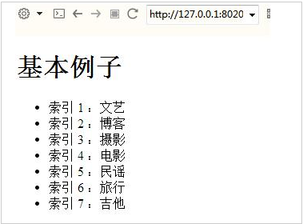
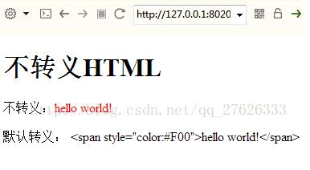
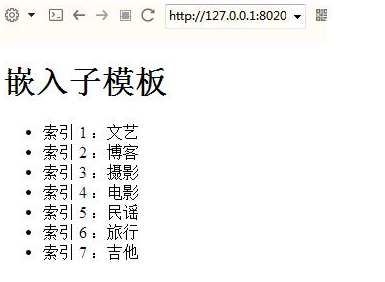
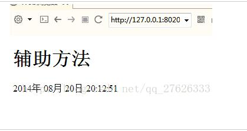

# [JavaScript从入门到精通](https://www.bilibili.com/video/av29885002)

## 初探 JavaScript 魅力

### JavsScript 是什么

- 网页特效原理
  - JavaScript 就是修改样式（文档）
- 编写 JS 的流程
  - 布局：HTML + CSS 
  - 属性：确定要修改的属性
  - 事件： 确定用户 做哪些操作（产品设计）
  - 编写 JS ：在事件中，用 JS 来修改页面元素的样式

### 第一个 JS 特效：鼠标提示框

- 分析效果实现原理

  - 样式：`div` 的 `display / none`
  - 事件：`onmouseover / onmouseout`
  - 动手编写效果

- 特效基础

  - 事件驱动：`onmouseover`
  - 元素属性操作：`obj.style.[...]`
  - 特效实现原理概括：响应式用户操作，对页面元素样式修改

- 兼容性问题 

  ```js
  // div2.style.display='block'; // 部分浏览器不兼容
  document.getElementById('div2').style.display='block'; // 所有浏览器兼容
  ```

- 函数

  - 制作更复杂的效果
  - 直接在事件内写代码会很乱
    - 引入 `function()` 函数的基本形式
    - 把 JS 标签里放入到函数里，类似于 css 里的 `class`
    - 变量的使用：别名
  - 定义和调用
    - 函数定义：告诉系统有这个函数，不会执行
    - 函数调用：执行函数里面的代码
    - 关系和区别

- 代码

  ```html
  <!DOCTYPE html>
  <html>
    <head>
      <meta charset="utf-8">
      <title>第一个JS效果</title>
  
      <style>
        #div2 {
          display: none; 
          background: red; 
          width: 100px; 
          height: 50px; 
          font-size: 16px;
        }
        #div1 {
          display: block; 
          background: red; 
          width: 100px; 
          height: 100px; 
          font-size: 16px;
        }
      </style>
  
      <script>
  
      // 封装 getElementById 函数
      function get(id) {
        return document.getElementById(id);
      }
  
      // 显示 div2
      function show() {
        // div2.style.display='block'; // 部分浏览器不兼容
        get('div2').style.display='block';
      }
  
      // 隐藏 div2
      function hide() {
        // div2.style.display='none'; // 部分浏览器不兼容
        get('div2').style.display='none';
      }
  
      // div1 变绿
      function toGreen() {
       get('div1').style.background='green';
      }
  
      // div1 变蓝
      function toblue() {
        get('div1').style.background='blue';
      }
  
      // div1 变红
      function toRed() {
        get('div1').style.background='red';
      }
      
      // 点击循环变色
      var i = 0;
      function changeColor() {
        console.log('i=',i)
        if (i == 0) {
          toGreen();
          i++;
          console.log('i=',i)
          return;
        } 
        if (i == 1) {
          toblue();
          i++;
          console.log('i=',i)
          return;
        } 
        if (i == 2) {
          toRed();
          i = i - 2;
          console.log('i=',i)
          return;
        }
      }
      </script>
    </head>
  
    <body>
       <!-- 调用页内函数修改样式 -->
      <input type="button" onclick="changeColor()" value="按钮">
      <div id="div1">
      </div>
        <!-- 行内 JS 修改样式 -->
      <input type="checkbox" onmouseover="div2.style.display='block';" onmouseout="div2.style.display='none';" value="按钮">  
      <div id="div2">
        <p>文字<br>文字2</p>
      </div>
    </body>
  </html>
  ```

### 网页换肤和 if 判断

- 网页换肤

  - 土豆网 “开灯” “关灯效果”
  - 任何标签都可以加 ID ，包括 link
  - 任何标签的属性，都可以修改
  - HTML 里面怎么写，JS 里面就怎么写

- if 判断

  - 特效实现原理
  - if 基本形式
  - JS 里面 ` = 赋值， == 判断`
  - 为 a 链接添加 JS 
    - ` <a href="javascript:;"></a> `
  - className  的使用
    - ` class ` 是关键字，所以用 ` className ` 代替
    - 其它 HTML 里面怎么写，JS 里面就怎么写

- 代码

  ```html
  <!DOCTYPE html>
  <html>
    <head>
      <meta http-equiv="Content-Type" content="text/html;charset=UTF-8">
      <link id="link1" rel="stylesheet" type="text/css" href="css/grey.css">
  
      <script>
      function changeColor() {
        if (document.getElementById('b1').value == '关灯') {
          document.getElementById('link1').href = 'css/black.css';
          document.getElementById('b1').value = '开灯';
          console.log('black')
        } else {
          document.getElementById('link1').href = 'css/grey.css';
          document.getElementById('b1').value = '关灯';
          console.log('bl2:', document.getElementById('link1').href)
        }
      }
  
      function changeText() {
        document.getElementById('text1').value = '456';
        document.getElementById('text1').title = '文字1';
      }
  
      function showHide() {
        var div2 = document.getElementById('div2');
        if(div2.style.display == 'block') {
          div2.style.display ='none';
          console.log('1');
        } else {
          div2.style.display = 'block';
          div2.style.background = 'blue';
        }
        console.log('display:', div2.style.display);
      }
  
      function class1() {
        var div = document.getElementById('div4');
        div.className='div5';
        div.id='div5';
      }
      </script>
    </head>
    <body>
      <!-- 换肤 -->
      <input id="b1" type="button" onclick="changeColor()" value="关灯">
      <div id="div1">1</div>
      <div id="div2">2</div>
      <div id="div3">3</div>
      <input type="button" value="显示隐藏div2" onclick="showHide()">
      <br>
      <!-- HTMl 里面怎么写，JS 里面就怎么写 -->
      <input id="text1" type="text" value="123">
      <input type="button" value="改文字" onclick="changeText()">
      <br>
      <!-- a 链接的使用 -->
      <a href="javascript:;">javascript:;</a>
  
      <!-- className 的使用 -->
      <div id="div4">4</div>
      <input type="button" value="className" onclick="class1()">
    </body>
  </html>
  ```

### 函数传参

- 改变背景颜色

  - 函数传参：参数就是占位符
    - 函数里面变量用传参

- 改变 div 的任意样式

  - 操纵属性的第二种方式
    - 要修改的属性不确定时：` 元素.style[ 变量/字符串 ] = 变量/字符串 `
    - JS 中用 `.` 的地方都可以用 `[]` 代替;
    - 字符串变量区别和关系 ：带引号是字符串，不带是变量
  - 将属性名作为参数传递

- style 与 className 

  - ` 元素.style.属性 = 变量/字符串 ` 
    - style 是修改行内样式
  - 行内样式优先级最高，之后再修改 className 不会有效果
  - 建议：只操作一种样式，要么只操作 style ，要么只操作 className

- 代码：

  ```HTML
  <!DOCTYPE html>
  <html>
    <head>
      <meta charset="utf-8">
      <title>函数传参</title>
  
      <style>
        div {
          display: block; 
          background: red; 
          width: 100px; 
          height: 100px; 
          font-size: 16px;
        }
  
        .div2 {
          display: block; 
          background: grey; 
          width: 100px; 
          height: 100px; 
        }
      </style>
  
      <script>
  
      // 封装 getElementById 函数
      function get(id) {
        return document.getElementById(id);
      }
  
      // div1 变绿
      function toGreen() {
       get('div1').style.background='green';
      }
  
      // div1 变蓝
      function toblue() {
        get('div1').style.background='blue';
      }
  
      // div1 变红
      function toRed() {
        get('div1').style.background='red';
      }
      
      // 点击循环变色
      var i = 0;
      function changeColor() {
        console.log('i=',i)
        if (i == 0) {
          toGreen();
          i++;
          console.log('i=',i)
          return;
        } 
        if (i == 1) {
          toblue();
          i++;
          console.log('i=',i)
          return;
        } 
        if (i == 2) {
          toRed();
          i = i - 2;
          console.log('i=',i)
          return;
        }
      }
  
      // 函数传参
      function toColor(color, width) {
        get('div1').style.background = color;
        get('div1').style.width = width;
      }
      // 将属性名作为参数传递
      function chgName(name, width) {
        // get('div1').style.name = width; // name 会被当作属性赋值
        get('div1')['style'][name] = width; // 数组 可以加字符串或者变量
      }
      // 样式优先级
      function chgClass(className) {
        get('div1').className =  className; 
      }
      </script>
    </head>
  
    <body>
      <!-- 调用页内函数修改样式 -->
      <input type="button" onclick="changeColor()" value="循环">
      <!-- 函数传参 -->
      <input type="button" onclick="toColor('green', '200px')" value="变绿">
      <input type="button" onclick="toColor('blue', '300px')" value="变蓝">
      <input type="button" onclick="toColor('red', '400px')" value="变红">
      <input type="button" onclick="chgName('height', '200px')" value="变高">
      <input type="button" onclick="chgClass('div2')" value="class变灰">
      <div id="div1"></div>
  
    </body>
  </html>
  ```

  

### 提取行间事件

- 提取事件
  - 为元素添加事件
    - 事件和其它属性一样，可以用 JS 添加：`元素.事件 = 函数名/函数;`
      - 不能加括号，加括号直接执行函数
    - `window.onload` 的意义：等待页面加载完成再执行 JS
    - 行为( js )、样式( css )、结构( html ) 三者分离
- 获取一组元素
  - ` 元素.getElementsByTagName('标签名') `
    - 数组的使用
    - 数组的属性
  - 全选的实现
- 代码: 同下

### 循环 while 和 for

- 用 while 引入 循环的概念

  - while 循环语法
    - 自增的意义
    - 循环的构成：初始化、条件、语句、自增

- for 循环

  - 用 for 代替 while 循环
    - 用 for 循环为一组元素甜腻骄傲事件
    - 什么时候用循环----一组元素
  - 例子
    - 全选---- checked 属性
    - 反选---- for 循环配合 if 判断

- 代码:

  ```HTML
  <!DOCTYPE html>
  <html>
    <head>
      <meta charset="utf-8">
      <title>提取行间事件和循环</title>
  
      <style>
        div {
          display: block; 
          border: 1px solid black; 
          width: 100px; 
          height: 100px; 
          margin: 10px;
          float: left;
        }
      </style>
        
      <script>
        window.onload = function () {
          // 封装 getElementById 函数
          function get(id) {
            return document.getElementById(id);
          }
  
          // 封装 getElementsByTagName
          function gets(tagName) {
            return document.getElementsByTagName(tagName)
          }
  
          // 提取行间样式
          get('btn1').onclick = function () {
            get('btn1').value = '提取成功';
          }
  
          // 修改一组元素中的某一个元素
          get('btn2').onclick = function () {
            gets('div')[2].style.background = 'blue';
          } 
  
          // 修改一组元素- while 循环
          get('btn3').onclick = function () {
            var i = 0;
            while ( i < gets('div').length ) {
              gets('div')[i].style.background = 'yellow';
              i++;
            }
          } 
          // for
          get('btn4').onclick = function () {
            for (var i = 0; i < gets('div').length; i++ ){
              gets('div')[i].style.background = 'pink';
            }
          } 
  
          // 全选的实现 if 判断 无需div
          get('btn5').onclick = function () {
            for (var i = 0; i < gets('input').length; i++ ){
              if (gets('input')[i].type == 'checkbox'){
                if (gets('input')[i].checked == false) {
                  gets('input')[i].checked = true;
                } else {
                  gets('input')[i].checked = false;
                }
              }
            }
          } 
          // 元素.getElementsByTagName 方法 单个div
          get('btn6').onclick = function () {
            var div2 = get('div2');
            var inp = div2.getElementsByTagName('input');
            for (var i = 0; i < inp.length; i++ ){
              // console.log(inp);
              if (inp[i].checked == false) {
                inp[i].checked = true;
              } else {
                inp[i].checked = false;
              }
            }
          }
          // 元素.getElementsByTagName 方法 多个div
          get('btn7').onclick = function () {
            var div2 = gets('div');
            for (var i = 0; i < div2.length; i++ ){
              var div = gets('div')[i];
              var inps = div.getElementsByTagName('input');
              for (var a = 0; a < inps.length; a++){
                if (inps[a].checked == false) {
                  inps[a].checked = true;
                } else {
                  inps[a].checked = false;
                }
              }
            }
          }  
        };
      </script>
    </head>
  
    <body>
      <!-- 提取行间样式 -->
      <input id="btn1" type="button" value="按钮">
      <!-- 修改一组元素中的某一个元素 -->
      <input type="button" id="btn2" value="改第三个元素">
      <!-- 修改一组元素-循环 -->
      <input type="button" id="btn3" value="while循环改一组元素">
      <input type="button" id="btn4" value="for循环改一组元素">
      <input type="button" id="btn5" value="全选">
      <input type="button" id="btn6" value="全选2">
      <input type="button" id="btn7" value="全选3">
      <div><input type="checkbox" name="1" id="c1"></div>
      <div><input type="checkbox" name="1" id="c2"></div>
      <div><input type="checkbox" name="1" id="c3"></div>
      <div><input type="checkbox" name="1" id="c4"></div>
      <div><input type="checkbox" name="1" id="c5"></div>
  
      <div id="div2">
        <input type="checkbox" name="" id="">
        <input type="checkbox" name="" id="">
        <input type="checkbox" name="" id="">
        <input type="checkbox" name="" id="">
        <input type="checkbox" name="" id="">
        <input type="checkbox" name="" id="">
        <input type="checkbox" name="" id="">
      </div>
  
    </body>
  </html>
  ```

  

### 导航栏选项卡

- 按钮的实现

  - 添加事件
    - this 的使用: 指当前发生事件的元素
  - 先清空所有按钮，再选中当前按钮

- 内容的实现（ul）

  - 先隐藏所有 ul，再显示当前 ul
    - 索引值的使用：什么时候用索引值
    - HTML 添加 index 会被 FireFox 过滤
    - JS 添加 index

- 代码:

  ```HTML
  <!DOCTYPE html>
  <html>
    <head>
      <meta http-equiv="Content-Type" content="text/html;charset=UTF-8">
      <title>导航选项卡</title>
      <style>
        body {
          margin: 0;
          padding: 0;
        }
        #div2 {
          width: 200px;
          height: 200px;
          margin-top: 20px;
          position: relative;
        }
        #div1 {
          width: 200px;
          height: 20px;
          position: absolute;
          top: 0px;
        }
        ul {
          margin: 0;
          padding: 0;
          display: block;
          background: rgb(157, 234, 253);
          float: left;
          position: absolute;
          display: none;
          width: 200px;
          height: 200px;
        }
        .ul {
          display: block;
        }
        a {
          display: block;
          float: left;
          width: 49px;
          height: 20px;
          background: rgb(7, 184, 253);
          border-left: 1px solid rgb(255, 0, 234);
          text-decoration: none;
        }
        .a {
          background: rgb(32, 108, 221);
        }
      </style>
      <script>
        window.onload = function (){
          // 封装 getElementById 函数
          function get(id) {
            return document.getElementById(id);
          }
          // 封装 getElementsByTagName
          function gets(tagName) {
            return document.getElementsByTagName(tagName)
          }
          // 显示第一个元素
          gets('ul')[0].className = 'ul';
          // 当鼠标覆盖某个标签时 显示对应元素
          for (var i = 0; i < 4; i++) {
            gets('a')[i].index = i;
            gets('a')[i].onmouseover = function () {
              for (var a = 0; a < 4; a++) {
                gets('ul')[a].className = '';
                gets('a')[a].className = '';
              }
              // console.log(this);
              gets('ul')[this.index].className = 'ul';
              this.className = 'a';
            }
          }
        }
      </script>
    </head>
    <body>
      <div id="div1">
        <a href="javascript:;" id="a0">1</a>
        <a href="javascript:;" id="a1">2</a>
        <a href="javascript:;" id="a2">3</a>
        <a href="javascript:;" id="a3">4</a>
      </div>
      <div id="div2">
        <ul>
          <li>1</li>
          <li>1</li>
          <li>1</li>
        </ul>
        <ul>
          <li>2</li>
          <li>2</li>
          <li>2</li>
        </ul>
        <ul>
          <li>3</li>
          <li>3</li>
          <li>3</li>
        </ul>
        <ul>
          <li>4</li>
          <li>4</li>
          <li>4</li>
        </ul>
      </div>
    </body>
  </html>
  ```

  

### JS 简易日历

- 程序实现思路

  - 类似于选项卡，只是下面只有一个div
  - innerHTML 的使用

- 数组的使用

  - 定义：` arr = [1, 2, 3] `
  - 使用：` arr[0] `

- 字符串拼接

  - 作用：拼接两个字符串
  - 问题：拼接中的优先级
    - 就近相加, 字符串后面数字相加要加括号

- 代码: 

  ```HTML
  <!DOCTYPE html>
  <html>
    <head>
      <meta http-equiv="Content-Type" content="text/html;charset=UTF-8">
      <title>简易日历</title>
      <style>
        body {
          margin: 0;
          padding: 0;
        }
        td {
          border: 5px solid rgb(218, 218, 218);
          width: 59px;
          height: 59px;
          text-align: center;
          background: rgb(83, 83, 83);
          color: white;
        }
        .td {
          background: rgb(255, 255, 255);
          color: rgb(0, 0, 0);
        }
  
        /* 日历数字区 */
        #t1 {
          border: 10px solid rgb(218, 218, 218);
          margin:0 auto;
          position: relative;
          width: 240px;
          height: 320px;
          background: rgb(218, 218, 218);
        }
  
        /* 下方文字 */
        #d2 {
          margin:0 auto;
          width: 240px;
          height: 100px;
          background: rgb(218, 218, 218);
        }
        #p1 {
          position: relative;
          margin: auto;
          width: 205px;
          height: 80px;
          background: rgb(255, 255, 255);
        }
      </style>
      <script>
        window.onload = function () {
          // 封装 getElementById 函数
          function get(id) {
            return document.getElementById(id);
          }
          // 封装 getElementsByTagName
          function gets(tagName) {
            return document.getElementsByTagName(tagName)
          }
          // 获取所有 td，注册 onmouseover 事件，添加索引
          // console.log(gets('td')) 
          var tds = gets('td');
          var i = 0;
          for (i = 0; i < tds.length; i++) {
            tds[i].index = i;
            tds[i].onmouseover = function () {
              // 先清空 td className
              for (a = 0; a < tds.length; a++) {
                tds[a].className = '';
              }
              // 修改td className 并插入文字
              tds[this.index].className = 'td';
              // console.log(i);
              get('p1').innerHTML = (this.index + 1) + arr[this.index];
            }
          }
  
          arr = [
          '月活动：学编程、英语', '月活动：学编程、英语', '月活动：学编程、日语', 
          '月活动：学编程、画画', '月活动：学编程、旅游', '月活动：学编程', 
          '月活动：学编程', '月活动：学编程', '月活动：学编程', 
          '月活动：学编程', '月活动：学编程', '月活动：学编程'
          ]
        }
      </script>
    </head>
    <body>
      <div id="d1">
        <table id="t1">
          <tr>
            <td>1 <br>JAN</td>
            <td>2 <br>FER</td>
            <td>3 <br>MAR</td>
          </tr>
          <tr>
            <td>4 <br>APR</td>
            <td>5 <br>MAY</td>
            <td>6 <br>JUN</td>
          </tr>
          <tr>
            <td>7 <br>JUL</td>
            <td>8 <br>AUG</td>
            <td>9 <br>SEP</td>
          </tr>
          <tr>
            <td>10 <br>OCT</td>
            <td>11 <br>NOV</td>
            <td>12 <br>DEC</td>
          </tr>
        </table>
        <div id="d2">
          <p id="p1">
  
          </p>
        </div>
      </div>
    </body>
  </html>
  ```

  

## JavaScript 基础

### JavaScript 组成

- ECMAScript：解释器、编译器（几乎所有兼容）
- DOM：Document Object Model，HTML，`document`（大部分兼容）
- BOM：Browser Object Model，浏览器，`window`（完全不兼容）
  - 各组成部分的兼容性、兼容性问题的由来

### 变量类型

- 类型：`typeof` 运算符
  - 用法：`typeof 元素`返回变量的类型
  - 常见类型：
    - `number` 、`string` 、`boolean` 、`undefined`（未定义或定义未使用）、`object`、`function`
- 一个变量应该只放一种类型的数据

### 变量类型转换

- 数据类型转换

  - 例子：计算两个文本框的和

  - 显式类型转换（强制类型转换）

    - `parseInt()`  去除小数、`parseFloat() ` 保留小数：从左至右提取数字，遇到不是数字跳出

    - `NaN ` 的意义和检测：`Not a Number`

    - NaN： NaN 和任何值都不相等，包括它自己

      - 使用 ` isNaN()` 检测是否是全是数字

    - ```
      Number() 转换数值，String() 转换字符串，Boolean() 转换布尔值
      ```

  - 隐式类型的转换

    - `== `：先转换类型 再比较

      对比 `=== `：全等于，不转换类型直接比较

    - ` - `：数字相减

      对比 ` +`：字符串连接、数字相加
      
    - ```js
      5 + null    // 返回 5         因为 null 被转换为 0
      "5" + null  // 返回 "5null"   因为 null 被转换为  "null"
      "5" + 2     // 返回 52        因为 2 被转换为 "2"
      "5" - 2     // 返回 3         因为 "5" 被转换为 5
      "5" * "2"   // 返回 10        因为 "5" 和 "2" 被转换为 5 和 2
      ```

- 更多可用于将数值转换为字符串的方法：

  | 方法            | 描述                                                   |
  | :-------------- | :----------------------------------------------------- |
  | toExponential() | 返回字符串，对数字进行舍入，并使用指数计数法来写。     |
  | toFixed()       | 返回字符串，对数字进行舍入，并使用指定位数的小数来写。 |
  | toPrecision()   | 返回字符串，把数字写为指定的长度。                     |

- 代码：

  ```HTML
  <!DOCTYPE html>
  <html>
    <head>
      <meta http-equiv="Content-Type" content="text/html;charset=UTF-8">
      <title>变量类型转换</title>
      <style></style>
      <script>
        window.onload = function () {
          // 封装 getElementById 函数
          function get(id) {
            return document.getElementById(id);
          }
  
          let t1 = get('t1');
          let t2 = get('t2');
          let b1 = get('b1');
          let s1 = get('s1');
          let s2 = get('s2');
          b1.onclick = function (){
            if (isNaN(t1.value)) {
              s1.innerHTML = '<br>' + t1.value + '不是数字';
            } else if (isNaN(t2.value)) {
              s1.innerHTML = '<br>' + t2.value + '不是数字';
            } else {
              console.log('t1:',typeof t1.value, 't2',typeof t2.value);
              let val = parseInt(t1.value) + parseInt(t2.value);
              let val2 = parseFloat(t1.value) + parseFloat(t2.value);
              s1.innerHTML = '<br>int结果：' + val+ '<br>float结果：' + val2;
              console.log(typeof val);
  
              // == 和 - 隐式转换
              let a = t1.value ;
              let b = t2.value;
              if (a == b) {
                s2.innerHTML = 'a == b' + '<br>a - b = ' + (a - b) + '<br>a + b = ' + (a + b);
              } else if (a === b) {
                s2.innerHTML = 'a === b！';
              } else {
                s2.innerHTML = 'a不等于b！' + '<br>a - b = ' + (a - b) + '<br>a + b = ' + (a + b);
              }
            }
          }
        }
      </script>
    </head>
    <body>
      <input type="text" name="" id="t1">
      <input type="text" name="" id="t2">
      <input type="button" name="" id="b1" value="计算">
      <div>
          <span id="s1"></span>
      </div>
      <div>
          <span id="s2"></span>
      </div>
    </body>
  </html>
  ```


### 变量的作用域和闭包

- 变量作用域（作用范围）
  - 局部变量、全局变量
- 什么是闭包？
  - **子函数可以使用父函数中的局部变量**
  - 之前一直在使用闭包
  - 网上对于闭包的定义

### 命名规范

- 命名规范及必要性
  - 可读性--能看懂
  - 规范性--符合规则
- 匈牙利命名法
  - **类型前缀 + 首字母大写**：` getElementByTagName `

| 类型       | 前缀 | 类型（英文） | 实例         |
| ---------- | ---- | ------------ | ------------ |
| 数组       | a    | Array        | aItems       |
| 布尔值     | b    | Boolean      | bIsComplete  |
| 浮点数     | f    | Float        | fPrice       |
| 函数       | fn   | Function     | fnHandler    |
| 整数       | i    | Integer      | iItemCount   |
| 对象       | o    | Object       | oDiv1        |
| 正则表达式 | re   | RegExp       | reEmailCheck |
| 字符串     | s    | String       | sUserName    |
| 变体变量   | v    | Variant      | vAnything    |

### 运算符

- 算数：` +加、-减、*乘、/ 除、%取模 `

  - 实例：隔行变色、秒转时间

- 赋值：` =、+=、-=、*=、/=、%= `

  - ` +=` ：  `i += 1  等于 i++ `

- 关系：` <、>、<=、>=、== 、===、!=、!==` 

  - `!==` ：不同类型不比较，且无结果，同类型才比较，对应 `===`
  - `!=`：若类型不同，会偿试转换类型，对应 `== `

- 逻辑：&&与、||或、!否

  - 实例：全选与反选

- 运算符优先级：括号

- 代码：

  ```HTML
  <!DOCTYPE html>
  <html>
    <head>
      <meta http-equiv="Content-Type" content="text/html;charset=UTF-8">
      <title>运算符</title>
      <style>
      .blue {
        width: auto;
        height: 20px;
        background: blue;
      }
      .yellow {
        width: auto;
        height: 20px;
        background: yellow;
      }
      </style>
      <script>
        window.onload = function () {
          // 封装 getElementById 函数
          function get(id) {
            return document.getElementById(id);
          }
          // 封装 getElementsByTagName
          function gets(tagName) {
            return document.getElementsByTagName(tagName)
          }
          // 隔行变色
          function liCol() {
            let i = 0;
            let oLi = gets('li') ;
            for (i = 0; i < oLi.length; i++) {
              if (i % 2 === 0) {
                oLi[i].className = 'blue';
              } else {
                oLi[i].className = 'yellow';
              }
            }
          }
          liCol();
  
          // 毫秒转日期
          const date = Date.now();
          // 60000ms / 1000ms /60s /60m /24h /365d
          const millisecond = date % 1000 + '毫秒';
          const second = parseInt(date/1000) % 60 + '秒';
          const minute = parseInt(date/1000/60) % 60 + '分';
          const hour = parseInt(date/1000/60/60) % 24 + 8 + '小时';
          const day = parseInt(date/1000/60/60/24/365) % 30 - 9 + '号';
          const month = parseInt(date/1000/60/60/24/30) % 12 + 4 + '月'; 
          const year = parseInt(date/1000/60/60/24/265) + 1951 +'年';
          const d1 = get('d1');
          d1.innerHTML = millisecond+ second+ minute+ hour+ day+ month+ year;
        }
  
        // 赋值 ` =、+=、-=、*=、/=、%= `
        let i = 11;
        i += 2;
        console.log(i);
        i -= 3;
        console.log(i);
        i *= 2;
        console.log(i);
        i /= 2;
        console.log(i);
        i %= 3;
        console.log(i);
  
        // 判断 <、>、<=、>=、== 、===、!=、!==
        if (i > 0) {
        console.log('i > 0');
        } 
        if (i <= i) {
          console.log('i <= i');
        }
        if (i == '1') {
          console.log('i == "1"')
        }
        if (i === 1) {
          console.log('i === 1')
        }
        if (i != '1') {
          console.log('i != 2')
        }
        if (i !== 1) {
          console.log('i !== 1')
        }
  
        // 逻辑 &&与、||或、!否
        if (i<2 && i>0) {
          console.log('i<2 && i>0')
        }
        if (i<2 || i<0) {
          console.log('i<2 || i<0')
        }
      </script>
    </head>
    <body>
      <div>
        <ul>
          <li></li>
          <li></li>
          <li></li>
          <li></li>
          <li></li>
          <li></li>
          <li></li>
          <li></li>
          <li></li>
        </ul>
      </div>
      <div id="d1"></div>
    </body>
  </html>
  ```

### 程序流程控制

- 判断：`if、switch、?:`
- 循环：`while、for`
- 跳出：`break、continue`
- 什么是真、什么是假
  - 真：true、非零数字、非空字符串、非空对象
  - 假：false、数字0、空字符串、空对象、undefiend
- 代码：同下

### JSON

- 什么是 JSON

- JSON 和数组

- `JSON` 和 `for in`

- 代码：

  ```HTML
  <!DOCTYPE html>
  <html>
    <head>
      <meta http-equiv="Content-Type" content="text/html;charset=UTF-8">
      <title>程序流程控制</title>
      <script>
      window.onload = function () {
        // switch
        var i = 0;
        switch (i){
          case i*++i:
            console.log('i');
            break;
          case 1:
            console.log('1')
            break;
          default:
            console.log('default');
            break;
        }
  
        // ?:  条件?语句一:语句二
        var a = 1;
        a % 2 == 0 ? console.log('双数'):console.log('单数');
  
        // break continue
        for (i = 0; i < 5; i++){
          if (i === 2){
            // break; // 中断所有循环
            continue; // 中断本次循环
          }
          console.log(i);
        }
  
        // json 和 数组
        const json = {a: 2, b: 5, c:9};
        const arr = [23, 45, 5467];
        console.log('b:', json.b, 'c:', json['c'], '没有length', json.length);
        console.log(arr[2], arr.length);
  
        // JSON 和 for in
        for (var i in arr) {
          console.log('第' + i + '个：' + arr[i]);
        }
        for (var i in json) {
          console.log('第' + i + '个：' + json[i]);
        }
      }
      </script>
    </head>
    <body>
    </body>
  </html>
  ```

## 深入 JavaScript

### 函数返回值

- 什么是函数返回值
  - 函数的执行结果
  - 可以没有 return
- 一个函数应该只有一种返回值类型

### 函数传参与行间样式

- 可变函数（不定参数）：`arguments`

  - **参数数组**

- 例子：求和

  - 求所有参数的和

- 例子2：CSS 函数

  - 判断 `arguments.length`
  - 给参数取名，增强可读性

- **取非行间样式（不能用来设置）：**

  - `obj.currentStyle[attr]` 只兼容 IE ，返回小数

  - `getComputedStyle(obj, false)[attr]`，返回小数

  - ```js
    // 解决兼容问题
    // 封装获取计算后元素样式函数
    function getStyle(obj, name) {
        if (obj.currentStyle) {
            return obj.currentStyle[name];
        } else {
            return getComputedStyle(obj, '') [name];
        }
    }
    ```

  - 复合样式：`background` / `border ` 要用具体样式名 `backgroundColor ` 等

  - 单一样式：` width` / `height` / `position`

### 数组基础操作

- 数组的使用

  - 定义
    - `var arr = [23, 234, 23, 45];`
    - `var arr = new Array(12, 5, 7, 34);`
    - 没有任何差别，`[]` 的性能略高，因为代码短

- 数组的属性

  - `length`
    - 既可以获取，又可以设置
    - 例子：快速清空数组 `length  = 0`

- 数组的使用原则：数组中应该只存一种类型的变量

- 数组的方法

  - 添加
    - `push(元素)`，从尾部添加
    - `unshift(元素)`，从头部添加
  - 删除
    - `pop()`，从尾部删除
    - `shift()`，从头部删除

- 排序

  - `数组.sort([比较函数])`，排序一个数组，只有数组能使用

    - 排序一个字符串数组，不加比较函数，**默认按照 ASCII 码排序**

    - 排序一个数字数组，加数字比较大小函数

    - ```js
      // 正序比较函数 数字比大小 字符比ASCII值大小
      function positiveSort(n1, n2) {
          if (isNaN) {
              if (n1 > n2) {
                  return 1;
              }
              if (n1 < n2) {
                  return -1;
              }
              if (n1 === n2) {
                  return 0;
              }
          } else {
              return n1 - n2;
          }
      }
      ```

- 转换类

  - `数组.concat(数组2)`
    - 连接两个数组，可用于深度复制
  - `数组.join(分隔符)`
    - 用分隔符，组合数组元素，生成字符串
    - 字符串 `split`
  - `数组.reverse()`
    - 颠倒数组中元素的顺序

- `数组.slice(start,end)`

  - 从已有数组中返回选定元素，可用于深度复制
  - start 为负数时，和数组长度相加再查找

-  `splice`：先删除，后插入

  - `数组.splice(起点,长度,元素)`

  - 删除

    - `数组.splice(起点,长度)`

  - 插入

    - `数组.splice(起点,0,元素...)`

  - 替换

    - `数组.splice(起点,长度,元素)`
  
- ECMAScript 两个关于位置的方法
  
  - `arrayObject.indexOf(searchvalue,startIndex)`
    - 从startIndex 开始向后查找，默认值为 0
    - 返回 number 查找项在数组中的位置，没找到返回-1
  - ``arrayObject.lastIndexOf(searchvalue,startIndex)`
    - 从startIndex 开始向前查找，默认值为 0
    - 返回 number 查找项在数组中的位置，没找到返回-1
  
- 代码：

  ```HTML
  <!DOCTYPE html>
  <html>
    <head>
      <meta http-equiv="Content-Type" content="text/html;charset=UTF-8">
      <title>数组操作</title>
      <style>
      div {
        margin-top: 10px;
      }
      </style>
      <script>
      var arr = [23, 435, 567, 321, 9, 4];
      var arr2 = new Array('m', 'r', 'a', 'z', 'c', 'p', 'e', '破就', '不发');
  
      // 封装getById
      function get(id) {
        return document.getElementById(id);
      }
  
      window.onload = function () {
        // 显示数组
        function showArr() {
          get('d1').innerHTML = arr + ' + ' + arr2;
        }
        showArr();
  
        // 添加元素 从尾部添加
        get('btn2').onclick = function () {
          arr.push(222);
          showArr();
        }
  
        // 添加元素 从头部添加
        get('btn22').onclick = function () {
          arr.unshift(234);
          showArr();
        }
  
        // 删除元素 从尾部删除
        get('btn3').onclick = function () {
          arr.pop();
          showArr();
        }
  
        // 删除元素 从头部删除
        get('btn33').onclick = function () {
          arr.shift();
          showArr();
        }
  
        // 排序元素
        get('btn4').onclick = function () {
          arr.sort(positiveSort);
          arr2.sort(positiveSort);
          showArr();
        }
        // 比较函数 数字比大小 字符比ASCII值大小
        function positiveSort(n1, n2) {
          if (isNaN) {
            if (n1 > n2) {
              return 1;
            }
            if (n1 < n2) {
              return -1;
            }
            if (n1 === n2) {
              return 0;
            }
          } else {
            return n1 - n2;
          }
        }
  
        // 拼接数组
        get('btn5').onclick = function () {
          arr = arr.concat(arr2);
          showArr();
        }
        
        // 分隔符
        get('btn6').onclick = function () {
          arr = arr.join('_');
          showArr();
        }
        
        // splice 插入 splice(起点,长度,元素)
        get('btn7').onclick = function () {
          arr.splice(2, 0, 5, 1);
          showArr();
        }
        // splice 删除
        get('btn8').onclick = function () {
          arr.splice(0, arr.length);
          showArr();
        }
        // splice 替换 = 删除 + 插入
        get('btn9').onclick = function () {
          arr.splice(2, 1, 999, 888);
          showArr();
        }
  
      }
      </script>
    </head>
    <body>
      <div>
        <input type="button" name="" id="btn2" value="尾部添加元素">
        <input type="button" name="" id="btn22" value="头部添加元素">
        <input type="button" name="" id="btn3" value="尾部删除元素">
        <input type="button" name="" id="btn33" value="头部删除元素">
        <input type="button" name="" id="btn4" value="正序排序元素">
      </div>
      <div>
        <input type="button" name="" id="btn5" value="拼接数组">
        <input type="button" name="" id="btn6" value="分割数组">
      </div>
      <div>
        <input type="button" name="" id="btn7" value="插入元素">
        <input type="button" name="" id="btn8" value="删除元素">
        <input type="button" name="" id="btn9" value="替换元素">
      </div>
      <div id="d1"></div>
    </body>
  </html>
  ```

- 数组名作为变量（遍历数组中的数组）：

  ```js
  var arr1=new Array(); 
  var arr2=new  Array(); 
  var arrlist= new Array(); //存放以上数组
  arrlist.push(arr1);
  arrlist.push(arr2);
  //循环遍历arrlist，就可以达到你要的效果
  ```

  

## 定时器的使用

### 定时器的作用

- 开启定时器

  - `setInterval(函数, 间隔时间)` 间隔型，函数后面不能带括号和传参
  - `setTimeout(函数, 延时时间)`   延时型
  - 两种定时器的区别，定时器要 `window.onload` 完一秒后才执行

- 停止定时器

  - `clearInterval(定时器名字)`
  - `clearTimeout(定时器名字)`

- 代码：

  ```js
  window.onload = function () {
  	var oBtn1 = document.getElementById('btn1');
  	var oBtn2 = document.getElementById('btn2');
      var timer = null;
      
      oBtn1.onclick = function () {
  		timer = setInterval(function () {
              alert('a');
          }, 2000);
      };
      
      oBtn2.onclick = function () {
          clearInterval(timer);
      };
  };
  ```

### 数码时钟

- 效果思路

- 获取系统时间

  - `new Date` 对象
  - `getHours / getMinutes / getSeconds`

- 显示系统时间

  - 字符串连接
  - 空位补零

- 设置图片路径

  - `str[i]`：取出字符串中的第 i 个值，不兼容 ie7
  
- `charAt(i)` 方法 ：取出字符串中的第 i 个值，兼容各种浏览器
  
- 设置路径：`"url('img/0.png')"`
  
- JavaScript 中的 String 方法

  - `obj.charAt(index)`
    - 返回index位置的字符
  - `obj.charCodeAt()`
    - 返回index位置的字符编码
  - `obj.indexOf("str")`
    - 顺序搜索str，返回其位置，未找到返回-1
  - `obj.lastIndexOf("str")`
    - 倒序搜索str，返回其位置，未找到返回-1
  - `slice(start,end)`：同数组
  - `substring(start,end)`：同上，区别在于参数为负数时自动转换为0，并且较小的数为起始位
  - `substr(start,len)`：同上，len 表示截取的长度

- 代码：

  ```HTML
  <!DOCTYPE html>
  <html>
  <meta http-equiv="Content-Type" content="text/html;charset=UTF-8">
    <title>数码时钟</title>
    <style>
    body{
      margin: 0;
      padding: 0;
      background-color: rgb(49, 49, 49);
    }
    li {
      list-style: none;
      float: left;
      width: 100px;
      height: 149px;
    }
    span {
      float: left;
      font-size: 100px;
      color: rgb(255, 255, 255);
    }
    </style>
    <script>
    window.onload = function () {
      // 封装 getElementsByTagName
      function gets(tagName) {
        return document.getElementsByTagName(tagName)
      }
  
      // 数码时钟
      // 数字时钟图片设置函数
      const oLi = gets('li');
      function clock() {
        const date = new Date();
        const str = addZero(date.getHours()) + addZero(date.getMinutes()) + addZero(date.getSeconds());
      
        let i = 0;
        for (i = 0; i < oLi.length; i++) {
          oLi[i].style.backgroundImage = "url('img/"+ str.charAt(i) +".png')";
        }
      }
      // 补零
      function addZero(num) {
        if (num < 10) {
          num = '0' + num;
        } else {
          num = '' + num;
        }
        return num;
      }
      // 先执行一遍，就不会出现一秒的空白，定时器要 window.onload 完一秒后才执行
      clock();
      // 定时器 每秒刷新一次
      setInterval(clock, 1000);
    }
    </script>
    <body>
      <ul>
        <li></li>
        <li></li>
        <span>:</span>
        <li></li>
        <li></li>
        <span>:</span>
        <li></li>
        <li></li>
      </ul>
    </body>
  </html>
  ```
  
  

### Date 对象其它方法

| 方法              | 描述                                    |
| :---------------- | :-------------------------------------- |
| getDate()         | 获得以数值计（1-31）的日                |
| getDay()          | 或者以数值计（0-6）的周                 |
| getFullYear()     | 获得四位的年（yyyy）                    |
| getHours()        | 获得时（0-23）                          |
| getMilliseconds() | 获得毫秒（0-999）                       |
| getMinutes()      | 获得分钟（0-59）                        |
| getMonth()        | 获得月（0-11）                          |
| getSeconds()      | 获得秒（0-59）                          |
| getTime()         | 获得时间（1970 年 1 月 1 日以来的毫秒） |

### 延时提示框

- 效果演示

- 原来的方法

  - 移入显示，移出隐藏

- 移出延时隐藏

  - 移入下面 `div` 后，还是隐藏

- 简化代码

  - 合并两个相同的 `mouseover` 和 `mouseout`
  - 连续 `a=b=c=function()`  两个事件共使用一个函数

- 代码：同下


### 无缝滚动

- 效果演示

- 物体运动基础

  - 让 `div` 移动起来
  - `offsetLeft/offsetTop` 的作用：获取当前对象的左边距/上边距
  - `offsetWidth/offsetHeight`
  - 用定时器让物体连续移动：
    - `innerHTML` 拼接两节图片, 宽度后面加 `px` 才会生效
    - `overflow:hidden;` 隐藏元素外的内容

- 改变滚动的方向

  - 修改 `speed`
  - 修改判定条件
  - 多次点击越来越快：`if (!timer) `或`clearInterval(timer);` 避免重复调用

- 鼠标移入暂停

  - 移入关闭定时器
  - 移出重新开启定时器

- 代码：

  ```HTML
  <!DOCTYPE html>
  <html>
  <meta http-equiv="Content-Type" content="text/html;charset=UTF-8">
    <link rel="stylesheet" href="../reset.css">
    <title>移出延时隐藏</title>
    <style>
      body {
        width: 560px;
        margin: 0 auto;
      }
      #d2 {
        margin: 10px;
        width: 200px;
        height: 200px;
        background-color: rgb(0, 204, 255);
        display: none;
        float: left;
      }
      #d1 {
        margin: 10px;
        width: 100px;
        height: 100px;
        background-color: rgb(0, 255, 149);
        float: left;
      }
      #d3 {
        margin: 220px auto;
        width: 560px;
        height: 140px;
        position: absolute;
        background-color: rgb(135, 182, 182);
        overflow: hidden;
      }
      #u1 {
        position: relative;
      }
      #u1 li {
        float: left;
      }
    </style>
    <script>
    window.onload = function () {
      // 封装 getElementById 函数
      function get(id) {
        return document.getElementById(id);
      }
      // 封装 getElementsByTagName
      function gets(tagName) {
        return document.getElementsByTagName(tagName)
      }
  
      // 鼠标移动到 d1 上，d2 显示，移出隐藏；
      // 鼠标移到 d2 上，清除定时器，移出 d2 开启定时器
      let timer = '';
      get('d1').onmouseover= get('d2').onmouseover = function () {
        clearTimeout(timer);
        get('d2').style.display = 'block';
      }
      get('d1').onmouseout= get('d2').onmouseout = function () {
        timer = setTimeout(hide,1000);
      }
      function hide() {
        get('d2').style.display = 'none';
      }
  
      // 无缝滚动
      get('u1').innerHTML += get('u1').innerHTML;
      get('u1').style.width = gets('li').length * gets('li')[0].offsetWidth + 'px';
      let timer2 = '';
      let speed = 2;
      // 左移
      get('btn1').onclick = function () {
        speed = -2;
        if (!timer2) {
          timer2 = setInterval(move, 30);
        }
      }
      // 右移
      get('btn2').onclick = function () {
        speed = 2;
        if (!timer2) {
          timer2 = setInterval(move, 30);
        }
      }
      // 移动
      function move() {
        get('u1').style.left = get('u1').offsetLeft + speed + 'px';
        if (get('u1').offsetLeft < -get('u1').offsetWidth/2) {
          get('u1').style.left = 0;
        } else if (get('u1').offsetLeft > 0){
          get('u1').style.left = -get('u1').offsetWidth/2 + 'px';
        }
          console.log(get('u1').offsetLeft);
      }
      // 鼠标悬停
      get('d3').onmouseover = function () {
        clearInterval(timer2);
      }
      get('d3').onmouseout = function () {
        timer2 = setInterval(move, 30);
      }
    }
    </script>
    <body>
      <div id="d1"></div>
      <div id="d2"></div>
      <div id="d3">
        <ul id="u1">
          <li></li>
          <li></li>
          <li></li>
          <li></li>
        </ul>
      </div>
      <input type="button" name="" id="btn1" value="左移">
      <input type="button" name="" id="btn2" value="右移">
    </body>
  </html>
  ```
  
  

## DOM 基础

### DOM 基础

- 什么是 DOM
- 浏览器支持情况

### DOM 节点

- DOM 节点
  - 获取子节点
    - `childNodes`：不兼容高版本，用`nodeType` 兼容
      - 获取文本节点`( nodeType == 3)` 和元素节点`( nodeType == 1)`
    - `children`：**只获取元素节点，兼容**
  - `parentNode`：查找父节点
    - 例子：点击链接，隐藏整个 `li`
  - `offsetParent`：查找定位父级
    - 例子：获取元素在页面上的实际位置
  - 首尾子节点
    - `firstChild`  有兼容性问题，IE6-8用
    - `firstElementChild` 高版本使用
    - `lastChild `/ `lastElementChild` 
  - 兄弟节点
    - 有兼容性问题，IE6-8用前面的
    - `nextSbling` / ` nextElementSibling`
    - `previousSibling  `  /  `previousElementSibling`

### 操作元素属性

- 操作元素属性
  - 元素属性操作
    - 第一种：`oDiv.style.display = 'block';`
    - 第二种：`oDiv.style['display'] = 'block';`
    - 第三种：Dom 方式
  - Dom 方式操作元素属性
    - 获取：`getAttribute(名称)`
    - 设置：`setAttribute(名称, 值)`
    - 删除：`removeAttribute(名称)`

### DOM 元素灵活查找

- 用 className 选择元素

  - 如何用 className 选择元素

    - 选出所有元素
    - 通过 className 条件筛选

  - 封装成函数：

    ```js
    // 通过 className 查找元素
    function getByClass(oParent, sClass) {
    	var aResult = [];
    	var aEle = oParent.getElementsByTagName('*');
    	
    	for(var i = 0; i < aEle.length; i++) {
            if (aEle[i].className == sClass) {
                aResult.push(aEle[i]);
            }
        }
        return aResult;
    }
    ```
```
    
    

## DOM 操作应用

### 创建、插入和删除元素

- 创建 DOM 元素

  - `document.createElement(标签名)`	创建一个节点，不渲染
  - `父级.appendChild(节点)`    **删除原有子节点**，再添加子节点，并渲染
    - 例子：为 `ul` 插入 `li`

- 插入元素

  - `父级.insertBefore(节点, 原有节点)`	在已有元素前插入
    - 例子：倒叙插入 `li`

- 删除 DOM 元素

  - `父级.removeChild(节点)` 	删除一个节点
    - 例子：删除 `li`

- 代码：

  ```HTML
  <!DOCTYPE html>
  <html>
    <head>
      <meta http-equiv="Content-Type" content="text/html;charset=UTF-8">
      <title>DOM创建插入删除元素</title>
      <script>
        window.onload = function () {
          // 封装getElementById
          function get(id) {
            return document.getElementById(id);
          };
  
          // 在 ul 下增加 li
          let oUl = get('u1');
          get('btn1').onclick = function () {
            let oLi = document.createElement('li');
            let sL = get('txt1').value + "<a href='javascript:;'>删除</a>";
            oLi.innerHTML = sL;
            oUl.appendChild(oLi);
            aRemove();
          };
          // 从 ul 下插入 li
          get('btn2').onclick = function () {
            let oLi = document.createElement('li');
            let aLi = document.getElementsByTagName('li');
            let sL = get('txt1').value + "<a href='javascript:;'>删除</a>";
            let i = get('txt2').value - 1;
            oLi.innerHTML = sL;
            if (aLi.length > i && aLi.length > 0) {
              oUl.insertBefore(oLi, aLi[i]);
            } else {
              oUl.appendChild(oLi);
            }
            aRemove();
          };
          // 从 ul 下删除 li
          get('btn3').onclick = function () {
            let aLi = document.getElementsByTagName('li');
            let i = get('txt2').value - 1;
            if (i < aLi.length && i >= 0) {
             oUl.removeChild(aLi[i]);
            } else {
              alert('找不到第'+ (parseInt(i) + 1) +'个li');
            }
          };
  
          // this 从 ul 删除 li
          function aRemove() {
            let aA = document.getElementsByTagName('a');
            let i =0
            for (i = 0; i < aA.length; i++) {
              aA[i].onclick = function () {
                oUl.removeChild(this.parentNode);
              }
            }
          }
        }
      </script>
    </head>
    <body>
      <input type="text" name="" id="txt1" value="123">
      <input type="button" name="" id="btn1" value="增加">
      <input type="text" name="" id="txt2" value="1">
      <input type="button" name="" id="btn2" value="插入">
      <input type="button" name="" id="btn3" value="删除">
      <div is="d1">
        <ul id="u1">
        </ul>
      </div>
    </body>
  </html>
```

  

### 文档碎片

- 文档碎片理论上可以提高 DOM 操作性能

- 文档碎片原理

- `document.createDocumentFragment()`：Vue 、MVVM 还有用到

- 代码：

  ```js
  var element  = document.getElementById('ul'); // assuming ul exists
  var fragment = document.createDocumentFragment();
  var browsers = ['Firefox', 'Chrome', 'Opera', 
      'Safari', 'Internet Explorer'];
  
  browsers.forEach(function(browser) {
      var li = document.createElement('li');
      li.textContent = browser;
      fragment.appendChild(li);
  });
  
  element.appendChild(fragment);
  ```

  

## DOM操作应用高级

### 表格标签

| 表格       | 描述                   |
| :--------- | :--------------------- |
| <table>    | 定义表格               |
| <caption>  | 定义表格标题。         |
| <th>       | 定义表格的表头。       |
| <tr>       | 定义表格的行。         |
| <td>       | 定义表格单元。         |
| <thead>    | 定义表格的页眉。       |
| <tbody>    | 定义表格的主体。       |
| <tfoot>    | 定义表格的页脚。       |
| <col>      | 定义用于表格列的属性。 |
| <colgroup> | 定义表格列的组。       |

### 表格应用

- 获取

  - `tBodies / tHead / tFoot / rows / cells `

    ```js
    var oTab = document.getElementById('tab1');
    alert(oTab.tBodies[0].rows[1].cells[1].innerHTML);
    ```

- 隔行变色

  - 鼠标移入高亮

- 添加/删除一行

  -  DOM 方法的使用

- 搜索

  - 版本1：基础版本 -- 字符串比较
  - 版本2：忽略大小写 -- 大小写转换 `toLowerCase()/toUpperCase()`，返回字符串
  - 版本3：模糊搜索 -- `search()` 的使用，没找到返回 -1，找到则返回位置
  - 版本4：多关键词 -- `split()` 分割字符串，返回数组
  - 高亮显示、筛选

- 排序

  - 移动 `li` ，使用`appendChild()`： 删除原有 `li`，尾部新增 `li`
  - 元素排序：元素集合转换成数组 -- `sort()` 排序 -- `appendChild()`插入

- 代码：

  ```HTML
  <!DOCTYPE html>
  <html>
    <head>
      <meta http-equiv="Content-Type" content="text/html;charset=UTF-8">
      <title>表格操作</title>
      <style>
        body {
          margin: 0 auto;
          width: 400px;
        }
        table {
          border: rgb(97, 97, 97) 1px solid;
          width: 400px;
        }
        td {
          border: rgb(255, 106, 136) 1px solid;
        }
      </style>
      <script>
        window.onload = function () { 
          // 封装getElementById
          function get(id) {
            return document.getElementById(id);
          };
  
          // 表格数据
          // tHead 作为最后一个数组传入
          var data = new Array(
            [1, '张三', 12, "<a href='javascript:;'>删除</a>"],
            [2, '李四', 13, "<a href='javascript:;'>删除</a>"],
            [3, '王五', 14, "<a href='javascript:;'>删除</a>"],
            [4, '王七', 19, "<a href='javascript:;'>删除</a>"],
            [5, '王九', 24, "<a href='javascript:;'>删除</a>"],
            [6, '李六', 42, "<a href='javascript:;'>删除</a>"],
            [7, '李三', 23, "<a href='javascript:;'>删除</a>"],
            [8, '李六', 76, "<a href='javascript:;'>删除</a>"],
            [9, 'CAT', 8, "<a href='javascript:;'>删除</a>"],
            [10, 'cat', 2, "<a href='javascript:;'>删除</a>"],
            [11, 'dog', 1, "<a href='javascript:;'>删除</a>"],
            [12, '3', 5, "<a href='javascript:;'>删除</a>"],
            [13, '31', 2, "<a href='javascript:;'>删除</a>"],
            [14, '4', 7, "<a href='javascript:;'>删除</a>"],
            [15, '42', 9, "<a href='javascript:;'>删除</a>"],
            [16, '啊Q', 9, "<a href='javascript:;'>删除</a>"],
            ['ID', '姓名', '年龄', "操作"]
          );
  
          // 传入格式化数组文件 data ，自动生成表格
          function createTable(data) {
            // 使用文档碎片 生成表格
            // var frag = document.createDocumentFragment();
            var table = document.createElement('table');
            var caption = document.createElement('caption');
            var thead = document.createElement('thead');
            var tbody = document.createElement('tbody');
            var tr = document.createElement('tr');
            // 渲染表格
            get('b1').appendChild(table);
            table.appendChild(caption);
            table.appendChild(thead);
            table.appendChild(tbody);
            thead.appendChild(tr);
            var oTr = document.getElementsByTagName('tr');
            // 渲染单元格
            caption.innerHTML = "<strong style='font-size: 20px'>人员表</strong>";
            var i = 0;
            var j = 0;
            var rNmb = data.length - 1; // 行
            var rLth = data[0].length;  //列
            // 生成表头
            for (i = 0; i < rLth; i++){
              var th = document.createElement('th');
              oTr[0].appendChild(th);
              // 写入th数据
              var aArr = data[rNmb];
              table.tHead.rows[0].cells[i].innerHTML = aArr[i];
            }
            // 生成 tbody 及插入内容
            for (i = 0; i < rNmb; i++) {
              var tr = document.createElement('tr');
              tbody.appendChild(tr);
              for (j = 0; j < rLth; j++) {
                var td = document.createElement('td');
                tr.appendChild(td);
                // 写入td数据
                aArr = data[i];
                table.tBodies[0].rows[i].cells[j].innerHTML = aArr[j];
              }
            }
            // 不加 tBodies[0] 会把 tHead 当作一行
            // console.log(table.rows.length); 
            chgColor();
            aClick();
          }
          createTable(data);
  
          function chgColor() {
            // 隔行变色
            var oTr = document.getElementsByTagName('tr');
            var oldColor = '';
            for (i = 1; i < oTr.length; i++) {
              if (i % 2 === 0) {
                oTr[i].style.background = '#eee';
              } else {
                oTr[i].style.background = '#bbb';
              }
              // 鼠标移入高亮
              oTr[i].onmouseover = function () {
                oldColor = this.style.background;
                this.style.background = 'yellow';
              }
              oTr[i].onmouseout = function () {
                this.style.background = oldColor;
              }
            }
          }
  
          // 增加/删除一行 
          var btn1 = get('btn1');
          var btn2 = get('btn2');
          var btn3 = get('btn3');
          var btn4 = get('btn4');
          var btn5 = get('btn5');
          var btn6 = get('btn6');
          var txt1 = get('txt1');
          var txt2 = get('txt2');
          var txt3 = get('txt3');
          var txt4 = get('txt4');
          var id = data.length;
          var oTab = document.getElementsByTagName('table');
          // txt1 txt2 增加一行
          btn1.onclick = function () {
            if (txt1.value != '' && txt2.value != '') {
              var newPerson = new Array(id, txt1.value, txt2.value, "<a href='javascript:;'>删除</a>")
              data.splice(data.length - 1, 0, newPerson);
              get('b1').removeChild(oTab[0]);
              createTable(data);
              id++;
            } else {
              alert('请输入姓名和年龄！');
            }
          }
          // 根据 txt4 删除一行
          btn3.onclick = del;
          function del() {
            for (var i in data) {
              var aData = data[i];
              // console.log(aData[0])
              // 校验输入ID 是否和 data.ID 匹配
              if (aData[0] === parseInt(txt4.value) || aData[0] === parseInt(txtTd)) {
                data.splice(i, 1);
                break;
              }
            }
            get('b1').removeChild(oTab[0]);
            createTable(data);
          }
  
          // 注册 a 标签删除操作事件
          var txtTd = '';
          function aClick() {
            var oA = document.getElementsByTagName('a');
            for (var i in oA) {
              oA[i].onclick = function () {
                // oTab[0].tBodies[0].removeChild(this.parentNode.parentNode);
                txtTd = this.parentNode.parentNode.cells[0].innerHTML;
                del();
              }
            }
          }
  
          // data 筛选查询
          btn2.onclick = searchTr;
          function searchTr() {
            var oTr = document.getElementsByTagName('tr');
            var bData = new Array();
            // 储存表头
            var thData = data[data.length-1];
            if (txt3.value != '') {
              for (var i in data) {
                var aData = data[i];
                // console.log(aData[0])
                // 校验输入name 是否和 data.name 匹配
                if (aData[1].toLowerCase() === txt3.value.toLowerCase()) {
                  // 忽略大小写
                  bData.push(data[i]);
                } else if (aData[1].toLowerCase().search(txt3.value.toLowerCase()) != -1) {
                  // 模糊搜索 search()
                  bData.push(data[i]);
                } else {
                  // 多关键词搜索 split() 分割关键词
                  var aTxt = txt3.value.split(' ');
                  for(var j in aTxt) {
                    if (aData[1].toLowerCase().search(aTxt[j].toLowerCase()) != -1) {
                      bData.push(data[i]);
                      continue;
                    }
                  }
                }
              }
            // 传入表头 thData
            bData.push(thData);
            get('b1').removeChild(oTab[0]);
            createTable(bData);
            } else {
              back();
            }
          }
  
          // 恢复 data
          btn4.onclick = back;
          function back() {
            get('b1').removeChild(oTab[0]);
            createTable(data);
          }
  
          // tr 高亮查询
          btn5.onclick = function () {
            chgColor();
            var name = '';
            for (i = 0; i < oTab[0].tBodies[0].rows.length; i++) {
              name = oTab[0].tBodies[0].rows[i].cells[1].innerHTML; 
              if (txt3.value != '') {
                if (name.toLowerCase() === txt3.value.toLowerCase()) {
                  // 忽略大小写
                  oTab[0].tBodies[0].rows[i].style.background = 'yellow';
                } else if (name.toLowerCase().search(txt3.value.toLowerCase()) != -1) {
                  // 模糊搜索 search()
                  oTab[0].tBodies[0].rows[i].style.background = 'yellow';
                } else {
                  // 多关键词搜索 split() 分割关键词
                  var aTxt = txt3.value.split(' ');
                  for(var j in aTxt) {
                    if (name.toLowerCase().search(aTxt[j].toLowerCase()) != -1) {
                      oTab[0].tBodies[0].rows[i].style.background = 'yellow';
                      continue;
                    }
                  }
                }
              } else {
                back();
              }
            }
          }
  
          // data 根据元素排序 sort() 方法
          btn6.onclick = sortName;
          var item = 0; // 排序的元素
          var txt5 = get('txt5');
          var thData = data[data.length-1]; // 保存 th
          function sortName() {
            item = parseInt(txt5.value);
            data.pop(); // 去掉最后的 th
            data.sort(compare); // 正向排序
            data.push(thData); // th 加回去
            back(); //生成表格
          }
          // 比较函数 此函数 数字类型和字符串类型不能混排
          function compare(arr1, arr2) {
            var val1 = arr1[item];
            var val2 = arr2[item];
            if (!isNaN(val1) && !isNaN(val2)) {
              return val1 - val2;
            } else {
              if (val1 > val2) {
                return 1;
              } else if (val1 < val2) {
                return -1;
              } else if (val1 === val2) {
                return 0;
              }
            }
          }
        }
      </script>
    </head>
    <body id="b1">
      <div>
        <input type="text" name="name" id="txt1" placeholder="姓名">
        <input type="text" name="age" id="txt2" placeholder="年龄">
        <input type="button" name="" id="btn1" value="增加">
      </div>
      <div>
        <input type="text" name="" id="txt3" value="张三 六 五">
        <input type="button" name="" id="btn2" value="筛选查询">
        <input type="button" name="" id="btn4" value="返回">
        <input type="button" name="" id="btn5" value="高亮查询">
      </div>
      <div>
        <input type="text" name="" id="txt4" placeholder="id">
        <input type="button" name="" id="btn3" value="删除">
      </div>
      <div>
        <input type="text" name="" id="txt5" value='1'>
        <input type="button" name="" id="btn6" value="排序">
      </div>
    </body>
  </html>
  ```

  

### 表单应用

- 表单基础知识（本章学习事件的时候再详细说明）
  - 什么是表单
    - 向服务器提交数据，比如：用户注册
  - `action ` ： 提交到哪里
- 表单事件 
  - `onsubmit`：提交时发生
  - `onreset`：重置时发生
- 表单内容验证
  - 阻止用户输入非法字符：阻止事件
  - 输入时、失去焦点时验证：`onkeyup` 和`onblur`
  - 提交时检查：`onsubmit`
  - 后台数据检查


## JS 运动基础

### 运动基础

- 让 `div` 动起来
- 速度：物体运动快慢
- 运动中的 Bug
  - 不会停止
  - 速度取某些值会无法停止
  - 到达位置后点击还会运动
  - 重复点击速度加快
- 匀速运动
  - 速度不变

### 运动框架及应用

- 运动框架

  - 在开始运动时，关闭已有定时器
  - 把运动和停止隔开：`if / else`

- 运动框架实例

  - 例子1：“分享到” 侧边栏
    - 通过目标点，计算速度值
  - 例子2：淡入淡出图片
    - 用变量储存透明度
    - `filter:alpha(opacity=30); opacity: 0.3;` IE 用前者

- ```HTML
  <!DOCTYPE html>
  <html>
    <head>
      <meta http-equiv="Content-Type" content="text/html;charset=UTF-8">
      <title>运动框架及应用</title>
      <style>
        #div1 {
          width: 150px;
          height: 400px;
          background-color:cyan;
          position: absolute;
          left: -150px;
        }
        #div1 span {
          width: 20px;
          height: 60px;
          left: 150px;
          background-color:rgb(106, 176, 255);
          position: absolute;
          margin-top: 170px;
        }
        #div2 {
          left: 200px;
          position: absolute;
          filter:alpha(opacity=30);
          opacity: 0.3;
        }
      </style>
      <script>
        window.onload = function () {
          // 封装getElementById
          function get(id) {
            return document.getElementById(id);
          };
  
          var oDiv = get('div1');
          var timer = '';
          var speed = 0;
          var target = 0;
          // 运动框架
          function startMove(target) {
            clearInterval(timer);
            timer = setInterval(move, 30);
            function move() {
              if (oDiv.offsetLeft < target) {
                speed = 10;
                oDiv.style.left = oDiv.offsetLeft + speed + 'px';
              } else if (oDiv.offsetLeft > target) {
                speed = -10;
                oDiv.style.left = oDiv.offsetLeft + speed + 'px';
              } else if (oDiv.offsetLeft === target){
                clearInterval(timer);
              }
            }
          }
          // 注册鼠标移入事件
          oDiv.onmouseover = function () {
            startMove(0);
          };
          oDiv.onmouseout = function () {
            startMove(-150);
          };
  
          // 图片淡入淡出
          var oDiv2 = get('div2');
          var alpha = 30;
          oDiv2.onmouseover = function () {
            shallow(100);
          }
          oDiv2.onmouseout = function () {
            shallow(30);
          }
          function shallow(target) {
            clearInterval(timer);
            timer = setInterval(shallowMove, 30);
            function shallowMove() {
              if (alpha === target) {
                clearInterval(timer);
              } else if (alpha < target) {
                speed = 10;
                alpha += speed;
                oDiv2.style.filter = 'alpha(opacity='+ alpha +')';
                oDiv2.style.opacity = alpha/100;
              } else if (alpha > target) {
                speed = -10;
                alpha += speed;
                oDiv2.style.filter = 'alpha(opacity='+ alpha +')';
                oDiv2.style.opacity = alpha/100;
              }
            }
          }
        }
      </script>
    </head>
    <body>
      <div id="div1">
        <span>分享到</span>
      </div>
      <div id="div2"></div>
    </body>
  </html>
  ```

### 缓冲运动

- 逐渐变慢，最后停止

- 距离越大速度越大，**速度取整**

  - 速度由距离决定
  - 速度 = (目标值-当前值)/缩放系数
  - `Math.ceil`：向上取整
  - `Math.floor`：向下取整

- 例子：缓冲菜单

  - Bug：速度取整  `Math.ceil`、`Math.floor`
  - 跟随页面滚动的缓冲侧边栏
    - 潜在问题：目标不是整数时
    - 目标取整：`parseInt()`
  - ` scrollTop = document.documentElement.scrollTop || document.body.scrollTop;`
    - `document.documentElement.scrollTop`：IE、Firefox
    - `document.body.scrollTop`：chrome

- `Math.random()`

  - 返回一个等于0小于1的一个随机浮点数
  - 说明：求 n到 m之间的**随机整数的公式**
    - `random = Math.floor(Math.random()*(m-n+1)+n)`

- 代码：

  ```HTML
  <!DOCTYPE html>
  <html>
    <head>
      <meta http-equiv="Content-Type" content="text/html;charset=UTF-8">
      <link rel="stylesheet" href="../reset.css">
      <title>缓冲运动及停止条件</title>
      <style>
        body {
          width: 800px;
          height: 2000px;
        }
        #div1 {
          width: 150px;
          height: 400px;
          background-color:cyan;
          position: absolute;
          left: -150px;
        }
        #div1 span {
          width: 20px;
          height: 60px;
          left: 150px;
          background-color:rgb(106, 176, 255);
          position: absolute;
          margin-top: 170px;
        }
        #div2 {
          top: 50px;
          left: 150px;
          position: absolute;
          filter:alpha(opacity=30);
          opacity: 0.3;
          width: 140px;
          height: 140px;
          background-color: red;
        }
        #div3 {
          width: 100px;
          height: 200px;
          background: rgb(99, 128, 255);
          position: absolute;
          right: 0px;
          bottom: 0px;
        }
        #div4 {
          width: 298px;
          height: 198px;
          border: rgb(0, 0, 0) solid 1px;
          position: absolute;
          left: 100px;
        }
      </style>
      <script>
        window.onload = function () {
          // 封装getElementById
          function get(id) {
            return document.getElementById(id);
          };
  
          var oDiv = get('div1');
          var timer = '';
  
          // 注册鼠标移入事件
          oDiv.onmouseover = function () {
            startMove(0, oDiv);
          };
          oDiv.onmouseout = function () {
            startMove(-150, oDiv);
          };
  
          // 图片淡入淡出
          var oDiv2 = get('div2');
          var alpha = 30;
          oDiv2.onmouseover = function () {
            shallow(100);
          }
          oDiv2.onmouseout = function () {
            shallow(30);
          }
          // 变浅函数
          function shallow(target) {
            clearInterval(timer);
            timer = setInterval(shallowMove, 30);
            function shallowMove() {
              speed = (target - alpha)/7;
              if (alpha === target) {
                clearInterval(timer);
              } else if (alpha < target) {
                alpha += speed;
                oDiv2.style.filter = 'alpha(opacity='+ Math.ceil(alpha) +')';
                oDiv2.style.opacity = Math.ceil(alpha)/100;
              } else if (alpha > target) {
                alpha += speed;
                oDiv2.style.filter = 'alpha(opacity='+ Math.floor(alpha) +')';
                oDiv2.style.opacity = Math.floor(alpha)/100;
              }
            }
          }
  
          // 跟随页面滚动的缓冲侧边栏
  
          var oDiv3 = get('div3'); 
          window.onscroll = function () {
            var scrollTop = document.documentElement.scrollTop || document.body.scrollTop;
            var target = parseInt((document.documentElement.clientHeight - oDiv3.offsetHeight)/2 + scrollTop);
            scrollMove(target);
            console.log(
              '可视区：', document.documentElement.clientHeight,
              '滚动距离：', scrollTop, 
              'div3的高度：', oDiv3.offsetHeight, 
              '目标值：', target) 
          }
          // 纵向运动函数
          function scrollMove(target) {
            clearInterval(timer);
            timer = setInterval(scrollMoving, 30);
  
            function scrollMoving() {
              var speed = (target - oDiv3.offsetTop)/7;
              if (oDiv3.offsetTop === target) {
                clearInterval(timer);
              } else if (oDiv3.offsetTop > target) {
                oDiv3.style.top = oDiv3.offsetTop + Math.floor(speed) + 'px';
              } else if (oDiv3.offsetTop < target) {
                oDiv3.style.top = oDiv3.offsetTop + Math.ceil(speed) + 'px';
              }
            }
          }
  
          // 运动停止的条件
          var btn1 = get('btn1');
          var btn2 = get('btn2');
          var btn3 = get('btn3');
          var btn4 = get('btn4');
          btn1.onclick = function () {
            startMove(100, oDiv2);
          }
          btn2.onclick = function () {
            startMove(400, oDiv2);
          }
          btn3.onclick = function () {
            startMove2(100, oDiv2);
          }
          btn4.onclick = function () {
            startMove2(400, oDiv2);
          }
          // 横向缓冲运动框架
          function startMove(target, div) {
            clearInterval(timer);
            timer = setInterval(move, 30);
            function move() {
              speed = (target - div.offsetLeft)/9;
              if (div.offsetLeft < target) {
                div.style.left = div.offsetLeft + Math.ceil(speed) + 'px';
              } else if (div.offsetLeft > target) {
                div.style.left = div.offsetLeft + Math.floor(speed) + 'px';
              } else if (div.offsetLeft === target){
                clearInterval(timer);
              }
            }
          }
          // 横向匀速运动框架
          function startMove2(target, div) {
            clearInterval(timer);
            timer = setInterval(move2, 30);
            function move2() {
              // speed正向
              if (div.offsetLeft <= target) {
                speed = 9;
                moving();
              }
              // speed反向
              else if (div.offsetLeft >= target) {
                speed = -9;
                moving();
              } 
              function moving() {
                if (Math.abs(target - div.offsetLeft) <= Math.abs(speed)) {
                  div.style.left = target + 'px'; // 直接到达
                  clearInterval(timer); // 停止
                } else {
                  div.style.left = div.offsetLeft + speed + 'px';
                }
              }
            }
          }
        }
      </script>
    </head>
    <body>
      <div id="div1">
        <span>分享到</span>
      </div>
      <div id="div2"></div>
      <div id="div3"></div>
      <div id="div4">
        <input type="button" name="" id="btn1" value="减速到100px">
        <input type="button" name="" id="btn2" value="减速到400px">
        <input type="button" name="" id="btn3" value="匀速到100px">
        <input type="button" name="" id="btn4" value="匀速到400px">
      </div>
      </div>
    </body>
  </html>
  ```

### 运动的停止条件

- 运动终止条件
  - 匀速运动：两点足够近（直接改位置），`Math.abs()` 取绝对值
  - 缓冲运动：两点重合（取整后）
- 代码：同上

## JS 运动应用

### 多物体运动框架

- 多个物体同时运动
  - 例子：多个 `div` ，鼠标移入变宽
    - 单定时器，存在问题
    - 每个 `div` 一个定时器
- 多物体运动框架
  - 定时器作为物体的属性
  - 参数的传递：物体、目标值
  - 例子：多个 `div` 淡入淡出
    - 所有东西都不能公用
    - 属性与运动对象绑定：速度、其它属性值（如透明度等）
- 代码：同下

### 任意值运动框架

- `offset` 属性的 Bug

  - 获取的是整个盒子模型的大小，有边框的 div 变宽
    - 用 `obj.currentStyle('name')` 和 `getComputedStyle(obj,'').name`代替 `offset`

- 原有运动框架的问题

  - 只能让某个值运动起来
  - 如果想让其他值运动起来，要修改程序

- 扩展的运动框架

  - 运动属性作为参数
  - 封装 `opacity `
    - 小数精度问题：`Math.round()`  四舍五入取整

- 代码：

  ```HTML
  <!DOCTYPE html>
  <html>
    <head>
      <meta http-equiv="Content-Type" content="text/html;charset=UTF-8">
      <link rel="stylesheet" href="../reset.css">
      <title>缓冲运动及停止条件</title>
      <style>
        body {
          width: 800px;
          height: 2000px;
        }
        div {
          width: 100px;
          height: 100px;
          background-color: darkblue;
        }
        #div1 {
          position: absolute;
        }
        #div2 {       
          position: absolute;
          top: 110px;
        }
        #div3 {
          position: absolute;
          top: 220px;
        }
        #div4 {
          position: absolute;
          top: 330px;
          opacity: 0.3;
          filter: alpha(opacity=30);
        }
        #div5 {
          position: absolute;
          top: 440px;
          opacity: 0.3;
          filter: alpha(opacity=30);
        }
        #div6 {
          position: absolute;
          top: 550px;
          opacity: 0.3;
          filter: alpha(opacity=30);
        }
        #div7 {
          left: 400px;
          position: absolute;
        }
        #div8 {
          left: 510px;
          position: absolute;
          border: red solid 10px;
        }
        #div9 {
          left: 110px;
          top: 330px;
          position: absolute;
          color: seashell;
        }
        #div10 {
          left: 110px;
          top: 440px;
          position: absolute;
          border: rgb(255, 106, 0) solid 1px;
        }
        #div11 {
          left: 110px;
          top: 550px;
          position: absolute;
          opacity: 0.2;
          filter: alpha(opacity=20);
        }
      </style>
      <script>
        window.onload = function () {
          // 封装getElementById
          function get(id) {
            return document.getElementById(id);
          };
          // 封装获取计算后元素样式函数，返回小数
          function getStyle(obj, name) {
            if (obj.currentStyle) {
              return obj.currentStyle[name];
            } else {
              return getComputedStyle(obj, '') [name];
            }
          }
  
          //  多物体运动框架 offset 获取的是整个盒子的大小，无法通用
          // function startMove(obj, iTarget, name) {
          //   clearInterval(obj.timer);
          //   obj.timer = setInterval(move, 30);
          //   function move() {
          //     iTarget = parseInt(iTarget);
          //     var speed = (iTarget - obj['offset'+name])/7;  
          //     if (speed < 0) {
          //       speed = Math.floor(speed);
          //     } else {
          //       speed = Math.ceil(speed);
          //     }
          //     if (iTarget === obj['offset'+name]) {
          //       clearInterval(obj.timer);
          //     } else {
          //       obj.style[name.toLowerCase()] = obj['offset'+name] + speed + 'px'; 
          //     }
              
          //     console.log(iTarget,obj['offset'+name],speed)
          //   }
          // }
  
          // 任意值运动框架
          function startMove(obj, iTarget, name) {
            clearInterval(obj.timer);
            obj.timer = setInterval(move, 30);
            function move() {
              var objName = 0;
              if (name === 'opacity') {
                // 用 parseFloat 保留小数并去掉后面 px ，从左至右提取数字，遇到不是数字跳出
                // Math.round() 四舍五入取整 
                objName = Math.round(parseFloat(getStyle(obj, name))*100);
              } else {
                // 用 parseInt 去掉后面 px ，从左至右提取数字，遇到不是数字跳出
                objName = parseInt(getStyle(obj, name));
              }
              var speed = (iTarget - objName)/7;  
              if (speed < 0) {
                speed = Math.floor(speed);
              } else {
                speed = Math.ceil(speed);
              }
              if (iTarget === objName) {
                clearInterval(obj.timer);
              } else {
                if (name === 'opacity') {
                  obj.style[name] = (objName + speed)/100;
                  obj.style.filter = "alpha("+[name]+ "=" + (objName + speed) + ")"; 
                } else {
                  obj.style[name] = objName + speed + 'px'; 
                }
              }
              console.log('iTarget',iTarget,'objName',objName,'getStyle',getStyle(obj, name),speed)
            }
          }
  
          var oDiv1 = get('div1');
          var oDiv2 = get('div2');
          var oDiv3 = get('div3');
          var oDiv7 = get('div7');
          var oDiv8 = get('div8');
          var oDiv9 = get('div9');
          var oDiv10 = get('div10');
          var oDiv11 = get('div11');
          // 变宽
          oDiv1.onmouseover = function () {
            startMove(oDiv1, 400, 'width')
          }
          oDiv1.onmouseout = function () {
            startMove(oDiv1, 100, 'width')
          }
          oDiv2.onmouseover = function () {
            startMove(oDiv2, 400, 'width')
          }
          oDiv2.onmouseout = function () {
            startMove(oDiv2, 100, 'width')
          }
          oDiv3.onmouseover = function () {
            startMove(oDiv3, 400, 'width')
          }
          oDiv3.onmouseout = function () {
            startMove(oDiv3, 100, 'width')
          }
          // 变高
          oDiv7.onmouseover = function () {
            startMove(oDiv7, 400, 'height')
          }
          oDiv7.onmouseout = function () {
            startMove(oDiv7, 100, 'height')
          }
          oDiv8.onmouseover = function () {
            startMove(oDiv8, 400, 'height')
          }
          oDiv8.onmouseout = function () {
            startMove(oDiv8, 100, 'height')
          }
          oDiv9.onmouseover = function () {
            startMove(oDiv9, 40, 'fontSize')
          }
          oDiv9.onmouseout = function () {
            startMove(oDiv9, 12, 'fontSize')
          }
          oDiv10.onmouseover = function () {
            startMove(oDiv10, 100, 'borderWidth')
          }
          oDiv10.onmouseout = function () {
            startMove(oDiv10, 1, 'borderWidth')
          }
          oDiv11.onmouseover = function () {
            startMove(oDiv11, 100, 'opacity')
          }
          oDiv11.onmouseout = function () {
            startMove(oDiv11, 20, 'opacity')
          }
  
          // 淡入淡出
          function shallowMove(obj, iTarget) {
            clearInterval(obj.timer);
            obj.timer = setInterval(move, 30);
            function move() {
              iTarget = parseInt(iTarget);
              var speed = (iTarget - obj.alpha)/7;  
              if (speed < 0) {
                speed = Math.floor(speed);
              } else {
                speed = Math.ceil(speed);
              }
              if (iTarget === obj.alpha) {
                clearInterval(obj.timer);
              } else {
                obj.alpha += speed;
                obj.style.opacity = obj.alpha/100 ; 
                obj.style.filter = "alpha(opacity="+ obj.alpha + ")";
              }
            }
          }
          var oDiv4 = get('div4');
          var oDiv5 = get('div5');
          var oDiv6 = get('div6');
          var aDiv = document.getElementsByTagName('div');
          for (var i in aDiv) {
            aDiv[i].alpha = 30;
          }
  
          oDiv4.onmouseover = function () {
            shallowMove(oDiv4, 100)
          }
          oDiv4.onmouseout = function () {
            shallowMove(oDiv4, 30)
          }
          oDiv5.onmouseover = function () {
            shallowMove(oDiv5, 100)
          }
          oDiv5.onmouseout = function () {
            shallowMove(oDiv5, 30)
          }
          oDiv6.onmouseover = function () {
            shallowMove(oDiv6, 100)
          }
          oDiv6.onmouseout = function () {
            shallowMove(oDiv6, 30)
          }
        }
      </script>
    </head>
    <body>
      <div id="div1"></div>
      <div id="div2"></div>
      <div id="div3"></div>
      <div id="div4"></div>
      <div id="div5"></div>
      <div id="div6"></div>
      <div id="div7"></div>
      <div id="div8"></div>
      <div id="div9">123adsfzv</div>
      <div id="div10"></div>
      <div id="div11"></div>
    </body>
  </html>
  ```

  

### 仿 Flash 图片展示

- 效果思路

  - 两边的按钮：淡入淡出
  - 大图下拉：层级、高度变化
  - 下方的 `li` ：多物体淡入淡出
  - 下方的 `ul` ：位置计算

- 左右按钮

  - 淡入淡出
    - 鼠标移动到按钮上，按钮会消失
      - 层级问题
      - 按钮和遮罩上都得加上事件

- 下方 `li` 效果

  - 点击切换大图：选项卡
  - `li` 淡入淡出：移入移出
  - `ul` 移动：位置计算

- 大图片切换

  - 图片层级：`z-Index` 一直 +1
  - 图片下拉效果（运动框架）
    - 可以改为淡入淡出

- 加入自动播放

  - 和选项卡一样

- 代码：

  ```HTML
  <!DOCTYPE html>
  <html>
    <meta http-equiv="Content-Type" content="text/html;charset=UTF-8">
    <title>仿Flash图片展示</title>
    <link rel="stylesheet" href="../reset.css">
    <script src="./lib/move.js"></script>
    <style>
      body {
        width: 100%;
        height: 100%;
        background-color: cornsilk;
      }
      li {
        float: left;
      }
      /* 居中 div */
      #div_center {
        margin: 20px auto;
        width: 640px;
        height: 450px;
      }
      /* 定位 div */
      #div_position {
        width: 640px;
        height: 450px;
        overflow: hidden;
        background-color: rgb(70, 70, 70);
        position: absolute;
      }
  
      /* 大图样式 */
      #div_pic {
        width: 640px;
        height: 360px;
        overflow: hidden;
        position: relative;
      }
      .ul_pic {
        position: absolute;
      }
      .li_pic {
        position: absolute;
      }
      .li_pic img{
        width: 640px;
        height: 360px;
      }
  
      /* 左右键样式 */
      .ul_btn {
        top: 0px;
        width: 640px;
        height: 360px;
        position: absolute;
        float: left;
      }
      .slider_btn_left, .slider_btn_right {
        width: 150px;
        height: 360px;
      }
      .slider_btn_right {
        float: right;
      }
      .slider_btn_left img{
        padding: 150px 105px 150px 10px ;
        position: relative;
        width: 35px;
        height: 60px;
        opacity: 0;
        filter: alpha(opacity=0);
        float: left;
      }
      .slider_btn_right img{
        padding: 150px 10px 150px 105px ;
        position: relative;
        width: 35px;
        height: 60px;
        opacity: 0;
        filter: alpha(opacity=0);
        float: right;
      }
  
      /* 小图样式 */
      #div_thumbnail {
        width: 620px;
        background-color: rgb(70, 70, 70);
        margin: 0 10px 0 5px;
        overflow: hidden;
        position: relative;
      }
      .ul_thumbnail {
        width: 640px;
        height: 90px;
      }
      .li_thumnali {
        opacity: 0.5;
        filter: alpha(opacity=50);
      }
      .li_thumnali img{
        padding: 10px 0px 10px 10px;
        width: 125px;
        height: 70px;
      }
  
      /* 图片文字栏 */
      .ul_txt {
        width: 640px;
        height: 20px;
        position: absolute;
        top: 340px;
      }
      .li4_background {
        width: 640px;
        height: 20px;
        top: 0px;
        background-color: rgb(0, 0, 0);
        opacity: 0.5;
        filter: alpha(opacity=50);
      }
      .li4_introduction {
        top: -17px;
        margin-left: 10px;
        width: 500px;
        position: relative;
        color: rgb(255, 255, 255);
        filter: alpha(opacity=80);
        opacity: 0.8;
      }
      .li4_sum_num {
        width: 120px;
        top: -17px;
        left: 10px;
        position: relative;
        color: rgb(255, 255, 255);
        filter: alpha(opacity=80);
        opacity: 0.8;
      }
    </style>
    <script>
    window.onload = function () {
      // 封装 getElementById
      function get(id) {
        return document.getElementById(id);
      }
      // 封装 getElementsByTagName
      function gets(tagName) {
        return document.getElementsByTagName(tagName)
      }
      // 封装 getByClassName 方法
      function getByClassName(oParent, sClass) {
        var aResult = new Array();
        var aEle = document.getElementsByTagName('*');
        for (var i in aEle) {
          if (aEle[i].className === sClass) {
            aResult.push(aEle[i]);
          }
        }
        return aResult;
      }
  
      // 左右箭头切换图片
      // 获取箭头所在 ul
      var oDiv_position = get('div_position');
      var ul_btn = getByClassName(oDiv_position[1], 'ul_btn')[0];
      // 获取 li
      var li_btn_left = getByClassName(ul_btn, 'slider_btn_left')[0];
      var li_btn_right = getByClassName(ul_btn, 'slider_btn_right')[0];
      // 获取 img
      var left_icon = getByClassName(li_btn_left, 'left_icon')[0];
      var right_icon = getByClassName(li_btn_right, 'right_icon')[0];
      // 鼠标移入/移出 显示/隐藏
      li_btn_left.onmouseover = left_icon.onmouseover = function () {
        startMove(left_icon, 'opacity', 30);
      }
      li_btn_left.onmouseout = left_icon.onmouseout = function () {
        startMove(left_icon, 'opacity', 0);
      }
      li_btn_right.onmouseover = right_icon.onmouseover = function () {
        startMove(right_icon, 'opacity', 30);
      }
      li_btn_right.onmouseout = right_icon.onmouseout = function () {
        startMove(right_icon, 'opacity', 0);
      }
  
      // 获取大图 class li
      var ul_pic = getByClassName(oDiv_position[1], 'ul_pic')[0];
      var oli_pic = getByClassName(ul_pic, 'li_pic');
      var oImg = gets('img');
  
      // 获取缩略图 class li
      var div_thumbnail = get('div_thumbnail');
      var ul_thumbnail = getByClassName(div_thumbnail, 'ul_thumbnail')[0];
      var oli_thumnali = getByClassName(ul_thumbnail, 'li_thumnali');
      var pic_index = 0;
      var index = 0;
      var z = 1;
      // 缩略图鼠标移入高亮，移出恢复,并注册index 绑定大图
      for (var i in oli_thumnali) {
        oli_thumnali[i].index = i;
        oli_pic[i].index = i;
        // 鼠标移入
        oli_thumnali[i].onmouseover = function () {
          startMove(this, 'opacity', 100);
        }
        // 鼠标移出 如果是当前显示则不执行
        oli_thumnali[i].onmouseout= function () {
          if (oli_pic[this.index].style.zIndex != z) {
            startMove(this, 'opacity', 50);
          }
        }
        // 点击小图片显示大图
        oli_thumnali[i].onclick = function () {
          console.log(pic_index,parseInt(this.index))
          // 如果点击 this.index > 2 && this.index - pic_index > 0 则向右移
          if (parseInt(this.index) > 2 && this.index - pic_index >0) {
            pic_index = parseInt(this.index);
            // 下一张会 ++ 先--
            pic_index--;
            right_icon.onclick();
          } // 如果  this.index > 2 && this.index - pic_index < 0 则向左移
          else if (this.index > 0 && this.index - pic_index < 0) {
            pic_index = parseInt(this.index);
            // 下一张会 -- 先++
            pic_index++;
            left_icon.onclick();
          } else {
            pic_index = parseInt(this.index);
            tab();
          }
        }
        // 让第一个图片显示
        if (oli_pic[i].style.zIndex == z) {
          startMove(oli_thumnali[i], 'opacity', 100);
        }
      }
      // 鼠标点击按钮 上一张/下一张
      left_icon.onclick = function () {
        // 是否 <0
        if (0 <= pic_index - 1) {
          // console.log('1~length-1:',pic_index)
          pic_index--;
          if (0 < pic_index && pic_index <= oli_thumnali.length - 1) {
            // 1~length-1
            startMove(ul_thumbnail, 'marginLeft', -(pic_index-1)*li_thumbnali_width);
            tab(); 
          } else {
            // 0 
            tab();
          }
        } else {
          // <0 重置pic_index循环播放
          // console.log('0:',pic_index)
          pic_index = oli_thumnali.length - 1;
          startMove(ul_thumbnail, 'marginLeft', -(pic_index-2)*li_thumbnali_width);
          tab();
        }
      }
      right_icon.onclick = function () {
        // 判断下一张是否大于总数
        if (pic_index + 1 < oli_thumnali.length) {
          pic_index++;
          // console.log('1~oli_thumnali.length-1：',pic_index);
          if (2 < pic_index && pic_index <= oli_thumnali.length - 1) {
            startMove(ul_thumbnail, 'marginLeft', -(pic_index-2)*li_thumbnali_width);
            tab(); 
          } else {
            tab();
          }
        } else {
          // 大于 oli_thumnali.length-1 跳到第一张
          pic_index = 0;
          startMove(ul_thumbnail, 'marginLeft', pic_index*li_thumbnali_width);
          tab();
        }
      }
      
      function tab() {
        // 判断是否是当前显示图片
        if (oli_pic[pic_index].style.zIndex != z) {
          // 全部图片半透明
          for (var j in oli_thumnali) {
            startMove(oli_thumnali[j], 'opacity', 50);
          }
          // 显示当前点击图片
          startMove(oli_thumnali[pic_index], 'opacity', 100);
          // 显示当前index对应大图
          oli_pic[pic_index].style.zIndex = ++z;
          // 显示文字的按钮
          ul_btn.style.zIndex = ul_txt.style.zIndex = z;
          // 隐藏大图 再用动画显示
          oImg[pic_index].style.height = 0;
          startMove(oImg[pic_index],'height', 360);
          // 显示当前图片介绍
          introduction.innerHTML = arr[pic_index];
          sum_num.innerHTML = parseInt(pic_index) + 1 + '/' + oli_thumnali.length;
        }
      }
  
      // 自动播放
      oDiv_position.timer = setInterval(right_icon.onclick, 2000);
      oDiv_position.onmouseover = function () {
        clearInterval(oDiv_position.timer);
      }
      oDiv_position.onmouseout = function () {
        clearInterval(oDiv_position.timer);
        oDiv_position.timer = setInterval(right_icon.onclick, 2000);
      }
      // 设置 ul_thumbnail 的宽度
      var li_thumbnali_width = oli_thumnali[0].offsetWidth;
      ul_thumbnail.style.width = oli_thumnali.length * oli_thumnali[0].offsetWidth + 'px';
  
      // 设置文字说明
      var arr = new Array('雪山','峡谷','悬崖','岩壁','海岸','雪覆盖的悬崖','雪山','峡谷','悬崖','岩壁','海岸','雪覆盖的悬崖');
      // 获取文字说明 li
      var ul_txt = getByClassName(oDiv_position[1], 'ul_txt')[0];
      var introduction = getByClassName(ul_txt, 'introduction')[0];
      var sum_num = getByClassName(ul_txt, 'sum_num')[0];
      sum_num.innerHTML = pic_index + 1 + '/' + oli_thumnali.length;
      introduction.innerHTML = arr[pic_index];
    }
    </script>
    <body>
      <div id="div_center">
        <div id="div_position">
          <div id="div_pic">
            <ul class="ul_pic">
              <li class="li_pic" style="z-index:1"></li>
              <li class="li_pic"></li>
              <li class="li_pic"></li>
              <li class="li_pic"></li>
              <li class="li_pic"></li>
              <li class="li_pic"></li>
              <li class="li_pic"></li>
              <li class="li_pic"></li>
            </ul>
          </div>
          <ul class="ul_btn" style="z-index:1">
            <li class="slider_btn_left"></li>
            <li class="slider_btn_right"></li>
          </ul>
          <ul class="ul_txt" style="z-index:1">
            <li class="li4_background"></li>
            <li class="li4_introduction">图片说明：<span class="introduction">introduction</span></li>
            <li class="li4_sum_num">图片位置：<span class="sum_num"></span></li>
          </ul>
          <div id="div_thumbnail">
            <ul class="ul_thumbnail">
              <li class="li_thumnali"></li>
              <li class="li_thumnali"></li>
              <li class="li_thumnali"></li>
              <li class="li_thumnali"></li>
              <li class="li_thumnali"></li>
              <li class="li_thumnali"></li>
              <li class="li_thumnali"></li>
              <li class="li_thumnali"></li>
            </ul>
          </div>
        </div>
      </div>
    </body>
  </html>
  ```

- ```js
  // ./lib/move.js
  // 封装获取计算后元素样式函数，返回小数
  function getStyle(obj, name) {
    if (obj.currentStyle) {
      return obj.currentStyle[name];
    } else {
      return getComputedStyle(obj, '') [name];
    }
  }
          // 任意值运动框架
  function startMove(obj, name, iTarget ) {
    clearInterval(obj.timer);
    obj.timer = setInterval(move, 30);
    function move() {
      var current = 0;
      if (name === 'opacity') {
        // 用 parseFloat 保留小数并去掉后面 px ，从左至右提取数字，遇到不是数字跳出
        // Math.round() 四舍五入取整 
        current = Math.round(parseFloat(getStyle(obj, name))*100);
      } else {
        // 用 parseInt 去掉后面 px ，从左至右提取数字，遇到不是数字跳出
        current = parseInt(getStyle(obj, name));
      }
      var speed = (iTarget - current)/3;  
      if (speed < 0) {
        speed = Math.floor(speed);
      } else {
        speed = Math.ceil(speed);
      }
      if (iTarget === current) {
        clearInterval(obj.timer);
      } else {
        if (name === 'opacity') {
          obj.style[name] = (current + speed)/100;
          obj.style.filter = "alpha("+[name]+ "=" + (current + speed) + ")"; 
        } else {
          obj.style[name] = current + speed + 'px'; 
        }
      }
      // console.log('iTarget',iTarget,'current',current,'getStyle',getStyle(obj, name),speed)
    }
  }
  ```

  

- 笔记：不让子元素继承父元素的 `opacity ` 属性

  - 使用 `rgba(R,G,B,opacity)`  间接的设定 `opacity` 的值，这个属性不会向下继承
  - 或者把 `opacity` 属性放到同级元素实现

- 笔记：父级使用相对定位，子级才能在范围内绝对定位

## JS 运动中级

### 链式运动框架

- 回调函数：`startMove(obj, attr, iTarget, fn)`
  - 运动停止时，执行函数
  - 运动停止时，开始下一次运动
  - 例子：土豆网右下角菜单

### 完美运动框架

- 多个值同时变化：`startMove(obj, json)` 

  - `setStyle` 同时设置多个属性
    - 参数传递：
      - `JSON` 的使用 
      - `for in` 遍历属性

- 运用到运动框架

- 检测运动停止

  - 标志变量

- 例子：伸缩同时淡入淡出的菜单

- 代码：

  ```js
  // ./lib/move2.js
  // 封装获取计算后元素样式函数，返回小数
  function getStyle(obj, name) {
    if (obj.currentStyle) {
      return obj.currentStyle[name];
    } else {
      return getComputedStyle(obj, '') [name];
    }
  }
          // 任意值运动框架
  function startMove(obj, json, fnEnd ) {
    clearInterval(obj.timer);
    obj.timer = setInterval(move, 30);
    function move() {
      var current = 0;
      var stop = true;
      for (const attr in json) {
        if (attr === 'opacity') {
          // 用 parseFloat 保留小数并去掉后面 px ，从左至右提取数字，遇到不是数字跳出
          // Math.round() 四舍五入取整 
          current = Math.round(parseFloat(getStyle(obj, attr))*100);
        } else {
          // 用 parseInt 去掉后面 px ，从左至右提取数字，遇到不是数字跳出
          current = parseInt(getStyle(obj, attr));
        }
        var speed = (json[attr] - current)/4;  
        if (speed < 0) {
          speed = Math.floor(speed);
        } else {
          speed = Math.ceil(speed);
        }
        if (json[attr] === current) {
          stop = true;
        } else {
          stop = false;
          if (attr === 'opacity') {
            obj.style[attr] = (current + speed)/100;
            obj.style.filter = "alpha("+[attr]+ "=" + (current + speed) + ")"; 
          } else {
            obj.style[attr] = current + speed + 'px'; 
          }
        }
        console.log('json[attr]:',json[attr],'attr:', attr,'current:',current,'getStyle:',getStyle(obj, attr),'speed:',speed);
      }
      if (stop === true) {
        clearInterval(obj.timer);
        if (fnEnd) {
          fnEnd()
        }
      }
    }
  }
  ```

- ```HTML
  <!DOCTYPE html>
  <html>
    <head>
      <meta http-equiv="Content-Type" content="text/html;charset=UTF-8">
      <title>链式运动框架</title>
      <style>
        body {
          width: auto;
          height: 2000px;
        }
        #div1 {
          width: 50px;
          height: 50px;
          background: rgb(99, 128, 255);
          position: absolute;
        }
        #div_p {
          width: 50px;
          height: 50px;
          background-color: cornsilk;
          position: absolute;
          right: 0;
          top: 50%;
        }
        #div2 {
          width: 50px;
          height: 50px;
          background: rgb(99, 128, 255);
          position: absolute;
        }
        #div3 {
          position: absolute;
          height: 50px;
          width: 0px;
          right: 50px;
          background-color: rgb(119, 95, 255);
          overflow: hidden;
        }
        #div4 {
          position: absolute;
          width: 100px;
          height: 0px;
          right: 50px;
          top: 0px;
          overflow: hidden;
          background-color: rgb(98, 163, 248);
        }
        #close {
          position: absolute;
          float: right;
          right: 5px;
          color: white;
        }
      </style>
      <script src="./lib/move2.js"></script>
      <script>
      window.onload = function () {
        // 封装 getElementById
        function get(id) {
          return document.getElementById(id);
        }
  
        var btn1 = get('btn1');
        var div1 = get('div1');
        btn1.onclick = function () {
          startMove(div1,{'height': 400, "width": 101, "opacity": 30, "left": 100, "top": 200}, msg);
        }
        function msg() {
          console.log('链式函数执行完成！')
        }
  
        // 跟随页面滚动的缓冲侧边栏
        var div_p = get('div_p');
        window.onscroll = function () {
          var scrollTop = document.documentElement.scrollTop || document.body.scrollTop;
          var odiv_pHeight = parseInt(getStyle(div_p, 'height'));
          var target = parseInt((document.documentElement.clientHeight - odiv_pHeight)/2 + scrollTop);
          startMove(div_p, {"top":target});
          console.log(
            '可视区：', document.documentElement.clientHeight,
            '滚动距离：', scrollTop, 
            'div3的高度：', getStyle(div_p, 'height'), 
            '目标值：', target) 
        }
  
        // 土豆伸缩菜单栏
        var div2 = get('div2'); 
        var div3 = get('div3');
        var div4 = get('div4');
        var close = get('close');
        div2.onclick = function () {
          // div3.style.display = 'block';
          // div4.style.display = 'block';
          startMove(div3, {"width":100},fnEnd)
          function fnEnd() {
            startMove(div4,{"height":100, "top":-100})
          }
        }
        close.onclick = function () {
          startMove(div4, {"top": 0, "height": 0}, fnEnd);
          function fnEnd() {
          startMove(div3, {"width":0})
          }
        }
      }
      </script>
    </head>
    <body>
      <input type="button" id="btn1" value="链式运动">
      <div id="div1"></div>
      <div id="div_p">
        <div id="div2">土豆</div>
        <div id="div3">播放器</div>
        <div id="div4"><a id="close" href="javascript:;">关闭</a></div>
      </div>
    </body>
  </html>
  ```

  

### 运动框架总结

- 运动框架演变过程
  - `startMove(iTarget)` ：运动框架
  - `startMove(obj, iTarget)` ：多物体
  - `startMove(obj, attr, iTarget)` ：任意值
  - `startMove(obj, attr, iTarget, fn)` ：链式运动
  - `startMove(obj, json)` ：多值运动
  - `startMove(obj, json, fn)` ：完美运动框架

### 运动框架应用

- 运动框架应用

  - 例子：幻灯片

- 例子：新浪微博

  - 链式运动

  - 笔记：CSS `white-space` 属性 保留换行

    ```
    值			描述
    normal		默认。空白会被浏览器忽略。
    pre			空白会被浏览器保留。其行为方式类似 HTML 中的 <pre> 标签。
    nowrap		文本不会换行，文本会在在同一行上继续，直到遇到 <br> 标签为止。
    pre-wrap	保留空白符序列，但是正常地进行换行。
    pre-line	合并空白符序列，但是保留换行符。
    inherit		规定应该从父元素继承 white-space 属性的值。
    ```

- 代码：

  ```HTML
  <!DOCTYPE html>
  <html>
    <meta http-equiv="Content-Type" content="text/html;charset=UTF-8">
    <title>幻灯片上下滑动和新浪微博效果</title>
    <link rel="stylesheet" href="../reset.css">
    <link rel="stylesheet" href="./css/18.1.css">
    <script src="./lib/move2.js"></script>
    <script>
    window.onload = function () {
      // 封装 getElementById
      function get(id) {
        return document.getElementById(id);
      }
      // 封装 getElementsByTagName
      function gets(tagName) {
        return document.getElementsByTagName(tagName)
      }
      // 封装 getByClassName 方法
      function getByClassName(oParent, sClass) {
        var aResult = new Array();
        var aEle = document.getElementsByTagName('*');
        for (var i in aEle) {
          if (aEle[i].className === sClass) {
            aResult.push(aEle[i]);
          }
        }
        return aResult;
      }
  
      // 左右箭头切换图片
      // 获取箭头所在 ul
      var oDiv_position = get('div_position');
      var ul_btn = getByClassName(oDiv_position[1], 'ul_btn')[0];
      // 获取 li
      var li_btn_left = getByClassName(ul_btn, 'slider_btn_left')[0];
      var li_btn_right = getByClassName(ul_btn, 'slider_btn_right')[0];
      // 获取 img
      var left_icon = getByClassName(li_btn_left, 'left_icon')[0];
      var right_icon = getByClassName(li_btn_right, 'right_icon')[0];
      // 鼠标移入/移出 显示/隐藏
      li_btn_left.onmouseover = left_icon.onmouseover = function () {
        startMove(left_icon, {'opacity': 30});
      }
      li_btn_left.onmouseout = left_icon.onmouseout = function () {
        startMove(left_icon, {'opacity': 0});
      }
      li_btn_right.onmouseover = right_icon.onmouseover = function () {
        startMove(right_icon, {'opacity': 30});
      }
      li_btn_right.onmouseout = right_icon.onmouseout = function () {
        startMove(right_icon, {'opacity': 0});
      }
  
      // 获取大图 class li
      var ul_pic = getByClassName(oDiv_position[1], 'ul_pic')[0];
      var oli_pic = getByClassName(ul_pic, 'li_pic');
      var oImg = gets('img');
  
      // 获取缩略图 class li
      var div_thumbnail = get('div_thumbnail');
      var ul_thumbnail = getByClassName(div_thumbnail, 'ul_thumbnail')[0];
      var oli_thumnali = getByClassName(ul_thumbnail, 'li_thumnali');
      var pic_index = 0;
      var index = 0;
      var z = 1;
      // 缩略图鼠标移入高亮，移出恢复,并注册index 绑定大图
      for (var i in oli_thumnali) {
        oli_thumnali[i].index = i;
        oli_pic[i].index = i;
        // 鼠标移入
        oli_thumnali[i].onmouseover = function () {
          startMove(this, {'opacity': 100});
        }
        // 鼠标移出 如果是当前显示则不执行
        oli_thumnali[i].onmouseout= function () {
          if (oli_pic[this.index].style.zIndex != z) {
            startMove(this, {'opacity': 50});
          }
        }
        // 点击小图片显示大图
        oli_thumnali[i].onclick = function () {
          console.log(pic_index,parseInt(this.index))
          // 如果点击 this.index > 2 && this.index - pic_index > 0 则向右移
          if (parseInt(this.index) > 2 && this.index - pic_index >0) {
            pic_index = parseInt(this.index);
            // 下一张会 ++ 先--
            pic_index--;
            right_icon.onclick();
          } // 如果  this.index > 0 && this.index - pic_index < 0 则向左移
          else if (this.index > 0 && this.index - pic_index < 0) {
            pic_index = parseInt(this.index);
            // 下一张会 -- 先++
            pic_index++;
            left_icon.onclick();
          } else {
            pic_index = parseInt(this.index);
            tab();
          }
        }
        // 让第一个图片显示
        if (oli_pic[i].style.zIndex == z) {
          startMove(oli_thumnali[i], {'opacity': 100});
        }
      }
      // 鼠标点击按钮 上一张/下一张
      var slide = ''; // 滑动方向
      left_icon.onclick = function () {
        // 是否 <0
        if (0 <= pic_index - 1) {
          // console.log('1~length-1:',pic_index)
          pic_index--;
          if (0 < pic_index && pic_index <= oli_thumnali.length - 1) {
            // 1~length-1
            startMove(ul_thumbnail, {'marginLeft': -(pic_index-1)*li_thumbnali_width});
            // 向右滑动特效
            slide = 'right';
            tab(); 
          } else {
            // 0 
            slide = 'right';
            tab();
          }
        } else {
          // <0 重置pic_index循环播放
          // console.log('0:',pic_index)
          pic_index = oli_thumnali.length - 1;
          startMove(ul_thumbnail, {'marginLeft': -(pic_index-2)*li_thumbnali_width});
          tab();
        }
      }
      right_icon.onclick = function () {
        // 判断下一张是否大于总数
        if (pic_index + 1 < oli_thumnali.length) {
          pic_index++;
          // console.log('1~oli_thumnali.length-1：',pic_index);
          if (2 < pic_index && pic_index <= oli_thumnali.length - 1) {
            startMove(ul_thumbnail, {'marginLeft': -(pic_index-2)*li_thumbnali_width});
            // 向左滑动特效
            slide = 'left';
            tab(); 
          } else {
            slide = 'left';
            tab();
          }
        } else {
          // 大于 oli_thumnali.length-1 跳到第一张
          pic_index = 0;
          startMove(ul_thumbnail, {'marginLeft': pic_index*li_thumbnali_width});
          tab();
        }
      }
      
      function tab() {
        // 判断是否是当前显示图片
        if (oli_pic[pic_index].style.zIndex != z) {
          // 全部图片半透明
          for (var j in oli_thumnali) {
            startMove(oli_thumnali[j], {'opacity': 50});
          }
          // 显示当前点击图片
          startMove(oli_thumnali[pic_index], {'opacity': 100});
          // 显示当前index对应大图
          oli_pic[pic_index].style.zIndex = ++z;
          // 显示文字的按钮
          ul_btn.style.zIndex = ul_txt.style.zIndex = z;
          // 隐藏大图 再用动画显示
          // oImg[pic_index].style.height = 0;
          // oli_pic[pic_index].style.top = '-360px';
          // oImg[pic_index].style.width = '0px';
          // startMove(oImg[pic_index],{"width": 640, "height": 360});
          if (slide === 'left') {
            oli_pic[pic_index].style.left = '640px';
            startMove(oli_pic[pic_index],{"left": 0});
            // 判断还有没有下一张 两张拼接
            if (pic_index-1 > 0 && pic_index+1 < oli_pic.length)
            startMove(oli_pic[pic_index-1],{"left": -640});
          } else if (slide === 'right') {
            oli_pic[pic_index].style.left = '-640px';
            startMove(oli_pic[pic_index],{"left": 0});
            // 判断还有没有下一张 两张拼接
            if (pic_index+1 < oli_pic.length) {
              startMove(oli_pic[pic_index+1],{"left": 640});
            }
          } else {
            oImg[pic_index].style.height = '0px';
            startMove(oImg[pic_index],{"height": 360});
          }
  
          // 显示当前图片介绍
          introduction.innerHTML = arr[pic_index];
          sum_num.innerHTML = parseInt(pic_index) + 1 + '/' + oli_thumnali.length;
        }
      }
  
      // 自动播放
      oDiv_position.timer = setInterval(right_icon.onclick, 2000);
      oDiv_position.onmouseover = function () {
        clearInterval(oDiv_position.timer);
      }
      oDiv_position.onmouseout = function () {
        clearInterval(oDiv_position.timer);
        oDiv_position.timer = setInterval(right_icon.onclick, 2000);
      }
      // 设置 ul_thumbnail 的宽度
      var li_thumbnali_width = oli_thumnali[0].offsetWidth;
      ul_thumbnail.style.width = oli_thumnali.length * oli_thumnali[0].offsetWidth + 'px';
  
      // 设置文字说明
      var arr = new Array('雪山','峡谷','悬崖','岩壁','海岸','雪覆盖的悬崖','雪山','峡谷','悬崖','岩壁','海岸','雪覆盖的悬崖');
      // 获取文字说明 li
      var ul_txt = getByClassName(oDiv_position[1], 'ul_txt')[0];
      var introduction = getByClassName(ul_txt, 'introduction')[0];
      var sum_num = getByClassName(ul_txt, 'sum_num')[0];
      sum_num.innerHTML = pic_index + 1 + '/' + oli_thumnali.length;
      introduction.innerHTML = arr[pic_index];
  
      // 新浪微博新微博效果 评论区
      var div_com_show = get('div_com_show');
      var text_comment = get('text_comment');
      var btn_comment = get('btn_comment');
      btn_comment.onclick = function () {
        // 1.创建子节点 2.文字添加到子节点 3.设置样式 
        // 4.渲染子节点 5.设置透明度并获取高度 6.链式动画
        var oLi = document.createElement('li');
        oLi.innerHTML = text_comment.value;
        oLi.className = 'li_comment'; 
        text_comment.value = '';
        if (div_com_show.children.length > 0) {
          div_com_show.insertBefore(oLi, div_com_show.children[0]);
        } else {
          div_com_show.appendChild(oLi);
        }
        // var iHeight = parseInt(oLi.offsetHeight) - 20; // 多算了padding
        var iHeight = parseInt(getStyle(oLi, 'height'));
        div_com_show.children[0].style.height = '0';
        startMove(oLi,{"height": iHeight}, function fn() {
          startMove(oLi,{"opacity":100});
        })
        
      }
    }
    </script>
    <body>
      <div id="div_center">
        <div id="div_position">
          <div id="div_pic">
            <ul class="ul_pic">
              <li class="li_pic" style="z-index:1"></li>
              <li class="li_pic"></li>
              <li class="li_pic"></li>
              <li class="li_pic"></li>
              <li class="li_pic"></li>
              <li class="li_pic"></li>
              <li class="li_pic"></li>
              <li class="li_pic"></li>
            </ul>
          </div>
          <ul class="ul_btn" style="z-index:1">
            <li class="slider_btn_left"></li>
            <li class="slider_btn_right"></li>
          </ul>
          <ul class="ul_txt" style="z-index:1">
            <li class="li4_background"></li>
            <li class="li4_introduction">图片说明：<span class="introduction">introduction</span></li>
            <li class="li4_sum_num">图片位置：<span class="sum_num"></span></li>
          </ul>
          <div id="div_thumbnail">
            <ul class="ul_thumbnail">
              <li class="li_thumnali"></li>
              <li class="li_thumnali"></li>
              <li class="li_thumnali"></li>
              <li class="li_thumnali"></li>
              <li class="li_thumnali"></li>
              <li class="li_thumnali"></li>
              <li class="li_thumnali"></li>
              <li class="li_thumnali"></li>
            </ul>
          </div>
          <div id="div_comments">
            <div id="div_com_inp">
              <textarea class="text" name="" id="text_comment" cols="60" rows="5"></textarea>
              <input class="btn" type="button" name="" id="btn_comment" value="发表评论">
            </div>
            <div id="div_com_show">
            </div>
          </div>
        </div>
      </div>
    </body>
  </html>
  ```
  
- ```css
  /* 18.1.css */
    body {
        width: 100%;
        height: 100%;
        background-color: cornsilk;
    }
    li {
        float: left;
    }
    /* 居中 div */
    #div_center {
        margin: 20px auto;
        width: 640px;
        height: 450px;
    }
    /* 定位 div */
    #div_position {
        width: 640px;
        height: 1100px;
        overflow: hidden;
        background-color: rgb(70, 70, 70);
        position: absolute;
    }
    
    /* 大图样式 */
    #div_pic {
        width: 640px;
        height: 360px;
        overflow: hidden;
        position: absolute;
    }
    .ul_pic {
        position: absolute;
    }
    .li_pic {
        position: absolute;
    }
    .li_pic img{
        width: 640px;
        height: 360px;
    }
    
    /* 左右键样式 */
    .ul_btn {
        top: 0px;
        width: 640px;
        height: 360px;
        position: absolute;
        float: left;
    }
    .slider_btn_left, .slider_btn_right {
        width: 150px;
        height: 360px;
    }
    .slider_btn_right {
        float: right;
    }
    .slider_btn_left img{
        padding: 150px 105px 150px 10px ;
        position: relative;
        width: 35px;
        height: 60px;
        opacity: 0;
        filter: alpha(opacity=0);
        float: left;
    }
    .slider_btn_right img{
        padding: 150px 10px 150px 105px ;
        position: relative;
        width: 35px;
        height: 60px;
        opacity: 0;
        filter: alpha(opacity=0);
        float: right;
    }
    
    /* 小图样式 */
    #div_thumbnail {
        top: 360px;
        width: 620px;
        background-color: rgb(70, 70, 70);
        margin: 0 10px 0 5px;
        overflow: hidden;
        position: absolute;
    }
    .ul_thumbnail {
        width: 640px;
        height: 90px;
    }
    .li_thumnali {
        opacity: 0.5;
        filter: alpha(opacity=50);
    }
    .li_thumnali img{
        padding: 10px 0px 10px 10px;
        width: 125px;
        height: 70px;
    }
    
    /* 图片文字栏 */
    .ul_txt {
        width: 640px;
        height: 20px;
        position: absolute;
        top: 340px;
    }
    .li4_background {
        width: 640px;
        height: 20px;
        top: 0px;
        background-color: rgb(0, 0, 0);
        opacity: 0.5;
        filter: alpha(opacity=50);
    }
    .li4_introduction {
        top: -17px;
        margin-left: 10px;
        width: 500px;
        position: relative;
        color: rgb(255, 255, 255);
        filter: alpha(opacity=80);
        opacity: 0.8;
    }
    .li4_sum_num {
        width: 120px;
        top: -17px;
        left: 10px;
        position: relative;
        color: rgb(255, 255, 255);
        filter: alpha(opacity=80);
        opacity: 0.8;
    }
    
    /* 评论区 */
    #div_comments {
        position: absolute;
        display: block;
        top: 450px;
        padding-top: 20px;
        width: 640px;
        background-color: rgb(252, 229, 200);
    }
    #div_com_inp  {
        margin-top: 5px;
        border-top: burlywood dashed 1px;
        border-bottom: burlywood dashed 1px;
    }
    .text {
        margin: 20px 0 20px 53px;
    }
    .btn {
        margin: 20px 0 20px 20px;
        width: 70px;
        height: 70px;
    }
    #div_com_show {
        height: 475px;
        margin: 20px 50px;
        padding: 0px 20px;
        background-color: rgb(255, 255, 255);
        overflow: hidden;
    }
    .li_comment {
        white-space: pre-wrap;
        padding: 10px 5px;
        float: none;
        border-bottom: cadetblue dashed 1px;
        opacity: 0;
        filter: alpha(opacity=0);
        overflow: hidden;
    }
  ```

    
## JS事件基础

### Event 对象和事件冒泡

- 什么是 Event 对象
  - 用来获取鼠标/键盘事件的信息：**鼠标位置、键盘按键**
  - 例子：获取鼠标位置：`clientX`
  - `document` 的本质是整个网页：`document.childNodes[0].tagName = '<!DOCTYPE>'` 
    - `body` 不加事件，因为没有内容就没高度
  
- 获取 `Event` 对象**（兼容性写法）**
  
  - `var oEvent = ev||event;`  火狐用 `ev` / IE 用 `event`
  - 事件函数把事件对象最为参数传入：`btn.onclick = function(ev) { var oEvent = ev||event;}`
  
- 事件流
  - 事件流冒泡：事件往父级传递
    - 取消冒泡：`oEvent.cancelBubble = true`
    - 例子：仿 `select` 控件
    - `DOM` 事件流
  
- 代码：

  ```HTML
  <!DOCTYPE html>
  <html>
    <head>
      <meta http-equiv="Content-Type" content="text/html;charset=UTF-8">
      <title>键盘事件和仿select下拉框</title>
      <link rel="stylesheet" href="../reset.css">
      <style>
        #div1 {
          width: 200px;
          height: 200px;
          position: absolute;
          background-color: rgb(255, 0, 0);
          display: none;
        }
      </style>
      <script>
      // 封装 getElementById 函数
      function get(id) {
          return document.getElementById(id);
        }
      
      window.onload = function () {
        var oDiv = get('div1');
        var btn = get('btn');
        btn.onclick = function (ev) {
          var oEvent = ev||event;
          oDiv.style.display = 'block';
          console.log(this);
          oEvent.cancelBubble = true;
        }
        document.onclick = function () {
          oDiv.style.display = 'none';
          console.log(this);
        }
      }
      </script>
    </head>
    <body>
      <input type="button" value="显示" id="btn">
      <div id="div1"></di'v>
    </body>
  </html>
  ```

  

### 鼠标事件 

- 鼠标位置
  - 可视区位置：`clientX`、`clientY`
  
  - 例子：跟随鼠标的 `Div`
    
    - 消除滚动条的影响：**可视区**与**页面顶部**的距离
    
  - 代码：
  
    ```js
    // 封装鼠标当前坐标函数
    function getPos(ev) {
        var scrollTop = document.documentElement.scrollTop||document.body.scrollTop;
        var scrollLeft = document.documentElement.scollLeft||document.body.scrollLeft;
    
        return {x: ev.clientX+scrollLeft, y: ev.clientY+scrollTop};
    }
    ```
    
  - 滚轮事件：`onmousewheel`  滚轮数据：`event.wheelDelta`
  
    - 代码：鼠标滚轮控制 `div` 移动
  
      ```HTML
      <!DOCTYPE html>
      <html>
        <head>
          <meta http-equiv="Content-Type" content="text/html;charset=UTF-8">
          <title>事件绑定与鼠标滚轮</title>
          <link rel="stylesheet" href="../reset.css">
          <style>
            #div1 {
              width: 200px;
              height: 200px;
              position: absolute;
              background-color: rgb(255, 0, 0);
            }
          </style>
          <script type="text/javascript">  
            var iDis = 0;
            var scrollFunc = function (e) {  
              var oDiv1 = document.getElementById('div1');
              e = e || window.event;  
              if (e.wheelDelta) {  //判断浏览器IE，谷歌滑轮事件               
                if (e.wheelDelta > 0) { //当滑轮向上滚动时  
                  iDis += -e.wheelDelta;
                  oDiv1.style.top = iDis/12 + 'px';
                  console.log("滑轮向上滚动",e.wheelDelta, iDis, oDiv1.offsetTop);
                }  
                if (e.wheelDelta < 0) { //当滑轮向下滚动时   
                  iDis += -e.wheelDelta; 
                  oDiv1.style.top = iDis/12 + 'px';
                  console.log("滑轮向上滚动",e.wheelDelta, iDis, oDiv1.offsetTop);
                }  
              } else if (e.detail) {  //Firefox滑轮事件  
                if (e.detail> 0) { //当滑轮向上滚动时  
                    console.log("滑轮向上滚动",e.wheelDelta);  
                }  
                if (e.detail< 0) { //当滑轮向下滚动时  
                    console.log("滑轮向下滚动",e.wheelDelta);  
                }  
              }  
            }  
            //给页面绑定滑轮滚动事件  
            if (document.addEventListener) {//firefox  
                document.addEventListener('DOMMouseScroll', scrollFunc, false);  
            }  
            //滚动滑轮触发scrollFunc方法  //ie 谷歌  
            window.onmousewheel = document.onmousewheel = scrollFunc;   
          </script>
        </head>
        <body>
          <div id="div1"></div>
        </body>
      </html>
      ```
  
      
  
- 获取鼠标在页面的绝对位置
  - 封装函数
  
  - 例子：一串跟随鼠标的 `Div`
  
  - 代码：
  
    ```HTML
    <!DOCTYPE html>
    <html>
      <head>
        <meta http-equiv="Content-Type" content="text/html;charset=UTF-8">
        <title>跟随鼠标的一串div</title>
        <link rel="stylesheet" href="../reset.css">
        <style>
          div {
            width: 10px;
            height: 10px;
            position: absolute;
            background-color: rgb(255, 0, 0);
          }
        </style>
        <script>
        window.onload = function () {
          // 封装鼠标当前坐标函数
          function getPos(ev) {
            var scrollTop = document.documentElement.scrollTop||document.body.scrollTop;
            var scrollLeft = document.documentElement.scollLeft||document.body.scrollLeft;
    
            return {x: ev.clientX+scrollLeft, y: ev.clientY+scrollTop};
          }
          var oDiv = document.getElementsByTagName('div');
          document.onmousemove = function () {
            var ev = ev || event;
            // 后一个元素跟随前一个元素
            for ( var i = oDiv.length-1; i > 0; i--) {
              console.log(oDiv[i].style.left,oDiv[i-1].offsetLeft)
              oDiv[i].style.left = oDiv[i-1].offsetLeft + 'px';
              oDiv[i].style.top = oDiv[i-1].offsetTop + 'px';
            }
            // 当前多变赋值给第一个元素，
            var pos = getPos(ev);
            oDiv[0].style.left = pos.x + 'px';
            oDiv[0].style.top = pos.y + 'px';
          }
        }
        </script>
      </head>
      <body>
        <div></div><div></div><div></div><div></div><div></div>
        <div></div><div></div><div></div><div></div><div></div>
        <div></div><div></div><div></div><div></div><div></div>
        <div></div><div></div><div></div><div></div><div></div>
        <div></div><div></div><div></div><div></div><div></div>
        <div></div><div></div><div></div><div></div><div></div>
        <div></div><div></div><div></div><div></div><div></div>
        <div></div><div></div><div></div><div></div><div></div>
        <div></div><div></div><div></div><div></div><div></div>
        <div></div><div></div><div></div><div></div><div></div>
        <div></div><div></div><div></div><div></div><div></div>
        <div></div><div></div><div></div><div></div><div></div>
      </body>
    </html>
    ```

### 键盘事件

- `keyCode`
  
  - 获取用户按下键盘的哪个键：`onkeydown` / `onkeyup`
  - 例子：键盘控制 `Div` 移动
  
- 其它属性
  - `ctrlKey`、`shiftKey`、`altKey`
  - 例子：提交留言
    - 回车提交
    - CTRL + 回车 提交
  
- 代码：

  ```HTML
  <!DOCTYPE html>
  <html>
    <head>
      <meta http-equiv="Content-Type" content="text/html;charset=UTF-8">
      <title>键盘控制元素移动和回车提交</title>
      <link rel="stylesheet" href="../reset.css">
      <style>
       /* 评论区 */
       #div_comments {
         position: absolute;
         display: block;
         padding-top: 20px;
         width: 640px;
         background-color: rgb(252, 229, 200);
       }
       #div_com_inp  {
         margin-top: 5px;
         border-top: burlywood dashed 1px;
         border-bottom: burlywood dashed 1px;
       }
       .text {
         margin: 20px 0 20px 53px;
       }
       .btn {
         margin: 20px 0 20px 20px;
         width: 70px;
         height: 70px;
       }
       #div_com_show {
        height: 200px;
        margin: 20px 50px;
        padding: 0px 20px;
        background-color: rgb(255, 255, 255);
        overflow: hidden;
       }
       .li_comment {
         white-space: pre-wrap;
         padding: 10px 5px;
         float: none;
         border-bottom: cadetblue dashed 1px;
         opacity: 0;
         filter: alpha(opacity=0);
         overflow: hidden;
       }
      </style>
      <script>
      // 封装 getElementById 函数
      function get(id) {
          return document.getElementById(id);
        }
      
      window.onload = function () {
        // var oDiv = get('div1');
        // document.onkeydown = function () {
        //   var ev = event||ev;
        //   if (ev.keyCode === 37) {
        //     oDiv.style.left = oDiv.offsetLeft - 10 + 'px'
        //   } else if (ev.keyCode === 39) {
        //     oDiv.style.left = oDiv.offsetLeft + 10 + 'px'
        //   } else if (ev.keyCode === 38) {
        //     oDiv.style.top = oDiv.offsetTop - 10 + 'px'
        //   } else if (ev.keyCode === 40) {
        //     oDiv.style.top = oDiv.offsetTop + 10 + 'px'
        //   }
        // }
  
        //获取Div元素
        var oDiv = document.getElementById("div_comments");
   
        //创建各个方向条件判断初始变量
        var left = false;
        var right = false;
        var top = false;
        var bottom = false;
   
        //当按下对应方向键时，对应变量为true
        document.onkeydown = function(ev){
          var oEvent = ev || event;
          var keyCode = oEvent.keyCode;
          switch(keyCode){
            case 37:
              left=true;
              break;
            case 38:
              top=true;
              break;
            case 39:
              right=true;
              break;
            case 40:
              bottom=true;
              break;
          }
        };
   
        //设置一个定时，时间为50左右，不要太高也不要太低
        setInterval(function(){
   
          //当其中一个条件为true时，则执行当前函数（移动对应方向）
          if(left){
            oDiv.style.left = oDiv.offsetLeft-10+"px";
          }else if(top){
            oDiv.style.top = oDiv.offsetTop-10+"px";
          }else if(right){
            oDiv.style.left = oDiv.offsetLeft+10+"px";
          }else if(bottom){
            oDiv.style.top = oDiv.offsetTop+10+"px";
          }
        },30);
   
        //执行完后，所有对应变量恢复为false，保持静止不动
        document.onkeyup = function(ev){
          var oEvent = ev || event;
          var keyCode = oEvent.keyCode;
   
          switch(keyCode){
            case 37:
              left=false;
              break;
            case 38:
              top=false;
              break;
            case 39:
              right=false;
              break;
            case 40:
              bottom=false;
              break;
          }
        }
  
        // btn 提交
        var btn = get('btn_comment');
        var txt = get('text_comment');
        var board = get('div_com_show');
        btn.onclick = function () {
          if (true) {
            var oP = document.createElement('p');
            oP.innerHTML = txt.value;
            txt.value = '';
            if (board.children.length > 0) {
              board.insertBefore(oP,board.children[0])
            } else {
              board.appendChild(oP);
            }
          }
        }
        // ctrl + enter 提交
        txt.onkeydown = function (ev) {
          var ev = ev||event;
          if (ev.keyCode === 13 && ev.ctrlKey) {
            var oP = document.createElement('p');
            oP.innerHTML = txt.value;
            txt.value = '';
            if (board.children.length > 0) {
              board.insertBefore(oP,board.children[0])
            } else {
              board.appendChild(oP);
            }
          }
        }
      }
      </script>
    </head>
    <body>
      <div id="div_comments">
        <div id="div_com_inp">
          <textarea class="text" name="" id="text_comment" cols="60" rows="5"></textarea>
          <input class="btn" type="button" name="" id="btn_comment" value="发表评论">
        </div>
        <div id="div_com_show">
          <p>CTRL + 回车 提交</p>
          <p>键盘控制留言框位置</p>
        </div>
      </div>
    </body>
  </html>
  ```

  

## JS 事件中级

### 默认事件

- 默认事件
  
  - 什么是默认事件
  
- 阻止默认事件
  - 普通写法：`return false;`
  - 例子1：屏蔽右键菜单
    - ` document.oncontextmenu = function (ev) { return false; }`
    - 弹出自定义右键菜单
  - 例子2：只能输入数字的输入框
    - ` oTxt.onkeydown = function (ev) { return false; }`
    - `keydown`、`keyup` 事件区别
  
- 代码：

  ```HTML
  <!DOCTYPE html>
  <html>
    <head>
      <meta http-equiv="Content-Type" content="text/html;charset=UTF-8">
      <title>默认事件</title>
      <link rel="stylesheet" href="../reset.css">
      <style>
        #div1 {
          width: 100px;
          height: 150px;
          position: absolute;
          background-color: rgb(207, 207, 207);
          display: none;
        }
      </style>
      <script>
  
      // 阻止默认事件 阻止右键菜单
      document.oncontextmenu = function (ev) {
        var ev = ev||event;
        var oDiv = get('div1');
        oDiv.style.display = 'block';
        oDiv.style.top = ev.clientY + 'px';
        oDiv.style.left = ev.clientX + 'px';
        return false;
      }
      // 点击其它位置div消失
      document.onclick = function (ev) {
        var oDiv = get('div1');
        oDiv.style.display = 'none';
      }
      
      // 封装 getElementById 函数
      function get(id) {
        return document.getElementById(id);
      }
  
      window.onload = function () {
        // 只能输入数字的文本框
        // ASCII 0:48 ~ 9:58 
        var txt = get('txt');
        txt.onkeydown = function (ev) {
          var ev = ev||event;
          if (ev.keyCode <= 58 && ev.keyCode >=48 || ev.keyCode === 8) {
  
          } else {
            return false;
          }
        }
      }
      
      </script>
    </head>
    <body>
      <input type="text" name="" id="txt">
      <div id="div1">
        <li>123</li>  
        <li>456</li>  
        <li>789</li>  
        <li>123</li>  
        <li>456</li>  
        <li>789</li>  
        <li>123</li>  
        <li>456</li>  
        <li>789</li>  
      </div>
    </body>
  </html>
  ```

  

### 拖拽

- 简单拖拽
  - 拖拽原理
    - 鼠标按下位置到 div 距离不变
    - 三个事件：` onmousedown` `onmousemove` `onmouseup`
  
- 靠谱拖拽
  - 原有拖拽的问题：移动太快鼠标会移出 div
    - 直接给 `document` 加事件
  - FireFox 下，空 Div 拖拽 Bug
    - 阻止默认事件：`onmousedown {return false}`
  - 防止拖出页面
    - 修正位置：在可视区内
  
- 代码：

  ```HTML
  <!DOCTYPE html>
  <html>
    <head>
      <meta http-equiv="Content-Type" content="text/html;charset=UTF-8">
      <title>拖拽</title>
      <link rel="stylesheet" href="../reset.css">
      <style>
        #div1 {
          width: 200px;
          height: 200px;
          position: absolute;
          background-color: rgb(255, 0, 0);
        }
      </style>
      <script>
      // 封装 getElementById 函数
      function get(id) {
        return document.getElementById(id);
      }
      window.onload = function () {
        var oDiv = get('div1');
        // oDiv.onmousedown 很容易移出范围
        document.onmousedown = function Drag() {
          var ev = event||ev;
          var _this = this;
          // 鼠标可视区位置 - div左边距 = 鼠标在div内的位置
          var disX = ev.clientX - oDiv.offsetLeft;
          var disY = ev.clientY - oDiv.offsetTop;
          console.log(disX,'可视区鼠标X：', ev.clientX, '鼠标Y：',ev.clientY);
          this.onmousemove = function mouseMove() {
            // 不断获取Event 对象，坐标才会不断更新
            var ev = event||ev;
            // console.log('可视区鼠标X：', ev.clientX, '鼠标Y：',ev.clientY);
            // div位置 = 鼠标可视区新的位置 - 鼠标与div的距离
            var left = ev.clientX -disX;
            var top = ev.clientY - disY;
            if (left < 0) {
              left = 0;
            }
            if (top < 0) {
              top = 0
            }
            if (left > document.documentElement.clientWidth - oDiv.offsetWidth) {
              left = document.documentElement.clientWidth - oDiv.offsetWidth + 'px';
            }
            if (top > document.documentElement.clientHeight - oDiv.offsetHeight) {
              top = document.documentElement.clientHeight - oDiv.offsetHeight + 'px';
            }
            oDiv.style.left = left + 'px';
            oDiv.style.top = top + 'px';
          }
          this.onmouseup = function mouseUp() {
            _this.onmousemove = '';
            this.onmouseup = '';
          }
          // 阻止火狐重影bug
          return false;
        }
      }
      
      </script>
    </head>
    <body>
      <div id="div1"></div>
    </body>
  </html>
  ```

  

## JS 事件高级应用

### 事件绑定

- IE 方式：
  - `attachEvent(事件名称, 函数)`，绑定事件处理函数
  - `detachEvent(事件名称, 函数)`，接触绑定
  
- DOM 方式：不兼容 IE7 
  - `addEventListener(事件名称, 函数, 捕获)`
  - `removeEventListener(事件名称, 函数, 捕获)`
  
- 何时使用绑定

- 绑定事件和 `this`

- 绑定匿名函数，会无法删除

- 代码：

  ```HTML
  <!DOCTYPE html>
  <html>
    <head>
      <meta http-equiv="Content-Type" content="text/html;charset=UTF-8">
      <title>事件绑定</title>
      <link rel="stylesheet" href="../reset.css">
      <style>
        #div1 {
          width: 200px;
          height: 200px;
          position: absolute;
          background-color: rgb(255, 0, 0);
        }
      </style>
      <script>
      // 封装 getElementById 函数
      function get(id) {
        return document.getElementById(id);
      }
  
      // 封装 attachEvent 兼容性函数
      function myAddEvent(obj, ev, fn) {
        if (obj.attachEvent) {
          obj.attachEvent('on'+ ev, fn);
        } else {
          obj.addEventListener(ev, fn , false);
        }
      }
  
      window.onload = function () {
        var oDiv = get('div1');
        var btn = get('btn');
        myAddEvent(btn, 'click', function () {
          console.log('event');
          oDiv.style.display = 'none';
        })
        myAddEvent(btn, 'click', function () {
          console.log('event2');
          setTimeout(function () {
            oDiv.style.display = 'block';
          }, 1000);
        })
      }
      </script>
    </head>
    <body>
      <input type="button"  id="btn" value="按钮">
      <div id="div1"></div>
    </body>
  </html>
  ```

  

### 高级拖拽

- 复习拖拽原理

  - 距离不变
  - 三个事件

- 限制范围

  - 对位置进行判断
    - 例子1：不能拖出窗口的 Div
    - 例子2：不能拖出指定窗口的 Div
  - 磁性吸附

- 图片拖拽

  - 阻止默认事件

- **文字选中**

  - 阻止默认事件 `return false` 可以解决 `chrome` 、`FireFox` 、`IE9`的文字选中问题
  - IE 下拖动有问题：
    - 事件捕获：`.setCapture()` 只兼容IE
    - 取消捕获：`.releaseCapture()` 

- 与 DOM 配合

  - 带框的拖拽
  - 保留原有位置的拖拽

- 代码：

  ```HTML
  <!DOCTYPE html>
  <html>
  <head>
      <meta http-equiv="Content-Type" content="text/html;charset=UTF-8">
      <title>高级拖拽</title>
      <link rel="stylesheet" href="../reset.css">
      <style>
        #div1 {
          width: 100px;
          height: 100px;
          position: absolute;
          background-color: rgb(82, 177, 255);
        }
        .box {
          border: black dashed 1px;
          position: absolute;
        }
      </style>
      <script>
      // 封装 getElementById 函数
      function get(id) {
        return document.getElementById(id);
      }
      window.onload = function () {
        var oDiv = get('div1');
        var oDiv0 = get('div0');
  
        // oDiv.onmousedown 很容易移出范围
        oDiv.onmousedown = function Drag() {
          var ev = event||ev;
          var _this = this;
  
          // 鼠标可视区位置 - div左边距 = 鼠标在div内的位置
          var disX = ev.clientX - oDiv.offsetLeft;
          var disY = ev.clientY - oDiv.offsetTop;
          console.log(disX,'可视区鼠标X：', ev.clientX, '鼠标Y：',ev.clientY);
          
          // 增加边框
          var oBox = document.createElement('div');
          oBox.className = 'box';
          // 边框的大小 - 线宽 = oDiv 的大小
          oBox.style.width = this.offsetWidth - 2 + 'px';
          oBox.style.height = this.offsetHeight - 2 + 'px';
          oDiv0.appendChild(oBox);
          // 边框的位置 = oDiv 的位置
          oBox.style.left = oDiv.offsetLeft + 'px';
          oBox.style.top = oDiv.offsetTop + 'px';
          // IE7 兼容
          if (this.setCapture) {
            this.onmousemove = mouseMove;
            this.onmouseup = mouseUp;
            oDiv.setCapture();
          } else {
            document.onmousemove = mouseMove;
            document.onmouseup = mouseUp;
          }
  
          function mouseUp() {
            this.onmousemove = '';
            this.onmouseup = '';
            // 鼠标松开，oDiv 到 oBox 的位置
            oDiv.style.left = oBox.offsetLeft + 'px';
            oDiv.style.top = oBox.offsetTop + 'px';
            // 删除生成的box
            oDiv0.removeChild(oBox);
            // IE7 兼容
            if (this.releaseCapture) {
              this.releaseCapture();
            }
          }
  
          function mouseMove(ev) {
            // 不断获取Event 对象，坐标才会不断更新
            var ev = event||ev;
            // console.log('可视区鼠标X：', ev.clientX, '鼠标Y：',ev.clientY);
            // div位置 = 鼠标可视区新的位置 - 鼠标与div的距离
            var left = ev.clientX -disX;
            var top = ev.clientY - disY;
            // 鼠标移动时 移动虚线框
            oBox.style.left = left + 'px';
            oBox.style.top = top + 'px';
          }
          
          // 阻止火狐重影bug, 解决 chrome FireFox IE9的文字选中问题
          return false;
        }
      }
      
      </script>
    </head>
    <body>
      <div id="div0">
        asdfasdfas/sad'234
        <div id="div1">asdfasdfas/sad</div>
        asdfasdfas/sad'234
      </div>
    </body>
  </html>
  ```
  
  

### 自定义滚动条

- 拖拽

  - 只有横向拖拽
  - 限制范围：范围的大小
  - 计算比例：当前值/最大值

- 控制其他对象

  - 例子1：控制物体的大小
  - 例子2：控制物体的透明度
  - 例子3：控制文字滚动

- 代码：

  ```HTML
  <!DOCTYPE html>
  <html>
  <head>
      <meta http-equiv="Content-Type" content="text/html;charset=UTF-8">
      <title>自定义滚动条</title>
      <link rel="stylesheet" href="../reset.css">
      <style>
        #div0 {
          margin: 10px auto;
          width: 600px;
          height: 400px;
          position: relative;
          background-color: blanchedalmond;
        }
        /* 上下滚动条 */
        #div1 {
          top: 50px;
          right: 50px;
          width: 20px;
          height: 300px;
          position: absolute;
          border: rgb(139, 139, 139) solid 1px;
        }
        #div1_0 {
          width: 20px;
          height: 40px;
          position: absolute;
          background-color: rgb(140, 171, 255);
        }
        /* 文字区 */
        #div3 {
          left: 60px;
          top: 50px;
          width: 400px;
          height: 300px;
          position: absolute;
          background-color: rgb(255, 255, 255);
          overflow: hidden;
  
        }
        #div3_0 {
          width: 900px;
          position: absolute;
          white-space: pre-wrap;
          background-color: cornsilk;
        }
        /* 左右滚动条 */
        #div2 {
          top: 5px;
          right: 140px;
          width: 400px;
          height: 20px;
          position: absolute;
          border: rgb(139, 139, 139) solid 1px;
        }
        #div2_0 {
          width: 40px;
          height: 20px;
          position: absolute;
          background-color: rgb(140, 171, 255);
        }
      </style>
      <script>
      // 封装 getElementById 函数
      function get(id) {
        return document.getElementById(id);
      }
      // 封装获取计算后元素样式函数，返回小数
      function getStyle(obj, name) {
        if (obj.currentStyle) {
          return obj.currentStyle[name];
        } else {
          return getComputedStyle(obj, '') [name];
        }
      }
  
      window.onload = function () {
  
        var oDiv1 = get('div1'); // 上下滚动框
        var oDiv1_0 = get('div1_0'); // 上下滚动条
        var oDiv3 = get('div3'); // 文字框
        // var oDiv3_0 = get('div3_0'); // 文字可视区
        var oDiv2 = get('div2'); // 左右滚动框
        var oDiv2_0 = get('div2_0'); // 左右滚动条
  
        // 文字TOP = (文字框高-可视区高) * (滚动条TOP/(滚动框高-滚动条高))
        // 鼠标按下滚动条时触发事件
        // 鼠标Y移动时，滚动条top 移动
        // 鼠标松开时，事件结束
  
        // 合并函数：ev.clientY offsetTop offsetHeight oDiv1 oDiv1_0 oDiv3 oDiv3_0
        // 去掉 offset 改用 getStyle 
        // console.log(oDiv1.children[0], oDiv1_0) 
        // 直接传一个对象取子节点或父节点
        // 面对对象：srcoll 作为 oDiv1_0 和 oDiv2_0 的方法时，可以用 this 代替 oDiv1_0，只要传入 ev, 'clientY', oDiv3
        oDiv1_0.onmousedown = function (ev) {
          scroll(ev, 'clientY', oDiv1, oDiv3);
          return false; // 可以解决 chrome FireFox IE9的文字选中问题
        } 
        oDiv2_0.onmousedown = function (ev) {
          scroll(ev, 'clientX', oDiv2, oDiv3);
          return false; // 可以解决 chrome FireFox IE9的文字选中问题
        }
  
        function scroll(ev, dir, obj1 , obj2) {
          var attr = '';
          var attr2 = '';
          if (dir === 'clientY') {
            attr = 'height';
            attr2 = 'top';
          } else if (dir === 'clientX') {
            attr = 'width';
            attr2 = 'left';
          } else {
            return console.log('参数错误');
          }
  
          var oDiv1_0 = obj1.children[0];
          var oDiv3_0 = obj2.children[0];
          var ev = ev||event;
          var disMouse = ev[dir];
          // 滚动条旧的位置
          var oldPos = parseInt(getStyle(oDiv1_0, attr2));
          // 滚动范围 = 滚动条高 + 滚动框高
          var disScroll = parseInt(getStyle(obj1, attr)) - parseInt(getStyle(oDiv1_0, attr)); 
  
          document.onmousemove = function (ev) {
            ev = ev||event;
            // 移动距离
            var disMove = ev[dir] - disMouse;
            // 滚动条TOP = 滚动条TOP + 移动距离
            var divScroll = oldPos + disMove;
            // 文字TOP = (文字框高-可视区高) * (滚动条TOP/(滚动框高-滚动条高))
            var disTxt = parseInt(getStyle(obj2, attr)) - parseInt(getStyle(oDiv3_0, attr));
            var divTxt = (disTxt)*(divScroll/disScroll);
  
            // 向下移 disMove > 0; 向上移 disMove < 0 
            if (disMove > 0 && divScroll <= disScroll) {
              oDiv1_0.style[attr2] = divScroll + 'px';
              oDiv3_0.style[attr2] = divTxt + 'px';
              // 文字区
            } else if (disMove <= 0 && divScroll >= 0) {
              // 都 = 0；divScroll 才能取到 0px
              oDiv1_0.style[attr2] = divScroll + 'px';
              oDiv3_0.style[attr2] = divTxt + 'px';
            } else {
              // 防止移动过快超出判断范围, 滚动条距离小于 0 直接到达
              if (disMove < 0) {
                oDiv1_0.style[attr2] = 0;
                oDiv3_0.style[attr2] = 0;
              } else if (disMove > 0) {
                oDiv1_0.style[attr2] = disScroll + 'px';
                oDiv3_0.style[attr2] = disTxt + 'px';              
              }
            }
            document.onmouseup = function () {
              this.onmousemove = '';
              this.onmouseup = '';
            }
            console.log(disMove,divScroll,disScroll,oldPos,divTxt)
          }
        }
  
        // oDiv2_0.onmousedown = function (ev) {
        //   var ev = ev||event;
        //   var disMouse = ev.clientX;
        //   var oldPos = this.offsetLeft;
        //   // 滚动范围 = 滚动条高 + 滚动框高
        //   var disScroll = oDiv2.offsetWidth - oDiv2_0.offsetWidth -2; 
        // 
        //   document.onmousemove = function (ev) {
        //     ev = ev||event;
        //     // 移动距离
        //     var disMove = ev.clientX - disMouse;
        //     // 滚动条TOP = 滚动条TOP + 移动距离
        //     var divScroll = oldPos + disMove;
  
        //     // 文字TOP = (文字框高-可视区高) * (滚动条TOP/(滚动框高-滚动条高))
        //     var divTxt= (oDiv3.offsetWidth - oDiv3_0.offsetWidth)*(divScroll / disScroll);
  
        //     // 向下移 disMove > 0; 向上移 disMove < 0 
        //     if (disMove > 0 && divScroll <= disScroll) {
        //       oDiv2_0.style.left = divScroll + 'px';
        //       oDiv3_0.style.left = divTxt + 'px';
        //       // 文字区
        //     } else if (disMove <= 0 && divScroll >= 0) {
        //       // 都 = 0；divScroll 才能取到 0px
        //       oDiv2_0.style.left = divScroll + 'px';
        //       oDiv3_0.style.left = divTxt + 'px';
        //     } else {
        //       // 防止移动过快超出判断范围, 滚动条距离小于 30 直接到达
        //       if (disMove < 0 && divScroll < 30) {
        //         oDiv2_0.style.left = 0;
        //         oDiv3_0.style.left = 0;
        //       } else if (disMove > 0 && disScroll - divScroll < 30) {
        //         oDiv2_0.style.left = disScroll + 'px';
        //         oDiv3_0.style.left = oDiv3.offsetWidth - oDiv3_0.offsetWidth + 'px';              
        //       }
        //     }
        //     document.onmouseup = function () {
        //       this.onmousemove = '';
        //       this.onmouseup = '';
        //     }
        //     console.log(disMove,divScroll,disScroll,oldPos,divTxt)
        //   }
        //   return false; // 可以解决 chrome FireFox IE9的文字选中问题
        // }
      }
      </script>
    </head>
    <body>
      <div id="div0">
        <div id="div1">
          <div id="div1_0"></div>
        </div>
        <div id="div2">
          <div id="div2_0"></div>
        </div>
        <div id="div3">
          <div id="div3_0">
            值			描述
  normal		默认。空白会被浏览器忽略。
  pre			空白会被浏览器保留。其行为方式类似 HTML 中的  标签。inherit		规定应该从父元素继承 white-space 属性的值。
  nowrap		文本不会换行，文本会在在同一行上继续，直到遇到  标签为止。
  pre-wrap	保留空白符序列，但是正常地进行换行。
  pre-line	合并空白符序列，但是保留换行符。
  inherit		规定应该从父元素继承 white-space 属性的值。
  - 拖拽
    - 只有横向拖拽
    - 限制范围：范围的大小
    - 计算比例：当前值/最大值
  - 控制其他对象
    - 例子1：控制物体的大小
    - 例子2：控制物体的透明度
    - 例子3：控制文字滚动
  - 代码：- 拖拽
  - 只有横向拖拽
  - 限制范围：范围的大小
  - 计算比例：当前值/最大值
  - 控制其他对象
  - 例子1：控制物体的大小
  - 例子2：控制物体的透明度
  - 例子3：控制文字滚动
  - 代码：- 代码：- 拖拽
  - 只有横向拖拽
  - 限制范围：范围的大小
  - 计算比例：当前值/最大值
  - 控制其他对象
          </div>
        </div>
      </div>
    </body>
  </html>
  ```
  
  

## Ajax 基础

### Ajax 是什么

- 什么是服务器
  - 网页浏览过程分析
  - 如何配置自己的服务器程序
- 什么是  **Ajax = Asynchronous JavaScript and XML**（异步的 JavaScript 和 XML）
  - 无刷新数据读取
  - 用户注册、在线聊天室
    - 异步、同步

### 使用 Ajax

- 基础：请求并显示静态 `txt `文件
  - 字符集编码：必须统一编码
  - 缓存、阻止缓存：
    - 根据 `URL` 缓存：让 `URL` 一直在变化，在 URL 后加时间戳
- 动态数据：请求 JS（或 json ）文件，获取过来是字符串，需要解析
  - `eval` 的使用：解析成 JS 元素
  - DOM 创建元素
- 局部刷新：请求并显示部分网页文件

### Ajax 原理

- HTTP 请求方法
  - `GET` ---- 用于获取数据（如：浏览帖子）
  - `POST`---- 用于上传数据（如：用户注册）
  - GET/POST 的区别
    - `GET` 是在 `url` 里传数据：安全性差、容量小、有缓存
    - `POST` 不通过 `url` ：安全性较高，容量大（2G）、无缓存

## Ajax 中级

### 编写 Ajax 

- 创建 Ajax 对象

  - `ActiveXObject("Microsoft.XMLHTTP)`
- `XMLHttpRequest()`
  - 笔记：变量是 `Window` 的属性

    - 使用未定义的变量 —— 报错
  - 使用未定义的属性 —— `undefined`
  - 用 `window.XMLHttpRequest` 返回真则是 chrome FF IE7，
    - 用 `window.ActiveXObject("Microsoft.XMLHTTP")` 返回真则是 IE6 

- 连接服务器

  - `open(方法，文件名，异步传输)`
    - *method*：请求的类型；`GET` 或 `POST` ，**必须大写**
    - *url*：文件在服务器上的位置，GET 请求要避免缓存，请向 URL 添加一个唯一的 ID
    - *async*：true（异步）或 false（同步）

- 发送请求

  - `send()`
    - *string*：仅用于 POST 请求

- 接收返回值

- 请求状态监控

  - `onreadystatechange` 事件
    - `readyState` 属性：请求状态
      
      - `0: 未初始化 `  还没有调用 `open()` 方法
      - `1: 开始载入  `  已调用 `send()` 方法，正在发送请求
      - `2: 载入完成 `  `send()` 发送完成，已收到全部响应内容
      - `3: 解析  `  正在解析响应内容
      - `4: 完成`  响应内容解析完成，可以在客户端调用了
      
    - `status` 属性( http 状态码)：请求结果，`200: 成功`
    
    - `responseText`  获得字符串形式的响应数据
    
      ```js
      document.getElementById("myDiv").innerHTML=xmlhttp.responseText;
      ```

> ## POST 请求
>
> 一个简单 POST 请求：
>
> 实例
>
> ```js
> xmlhttp.open("POST","/try/ajax/demo_post.php",true); xmlhttp.send();
> ```
>
> 如果需要像 HTML 表单那样 POST 数据，请使用 setRequestHeader() 来添加 HTTP 头。然后在 send() 方法中规定您希望发送的数据：
>
> 实例
>
> ```js
> xmlhttp.open("POST","/try/ajax/demo_post2.php",true); xmlhttp.setRequestHeader("Content-type","application/x-www-form-urlencoded"); xmlhttp.send("fname=Henry&lname=Ford");
> ```
>
> | 方法                             | 描述                                                         |
> | :------------------------------- | :----------------------------------------------------------- |
> | setRequestHeader(*header,value*) | 向请求添加 HTTP 头。 *header*: 规定头的名称  *value*: 规定头的值 |

- 代码：

  ```HTML
  <html>
  <head>
  <script type="text/javascript">
  function Ajax(url, suc, err) {
      var oAjax = '';
      if (window.XMLHttpRequest) {
        // chrome FF IE9
        oAjax = new XMLHttpRequest;
      } else if (window.ActiveXObject) {
        oAjax = new ActiveXObject("Microsoft.XMLHTTP");
      }
      if (oAjax != '') {
        oAjax.onreadystatechange = state_change;
        oAjax.open('get', url, true);
        oAjax.send();
      } else {
        err();
      }
  
      function state_change() {
        if (oAjax.readyState === 4) {
          // 完成
          if (oAjax.status === 200) {
            // 成功
            if (suc) {
              suc(oAjax.responseText);
            } else {
              return oAjax.responseText;
            }          
          } else if (oAjax.status === 404){
            console.log('url错误或不存在');
          } else if (err){
            err();
          }
        } else if (oAjax.readyState === 0){
          console.log('未初始化');
        } else if (oAjax.readyState === 1){
          console.log('正在发送请求');
        } else if (oAjax.readyState === 2){
          console.log('处理请求中');
        } else if (oAjax.readyState === 3){
          console.log('正在解析');
        }
      }
    }
  window.onload = function () {
    var btn = document.getElementById('btn');
    btn.onclick = function () {
      Ajax('/api/blog/list', function (str) {
          // 使用返回数据
          console.log('成功')
          document.getElementById('T1').innerHTML = str;
      })
    }
  }
  
  </script>
  </head>
  
  <body>
  <div id="T1" style="border:1px solid black;height:40;width:300;padding:5"></div><br />
  <button id="btn">Click</button>
  </body>
  </html>
  
  ```

  

### Ajax 数据

- 数据类型
  - 什么叫数据类型——英语/中文
  - `XML` / `JSON`
- 字符集( 文件编码 )
  - 所有文件字符集相同

## JS 面对对象基础

### 面对对象是什么

- 什么是对象
  - 什么是收音机，许多成分构成的整体，提供一些功能
  - 对象是一个整体，对外界提供一些操作
- 什么是面对对象
  - 使用对象时，只关注对象提供的功能，不关注其内部细节
  - 比如 JQuery
- 面向对象是一种通用思想，并非只有编程中能用，任何事情都可以面对对象

### JS 中的面对对象

- 面对对象编程（OOP）的特点
  - 抽象：抓住核心问题，把主要特征、相关特征抽出来
  - 封装：不考虑内部实现，只考虑功能使用
  - 继承：基于已有对象，继承出新的对象
    - 多态继承：同时具有几个父对象的特性
    - 多态：JAVA 等强类型语言常用，JS 不常用
- 对象的组成
  - 方法——函数：过程、动态的 
    - 函数：不属于对象
    - 方法：属于对象的函数
  - 属性——变量：状态、静态的
    - 变量：不属于对象
    - 属性：属于对象的变量

### 第一个面对对象的程序

- 为对象添加方法和属性
  - `this` 详解，事件处理中 `this` 的本质
    - `window`
    - `this` —— 函数属于谁
  - 不能在系统对象中随意附加方法、属性，否则会覆盖已有方法、属性
  - `Object` 对象：系统空白对象

### 工厂方式

- 工厂方式
  - 用构造函数创建一个类
  - 什么是类、对象（实例）：模具和零件
  - 笔记：构造函数/工厂函数
    - 构建对象的函数
    - `constructor` 属性 返回所有 `JavaScript` 变量的构造器函数。
- 工厂方式的问题
  - 没有 new
  - 函数重复定义：函数内容一样却不相等，浪费大量系统资源
- 问题解决：**构造函数加上** `new` , **然后用原型**`Prototype` 为对象添加**方法**
  - `new` 做了两件事
    - **替你创建了一个空白对象**：`var this = new Object()`
    - **替你返回了这个空白对象**：`return this `
  - `new` 和 `this`

### 原型：Prototype

- 原型是什么
  - 原型是 `class`，修改它可以影响一类元素
  - 在已有对象中加入自己的属性、方法
  
- 为所有 `Array` 添加 `Sum` 方法：`Array.prototype.sum = function () {} `
  - 给对象添加方法，类似于行间样式
  - **给原型添加方法，类似于 `class`**
  
- 原型的小缺陷
  
  - 无法限制覆盖
  
- 类和对象的区别
  - 类：生产对象的模板  `Array`
    -  `var arr = new Array()`
  - 对象：产品  `arr`
  
- 总结：**用构造函数加属性，用原型加方法，叫做混合方式构造对象**

- 代码：

  ```HTML
  <!DOCTYPE html>
  <html>
    <head>
      <meta http-equiv="Content-Type" content="text/html;charset=UTF-8">
      <title>面对对象基础</title>
      <style>
      </style>
      <script>
        // 工厂方式
        function CreatePerson(name, qq) {
          var obj = new Object();
  
          obj.name = name;
          obj.qq = qq;
          
          obj.showName = function () {
            console.log('名字：', this.name);
          }
          obj.showQQ = function () {
            console.log('QQ：', this.qq)
          }
  
          return obj;
        }
        var person = CreatePerson('zhangsan','212345678');
        person.showName();
        person.showQQ();
  
        // 使用原型
        function CreatePerson2(name, qq) {
          this.name = name;
          this.qq = qq;
        }
                
        CreatePerson2.prototype.showName2 = function () {
          console.log('名字：', this.name);
        }
        CreatePerson2.prototype.showQQ2 = function () {
          console.log('QQ：', this.qq)
        }
        var people = new CreatePerson2('asdf','535');
        people.showName2();
        people.showQQ2();
      </script>
    </head>
    <body>
    </body>
  </html>
  ```

  

### 面对对象编程方式

- 用混合方式构造对象
  - 混合的构造函数 / 原型方式
  - `Mixed Constructor Function` / `Prototype Method`
- 原则
  - 构造函数：加属性
  - 原型：加方法
- 对象命名规范
  - 类名首字母大写

## JS 面对对象实例

### 面对对象的选项卡

- 把面向过程的程序，改写成面向对象的形式

  - 原则：不能有函数套函数，但可以有全局变量
  - 过程：
    - `onload`：构造函数
    - 全局变量：属性
    - 函数：方法
  - 改错：
    - `this`、事件、闭包、传参

- 对象与闭包

  - 通过闭包传递 `this`

- 代码：

  ```HTML
  <!DOCTYPE html>
  <html>
    <head>
      <meta http-equiv="Content-Type" content="text/html;charset=UTF-8">
      <title>面对对象的选项卡</title>
      <style>
        .div2 {
          width: 200px;
          height: 200px;
          margin-top: 20px;
          position: relative;
        }
        .div1 {
          width: 200px;
          height: 20px;
          position: absolute;
          top: 0px;
        }
        ul {
          margin: 0;
          padding: 0;
          display: block;
          background: rgb(157, 234, 253);
          float: left;
          position: absolute;
          display: none;
          width: 200px;
          height: 200px;
        }
        .ul {
          display: block;
        }
        a {
          display: block;
          float: left;
          width: 49px;
          height: 20px;
          background: rgb(7, 184, 253);
          border-right: 1px solid rgb(255, 0, 234);
          text-decoration: none;
        }
        .a {
          background: rgb(32, 108, 221);
        }
      </style>
      <script>
      // 封装 getElementById 函数
      function get(id) {
          return document.getElementById(id);
        }
      // 封装 getElementsByTagName
      function gets(obj,tagName) {
        return obj.getElementsByTagName(tagName)
      }
      // onload 作为构造函数
      window.onload = function () {
        new TabSwitch('tabS')
      }
      // 构造一个对象
      function TabSwitch(id){
          var oDiv = get(id);
          var _this = this; // 避免找不到 this
          // 全局变量作为属性
          this.aA = gets(oDiv,'a');
          this.aUl = gets(oDiv,'ul');
          // 显示第一个元素
          this.aUl[0].className = 'ul';
          // 当鼠标覆盖某个标签时 显示对应元素
          for (var i = 0; i < this.aUl.length; i++) {
            this.aA[i].index = i;
            this.aA[i].onmouseover = function () {
              // 把当前this作为参数传入，_this作为当前this调用直接传入
              _this.showTab(this); 
            }
          }
        }
        // 函数作为方法 事件this作为参数传入
        TabSwitch.prototype.showTab = function (aA) {
          // console.log(this); // 当前this是调用方法的_this
          for (var i = 0; i < this.aA.length; i++) {
            this.aUl[i].className = '';
            this.aA[i].className = '';
          }
          this.aUl[aA.index].className = 'ul';
          this.aA.className = 'a';
        }
      </script>
    </head>
    <body>
      <div id="tabS">
        <div class="div1">
          <a href="javascript:;" id="a0">11</a>
          <a href="javascript:;" id="a1">22</a>
          <a href="javascript:;" id="a2">33</a>
          <a href="javascript:;" id="a3">44</a>
        </div>
        <div class="div2">
          <ul>
            <li>1</li>
          </ul>
          <ul>
            <li>2</li>
          </ul>
          <ul>
            <li>3</li>
          </ul>
          <ul>
            <li>4</li>
          </ul>
      </div>
      </div>
    </body>
  </html>
  ```

  

## JS 面对对象高级

###  Json 方式的面向对象

- 把方法包在一个 `Json` 里：简单 单体 不适合多个对象
  - 有人管它叫：**命名空间**
  - 把同一类方法，放在一起
  
- 代码：

  ```js
  var json = {
        name: 'zhangsan',
        QQ: 34543643,
        age: 23,
        showName: function () {
          console.log(this.name);
        },
        showQQ: function () {
          console.log(this.QQ);
        }
      }
      json.showName();
      json.showQQ();
  ```

  

### 拖拽和继承

- 面向对象的拖拽
  - 改写原有拖拽，代码同下
- 对象的继承
  - 什么是继承
    - 在原有类的基础上略作修改，得到一个新类
    - 不影响原有类的功能
  - `instanceof` 运算符：返回 `true`，如果对象是对象类型的实例。
    - **查看对象是否是某个类的实例**

### 使用继承

- 限制范围的拖拽类

  - 构造函数的伪装

    - 属性的继承

      - 原理

    - `call` 的使用

      ```js
      function A() {
      	this.abc = 12;
      }
      A.rototype.show = {
      	alert(this.abc);
      }
      function B() {
      	A.call(this); // 用 call 继承属性，把B传入A函数内
      }
      // B.prototype = A.prototype; // 浅复制方法是引用，指向同一个内存空间
      for (var i in A.prototype) {
          B.prototype[i] = A.ptoyotype[i]; // 深度复制就不会引用，直接复制内容
      }
      var obj = new B();
    alert(obj.abc);
      obj.show.call(); // call 一般省略
      ```
  
- 原型链
  
    - 方法的继承
      - 原理：**复制方法是引用，指向同一个内存空间**
    - 覆盖原型的方法复制
      - `for in` 深度复制就不会引用，直接复制内容
  
- 代码：拖拽改写为面对对象并继承一个新的对象

  ```HTML
  <!DOCTYPE html>
  <html>
    <head>
      <meta http-equiv="Content-Type" content="text/html;charset=UTF-8">
      <title>面对对象的拖拽</title>
      <link rel="stylesheet" href="../reset.css">
      <style>
        #div1 {
          top: 100px;
          left: 100px;
          width: 200px;
          height: 200px;
          position: absolute;
          background-color: rgb(255, 0, 0);
        }
        #div2 {
          width: 200px;
          height: 200px;
          position: absolute;
          background-color: rgb(0, 255, 170)
        }
      </style>
      <script src="./lib/Drag.js"></script>
      <script src="./lib/LimitDrag.js"></script>
      <script>
  
      window.onload = function () {
        new Drag('div1');
        new LimitDrag('div2');
      }
      
      </script>
    </head>
    <body>
      <div id="div1">普通拖拽</div>
      <div id="div2">限制范围的拖拽</div>
    </body>
  </html>
  ```

  ```JS
  function Drag(id) {
    this.disX = '';
    this.disY = '';
    this.oDiv = document.getElementById(id);
    var _this = this;
    this.oDiv.onmousedown = function (ev) {
      _this.fnDown(ev);
      return false;
    };
  }
  Drag.prototype.fnDown = function (ev) {
    var ev = event||ev;
    var _this = this;
    // 鼠标可视区位置 - div左边距 = 鼠标在div内的位置
    this.disX = ev.clientX - this.oDiv.offsetLeft;
    this.disY = ev.clientY - this.oDiv.offsetTop;
    console.log(this.disX,'可视区鼠标X：', ev.clientX, '鼠标Y：',ev.clientY);
    document.onmousemove = function (ev) {
      _this.mouseMove(ev);
    }
    document.onmouseup = function (ev) {
      _this.mouseUp(ev);
    }
  }
  Drag.prototype.mouseMove = function(ev) {
      // 不断获取Event 对象，坐标才会不断更新
      var ev = event||ev;
      // console.log('可视区鼠标X：', ev.clientX, '鼠标Y：',ev.clientY);
      // div位置 = 鼠标可视区新的位置 - 鼠标与div的距离
      this.oDiv.style.left = ev.clientX - this.disX + 'px';
      this.oDiv.style.top = ev.clientY - this.disY + 'px';
    }
  Drag.prototype.mouseUp = function () {
    document.onmousemove = '';
    document.onmouseup = ''; 
  }
  ```

  ```JS
  // 继承属性
  function LimitDrag(id) {
    Drag.call(this, id);
  }
  // 继承原型
  for (var i in Drag.prototype) {
    LimitDrag.prototype[i] = Drag.prototype[i];
  }
  
  LimitDrag.prototype.mouseMove = function(ev) {
    // 不断获取Event 对象，坐标才会不断更新
    var ev = event||ev;
    // console.log('可视区鼠标X：', ev.clientX, '鼠标Y：',ev.clientY);
    // div位置 = 鼠标可视区新的位置 - 鼠标与div的距离
    var l = ev.clientX - this.disX;
    var t = ev.clientY - this.disY; 
    if (l < 0) {
      l = 0;
    } else if (l > document.documentElement.clientWidth - this.oDiv.offsetWidth) {
      l = document.documentElement.clientWidth - this.oDiv.offsetWidth;
    }
    if ( t < 0) {
      t = 0;
    } else if (t > document.documentElement.clientHeight - this.oDiv.offsetHeight) {
      t = document.documentElement.clientHeight - this.oDiv.offsetHeight;
    }
    this.oDiv.style.top = t + 'px';
    this.oDiv.style.left = l + 'px';
  }
  ```

  

### 系统对象

- 本地对象
  - 什么是本地对象
  - 常用对象：可以实例化( `new` )
    - `Object` / `Function` / `Array` / `String` / `Boolean` / `Number` / `Date` / `RegExp` / `Error`
- 内置对象（静态对象）：不能实例化
  - 什么是本地对象
    - `Global(无法使用)` / `Math`
- 宿主对象（由浏览器提供的对象）
  - `DOM` / `BOM`

## BOM 应用

### BOM 基础

- 打开、关闭窗口
  - `open(url, 打开方式)`：`open('ablout.blank', '_blank')`
    - 例子：页面内运行代码功能
  - `close(url, 打开方式)`：`window.close()` 关闭当前窗口
    - 例子：关闭时提示问题
      - 只能关闭自己 `open` 的窗口
- 常用属性
  - `window.navigator.userAgent`
    - `navigator`：包含大量信息
    - `userAgent`：浏览器信息
  - `window.location`
    - `href`：当前网页地址
    - `hostname`：主机域名
    - `pathname`：页面路径和文件名
    - `port`：端口
    - `protocol`：http协议
    - `assign`：加载新文档，url
  - `window.history`
    - `back()`：后退
    - `forward()`：前进
    - `go()`：历史中某个页面，-1 用于登陆后回跳

### 尺寸及坐标

- 窗口尺寸、工作区尺寸
  - 可视区尺寸
    - `document.documentElement.clientWidth`
    - `document.documentElement.clientHeight`
  - 滚动距离
    - `document.body.scrollTop`：旧版本 chrome 和没有 DOCTYPE 声明的 IE 
    - `document.documentElement.scrollTop`：IE FF
    - 完美的获取 `scrollTop` 赋值短语 ： 
      `var scrollTop = document.documentElement.scrollTop || window.pageYOffset || document.body.scrollTop;`

### 常用方法和事件

- 系统对话框

  - 警告框：`alert("内容")`，没有返回值
  - 选择框：`confirm("提问的内容")`，返回 `boolean`
  - 输入框：`prompt()`，返回字符串或 `null`

- `window` 对象常用事件

  - `onload`：页面加载完发生
  - `onscroll`：页面滚动时发生
  - `onresize`：事件会在窗口或框架被调整大小时发生
  - 例子：回到顶部按钮、侧边栏广告
    - 闪烁问题
      - `userAgent > IE6` 用 `position:fixed;`
      - `userAgent < IE6` 用运动;

- 代码：

  ```HTML
  <!DOCTYPE html>
  <html>
    <head>
      <meta http-equiv="Content-Type" content="text/html;charset=UTF-8">
      <title>Bom应用</title>
      <style>
        body {
          height: 2000px;
        }
      </style>
      <script>
      // 封装 getElementById 函数
      function get(id) {
        return document.getElementById(id);
      }
  
      window.onload = function () {
        // var text =  document.write('新网页');
        var btn = get('btn');
        var btn2 = get('btn2');
        btn.onclick = function () {
          window.open('27.BOM应用.html','_blank');
        }
        btn2.onclick = function () {
          window.close();
        }
  
  
        window.onscroll = function () {
          var scrollTop = document.documentElement.scrollTop || window.pageYOffset || document.body.scrollTop;
          console.log('scrollTop:',scrollTop);
        }
        
        console.log(window.navigator.userAgent);
        console.log(window.location.href);
        // alert('0');
        // confirm('yes?');
        // prompt('');
  
        window.onresize = function () {
          var cliHei = document.documentElement.clientHeight;
          var cliWid = document.documentElement.clientWidth;
          console.log('可视区高宽：',cliHei, cliWid)
        }
      }
      </script>
  </head>
    <body>
      <input type="button"  id="btn" value="打开网页">
      <input type="button"  id="btn2" value="关闭网页">
    </body>
  </html>
  ```
  
  

## COOKIE 基础与应用

###  什么是 cookie

- 页面用来保存信息
  - 比如：自动登录、记住用户名
- `cookie 的特征
  - 同一网站中所有页面共享一套 `cookie
  - 数量、大小有限
  - 过期时间
- JS 中使用 `cookie`
  - `document.cookie

### 使用 cookie 

- 设置 `cookie`

  - 格式：`名字 = 值`

  - 赋值时不会覆盖

  - 过期时间：`expires = 时间`

    - 设置前一个 cookie 数据的过期时间，expires 放在数据后面：
      - `document.cookie = 'password=123;expires='+ oDate;`
    - 日期对象的使用

  - 封装函数

    ```js
    // 封装 setCookie 函数
          function setCookie(name, value, iTime) {
            var oDate = new Date();
            oDate.setTime(oDate.getTime() + iTime); // 毫秒
            document.cookie = name + '=' + value + ';expires=' + oDate;
          }
          setCookie('username', '张三', 1000*60*60);
    ```

    

- 读取 `cookie`

  - 字符串分割

    ```js
    // 封装 getCookie 函数
     getCookie(name) {
            var arr = document.cookie.split('; ');
            for (var i in arr) {
              var arr2 = arr[i].split('=');
              if (arr2[0] === name){
                return arr2[1];
              }
            }
            return '';
          }
          console.log(getCookie('username'));
    ```

    

- 删除 `cookie`

  - 已经过期

    ```js
    // 封装 removeCookie 函数
    function removeCookie(name) {
            setCookie(name, '', -1)
          }
          removeCookie('username');
    ```

    

- 例子：使用 `cookie` 记录上次登陆的用户名

  - 提交时：记录用户名

  - `window.onload`：读取用户名

  - 代码：

    ```HTML
    <!DOCTYPE html>
    <html>
      <head>
        <meta http-equiv="Content-Type" content="text/html;charset=UTF-8">
        <title>28.1.登陆后cookie读取用户名</title>
        <style>
        </style>
        <script>
          // 封装 setCookie 函数
          function setCookie(name, value, iTime) {
            var oDate = new Date();
            oDate.setTime(oDate.getTime() + iTime*1000*60*60);
            document.cookie = name + '=' + value + ';expires=' + oDate;
          }
          // 封装 getCookie 函数
          function getCookie(name) {
            var arr = document.cookie.split('; ');
            for (var i in arr) {
              var arr2 = arr[i].split('=');
              if (arr2[0] === name){
                return arr2[1];
              }
            }
            return '';
          }
          // 封装 removeCookie 函数
          function removeCookie(name) {
            setCookie(name, '', -1)
          }
    
          window.onload = function () {
            var oUser = document.getElementById('username');
            var oPasswd = document.getElementById('passwd');
            var oBtn_sub = document.getElementById('btn_sub');
            if (getCookie('username')) {
              oUser.value = getCookie('username');
            }
            oBtn_sub.onclick = function () {
              setCookie("username", oUser.value, 1);
              setCookie("passwd", oPasswd.value, 1);
            }
          }
        </script>
      </head>
      <body>
        <form action="28.1.登陆后cookie读取用户名.html" method="GET">
        <input type="text" name="username" id="username">
        <input type="text" name="passwd" id="passwd">
        <input type="submit" name="" id="btn_sub" value="登录">
        </form>
      </body>
    </html>
    ```

    

##  JS 中的正则表达式

### 正则表达式基础

- 复习字符串操作：`var str = 'asdf1234';`
  - `search`：**查找位置** `str.search('3')`
  - `substring`：获取子字符串，
    - **截取某段**字符串, **不包含结束位**： `str.substring(2,5)`
    - 获取起点以后的字符串：`str.substring(2)`
  - `charAt`：**获取某个**字符串 `str.charAt(2)`
  - `split`：**分割**某个字符串 ` str.split('-')`
- 找出字符串中所有的数字
  - 用传统字符串操作完成
  - 用正则表达式完成
- 什么是正则表达式
  - 什么叫正则？
    - 规则、模式
  - 强大的**字符串匹配工具**
  - 是一种人类很难读懂的文字
  - `RegExp` 对象
    - `JS` 风格：`new RegExp( "a" , "i" )`
    - `perl` 风格：`/a/i`

### 字符串与正则配合

- `search`：字符串搜索，返回位置或 -1
  - 返回出现的位置
  - 忽略大小写：`i`：ignore
  - 判断浏览器类型
- `match`：获取匹配的项目，返回元素或
  - 量词：`+` （若干个）
  - 量词变化：`\d`(单个数字一组)   `\d\d`(两个数字一组)   和   `\d+`(若干连续数字)
  - 全局匹配：`g`：global
  - 例子：找出所有数字
- `replace(reg/str,replacement)`：替换所有匹配
  - 返回替换后的字符串
  - 例子：敏感词过滤

### 字符串

- 任意字符：`[]`方括号（元字符）
  - `[abc]`
    - 例子：`a[usb]t`：`obt`  `ost`  `out`
- 范围
  - `[a-z]`  `[0-9]`
    - 例子：`id[0-9]`：`id0`  `id5`
- 排除
  - `[^a]`
    - 例子：`o[^0-9]`：`oat ` `o?t`  `ot`
- 组合
  - `[a-z0-9A-Z]`
- 实例：偷小说
  - 过滤 HTML 标签，
    - 正则贪婪特性，从最长的内容开始过滤
    - 自定义 `innerText` 方法
  - 代码：同下
- 转义字符
  - `.`(点) ：任意字符
  - `\d` (数字)：`[0-9]  `
  - `\w` (数字、英文、下划线)  ：`[a-z0-9_]`
  - `\s` (空白字符)：`[ ]`
  - `\D` (除了数字)：`[^0-9]`
  - `\W` (除了数字英文下划线) ：`[^a-z0-9_]`
  - `\S` (除了空白字符)：`[^ ]`
- 行首、行尾
  - `^` ：行首
  - `$`：行尾
- 逻辑
  - `|` : 将两个匹配条件进行逻辑“或”（or）运算

### 量词

- 什么是量词

  - `{n}`：刚好出现 n 次
  - `{n,m}` 至少出现 n 次，最多 m 次
  - 例子：查找 QQ 号

- 常用量词

  - `{n,}` 至少 n 次，无上限

  - `*`  任意次 `{0,}`  可以为0次，不建议使用

  - `？` 零次或一次 `{0,1}`

    ```
    固定电话:010-23456789-1234 或 23456789
    (0\d{2,3}-)?[1-9]\d{7}(-\d{1,5})?
    ```

  - `+`  一次或任意次`{1,}`

  - `{n}`  正好 n 次

### 常用正则例子

- 表单校验实例

  - 检验邮箱
    - 行首行尾

- ```HTML
  <!DOCTYPE html>
  <html>
    <head>
      <meta http-equiv="Content-Type" content="text/html;charset=UTF-8">
      <title>正则表达式应用</title>
      <style>
      </style>
      <script>
      // 封装 getElementById 函数
      function get(id) {
        return document.getElementById(id);
      }
      
      var arr = [];
      var temp = '';
      var str = 'asdf-1234-as24-q2e4';
      // console.log(str.search('3'));
      // console.log(str.substring(2,5));
      // console.log(str.substring(2));
      // console.log(str.charAt(2));
      // console.log(str.split('-'));
      for (var i in str) {
        if(str.charAt(i) >= 0 && str.charAt(i) <= 9) {
          // arr.push(str.charAt(i));
          temp += str.charAt(i);
        } else if (temp) {
          arr.push(temp);
          temp = '';
        }
      }
      arr.push(temp);
      temp = '';
      console.log('字符串方法：',arr);
      console.log('match方法：',str.match(/\d+/g));
  
      
      window.onload = function () {
        var btn = get('btn');
        var btn2 = get('btn2');
        var btn3 = get('btn3');
        var btn4 = get('btn4');
        var text = get('text');
        var text2 = get('text2');
  
        // 检验邮箱
        // 获取内容，把不符合规则的找出来
        // abc_123@abc123.abc
        btn.onclick = function () {
          var reg = /^\w+@{1,}[0-9a-z]+\.{1,}[a-z]+$/i;
          var txt = text.value;
          text2.value = '';
          txt.search(reg);
          console.log(txt.match(reg),reg.test(txt));
          if (reg.test(txt)){
            text2.value = txt.match(reg);
          }
        }
        // 过滤HTML标签
        btn2.onclick = function () {
          var reg = /<[^<>]+>/g;
          txt = text.value.replace(reg,'')
          text2.value = txt;
        }
        // 检测固定电话
        btn3.onclick = function () {
          var reg = /^(0\d{2,3}-)?[1-9]\d{7}(-\d{1,5})?$/;
          var txt = text.value;
          text2.value = '';
          txt.search(reg);
          console.log(txt.match(reg),reg.test(txt));
          if (reg.test(txt)){
            text2.value = txt.match(reg);
          }
        }
        // 检测密码强度
        // 数字 低
        // 数字 英文或符号 中
        // 数字 英文 符号 高
        btn4.onclick = function () {
          var regLow = /\d+/;
          var regMid = /\d+[a-z]+/i;
          var regHei = /\d+[a-z_]+\S+/i;
          var txt = text.value;
          if (regHei.test(txt)) {
            text2.value = '高';
          } else if (regMid.test(txt)) {
            text2.value = '中';
          } else if (regLow.test(txt)) {
            text2.value = '低';
          }
        }
      }
      </script>
    </head>
    <body>
      <textarea name="" id="text" cols="30" rows="10"></textarea>
      <div>
        <input type="button" value="检测邮箱" id="btn">
        <input type="button" value="过滤HTML标签" id="btn2">
        <input type="button" value="检测电话" id="btn3">
        <input type="button" value="检测密码" id="btn4">
      </div>
      <textarea name="" id="text2" cols="30" rows="10"></textarea>
    </body>
  </html>
  ```


## JS Template 模板引擎

> https://www.jb51.net/article/100095.htm

### 1、特性

（1）、性能卓越，执行速度通常是 Mustache 与 tmpl 的 20 多倍（性能测试）

（2）、支持运行时调试，可精确定位异常模板所在语句（演示）

（3）、对 NodeJS Express 友好支持

（4）、安全，默认对输出进行转义、在沙箱中运行编译后的代码（Node版本可以安全执行用户上传的模板）

（5）、支持include语句

（6）、可在浏览器端实现按路径加载模板（详情）

（7）、支持预编译，可将模板转换成为非常精简的 js 文件

（8）、模板语句简洁，无需前缀引用数据，有简洁版本与原生语法版本可选

（9）、支持所有流行的浏览器

### 2、语法

（1）、使用

引用简洁语法的引擎版本，例如：` <script src="./lib/template-web.js"></script> `

（2）、表达式

{{ 与 }} 符号包裹起来的语句则为模板的逻辑表达式。

`template('test', data)` : 渲染

（3）、输出表达式

对内容编码(转义)输出：` {{content}} `
不编码(转义)输出：` {{#content}} `
编码可以防止数据中含有 HTML 字符串，避免引起 XSS 攻击。

（4）、条件表达式

```html
{{if admin}} 
 <p>admin</p> 
{{else if code > 0}} 
 <p>master</p> 
{{else}} 
 <p>error!</p> 
{{/if}} 
```

（5）、遍历表达式

无论数组或者对象都可以用 each 进行遍历。

```html
{{each list as value index}} 
 <li>{{index}} - {{value.user}}</li> 
{{/each}} 
// 亦可以被简写：$ 特指当前函数中的变量
{{each list}} 
 <li>{{$index}} - {{$value.user}}</li> 
{{/each}} 
```

（6）、模板包含表达式

用于嵌入子模板。

`{{include 'template_name'}} `

子模板默认共享当前数据，亦可以指定数据：`{{include 'template_name' news_list}} `

（7）、辅助方法

使用 `template.defaults.imports.dateFormat = function(arg1,arg2){} `注册公用辅助方法：

```js
template.defaults.imports.dateFormat = function(arg1,arg2) { 
 // .. 
 return value; 
}); 
```

模板中使用的方式：` {{time | dateFormat:'yyyy-MM-dd hh:mm:ss'}} `
支持传入参数与嵌套使用： `{{time | say:'cd' | ubb | link}} `

### 3、实例

```html
<!DOCTYPE html>
<html lang="en">

<head>
  <meta charset="UTF-8" />
  <meta name="viewport" content="width=device-width, initial-scale=1.0" />
  <meta http-equiv="X-UA-Compatible" content="ie=edge" />
  <title>Document</title>
  <script src="./lib/template-web.js"></script>
</head>

<body>
  <div id="content"></div>
  <script id="test" type="text/html">
    <div>
      <!-- 输出表达式 -->
      <p>{{name}}</p>
      <!-- 不转义输出 -->
      <p>{{#value}}</p>

      <!-- 条件表达式 -->
      {{if bool}}
      <p>{{bool}}</p>
      {{/if}}
      {{if num < 1 }}
      <p>'num < 1'</p> {{else}} <p>error!</p>
      {{/if}}

      <!-- 遍历表达式 数组 -->
      <p>遍历表达式 数组</p>
      {{each list as value index}}
      <li>{{index}}: {{value}}</li>
      {{/each}}
      <!-- $简写 $ 特指当前函数中的变量 -->
      <p>$简写</p>
      {{each list}}
      <li>{{$index}}: {{$value}}</li>
      {{/each}}
      <!-- 遍历表达式 对象 -->
      <p>遍历表达式 对象</p>
      {{each objList as value index}}
      <li>{{index}}: {{value}}</li>
      {{/each}}
      <!-- $简写 -->
      <p>$简写</p>
      {{each objList}}
      <li>{{$index}}: {{$value}}</li>
      {{/each}}

      <!-- 模板包含子模板,表达式 -->
      {{include 'news_list'}}

      <!-- 辅助方法 -->
    </div>
  </script>

  <script id="news_list" type="text/html">
    <p>模板包含子模板,表达式</p>
    <ul>
      {{each list as value i}}
      <li>索引 {{i + 1}} ：{{value + 1}}</li>
      {{/each}}
    </ul>
  </script>

  <script>
    const data = {
      name: 'zhangsan',
      value: '<h1>lisi</h1>',
      num: 0,
      bool: true,
      list: [1, 2, 3, 4, 5],
      objList: {
        name: 'zhangsan',
        age: '18',
        addr: '广东'
      }
    }
    let temp = template('test', data)
    document.getElementById('content').innerHTML = temp
  </script>
</body>

</html>
```




```html
<!DOCTYPE HTML> 
<html> 
<head> 
<meta charset="UTF-8"> 
<title>no escape-demo</title> 
<script src="../dist/template.js"></script> 
</head> 
  
<body> 
 <h1>不转义HTML</h1> 
 <div id="content"></div> 
 <script id="test" type="text/html"> 
 <p>不转义：{{#value}}</p> 
 <p>默认转义： {{value}}</p> 
 </script> 
  
 <script> 
 var data = { 
  value: '<span style="color:#F00">hello world!</span>' 
 }; 
 var html = template('test', data); 
 document.getElementById('content').innerHTML = html; 
 </script> 
</body> 
</html> 
```



```html
<!DOCTYPE HTML> 
<html> 
<head> 
<meta charset="UTF-8"> 
<title>include-demo</title> 
<script src="../dist/template.js"></script> 
</head> 
  
<body> 
<div id="content"></div> 
<script id="test" type="text/html"> 
<h1>{{title}}</h1> 
{{include 'list'}} 
</script> 
<script id="list" type="text/html"> 
<ul> 
 {{each list as value i}} 
  <li>索引 {{i + 1}} ：{{value}}</li> 
 {{/each}} 
</ul> 
</script> 
  
<script> 
var data = { 
 title: '嵌入子模板', 
 list: ['文艺', '博客', '摄影', '电影', '民谣', '旅行', '吉他'] 
}; 
var html = template('test', data); 
document.getElementById('content').innerHTML = html; 
</script> 
</body> 
</html> 
```



```html

```




# 表达式和运算符分类

左侧工具栏是按字母表排序的列表。

### 主要表达式


JavaScript中基本关键字和常用表达式。

- [`this`](https://developer.mozilla.org/zh-CN/docs/Web/JavaScript/Reference/Operators/this)

  `this` 关键字指向函数的执行上下文。

- [`function`](https://developer.mozilla.org/zh-CN/docs/Web/JavaScript/Reference/Operators/function)

  `function` 关键字定义了函数表达式。

- [`class`](https://developer.mozilla.org/zh-CN/docs/Web/JavaScript/Reference/Operators/class)

  `class` 关键字定义了类表达式。

- [`function*`](https://developer.mozilla.org/zh-CN/docs/Web/JavaScript/Reference/Operators/function*)

  `function*` 关键字定义了一个 generator 函数表达式。

- [`yield`](https://developer.mozilla.org/zh-CN/docs/Web/JavaScript/Reference/Operators/yield)

  暂停和恢复 generator 函数。

- [`yield*`](https://developer.mozilla.org/zh-CN/docs/Web/JavaScript/Reference/Operators/yield*)

  委派给另外一个generator函数或可迭代的对象。

- `async function`

  `async function` 定义一个异步函数表达式。

- [`await`](https://developer.mozilla.org/zh-CN/docs/Web/JavaScript/Reference/Operators/await)

  暂停或恢复执行异步函数，并等待promise的resolve/reject回调。

- [`[\]`](https://developer.mozilla.org/zh-CN/docs/Web/JavaScript/Reference/Global_Objects/Array)

  数组初始化/字面量语法。

- [`{}`](https://developer.mozilla.org/zh-CN/docs/Web/JavaScript/Reference/Operators/Object_initializer)

  对象初始化/字面量语法。

- [`/ab+c/i`](https://developer.mozilla.org/zh-CN/docs/Web/JavaScript/Reference/Global_Objects/RegExp)

  正则表达式字面量语法。

- [`( )`](https://developer.mozilla.org/zh-CN/docs/Web/JavaScript/Reference/Operators/Grouping)

  分组操作符。

### 左表达式


左边的值是赋值的目标。

- [属性访问符](https://developer.mozilla.org/zh-CN/docs/Web/JavaScript/Reference/Operators/Property_accessors)

  成员运算符提供了对对象的属性或方法的访问 (`object.property` 和 `object["property"]`).

- [`new`](https://developer.mozilla.org/zh-CN/docs/Web/JavaScript/Reference/Operators/new)

  `new` 运算符创建了构造函数实例。

- [`new.target`](https://developer.mozilla.org/zh-CN/docs/Web/JavaScript/Reference/Operators/new.target)

  在构造器中，`new.target` 指向[`new`](https://developer.mozilla.org/zh-CN/docs/Web/JavaScript/Reference/Operators/new)调用的构造器。

- [`super`](https://developer.mozilla.org/zh-CN/docs/Web/JavaScript/Reference/Operators/super)

  `super` 关键字调用父类的构造器.

- [`...obj`](https://developer.mozilla.org/zh-CN/docs/Web/JavaScript/Reference/Operators/Spread_operator)

  展开运算符可以将一个可迭代的对象在函数调用的位置展开成为多个参数,或者在数组字面量中展开成多个数组元素。

### 自增和自减


前置/后置自增运算符和前置/后置自减运算符.

- [`A++`](https://developer.mozilla.org/zh-CN/docs/Web/JavaScript/Reference/Operators/Arithmetic_Operators#Increment)

  后置自增运算符.

- [`A--`](https://developer.mozilla.org/zh-CN/docs/Web/JavaScript/Reference/Operators/Arithmetic_Operators#Decrement)

  后置自减运算符.

- [`++A`](https://developer.mozilla.org/zh-CN/docs/Web/JavaScript/Reference/Operators/Arithmetic_Operators#Increment)

  前置自增运算符.

- [`--A`](https://developer.mozilla.org/zh-CN/docs/Web/JavaScript/Reference/Operators/Arithmetic_Operators#Decrement)

  前置自减运算符.

### 一元运算符


一元运算符只有一个操作数.

- [`delete`](https://developer.mozilla.org/zh-CN/docs/Web/JavaScript/Reference/Operators/delete)

  `delete` 运算符用来删除对象的属性.

- [`void`](https://developer.mozilla.org/zh-CN/docs/Web/JavaScript/Reference/Operators/void)

  `void` 运算符表示表达式放弃返回值.

- [`typeof`](https://developer.mozilla.org/zh-CN/docs/Web/JavaScript/Reference/Operators/typeof)

  `typeof` 运算符用来判断给定对象的类型.

- [`+`](https://developer.mozilla.org/zh-CN/docs/Web/JavaScript/Reference/Operators/Arithmetic_Operators#Unary_plus)

  一元加运算符将操作转换为Number类型.

- [`-`](https://developer.mozilla.org/zh-CN/docs/Web/JavaScript/Reference/Operators/Arithmetic_Operators#Unary_negation)

  一元减运算符将操作转换为Number类型并取反.

- [`~`](https://developer.mozilla.org/zh-CN/docs/Web/JavaScript/Reference/Operators/Bitwise_Operators#Bitwise_NOT)

  按位非运算符.

- [`!`](https://developer.mozilla.org/zh-CN/docs/Web/JavaScript/Reference/Operators/Logical_Operators#Logical_NOT)

  逻辑非运算符.

### 算术运算符


算术运算符以二个数值（字面量或变量）作为操作数，并返回单个数值。

- [`+`](https://developer.mozilla.org/zh-CN/docs/Web/JavaScript/Reference/Operators/Arithmetic_Operators#Addition)

  加法运算符.

- [`-`](https://developer.mozilla.org/zh-CN/docs/Web/JavaScript/Reference/Operators/Arithmetic_Operators#Subtraction)

  减法运算符.

- [`/`](https://developer.mozilla.org/zh-CN/docs/Web/JavaScript/Reference/Operators/Arithmetic_Operators#Division)

  除法运算符.

- [`*`](https://developer.mozilla.org/zh-CN/docs/Web/JavaScript/Reference/Operators/Arithmetic_Operators#Multiplication)

  乘法运算符.

- [`%`](https://developer.mozilla.org/zh-CN/docs/Web/JavaScript/Reference/Operators/Arithmetic_Operators#Remainder)

  取模运算符.

### 关系运算符


比较运算符比较二个操作数并返回基于比较结果的`Boolean`值。

- [`in`](https://developer.mozilla.org/zh-CN/docs/Web/JavaScript/Reference/Operators/in)

  `in运算符用来判断对象是否拥有给定属性`.

- [`instanceof`](https://developer.mozilla.org/zh-CN/docs/Web/JavaScript/Reference/Operators/instanceof)

  `instanceof` 运算符判断一个对象是否是另一个对象的实例.

- [`<`](https://developer.mozilla.org/zh-CN/docs/Web/JavaScript/Reference/Operators/Comparison_Operators#Less_than_operator)

  小于运算符

- [`>`](https://developer.mozilla.org/zh-CN/docs/Web/JavaScript/Reference/Operators/Comparison_Operators#Greater_than_operator)

  大于运算符.

- [`<=`](https://developer.mozilla.org/zh-CN/docs/Web/JavaScript/Reference/Operators/Comparison_Operators#Less_than_or_equal_operator)

  小于等于运算符.

- [`>=`](https://developer.mozilla.org/zh-CN/docs/Web/JavaScript/Reference/Operators/Comparison_Operators#Greater_than_or_equal_operator)

  大于等于运算符。 

**注意： =>** 不是运算符，而是[`箭头函数`](https://developer.mozilla.org/zh-CN/docs/Web/JavaScript/Reference/Functions/Arrow_functions)的表示符。

### 相等运算符


如果相等，操作符返回的是Boolean(布尔)类型的true，否则是false。

- [`==`](https://developer.mozilla.org/zh-CN/docs/Web/JavaScript/Reference/Operators/Comparison_Operators#Equality)

  相等 运算符.

- [`!=`](https://developer.mozilla.org/zh-CN/docs/Web/JavaScript/Reference/Operators/Comparison_Operators#Inequality)

  不等 运算符.

- [`===`](https://developer.mozilla.org/zh-CN/docs/Web/JavaScript/Reference/Operators/Comparison_Operators#Identity)

  全等 运算符.

- [`!==`](https://developer.mozilla.org/zh-CN/docs/Web/JavaScript/Reference/Operators/Comparison_Operators#Nonidentity)

  非全等 运算符.

### 位移运算符


在二进制的基础上对数字进行移动操作

- [`<<`](https://developer.mozilla.org/zh-CN/docs/Web/JavaScript/Reference/Operators/Bitwise_Operators#Left_shift)

  按位左移运算符。

- [`>>`](https://developer.mozilla.org/zh-CN/docs/Web/JavaScript/Reference/Operators/Bitwise_Operators#Right_shift)

  按位右移运算符。

- [`>>>`](https://developer.mozilla.org/zh-CN/docs/Web/JavaScript/Reference/Operators/Bitwise_Operators#Unsigned_right_shift)

  按位无符号右移运算符。

### 二进制位运算符


二进制运算符将它们的操作数作为32个二进制位（0或1）的集合，并返回标准的JavaScript数值。

- [`&`](https://developer.mozilla.org/zh-CN/docs/Web/JavaScript/Reference/Operators/Bitwise_Operators#Bitwise_AND)

  二进制位与（AND）。

- [`|`](https://developer.mozilla.org/zh-CN/docs/Web/JavaScript/Reference/Operators/Bitwise_Operators#Bitwise_OR)

  二进制位或（OR）。

- [`^`](https://developer.mozilla.org/zh-CN/docs/Web/JavaScript/Reference/Operators/Bitwise_Operators#Bitwise_XOR)

  二进制位异或（XOR）。

### 二元逻辑运算符


逻辑运算符典型的用法是用于boolean(逻辑)值运算, 它们返回boolean值。

- [`&&`](https://developer.mozilla.org/zh-CN/docs/Web/JavaScript/Reference/Operators/Logical_Operators#Logical_AND)

  逻辑与.

- [`||`](https://developer.mozilla.org/zh-CN/docs/Web/JavaScript/Reference/Operators/Logical_Operators#Logical_OR)

  逻辑或.

### 条件(三元)运算符


- [`(condition ? ifTrue : ifFalse)`](https://developer.mozilla.org/zh-CN/docs/Web/JavaScript/Reference/Operators/Conditional_Operator)

  条件元素运算符把两个结果中其中一个符合运算逻辑的值返回。

### 赋值运算符


赋值元素符会将右边的操作数的值分配给左边的操作数，并将其值修改为右边操作数相等的值。

- [`=`](https://developer.mozilla.org/zh-CN/docs/Web/JavaScript/Reference/Operators/Assignment_Operators#Assignment)

  赋值运算符。

- [`*=`](https://developer.mozilla.org/zh-CN/docs/Web/JavaScript/Reference/Operators/Assignment_Operators#Multiplication_assignment)

  赋值乘积。

- [`/=`](https://developer.mozilla.org/zh-CN/docs/Web/JavaScript/Reference/Operators/Assignment_Operators#Division_assignment)

  赋值商。

- [`%=`](https://developer.mozilla.org/zh-CN/docs/Web/JavaScript/Reference/Operators/Assignment_Operators#Remainder_assignment)

  赋值求余。

- [`+=`](https://developer.mozilla.org/zh-CN/docs/Web/JavaScript/Reference/Operators/Assignment_Operators#Addition_assignment)

  赋值求和。

- [`-=`](https://developer.mozilla.org/zh-CN/docs/Web/JavaScript/Reference/Operators/Assignment_Operators#Subtraction_assignment)

  赋值求差。

- [`<<=`](https://developer.mozilla.org/zh-CN/docs/Web/JavaScript/Reference/Operators/Assignment_Operators#Left_shift_assignment)

  左位移。

- [`>>=`](https://developer.mozilla.org/zh-CN/docs/Web/JavaScript/Reference/Operators/Assignment_Operators#Right_shift_assignment)

  右位移。

- [`>>>=`](https://developer.mozilla.org/zh-CN/docs/Web/JavaScript/Reference/Operators/Assignment_Operators#Unsigned_right_shift_assignment)

  无符号右位移。

- [`&=`](https://developer.mozilla.org/zh-CN/docs/Web/JavaScript/Reference/Operators/Assignment_Operators#Bitwise_AND_assignment)

  赋值与。

- [`^=`](https://developer.mozilla.org/zh-CN/docs/Web/JavaScript/Reference/Operators/Assignment_Operators#Bitwise_XOR_assignment)

  赋值按位异或。

- [`|=`](https://developer.mozilla.org/zh-CN/docs/Web/JavaScript/Reference/Operators/Assignment_Operators#Bitwise_OR_assignment)

  赋值或。

- [`[a, b\] = [1, 2]`](https://developer.mozilla.org/zh-CN/docs/Web/JavaScript/Reference/Operators/Destructuring_assignment) [`{a, b} = {a:1, b:2}`](https://developer.mozilla.org/zh-CN/docs/Web/JavaScript/Reference/Operators/Destructuring_assignment)

  解构赋值允许你分配数组或者对象变量的属性通过使用规定的语法，其看起来和数组和对象字面量很相似。

- 逗号操作符

- [`,`](https://developer.mozilla.org/zh-CN/docs/Web/JavaScript/Reference/Operators/Comma_Operator)

  逗号操作符允许在一个判断状态中有多个表达式去进行运算并且最后返回最后一个表达式的值。